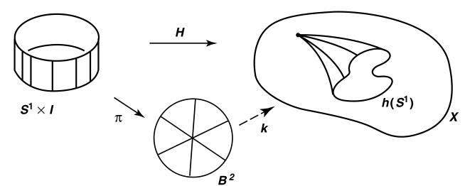
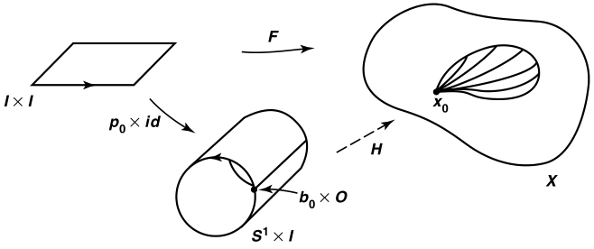
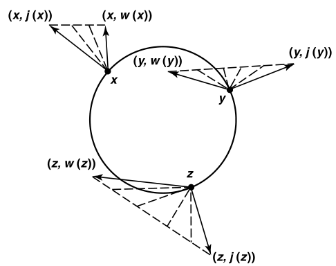
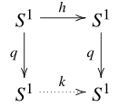
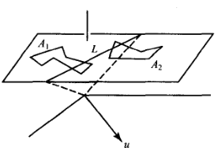
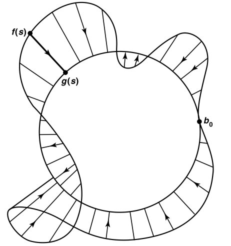
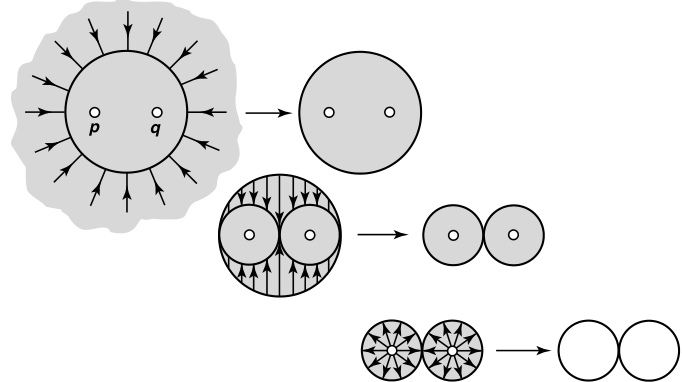
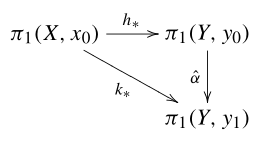
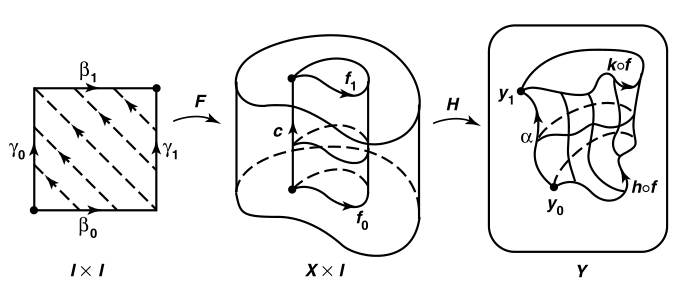
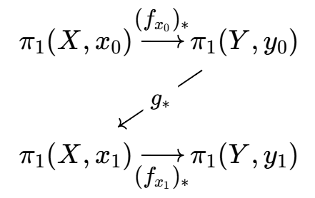

# 收缩

- **背景**：
  - 之前我们主要关注同伦的代数性质，即用它来诱导出基本群
  - 现在我们改为关注同伦的几何性质，即用它来衡量收缩
- **总结**：为了对流形进行拓扑上的分类，我们使用以下工具
  - 收缩把几何体“压扁”成图
  - 范坎彭定理把图“翻译”成群
  - 覆叠空间确保这种翻译是忠实且可逆的

## 收缩映射

- **收缩**：
  - 设 $A\subset X$
  - 若连续映射 $r:X\to A$ 满足 $r|_A = \text{id}_A$
  - 则称 $A$ 是 $X$ 的**收缩核**，$r$ 是**收缩映射**
  - $X$ 中 $A$ 保持不动，而其余部分逐渐消失
  - **实例**：
    - 粗体字母 $\mb A$ 可收缩为细体字母 $A$
    - 带柄的马克杯可收缩为杯身（甜甜圈）
  - **反例**：
    - 积投影 $X\times X\to X$ 不是收缩，因为 $X$ 不是 $X\times X$ 的子空间
      - 若改进为 $X\times X\to X\times \{0\}$ 则是收缩
    - 不交并投影 $X\bigsqcup X\to X$ 不是收缩，原因同上
      - 若改进为 $X\bigsqcup X\to X\bigsqcup X，(x,y)\mapsto (x,y_0)$ 则是收缩
- **收缩的泛性质**：
  - 设 $i:A\to X$ 是包含映射，则 $r:X\to A$ 是收缩 $\LR r\circ i = \text{id}$
  - 包含和收缩是互逆关系
  - **证明**：显然

### 存在性和唯一性

- **不可收缩空间**：不存在非平凡收缩核的拓扑空间
  - **实例**：
    - 单点空间
    - 欧氏空间 $\R^n$
    - 球面 $S^n$
    - 环面 $T^n$
- **收缩核不唯一性**
  - **反例**：
    - 二维圆盘 $B^2$ 自身是收缩核，它也可收缩为任意一个点、一条线段、一个二维图形
- **收缩不唯一性**：收缩核确定时，收缩不唯一
  - **反例**：
    - 二维圆盘 $B^2$ 可以均匀收缩为一个点，也可以让各个边界的收缩速度有快有慢，也可先扩张后再收缩为一个点

### 传递性

- 收缩只看结果不看过程，形变收缩才需要看过程
  - 下面的性质在加强为形变收缩后成立
- **保连通性**：若 $X$ 连通/道路连通，则其收缩核 $A$ 也连通/道路连通
  - **证明**：由连续映射保连通性直得
  - **反例（逆命题不成立）**：
    - 离散空间收缩到单点
    - 不交并投影
- **无保同伦性**：若 $f,g$ 同伦，则 $r\circ f$ 和 $r\circ g$ 不一定同伦
  - **反例**：
    - 拓扑正弦曲线收缩为自身、收缩为垂直线段
      - **连续性**：定义易得
      - **不保同伦性**：由于 $X$ 不道路连通，但 $A$ 道路连通，故不可能同伦

### 收缩的判伪方法

- **（引理55.1）收缩的基本群**：
  - 设 $A$ 是 $X$ 的收缩核
  - 则包含映射 $i:A\to X$ 诱导的基本群同态 $i_*: \pi_1(A,a)\to \pi_1(X,a)$ 是单射
  - 我们一般使用它来判伪，即验证 $i_*$ 不是单射
  - 本质是泛性质的直接推论。如果是形变收缩（双向泛性质），则是双射（同构）
  - **证明**：
    - 易得 $r\circ i = \text{id}_A$
    - 由诱导同态运算法则，$r_*\circ i_*:\pi_1(A,a)\to \pi_1(X,a)$ 也是恒等映射，从而 $i_*$ 只能是单射
  - **几何意义**：
    - 若不是单射，则存在两种内部连通性不同的环路（两种基本群），被映射后连通性相同（压缩成一种基本群）。显然不可能是收缩
- **（定理55.2）标准反例**： $S^1$ 不是 $B^2$ 的收缩
  - 但挖去某点后就是强形变收缩
  - **证明**：
    - 反设是收缩
    - 易得 $S^1$ 二连通，基本群是非平凡的。$B^2$ 单连通，基本群是平凡的。所以诱导同态不可能是单射，从而不可能是收缩

### 零伦和基本群

- **（引理55.3）标准零伦**：设 $h:S^1\to X$ 是连续映射（环路），则下面命题等价
  - $h$ 零伦
  - $h$ 可连续延拓为 $k:B^2\to X$
  - $h_*$ 是平凡同态
  - 零伦说明像可收缩成单点，但显然 $S^1$ 的任意环路都不能收缩，故只能是平凡同态
  - **证明**：$(1)\to (2)$
    - 设 $H:S^1\times I\to X$ 是零伦映射
    - 易得 $\pi:S^1\times I\to B^2，(x,t) \mapsto (1-t)x$ 是将圆周各点沿径向移动到圆心的映射，高度越高则移动越多
      - 其为闭的连续满射，也即商映射，核为 $S^1\times 1$
      - 则此时 $(k = H\circ\pi^{-1}):B^2\to X$ 即为 $h$ 的连续延拓
    - $k$ 首先将圆 $B^2$ 中每个圆环依次扩张后垒起，提升成高度为1的圆柱，然后将每个高度变为 $X$ 中的同伦变形过程，其中令最高处 $S^1\times 1$ 的像为常点，即符合零伦性，可作为 $h$ 的延拓
    
    **本质**：先将原图形提升至高维，然后建立高维同伦，从而导出低维映射。这里提升空间起到自由对象的作用
  - **证明**：$(2)\to (3)$：
    - 设 $j:S^1\to B^2$ 是包含映射，则 $h = k\circ j$，从而 $h_* = k_*\circ j_*$
    - 但已知 $j_*:\pi_1(S^1,b_0)\to \pi_1(B^2,b_0)$ 的像均同伦于平凡路，故为平凡同态
    - 而 $k_*:\pi_1(B^2,b_0)\to \pi_1(X,x_0)$ 的原像均同伦于平凡路，故也是平凡同态
    - 从而 $h_*$ 也是平凡的
    - 延拓和收缩都可将平凡性传递
  - **证明**：$(3)\to (1)$：
    - 设 $p_0:I\to S^1$ 是标准覆叠映射的收缩，由标准覆叠定义得其为 $S^1$ 的单圈 $b_0$ 环路，从而 $[p_0]$ 可生成基本群 $\pi_1(S^1,b_0)$
    - 设 $x_0 = h(b_0)$，由于 $h_*$ 是平凡映射，得 $f = h_*(p_0) =  h\circ p_0$ 是 $\pi_1(X,x_0)$ 的幺元（平凡路 $b_0$ 的同伦类），也即存在 $f$ 与（$X$ 上恒等映射 $X_{\text{id}}$ 在 $x_0$ 的限制）的道路同伦 $F:f\simeq_p X_{\text{id}}$
    - 再由 $p_0\times I_{id}:I\times I\to S^1\times I$ 是商映射，即闭的连续满射。它将平面卷成圆筒
      - 将平面两端 $0\times t，1\times t$ 均映射成 $b_0\times t$，其余为单射
      - 此时 $F$ 将 $0\times I，1\times I，I\times 1$ 均映射为 $x_0$
    - 此时的连续映射 $\Big(H = F\circ(p_0\times\text{id})^{-1} \Big):S^1\times I\to X$ 即为 $h$ 与 $e_{x_0}$ 的零伦映射
      - 每个圆周对应 $I\times I$ 中一条横线，对应 $X$ 中一个 $x_0$ 的较小环路
      - 圆周轨迹的零伦路从单点 $x_0$ 逐步扩张，直到 $S^1\times 1$（$x_0$ 的某环路）。此时其内部是单连通空间，也即扩张过程中始终保持零伦
    
  <!-- - **本质（零伦、收缩、基本群判别法，三者的关系）**：一个映射的像集可连续收缩为单点（零伦） $\LR$ 该映射下基本群的像均同伦于单点（平凡诱导同态） $\LR$ 该映射定义域等价于单连通空间（连续延拓/逆收缩） -->
- **单连通空间的零伦定义法**：$X$ 是单连通空间 $\LR$ 任意连续映射 $h:S^1\to X$ 都是零伦的
  - **证明**：显然

### 可收缩空间

- **可收缩空间**：
  - **零伦定义法**：恒等映射 $\text{id}$ 是零伦的空间
    - **实例**：
      - $[0,1],\R$
  - **收缩定义法**：任意单点集都是收缩核的空间
    - **证明（必要性）**：
      - 由零伦性，存在同伦映射 $F:X\times [0,1]\to X，\begin{cases} F(x,0) = x \\ F(x,1) = x_0 \end{cases}$
      - 此时 $r(x) = F(x,1)$ 就是收缩映射，收缩核为 $\{x_0\}$
    - **证明（充分性）**：
      - 已知 $(r\circ i) = \text{id}_{\{x_0\}}$，再由粘贴引理
- **关系定理**：可收缩空间 $\red\Rt$ 任意阶连通空间（**弱可收缩空间**）
  - **反例1**：三维球面 $S^2$ 单连通，但不是可收缩空间
    - **证明**：
      - 显然球面上任意环路都可收缩成一个点
      - 但它内部存在三维孔洞，无法在三维空间收缩成一个点
  - **反例2**：庞加莱空间是弱可收缩空间，但不是可收缩空间
    - **证明**：极难，略
    - 即使各个维度上都没有洞，也不一定能收缩成一个点
- **性质**：
  - **道路连通性**
    - **证明**：
  - **同伦类平凡性**：
    - 若 $Y$ 可收缩，则任意 $f:X\to Y$ 的映射同伦类只有一个元素
      - **证明**：
    - 若 $X$ 可收缩，$Y$ 道路连通，则任意 $f:X\to Y$ 的映射同伦类只有一个元素
      - **证明**：
    - 单连通只是道路同伦类平凡，可收缩则是映射同伦类平凡
- **（推论55.4）反例**：
  - 包含映射 $i:S^1\to \R^2\j \{0\}$ 不是零伦
  - 恒等映射 $\text{id}:S^1\to S^1$ 不是零伦
  - **证明**：
    - 已知存在收缩 $r:\R^2\j \{0\}\to S^1，x\mapsto \dfrac{x}{\|x\|}$（Minkowski泛函），则由收缩的基本群判定法，$i_*$ 是单射，即基本群非平凡，从而 $i$ 不是零伦。
    - 同理 $\text{id}_*$ 是恒等同态（单射），故基本群非平凡，从而 $\text{id}$ 不是零伦
  - **理解**：挖点平面和单位圆周都是二连通，故存在收缩关系，故映射不会退化为零伦
  - **本质**：
    - 收缩是将拓扑空间变为标准型（单连通 $\bs 0$，二连通 $S^1$，三连通……）的方法，可在判断零伦时进行简化

## 收缩的应用

### 几何应用

- **（定理55.5）刺猬定理**：$B^2$ 上的非零向量场，存在边界点 $x\in S^1$ 使得该点向量指向外侧或内侧
  - 向量场的定义见微分几何
  - **证明**：
    - 可设向量场为 $(x,v(x))$
      - 第一分量 $x$ 表示向量的起点
      - 第二分量 $v(x)$ 表示向量的方向
        - $v:B^2\to \R^2-\bold 0，x\mapsto v_1(x)\vec i + v_2(x)\vec j$ 是连续映射（本质是流形的坐标化，详见微分流形）
    - 设 $w$ 为 $v$ 在 $S^1$ 上的限制，易得其非平凡且连续
      - 由于 $w$ 可连续延拓到 $B^2$，由标准零伦引理得 $w$ 零伦
    - 选取 $F(x,t) = tx + (1-t)w(x)，x\in S^1$。由于 $w$ 信息不全，故 $F$ 的像集暂时未知
    - 若 $t\in (0,1)$ 时，存在 $F(x,t) = \bold 0$，则 $w(x) = \dfrac{t}{t-1}x$
      - 再由于 $\dfrac{t}{t-1}<0$，得此时 $w(x)$ 为指向圆周内侧的法向量（等式左侧的 $x$ 代表向量起点，等式右侧的 $x$ 代表位置向量，故 $w$ 就是 $x$ 上指向 $\vec x$ 反方向的向量，只不过长度不为1）
    - 若 $t\in (0,1)$ 时，总有 $F(x,t) \neq \bold 0$
      - 则此时陪域缩小为 $F:S^1\times I\to \R^2-\bd 0$
      - 设 $j:S^1\to \R^2-\bd 0$ 是包含映射，其将（单位圆周上的点）映射为（该点对应的坐标向量，即单位圆周的外法向量），则由下图可得直线同伦 $F:w\simeq j$，那么 $j$ 也零伦，但这与圆周上包含映射非零伦矛盾
      
    - 对于外侧向量，只需对 $(x,-v(x))$ 进行同样讨论即可
  - **理解**：
    - 已知内侧法向量不可直线同伦为外侧法向量（在途中会变成 $x$ 上的零向量）
    - 若不存在内侧法向量，则由向量场映射本身的性质，所有像均可直线同伦到外侧法向量上。再由向量场映射定义在单连通区域上，故其零伦于零映射（单连通区域收缩到 $\{\bd 0\}$ 时，其上的所有映射），从而外法向映射（包含映射）也零伦。但外法向映射的定义域不可收缩到 $\{\bd 0\}$（原点的法向方向无法定义），故产生矛盾，必须有一个向量让它们不能同伦
    - 向量场非零的目的在于（使同伦不会被内法向之外的其它零像打断）
  - **本质**：内侧法向量在包含映射和向量场映射之间的地位，就相当于 $\bd 0$ 在 $S^1$ 和 $B^2$ 之间的地位
- **（定理55.6）Brouwer不动点定理**：若 $f:B^2\to B^2$ 是连续映射，则其存在不动点
  - **证明**：
    - 反设 $\forall x\in B^2，f(x) \neq x$
    - 则此时 $v(x) = f(x)-x$ 构成非零向量场
    - 由于存在边界点 $x_0$ 拥有外法向量，得 $\exists a>0，f(x_0)-x_0 = ax_0$。但由于 $x_0$ 是边界点，此时 $x_0$ 超出 $f$ 定义域，故不可能存在 $x_0$，矛盾
  - **理解**：

### 分析应用

- **（定理55.8）泛函不动点定理**：存在 $\e>0$，使得 $T$ 的任意直径小于 $\e$ 的开覆盖 $\mc A$，$T$ 中存在点至少被三个 $\mc A$ 元素包含
  - **证明**：
    - 反设 $\mc A = \{U_1,...,U_n\}$ 是开覆盖，但不存在三个相交元素
    - 边界顶点排序：
      - 若 $U_i\cap \pa T$ 有两个边，设其顶点为 $v_i$
      - 若 $U_i\cap \pa T$ 只有一个边，设其任一顶点为 $v_i$
      - 若 $U_i\cap \pa T$ 不包含边，设 $v_i$ 为任意顶点
    - 设 $\{\phi_i\}$ 是依赖于 $\{U_i\}$ 的单位分解，$k:T\to\R^2，x\mapsto \sum\limits^n_{i=1} \phi_i(x)v_i$，易得其连续
    - 任取 $x\in T$，由假设，最多有两个 $\phi_i(x)\neq 0$
      - 若只有一个 $U_i$，则 $k(x) = v_i$
      - 若有两个 $U_i,U_j$，则 $k(x) = tv_i + (1-t)v_j$
    - 从而 $k(x)\in \pa T$，即 $k:T\to \pa T$，易得其将边界映射为自身
      - 设在边界上的限制为 $h$，其零伦，直线同伦于边界上恒等映射，但后者非零伦，矛盾

### 习题

- 若 $A$ 是 $B^2$ 的收缩核，则任意连续的 $ f:A\to A$ 均存在不动点
- 若 $h:S^1\to S^1$ 零伦，则其存在不动点和保对径点
- **收缩最小性**：收缩映射的诱导同态是满射

### 代数应用

- **（推论55.7）Frobenius定理**：三阶正数方阵的特征值全部为实数
  - **证明**：
    - 设 $T$ 是以三阶正数方阵 $A$ 为矩阵的线性变换，$B$ 是两个第一卦限中 $S^2$ 的交，易得其同胚于 $B^2$，从而连续映射存在不动点
    - 此时 $x$ 分量均非负，且至少有一个为正。再由 $A$ 为正，$T(x)$ 是非零向量场，从而此时 $x\mapsto \dfrac{T(x)}{\|T(x)\|}$ 是 $B$ 中连续映射，存在不动点 $x_0$
    - 则 $T(x_0) = \|T(x_0)\|x_0$ ，从而 $T$ 特征值全部为正
- **代数基本定理**：
  - 代数方法是数学归纳法 + 带余除法
  - 分析方法是刘维尔定理
  - 下面是拓扑方法
  - **证明**：
    - 考虑复平面上圆周映射 $f:S^1\to S^1，z\mapsto z^n$
    - $f_*$ 单射性
      - 设标准道路 $p_0:I\to S^1: s\mapsto e^{2\pi is}$
      - 则诱导同态 $(f_* = f\circ p_0):\R\to S^1，s\mapsto e^{2\pi i(ns)}$ 将 $p_0$ 覆叠的 $1$ 端点先映射到 $n$ 端点后再覆叠，显然是单射
    - $g:S^1\to \R^2-\bd 0，z\mapsto z^n$ 不是零伦
      - 取包含映射 $j:S^1\to \R^2-\bd 0$，则 $g_* = f_*\circ j_*$ 是单射
    - 当 $\sum\limits^{n-1}_{i=0} |a_i| < 1$ 时，在 $B^2$ 中有一个根
      - 反设无根，设 $k:B^2\to \R^2-\bd 0，z\mapsto \sum\limits^n_{i=0} a_nz^n$，$h$ 为其在 $S^1$ 上的限制，则 $h$ 零伦
      - 再设 $F:S^1\times I\to \R^2-\bd 0，(z,t)\mapsto z^n + t(...)$
        - 易得 $|F|>0$，其为 $g$ 和 $h$ 的同伦，这不可能
    - 取同解变换 $x = cy$，使得 $\sum\limits^{n-1}_{i=0} |\dfrac{a_i}{c^{n-i}}| < 1$ 即可推广到所有系数情况

### 拓扑应用

- **区域均分问题**：给定平面图形，用一条直线将它分成两个面积相等的部分

#### 对合空间

- **对合**：
  - 设 $X$ 是拓扑空间
  - 若存在连续映射 $\tau_X:X\to X$ 满足自逆性（$\tau_X\tau_X = \id_X$）
  - 则称 $X$ 具有**对合结构**，$\tau_X$ 称为**对合映射**
  - 对合结构本质是"空间的对称结构"，对合映射是描述这种结构的映射
    - 轴对称空间是单轴翻转，中心对称空间是对径点翻转
  - 对合映射也可以用置换群的作用来描述
    - 对合空间又称为 $\Z_2$ 空间，即恒等映射和非平凡对合映射组成二阶置换群
- **自由对合**：无不动点的对合
- **实例**：
  - **超球面**：$S^n$ 是具有对合结构的拓扑空间
    - **对合映射1**：180度旋转（中心对称）
    - **对合映射2**：超平面翻转（轴对称）
  - **环面**：$S^1\times S^1$
    - **对合映射1**：对径点翻转 $(z,w)\mapsto -(z,w)$
    - **对合映射2**：坐标交换 $(z,w)\mapsto (w,z)$
    - **对合映射3**：单轴翻转 $(z,w)\mapsto (-z,w)$
  - **复射影空间**：设 $\C P^n$ 是 $\C^{n+1}$ 中全体过原点的直线，取度量拓扑
    - **对合映射1**：共轭映射
    - **对合映射2**：对径点翻转、坐标交换、单轴翻转
  - **莫比乌斯带**：
    - **对合映射**：沿中心线翻转
- **对合范畴**：对象为对合空间，态射为保对径映射，恒等态射为恒等映射

#### 保对径映射

- **对径点**：若 $x,y$ 是某个对合映射的像与原象，则称为对径点
  - 同一条直径上的两个端点
  - **实例**：
    - 我们一般称超球面上 $x$ 的对径点为 $-x$
    - 按理来说，每个对合映射都对应一种对径点。但我们一般都将球面上的对径点定义为这个
- **保对径映射**：
  - **几何定义法**：将对径点映射为对径点的连续映射
  - **代数定义法**：对合空间的连续映射 $h:X\to Y$ 满足 $h\circ \tau_X = \tau_Y\circ h$
    - 这两个等价定义的本质其实就是范畴论的思想：保关系A的映射与生成关系A的映射可交换
      - "保xx性"是态射的定义，而"与xx交换"是交换图的定义。"保结构就是存在交换图"
  - **性质**：
    - **无连续性**：有理数和无理数之间跳跃
    - **复合传递性**：易得
    - **限制传递性**：易得
  - **实例**：
    - $S^n$ 中，满足 $h(-x) = -h(x)$ 的映射是保对径映射
- **（定理57.1）非零伦性**：$S^1$ 上的连续保对径映射非零伦
  - **证明**：
    - 设
      - $b_0 = (1,0)\in S^1$
      - 旋转映射 $\rho:S^1\to S^1$ 以 $b_0$ 为不动点
      - 已知 $\rho$ 保对径，故复合 $\rho\circ h$ 保对径
    - 设二倍角映射 $q:S^1\to S^1，z\mapsto z^2$
      - 显然其为商映射，将两个对径点压缩成一个，从而 $q\circ h(-z) = q\circ h(z)$
      - 由商映射的泛性质易得存在连续映射 $k:S^1\to S^1$ 使得 $k\circ q = q\circ h$
      
      - 由于 $b_0$ 是 $q,h$ 的不动点，故也是 $k$ 的不动点
    - 已知 $q$ 是覆叠映射
      - 设 $\wt f$ 是 $S^1$ 上 $b_0$ 到 $-b_0$ 的道路，则其为 $f = q\circ \wt f$ 的提升，从而 $f$ 是 $\pi_1(S^1,b_0)$ 的非平凡元素
      - 由交换图得 $k_*\Big( [f] \Big) = \Big[ k\circ (q\circ \wt f) \Big] = \Big[ q\circ (h\circ \wt f) \Big]$。由 $h$ 保对径性，$h\circ \wt f$ 依然是 $b_0\to -b_0$ 的道路，从而 $k_*\Big( [f] \Big)$ 是非平凡基本群
      - 已知 $S^1$ 的基本群是 $\Z$
        - 故 $k_*$ 是 $\Z$ 自同态，从而是单射
        - 而 $q_*$ 对应 $\Z$ 中 $2$ 倍运算，也是单射
        - 由 $k_*\circ q_* = q_*\circ h_*$，得 $h_*$ 也是单射，故非平凡。再由标准零伦定理即得 $h$ 非零伦
  - **理解**：
    - 核心是利用了二倍角映射
      - 由商映射的泛性质得交换图
      - 由覆叠映射性 + 交换图得到诱导同态的性质，再由标准零伦定理得到结论
- **（定理57.2）2-1超球面对径定理**：不存在连续保对径映射 $g:S^2\to S^1$
  - **证明**：
    - 由球面对称性，不妨设 $S^1$ 是赤道
    - 设 $g:S^2\to S^1$ 是连续保对径映射
      - 由限制传递性，$g|_{S_1}$ 也是连续保对径映射
      - 易得 $S^2$ 的上半球同胚于 $B^2$，再由于 $g$ 为 $h$ 连续延拓，得与标准零伦定理矛盾

#### 二维区域均分问题

- **（定理57.3）Borsuk-Ulam定理**：连续映射 $f:S^2\to \R^2$ 存在点 $x$ 满足 $f(x) = f(-x)$
  - **证明**：
    - 反设所有点都不满足，则此时 $g(x) = \cfrac{f(x)-f(-x)}{\|f(x)-f(-x)\|}$ 是良定义的。再易得其满足题设要求
- **（定理57.4）二分定理**：$\R^2$ 中任意两个有界多边形区域，都存在一条直线将其均分
  - **证明**：
    - 设在 $\R^3$ 中，$A_1,A_2$ 是两个 $\R^2\times 1$ 上的有界多边形区域
    - 设过原点的平面 $P$ 以单位向量 $u$ 为法向量
    - 设 $f_i(u)$ 为 $A_i$ 在 $P$ 分割下和 $u$ 同侧部分的面积，显然 $f_i(u) + f_i(-u) = A_i的面积$
    
    - 设 $F:S^2\to \R^2，u\mapsto (f_1(u),f_2(u))$
      - 易得它连续，故由B-U定理得存在 $F(u) = F(-u)$，即 $f_i(u) = \dfrac{1}{2}A_i的面积$，即此时 $P$ 是均分
- **广义二分定理**：有穷维向量空间中的Jordan可测集均可二分

## 形变收缩和强形变收缩

- **同伦不动点**：若在同伦过程中某点的像始终不变，则称为该同伦的不动点
  - 同伦不动点要求过程中始终不动
- **同伦不变点**：若在同伦开始和结束时，某点的像相同，则称为该同伦的不变点
  - 同伦不变点只要求首尾不变，中间可任意滑动

### 强形变收缩

- **强形变收缩**：
  - 设
    - $A\subset X$
    - $\text{id}_X$ 同伦于连续映射 $r:X\to A$
  - 若 $A$ 中都是同伦不动点
  - 则称 $A$ 是 $X$ 的**强形变收缩核**，同伦映射 $H$ 是**强形变收缩同伦**
- **泛性质定义法**：$i\circ r \simeq_A \text{id}_X$（同伦，且 $A$ 不动）
  - **证明**：显然
- **同伦定义法**：
  - 存在 $H:X\times I\to X$ 满足 $\begin{cases} H(x,0) = x， H(x,1) \in A & 收缩性 \\ H(a,t) = a & 同伦不动性\end{cases}$
  - **证明**：显然
  - **几何意义**：
    - 恒等映射 $i_X$ 的像连续移动成 $r$ 的像，且移动过程中 $A$ 上的点不动
    - 即 $A$ 外的点连续收缩到 $A$ 中，且 $A$ 内的点不变
- **实例**：
  - **经典包含收缩**：$\R^n\j \{0\}$ 强形变收缩为 $S^n$，收缩映射可用Minkowski泛函构造

### 形变收缩

- **形变收缩**：
  - 设
    - $A\subset X$
    - $\text{id}_X$ 同伦于连续映射 $r:X\to A$
  - 若 $A$ 中都是同伦不变点，且在同伦过程中始终在 $A$ 中
  - 则称 $A$ 是 $X$ 的**形变收缩核**，同伦映射 $H$ 是**形变收缩同伦**
  - 实际上（$r$ 同伦于恒等映射） + （$A$ 是同伦不变点） = （$r$ 是收缩映射）
    - 即形变收缩一定是收缩
- **泛性质定义法**：$\begin{cases} i\circ r \simeq \text{id}_X & 同伦性 \\ r\circ i = \id_A & 同伦不变性（收缩性） \\  \end{cases}$，且 $A$ 内的点始终在 $A$ 内
  - **证明**：
- **同伦定义法**：
    - 存在 $H:X\times I\to X$ 满足 $\begin{cases} H(x,0) = x ，H(x,1) \in A & 收缩性 \\ H(a,0) = H(a,1) = a & 同伦不变性 \\ H(a,t)\in A & 内部活动性\end{cases}$
    - **几何意义**：
      - 恒等映射 $i_X$ 的像连续移动成 $r$ 的像，且移动过程中 $A$ 上的点不动
      - 即 $A$ 外的点连续收缩到 $A$ 中。$A$ 内的点只在 $A$ 内活动，且收缩前后的位置不变

### 包含同构

- **（定理58.2）经典包含同构**：包含映射 $i:S^n\to \R^{n+1}\j \bd 0$ 的诱导同态是同构
  - 实际上 $S^n$ 是 $\R^n\j \bd 0$ 的强形变收缩
  - **证明**：
    - 设 
      - $b_0 = (1,0,...,0)$
      - $r(x) = \dfrac{x}{\|x\|}$
    - 易得 $r$ 是收缩映射，从而 $r\circ i = \id_{S^n}$，即 $r_*\circ i_*$ 是 $\pi_1(S^n,b_0)$ 的恒等同态。显然 $i_*$ 必须是单射
    - 再易得 $i\circ r\simeq \id_X$，同伦映射为 $H(x,t) = (1-t)x + t\dfrac{x}{\|x\|}$
      - 同伦过程如下图所示，显然它就是形变收缩过程
      
    - 显然 $H$ 非平凡，且由 $\|b_0\| = 1$ 得其为同伦不动点。则由基本群同构定理，$i_*\circ r_*$ 是 $\pi_1(X,b_0)$ 的恒等同态，显然 $i_*$ 必须是满射
    - 综上即得 $i_*$ 是同构
  - **理解**：
    - 由形变收缩性得到两个恒等的诱导同态，再由复合双射的性质得到 $i$ 的满射和单射性，从而得到双射性
- **（定理58.3）一般包含同构**：
  - 设 $A$ 是 $X$ 的强形变收缩核，$x_0\in A$
  - 则 $j:(A,x_0)\to (X,x_0)$ 的诱导同态是同构
  - **证明**：方法和经典包含同构相同
  - **实例**：
    - 设 $B$ 是 $\R^3$ 上的 $z$ 轴，则 $\R^3-B$ 的强形变收缩为 $(\R^2-\bd 0)\times 0$
      - 强形变收缩同伦为 $H(x,y,z,t) = (x,y,(1-t)z)$
      - 将平行于z轴的点
      - 故 $\R^3-B$ 存在无限循环的基本群
    - **双穿孔平面**：$\R^2-p-q$
      - 强形变收缩核为 $\t = S^1\cup (0\times [-1,1])$
      - 强形变收缩核为8字形空间
      
      - **推论**：两个空间不是彼此的强形变收缩，但基本群彼此同构
    

## 同伦等价

- **同伦逆**：
  - 设 $f:X\to Y，g:Y\to X$ 是连续映射
  - 若 $f\circ g$ 和 $g\circ f$ 分别同伦于 $\id_Y$ 和 $\id_X$，则称 $f,g$ 互为同伦逆
  - **实例**：
    - 形变收缩中，包含映射和收缩映射是同伦逆
  - **反例**：
    - 非形变的收缩中，包含映射和收缩映射可能不是同伦逆
- **同伦等价**：上面的 $X$ 和 $Y$ 是等价关系
  - **证明**：
    - **自反性**：易得 $\id_X$ 是自身的同伦逆，从而 $X$ 同伦等价于自身
    - **对称性**：显然
    - **传递性**：
  - **实例**：
    - 拓扑空间和形变收缩核
  - **反例**：
    - $X = S^1$，$A$ 是一段弧，前者基本群为 $\Z$，后者为 $\lang 0 \rang$，故不同伦等价
- **同伦型**：同伦等价类称为具有相同的同伦型

### 同伦型的基本群

- **（引理58.1）基本群相等定理**：
  - 设 $h,k:(X,x_0)\to (Y,y_0)$ 是连续映射
  - 若它们同伦，且 $x_0$ 是同伦不动点
  - 则诱导同态 $h_* = k_*$
  - 之前的连续映射保同伦性是 $h\circ f$ 和 $h\circ f'$ 仍然同伦
  - 这里是连续映射 $h,k$ 同伦 $\Rt h\circ f$ 和 $k\circ f$ 仍然同伦
  - 同伦不动点的作用只是防止"基点漂移"而已。后面的定理说明，如果没有这个条件，两基本群之间仍然是同构关系
  - **证明**：
    - 设 $h$ 和 $k$ 的同伦为 $H:X\times I\to Y$
    - 则设 $f$ 是 $X$ 上的 $x_0$ 环路，则由同伦的复合传递性，环路 $h\circ f$ 和 $k\circ f$ 彼此同伦
- **（引理58.4）基本群同构定理**：
  - 设 $\begin{cases} h:(X,x_0)\to (Y,y_0) \\ k:(X,x_0)\to (Y,y_1) \end{cases}$ 都是连续映射
  - 若存在同伦关系 $H:h\simeq k$
  - 则 $Y$ 中存在 $y_0\to y_1$ 的道路 $\a$ 满足 $k_* = \wh \a\circ h_*$，即此时 $\a(t) = H(x_0,t)$
  
  - **证明**：
    - 设 $f:I\to X$ 是 $x_0$ 的环路，$\begin{cases} f_0(s) = \Big( f(s),0 \Big) \\ f_1(s) = \Big( f(s),1 \Big)\\ c(t) = (x_0,t) \end{cases}$
      - 则 $\begin{cases} H\circ f_0 = h\circ f \\ H\circ f_1 = k\circ f \\ H\circ c = \a \end{cases}$
    - 设 $F:I\times I\to X\times I，(s,t)\mapsto (f(s),t)$，再设 $I\times I$ 的四条邻边如下，则 $\begin{cases} F\circ \b_0 = f_0 \\ F\circ \b_1 = f_1 \\ F\circ \g_0 = F\circ \g_1 = c \end{cases}$
    - 将下图四边粘合成两条路 $\b_0*\g_1，\g_0*\b_1$，由单连通性，两条路存在道路同伦 $G$，此时 $F\circ G$ 即为 $f_0*c，c*f_1$ 的道路同伦，从而 $H\circ F\circ G$ 即为 $(h\circ f)*\a$ 和 $\a*(k\circ f)$ 的道路同伦，由定义 $k_*[f] = \wh\a (h_*[f])$。再由 $f$ 任意性即得结论
    
    
- **（推论58.5）同伦映射的基本群性质传递**：
  - 若 $h,k:X\to Y$ 是同伦的连续映射，且 $\begin{cases} h(x_0) = y_0\\ k(x_0) = y_1 \end{cases}$
  - 则 $h_*$ 的单射性、满射性、平凡性均可传递到 $k_*$ 上
  - **证明**：
    - 此时两个基本群同构，可得诱导同态关系，再讨论即可
- **（推论58.6）零伦平凡性**：若 $h:X\to Y$ 零伦，则 $h_*$ 是平凡同态
  - **证明**：
    - 由零伦性得 $h$ 同伦于常映射，而常映射诱导平凡同态，再由传递定理即可
- **（推论58.7）同伦型基本群同构定理**：
  - 若 $f:(X,x_0)\to (Y,y_0)$ 是同伦等价
  - 则 $f_*:\pi_1(X,x_0)\to \pi_1(Y,y_0)$ 是同构
  - **证明**：
    - 设 $g$ 是同伦逆，则 $$(X,x_0) \xto{f} (Y,y_0) \xto{g} (X,x_1) \xto{f} (Y,y_1)$$
    - 此时诱导同态满足交换图
    $\whhh$ 
    - 由同伦逆定义，$g\circ f\simeq \id_X$，再由基本群同构定理，$(g\circ f)_*$ 是同构，故 $f_*$ 是满射
    - 由同伦逆定义，$f\circ g\simeq \id_Y$，再由基本群同构定理，$(f\circ g)_*$ 是同构，故 $f_*$ 是单射
    - 综上即得结论
  - **本质**：就是前面一般包含同构定理的方法，只不过更加一般化
  - **实例**：
    - 前面的包含同构就是最标准的例子

### 习题

- **Martin-Fuchs定理**：$X,Y$ 同伦等价 $\LR X,Y$ 分别同胚于某个空间 $Z$ 的两个形变收缩核
  - **证明**：初等工具即可，但极其复杂