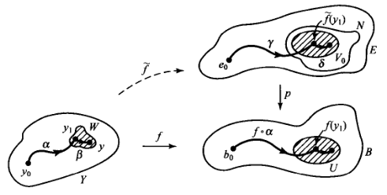
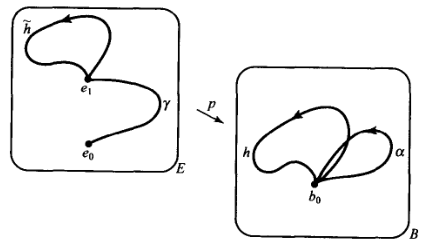
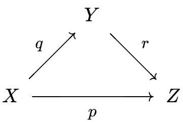
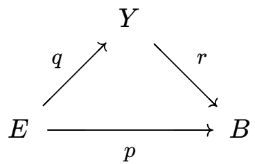
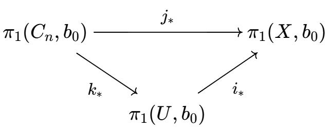
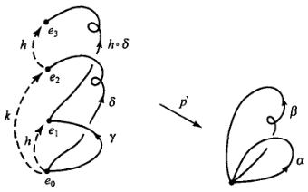
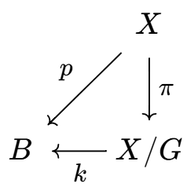
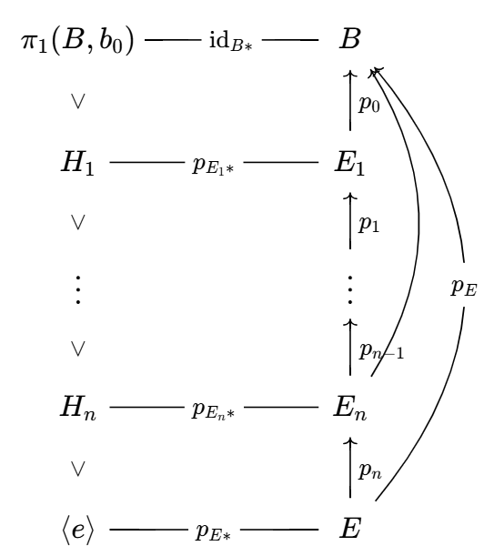

# 覆叠空间分类

- **符号约定**：
  - 默认 $E$ 和 $B$ 都是道路连通 + 局部道路连通空间
  - 默认 $H_0 = p_*\Big( \pi_1(E,e_0) \Big)$，即纤维置换作用的稳定子群
  - 设道路 $\g$ 的反向道路为 $\ol \g$

## 覆叠空间的等价

- **覆叠等价**：
  - 设 $\begin{cases} p:E\to B \\ p':E'\to B \end{cases}$ 是同一底空间的两个覆叠映射
  - 若存在同胚 $h:E\to E'$ 满足 $p = p'\circ h$
  - 则称两覆叠等价
- **（引理79.1）连续提升引理**：
  - 设
    - $p:(E,e_0)\to (B,b_0)$ 是覆叠映射
    - $f:(Y,y_0)\to (B,b_0)$ 是连续映射
  - 若 $Y$ 是道路连通 + 局部道路连通空间
  - 则
    - 存在提升 $\wt f:(Y,y_0)\to (E,e_0) \LR f_*\Big( \pi_1(Y,y_0) \Big) \subset p_*\Big( \pi_1(E,e_0) \Big)$
    - 该提升唯一
  - **证明（唯一性）**：
    - 任取 $y_1\in Y$ 和道路 $\a:y_0\to y_1$
      - 则 $f\circ \a$ 是 $B$ 中道路 $\b:b_0\to f(y_1)$
      - 则 $\wt f\circ \a$ 是 $E$ 中道路 $\g:e_0\to \wt f(y_1)$
    - 由定义得 $\g$ 是 $\b$ 的提升，再由道路提升的唯一性即得 $\wt f$ 唯一
  - **证明（必要性）**：
    - 由映射的缩小性直得 $\Im f_* = \Im (p_*\circ \wt f) \subset \Im p_*$
  - **证明（充分性）**：
    - **良定义性**：
      - 设 $\a,\b$ 是道路 $y_0\to y_1$
        - 只需证明提升后的终点相同即可
      - 设 $f\circ \a$ 被提升为道路 $\g:e_0\to \g(1)$
      - 设 $\ol \b$ 表示 $\b$ 的反向道路，则 $f\circ \ol\b$ 是以 $\g(1)$ 为起点的提升道路 $\d$
        - 只需证明 $\g*\d$ 是回路即可
      - 由题设包含关系，$f\circ (\a * \ol\b)$ 含于 $\Im p_*$，即它是 $E$ 中的回路
    - **连续性**：
      - 任取 $\wt f(y_1)$ 的邻域 $N$
        - 只需证明保邻域性，即存在 $y_1$ 的邻域 $W$ 满足 $\wt f(W)\subset N$
      - 任取 $f(y_1)$ 的道路连通邻域 $U$
        - 取覆叠片 $V_0\subset N$，由覆叠定义得限制 $p_0:V_0\to U$ 是同胚
        - 由 $Y$ 局部道路连通性 + $f$ 连续性，存在 $y_1$ 的道路连通邻域 $W$ 满足 $f(W)\subset U$
        - 在 $W$ 中任取道路 $\b$，则它被 $f$ 映入 $U$，再被 $p_0^{-1}$ 提升到 $V_0$ 中，从而终点含于 $N$。再由终点任意性即得 $\wt f(W)\subset N$
      
- **（定理79.2）覆叠等价判定定理**：
  - 设 $\begin{cases} p:(E,e_0)\to (B,b_0) \\ p':(E',e_0')\to (B,b_0) \end{cases}$ 都是覆叠映射
  - 则
    - 存在等价 $h:(E,e_0)\to (E',e_0') \LR H_0 = H_0'$
    - 该等价唯一
  - **证明**：由连续提升引理易得

### 覆叠等价的共轭判定法

- **（引理79.3）稳定子群共轭定理**：覆叠空间中，同一纤维上的稳定子群彼此共轭，且构成全部的共轭类
  - 设 $p:E\to B$ 是覆叠映射，$\{e_i\}\in p^{-1}(b_0)$
  - 则
    - 任取覆叠空间道路 $\g:e_0\to e_i$，设 $\a = p\circ\g$，则 $[\a]*H_i*[\a]^{-1} = H_0$
      - 即 $H_i,H_j$ 的共轭子是 $e_i,e_j$ 之间道路的像
    - 若 $H$ 和 $H_0$ 共轭，则存在 $e_i$ 使得 $H = H_i$
  - **证明（共轭性）**：
    - **左包右**：
      - 设 $[h]\in H_1$，则存在 $E$ 中的 $e_1$ 回路 $\wt h$ 满足 $[h] = p\ddkh{[\wt h]}$
      - 设道路 $\wt k = \g * \wt h * \ol \g$，则其为 $E$ 中的 $e_0$ 回路
      - 显然 $p\ddkh{[\wt k]} = [\a * h * \ol \a] = [\a]*[h]*[\a]^{-1}$，再由任意性即得 $\subset H_0$
      
    - **右包左**：
      - 对 $\ol \g : e_1\to e_0$ 和 $\ol \a = p\circ \ol \g$ 沿用上面结论即可
  - **证明（全部共轭类）**：
    - 设 $H$ 和 $H_0$ 共轭，则存在 $b_0$ 回路满足 $H_0 = [\a]*H*[\a]^{-1}$
    - 设 $\g:e_0\to e_i$ 是 $\a$ 的提升，则由共轭性即得 $H_0 = [\a]*H_i*[\a]^{-1}$
    - 由群运算的唯一性即得 $H = H_i$
- **（定理79.4）共轭判定法**：
  - 设 $\begin{cases} p:(E,e_0)\to (B,b_0) \\ p':(E',e_0')\to (B,b_0) \end{cases}$ 都是覆叠映射
  - 则 $p$ 和 $p'$ 等价 $\LR H_0$ 和 $H_0'$ 共轭
  - **证明**：
    - 由覆叠等价判定定理 + 稳定子群共轭定理直得结论

## 万有覆叠空间

- **万有覆叠空间**：满足单连通性的覆叠空间
- **（引理80.1）万有唯一定理**：同一底空间的万有覆叠空间都彼此等价
  - **证明**：
    - 此时覆叠空间的基本群平凡，再由进化定理得稳定子群平凡，从而都共轭
<!-- - **（引理80.2）覆叠空间分解定理**：
  - 设 $p:E\to B$ 是覆叠映射，$E_0$ 是 $E$ 的道路连通分支
  - 若 $B$ 连通 + 局部道路连通
  - 则限制 $p_0:E_0\to B$ 也是覆叠映射
  - **证明**：
    - 就是前面的覆叠空间分解定理 -->
- **（引理80.2）覆叠映射的复合传递定理**：
  - 设下图中都是连续映射和道路连通 + 局部道路连通空间
  
  - 若 $p,r$ 是覆叠，则 $q$ 是覆叠
  - 若 $p,q$ 是覆叠，则 $r$ 是覆叠
  - 若 $q,r$ 是覆叠，$r$ 的纤维都是有限集，则 $p$ 是覆叠
  - **证明1**：
    - **满射性**：
      - 任取 $y\in Y$，选取 $Y$ 中道路 $\wt \a:y_0\to y$，则 $\a = r\circ\wt \a$ 是 $Z$ 中的道路覆叠
      - 设 $\wt{\wt \a}$ 是 $\a$ 在 $X$ 中的道路提升，则 $q\circ \wt{\wt \a}$ 是 $\a$ 在 $Y$ 中的道路提升
        - 由道路提升唯一性即得 $\wt\a = q\circ \wt{\wt \a}$
        - 即 $q$ 将 $\wt{\wt \a}$ 的终点映射到 $\wt \a$ 的终点，再由终点任意性即得是满射
    - **覆叠性**：
      - 任取 $y\in Y$，设 $z = r(y)$，$U$ 是道路连通邻域
      - 设 $V$ 是 $r^{-1}(U)$ 中含有 $y$ 的覆叠片
        - 设 $\{U_\a\}$ 是 $p^{-1}(U)$ 的所有片，由连通性得 $q^{-1}(V)$ 是某些 $U_\a$ 的并
        - 易得 $q$ 将 $U_\a$ 和 $V$ 同胚起来
        - 由 $p_0,r_0$ 都是同胚，故 $q_0$ 也是同胚
  - **证明2**：
    - **满射性**：由 $p,q$ 满射性直得 $r$ 满射性
    - **覆叠性**：
      - 任取 $z\in Z$ 和邻域 $U$
      - 设 $\{V_\b\}$ 是 $r^{-1}(U)$ 的全体道路连通分支
      - $\{U_\a\}$ 是 $p^{-1}(U)$ 的所有片，显然它也是 $p^{-1}(U)$ 的全体道路连通分支
      - 由 $U_\a$ 连通性得总有 $q(U_\a)\subset V_\b$，即 $q^{-1}(V_\b)$ 是某些 $U_\a$ 的并
      - 由覆叠开遗传性 + 上个结论得 $q_0:U_\a\to V_\b$ 是覆叠映射。再由其满射性即得是同胚
      - 由 $p_0,q_0$ 都是同胚，故 $r_0$ 也是同胚
  - **证明3**：
- **（定理80.3）万有覆叠空间最大性**：
  - 设 $p:E\to B$ 是万有覆叠映射
  - 则对任意覆叠映射 $r:Y\to B$，存在覆叠映射 $q:E\to Y$ 满足 $r\circ q = p$
  
  - **证明**：
    - 由 $E$ 单连通性易得 $\Im p_* \subset \Im r_*$，故存在连续映射满足 $r\circ q = p$
    - 再由覆叠映射的复合传递定理即得结论

### 万有覆叠存在性判定

- **（引理80.4）万有判伪定理**：
  - 设 $p:(E,e_0)\to (B,b_0)$ 是万有覆叠映射
  - 则存在 $b_0$  的邻域 $U$ 满足包含映射 $i:U\to B$ 的诱导同态是平凡的
  - 它一般用于证伪
  - **证明**：
    - 设 $U$ 是 $b_0$ 邻域，$U_\a$ 是包含 $e_0$ 的覆叠片
    - 设 $f$ 是 $U$ 中的 $b_0$ 回路，则它可提升为 $e_0$ 回路 $\wt f$
    - 由单连通性得 $\wt f$ 零伦
      - 设零伦映射为 $\wt F$，则 $p\circ \wt F$ 是 $B$ 中零伦映射
      - 再由标准零伦定理，诱导同态平凡
- **夏威夷耳环定理**：夏威夷耳环满足道路连通性 + 局部道路连通性，但不存在万有覆叠空间
  - **证明**：
    - 显然对任意 $n$ 都存在收缩 $r_n:X\to C_n$ 满足 $\forall i\neq n，r(C_i) = b_0$
    - 取充分大的 $n$ 满足 $C_n\subset U$，则下列交换图中 $j_*$ 是单射，此时 $i_*$ 不可能平凡
  

## 覆叠变换

- **覆叠变换（Deck变换）**：覆叠空间到自身的覆叠等价映射
  - 注意它要求是覆叠等价，即只能是纤维内部的置换，不能发生纤维之间的整体置换
- **覆叠变换群**：全体覆叠变换构成一个群 $\Deck(E,p,B)$
  - **证明**：
    - **含幺性**：显然恒等映射是覆叠变换
    - **运算封闭性**：易得满足复合传递性，故运算封闭
    - **可逆性**：易得满足逆传递性，故可逆
- **覆叠变换群对应**：$\Psi:\Deck(E,p,B)\to F$，若 $h(e_0) = e_1$，则 $\Psi(h) = e_1$
  - 显然每个 $\Psi$ 都依赖给定点 $e_0$
  - 它本质就是覆叠变换的取值映射
  - **单射性**：
    - 不同覆叠变换在任意点的像都不相同
    - 覆叠变换是各个纤维内部的置换。再由于 $E$ 道路连通，它只能将层之间整体置换
    - **证明**：
      - 反设覆叠变换 $h_1,h_2$ 在 $e_0$ 处相同，但在 $e_1$ 处不同
      - 由道路连通性，可取 $\g:e_0\to e_1$，再由提升对应得它是某个道路的提升，但此时 $h_1(\g)$ 和 $h_2(\g)$ 是同一个空间 $E$ 中两个不同的提升道路，与道路提升唯一性矛盾
- **符号约定**：
  - $F$ 表示纤维 $p^{-1}(b_0)$
  - $\Phi$ 表示 $\pi_1(B,b_0)$ 的广义提升对应 $\pi_1(B,b_0)/H_0\to F$，此时它是双射
  - $\Psi$ 表示 $\pi_1(B,b_0)$ 的覆叠变换群对应
  - $H_0$ 表示 $p_*\ddkh{\pi_1(E,e_0)}$
  - $N(H_0)$ 表示 $H_0$ 在覆叠变换群中的正规化子

### 两种置换作用的关系

- **（引理81.1）置换相同性**：$\Psi\ddkh{\Deck(E,p,B)} = \Phi\ddkh{N(H_0)/H_0}$
  - 覆叠变换在纤维上的置换作用 = 广义提升对应在部分纤维上的置换作用
    - 因为提升对应是完全自由的，而覆叠变换必须同时也是层置换
  - **证明**：
    - 设 $\Phi$ 将 $b_0$ 回路映为道路 $\a:e_0\to e_1$
    - 由稳定子群共轭定理，$[\a]*H_1*[\a]^{-1} = H_0$
    - 由覆叠等价判定定理，覆叠变换 $h:(E,e_0)\to (E,e_1)$ 存在 $\LR H_0 = H_1$
    - 综上即得 $h$ 存在 $\LR [\a]\in N(H_0)/H_0$
- **（定理81.2）作用同构性**：$\Phi^{-1}\Psi:\Deck(E,p,B)\to N(H_0)/H_0$ 是群同构
  - **证明**：
    - **双射性**：由 $\Phi$ 双射性 + $\Psi$ 单射性直得
    - **同态性**：
      - 设 $\begin{cases} h:(E,e_0)\to (E,e_1) \\ k:(E,e_0)\to (E,e_2) \end{cases}$ 是两个覆叠变换，则 $\begin{cases} \Psi(h) = e_1 \\ \Psi(k) = e_2 \end{cases}$
      - 设 $E$ 中的道路 $\begin{cases} \g:e_0\to e_1 \\ \d:e_0\to e_2 \end{cases}$ 的底层道路为 $\begin{cases} \a = p\circ \g \\ \b = \d\circ \d \end{cases}$，则此时 $\begin{cases} \Phi\ddkh{[\a]H_0} = e_1 \\ \Phi\ddkh{[\b]H_0} = e_2 \end{cases}$
      - 设 $e_3 = h\circ k(e_0)$，则 $\Psi(h\circ k) = e_3$，只需证 $\Phi\ddkh{[\a*\b]H_0} = e_3$
      - 易得 $\g * h(\d)$ 是道路 $\a*\b$ 的提升 $e_0\to e_3$，从而得到结论
      

### 正则覆叠空间

- **正则覆叠映射**：
  - 设 $p:(E,e_0)\to (B,b_0)$ 是覆叠映射
  - 若 $H_0\lhd\pi_1(B,b_0)$，则称为正则覆叠映射
  - 由覆叠变换对应的单射性，一个点正规等价于所有点都正规
  - 易得此时广义提升对应 $\Phi$ 和覆叠变换对应 $\Psi$ 完全相等，都是双射
- **（推论81.3）正则传递定理**：正则覆叠空间 $\LR$ 对任意 $e_1,e_2\in F$，存在覆叠变换 $h:(E,e_1)\to (E,e_2)$
  - 正则覆叠空间中，覆叠变换的作用是传递的（任意两层都可被覆叠变换置换）
  - **证明（必要性）**：
    - 此时 $N(H_0) = \pi_1(B,b_0)$，即广义提升对应和覆叠变换对应完全相等
    - 再由广义提升对应的双射性直得结论
  - **证明（充分性）**：
    - 此时覆叠变换对应是双射，即底空间回路的全体真道路提升都满足 $[\a]\in N(H_0)/H_0$，再加上假道路提升即得 $\pi_1(B,b_0) = N(H_0)$
- **（推论81.4）万有变换定理**：万有覆叠空间满足 $\Deck(E,p,B)\cong \pi_1(B,b_0)$
  - **证明**：
    - 已知万有覆叠空间中 $H = \lang e \rang$，显然它是正则覆叠空间，从而得到结论

### 覆叠空间范畴

- **轨道空间**：
  - 设 $X$ 是拓扑空间，$G$ 是 $X$ 自同胚群的子群
  - 若取等价 $x\sim g(x)$，则商空间称为轨道空间 $X/G$
- **纯不连续作用**：
  - 设 $X$ 是拓扑空间，$G$ 是自同胚群
  - 若任意点都存在邻域 $U$ 使得 $g(U)$ 和 $U$ 无交
  - 则称该作用为纯不连续的
  - **实例**：
    - $X$ 是覆叠空间，$G$ 是相应的覆叠变换群
- **（定理81.5）商正则覆叠定理**：
  - 设 $X$ 道路连通 + 局部道路连通，$G$ 是自同胚群
  - 则商映射 $\pi:X\to X/G$ 是覆叠映射 $\LR G$ 是纯不连续作用
    - 此时 $\pi$ 是正则覆叠映射，$G$ 是覆叠变换群
  - **证明**：
- **（定理81.6）商正则覆叠的泛性质**：
  - 设 $p:X\to B$ 是正则覆叠映射，$G$ 是覆叠变换群
  - 则存在同胚 $k:X/G\to B$ 满足 $p = k\circ \pi$
  

### 反例

- **覆叠变换对应不是满射**：

## 覆叠空间分类定理

- **半局部单连通**：
  - 设 $B$ 是拓扑空间
  - 若对任意 $b\in B$，存在邻域 $U$ 使得包含映射的诱导同态 $i_*$ 是平凡的
  - 则称 $B$ 是半局部单连通的
- **（定理82.1）伽罗瓦对应定理**：
  - 设 $B$ 道路连通 + 局部道路连通 + 半局部单连通
  - 则对于 $\pi_1(B,b_0)$ 的任意子群 $H$，都存在覆叠映射满足 $\Im p_* = H$
  - 即每个子群 $H$ 都对应一个覆叠空间 $E$
  - **证明**：太长了
- **万有覆叠存在定理**：拓扑空间 $B$ 存在万有覆叠空间 $\LR B$ 是道路连通 + 局部道路连通 + 半局部单连通的
  - **证明**：由伽罗瓦对应定理，此时存在覆叠映射满足 $\Im p_*\lang e \rang$，即诱导同态平凡。此时该覆叠空间就是万有覆叠空间

### 伽罗瓦对应链

- **覆叠空间的伽罗瓦反序对应链**：
  - 已知覆叠映射的诱导同态是单射，再由伽罗瓦对应定理即得在对应子群上是满射，从而是一一对应
  - 通过列举对应链，我们就能将性质足够好的空间 $B$ 的全体覆叠空间进行分类
  - 在抽象代数中，伽罗瓦理论也能帮我们分析 $K$ 到代数闭包 $\ol K$ 的所有中间域

- **对应定理**：
  - 域的相对维数 $\LR$ 覆叠空间的相对叶数
  - 伽罗瓦群的子群 $\LR$ 基本群的子群
  - 伽罗瓦扩张 $\LR$ 正则覆叠映射
  - 稳定中间域 $\LR$ 正则覆叠空间
  - **指数对应**：（覆叠空间的相对叶数）=（子群的相对指数），即 $[E_i:E_j] = [H_i:H_j]$
  - **全闭性**：$E$ 是所有覆叠空间的正则覆叠空间
  - **伽罗瓦正规性**：$E$ 是 $B$ 的正则覆叠空间 $\LR H\lhd \pi_1(B,b_0)$