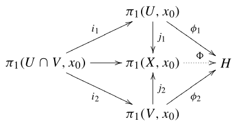
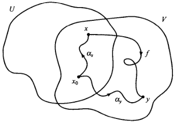
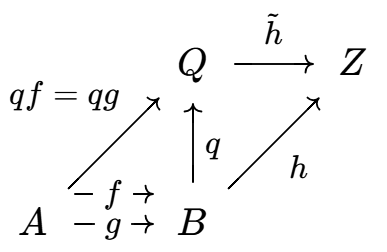
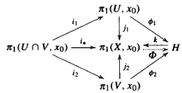

# 范坎彭定理

- **背景**：
  - 范坎彭定理分为现代形式（范畴论思想）和古典形式（构造主义）
  - 古典形式是“自下而上”的
    - 它试图用砖块（群元素）和水泥（关系）来搭建房子（基本群）。这很直观，但一旦房子建得极高，砖块的细节就不再重要了。
  - 现代形式是“自上而下”的
    - 它直接画出房子的蓝图（泛性质）。只要你的结构符合这张蓝图，你就是这栋房子。至于你用的是木头还是钢筋混凝土（具体的群构造），并不影响这栋房子的功能。

## 现代形式

- **（定理70.1）Seifert-van Kampen定理**：
  - 设
    - $X = U\cup V$ 是两个开集的并，$U\cap V$ 道路连通，$x_0\in U\cap V$
    - $H$ 是群，$\begin{cases} \phi_1:\pi_1(U,x_0)\to H \\ \phi_2:\pi_1(V,x_0)\to H \end{cases}$ 是同态
    - $i_1,i_2,j_1,j_2$ 是包含映射的诱导同态
    
  - 若 $\phi_1\circ i_1 = \phi_2\circ i_2$
  - 则
    - 存在唯一同态 $\Phi:\pi_1(X,x_0)\to H$ 满足 $\begin{cases} \Phi\circ j_1 = \phi_1 \\ \Phi\circ j_2 = \phi_2 \end{cases}$
    - $\pi_1(X,x_0) \cong \cfrac{\pi_1(U,x_0)*\pi_1(V,x_0)}{N}$
      - 其中 $N$ 是 $\hkh{j_{1*}(\g)j_{2*}(\g)^{-1}\Bigm| \g\in U\cap V}$ 生成的（自由积的正规子群）
      - 商去 $N$ 就是将 $U\cap V$ 中的基本群取等
- **本质**：
  - （$X$ 的基本群）是（拓扑卡 $U,V$ 的基本群）的带关系自由积，$\phi_1,\phi_2$ 是典范单同态
    - 如果 $U\cap V$ 单连通，则 $N$ 平凡，故自由积无需带关系

### 存在性证明

- **符号约定**：
  - $[f]$ 表示 $X$ 中的道路同伦类。若 $f\subset U$，则 $[f]_U$ 表示 $U$ 中的道路同伦类
  - 所有基本群默认都在 $x_0$ 上，故都省略它

#### 回路映射

- **回路映射 $\rho$**：
  - **定义域**：$U$ 和 $V$ 中的全体回路
  - **陪域**：$H$
  - **指派法则**：$f\mapsto \begin{cases} \phi_1\Big( [f]_U \Big) & f\subset U \\\\ \phi_2\Big( [f]_V \Big) & f\subset V \end{cases}$
- **保运算性**：若 $f,g$ 都在 $U$ 或 $V$ 中，则 $\rho(f*g) = \rho(f)\rho(g)$
  - **证明**：由 $\phi_1,\phi_2$ 的同态性直得

#### 道路映射

- **道路映射 $\sigma$**：
  - **定义域**：$U$ 和 $V$ 中的全体道路
  - **陪域**：$H$
  - **指派法则**：
    - 对全体 $x\in X$，取道路 $\a_x:x_0\to x$ 为 $\begin{cases} 常值道路 & x=x_0 \\ U\cap V中的道路 & x\in U\cap V \\ U 中的道路 & x\in U\j V \\ V中的道路 & x\in V\j U \end{cases}$
    - 设 $f$ 是道路，起点为 $x$，终点为 $y$
      - 则 $L(f) = \a_x * f * \ol \a_y$ 是回路，再取 $\sigma(f) = \rho\Big( L(f) \Big)$ 即可
    
- **延拓性**：$\sigma$ 是 $\rho$ 的保运算延拓
  - **证明（延拓性）**：
    - 设 $f$ 是回路，则此时 $L(f) = e_{x_0}*f*\ol e_{x_0}$，即道路同伦于 $f$
    - 由 $\rho$ 的保运算性即得 $\rho\Big( L(f) \Big) = f$，从而此时 $\sigma(f) = \rho(f)$
  - **证明（良定义性）**：
    - 设 $f,g$ 在 $U$ 或 $V$ 中彼此道路同伦，则易得 $L(f),L(g)$ 也道路同伦，即满足单值性
  - **证明（保运算性）**：
    - 易得 $L(f*g)$ 在 $U$ 或 $V$ 中道路同伦于 $L(f)*L(g)$
    - 再由 $\rho$ 的保运算性即可
  
#### 全道路映射

- **全道路映射 $\tau$**：
  - **定义域**：$X$ 中的全体道路
  - **陪域**：$H$
  - **指派法则**：
    - 设 $f$ 是道路
      - 由于 $X = U\cup V$，故存在 $[0,1]$ 的分划 $s_0 < ... < s_n$ 使得 $f$ 将任意小段映射到 $U,V$ 中
      - 设 $l_i$ 是 $[0,1]\to [s_{i-1},s_i]$ 的正线性映射，$f_i = f|_{[s_{i-1},s_i]}\circ l_i$
        - 显然它是 $U,V$ 中的道路，满足 $[f] = [f_1]*...*[f_n]$
    - 取 $\tau(f) = \sigma(f_1)...\sigma(f_n)$ 即可
- **良定义性**：
  - **证明（唯一性）**：只需证明 $\tau$ 与分划的选取方式无关，即插入新划分点时值不变。它是容易验证的
  - **证明（单值性）**：
- **保运算性**：
  - **证明**：
    - 设 $f*g$ 是道路，取 $[0,1]$ 中包含 $s_k = \dfrac{1}{2}$ 的分划
    - 当 $i = 1,...,k$ 时
      - 设 $\begin{cases} l_i^1:[0,1]\to [s_{i-1},s_i] \\\\ l^2_i:[0,1]\to [2s_{i-1},2s_i] \end{cases}$ 都是正线性映射
        - 因为是前半段，所以取 $2$ 倍后仍在陪域中
      - 易得 $l_i^1\circ (f*g) = l_i^2\circ f$，设为 $f_i$
    - 当 $i = k+1,...,n$ 时
      - 设 $\begin{cases} l_i^1:[0,1]\to [s_{i-1},s_i] \\\\ l^2_i:[0,1]\to [2s_{i-1}-1,2s_i-1] \end{cases}$ 都是正线性映射
      - 因为是后半段，所以减去 $1$ 实际就是反向对称
      - 易得 $l_i^1\circ (f*g) = l_i^2\circ g$，设为 $g_{i-k}$
    - 将分划 $s_0,...,s_n$ 应用到 $f*g$ 得 $$\tau(f*g) = \sigma(f_1)...\sigma(f_k)\cdot \sigma(g_1)...\sigma(g_{n-k})$$
    - 将分划 $2s_0,...,2s_k$ 应用到 $f$ 得 $$\tau(f) = \sigma(f_1)...\sigma(f_k)$$
    - 将分划 $2s_k-1,...,2s_n-1$ 应用到 $g$ 得 $$\tau(g) = \sigma(g_1)...\sigma(g_{n-k})$$

#### 基本群映射

- **基本群映射**：$\Phi\Big( [f] \Big) = \tau(f)$
  - **同态性**：
    - **证明**：由保运算性直得
  - **典范性**：
    - **证明**：设 $f$ 是 $U$ 中回路，则 $\Phi\circ j_1\Big( [f]_U \Big) = \Phi\Big( [f] \Big) = \tau(f) = \rho(f) = \phi_1\Big( [f]_U \Big)$

### 唯一性证明

- **证明（唯一性）**：
  - 由拓扑卡基本群定理，$\pi_1(X,x_0)$ 完全由 $j_1,j_2$ 生成，从而 $\Phi$ 完全由它们决定，故唯一

### 带关系的自由积证明

- **余等化子**：
  - 设范畴 $\mc C$ 中，$f,g:A\to B$ 是态射
  - 若态射 $q:B\to Q$ 满足
    - **等化条件**：$qf = qg$
    - **泛性质**：对任意对象 $Z$ 和满足等化性的态射 $h:B\to Z$，存在唯一的态射 $\wt h:Q\to Z$ 使得 $h = \wt hq$
  - 则 $(Q,q)$ 称为 $f,g$ 的的余等化子
  
  - 寻找最小的商对象 $Q$ 使得其中 $f,g$ 的像相等
- **群范畴的余等化子**：$Q = B/N$，其中 $N$ 是由 $\hkh{f(a)g(a)^{-1}\Bigm| a\in A}$ 生成的正规子群
  - **证明**：
- **共合积**：
- **群范畴的共合积**：$Q = B/N$，其中 $B$ 是余积，$N$ 是...
- **自由积性证明**：
  - 此时已满足余积的泛性质
    - $\Phi$ 是泛态射
    - $\phi_1,\phi_2$ 是分量态射
    - $j_1,j_2$ 是典范嵌入
  - **余等化子性**：$\phi_1\circ i_1$ 和 $\phi_2\circ i_2$ 是两个平行映射，它们的余等化子
  - 再由群范畴的共合积直得结论

## 古典形式

- **（定理70.2）S-V-K定理（古典形式）**：
  - 条件同现代版本
  - 设 $j:\pi_1(U,x_0)*\pi_1(V,x_0)\to \pi_1(X,x_0)$ 是可延拓为 $j_1,j_2$ 的同态
  - 则
    - $j$ 是满射
    - $\ker j$ 是 $\hkh{ i_1(g)^{-1}i_2(g) \Bigm| g\in \pi_1(U\cap V,x_0)}$ 生成的最小正规子群
  - **证明（满射性）**：
    - 前面已知 $\pi_1(X,x_0)$ 是 $j_1,j_2$ 的像生成的，故是满射
  - **证明（左包右）**：
    - 由于核是正规子群，故只需 $i_1(g)^{-1}i_2(g) \in \ker j$ 即可
    - 设 $i:U\cap V\to X$ 是包含映射，则由交换图易得 $$ ji_1(g) = j_1i_1(g) = i_*(g) = j_2i_2(g) = ji_2(g) $$
    - 即 $i_1(g)$ 和 $i_2(g)$ 在 $j$ 下的像相同，从而得到结论
  - **证明（右包左）**：
    - 由上个结论 + 同构基本定理，$k:\cfrac{\pi_1(U,x_0)*\pi_1(V,x_0)}{N}\to \pi_1(X,x_0)$ 是满同态。故只需 $k$ 是单射，即有左逆
    - 将定义域简写为 $H$
      - 设 $\phi_1:\pi_1(U,x_0)\to H$ 是包含映射和商映射的复合，同理得到 $\phi_2$
      - 我们证明存在下面的交换图
      
      - $\phi_1\circ i_1 = \phi_2\circ i_2$
        - **证**：由左包右得 $\phi_1i_1(g) = i_1(g)N = i_2(g)N = \phi_2i_2(g)$
      - $\Phi$ 存在
        - **证**：由现代形式的范坎彭定理直得
      - $\Phi\circ k = \id_H$
        - **证**：
          - 显然只需讨论生成元即可
          - 设 $g\in U$ 或 $V$，则由定义 $k(gN) = j(g) = j_1(g)$
          - 故 $\Phi\circ k(gN) = \Phi\circ j_1(g) = \phi_1(g) = gN$

## 范坎彭定理的特殊情况

- **（推论70.3）交集单连通情况**：
  - 取范坎彭定理的条件
  - 若 $U\cap V$ 单连通，则存在同构 $k:\pi_1(U,x_0)*\pi_1(V,x_0)\to \pi_1(X,x_0)$
  - **证明**：
    - 由单连通性，$\pi_1(U\cap V,x_0)$ 平凡，故 $N$ 平凡
- **（推论70.4）拓扑卡单连通情况**：
  - 取范坎彭定理的条件
  - 若 $V$ 单连通，则存在同构 $k:\pi_1(U,x_0)/N \to \pi_1(X,x_0)$
    - 其中 $N$ 是 $\Im i_1$ 的最小正规子群
  - **证明**：
    - 由单连通性，$\pi_1(V,x_0)$ 平凡，故 $N$ 退化为 $\Im i_1$ 的最小正规子群
