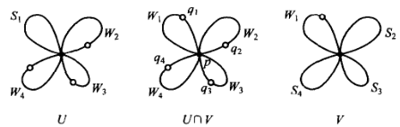
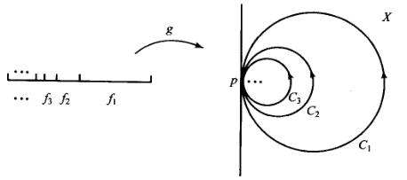

# CW复形的基本群

- **前置知识**：代数拓扑（同调论）的胞腔复形章节
- **背景**：
  - 有了范坎彭定理后，我们可以把复杂的拓扑流形分成一些彼此黏合的经典流形（复形），然后计算它们的基本群
  - 但是具体怎么划分也是值得研究的问题。在无穷情况下，如果粘贴方式太差，就会导致一些问题
  - 所以我们使用"CW复形"工具，即用胞腔作为基本结构，再对它的粘贴方式用CW性质进行约束

## 圆楔

- **楔和（单点并）**：一族（相交于同一点的拓扑空间）的并
- **圆楔**：
  - 设 $X$ 是T2空间，且同胚于 $S^1$ 的子空间 $\{S_n\}$ 的并
  - 若 $\exists p\in X$ 使得 $\forall i\neq j，S_i\cap S_j = \{p\}$
  - 则 $X$ 是圆楔
  - 圆的楔和，满足T2性
  - 有限情况下，T2性等价于CW性。但无穷情况下，必须额外声明
- **复形性**：圆楔是有限CW复形
  - $n$ 个 $1$ 维闭胞腔（闭区间）的两端都黏到同一个 $0$ 维胞腔上
  - **证明**：
    - **构造**：
      - 显然 $X^{(0)} = \{p\}$
      - 取 $\{e^1_i\}^n_{i=1}$，定义附着映射 $\p_i:\pa D^1\to X^0，\{-1,+1\}\mapsto \{p\}$
        - 显然它就是 $S_i$
      - 即 $X = X^{(0)}\cup e_1^1 \cup ... \cup e^1_n$
    - **C条件**：
      - 显然每个闭胞腔只与自身和 $p$ 两个胞腔相交
    - **W条件**：
      - 设 $A\subset X$ 满足 $\forall i$，$A\cap S_i$ 是 $S_i$ 中闭集
      - 由子空间闭集反射性，它也是 $X$ 中闭集
      - 易得 $A = (A\cap S_1)\cup ... \cup (A\cap S_n) \cup p$，由单点集是闭集 + 闭集并传递性即得 $A$ 是 $X$ 中闭集
- **（定理71.1）圆楔的基本群**：
  - 设 $X$ 是 $\{S_n\}$ 的圆楔，$p$ 是公共点
  - 则
    - $\pi_1(X,p)$ 是自由群
    - 若 $f_i$ 是 $\pi_1(S_i,p)$ 的生成元，则 $f_1,\cdots,f_n$ 是 $\pi_1(X,p)$ 的生成元
  - **证明（归纳法）**：
    - 当 $n=1$，$X$ 退化为圆周，结论显然成立
    - 当 $n$ 以下均成立
      - 设 $q_i$ 是 $S_i$ 上异于 $p$ 的点，$W_i = S_i\j q_i$
      - 设 $\begin{cases} U = S_1\cup W_2 \cup ... \cup W_n \\ V = W_1\cup S_2\cup ...\cup S_n \end{cases}$，则 $U\cap V = W_1\cup ...\cup W_n$
        
        - 由同胚性易得 $U,V$ 道路连通，故 $U\cap V$ 道路连通
      - 由定义得 $W_i$ 同胚于开区间，故任意点都是强形变收缩核
        - 设 $F_i$ 是 $W_i$ 到 $p$ 的强形变收缩映射
        - 易得全体 $F_i$ 可粘贴成 $U\cap V$ 到 $p$ 的强形变收缩 $F$
        - 故 $U\cap V$ 是单连通空间，再由范坎彭定理，$\pi_1(X,p)$ 是自由积，从而是自由群
      - 由定义得 $S_1$ 是 $U$ 的强形变收缩核，$S_2\cup ...\cup S_n$ 是 $V$ 的强形变收缩核
        - 由圆周基本群的性质，$\pi_1(U,p)\cong \Z$，生成元设为 $f_1$
        - 同理归纳可得 $\pi_1(V,p)$ 是 $\Z$ 的自由积，生成元设为 $f_2,...,f_n$

### 无穷圆楔

- **无穷圆楔**：
  - 设 $X$ 是T2空间，且同胚于 $S^1$ 的子空间 $\{S_\a\}_{\a\in A}$ 的并
  - 若
    - $\exists p\in X$ 使得 $\forall i\neq j，S_i\cap S_j = \{p\}$
    - $X$ 的拓扑是 $\{S_\a\}$ 的凝聚拓扑
  - 则 $X$ 是无穷圆楔
- **（引理71.2）复形性**：无穷圆楔是CW复形
  - **证明**：
    - **构造**：同有限情况
    - **C条件**：同有限情况
    - **W条件**：由定义直得
- **（定理71.3）无穷圆楔的基本群**：
  - 设 $X$ 是 $\{S_\a\}$ 的圆楔，$p$ 是公共点
  - 则
    - $\pi_1(X,p)$ 是自由群
    - 若 $f_\a$ 是 $\pi_1(S_\a,p)$ 的生成元，则 $\{f_\a\}$ 是 $\pi_1(X,p)$ 的生成元
  - **证明**：
    - 设 $i_\a:\pi_1(S_\a,p)\to \pi_1(X,p)$ 是包含映射的诱导同态，像是 $g_\a$
    - 若 $f$ 是 $X$ 中以 $p$ 为基点的回路，由CW性得它是紧集，故存在有限个 $S_\a$ 覆盖它
      - 由有限圆楔基本群定理即得 $\{g_\a\}$ 生成 $\pi_1(X,p)$
    - 若 $f,g$ 是 $X$ 中道路同伦的回路，则存在有限个 $S_\a$ 覆盖它们，且 $f,g$ 在其中也道路同伦
      - 由有限圆楔基本群定理即得 $i_\a$ 都是单同态
    - 反设 $\pi_1(X,p)$ 中存在非空单位元 $w = g_1...g_n$，则对应道路 $f$ 零伦，故存在有限子空间中零伦，与有限圆楔基本群定理矛盾
  - **反例（非凝聚的无穷圆楔）**：
    - **夏威夷耳环**：设 $C_n$ 是 $\R^2$ 中以 $(\dfrac{1}{n},0)$ 为圆心，$\dfrac{1}{n}$ 为半径的圆周，$X$ 是它们的并
    
    - **证明**：
- **（引理71.4）圆楔存在性**：对任意指标集 $J$，存在 $X$ 是 $\{S_\a\}_{\a\in J}$ 的圆楔 
  - **证明**：
    - **构造**：
      - 在 $J$ 上取离散拓扑
      - 设 $E = S^1\times J$ 是积拓扑空间
      - 取 $b_0\in S^1$
        - 将 $P = b_0\times J$ 粘成一点 $p$
        - 设 $\pi:E\to X$ 是商映射，取 $S_\a = \pi(S^1\times \a)$
    - **同胚性**：
      - 设 $C$ 是 $S^1\times \a$ 中闭集
        - 若 $b_0\times \a\notin C$，则 $\pi^{-1}\pi(C) = C$，是 $E$ 中闭集
        - 若 $b_0\times \a\in C$，则 $\pi^{-1}\pi(C) = C\cup P$，是 $E$ 中闭集
      - 即 $\pi(C)$ 是 $X$ 中闭集
      - 由并传递性得 $S_\a$ 是 $X$ 中闭集
      - 易得 $\pi$ 在 $S^1\times \a$ 上是单射，故限制 $\pi_\a$ 是闭的连续双射，从而是同胚
    - **凝聚性**：
      - 设 $D\subset X$ 满足 $\forall \a，D\cap S_\a$ 是 $S_\a$ 中闭集
      - 易得 $\pi^{-1}(D)\cap (S^1\times \a) = \pi_\a^{-1}(D\cap S_\a)$
      - 由同胚性得右边是 $S^1\times \a$ 中闭集，故 $\pi^{-1}(D)$ 是 $E$ 中闭集。再由商拓扑定义即得 $D$ 是 $X$ 中闭集

## 二维胞腔复形

## 小丑帽