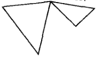

# 单纯复形

- **背景**：
  - 取定维度时，单纯形是结构最简单的凸集，没有多余的顶点和边
- **符号约定**：
  - $\{a_0,...,a_n\}$ 表示几何独立集
  - $P$ 表示仿射空间，$\sigma$ 表示单纯形
  - 单纯形默认都为有限维，$v$ 表示顶点，$s$ 表示面，$t_i(x)$ 表示重心坐标

## 单纯形

- **几何独立集**：
  - 设 $\{a_0,...,a_n\}$ 是 $\R^N$ 中的点集
  - 若 $\forall t_i\in \R$ 都有 $\begin{cases} \sum\limits^n_{i=0} t_i = 0 \\\\ \sum\limits^n_{i=0} t_ia_i = 0 \end{cases} \red\Rt t_0 = ...  = t_n = 0$，则称为几何独立集
  - 几何意义就是不位于同一个 $n$ 维空间上的 $n+1$ 个点
- **仿射空间**：$n+1$ 阶几何独立集的仿射包称为 $n$ 维仿射空间
  - 仿射组合是系数域为 $\R$，且系数之和唯一的线性组合
  - 仿射包是全体仿射组合构成的空间
  - **实例**：
    - $1$ 维仿射空间是直线
    - $2$ 维仿射空间是平面
    - $3$ 维仿射空间是三维空间
- **单纯形**：$n+1$ 阶几何独立集的凸包称为 $n$ 维单纯形
  - 凸组合是系数域为 $\R^+$，且系数之和唯一的线性组合
  - 凸包是全体凸组合构成的空间
  - **实例**：
    - $1$ 维单纯形是线段
    - $2$ 维单纯形是三角形
    - $3$ 维单纯形是四面体
- **重心坐标**：单纯形的凸包表示的系数 $(t_0,...,t_n)$
  - 几何意义就是单纯形重心（中线交点）的坐标
  - **连续性**：重心坐标是连续函数

### 单纯形的基本性质

- **有界闭凸集性（紧凸集性）**
- **唯一性**：单纯形和几何独立集（顶点集）一一对应
  - **证明**：
    - 显然给定几何独立集时，它们张成的凸包唯一，故单纯形唯一
    - 给定单纯形时，它的顶点集唯一，将其取为几何独立集即可
    - 注意非顶点集也可能是几何独立集，所以必须明确对应到顶点
- **遗传性**：（$\{a_0,...,a_n\}$ 张成的单纯形）是（全体 $a_0$ 与（$\{a_1,...,a_n\}$ 张成的单纯形）的连线）的并集
  - **证明**：由凸包的定义易得
- **面**：顶点集的子集张成的单纯形
  - 这里是广义的面（可以是任意维数的）
- **边界**：单纯形全体面的并 $\Bd\sigma$
  - 实际上就是集合的边界
- **内部**：$\Int\sigma = \sigma-\Bd\sigma$

### 单纯形的拓扑性质

- **保边界同胚**：一个同胚，在定义域的边界上也是同胚
  - 这其实是个非常好的性质
    - 连续映射只能保内部，不能保边界
    - 即使空间同胚、边界也同胚，这两个同胚也可能不是延拓关系
- **凸集保边界同胚定理**：
  - 设 $U$ 是 $\R^n$ 中有界凸集，则存在 $\ol U\to B^n$ 的保边界同胚$w\in U$
  - **引理**：
    - 设 $w\in U$，则以 $w$ 为起点的射线都与 $\Bd U$ 恰好交于一点
    - **证**：
      - 设 $r$ 是射线
        - 易得 $r\cap U$ 是有界凸集，且在 $r$ 中是开集，写为 $\{w+tp\mid t\in (0,a)\}$
        - 即它与 $\Bd U$ 交于 $x = w+ap$
      - 反设存在另一交点 $y$
        - 不妨设 $y = w+bp$，则 $x = (1-t)w + ty$
        - 变形得 $w = \cfrac{x-ty}{1-t}$
          - 取 $y_n\to y$，显然对应的 $w_n\to w$，故存在 $w_N\in U$，从而 $x\in U$，但这与凸性矛盾
    - 其实本质是个泛函分析的定理
  - **定理证明**：
    - 不妨设 $w = \bs 0$
    - 取 $f(x)  =\cfrac{x}{\|x\|}$，则由引理得 $f$ 可限制为 $\Bd U$ 和 $S^{n-1}$ 的双射
      - 即把凸集的边界沿径向收缩为单位球面，且满足线性（扩张速度恒定）
    - 由于 $\Bd U$ 是有界闭集，故是紧集，从而该双射是同胚
    - 设 $G(x) = \begin{cases} \norm{f^{-1}(\dfrac{x}{\|x\|})} x & x\neq \bs 0 \\\\ \bs 0 & x = \bs 0\end{cases}$，显然它就是保边界同胚
      - 即把单位球面沿径向扩张为凸集，且满足线性（扩张速度恒定）
- **单纯形同胚定理**：存在同胚 $f:\sigma\to B^n$，且 $f$ 在边界上也是同胚 $\Bd\sigma \to S^{n-1}$
  - **证明**：由凸集保边界同胚定理直得
  

## 单纯复形

- **单纯复形**：设 $K$ 是单纯形的集族，若满足以下性质，则称为单纯复形
  - **向下封闭性**：$K$ 中单纯形的面也在 $K$ 中
  - **交集正则性**：$K$ 中任意两个单纯形的交都是空集或公共面
    - 单纯形只能紧贴对齐排列，不能角顶边、插入内部、紧贴的两面不对齐
    - 但是可以两角互顶，即共享一个顶点
  
- **判定定理**：交集正则性 $\LR$ 内部不相交性
  - **证明**：定义易得
- **顶点封闭性**：若 $v$ 是某个单纯形的顶点，则它只能是其它单纯形的顶点或外点
  - **证明**：定义易得

### 多面体

- **子复形**：若单纯复形的子集族满足向下遗传性，则也是单纯复形
- **骨架 $K^{(p)}$**：设单纯复形 $K$ 的子复形由 $p$ 维及以下的所有单纯形组成，则称为 $K$ 的 $p$ 维骨架
  - **实例**：
    - 顶点集是零维骨架
    - 全体棱 + 全体顶点是一维骨架
    - 全体面 + 全体棱 + 全体顶点是二维骨架
- **底空间（可剖空间）**
  - 设 $|K|$ 是 $K$ 的全体单纯形之并
  - 若
    - 对每个单纯形取欧氏拓扑
    - $A$ 在 $|K|$ 中是闭集 $\LR \forall \sigma\in K$，$A\cap \sigma$ 在 $\sigma$ 中是闭集
      - 实际上就是泛函分析中的弱拓扑，导出映射为包含映射 $i_\sigma:\sigma\to |K|$
      - 子空间拓扑只有在子空间是闭集时才有闭集反射性，而包含映射的弱拓扑是满足闭集反射性的最细拓扑
  - 则 $|K|$ 构成拓扑空间，称为 $K$ 的底空间
  - 单纯复形 $K$ 是集族，而底空间 $|K|$ 是具有拓扑的点集
- **多面体**：单纯复形的可剖空间
  - **存在性**：单纯复形的任意子复形都是可剖的
  - **实例1**：
    - 设 $K$ 是全体整数区间 $[m,m+1]$、正分数区间 $[\dfrac{1}{n+1},\dfrac{1}{n}]$、这两种单纯形的所有面组成的单纯复形
      - 底空间 $|K|$ 作为集合等于 $\R$，但作为拓扑空间不等于 $\R$
      - 因为 $\hkh{\dfrac{1}{n}\mid n\in\N}$ 在 $|K|$ 中是闭集，但在 $\R$ 中不是
  - **实例2**：
    - 设 $\sigma_i = [0,\dfrac{1}{i}]$，$K$ 是全体 $\sigma_i$ 和其顶点组成的单纯复形
      - 底空间 $|K|$ 和开抛物线弧 $\{(x,x^2)\mid x>0\}$ 的交集在 $|K|$ 中是闭集，但子空间拓扑上以 $0$ 为外部极限点，故不是闭集
- **凝聚拓扑**：
  - 设 $X$ 是拓扑空间，$\ms C$ 是子空间集族，并集为 $X$
  - 若 $A$ 是 $X$ 中闭集 $\LR \forall C\in\ms C$，$A\cap C$ 是 $C$ 中闭集
  - 则称为凝聚拓扑
  - 凝聚拓扑就是前面说的包含映射族的弱拓扑（另一个例子是不交并拓扑）
  - 它就是使包含映射连续的最细拓扑（越细的拓扑越容易让映射不连续，但同时构造性质也越好）
  - 一般来说，复形的拓扑都要求是凝聚拓扑

### 多面体的性质

- **子多面体的闭性**：若 $L$ 是 $K$ 的子复形，则 $|L|$ 是 $|K|$ 的闭子空间
  - 只需证明闭遗传性和闭反射性即可
  - **证明**：
    - 设 $A$ 是 $|L|$ 中闭集
      - 设 $\sigma$ 在 $L$ 中的面为 $s_i$。由弱拓扑定义，$A\cap s_i$ 在 $|L|$ 中是闭集
      - 再由于 $A\cap \sigma$ 是有限并，故它在 $\sigma$ 中是闭集
      - 再由弱拓扑定义即得 $A$ 在 $|K|$ 中是闭集
    - 设 $B$ 是 $|K|$ 中闭集
      - 由弱拓扑定义，$B\cap \sigma$ 在 $\sigma$ 中是闭集
      - 取样法易得 $B\cap |L|$ 在 $|L|$ 中是闭集
- **凝聚性1**：$f:|K|\to X$ 连续 $\LR \forall \sigma\in K$，$f|_\sigma$  连续
  - **证明**：
    - **必要性**：由连续的限制传递性直得
    - **充分性**：
      - 设 $C$ 是 $X$ 中闭集，则 $f^{-1}(C)\cap \sigma = (f|_\sigma)^{-1}(C)$，从而是 $\sigma$ 中闭集
      - 再由弱拓扑定义即得 $f^{-1}(C)$ 是 $|K|$ 中闭集，故连续
- **多面体的重心坐标**：
  - 设 $x\in |K|$，则 $x$ 必定在某个单纯形 $\sigma$ 内部
  - 设 $x$ 关于 $\sigma$ 的顶点 $v$ 的凸组合系数为 $t_v(x)$，则全体多面体顶点组成重心坐标向量
  - 这个向量只在 $\sigma$ 顶点处非零
- **T2性**：$|K|$ 是豪斯多夫空间
  - **证明**：
    - 设 $x_0 \neq x_1$，则存在顶点 $v$ 使得 $t_v(x_0) \neq t_v(x_1)$
    - 设 $r$ 在两数之间，则由重心坐标连续性，水平集 $\{x\mid t_v(x) < r\}$ 和 $\{x\mid t_v(x) > r\}$ 就是不相交邻域
- **紧性定理**：
  - 若 $K$ 有限，则 $|K|$ 是紧空间
    - 有限大的多面体才是紧的，无限大的多面体非紧
    - **证明**：
      - 已知单纯形是紧集，故 $|K|$ 是紧子空间 $\sigma$ 的有限并，从而也是紧集
  - 设 $A$ 是 $|K|$ 中紧集，则 $A$ 在某个有限子复形 $K_0$ 的多面体 $|K_0|$ 中
    - 多面体中
    - **证明**：
      - 反设 $A$ 不在任何有限子复形的多面体中
      - 对于每个非空的 $A\cap \Int s$，选取代表元 $x_s$，则 $B = \{x_s\}$ 是离散的无限集
      - 由单纯形的有限维性，$B\cap \sigma$ 都是有限点集，故 $B$ 是闭集
      - 由 $B$ 的闭性和离散性得它无极限点，再由 $B$ 的无限性即得与凝聚定理矛盾

### 特殊的子空间

- **星形**：设 $v$ 是 $K$ 的顶点，则 $\mathop{\bigcup}\limits_{v\in \sigma} \Int \sigma$ 称为 $v$ 在 $K$ 中的星形 $\St(v,K)$
  -  $K$ 中全体（以 $v$ 为顶点的单纯形的内部）的并集
  - **开性**
  - **补集可剖性**：
    - **证明**：显然星形的补集是单纯形的并集，从而是 $K$ 的子复形
  - **道路连通性**：易得
- **闭星形**：星形的闭包 $\ol\St(v,K)$
  - **道路连通性**：易得
- **链环**：星形的边界 $\Lk(v,K)$
  - **无连通性**
  - **可剖性**：
- **局部有限单纯复形**：任意顶点都只属于有限多个单纯形
  - 即闭星形都是某个（局部有限子复形）的可剖空间
- **局部有限定理**：$K$ 是局部有限的 $\LR |K|$ 是局部紧的
  - **证明**：
    - **必要性**：
      - 单纯形有界 + $K$ 局部有限 = 闭星形均有界，从而闭星形都是紧集
      - 设 $x\in K$，则存在顶点 $v$ 满足 $x\in \St(v,K) \subset \ol\St(v,K)$，故 $|K|$ 是局部紧的
    - **充分性**：

## 单纯映射

- **单纯映射**：
  - 设 $K,L$ 都是单纯复形，$f:K^{(0)}\to L^{(0)}$ 是顶点映射
  - 若 $f$ 保邻接（将任意单纯形的全部顶点都映射为某个单纯形的顶点）
    - $f$ 保证两个彼此邻接的顶点在映射后仍然邻接
    - $f$ 可以不是单射或满射
  - 则存在 $g:|K|\to |L|，\sum\limits^n_{i=1} t_iv_i \mapsto \sum\limits^n_{i=1} t_if(v_i)$，称为 $f$ 诱导的单纯映射
- **基本性质**：
  - **保单纯形性**：$g$ 将单纯形映射为单纯形
    - **证明**：
      - 已知单纯形等价于顶点凸包，再由 $f$ 保连接性即可
  - **连续性**：$g$ 是连续的
    - **证明**：
      - 设 $A$ 是 $|L|$ 中闭集，则它在每个单纯形上都是闭集，从而在 $\R^n$ 中是闭集的并
      - 由 $g$ 保单纯形性 + 指派法则得 $g^{-1}(A)$ 包含全部边界点，从而在 $\R^n$ 中是闭集，即在每个单纯形上也是闭集，从而在 $L$ 中是闭集
  - **复合传递性**：
    - **证明**：定义易得
- **单纯同胚**：
  - 若 $f$ 是保组合的顶点集双射（将单纯形的全部顶点映射为单纯形的全部顶点）
    - $v_1,...,v_n$ 张成单纯形 $\LR f(v_1),...,f(v_n)$ 张成单纯形
  - 则它诱导的单纯映射 $g$ 是同胚
  - **证明**：
    - 设 $h$ 是 $f^{-1}$ 诱导的单纯映射，则由单纯映射的复合传递性易得 $hg(x) = h\dkh{\sum\limits^n_{i=1} t_if(v_i)} = \sum\limits^n_{i=1} t_if^{-1}f(v_i) = x$
- **单纯复形范畴**：对象是全体单纯复形，态射是单纯映射
- **$n$-单纯形复形**：$\D^n$ 表示单个 $n$ 维单纯形组成的单纯复形
  - **层级结构**：任意两个单纯形的顶点集都几何独立，可张成单纯形（子复形）
    - **证明**：显然
- **标准嵌入定理**：对任意有限单纯复形 $K$，都存在 $\D^n$ 使得 $K$ 同构于它的子复形
  - **证明**：
    - 设 $v_0,...,v_n$ 是 $K$ 的顶点
    - 任取几何独立集 $a_0,...,a_n$，它们张成一个单纯形复形，则 $f(v_i) = a_i$ 诱导的单纯映射就是同构

### 一般单纯复形

- **一般单纯复形**：
  - 设 $\R^J$ 是取一致度量拓扑的无穷维欧氏空间
  - 设 $E^J$ 是有限维子空间，则其中的单纯形、单纯复形、多面体称为一般的
- **一般化定理**：有限维单纯复形的任意结论都可推广到一般情况
- **$J$-单纯形复形**：$\D^J$ 表示 $E^J$ 中由标准基 $\{e_\a\}$ 的有限子集张成的单纯形全体