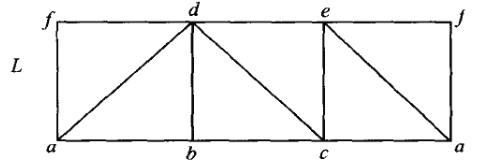
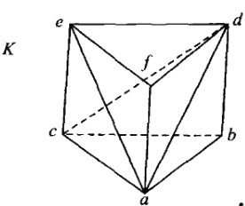
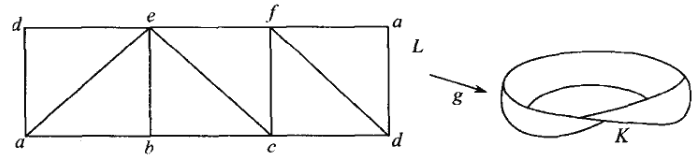
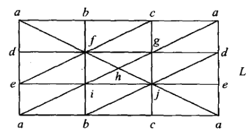
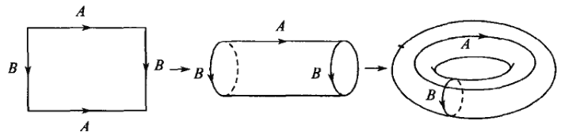
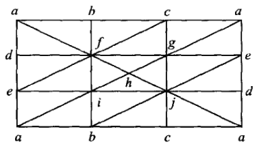
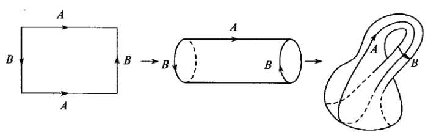
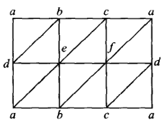
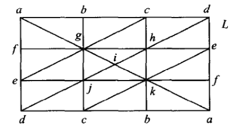

# 单纯复形的同调群

## 抽象单纯复形

- **抽象单纯复形**：
  - 设 $\ms S$ 是非空有限集的集族
  - 若 $A\in \ms S \red\Rt A$ 的任意非空子集都属于 $\ms S$
  - 则 $\ms S$ 称为抽象单纯复形，$A$ 称为 $\ms S$ 的单纯形
  - 即满足向下封闭性的集族
  - 这是纯代数的定义，它不关心单纯复形的几何性质（交性质）
- **面**：$A$ 的非空子集
- **顶点**：$A$ 中的单点集
- **维数**：
  - 抽象单纯形 $A$ 的维数是 $|A|-1$
    - 与几何单纯形维数的定义相同
  - 抽象单纯复形 $\ms S$ 的维数是 $\max \dim A$
    - 最大单纯形所在空间的维数
- **子复形**：满足抽象单纯复形条件的 $\ms S$ 子集族
- **同构**：满足保组合性的顶点集双射

### 顶点格式

- **顶点格式**：设 $K$ 是单纯复形，则全体（能张成 $K$ 中单纯形的顶点集）称为 $K$ 的顶点格式 $\ms K$
  - **抽象性**：顶点格式是抽象单纯复形
    - **证明**：定义易得
- **同构定理**：单纯复形同构 $\LR$ 顶点格式同构
  - **证明**：定义直得
- **几何实现**：若 $K$ 的顶点格式与 $\ms S$ 同构，则 $K$ 称为 $\ms S$ 的几何实现
- **标准嵌入定理**：抽象单纯复形都同构于某个单纯复形的顶点格式
  - **证明**：
    - 设 $V$ 是 $\ms S$ 的顶点集，$\D^J$ 是 $J$-单纯形复形
    - 取 $J$ 充分大使得 $f:V\to \{e_\a\}_{\a\in J}$ 是单射，则取 $K$ 为（$\ms S$ 中全体抽象单形的顶点在 $f$ 下的像）张成的一般单形复形
      - 显然 $f$ 是 $\ms S$ 和 $K$ 的顶点格式的同构

### 实例

- **三棱柱**：
  - 由 $6$ 个二维单纯形（三角形）组成单纯复形 $L$，再给顶点取标记
    - 注意左右两侧都各有一个 $f$ 和 $a$
  - 单纯映射（商映射）$g:L^{(0)}\to K^{(0)}$ 将顶点 $f$ 彼此黏合、$a$ 彼此黏合，就得到单纯复形 $K$
  - $L$ 的顶点格式为 $\hkh{\{a,f,d\},\{a,b,d\},\{b,c,d\},\{c,d,e\},\{a',c,e\},\{a',e,f'\}}$
  - $K$ 的顶点格式为 $\hkh{\{a,f,d\},\{a,b,d\},\{b,c,d\},\{c,d,e\},\{a,c,e\},\{a,e,f\}}$
  - $L$ 的对角线可以随意取，但会影响 $L$ 的邻接结构，从而影响 $K$ 的拼接结构。同调群的计算方式也会变化

- **莫比乌斯带**：
  - 由 $6$ 个二维单纯形（三角形）组成单纯复形 $L$
    - 为什么这里仍然需要三个矩形拼接呢？只取一个不行吗？
    - 事实上在实际应用中，我们是先在立体图形 $|K|$ 上取单纯复形 $K$，然后再将它展平为 $L$。所以必须保证黏合后仍然是单纯复形
      - 如果我们只用一个矩形，那么黏合后会出现"环边"，即只有一个顶点的边
      - 如果我们只用两个矩形，那么黏合后会出现"重边"，即两顶点之间有两条边
      - 上面两种情况都不是单纯复形，故必须至少三个矩形
    - 另一种理解方式
      - 因为三角形是边数最少的平面闭合图形（二维单纯形）。我们要取的莫比乌斯带从侧面看是闭合的，所以侧面必须至少三个矩形才行（变成三棱柱后同胚到圆环）
  - 单纯映射（商映射）$g:L^{(0)}\to K^{(0)}$ 将顶点 $a,a'$ 黏合、$d,d'$ 黏合，就得到单纯复形 $K$
    - 注意这里的黏合方向变了，发生了扭转

- **环面**：
  - 由 $9$ 个二维单纯形（三角形）组成单纯复形 $L$
    - 这里要取两个方向的黏合，所以每个方向都要三个矩形
    - 实际上还有更加简便的剖分方法，只不过会有些难理解。九宫格是计算同调群最方便的
  - 单纯映射（商映射）$g$ 黏合方式如下

- **克莱因瓶**：
  - 由 $9$ 个二维单纯形（三角形）组成单纯复形 $L$
    - 这里要取两个方向的黏合，所以每个方向都要三个矩形
  - 单纯映射（商映射）$g$ 黏合方式如下
    - 它其实就是四维形式的莫比乌斯带。莫比乌斯带无法嵌入二维，克莱因瓶也无法嵌入三维
    - 由J-B定理，只有可定向的无边紧曲面能嵌入低维，显然上面两种曲面不可定向

### 保单纯复形的条件

- **标记法导出复形**：
  - 给定有限复形 $L$
  - 取满射函数 $f$ 将 $L$ 的顶点集映射为符号集
  - 取以这些符号为顶点的抽象复形 $\ms S$，使得 $f$ 是保邻接满射。
  - 设 $K$ 是 $\ms S$ 的几何实现，则 $f$ 扩张为满单纯映射 $g$
  - $f$ 称为 $L$ 的**顶点标记法**，$g$ 称为该标记法的**黏合映射**，$L$ 决定 $K$
- **满子复形**：
  - 设 $L$ 是单纯复形，$L_0$ 是子复形
  - 若 $L$ 中任意（顶点全部位于 $L_0$ 中）的单纯形都在 $L_0$ 中
  - 则 $L_0$ 称为 $L$ 的满子复形
  - **实例**：
    - 一般来说 $|L|$ 是有限维空间的多面体，$L_0$ 是边缘
    - 上面的环面和克莱因瓶例子中，矩形 $L$ 的边缘是满子复形
  - **反例**：
    - 上面的三棱柱和莫比乌斯带例子中，矩形 $L$ 的边缘不是满子复形
- **防坍塌定理**：
  - 设 $L$ 是单纯复形，$f$ 是顶点标记法，$g:|L|\to |K|$ 是黏合映射，$L_0$ 是满子复形
  - 若 $v,w$ 是 $L$ 取同一标记的顶点 $\red\Rt v,w\in L$  且 $\ol\St(v,L)$ 和 $\ol\St (v,L)$ 无交
  - 则
    - **保维数性**：$\forall \sigma\in L$，$\dim g(\sigma) = \dim\sigma$
    - **无重合性**：若 $g(\sigma_1) = g(\sigma_2)$，则 $\sigma_1,\sigma_2$ 是 $L_0$ 中的不相交单纯形
  - **证明**：
  - **反例**：
    - 下面的单纯复形可黏合成环面，但上面和下面的 $\ol\St a$ 彼此相交
    - 事实上，它
    

## 习题

### 复形同胚

- **实射影平面的单纯剖分**：下面的标记单纯复形 $L$ 所决定的 $|K|$ 同胚于实射影平面 $P^2$
  
  - **证明**：
    - 易得矩形是中心对称图形，故 $L$ 可定义对径点
    - 显然黏合映射 $g$ 将 $L$ 的对径点粘在一起
    - 再由于矩形同胚于 $B^2$，且 $B^2$ 取对径点等价后变为 $P^2$，故 $|K|$ 同胚于 $P^2$

### 偏序链

- **偏序集的抽象单纯复形**：设 $S$ 是偏序集，若取元素为顶点，有限全序子集为面，则构成抽象单纯复形 $\ms S$
- **实例1**：
  - 设 $S = \{a_0,...,a_8\}$ 是偏序集
  - 全序关系
    - $a_1 \leq a_3\leq a_7 \leq a_8$
    - $a_1 \leq a_5\leq a_7$
    - $a_2 \leq a_6\leq a_8$
    - $a_2 \leq a_3$
  - 求它的几何实现
  - **解**：
    - **求极大链（最高维单纯形）**：
      - 易得共四个极大链
        - $\{a_1,a_3,a_7,a_8\}$，四面体
        - $\{a_1,a_5,a_7,a_8\}$，四面体
        - $\{a_2,a_6,a_8\}$，三角形
        - $\{a_2,a_3,a_7,a_8\}$，四面体
    - **求极大链的交集（黏合关系）**：
      - $1,2$ 交集 $\{a_1,a_7,a_8\}$，三角形
      - $1,4$ 交集 $\{a_3,a_7,a_8\}$，三角形
      - $2,4$ 交集 $\{a_7,a_8\}$，线段
      - $3,4$ 交集 $\{a_2,a_8\}$，线段
      - $1,3$ 交集 $\{a_8\}$，点
    - **求孤立点**：
      - $\{a_0\},\{a_8\}$
    - **求几何实现**