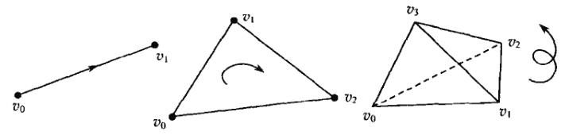
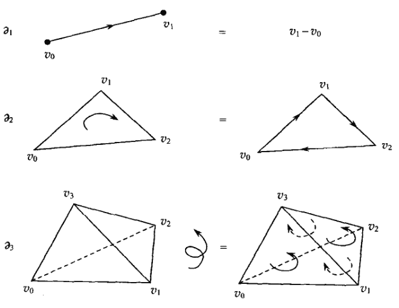
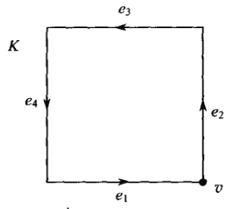
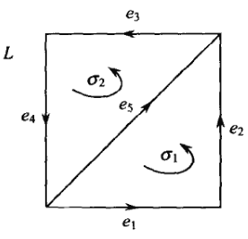
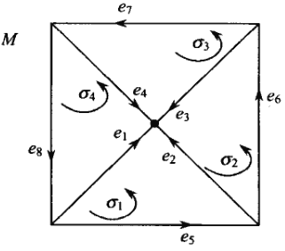

# 同调群

## 单纯形的定向

- **单纯形的定向**：
  - 设 $\sigma$ 是单纯形
  - 给定顶点的两种排列顺序，若它们相差一个偶置换，则称为 $\sigma$ 的两种**彼此等价的定向**
  - 顶点排列顺序的等价类称为 $\sigma$ 的定向
- **数量定理**：
  - 若 $\dim\sigma = 0$，则 $\sigma$ 有一种定向等价类
  - 若 $\dim\sigma > 0$，则 $\sigma$ 有两种定向等价类
  - **证明**：复杂
- **定向单纯形**：
  - 用 $v_0,...,v_p$ 表示无定向单纯形
  - 用 $[v_0,...,v_p]$ 表示定向单纯形
- **定向的箭头表示法**：
  - 对一维单纯形（线段），用直线箭头表示定向
  - 对二维单纯形（三角形），用旋转箭头表示定向。分为顺时针和逆时针
  - 对三维单纯形（四面体），用螺旋箭头表示定向。分为左螺旋和右螺旋
    - 下图例子是右螺旋，即先取右手螺旋四指的顶点顺序，最后取大拇指对应顶点
    - 比如 $[v_0,v_1,v_2,v_3]$ 和 $[v_0,v_2,v_3,v_1]$ 都是右螺旋定向
  
  

### 链

- **$p$ 维链**：
  - 设 $K$ 是单纯复形，集函数 $c$ 是（$K$ 的 $p$ 维定向单纯形）到 $\Z$ 的映射
  - 若
    - **保号性**：同一个单纯形的两种定向满足 $c(\sigma) = -c(\sigma')$
    - **有限支性**：$c$ 是有限支的
  - 则 $c$ 称为 $K$ 上的 $p$ 维链
- **$p$ 维链群**：定义 $(c_1 + c_2)(\sigma) = c_1(\sigma) + c_2(\sigma)$，则全体 $p$ 维链 $c$ 构成阿贝尔群 $C_p(K)$
  - 当 $p < 0$ 或 $p>\dim K$ 时，我们定义 $C_p(K)$ 是平凡群
  - **证明**：
    - **含幺性**：平凡链 $c(\sigma) = 0$
    - **封闭性**：显然 $c_1 + c_2$ 满足保号性和有限支性
    - **可逆性**：支集相同、值均取反的链
- **基本链**：设 $\sigma$ 是定向单纯形，则满足 $\begin{cases} c(\sigma) = 1 & 原定向 \\ c(\sigma') = -1 & 相反定向 \\ c(\tau) = 0 & 其它定向单形 \end{cases}$ 的链 $c$ 称为基本链
  - **对偶性**：基本链和定向单纯形一一对应
    - 类似向量空间 $V$ 的基和 $V^*$ 的对偶基一一对应
    - 以后认为 $\sigma$ 既是单纯形，也是基本链
- **链群自由定理**：
  - $C_p(K)$ 是自由阿贝尔群
  - 将全体 $p$ 维单形定向后，基本链组成 $C_p(K)$ 的基
  - **证明**：
    - 全体单纯形取定向后，易得任意链都可被支集上的基本链线性表出 $c = \sum\limits_{i} n_i\sigma_i$
- **自然基**：当 $p=0$ 时，单纯形只有一种定向，故全体单纯形只对应一种基本链
  - 其它情况下必须先对全体单纯形定向后才能定义基
- **同态扩张定理**：
  - 设 $K$ 是单纯复形，集函数 $f$ 是（$K$ 的 $p$ 维定向单纯形）到（阿贝尔群 $G$）的映射
  - 若 $f(-\sigma) = -f(\sigma)$，则它可扩张为群同态 $C_p(K)\to G$
  - **证明**：
    - 先将 $C_p(K)$ 同态到自由阿贝尔群，再由自由阿贝尔群的表出性即得结论
    - 保号性确保复合后仍然是同态

### 边缘算子

- **边缘算子**：$\pa_p:C_p(K)\to C_{p-1}(K)，[v_0,...,v_p]\mapsto \sum\limits^p_{i=1} (-1)^i[v_0,...,v_{i-1},v_{i+1},v_p]$
  - 类似行列式按一行展开
- **基本性质**：
  - **保号性**：$\pa_p(-\sigma) = -\pa_p(\sigma)$
    - **证明**：显然将两个顶点对换时，值会相差一个符号
  - **同态性**
    - **证明**：由保号性易得
  - **退化性**：$p\leq 0$ 时，$\pa_p$ 平凡
- **实例**：
  - 一维单纯形 $\pa_1[v_0,v_1] = v_1-v_0$
  - 二维单纯形 $\pa_1[v_0,v_1,v_2] = [v_1,v_2]-[v_0,v_2] + [v_0,v_1]$
  - 三维单纯形 $$\pa_1[v_0,v_1,v_2,v_3] = [v_1,v_2,v_3]-[v_0,v_2,v_3] + [v_0,v_1,v_3] - [v_0,v_1,v_2]$$
  - 实际上就是把 $p$ 维单纯形（内部的定向轨迹）分解为（边缘的定向轨迹）的矢量和，类似格林公式的定向方法
  
- **抵消性**：$\pa_{p-1}\pa_{p} = 0$，即 $\Im\pa_p \subset \ker\pa_{p-1}$
  - 本质是映射序列的正合性
  - **证明**：直接计算发现各项两两相消

### 同调群

- **$p$ 维闭链群**：$Z_p(K) = \ker\pa_p$
- **$p$ 维边缘链群**：$B_p(K) = \Im\pa_{p+1}$
- **同调群**：$H_p(K) = \cfrac{Z_p(K)}{B_p(K)} = \cfrac{\ker\pa_p}{\Im\pa_{p+1}}$

### 实例

- **正方形边缘**：
  - 设单纯复形 $K$ 由一维定向单纯形 $e_1,e_2,e_3,e_4$ 组成
  - 显然 $C_1(K)$ 是秩为 $4$ 的自由阿贝尔群，基为四个基本链
  - 任意 $1$ 维链 $c = \sum n_ie_i$
    - 易得 $\ker\pa_1$ 就是全体满足 $n_1 = n_2 = n_3 = n_4$ 的一维链，同构于 $\Z$
    - 易得 $\Im\pa_2 = 0$
    - 故同调群 $H_1(K) = Z_1(K) \cong \Z$

- **右对角线正方形**：
  - 设单纯复形 $L$ 由二维定向单纯形 $\sigma_1,\sigma_2$ 组成，定向如下
  - 显然 $C_1(K)$ 是秩为 $5$ 的自由阿贝尔群，基为五个基本链
  - 任意 $1$ 维链 $c = \sum n_ie_i$
    - 易得 $\ker\pa_1$ 就是全体满足 $\begin{cases}  n_1 = n_2 \\ n_3 = n_4 \\ n_5 = n_3-n_2\end{cases}$ 的一维链，即秩为 $2$ 的自由阿贝尔群
      - 对自由变量取值可得一组基为 $\begin{cases} e_1+e_2-e_5 & n_2 = 1,n_3 = 0 \\ e_3+e_4+e_5 & n_2=0,n_3 = 1 \end{cases}$
      - 由定向图易得它们分别是 $\pa_2\sigma_1$ 和 $\pa_2\sigma_2$，即 $\ker\pa_1 = \Im\pa_2$
    - 再由正合性即得同调群 $H_1(K) = 0$

- **双对角线正方形**：

## 曲面的同调群