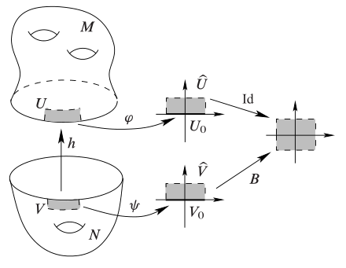

# 胞腔复形

## 胞腔

- **开 $n$ 胞腔**：同胚于开单位球 $B^n$ 的拓扑空间
- **闭 $n$ 胞腔**：同胚于闭单位球 $\ol B^n$ 的拓扑空间
- **凸集保边界同胚定理**：
  - 设 $D$ 是 $\R^n$ 中内部非空的紧凸集
  - 则
    - $D$ 是闭胞腔，其内部是开胞腔
    - $\forall p\in\Int D$，存在同胚 $F:\ol B^n\to D，\begin{cases} \bs 0\mapsto p \\ B^n\mapsto \Int D \\ S^{n-1}\mapsto \pa D \end{cases}$
  - **证明**：详见单纯复形章节

### 黏合空间

- **伴随空间**：
  - 设 $X,Y$ 是拓扑空间，$A$ 是 $Y$ 的闭子空间，$f:A\to X$ 是连续映射
  - 在 $X\bigsqcup Y$ 上定义等价关系 $a\sim f(a)$
  - 则商空间称为伴随空间 $X\cup_f Y$
  - 几何意义是将 $Y$ 的 $a$ 点黏到 $X$ 的 $f(a)$ 点
  - 需要注意的是，$X$ 和 $Y$ 的地位是不对称的（因为 $f$ 不一定可逆）
    - $X$ 是底座，黏合后的部分归于它
    - $Y$ 是贴纸，黏合后的部分不属于它
    - 当 $f$ 是同胚时，两者地位就是对称的
- **黏合映射**：伴随空间中的 $f$
  - 商映射是在单个空间内部，将饱和集合粘成一个点
  - 黏合映射是两个空间之间，将 $f$ 的原象黏到 $f$ 的像上
- **底座定理**：
  - 设 $X\cup_f Y$ 是伴随空间，$q:X\bigsqcup Y\to X\cup_f Y$ 是商映射
  - 则 
    - $q|_X$ 是嵌入
    - $q|_{Y\j A}$ 是嵌入
    - $X\cup_f Y$ 是闭集 $q(X)$ 和开集 $q(Y\j A)$ 的不交并
  - **证明**：
    - 由于黏合只发生在 $X,Y$ 之间，故 $X,Y$ 内部不存在黏合，即 $q|_X$ 和 $q|_Y$ 都是嵌入
    - 由于 $Y\j A$ 是 $Y$ 中开集，且是饱和集合，故 $q(Y\j A)$ 也是开集
    - 再易得 $X\bigsqcup (Y\j A) = X\cup_f Y$，故 $q(X)$ 是闭集

### 流形的黏合

- **流形边黏合定理**：
  - 设 $M,N$ 是边界非空的 $n$ 维流形
  - 若存在同胚 $h:\pa M\to \pa N$
  - 则
    - 伴随空间 $M\cup_h N$ 是 $n$ 维无边流形
    - 两嵌入 $\begin{cases} e:M\to M\cup_h N \\ f:N\to M\cup_h N \end{cases}$ 的像都是闭集，且满足 $$\begin{cases} e(M)\cup f(N) = M\cup_h N \\ e(M)\cap f(N) = e(\pa M) = f(\pa N) \end{cases}$$
    - 因为是同胚，故结论得到强化
  
  - **证明（内部局部欧氏性）**：
    - 设 $q$ 是商映射，$S = q(\pa M \cup \pa N)$
      - 易得 $\Int M\bigsqcup \Int N$ 是饱和开集，故 $q$ 在其上也是商映射
      - 再由于它不存在黏合，故 $q$ 在其上是同胚，故 $(M\cup_h N)\j S$ 是局部欧氏的
  - **证明（边界局部欧氏性）**
    - 设
  - **证明（A2 + T2）**：
    - 由有限并传递性直得A2
    - 通过取足够小的坐标球的原象易得T2性
  - **证明（结构）**：
    - 由于 $h$ 是同胚，故 $M\cup_h N = N\cup_{h^{-1}} M$，再由底座定理即得结论
  - **实例**：
    - 将三角形 $Y$ 的边黏合到三角形 $X$ 的边上
    - **楔和**：设 $A = \{y_0\}$，$f(y_0) = x_0$，则伴随空间称为楔和 $X\lor Y$
    - **赤道**：设 $X = Y = \ol B^2$，$A = S^1$，$f$ 是恒等映射，则伴随空间同胚于 $S^2$
- **流形的双**：
  - 设 $M$ 是 $n$ 维带边流形，$h:\pa M\to \pa M$ 是恒等映射
  - 则 $M\cup_h M$ 是带边流形，称为 $M$ 的双 $D(M)$
  - 将两个 $M$ 副本的边界粘在一起
  - **实例**：
    - 若 $\pa M = \varnothing$，则 $D(M)$ 是两个 $M$ 的不交并
    - 半球面的双是球面（两个半球面拼合起来）
- **同胚定理**：（$n$ 维带边流形）都同胚于（某个 $n$ 维无边流形的闭子集）
  - **证明**：由流形边黏合定理直得

### 胞腔复形

- **符号约定**：
  - $\mc E$ 表示胞腔分解，$e^n$ 表示其中的 $n$ 维胞腔
  - 胞腔在以后特指胞腔分解内的元素，用 $D^n$ 表示同胚于 $\ol B^n$ 的非胞腔集合
  - 用闭胞腔指代 $\ol e$ 
- **胞腔分解**：
  - 设 $X$ 是非空的拓扑空间，$\mc E$ 是它的胞腔分拆
  - 若对任意非零维的 $e_\a\in \mc E$，都存在某个连续映射 $\Phi_\a:D^n\to X$ 满足
    - $\Phi_\a$ 将 $\Int D^n$ 同胚到 $e_\a$
    - $\Phi_\a$ 将 $\pa D^n$ 映入低维骨架 $X^{(n-1)} = \mathop{\bigcup}\limits_{\substack{e\in \mc E \\ \dim e < n}} e$
  - 则 $\mc E$ 称为 $X$ 的胞腔分解
- **特征映射**：$\Phi_\a$ 称为胞腔 $e_\a$ 的特征映射
  - 它完全描述了 $e_\a$ 在复形 $X$ 中的全部拓扑信息，所以叫特征
    - 内部的同胚保证了 $e_\a$ 的胞腔性
    - 边界的映射描述了 $e_\a$ 的位置和黏合方式
- **附着映射**：$\Phi_\a|_{\pa D^n}$ 称为胞腔 $e_\a$ 的附着映射
  - 事实上特征映射的信息全部都在附着映射中，即 $e_\a$ 如何黏到低维骨架 $X^{(n-1)}$ 上
- **胞腔复形**：豪斯多夫空间 $X$ 和其胞腔分解 $\mc E$
- **胞腔复形基本定理**：闭胞腔在胞腔复形中是紧集和闭集
  - **证明**：
    - **紧性**：由泛函得 $D^n$ 是紧空间，而 $\ol e_\a = \Phi_\a(D^n)$，故由连续映射保紧性即可
    - **闭性**：由于 $X$ 是H空间，故紧集是闭集
  - **反例（开胞腔在 $X$ 中可能不是开集）**
    - $S^2 = \{e^0,e^1,e^2\}$
    - 即 $\ol e\j e$ 比 $\pa e$ 更小

## CW复形

- **CW复形**：满足以下两个条件的胞腔复形 $(X,\mc E)$
  - **闭包有限条件**：（闭胞腔）都含于（有限个胞腔的并）
    - 任意闭胞腔都只与（有限个低维胞腔）相交，即不存在无限个胞腔黏合在一起
  - **弱拓扑条件**：$X$ 的拓扑是全体闭胞腔的凝聚拓扑
    - 跟单纯复形一样，都是为了满足闭胞腔的闭集反射性
    - 也就是说，研究完全部的闭胞腔，就能得到CW复形的全部拓扑性质
    - C条件和W条件允许我们使用归纳法，将局部拓扑信息逐个拼成全局拓扑信息
- **局部有限判定法**：
  - 设 $X$ 是T2空间，$\mc E$ 是胞腔分解
  - 若 $\mc E$ 局部有限，则它是CW分解
  - **证明**：
    - **C条件**：
      - 由局部有限性得 $\forall e\in \mc E$ ，存在点 $x\in \ol e$ 仅与有限个胞腔相交
      - 再由于 $\ol e$ 是紧集，故它可被有限个邻域覆盖
      - 取这些邻域对应的 $x$ 的对应胞腔即可
    - **W条件**：
      - 设 $A\subset X$ 满足 $\forall e\in \mc E，A\cap \ol e$ 是 $\ol e$ 中的闭集
      - 取 $x\in X\j A$，设 $W$ 是 $x$ 的（只与有限个闭胞腔相交）的邻域，设这些闭胞腔为 $\ol e_1,...,\ol e_m$
        - 设 $A\cap \ol e_i$ 是 $\ol e_i$ 中的闭集，则由子空间闭集反射性，它也是 $X$ 中的闭集
        - 故 $W\j A = W\j\ddkh{(A\cap \ol e_1)\cup ... \cup (A\cap \ol e_m)}$ 是 $x$ 的邻域。再由子空间开集反射性，$X\j A$ 是开集，故 $A$ 是闭集

### 有限维CW复形

- **维数**：最大的胞腔维数
- **有限维定理**：有限胞腔复形是有限维的
  - **证明**：由胞腔维数有限直得结论
- **最大维胞腔的开性**：设 $X$ 是 $n$ 维CW复形，则 $e^n$ 都是 $X$ 中的开集
  - **证明**：
    - 设 $e_0$ 是 $n$ 胞腔，$\Phi_0:D^n\to X$ 是其特征映射
    - 显然 $\Phi_0$ 是到 $\ol e_0$ 的连续满射，则由闭映射引理，它是商映射
      - 由于 $\Phi^{-1}(e_0) = \Int D$ 是 $D$ 中开集，故由商映射性质得 $e_0$ 是 $\ol e_0$ 中开集
    - 任取胞腔 $e$
      - 由分拆性得 $e\cap e_0 = \varnothing$，故 $\ol e\cap e_0\subset \ol e\j e$
      - 由C性质，它只与有限个低于 $n$ 维的胞腔相交，故 $\ol e\cap e_0 = \varnothing$
      - 由W性质即得 $e_0$ 是开集

### CW子复形

- **CW子复形**：
  - 设 $X$ 是CW复形，$Y$ 是子空间（取子空间拓扑）
  - 若 $Y$ 是闭胞腔的并，则称为CW子复形
- **遗传定理**：
  - 设 $(X,\mc E)$ 是CW复形，$Y$ 是子复形
  - 则
    - $Y$ 是闭集
    - $Y$ 和 $\mc E$ 的某个子族构成CW复形
  - **证明**：
    - **闭集性**：显然
    - **特征映射**：显然
    - **C性质**：显然
    - **W性质**：
      - 设 $S\subset Y$ 满足 $\forall e\subset Y，S\cap \ol e$ 是 $\ol e$ 中闭集
      - 由C性质，$\ol e\j e$ 含于有限个胞腔，设其中含于 $Y$ 的胞腔为 $e_1,...,e_k$，则 $$ S\cap \ol e = S\cap (\ol e_1 \cup ... \cup \ol e_k)\cap \ol e = \ddkh{(S\cap \ol e_1) \cup ... \cup (S\cap \ol e_k)}\cap \ol e$$
      - 故它是 $\ol e$ 中闭集，则由W性质得也是 $X$ 中闭集。再由子空间拓扑得也是 $Y$ 中闭集
- **骨架凝聚定理**：CW复形的拓扑是全体骨架的凝聚拓扑
  - **证明**：

### 正则CW复形

- **正则胞腔**：特征映射是同胚
  - 即附着映射是同胚，边界在黏合时不发生折叠
  - **实例**：
    - $\R^n$ 中的紧凸子集
    - 流形中的正则坐标球
    - $0$ 胞腔
- **正则特征映射**：设 $e$ 是正则胞腔，则包含映射 $\ol e\to X$ 是特征映射
  - **证明**：易得

### CW复形实例

- **零维胞腔复形**：离散拓扑空间

## CW复形的拓扑性质

### 连通性

- **CW连通定理**：设 $X$ 是CW复形，则下列条件等价
  - $X$ 连通
  - $X$ 道路连通
  - $X^{(1)}$ 连通
  - 存在 $n$ 使得 $X^{(n)}$ 连通
  - **证明**：
    - $(1)\to (3)$
    - $(3)\to (4)$：显然
    - $(4)\to (2)$
    - $(2)\to (1)$：显然

### 紧致性

- **闭有限引理**：CW复形中，闭胞腔都含于有限子复形中
  - **证明（归纳法）**：对闭胞腔的维数归纳
    - 若 $n=0$，则 $\ol e = e$，它是有限子复形
    - 若 $n$ 以下均成立
      - 由C性质，$\ol e\j e$ 含于有限个低维闭胞腔的并
      - 再由归纳假设，它们都含于有限子复形中，故得到结论
- **有限离散引理**：
  - 设 $(X,\mc E)$ 是CW复形，$A\subset X$
  - 则 $A$ 是离散空间 $\LR \forall e\in\mc E，A\cap e$ 是有限集
  - **证明**：
- **CW紧子集定理**：
  - 设 $(X,\mc E)$ 是CW复形，$A\subset X$
  - 则 $A$ 是紧集 $\LR A$ 是闭集，且含于有限子复形中
  - **证明（必要性）**：
    - 反设 $A$ 与无穷个闭胞腔相交，则在每个交集中选一个点，就能得到 $A$ 的无穷离散子集，与有限离散引理矛盾
    - 即 $A$ 只与有限个闭胞腔相交，再由闭有限引理即得结论
  - **证明（充分性）**：
    - 已知 $\ol e$ 是紧集，由紧性的有限并传递性，有限子复形是紧集
    - 再由紧性的闭遗传性即得结论
- **CW紧判定定理**：设 $(X,\mc E)$ 是CW复形，则 $X$ 是紧集 $\LR \mc E$ 有限
  - **证明**：由CW紧子集定理直得
- **CW局部紧判定定理**：设 $(X,\mc E)$ 是CW复形，则 $X$ 局部紧 $\LR \mc E$ 局部有限
  - **证明**：

### 归纳法构造

- **特征映射不交并引理**：
  - 设 $X$ 是CW复形，$\{e_\a\}_{\a\in A}$ 是胞腔分解，$\Phi_\a$ 是特征映射
  - 则 $\Phi:\coprod\limits_{\a\in A}D_\a\to X$ 是商映射
  - **证明**：
- **骨架粘贴定理**：设 $X$ 是CW复形，则骨架 $X^{(n)}$ 是 $X^{(n-1)}$ 和 $n$ 胞腔的伴随空间
  - **证明**：
- **CW构造定理**：
  - 设 $X_0\subset X_1 \subset ... \subset X_n\subset ...$ 是一列拓扑空间，$X = \mathop{\bigcup}\limits^\infty_{n=0} X_n$
  - 若
    - $X_0$ 是非空离散空间
    - 对任意 $n>0$，$X_n$ 是 $X_{n-1}$ 和 $n$ 胞腔的伴随空间
  - 则
    - $X$ 存在唯一的 $\{X_n\}$ 凝聚拓扑
    - $X$ 存在唯一的胞腔分解，使得 $(X,\mc E)$ 是CW复形，且骨架 $X^{(n)} = X_n$
  - **证明**：

### 分离性

- **CW仿紧定理**：CW复形都是仿紧空间
  - **证明**：
- **CW正规定理**：CW复形都是T4空间
  - **证明**：由仿紧 + T2 = T4直得

### 流形性

- **CW流形定理**：
  - 设 $(X,\mc E)$ 是CW复形
  - 若 $X$ 局部欧氏，$\mc E$ 可数，则它是流形
  - **证明**：
- **CW流形维数定理**：设 $M$ 是非空的流形和CW复形，则CW复形维数和流形维数相等
  - **证明**：

