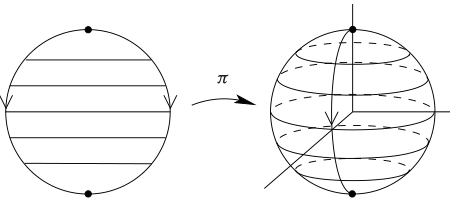
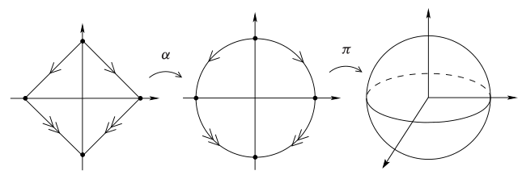

# 流形的分类

- GTM202将曲面分类定理放在基本群和同调群前面讲，因为它实际上是通过纯组合的手法（多边形切割和黏合）证明的，只有在证明三大经典曲面不同胚时才需要用到基本群或同调群

## 一维流形分类

- **正则分解定理**：$1$ 维流形都存在正则CW分解
  - **证明**：
- **胞腔边界引理**：
  - 设 $M$ 是 $1$ 维流形和正则CW复形
  - 则
    - $M$ 的 $1$ 维胞腔的边界都由两个 $e^0$ 组成
    - $M$ 的 $0$ 维胞腔都是两个 $e^1$ 的边界
- **一维流形分类定理**：
  - 设 $M$ 是非空的连通一维流形
  - 若 $M$ 紧，则同胚于 $S^1$
  - 若 $M$ 非紧，则同胚于 $\R$
  - **证明**：
- **一维带边流形分类定理**：
  - 设 $M$ 是非空的连通一维带边流形
  - 若 $M$ 紧，则同胚于 $[0,1]$
  - 若 $M$ 非紧，则同胚于 $[0,+\infty)$
  - **证明**：

## 紧曲面的构造

### 经典紧曲面

- **球面商定理**：$S^2$ 同胚于以下的商空间
  - 闭圆盘 $\ol B^2$ 的边界取轴对称等价
  
  - 斜正方形 $R = \hkh{(x,y)\Bigm | |x| + |y| \leq 1}$ 的边界取轴对称等价
  
  - **证明1**：
    - 设轴对称等价为 $(x,y)\sim (-x,y)$，则易得圆盘商映射为 $$ \hspace{-5em} \pi_1(x,y) = \begin{cases} \dkh{-\sqrt{1-y^2}\cos\cfrac{\pi x}{\sqrt{1-y^2}}，-\sqrt{1-y^2}\sin\cfrac{\pi x}{\sqrt{1-y^2}}，y} & y\neq \pm 1 \\\\ (0,0,y) & y=\pm 1 \end{cases} $$
  - **证明2**：
    - 易得存在同胚 $\a:S\to \ol B^2$，再取之前的商映射即可
- **实射影平面商定理**：
  - 闭圆盘 $\ol B^2$ 的边界取中心对称等价
  - 斜正方形 $R = \hkh{(x,y)\Bigm | |x| + |y| \leq 1}$ 的边界取中心对称等价
  - **证明**：详见同伦论

### 多边形

- **多边形**：满足以下条件的 $\R^2$ 子集
  - 有限个只在端点处相交的一维单纯形的并
  - 同胚于 $S^1$
  - 它是特殊的多面体和正则CW复形
- **多边形区域**：满足以下条件的 $\R^2$ 紧子集
  - 内部是正则坐标球（正则2胞腔）
  - 边界是多边形
  - **实例**：
    - 二维单纯形是多边形区域
- **多边形黏合定理**：
  - 设 $P_1,...,P_k$ 是多边形区域，$P = \coprod\limits^k_{i=1} P_i$
  - 若取任意仿射同胚，将边的像与原象取等价，则商空间是有限 $2$ 维CW复形
    - 由于是双射，故每条边至多配对一次
    - 可能存在恒等区域，即只与自身等价的边（不参与黏合）
    - $0$ 维骨架是 $P$ 顶点的像，$1$ 维骨架是 $P$ 边的像
  - 若取满足保顶点性的仿射同胚，则商空间是紧曲面
  - **本质**：
    - 任意多边形在正则的拼接黏合下都可构成紧曲面
    - 前面的三棱柱、莫比乌斯带、环面、克莱因瓶、球面都是例子
  - **证明**：
    - 设 $\pi:P\to M$ 是商映射，$M_0$ 是顶点的像，$M_1$ 是边的像，$M_2 = M$ 是多边形区域的像
    - **复形性**：易得 $M_0$ 是离散拓扑，$M_1$ 可被 $M_0$ 胞腔黏合，$M_2$ 可被 $M_1$ 胞腔黏合，故由CW构造定理即得结论
    - **保顶点性**：由CW构造定理即可
    - **保边性**：由CW构造定理即可
    - **紧曲面性**：由CW流形定理，只需证明局部欧氏性
      - **二维胞腔**：由最大维胞腔的开性，$2$ 维胞腔都是 $M$ 中开集，从而是欧氏邻域
      - **一维胞腔**：
        - 任取 $q\in e^1$，显然它是两个不同边的内点 $q_1,q_2$ 的像
        - 由于 $P_1,P_2$ 都是 $2$ 维带边流形，故边界点 $q_1,q_2$ 都存在正则坐标半球邻域
      - **零维胞腔**：

### 曲面的连通和

- **连通和**：
  - 设
    - $M_1,M_2$ 是连通的 $n$ 维流形，$B_1,B_2$ 是其中的正则坐标球
    - $\begin{cases} M_1' = M_1\j B_1 \\ M_2' = M_2\j B_2 \end{cases}$
      - 显然它们是 $n$ 维带边流形，边界同胚于 $S^{n-1}$
  - 任取同胚 $f:\pa M_2'\to \pa M_1'$，则 $M_1'\cup_f M_2'$ 称为连通和 $M_1\# M_2$
- **实例1**：
- **实例2**：
- **实例3**：

### 曲面的多边形表示

- 

## 紧曲面分类定理

- **多边形表示定理**：紧曲面都可赋予一个多边形表示
  - **证明**：
- **紧曲面分类定理1**：
  - 任意非空的连通紧曲面都同胚于以下三种
    - 球面
    - 环面的连通和
    - 实射影平面的连通和

### 实例

- **克莱因瓶结构定理**：克莱因瓶同胚于 $P^2\# P^2$
  - **证明**：
- **结构引理**：$T^2\# P^2$ 同胚于 $P^2\# P^2 \# P^2$
  - **证明**：

