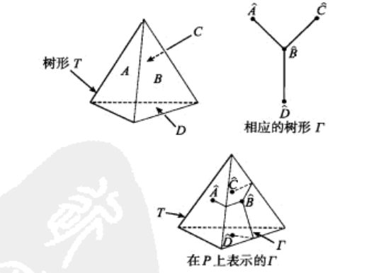
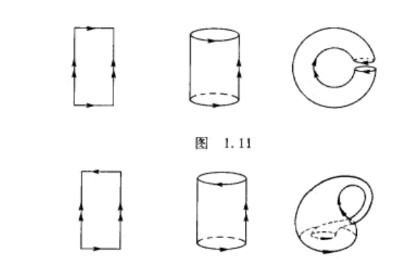
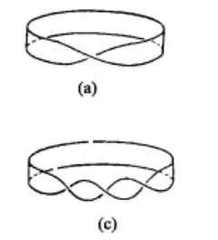

# Armstrong

## 引论

### Euler定理

- **Euler定理（高中版本）**：顶点数v，棱数e，面数f，有$v-e+f = 2$
  - **理解**：
    - 第一种方法（运动法）
      - 假设所有的棱都在一个面内，则 $v-e=0$。但事实上，有其它面把它们分开。
      - 因为任意一个方向摆放的多面体只能有一个底面，所以我们以底面作为初始面，开始拿走棱
      - **单层多面体**
      - 每个棱脱离的过程会减少一个点，组成一个新面的过程中，要消耗这个面边数-1的棱，即减少这个面边数-1的点（设为 $a_i-1$），同时会增加$(a_i-2)$ 个点。此时减少一个点，多出一个面，棱不变，总数不变。
      - 再构造和该侧面相邻的面时，消耗 $a_i-2$ 个棱，增加 $a_i-3$ 个点，增加1个面，总数不变。
      - 最后合并的时候，若有顶面，消耗1个棱，不增加点，但增加一个顶面和侧面。如果没有顶面，则不消耗棱，凭空增加一个侧面。最后加上初始的面，得到 $v-e+f = 2$
      - **多层多面体**
      - 先垒好一层，此时相当于有顶面，但顶面不计入在内的情况，总数依然不变。
      - 重复往上垒，步骤和结算和第一层完全一样，所以最后也是一样的结果。
      - 最后，凸多面体只有单层和多层之分。
      - 问题：如何证明其普适性？
    - 第二种方法（以点为主元）：
      - 一条棱对应两个点和两个面，共点的棱要减去一个点，共面的棱要减去一个面。
      - 一个点对应面的数量 = 对应棱的数量，
      - $\sum\limits_{i} 点a_i对应的棱数/面数 = \sum 面的边数 = 2e$
      - （？）
    - 第三种方法（以棱为主元）：
      - 顶点数量、面数量都是绝对数量，不会因为相邻而重叠。而棱数量会因为重叠而损耗。
      - （？）
    - **写在后面的话**：只要通过第一种方法理解了这个定理的本质，那么剩下的两个方法你就会发现，虽然是静态和动态之分，但是都是在往这个本质上凑。2e的条件很有用，但并不是应用在这个Euler定理的等式中的。静态法依然逃不过归纳的思想，也就是运动
- **图**：P的一组连通的顶点和棱（**连通性**）
  - **连通**：任意两个顶点可以由一串棱连接
  - **树形T**：不包含圈的图，$v(T)-e(T) = 1$
- **Euler定理（拓扑版本）**：如果一个多面体P
  1. 任意两点可以由一串棱连接
  2. P上任何直线段构成的圈，把P分割成两片，则 $v-e+f=2$
  - **证明**：
    - 首先，多面体构成一个立体图，可以找到含有全部顶点的树形子图，设为 T。得到 $v(T) = v$
    - **构造对偶图 $\Gamma$**：在P的每个面上取一个内点，连接“**所在面上有公共棱的内点**”。得到 $v(\Gamma) = f$
      -   
      - **对偶图的意义（互补的相交关系）**：若连接树形图的两个不相邻顶点，则必须穿过其对偶图的一条棱。得到 $e(T) + e(\Gamma) = e$
      - 证明 $\Gamma$ 连通：若 $\Gamma$ 的两个顶点不能用一串 $\Gamma$ 的棱连接，则其必然被T内的一个圈分开（第七章给出证明）。但是T是树形，不包含圈，所以 $\Gamma$ 是连通的
      - 证明 $\Gamma$ 是树形：反设 $\Gamma$ 内有圈，则其把P割成两个部分（成为“真·对偶图”（完全的相交关系））。如果要连接T内两个顶点，则必须穿过 $\Gamma$ 的一条棱。$\\$ 得到 $v(T)-e(T)+v(\Gamma)-e(\Gamma) = 2$
    - 综上，得到结果（**证毕**）
- **凸多面体的Legendre证明**：
  - 取多面体重心，径向投影到单位球面上，则原本的面变成曲边三角形
  - 已知球面n边形的面积是：$\sum\alpha_k -n\pi + 2\pi$
  - 从而各个球面多边形的面积之和是 $2\pi v -2\pi e + 2\pi f$
    - 每个顶点处的角度总和是 $2\pi$
    - n对应每条被计算了两次的棱
    - 每个面的内角和是 $2\pi$
  - 然后这个面积之和也是单位球面的面积

### 拓扑等价

- **图的增厚**：树形增厚变成盘型，有圈的图变为空心图形
  - 把上面的 T和 $\Gamma$ 增厚，得到两个“盘型”，粘合在一起就是P。
  - 盘型经过拓扑变换，可以变成两个半球，从而P变成球形（一个点对应北极，一个对应南极，即可构造映射）
- **拓扑等价（同胚）**：拉伸、弯曲，但不撕裂、粘合（连续双射，逆映射也连续）
  - $R^\infty$ 和 $R$ 是等势的，所以可以构造连续双射（参考复变函数共形映射）
  - 拓扑等价的四个图形：无沿柱面、单叶双曲面、平面开圆环、无两极球面
  - **同胚**：类似于同构和同态，指的是两个拓扑空间的关系，依赖于某个映射
- **同胚于球面多面体的Euler数为2**（同胚于环面的多面体Euler数为0，第九章证明）
- **拓扑等价的多面体Euler数相同**
  - 标准面：球面（Euler数为2）

### 曲面

- 通过粘合关系（即连续关系）判断是否同胚
  - 普通环形：一个圆柱体两头对接（方向相同）
  - 克莱因瓶：一个圆柱体两头对接（方向相反）。如果在三维空间，实现这一点必须和自身相交
  -   
  - 半周Mobius带：一条纸带两头对接（方向相反）
  - 一周半Mobius带：同上，但是多旋转一周，因为方向依然相反，所以同胚
  -   
  - **同胚的另一种说法**：同一个空间在欧氏空间的不同表示。
    - 但是不存在一种 “整个欧氏空间到自身的同胚” 把(a)映射成(c)（?）

### 抽象空间

- **抽象空间**：没有欧氏距离
- **邻域**：X内对每个x，选定一个以X的子集为成员的非空组合，并且满足邻域公理，
- **拓扑空间邻域公理**：
  - x在任何自己的邻域里（保有性）
  - 任何两个x邻域的交集也是x邻域（缩小保有性）
  - 包含邻域的X子集也是邻域（超集保有性）
  - x的邻域 $N$ 内部所有有邻域的点构成一个x邻域：$\overset{\circ}{N} = \{z\in N\mid N是z的邻域\}$，称为 **$N$ 的内部**（包络面？）（例子：球面去掉边界）
- **拓扑空间**：满足邻域公理的空间
  - **集合X上的拓扑结构**：对每一点x指定一个邻域
  - **拓扑空间内的连续映射**：$f(x)$ 的邻域 $N$，有 $f^{-1}(N)$ 是x的邻域
  - **拓扑空间内的同胚**：存在连续双射 $h: X\to Y$，则X和Y同胚（拓扑等价）
- **例子**：
  - 欧氏空间是拓扑空间（欧氏邻域）
  - **子空间拓扑**：X是拓扑空间，Y是它的子集。则对所有的 $y\in Y$，给出在X中的全体邻域 $O(y,\delta)$ 和Y的交集，它满足邻域公理，从而给出了Y的一个拓扑结构
    - 可以把欧氏空间的曲面看作一个拓扑空间
  - C上单位圆周 $\to [0,1)$：$f = e^{2\pi ix}$
    - 因为圆周角是多值的（$2k\pi$），所以它是多值函数，逆映射不连续。
    - 如果从几何的角度看，一个闭合而一个不闭合，也不可能同胚
  - **单纯剖分**：球体和四面体，通过径向投影
  - **度量空间**：距离函数 $d(f,g) = sup|f(x)-g(x)|$ 给出一个数集上的拓扑，邻域按照欧氏空间定义（？）
- **曲面拓扑空间（封闭连通曲面）**：能被给出欧氏空间的子空间拓扑结构
  - 每一点存在一个邻域同胚于平面（面性）
  - 任意不同的两点存在不相交的邻域（曲性）
  - 如果曲面有棱（Mobius带），则某些点无同胚于平面的邻域

### 简单曲面分类

- 球面挖去一个不相交的圆盘，添加一个杯柄，则同胚于环面
- 球面挖去n个不相交的圆盘，添加n个Mobius带，得到的平面叫做**射影平面**
  - n=2，是克莱因瓶
- **分类定理**：任何闭曲面同胚于
  - 球面
  - 添加了有限多个杯柄的球面（**亏格为n的可定向曲面**）
    - 可定向类似于数分中的双侧曲面
  - 挖去有限多个圆盘添加Mobius带的球面。（这三个不同胚）（第七章证明）

### 拓扑不变量

- 判断同胚的方法
  - 检测所有映射（不现实）
  - 同胚所保持的不变量（**拓扑不变量**）
    - 连通性：$E^1$ 去除一点后不连通，但 $E^2$ 去除一点后依然连通，所以不同胚
    - Poincare构造：把每个拓扑空间对应于一个群，使同胚的空间拥有同构的群
      - 双连通区域内的固定起始点环道 $\alpha和\beta$，规定其乘积 $\alpha\cdot\beta$ 为复合环道（规定运算），然后把保持端点不动，可以互相连续形变的环道等同起来（构造等价类），逆元素为方向相反的环道。
      - 环道可以取形式为连续映射 $f:C\to X$。单位元素是把C映射成一点的映射，从而可以形成一个环道群
- **Jordan分离定理**：平面内的任何简单闭曲线将平面分成两块
- **Brouwer不动点定理**：圆盘到自己的任何映射都有一个不动点
- **Nielsen-Schreier定理**：自由群的子群是自由群