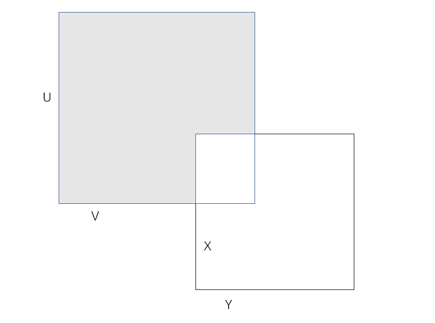

# 第二章：拓扑空间

## 预备知识

- **名词解释**：
  - **填充**：一个子集族，元素互不相交，且并集为全集
    - 若规定等价关系，则填充就是分拆
  - **堆砌**：一个子集族，元素互不相交
  - **空间**：规定了某种结构的集合称为一个空间
  - **有限集**：元素有限多的集合
  - **无限集**：元素无限多的集合
- **符号约定**：
  - 如非特殊说明，$\tau$ 一般表示拓扑，$X,Y$ 表示空间，$U,V$ 表示开集，$\mc B$ 表示拓扑基，$B$ 表示 $\mc B$ 的元素
  - 为了方便，拓扑空间 $(X,\tau_X)$ 有时直接写为 $X$

### 笛卡尔积运算律
  
#### 积运算在括号内部

- **交分配律成立**：$(U\times V)\cap (X\times Y) = (U\cap X)\times (V\cap Y)$
  - 代数意义：交无融合性
  - 几何意义：矩形的交还是矩形
- **并分配律不成立**：$(U\times V)\cup (X\times Y) \neq (U\cup X)\times (V\cup Y)$
  - 代数意义：并的重叠融合性
  - 几何意义：矩形的并不是矩形
- **差分配律不成立**：$(U\times V) - (X\times Y) \neq (U-X)\times (V-Y)$
  - 差的重叠消去性
- **差的去括号**：$(U\times V) - (X\times Y) = [(U-X)\times V]\cup [(U\cap X)\times (V-Y)]$
    - 已知 $U = (U-X) + (U\cap X)$。再利用交分配律，相互作差即可得到（这算是二级结论）
    - 几何意义：矩的交是两个矩形的并
    

#### 积运算在括号外部

- **并分配律成立**：$(U\cup V)\times (X\cup Y) = (U\times X)\cup (U\times Y)\cup (V\times X) \cup (V\times Y)$
  - 代数意义：并的融合性
  - 几何意义：长宽上分别取一点，则矩形可以被分解成四个矩形
- **交分配律成立**：$(U\cap V) \times (X\cap Y) = (U\times X)\cap (U\times Y)\cap (V\times X) \cap (V\times Y)$
  - 代数意义：交取最小
  - 几何意义：四条边中最短的两条形成的小矩形

## 拓扑基

### 拓扑空间

- **集合X上的拓扑**：$X$ 上的子集族 $\tau$，若满足以下性质，则称其为 $X$ 上的一个拓扑
  - 含有空集和全集 $X$
  - 子集任意并封闭性
  - 子集有限交封闭性
- **拓扑空间**：定义了拓扑的集合，写作 $(X,\tau)$
  - 开集和闭集是通过拓扑导出的概念。如果 $X$ 中没有定义拓扑，那么就无法得知其子集是开集还是闭集。之前数分中对 $\R$ 上的开集与闭集的定义，实际上是度量拓扑导出的
  - **非唯一性**：一个空间 $X$ 上可定义多种拓扑
- **开集**：设 $\tau$ 是 $X$ 上的拓扑，则 $\tau$ 中的元素称为 $(X,\tau)$ 中的开集
  - 开集依赖于具体的拓扑。拓扑不同，开集不同
- **粗细关系**：同一个空间中，若拓扑具有包含关系，则可比较粗细
  - **细于/粗于（大于/小于）**：$\tau'$ 细于 $\tau\LR \tau' \supset \tau \LR \tau'$ 可表出 $\tau$
    - 细的拓扑中开集更小，组合情况更多，所以更容易包含别的拓扑
- **拓扑空间实例**
  - **离散拓扑**：$X$ 的幂集族
    - **最细性**：任何集合上，离散拓扑都是最细的拓扑
  - **平凡拓扑**：仅由全集和空集组成的拓扑
    - **最粗性**：任何集合上，平凡拓扑都是最细的拓扑
  - **有限补拓扑** $\tau_f = \set{U \mid U^c 是有限集} \cup \{X,\varnothing\}$
  - **可数补拓扑** $\tau_c = \set{U \mid U^c 是可数集} \cup \{X,\varnothing\}$
- **拓扑空间反例**：
  - **无限补非拓扑** $\tau_\infty = \set{U \mid U^c 是无限集} \cup \{X,\varnothing\}$ 不是拓扑
    - 并运算会使得补集越来越小，最后可能变为有限集
    - **证明**：
      - 设 $X$ 为 $\Big(\Q \cap [0,1]\Big) \cup \{2\}$，$\{U_n\}$ 是其中一个有理数列
      - 则 $\bigcup U_{2k} \cup \bigcup U_{2k+1}$ 是开集的有限并，但不是开集

### 拓扑基（交完备性 + 并生成开集）

- **拓扑基**：$X$ 的子集族 $\mathcal{B}$，若满足以下两种性质，则称为一个拓扑基
    - **覆盖性**：$\for x\in X，\exist B\supset x$
    - **交完备性**：$\forall x\in (B_1\cap B_2)，\exist B_3\subset (B_1\cap B_2)$ 使得 $x\in B_3$
- **拓扑基的性质**：
  - **拓扑基不是拓扑**：拓扑基对任意并和有限交均不封闭
    - **反例**：
      - $X=\{1,2,3,4\}，\mathcal{B}=\{\{2\},\{3\},\{1,2,3\},\{2,3,4\}\}$
        - 基不满足交、并封闭性：$B_3\cap B_4 = B_1\cup B_2 \not\subset \mathcal{B}$
      - $\tau=\mathcal{P}(X)-\{1\}-\{1,2\}$
        - 拓扑包含 $\{2,3\}$，因为其可以被 $B_1、B_2$ 完全覆盖
  - **有限填充性**：有限基的任何 $B$ 可以被填充
    - **证明**：
      - 如果是有限基，则一定存在最小元素 $\{B_m\}$
        - 最小元素的交为空集或本身，无法再缩小。因此最小元素互不相交
      - 再由交完备性，$B$ 的交可以被互不相交的最小元素覆盖
        - 同时交以外的部分也互不相交。
      - 利用交完备性，从小到大类推，即得结论
- **基生成的拓扑**：$\tau(\mc B) = \set{U\subset X \mid \forall x\in U，\exist B\subset U\ 使得\ x\in B}$
  - 这不是普通的覆盖，必须是内部覆盖（即 $B$ 必须完全含于 $U$）
  - **证明**：
    - **覆盖性**：元素分析法易得 $X$ 可被 $\mathcal{B}$ 覆盖
    - **任意并封闭性**：对于 $U$ 的任意并，其中的 $x$ 一定属于某个 $U$，从而属于一个 $B$
    - **有限交封闭性**：任意两个 $U$ 的交集，由题设定义，其中的 $x$ 一定属于两个 $U$ 中的分别一个 $B$。再由拓扑基的交完备性，$x$ 至少被一个交的子集 $B$ 包含
  - **实例**
    - **$\R^n$ 中度量拓扑的基**
      - 所有的圆盘是一个拓扑基，生成的拓扑是所有 $R^2$ 上的子集族
      - 所有的矩形同理
    - **$\R$ 中度量拓扑（标准拓扑）的基**：
      - 全体开区间构成一组拓扑基
      - 具有有理数端点的全部开区间也构成拓扑基（见习题）
        - **可数性**
    - **离散拓扑的基**：所有单点集
- **基生成拓扑的性质**：
  - **生成唯一性**：每个拓扑基只能生成一个拓扑
    - **证明**：
      - 反设能生成两个拓扑，易证它们粗细相等，从而开集互包，从而相等
  - **拓扑基不唯一性**：拓扑 $\tau$ 的拓扑基一般都不是唯一的
  - **拓扑基最细性**：拓扑基是最细的开集族
  <!-- - **完备化**：基的任意并和有限交是开集（拓扑是基的完备化）
    - **证明**：基的交并虽然不封闭，但是由填充性可知，最小基的并可以填充所有基的交，从而改为“拓扑中所有元素均为某些基的并”
  - **完备性**：任何开集都是某些基的并 -->
- **（引理13.1）基覆盖引理**：$\tau(\mc B) = \hkh{\mathop{\bigcup}\limits_{B\in\mathcal{B'}}B\mid \mathcal{B'}\subset\mathcal{B}}$
  - 拓扑等于所有基元素的并集族，即拓扑实际上是基的完备化
  - **证明**：
    - 基元素是开集：由基生成拓扑的定义易得结论
    - 开集是基元素的并：
      - 由元素分析法易得 $U\subset \mathop{\bigcup}\limits_{x\in U}B_x$。再由 $B_x\subset U$ 即得 $\mathop{\bigcup}\limits_{x\in U}B_x \subset U$
    - 所谓内部覆盖性，其本质就是并集相等
  - **应用**：可以用于基生成基的情况
- **（引理13.2）基判定引理**：
  - 设 $\mathcal{C}$ 是 $(X,\tau)$ 中的开集族
  - 若 $\forall x\in \forall U\in \tau，\exist C\subset U$，使得 $x\in C\in\mc C$
    - 仔细一看，这不就是基生成拓扑的定义吗？所以这个引理本质是告诉我们，拓扑基就是能生成拓扑的开集族，即拓扑中最细的开集子族
  - 则 $\mathcal{C}$ 是 $\tau$ 的拓扑基
  - **证明**：
    - **$\mc C$ 是拓扑基**：
      - **覆盖性**：令 $U=X$ 即可
      - **交完备性**：两个开集的交也是开集
    - **拓扑相等**：互包证明 + 元素分析法易得 $\tau = \tau(\mc C)$
      - $\tau$ 的任何元素，也就是开集 $U$，其中任意元素 $x$ 可以被 $C$ 包含，所以 $U$ 可以被 $C$ 生成，从而是 $\tau(\mc C)$ 的元素
      - $\tau(\mc C)$ 的任何元素，由基覆盖引理得可以表示为 $C$ 的并，而 $C$ 都是开集，是 $\tau$ 的元素，所以其并也是
  - **本质**：
    - 拓扑基的另一种定义（能生成拓扑的开集族）（拓扑中最细的开集子族）
- **（引理13.3）基的单调性**：$\tau'$ 细于 $\tau \LR \forall x\in B，\exist B'\subset B$，使得 $x\in B'$
  - **证明**：
    - **必要性**：已知 $B$ 是开集，故 $B \in \tau$，从而 $B\in \tau'$，取 $B' = B$ 即可
    - **充分性**：
      - 由基生成拓扑的定义得 $\forall U\in\tau$，$\forall x\in U$，都有 $B\subset U$ 使得 $x\in B$
      - 再由题设条件得 $\exists B'\subset B$ 使得 $x\in B'$，即 $\tau$ 可被 $\mc B'$ 生成，从而 $\tau\subset \tau'$
  - **理解**：不过是基生成拓扑定义的直接推论而已
  - **推论**：拓扑相等 $\LR$ 拓扑基相等
    - **实例**：欧氏空间上度量拓扑中，矩形基和圆盘基相等

### 实例：$\R$ 上的三种拓扑

- **实轴标准拓扑 $\mathbb{R}_S$**：全体开区间生成的拓扑
- **实轴下限拓扑 $\mathbb{R_\ell}$**：全体左闭右开区间生成的拓扑
  - （Lebesgue-S集）
- **实轴上K拓扑 $\R_K$**：
  - 设 $K=\{\frac{1}{n}\mid n\in Z_+\}$
  - 由基 $\mathcal{B}''= \hkh{(a,b)\mid a,b\in\R} \bigcup \hkh{(a,b)\j K\mid a,b\in\R}$ 生成的拓扑
- **（引理13.4）不可比较性**：下面两个拓扑都比标准拓扑严格细，但是相互之间不可比较
  - **证明（更细性）**：
    - **充分性（基更细）**：$\R_\ell$ 的基元素总能含于 $\R_S$ 开集中
    - **必要性（开集更细）**：讨论左端点
      - 若 $x$ 取在L-S集的左端点上，则开集无法包含 $x$ 的同时含于L-S集
      - 但对于开集中 $\forall x$，L-S集总可以把 $x$ 取在左端点上，同时含于开集
    - **充分性（基包含）**：$K$ 的基本身包含了标准拓扑的基
    - **必要性（开集更细）**：讨论稠密点 $0$
      - 设 $B = (-1,1)-K$，则 $0\in B\in\R_K$
      - 但由于被挖去的点集 $\frac{1}{n}$ 在0处稠密，故不存在包含 $0$ 且在K拓扑中的开集
  - **证明（不可比较性）**：
    - $\R_K\not\subset\R_\ell$：存在L-S集不可被 $U_K$ 开集表出
      - 讨论左端点
    - $\R_\ell\not\subset\R_K$：存在L-S集不可被 $U_K$ 开集表出
      - 讨论包含0

### 子基

- **拓扑的子基**：$\mc S = \set{S\subset X\mid \mathop{\bigcup}\limits_{S\in \mc S} S = X}$
  - 可以覆盖 $X$ 的子集族 
- **子基生成的拓扑**：$\tau = \hkh{\mathop{\bigcup}\limits_{B\in\mathcal{B'}}B \biggm| \mathcal{B'}\subset \mathcal{B}}$
  - $\mathcal{S}$ 中元素的（全体有限交）的（全体并集）
  - 显然全体有限交包括每个子集 $S$ 自身，故子基是基的一部分
  - **证明**：
    - 设 $\mc C$ 是 $\mc S$ 的所有有限交的集族。只需证明 $\mc C$ 是拓扑基，且可生成 $\tau$
      - **覆盖性**：由 $\mc S$ 覆盖性 和 $\mc S\subset \mc C$ 直得
      - **交完备性**：
        - 设 $C_1\cap C_2 = (S_1\cap...\cap S_m)\cap (S_1'\cap...\cap S_m')$
        - 它依然是 $\mc S$ 的有限交，从而 $(C_1\cap C_2)\in \mc C$，即 $\mc C$ 对有限交封闭，从而具有交完备性
  - **推论**：
    - **非拓扑基**：子基不是拓扑基
    - **子基生成的唯一性**：子基可生成唯一的拓扑基，从而可生成唯一的拓扑
      - **证明**：定义易得
    - **子基生成的存在性**：任意覆盖 $X$ 的子集族都是一个子基
      - **证明**：定义易得
    - **子基的不唯一性**：一个拓扑基可能对应多个子基
      - **证明**：取 $\mc S$ 和 $\mc S\cup \{S_1\cap S_2\}$ 即可
- **实例**：
  - $\R$ 上标准拓扑的子基：$\mc S = \{(a,+\infty),(-\infty,b) \mid a,b\in\R\}$
  - 平凡拓扑的子基：$\mc S = \{X\}$
  - 在构造某些拓扑时，子基比拓扑基的形式更加简单。比如积拓扑

### 习题

- **开集生成的开集**：若 $\forall x\in A，\exist U\subset A$ 包含 $x$，则 $A$ 是开集
  - **证明**：（基生成证明）
- **拓扑的闭包定义**：$\mc A$ 生成的拓扑 $\LR$ 所有包含 $\mc A$ 的拓扑的交
  - **证明**：
- **常用拓扑的包含性**：
  - 有限补拓扑 $\subset$ 开射线拓扑 $\subset \R_S$
    - **证明**：开集更细法
  - （右端点有理的开区间）是 $\R_S$ 的基
    - **证明**：
    - **推论**：可测函数也可以用有理数端点定义

### 小总结

- 基的判定方法：
  - 定义
  - 基判定引理
- 开集的判定方法：
  - 定义
  - 拓扑基的并
- 基生成基
  - 基的填充集族的不同组合方式
  - 基覆盖引理
- 比较拓扑大小
  - 比较拓扑基的粗细
  - 比较全体开集的表出关系（即拓扑的表出关系）