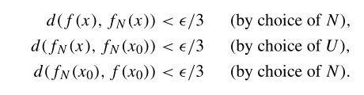

# 度量拓扑

- **符号约定**：
  - $\tau_d$ 表示度量 $d$ 诱导的拓扑
  - $B_d(x,r)$ 表示度量 $d$ 诱导的拓扑中的开球，以 $x$ 为球心，以 $r$ 为半径

## 度量拓扑

- **集合的度量**：$d:X\times X\to R$，满足非负性、对称性、三角不等式
  - 度量下的距离 $d(x,y)$
  - 度量下的开球 $B_d(x,r) = \{y\mid d(x,y) < r\}$
    - 这里的球是抽象说法，指到 $x$ 的距离小于 $r$ 的所有点，不一定形状是球
- **度量拓扑**：所有开球生成的拓扑
  - **证明**：
    - **全体开球是基**
      - **覆盖性**：球定义易得
      - **交完备性**：定义 + 三角不等式 + 构造更小的球
    - **基生成性**：$U$ 是度量拓扑的开集 $\LR U$ 内所有点都是某个含于 $U$ 的开球的球心
      - **必要性**：
        - 基判定引理得 $\forall x\in U，\exist B(x_0,r)\subset U$，使得 $x\in B(x_0,r)$
        - 再取 $B' = O\Big( x,\min\{d(x,x_0), r-d(x,x_0)\} \Big)$ 即可
      - **充分性**：
        - 基判定引理直得
- **可度量拓扑空间**：设 $(X,\tau)$ 是拓扑空间，若存在某个度量 $d$ 可以诱导出 $\tau$，则称其为可度量的拓扑空间
- **有界集**：若 $\forall a_1,a_2\in A，d(a_1,a_2)\leq M$，则称 $M$ 有界
- **有界集的直径**：$\diam A = \sup\limits_{a_1,a_2\in A}d(a_1,a_2)$

## 实数空间的度量

- **（定理20.1）标准有界度量**：设 $d$ 是一个度量，则 $\ol d(x,y) = \min\{d(x,y),1\}$ 称为标准有界度量
  - **有界性**：$\ol d$ 一定有界
  - **相等性**：$\ol d$ 和 $d$ 导出相同的度量拓扑
    - **证明**：
      - 易得半径小于 $1$ 的开球 $\mc B_1$ 在两个拓扑下都是开集。再由于所有开球都可被 $\mc B_1$ 并出，所以由基覆盖引理即得拓扑相同
- **范数诱导的度量**
  - **欧氏度量 $d$**：取度量为 $2$ 范数
    - **基元素**：通常意义下的球
  - **平方度量 $\rho$**：取度量为 $\infty$ 范数，即 $\rho(x,y) = \max\{|x_1-y_1|,...,|x_n-y_n|\}$
    - **基元素**：通常意义下的正方体

### 有限维空间的度量

- **（引理20.2）度量单调性**：$\tau'$ 细于 $\tau \LR$ $\forall \e>0，\exists \d >0$ 使得 $B_d(x,\d) \subset B_d(x,\e)$ 
  - **证明**
    - **必要性**：基的单调性
    - **充分性**：同上，本质是基的性质
- **（定理20.3）范数等价性**：$\R^n$ 上，$\tau_d = \tau_\rho = $ 积拓扑
  - 实际上它是泛函分析中有限维空间范数等价性的推论
  - **证明（范数度量等价性）**：
    - 由三角形的边关系，易得 $\rho \leq d \leq \sqrt{n}\rho$
    - 因此对 $\forall \e> 0，x\in\R^n$，都有 $B_\rho(x,\dfrac{\e}{\sqrt{n}}) \subset B_d(x,\e) \subset B_\rho(x,\e)$
    - 由拓扑单调性，即得 $\tau_d = \tau_\rho$
  - **证明（积拓扑等价性）**：
    - 有限维空间上，积拓扑的基元素 $B = (a_1,b_1)\times ... \times (a_n,b_n)$ 是一个长方体
    - 平方拓扑的基元素 $B(x,r) = (x_1-r,x_1+r)\times ... \times (x_n-r,x_n+r)$ 是一个正方体
    - 易得这两种基可以相互表出，因此平方度量拓扑和积拓扑等价

### 无穷维空间的度量

- **不一致度量**：$\R^\o$ 中，某些度量可能不存在
  - **反例（欧氏度量）**：取 $\bs x = (1,2,3,...)$，则 $\rho(\bs 0,\bs x) = \sqrt{\sum\limits^\infty_{n=1} n^2} = \infty$，不存在
  - **反例（平方度量）**：取 $\bs x = (1,2,3,...)$，则 $\rho(\bs 0,\bs x) = \max\limits_{n\in\N} n = \infty$，不存在
- **一致度量**：设 $\ol d$ 是标准有界度量，则 $\ol{\rho} = \sup\limits_{\a\in\o} \ol d(x_\a,y_\a)$ 称为一致度量
  - **存在性**：在任意积空间中，一致度量都存在
    - 已知 $\ol d$ 的值有界，再由确界存在定理，即得 $\ol\rho$ 的值总存在
- **一致拓扑 $\tau_{\ol{\rho}}$**：一致度量诱导的拓扑
- **（定理20.4）粗细关系**：积拓扑 $\subset$ 一致拓扑 $\subset$ 箱拓扑
  - **证明**：
    - 积拓扑的基中无界面上可以找到矩形基，有界面上可以找到更小的矩形基。从而 $\tau_\rho$ 细于 积拓扑
    - 因为总存在比矩形基更小的矩形，所以箱拓扑 细于 $\tau_\rho$
- **（定理20.5）无穷维实数空间的可度量性**
  - $\R^\omega$ 上可以定义度量 $D(x,y) = \sup\limits_{k\in\o}\hkh{\cfrac{\ol{d}(x_k,y_k)}{k}}$，其诱导的度量拓扑是积拓扑
  - **证明**：
    - 易得 $D$ 是度量，从而可以生成拓扑 $\tau_D$
    - 在 $\tau_D$ 上任取开球 $B_D(x,r)$
      - 取 $\dfrac{1}{N} < r$，设 $V = \prod\limits^N_{k=1} (x_k-r,x_k+r) \times \R   \times ... $
      - 设 $y$ 满足 $\forall k > N，D(x,y) \leq \frac{1}{N}$（N后面的维度上，$d(x_i,y_i) \leq 1$）
      - 因此 $D(x,y) \leq r$，从而 $V\subset B_D(x,r)$
    - 在每个有界面上取 $(x_i-r_i,x_i+r_i)（r_i<1）$
      - 设 $r = \min\{\frac{r_i}{i}\mid i=\a_1,...,\a_n\}$
      - 设 $y$ 是 $B_D(x,r)$ 中一点，则 $D(x,y) < r$
      - 再因为 $\frac{\ol{d}(x,y)}{i}<D(x,y)$ ，则 $|x_i-y_i|\leq r_i$，从而 $B_D(x,r)\subset U$

## 度量拓扑的性质

- **遗传性**：子空间可传递度量
- **序拓扑**：序拓扑不一定可度量
- **度量拓扑空间的可分性**：若一个空间是度量拓扑空间，则它是豪斯多夫空间
  - **证明**：由度量容易证明豪斯多夫性质

### 度量与连续性

- **（定理21.1）连续函数的度量定义**
  - $\forall \e > 0，\exist \d>0，\forall d_X(x,y) <\d，有 d_Y(f(x),f(y)) < \e$
  - **证明**：
    - 必要性：开球的逆像 $f^{-1}(B_Y(f(x),\e))$，其为开集。内部一定可以找到更小的球
    - 充分性：取 $f(B(x,\d))\subset B(f(x),\e) \subset V$，则 $B(x,\d)$ 是x的邻域。由x的任意性，得V的逆像可被开集并出，从而是开集
- **（引理21.2）序列引理**：
  - 若 $A$ 中存在收敛到 $x$ 的数列，则 $x\in \ol A$
    - **证明**：
      - 聚点定理即可
  - 若 $X$ 是可度量化空间，则逆命题也成立
    - **证明**：
      - 利用 $B_d(x,\frac{1}{n})$ 即可导出一个数列
- **（定理21.3）Heine定理**：
  - 设 $f$ 是度量空间中的函数
  - 则 $f$ 是连续函数 $\LR$ 若 $x_n\to x$，则 $f(x_n)\to f(x)$
  - **证明**：
    - **必要性**：
      - 构造邻域列 $V(n) = O(f(x),\frac{1}{n})$ ，则 $f^{-1}(V(n))$ 是x的邻域，由聚点定理得到 $x_n\to f(x_n)$ 收敛
    - **充分性**：
      - A闭包中一点x，存在 $x_n\to x$，H定理得 $f(x_n)\to f(x)$。再由Y完备性得 $f(x)\in \overline{f(A)}$，从而 $f(\ol{A})\subset \overline{f(A)}$，闭集传递性得连续
- **可数基**：x点的邻域列 $\{U_n\}_{n\in Z_+}$，使得任意 $O(x)$ 至少含有其中一项
  - 刚才的邻域开球列就是一个可数基，$V(n) = \mathop{\bigcap}\limits^\infty_{n=1}U_n$
  - **第一可数公理**：每个点都有可数基
  - 度量空间均满足第一可数公理，反之不一定
- **（引理21.4）四则运算连续性**：若将四则运算看作函数，则它们都是连续函数
  - **证明**：
    - 由度量定义 + 连续定义即可证明
    - 运算的本质是二维到一维的映射。函数运算本质是两个函数空间的积映射到像集中。而积具有连续性（向量值组合连续性）
- **（定理21.5）函数四则运算连续性**：连续函数的四则运算结果也是连续函数
  - **证明**：
    - 由复合连续性即可
- **一致收敛**：
  - 设 $X$ 是集合，$(Y,\tau_d)$ 是度量拓扑空间
  - 若 $\forall \e>0，\exist N(\e)>0$ 使得 $\forall n > N$ 和 $\forall x\in X$ 都有 $d_Y\Big(f_n(x),f(x) \Big) < \e$
  - 则称 $f_n$ 一致收敛到 $f$
- **函数拓扑空间**：
  - 若在全体 $f:X\to \R$ 的函数上定义度量 $d(f,g) = \sup\limits_{x\in X} |f(x)-g(x)|$，则构成一个度量拓扑空间 $\R^X$ 
- **一致收敛的函数空间定义法**：
  - 设 $f_n:X\to \R$ 是一列函数
  - 则 $f_n$ 一致收敛到 $f \LR f_n$ 在 $\R^X$ 上收敛到 $f$
  - **证明**：
    - 由于 $\R^X$ 上收敛和 $x$ 无关，故为一致收敛
- **一致极限定理**：连续的函数列若一致收敛，则极限函数也连续
  - **证明**：
    - 设 $U$ 表示 $x_0$ 的邻域，$V$ 表示 $f(x_0)$ 的邻域，
    - 由实数稠密性，可选择适当小的 $U$ 和适当大的 $N$ 满足
      
    - 利用一致收敛性 + 三角不等式，得到 $d(f(x),f(x_0)) < \e$

### 反例

- $\R^w$ 在箱拓扑下不可度量
  - **证明**：
    - 只需证明序列引理的逆命题在箱拓扑下不成立即可
    - 设 $A$ 表示全体坐标分量皆为正的点
      - 易得含 $\bs 0$ 的箱拓扑开集均与 $A$ 相交
      - 设 $U = \prod\limits_{n\in\o} (-a_n,b_n)$，则它和 $A$ 相交
    - 反设 $A$ 中存在 $\bs x^n\to \bs 0$，设 $\bs x^n = (x^n_1,x^n_2,...)$
      - 则取 $B = \prod\limits_{n\in\o} (-x^n_n,x^n_n)$，则它包含原点，但不包含任意 $\bs x^n$，从而 $\bs x_n \not\to \bs 0$
- 不可数个 $\R$ 的积不可度量
  - **证明**
    - 只需证明序列引理的逆命题在积拓扑不成立即可

### 习题

- **闭集套定理**：度量空间完备 $\LR$ 闭集套的极限是单点集
  - **证明**：不难
- **完备的积传递性**：可数个完备度量空间的积也完备
  - **证明（二元积）**
    - 设乘积度量为 $d\Big( (x_1,x_2)，(y_1,y_2) \Big) = \max\{d(x_1,x_2)，d(y_1,y_2)\}$
    - 由度量连续性 + 连续映射的坐标定理易得结论
  - **证明（可数积）**
    - 设度量空间为 $(X_n,d_n)$
    - 在可数积空间上取一致度量 $\rho$，易得 $\bs x^k \xto{\rho} \bs x \LR \forall x_n^k\xto{d_n} x_n$
    - 。。。太简单了。。。

#### 习题：度量收敛性

- $X$ 是所有 $R^n$ 上满足 $\forall \a,\b，p_{\a,\b}(f) = \sup\limits_{x\in R^n}|x^\a\a^\b f(x)|$ 的光滑函数，则 $\{p_{\a,\b}\}$ 构成一个半范数列，且一致收敛
- 对 $X\in C[a,b]$，不存在 $\rho$ 使得度量空间 $(X,\rho)$ 上的 $f_n\to f \LR f_n(x)\to f(x)$