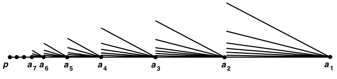

# 第三章上：连通性

- 连通性
  - 介值定理构造反函数：一步一步来？
- 紧致性
  - 最大值定理证明中值定理：Roll中值定理 = 最大值（极值）存在性 + fermat引理
  - 一致连续定理证明连续可积性：闭区间一致连续可直得可积，而积分在零测集上可忽略

## 空间的连通性

- **空间的分割**：
  - 设 $(X,\tau)$ 是拓扑空间，$A,B$ 是开集
  - 若 $A,B$ 不相交，且 $A\cup B = X$，则 $(A,B)$ 称为空间的一个分割
  - 此时两个集合均为闭开集，可以看作同一拓扑下的两个空间
- **连通空间**：
  - **分割定义法**：不存在分割的拓扑空间
  - **闭开集定义法**：只有自身和空集是闭开集的拓扑空间
  - **无分割性**：连通空间不能分割成多个开集
    - **证明**：开集的并封闭性
  - **无遗传性**：连通空间的拓扑子空间不一定连通
      - **反例**：$(1,4)$ 中 $(1,2)\cup (3,4)$ 是开子空间，但不连通
  - **拓扑单调性**：连通空间在更粗拓扑下也连通
    - **证明**：
      - 已知 $(X,\tau)$ 中，开集的补集都不是开集，那么更粗的拓扑中开集只会更少，所以必定不会连通
  - **实例**：
    - $\R$ 在标准拓扑下连通
      - **证明**：由实变的开集分解定理，开集都是不相交的开区间。再易得任意不相交开区间的并都不是 $\R$
    - 任意集合在平凡拓扑下连通
      - **证明**：定义易得
    - 任意无限集合在有限补拓扑下连通
      - **证明**：反设存在分割 $U_1\cup U_2$，则 $U_1^c = U_2$，但 $U_2$ 不可能是有限集，矛盾
  - **反例**：
    - $\Q$ 在标准拓扑下不连通
      - **证明**：由疏朗性易得结论
    - $\R_\ell$ 不连通
      - **证明**：
    - $\R^\omega$ 在一致拓扑下连通
      - **证明**：
- **（引理23.1）子空间分割引理**：
  - 设 $(X,\tau)$ 是拓扑空间，$(Y,\tau_Y)$ 是拓扑子空间，$A,B$ 非空且不相交
  - 则  $(A,B)$ 是 $Y$ 的分割 $\LR A\cup B = Y$ 且互不包含对方的聚点
  - **证明**：
    - **必要性**：
      - 由分割定义易得 $A\cup B = Y$
      - 由分割是闭开集 + 子空间闭包定理得 $A = \ol{A}_Y = \ol{A}\cap Y$，集合 $B$ 同理
      - 再由不相交得 $\ol A\cap Y$ 和 $\ol B \cap Y$ 不相交，即 $Y$ 中互不包含对方的聚点
      - 再由 $A,B\subset Y$，故在 $X$ 中也互不包含对方的聚点
    - **充分性**：
      - 由于 $A = B^c$ 不包含 $B$ 的聚点，故 $B$ 是闭集，从而 $A$ 是开集
      - 同理，$A$ 是闭集，$B$ 是开集，即两者都是闭开集，从而是分割
  - **反例（存在子空间外的公共聚点）**：
    - 设 $X = \R，Y = (0,1)\cup (1,2)$，取标准拓扑
    - 则 $x=1$ 是 $A = (0,1)$ 和 $B = (1,2)$ 的聚点，但不位于子空间中
- **（引理23.2）独立性**：
  - 设 $(X,\tau)$ 是拓扑空间，$(Y,\tau_Y)$ 是拓扑子空间
  - 若 $(A,B)$ 是 $X$ 的分割，则 $Y$ 完全位于 $A$ 或 $B$ 中
  - 连通子空间不可能被父空间分割
  - **证明**：
    - 易得 $A\cap Y$ 和 $B\cap Y$ 是 $Y$ 的分割，由连通性定义即得结论

### 连通性的传递

- **（定理23.3）并集传递条件**：
  - 设 $Y_1,Y_2$ 是拓扑空间 $(X,\tau)$ 的连通子空间
  - 若 $Y_1,Y_2$ 存在公共点，则 $Y_1\cup Y_2$ 依然连通
  - **证明**：
    - 反设存在分割，讨论公共点 $p$ 属于哪个分割，即发现矛盾
- **（定理23.4）闭包夹挤性**：设 $A$ 是 $X$ 的连通子空间，$A\subset B\subset \overline{A}$，则连通性传递到 $B$ 上
  - **证明**：
    - 反设存在分割 $B = C\cup D$，由独立性，不妨设 $A\subset C$
    - 再由 $C$ 的闭开集性，$\ol{A}\subset \ol{C} = C$，从而 $B\subset C$，矛盾
  - **推论（闭包传递性）**：连通子空间的闭包也连通
    - **证明**：
      - 在闭包夹挤性中，取 $B = \ol A$ 即可
- **（定理23.5）连续映射传递性**：连续映射将连通集合映为连通集合
  - **证明**：
    - 反证法 + 映射的集合运算传递性 + 连续映射定义即可
  - **推论（同胚传递性）**：连通空间的同胚空间也连通
    - **证明**：
      - 由连续映射传递性直得结论
- **（定理23.6）有限积传递性**：连通空间的有限积依然连通
  - **证明（二元积）**：
    - 设 $Y,Z$ 连通，$X = Y\times Z$
    - 由管道同胚性，得 $Y\times \{z_0\}$ 与 $Y$ 同胚，从而连通性相同，从而连通
    - 再由 $X_0 = \Big(Y\times \{z_0\}\Big) \bigcup \Big(\{y_0\}\times Z\Big)$，且它们相交于 $(y_0,z_0)$，由并集连通传递条件即得 $X_0$ 连通
    - 再易得 $X_1,X_2$ 之间必定存在公共点 $y_1\times z_2$，故 $X = \bigcup X_i$ 是连通空间
  - **证明（有限积）**：
    - 设 $X^n = \prod\limits^n_{k=1} X_k$，则易得 $X^n$ 同胚于 $X^{n-1}\times X_n$，有限归纳法即得结论
  - **本质**：证明两个截口的连通性，然后十字交叉，利用并集传递性即可

### 习题

#### 连通性的传递

- **任意积传递定理**：连通空间的任意积，取积拓扑时仍然连通
  - 积拓扑本身和截口紧密相关，有限支性也能避免超穷归纳情况
  - 设 $X = \prod\limits_{\a\in J}X_\a$，给定高维点 $(a_\a)\in X$ 和有限指标集 $K$
  - **积拓扑截口**：$X_K = \hkh{ \bs x\in X \mid \forall \a\notin K，x_\a = a_\a}$ 连通
    - $X_K$ 表示全体仅有限维不被固定的点，相当于积拓扑的截口
    - **证明**：由截口同胚性，$X_K$ 相当于 $|K|$ 个 $X_\a$ 的直积。再由有限积传递性即得结论
  - **全体截口并**：$Y = \mathop{\bigcup}\limits_{K} X_K$ 连通
    - （此时 $\a$ 固定，$K$ 可任意取）
    - $Y$ 表示所有截口的并集
    - **证明**：
      - 只需证明取任意子空间时，均存在另一个子空间与其相交
      - 若存在 $X_{K_1}$ 和 $X_{K_2}$ 不相交，则 $X_{K_1}$ 的点均 $\exists a_0\notin K_2$ 使得 $x_\a \neq a_\a$，再由 $x_\a = a_\a\pad (\a\notin K_1)$ 得，只能是 $\a_0\in K_1\j K_2$
      - 再由 $K$ 具有无限个，得 $K_1\j (K_2\cup \cdots) = \varnothing$，矛盾
  - **闭包性**：$X = \ol Y$
    - **证明**：
      - 本质是证明 $Y$ 是稠密子集，故只需 $\forall x\in X，\exists \{x_n\}\in Y$，使得 $x_n\to x$ 即可
      - 由良序原理，可设 $x = (x_1,x_2,\cdots)$
        - 则先取 $X_{K_1}$（$1\notin K_1$）中一点 $x^1 = (x_1,x^1_2,\cdots)$
        - 然后取 $X_{K_2}$（$1,2\notin K_2$）中一点 $x^1 = (x_1,x_2,x^2_3,\cdots)$
        - 不断取下去，即可逼近 $x$（错的！可数列不能逼近不可数坐标）
  - $X$ 连通
    - **证明**：闭包传递性即可
- **箱拓扑无传递性**：
  - **证明**：取欧氏空间即可
    - 已知 $\R^\omega$ 的点都可以表示为实数序列。设 $A$ 是全体有界序列，$B$ 是全体无界序列
    - **无交性**：易得
    - **并集性**：易得 $A\cup B = \R^\o$
    - **开集性**：
      - 选取点 $a = (a_1,a_2,...)$，设 $U_a = \prod\limits_{i\in I}(a_i-1,a_i+1)$，显然它是箱拓扑下的开集。
      - 再由于 $A = \mathop{\bigcup}\limits_{a有界} U_a$，$B = \mathop{\bigcup}\limits_{a无界} U_a$，故它们都是箱拓扑下的开集
    - 综上，$A,B$ 是 $\R^\o$ 的分割，从而箱拓扑下不连通
- **商传递性**：连通空间的商空间连通
    - **证明**：
- **商反射定理**：
  - 设 $p:X\to Y$ 是商映射
  - 若 $\forall y\in Y，p^{-1}(\{y\})$ 连通，则 $Y$ 连通 $\red\Rt X$ 连通
  - **证明**：
- **补空间不连通性**：即使 $X$ 连通，子空间 $Y$ 连通，但 $Y^c$ 仍可能不连通
  - **反例**：
    - 设 $X = (0,3)$，$Y = (1,2)$，则 $Y^c = (0,1) \cup (2,3)$ 不连通
- **补空间连通定理**：
  - 设 $Y$ 是 $X$ 的子空间，两者均连通
  - 若 $A,B$ 构成 $X\j Y$ 的分割，则 $Y\cup A，Y\cup B$ 均连通
  - **证明**：

#### 完全不连通性

- **完全不连通空间**：连通子空间只有单点集的空间
  - **实例**：
    - 离散拓扑空间
    - $\Q$ 序拓扑空间

## 序拓扑的连通性

- **线性连续统**：满足稠密性、最小上界性的全序集
  - **稠密性**：$\forall a,b\in A，\exists c\in (a,b)$ 使得 $c\in A$
  - **最小上界性**：非空有界子集必有上确界
- **线性连续统的性质**：
  - **凸性**：线性连续统是凸集
    - **证明**：元素分析法 + 稠密性即得结论
  - **连通性**：线性连续统是连通集
    - **证明**：见下面
- **凸连通引理**：序拓扑空间的凸子集连通
  - **证明**：
    - 反设存在分割 $X = A\cup B$，选取两点 $a\in A，b\in B$
    - 由 $X$ 是凸集，故可构造分割 $[a,b] = A_0\cup B_0$
    - 设 $c = \sup A_0$，可发现其不属于任何一个分割，从而矛盾
  - **本质**：类似dedikind分割的证明
- **（定理24.1）经典连通性**：在序拓扑下，线性连续统连通，其内部的区间和射线也连通
  - **证明**：由连续统凸定理 + 凸连通引理即得结论
  - **推论**：$\R$ 连通
- **（定理24.3）介值定理**：
  - 设 $X$ 是连通空间，$Y$ 是序拓扑空间，$f:X\to Y$ 是连续映射
  - 则 $\forall r\in \Big( f(a),f(b) \Big)$ 都存在非空原像
  - **证明**：
    - 反设存在 $r$ 使得 $f^{-1}(r) = \varnothing$
    - 在 $Y$ 上挖去 $r$ 得到 $Y'$，其依然是序拓扑有序集
    - 设 $A = \Im f \cap (-\infty,r)$，$B = \Im f\cap (r,+\infty)$
      - **非空无交性**：定义易得
      - **并集性**：易得 $A\cup B = \Im f$
      - **开集性**：由定义得 $A,B$ 是 $\Im f$ 中的开集
      - 综上，$(A,B)$ 构成 $\Im f$ 的分割，与连续映射保连通性矛盾
  - **反例**：
    - **连续映射的定义域不连通**：定义在 $(0,1)\cup (2,3)$ 上的 $f(x) = x$
  
### 线性连续统的传递性

- **有限积传递性**：设 $I$ 是线性连续统，则 $I\times I$ 是有序矩形，从而是线性连续统
  - **证明**：
    - 若某个维度包含上确界 $b$，不妨设 $b\times I$ 在矩形内。此时可定义矩形上确界为 $b\times \sup I$
    - 若所有维度均不包含上确界 $b$，此时可定义 $b\times 0$ 是矩形上确界
  - **实例**：设 $X$ 是良序集，则 $X\times [0,1)$ 是字典序上的线性连续统
    - **证明**：
      - 由良序集存在最大元易得 $X\times [0,1)$ 的最小上界性

## 道路连通性

- **道路**：设连续映射 $f:[a,b]\to X$，若 $f(a)=x, f(b)=y$，则 $f$ 称为从 $x$ 到 $y$ 的道路
  - **非闭性**：$f$ 不一定是闭映射
    - 拓扑正弦曲线不是闭集，但也不是道路……
- **道路连通空间**：若拓扑空间中，每一对点均可被某个道路相连，则称为道路连通空间
- **道路连通定理**：道路连通强于连通
  - **道路连通 $\red\Rt$ 连通**：
    - **证明**：
      - 反设 $X$ 道路连通，但不连通，则存在分割 $X = U\cup V$
      - 取道路 $f:(a\in U)\to (b\in V)$，易得 $\Im f = (\Im f\cap U)\cup (\Im f\cap V)$，即 $\Im f$ 存在分割，与连续映射的保连通性矛盾
    - **实例**：
      - 单位球 $B^n$
        - 任取两点 $\bold{x,y}\in B^n$
        - 道路为 $f:[0,1]\to \R^n，f(t) = (1-t)\bold x + t\bold y$
      - 穿孔欧氏空间 $\R^n\j\{\bold 0\}$，若 $n>1$，则道路连通
        - 任取两点 $\bold{x,y}\neq \bf 0$
        - 道路为不穿过原点的任意连续曲线
      - 单位球面 $S^{n-1}$，若 $n>1$，则道路连通
        - 已知穿孔欧氏空间总存在道路 $f_{a,b}$
        - 道路为 $g: \R^n\setminus\{\bold 0\}\to S^{n-1}，g(\bold x) = \cfrac{f_{a,b}(\bd x)}{\|f_{a,b}(\bd x)\|}$
  - **连通 $\red{\not\Rt}$ 道路连通**：
    - **反例（有序矩形）**： $I_o^2$
      - **证明**：
        - 已知连通，反设道路连通
        - 则由连续映射定义得 $U_x = f^{-1}\Big( x\times (0,1) \Big)$ 是线性连续统上的不相交开集族
        - 对每个 $U_x$ 选取有理代表元 $q_x$，此时选取映射 $g: I\to \Q，x\mapsto q_x$ 是单射
        - 又因为 $I = \mathop{\bigcup}\limits_{x\in I} U_x$，从而 $I$ 的势不超过 $\Q$，与 $I$ 不可数矛盾
        - ***理解***：虽然一维到二维等势，从而存在双射，且Peano曲线是全集的连续双射。但对于具体的形状（比如矩形），则不存在连续双射
    - **反例（拓扑正弦曲线）**：$S = \hkh{(x,y)\mid y = \sin(\dfrac{1}{x})，x\in (0,1]}$
      - **证明**：
        - **连通性**：
          - 由 $\sin(\dfrac{1}{x})$ 是连续映射，得 $S$ 为连通集
          - 再由闭包传递性，$\ol S$ 也连通
        - **闭包不道路连通**
          - 设 $f:\R\to \ol{S}$，若 $f$ 连续， 则 $0\times [-1,1]$ 的原像是闭区间，从而 $f$ 是道路。此时原像含有最大元 $b$，它的像即为 $0\times[-1,1]$
          - 设 $f(t) = (x(t),y(t))$，则存在点列 $t_n\to 0$ 满足 $y(t_n) = (-1)^n$，其不收敛，从而由Heine定理，与 $f$ 连续性矛盾，从而 $f$ 不可能是道路，即不存在道路将 $0\times [-1,1]$ 的点与其它点连接起来
        - ***理解***：Munkres中搞了个多值函数，其实是没有必要的。用Heine定理就可以证明了
        - ***本质***：连通是静态的连通，道路连通在连通的基础上，还必须有个移动顺序。故无逻辑的闭函数图像不是道路连通集

### 习题

- **开闭集不同胚性**：$(0,1)，(0,1]，[0,1]$ 两两不同胚
  - **聚点证明法**：
    - 反设存在同胚 $f:(0,1)\to (0,1]$，但像集中 $1$ 是边界点，其任意邻域均不含于像集。而在 $(0,1)$ 中找不到这样的点，故矛盾
  - **连通证明法**：
    - 若任意挖去其中一点，$(0,1)$ 不连通，但 $(0,1]$ 依然可连通，故不可能同胚
- 彼此互为嵌入的空间不一定同胚
  - **反例**：挖点闭圆盘 $\ol{B^2-\bd 0}$ 和开圆盘 $B^2$
    - $f:\ol{B^2-\bd 0}\to B^2，x\mapsto \dfrac{x}{2}$ 是嵌入
    - $g:B^2\to \ol{B^2-\bd 0}，x\mapsto \dfrac{x}{4} + \dfrac{1}{2}$ 是嵌入
    - 连通性不同，不同胚
- $n\geq 2$ 时，$\R^n$ 和 $\R$ 不同胚
  - **证明（连续性）**：只需开球 $B^n$ 和 $(-1,1)$ 不同胚即可
  - **证明（连通性）**：反设存在同胚 $f:\R^n\to \R$，则此时挖去原点后，$f|_{\R^n-f^{-1}(0)}:\R^n-f^{-1}(0)\to \R-0$ 也是同胚，但原像集道路连通，像集不道路连通，矛盾
- 数分不动点定理（道路连通证明）
- 序拓扑上连通的有序集是线性连续统
  - **证明**：序拓扑连通性可直得稠密性
    - 反设 $A$ 是有上界但无上确界的子集，此时其上界集合 $B$ 非空，且无最小值
    - 设 $A' = \set{x\in X\mid \exists a\in A，x\leq a}$，上界传递性得 $B$ 也是 $A'$ 上界。由无确界性，$A'$ 无最大元，那么它是开集
    - 由于 $X$ 连通，且 $X = A'\cup B$，此时只能是 $B$ 中存在 $A'$ 聚点 $b$。再由无确界性，$\exists b'<b$，但和聚点矛盾，故最小上界性成立
  - **本质**：和实数最小上界性的Dedekind分割证明一样
  - **反例（不是等价命题）**：有理数稠密，但无最小上界性，其也不连通
    - 若能证明拓扑空间均可嵌入一个连通拓扑空间，则可仿照有理数Dedekind分割进行证明。可惜该条件不成立
    - 不过其实Dedekind分割还可以用，但是不能直观地通过数学意义构造，而是需要通过数学本质进行思考，即借助上界集合
- 下列字典序是否为线性连续统
  - $\Z_+\times [0,1)$：是
    - **最小上界性**：由于右空间总有上界，所以取一个左空间有上界集合时均有上界。再由于 $\Z_+$ 是离散空间，最小上界性是易得的
    - **稠密性**：易得
  - $[0,1)\times \Z_+$：不是
    - **最小上界性**：由于左空间总有上界，所以任何集合均有上界 $1\times 1$
      - 但 $x\times \Z_+$ 没有上确界
    - **稠密性**：$0\times 1$ 和 $0\times 2$ 之间显然无任何元素，不满足稠密性
  - $[0,1)\times [0,1]$：是
    - **最小上界性**：
      - $A\times [0,1]$ 的上确界为 $\sup A\times 0$
      - $A\times B$ 的上确界为 $\max A\times \sup B$ 或 $\sup A\times 0$
    - **稠密性**：此时为左闭右开矩形，当然稠密
  - $[0,1]\times [0,1)$：不是
    - **最小上界性**：$0\times [0,1)$ 没有上确界
    - **稠密性**：易得
- 保序满射是同胚
  - **证明**：
- **道路连通性质**
  - 有限积传递性
    - **证明**：设 $X\times Y$ 均道路连通，取 $x_1,x_2\in X，y_1,y_2\in Y$，则存在连续映射 $f:x_1\to x_2，g:y_1\to y_2$，则设 $h = (f\times g)(x_0\times y_0) = f(x_0)\times g(y_0)$
      - 由向量值连续性，$h$ 也连续，从而是积空间的道路。再由 $x,y$ 任意性，即得道路连通性
      - 欧氏空间 $\R\times \R$ 中，这样得到的道路是一条斜直线，但更高维时就不一定了
  - 无闭包传递性
    - **反例**：拓扑正弦曲线道路连通，但闭包不道路连通
  - 连续映射传递性
    - **证明**：设 $f:[0,1]\to X$ 是道路，由复合传递性，$g\circ f:[0,1]\to Y$ 也连续，从而也是道路
  - 相交并传递性
    - **证明**：由粘贴保连续性，将道路粘合即可
    - **推论**：若条件换为两两相交（总交集可能为空集），则不可数情况下不成立，因为道路的基数不能大于 $\alef$，从而 $2^\alef$ 个粘贴不可能还是道路
- $\R^2$ 上的开连通空间 $U$ 是道路连通的
  - **证明**：取 $x_0\in U$，则 $A = \set{a\in U \mid \exists f，f(0) = a,f(1) = x_0}$
    - 即 $A$ 在 $U$ 中是闭开集。再由 $U$ 连通性，只能是 $A=U$，从而道路连通
  - **本质**：取道路连通分支，然后证明分支就是整体
- $\R^2$ 挖去可数子集 $A$ 后道路连通
  - **证明**：对 $\forall x_0\in \R^2-A$，已知通过 $x_0$ 点的直线有不可数个，故挖去可数个点后依然存在道路连通邻域。再由 $x_0$ 任意性即得结论
- **连通性质**：
  - 无内部遗传性
    - **反例**：两个交于一点的闭球
  - 无边界遗传性
    - **反例**：$[0,1]$
  - 无传递性：内部连通、边界连通的集合不一定连通
    - **反例**：$\Q\cup (-\infty,0)$，内部为 $(-\infty,0)$，边界为 $[0,\infty)$
  - 一个连通集合，内部和边界均不连通
    - **反例**：一个圆环和一个圆交于一点。此时圆环边界不连通。而交点是边界点不是内点，故内部也不连通。但整体是连通的
    - **反例**：a closed disc touching an infinite stripe
  - **理解**：可分图形的几个分支的连通性质其实没有矛盾关系，完全可以一步步进行构造

## 连通的等价性

### 连通分支

- **连通等价**：若 $x$ 和 $y$ 在同一个连通子空间内，则视为连通等价
  - **证明**：
    - **自反性**：
    - **对称性**
    - **传递性**：由连通性的并传递条件易得结论
- **连通等价定理**：连通等价类是连通集
  - **证明**：
    - 设 $C$ 是连通等价类
    - 任取一点 $x_0$，由连通等价的定义，$\forall x\in C$，存在连通子空间满足 $\{x,x_0\} \subset A_x\subset C$
    - 元素分析法即得 $C = \mathop{\bigcup}\limits_{x\in C}A_x$
    - 再因为 $A_x$ 均有公共点 $x_0$，由并集传递条件即得 $C$ 是连通集
- **（定理25.1）连通分支**：连通等价类称为连通分支
  - **存在性**：任意拓扑空间都存在连通分拆
    - **证明**：由于单点集总是连通且无交的，故单点集组成的连通分拆总存在
  - **最粗性**：
    - **元素最大**：任意连通子空间都只可能和一个连通分支相交
      - **证明**：
        - 由连通等价类的定义 + 连通的并集传递性易得结论
    - **元素最少**：连通分支是元素最少的连通分拆
      - **证明**：
        - 由元素最大性 + 反证法易得结论
      - **反例**：
        - 设 $X = [0,2] \cup [3,4]$，则连通分支为 $[0,2]$ 和 $[3,4]$
        - 任何其它连通分拆都比它细，比如 $[0,1)，[1,2]，[3,4]$

### 道路连通分支

- **道路等价**：若 $x$ 和 $y$ 之间存在道路，则视为道路等价
  - **证明**：
    - **自反性**：取道路为恒等映射即可
    - **对称性**：取道路为换元映射即可
    - **传递性**：取道路为复合映射即可
- **（定理25.2）道路分支**：道路等价类称为道路分支
  - **存在性**
  - **最粗性**
  - **证明**：同上

### 分支的性质

- **有限连通分支定理**：当连通分支数量有限时，连通分支均为开集
  - **证明**：
    - 此时任意连通分支 $C$ 的补集都为闭集有限并，从而 $C^c$ 是闭集，从而 $C$ 是开集
- **道路分支一般性**：可以非开非闭
  - **实例**：
    - $\Q$ 的道路分支是单点集
    - 拓扑正弦曲线连通，故只有一个连通分支，但有两个道路分支
      - 若删除 $y$ 轴上所有有理点，则连通分支还是一个，但道路分支变为无穷个
- **分支关系定理**：任意道路连通分支都含于某个连通分支中
  - 道路连通分支是连通分支的细化
  - **证明**：
    - 由于道路连通分支是道路连通集，从而是连通集，从而由连通分支的最粗性即得结论

## 局部连通性

- **局部连通性**：若点 $x$ 的任意邻域中均存在连通邻域，则称空间在 $x$ 上局部连通
- **局部连通空间**：每个点均局部连通
- **局部道路连通性**：若点 $x$ 的任意邻域中均存在道路连通邻域，则称空间在 $x$ 上局部道路连通
- **局部道路连通空间**：每个点均局部道路连通
- **关系定理**：连通的局部性质和整体性质无强弱关系
  - **例子**：
    - 连通且道路连通
      - $\R$ 上的所有区间和射线
    - 不连通，但局部连通
      - $\R$ 上子空间 $[-1,0)\cup (0,1]$ 
    - 连通，但不局部连通
      - 拓扑正弦曲线
    - 完全不连通
      - $\Q$
- **（定理25.3）局部连通邻域定理**：局部连通空间 $\LR$ 开集的连通分支均是开集
  - 开连通分支 = 连通邻域的并
  - **证明**：
    - **必要性**：
      - 设 $X$ 局部连通，$C$ 为开集 $U$ 的某个连通分支
      - 由 $X$ 局部连通性，$\forall x\in C$，存在连通邻域 $V_x\subset U$
      - 再由 $C$ 是连通分支，故只能是 $V_x\subset C$（或 $V_x\cap C = 0$，但与邻域性矛盾）
      - 再由 $x$ 任意性，得 $C = \bigcup V_x$，从而是开集
    - **充分性**：
      - 设 $U$ 为 $x$ 邻域，$C$ 是 $U$ 的某个连通分支，$x\in C$
      - 由条件，$C$ 是开集，从而是 $x$ 的邻域，满足局部连通定义
  - **理解**：邻域开集性 + 邻域局部性即可
- **（定理25.4）局部道路连通邻域定理**：局部道路连通空间 $\LR$ 开集的道路连通分支均是开集
  - **证明**：同上
- **（定理25.5）连通取等定理**：局部道路连通空间中，连通分支和道路连通分支相同
  - **证明**：
    - 设 $C$ 是连通分支，$P$ 是和 $C$ 相交的道路连通分支
      - 已知道路连通分支都是连通集。再由连通分支最粗性，只需证明 $P = C$ 即可
    - 反设 $P\subsetneqq C$
      - 由分支关系定理，$C\j P$ 是道路连通分支之并，不妨设为 $Q$
        - 首先总空间可分解为道路连通分支，故只需证明道路连通分支完全含于 $C$ 中
        - 道路连通分支也是连通集，而和 $C$ 相交的连通集只能含于 $C$ 中
      - 再由局部道路连通邻域定理，总空间中的分支 $P$ 和 $Q$ 均是开集
        - 所以不能弱化为局部连通空间，否则无法得到道路连通分支是开集
      - 再由 $P$ 和 $Q$ 不相交得它们构成 $C$ 的分割，与 $C$ 连通性矛盾
  - **理解**：分支关系定理 + 局部道路连通邻域定理

### 习题

- $\R_\ell$
  - 连通分支
  - 道路连通分支
  - $f:\R\to \R_\ell$ 是连续映射
- $\R^\omega$（积拓扑）
  - 连通分支
  - 道路连通分支
- $\R^\omega$（一致拓扑）
  - $x,y$ 在同个连通分支中 $\LR x-y$ 是有界序列
  - **证明**：只需证明 $y=0$ 情况即可
- $\R^\omega$（箱拓扑）
  - $x,y$ 在同个连通分支中 $\LR x-y = (x_1-y_1,...,0,0,...)$
  - **证明**：反设 $\forall N，\exists n>N，x_n-y_n > 0$
    - 则此时存在同胚 $h:\R^\omega\to \R^\omega$ 使得 $h(x)$ 有界，但 $h(y)$ 无界
- 有序矩形 $I^2$ 的道路连通分支
- $X$ 是 $[0,1]\times 0$ 上的有理点，$T$ 是连接 $p = (0,1)$ 和 $X$ 上点的线段
  - $T$ 道路连通，但只在 $p$ 局部连通
  - 找出 $A\subset \R^2$ 道路连通，但无处局部连通
- 局部道路连通空间 $X$，其连通开集 $A$ 道路连通
- **弱局部连通空间**：对任意连通邻域 $U = O(x)$，存在包含它的连通子空间
  - 处处弱局部连通的空间 $X$ 局部连通
    - **证明**：只需开集的连通分支均连通
- 下面的图形 $X$ 在 $p$ 弱局部连通，但不局部连通
  
  - **证明**：$p$ 的任何邻域必须包含所有 $a_i$
- 商映射保局部连通性
  - **证明**：设 $p:X\to Y$ 是商映射，$X$ 局部连通，若 $C$ 是开集 $U\subset Y$ 的连通分支，则 $p^{-1}(C)$ 是连通分支的并
- 设 $G$ 是拓扑群，则含幺元的连通分支 $C$ 是正规子群
  - **证明**：若 $x\in G$，则 $xC$ 是包含 $x$ 的连通分支
- **准连通分支**：若不存在分割 $X=A\cup B$ 使得 $x\in A,y\in B$，则 $x\sim y$，处于同一准连通分支中
  - **等价性**
  - 连通分支均含于准连通分支中
  - 若 $X$ 局部连通，则它们相等
  - **实例**：
    - $K = \{\dfrac{1}{n}\mid n\in \Z_+\}$
    - $A = $
    - $B = $
    - $C = $