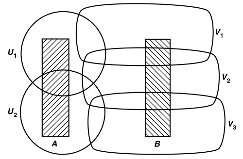
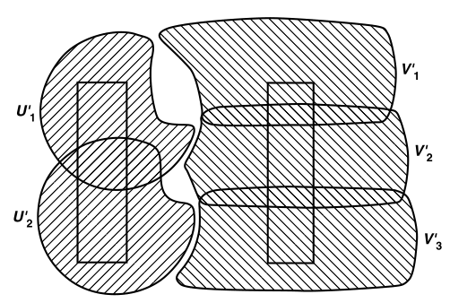

# 可分离性（稠密性）

- **可分离性**：空间可以被分为两个不相交开集的程度（和连通性是相反概念）
- **分离公理**：
  - T1公理、T2公理、T3公理、T4公理
- **紧含于**：若两个开集满足 $\ol U\subset V$，则称  $U\ss V$

## 可分性公理

### 知识回顾

- **T1公理**：任意两点 $x_1、x_2$，均存在不包含另一个点的邻域
  - **等价命题（有限集闭性）**：单点集是闭集
    - **必要性**：若 $\{x_1\}$ 是闭集，则 $X-\{x_1\}$ 是开集，即为 $x_2$ 的不包含 $x_1$ 邻域
    - **充分性**：
      - ***构造法（仅适用于A2）***：设 $U_1 = O(y_1)$ 是不包含 $x$ 的开集，不妨设 $U_1\subsetneq X-\{x\}$
        - 此时存在 $y_2\notin U$，再由T1定义，还可构造 $(U_1\cup U_2)\subsetneq X-\{x\}$
        - 不断进行下去，若空间A2，则必有 $\bigcup U_n = X-\{x\}$，立得结论
      - ***通用法（闭集聚点定义）***：反设不是闭集，则 $\{x_1\}$ 外存在其聚点 $x_2$，由聚点定义，$\forall O(x_1) \cap \{x_2\} \supset \{x_2\}$，与T1定义矛盾
    - **推论**：有限点集是闭集
  - **本质**：聚点的性质是衡量可分性的指标，覆盖的数量是衡量可数性的指标
  - **通俗理解**：如果你把空间分成A,B，但A的聚点还在B中，那么这两个集合还是藕断丝连的，分的不彻底。所以单点的可分性（T1和T2）也弱于集合的可分性（T3和T4）
    - 而可分空间是将聚点的数量限制为可数个，也就是说
  - **实例**：
    - $\R^2$ 上一个开集和一个孤立点 $x_0$，易得其不是T2空间，但是T1空间
    - 有限补空间是T1空间，但不是T2空间
      - **证明**：$X-\{x_1\}$ 的补集有限，从而是开集，从而也是 $x_2$ 的邻域
        - 但是（？）
- **T2公理（Hausdorff空间）**：任意两点 $x_1、x_2$，存在不相交的邻域
  - **等价命题（聚点稠密性）**：$x$ 是子集 $A$ 的聚点 $\LR$ 每个 $x$ 邻域都包含无数个 $A$ 的点
    - **必要性**：
      - （邻域定义矛盾法）若 $x$ 的邻域是有限个点，则由T1空间性质，其为闭集，和邻域是开集矛盾
      - （聚点定义矛盾法）$\forall O(x)$，除去和A的相交部分（保留x）后依然是邻域，但是该邻域和A不相交，与聚点相交定义矛盾
    - **充分性**：聚点的相交定义即可（没用到T1公理）
  - **极限唯一性**
    - **证明**：反设 $x、y$ 都是极限点，则由H空间定义，$x,y$ 存在两个邻域不相交，此时无法满足收敛定义，矛盾。
  - **封闭性**：
    - **序封闭性**：序拓扑上的全序集均为H空间
    - **积封闭性**：H空间的积是H空间
      - **证明**：设 $\{X_\a\}$ 是H空间集族，$\bf x,y$ 是 $\prod X_\a$ 中两点
        - 存在向量 $\b$ 满足 $x_\b \neq y_\b$。选择低维不相交邻域 $U,V$
        - 则由逆映射保集合运算性，其逆投影不相交
    - **遗传封闭性**：H空间的子空间是H空间
      - **证明**：设 $X$ 是H空间，$x,y$ 是子空间 $Y$ 中两点
        - 若 $U,V$ 是总空间中不相交邻域，则 $U\cap Y，V\cap Y$ 是子空间中不相交邻域

### 新公理

- **正则空间（T3）**：任意不相交的点 $x$ 和闭集 $B$，存在不相交邻域
  - **推论**：其为Hausdorff空间
    - **证明**：取B中一点，定义证明即可
- **正规空间（T4）**：任意不相交闭集 $A,B$，存在不相交邻域
  - **推论**：其为正则空间
    - **证明**：取A中一点，定义证明即可
  - **本质**：将一个集合的所有聚点完全与其它集合分离，是比单点(可数)的性质更强的可分性
- **（引理31.1）等价命题（紧含性）**：设 $X$ 是T1空间（单点集是闭集）
  - $X$ 是正则空间 $\LR \forall x$ 和邻域 $U$，存在邻域 $V \ss U$
  - $X$ 是正规空间 $\LR \forall $ 闭集 $A$ 和邻域 $U$，存在邻域 $V\ss U$
  - **证明**：只需证明第一个结论。第二个同理即可
    - **必要性**：
      - 设 $X$ 正则，$U$ 是 $x$ 的邻域，$B = X-U$
        - 由正则性，存在不相交邻域 $V\supset x，W\supset B$
      - 由不相交性，$V\subset X-W$，从而由闭包最小性，$\ol V\subset X-W$
        - 则 $\ol V$ 和 $B$ 不相交，从而 $\ol V\subset U$
    - **充分性**：设 $x$ 和不相交闭集 $B$，$U = X-B$
      - 由条件，存在 $x$ 邻域 $V$ 使得 $\ol V\subset U$
      - 从而 $V$ 和 $X-\ol V$ 是分别包含 $x,B$ 的不相交开集，满足正则性
  - **理解**：正则性导出邻域不相交性，再由闭包最小性，讨论邻域的补集即可
  - **本质**：将开集描述（不相交邻域存在性）改为闭集（紧含邻域存在性）描述罢了
- **（定理31.2）可分封闭性**：T2、T3空间在遗传和积下均封闭
  - **证明**：T2空间已证。
    - **遗传封闭性**：设 $Y$ 是正则空间 $X$ 的子空间，其中有 $x$ 和不相交闭集 $B$
      - 易得 $\ol B\cap Y = B$，从而 $x\notin \ol B$，可选总空间不相交邻域 $U,V$
      - 则 $U\cap Y，V\cap Y$ 也是子空间不相交邻域，满足正则性
    - **任意积封闭性**：设 $\{X_\a\}$ 是正则空间族，$X = \prod X_\a$
      - 传递性得 $X$ 是H空间，设积空间点 $\bf x$ 和邻域 $U$
      - 在 $U$ 中选择低维邻域积 $\prod U_\a$。由单维正则性，导出邻域 $V_\a$ 使得 $\ol V_\a\subset U_\a$
      - 由闭包任意积性，$\ol V = \prod \ol V_\a \subset \prod U_\a \subset U$，满足正则条件
  - **推论**：正规空间没有此类性质
    - **反例**：
      - K序拓扑 $\R_K$ 是H空间，不是正则空间
        - **证明**
      - 下界序拓扑 $\R_\ell$ 是正规空间
        - **证明**
      - Sorgenfrey平面 $\R^2_\ell$ 不是正规空间
        - **证明**：

### 习题

- **离散拓扑可数集是正规空间**
  - **证明**：易得每个子集都是闭开集，故对任意闭集 $A,B$，它们自身就是不相交邻域
  - **理解**：根据常识，离散可数是通常意义下的最强可分性（也是最不连通的）

## 正规空间

- **（定理32.1）正则进化定理**：A2的正则空间是正规空间
  - **证明**：
    - 设 $X$ 是正则空间，具有可数基 $\mc B$，且 $A,B$ 是不相交闭集
      - 由闭集聚点性，易得 $\forall x\in A$，存在邻域 $U$ 与 $B$ 不相交
      - 由正则性，可选邻域 $V$，满足 $\ol V\subset U$
      - 由可数拓扑基性质，可选邻域 $B_x\in \mc B$，满足 $x\subset B_x\subset V$
    - 由A2空间的弱紧性，对每个 $x\in A$ 进行选取，可得 $A$ 的可数覆盖 $\{U_n\}$，其元素闭包与 $B$ 不相交
    - 同理，可选取 $B$ 的可数覆盖 $\{V_n\}$
    - 只需证 $U = \bigcup U_n$ 与 $V = \bigcup V_n$ 不相交
      - 设 $U'_n = U_n\ \D \mathop{\bigcup}\limits^n_{i=1} \ol V_i，V'_n = V_n\ \D \mathop{\bigcup}\limits^n_{i=1} \ol U_i$（消去重叠部分）
        - 由 $A,B$ 不相交性，易得 $\{U_n'\}，\{V_n'\}$ 依然是 $A,B$ 的开覆盖
      - 设 $U' = \bigcup U'_n，V' = \bigcup V'_n$，只需证明它们不相交
        - 反设 $x\in U'\cap V'$，不妨设 $x\in U'_k \cap V'_j\quad (j\leq k)$
        - 从而由定义，$x\in U_j$，但 $x\notin \ol U_j$，矛盾
  - **理解**：正则性导出单点邻域不交，可数性导出邻域分拆，这两个分拆就是所有闭集的不相交邻域，从而正规得证
  - **本质**：将单点不交性质通过可数拓扑基传递到可数邻域覆盖上，从而传递到闭集上
   
- **（定理32.2）度量正规定理**：度量空间是正规空间
  - **证明**：设 $X$ 是具有度量 $d$ 的空间，$A,B$ 是不相交闭集
    - 由实数稠密性，$\forall a\in A，\exist B(a,\varepsilon_a)$ 与 $B$ 不相交。同理，$\exist B(b,\varepsilon_b)$ 与 $A$ 不相交
    - 设 $U,V$ 是包含 $A,B$ 的开集
      - 反设 $z\in U\cap V$，则 $\exist a,b$ 使得 $z\in B(a,\dfrac{\varepsilon_a}{2})\cap B(b,\dfrac{\varepsilon_b}{2})$
      - 从而 $d(a,b) < \dfrac{\varepsilon_a+\varepsilon_b}{2} < \varepsilon_a$ 或 $\varepsilon_b$，从而必定有 $B(a/b)$ 包含 $b/a$，矛盾
    - 从而满足正规性
  - **本质**：实数稠密性 + 放缩，类似数分证明某集合无上确界
- **（定理32.3）H进化定理**：紧的H空间是正规空间
  - **证明**：设 $X$ 是紧的H空间
    - **其为正则空间**
      - 设 $x,B$ 不相交，由紧H空间性质，闭集 $B$ 是紧集，从而存在有限邻域覆盖
      - 再由T2性，可找到不相交邻域，从而满足正则性
    - **其为正规空间**
      - 由紧性，对某个 $a\in A$，可取有限邻域 $\{U_a\}$ 覆盖 $A$
      - 由正则性，存在对应的 $B$ 邻域 $\{V_a\}$ 与之不相交
      - 取 $U = \bigcup U_a，V = \bigcap V_b$，它们就是 $A,B$ 的不交邻域，满足正规性
  - **理解**：紧空间可将点的覆盖性推广到整个闭集（紧集）上
  - **推论**：弱紧H空间也是正规的
- **（定理32.4）良序集进化定理**：良序集在序拓扑上是正规空间
  - **证明**：设 $X$ 是良序集
    - 首先，序拓扑包含 $\{(x,y]\mid x,y\in X\}$
      - 若 $y$ 是最大元，则所有 $(x,y]$ 构成 $X$ 的基
      - 若 $y$ 不是最大元，设 $y'$ 是 $y$ 的直接前继，则有 $(x,y] = (x,y')$。其为开集
        - 良序元素都有直接前继，从而良序集几乎就是离散可列集（仿离散可列）
    - 设 $A,B$ 是不相交闭集
    - 若均不包含最小元 $a_0$
      - **邻域性**
        - $\forall a\in A$，由无最小元性 + 离散性，存在基 $B_a\supset (x_a,a]$ 与 $B$ 不相交。同理，$\exist B_b\supset (y_b,b]$ 与 $A$ 不相交
          - 这里就体现出仿离散性了（每个单点 $a$ 自身和其邻域最多差一个前继），它也是导出正规性的核心
        - 故由任意性，$U = \mathop{\bigcup}\limits_{a\in A} (x_a,a]，V = \mathop{\bigcup}\limits_{b\in B} (y_b,b]$ 可覆盖 $A,B$，从而是它们的邻域
          - 这两个并集不一定可数，但可通过良序构造得到仿可列性，从而达到紧集将点不交性传递到闭集上的同样效果
      - **不相交性**
        - 反设 $z\in U\cap V$，则 $z\in (x_a,a]\cap (y_b,b]$，不妨设 $a<b$
          - 若 $a\leq y_b$，则两区间不相交
          - 若 $a > y_b$，则与 $y_b,b$ 与 $A$ 不相交矛盾
    - 若 $A$ 包含最小元 $a_0$
      - 则 $\{a_0\}$ 是闭开集，从而 $A-\{a_0\}$ 是闭集。则应用结论到 $A-\{a_0\}, B$ 即可
  - **理解**：已知离散可数集是正规的，而良序拓扑空间仿离散可列，故差不多的讨论方式即可
  - **推论**：每个序拓扑都是正则的（用不着）

### 例子

- $[0,1]^J$ 是正规空间
  - **证明**：$[0,1]$ 是紧的H空间，而紧性、T2性均可任意积传递
- 不可数积空间 $\R^J$
  - 是正则空间
    - **证明**：
  - 不是正规空间
    - **证明**：挺难
    - **推论**：正规空间无遗传性、无任意积传递性
      - **反例**：$\R^J$ 同胚于 $(0,1)^J\subset [0,1]^J$
- $S_\Omega\cap \ol S_\Omega$ 不是正规空间
  - **证明**：$S_\Omega$ 是具有序拓扑的最小良序集

### 习题

- **完全正规空间(complete)**：子空间均为正规空间
- **完美正规空间(perfect)**：正规空间中，每个闭子集为 $G_\d$ 集
  - **完全正规性**
    - **证明**：
  - **实例**：度量空间