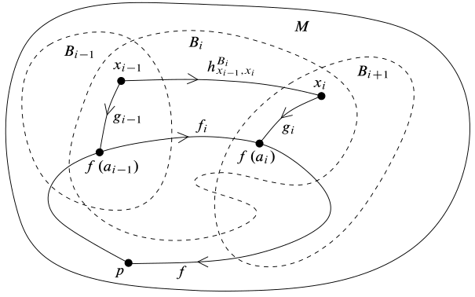

# 拓扑流形初步（Lee）

- 本章其实是微分几何到微分流形所需要的拓扑基础，最好先学习古典微分几何
- **符号约定**：
  - **闭上半空间**：$\H^n = \set{(x_1,\cdots,x_n)\in\R^n\mid x_n\geq 0}$
  - **穷竭**：拓扑空间 $M$ 中满足下列条件的一列集合 $(K_j)$
    - **内部包含性**：$K_n\subset \Int(K_{n+1})$
    - **穷竭性**：并集等于 $M$

## 流形

- **$n$ 维流形**：设 $X$ 是A2 + T2的，若每点都有邻域与 $\R^n$ 同胚，则称为 $n$ 流形
  - T2是为了保证极限唯一性等基础性质，A2是为了保证单位分解存在性
  - **实例**：曲线是1流形，平面是2流形
  - **反例**：
    - $\R^3$ 中的圆锥面不是流形，因为顶点的邻域不可度量化
    - 闭球 $B^n$ 不是流形，因为边界点的邻域不可度量化

### 坐标卡

- **坐标域 $U$**：同胚于 $\R^n$ 的区域
- **坐标映射 $\p$**：将 $U$ 同胚到 $\R^n$ 的映射
- **坐标卡 $(U,\p)$**
  - **中心点**：若 $\p(p) = 0$，则称 $p$ 是坐标卡 $(U,\p)$ 的中心点
  - **存在性**：对任意点 $p$ 都存在坐标卡以它为中心
    - **证明**：取坐标变换，再复合即可
- **坐标邻域 $O(p)$**：设 $p$ 是流形上一点，其同胚于 $\R^n$ 的邻域

### 基本性质

- **传递性**
  - **开遗传性**：$n$ 流形内部的开子集是 $n$ 流形
    - **证明**：
      - 设 $M$ 是 $n$ 流形，$V$ 是开子集，取 $p\in V$ 的坐标邻域 $O$
      - 易得 $O\cap V$ 也是坐标邻域
      - 再由A2和T2的开遗传性即得结论
  - **有限积传递性**：设 $M_1,...,M_k$ 是 $n_1,...,n_k$ 维流形，则它们的乘积是 $n_1 + ... + n_k$ 维流形
    - **证明**：
      - 由同胚的乘积传递性，局部欧氏性可被有限积传递
      - 再由A2和T2的有限积传递性即得结论
    - **实例**：
      - 环面 $\mb T^n = \mb S^1\times ... \times \mb S^1$ 同胚于甜甜圈 $D$
- **仿紧基**：流形存在仿紧的可数邻域基
  - **证明**：
    - 设 $M$ 是 $n$ 维流形
    - 若只有一个坐标卡
      - 设 $\p:M\to \wt U$ 是坐标映射
      - 设 $\mc B$ 是 $\R^n$ 中全体满足以下条件的开球
        - **有理性**：圆心为有理点、半径为有理数
        - **强含性**：对任意 $B(x,r)\in \mc B$，总存在 $r' > r$ 使得 $B(x,r')\subset \wt U$
      - 显然这些球在 $\wt U$ 中都是仿紧的，再易得 $\mc B$ 可数
      - 再由同胚性，它们的原象就是仿紧坐标球
    - 若存在多个坐标卡
      - 由A2空间的弱紧性，$M$ 存在可数坐标卡覆盖 $\mc U = \hkh{(U_i,\p_i)}$
      - 由于每个坐标卡都有仿紧可数邻域基，故它们的并也存在
      - 任取球 $B\subset U_i$，由仿紧性得 $\ol B$ 是 $U_i$ 中紧集。再由 $M$ 的T2性得 $\ol B$ 在 $M$ 中也是闭集，故 $B$ 在 $M$ 中也是仿紧的

### 连通性

- **局部道路连通性**：流形是局部道路连通的
  - **证明**：
    - 由坐标球道路连通性 + 坐标球是可数邻域基直得
- **连通分支定理**：流形只有可数个开连通分支，且每个分支都是流形
  - **证明**：
    - 由局部道路连通性，连通分支都是道路连通的闭开集，从而是开覆盖
    - 由A2空间的弱紧性，存在可数子覆盖。再由分支不交性得它就是全部的分支
    - 再由流形的开遗传性即得结论

### 紧致性

- **局部紧性**：流形是局部紧的
  - **证明**：由仿紧基直得结论
- **仿紧性**：流形是仿紧的
  - 对任意开覆盖 $\mc U$ 和任意拓扑基 $\mc B$，存在由 $\mc B$ 组成的 $\mc U$ 的 $\sigma$ 局部有限细化
  - **证明**：
    - 设 $M$ 是流形，$(K_j)^\infty_{j=1}$ 是紧穷竭
      - 由T2性得 $K_j$ 是闭集
    - 设 $V_j = K_{j+1}\j \Int K_j$，$W_j = \Int K_{j+2}\j K_{j-1}$
      - 易得 $W_j$ 是开集，$V_j\subset W_j$ 是紧集
    - 对任意 $x\in V_j$，存在邻域 $U_x\in \mc U$
      - 由拓扑基生成性 + 交局部细化性得存在邻域 $B_x \subset U_x\cap W_j$
      - 易得这样的 $B_x$ 是 $V_j$ 的开覆盖，再由紧性得存在有限子覆盖
      - 取全体 $V_j$ 的有限子覆盖的并，即得 $M$ 的可数开覆盖，它也是 $\mc U$ 的细化
      - 由于当 $j-2\leq j'\leq j+2$ 时 $W_j\cap W_j' = \varnothing$，故它是局部有限的

### 基本群

- **基本群可数性**：流形的基本群可数
  - **证明**：
    - 设 $M$ 是基本群，由仿紧基定理，存在可数坐标球族 $\mc B$ 覆盖 $M$
    - 由连通定理，任意两个坐标球的交 $B\cap B'$ 至多有可数个道路连通分支
      - 设 $X$ 是道路连通分支的代表元集合，显然它可数
      - 设 $h^B_{x,x'}$ 是 $B$ 中两点之间的道路
    - 已知道路连通分支中，全体点的基本群均同构，故只需讨论 $p\in X$
    - **特殊环路**：将由 $h^B_{x,x'}$ 的同伦积组成的 $p$ 环路称为特殊环路
      - **可数性**：显然全体特殊环路可数
      - **单射性**：显然每个特殊环路都是 $\pi_1(M,p)$ 的元素
      - **满射性**：
        - 设 $f:[0,1]\to M$ 是 $p$ 环路，显然全体 $f^{-1}(B)$ 是 $[0,1]$ 的开覆盖，由紧性得存在有限子覆盖 $0 = a_0\leq ...\leq a_k = 1$
        - 设 $f_i$ 是对应的限制，$B_i$ 是 $\Im f_i$ 中的坐标球
        - 显然 $f(a_i) \in B_i\cap B_{i+1}$，设 $x_i$ 是其所在道路连通分支中的其它点
        - 设 $g_i$ 是 $B_i\cap B_{i+1}$ 中 $x_i\to f(a_i)$ 的道路
          - 显然 $g_0,g_k$ 是常环路
          - 显然 $f \sim f_1 * ... * f_k \sim g_0 * f_1 * \ol g_1 * g_1 * f_2 * ... * f_k * \ol g_k$
          - 设 $\wt f_i = g_{i-1}*f_i*\ol{g_i}$，由 $B$ 单连通得它道路同伦于 $h^B_{x_{i-1},x_i}$，即 $f$ 道路同伦于特殊环路
      
      

### 流形的维数

- **零维流形**：可数的离散拓扑空间 $\LR 0$ 流形
  - **证明**：
    - 易得离散拓扑空间是T2的
    - 易得可数离散拓扑空间是A2的
    - 单点集是开集，从而自身就是邻域，且同胚于 $\R^0 = \{0\}$
- **维数不变性**：维数不同的流形不可能同胚
  - **证明（$0$ 维）**：
    - $0$ 流形的邻域是单点集，而其它流形的邻域都不可数，与同胚双射性矛盾
  - **反例**：$\R^n$ 中的坐标轴 + 坐标平面不是流形，因为不同点的坐标邻域维数不同

### 流形的其它性质

- **可分度量性**：局部同胚于 $\R^n$ 的可分度量空间 $\LR n$ 流形
  - **证明（必要性）**：
    - 易得度量空间是T2的
    - 易得可分度量空间是A2的
  - **证明（充分性）**：
    - 由于欧氏空间是局部紧的，故流形也是局部紧的
    - 再由于局部紧 + T2 = T3，故流形是 A2 + T3 可度量空间

## 带边流形

- **带边 $n$ 维流形**：设 $X$ 是 A2 + T2的，若每点都有邻域与 $\H^n$ 同胚，则称为带边 $n$ 流形
  - **实例**：
    - 闭球 $B^n$
    - 半开半闭球 $B^m$
    - 上半空间 $\H^n$
  - **反例**：边界为空的流形
- **内部图 $(U,\p)$**：$U$ 是同胚于 $\R^n$ 的开集，$\p$ 是同胚映射
- **边界图 $(U,\p)$**：$U$ 是同胚于含 $\pa\H^n$ 的开集，$\p$ 是同胚映射
  - 流形的边界是内蕴性质，而子空间拓扑的边界是外蕴性质
- **内点**：内部图中的点
  - 坐标邻域同胚于 $\R^n$
- **边界点**：不是内点的点
  - 坐标邻域同胚于含直线 $\{x_n = 0\}$ 的原点邻域

### 基本性质

- **边界不变性**：带边 $n$ 流形中的点不能同时是内点和边界点
  - **证明**：
- **内部遗传性**：带边 $n$ 流形的内部是开集（$n$ 流形）
  - **证明**：
- **边界遗传性**：带边 $n$ 流形的边界是闭集（$n-1$ 流形）
  - **证明**：
    - 易得内部开性 + 边界不变性 = 边界闭性
  - **实例**：闭球 $B^n$ 的边界是球面 $S^n$，由球极投影坐标得其是流形

## 流形的嵌入

- **单位分解**：
  - 设 $\{U_i\}^n_{i=1}$ 是 $X$ 的有限开覆盖，$\{\phi_i\} :X\to [0,1]$ 是泛函
  - 若
    - $\supp{\phi_i} \subset U_i$
    - $\forall x\in X，\sum\limits^n_{i=1} \phi_i(x) = 1$
  - 则称 $\{\phi_i\}^n_{i=1}$ 是依赖于 $\{U_i\}^n$ 的单位分解
  - $U_i$ 实际上就是坐标卡，过渡映射负责转换各个卡的坐标，单位分解负责把各个卡上的局部对象拼成全局对象（积分、度量、张量等）
  - **实例**：
    - $X$ 上的概率测度
- **（定理36.1）有限单位分解定理**：正规空间存在有限单位分解
  - **证明**：
    - **开覆盖缩小引理**：$\forall \{U_n\}\supset X，\exist \{V_n\}\supset X$，使得 $V_k\ss U_k$
      - **初始归纳**：
        - 设 $A = X-(U_2\cup ... \cup U_n)$，其为闭集，且含于 $U_1$
        - 由正规性，存在 $A$ 的邻域 $V_1$ 满足 $V_1\ss U_1$
        - 从而 $\{V_1,U_2,...,U_n\}$ 也覆盖 $X$
      - **递推关系**：
        - 不断进行下去，设 $\{V_1,...,V_{k-1},U_k,...,U_n\}$ 覆盖 $X$
        - 则设 $A = X-(V_1\cup ...\cup V_{k-1}) - (U_{k+1}\cup ... \cup U_n)$
      - 从而开覆盖可缩小
    - 再设 $\{W_n\}$ 是 $\{V_n\}$ 的缩小开覆盖
      - 由U引理，存在分量映射 $\psi_i: X\to [0,1]，\begin{cases} \psi(\ol W_i) = 0 \\ \psi_i(X-V_i) = 1 \end{cases}$
      - 从而 $\supp{\psi_i} \subset \ol V_i\subset U_i$
      - 再由 $\{W_n\}$ 覆盖性，设 $\Psi(x) = \sum\limits^n_{i=1} \psi_i(x) > 0$
        - 则设 $\phi_j(x) = \cfrac{\psi_j(x)}{\Psi(x)}\quad (j=1,...,n)$ 即为有限单位分解
  - **理解**：
- **（定理36.2）流形嵌入定理**：紧的 $m$ 维流形可被嵌入到有限维空间 $\R^N$ 上
  - **证明**：
    - 设 $X$ 为紧m流形，$\{U_n\}$ 为其开覆盖，嵌入映射 $g_i: U_i\to\R^m$
      - 易得 $X$ 紧H性，从而是正规空间
    - 设 $\phi_i$ 是依赖于 $\{U_i\}$ 的单位分解，$A_i = \supp{\phi_i}$
    - 设 $h_i: X\to\R^m，x \mapsto \begin{cases} \phi_i(x)\cdot g(x)，\quad x\in U_i \\ \bd 0 = (0,...,0)，\pad x\in X-A_i \end{cases}$
      - **存在性**：定义域为 $\phi,g$ 的交集
      - **连续性**：易得
    - 设 $F:X\to(\R\times\cdots\times\R)_n\times(\R^m\times\cdots\times\R^m)_n，x\mapsto \Big( \bs[\phi_i(x)\bs]_n,\bs[h_i(x)\bs]_n \Big)$
      - **连续性**：易得
      - **嵌入性**：由 $X$ 紧性，只需证其为单射
        - 反设，易得与 $g_i$ 单射性矛盾
  - **理解**：