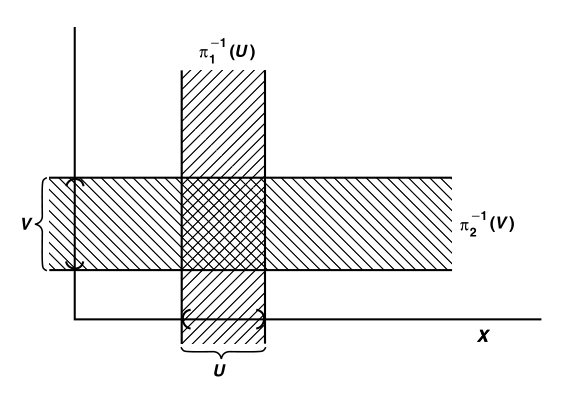

# 第二章：拓扑空间

## 前置知识

### 一些自创术语

- **填充**：一个子集族，元素互不相交，且并集为全集
  - 若规定等价关系，则填充就是分拆
- **堆砌**：一个子集族，元素互不相交

### 笛卡尔积运算律
  
- **积在内部**
- 交分配律成立：$(U\times V)\cap (X\times Y) = (U\cap X)\times (V\cap Y)$
  - 代数意义：交无融合性
  - 几何意义：矩形的交还是矩形
- 并分配律不成立：$(U\times V)\cup (X\times Y) \neq (U\cup X)\times (V\cup Y)$
  - 代数意义：并的重叠融合性
  - 几何意义：矩形的并不是矩形
- 差分配律不成立：$(U\times V) - (X\times Y) \neq (U-X)\times (V-Y)$
  - 差的重叠消去性
  - 改正：$(U\times V) - (X\times Y) = [(U-X)\times V]\cup [(U\cap X)\times (V-Y)]$
    - $U = (U-X) + (U\cap X)$
    - 再利用交分配律，相互作差即可得到（这算是二级结论）
    - 
    - 几何意义：矩的交是两个矩形的并
- **积在外部**
- 并分配律成立：$(U\cup V)\times (X\cup Y) = (U\times X)\cup (U\times Y)\cup (V\times X) \cup (V\times Y)$
  - 代数意义：并的融合性
  - 几何意义：长宽上分别取一点，则矩形可以被分解成四个矩形
- 交分配律成立：$(U\cap V) \times (X\cap Y) = (U\times X)\cap (U\times Y)\cap (V\times X) \cap (V\times Y)$
  - 代数意义：交取最小
  - 几何意义：四条边中最短的两条形成的小矩形

## 拓扑基

### 拓扑规则

- **集合X上的拓扑**：$X$ 上的子集族 $\tau$，若满足以下性质，则称其为 $X$ 上的一个拓扑
  - 含有空集和全集X
  - 子集任意并封闭性
  - 子集有限交封闭性
- **拓扑空间**：定义了拓扑的集合 $(X,\tau)$
  - 开集和闭集是通过拓扑导出的概念。如果 $X$ 中没有定义拓扑，那么就无法得知其子集是开集还是闭集。之前数分中对 $\R$ 上的开集与闭集的定义，实际上是度量拓扑导出的
  - **开集传递性**：拓扑空间上的开集也是一个拓扑空间
  - **非唯一性**：一个空间 $X$ 上可定义多种拓扑
- **X上的开集**：$\tau$ 中的元素
  - 开集是相对于拓扑来说的，正如邻域是相对于度量来说的
- **拓扑空间实例**
  - **离散拓扑**：$X$ 的幂集族
    - **最细性**：任何集合上，其都为最细的拓扑
    - 如果X是离散的点，除非拓扑均为无限点集，否则有限交和任意并可以表出所有子集。为了满足封闭性，拓扑必须是幂集族（？错的）
  - **连续拓扑（平凡拓扑）**：仅由全集和空集组成的拓扑
  - **有限补拓扑** $\tau_f$：$X$ 上的开集 $U$，其补集是有限集或全集
    - **并集封闭性**
  - **可数补拓扑** $\tau_c$：$X$ 上的开集 $U$，其补集是可数集或全集
- **拓扑空间反例**：
  - **无限补非拓扑** $\tau_\infty$：$X$ 上的开集 $U$，其补集是无限集或空集或全集
    - 设 $X$ 为 $\Q[0,1]\cup \{2\}$，$U_i$ 是其中一个有理数排列，则 $\bigcup U_{2k} \cup \bigcup U_{2k+1}$ 是开集的有限并，但不是开集
- **粗细关系**
  - **可比较的拓扑**：具有包含关系
  - **细于/粗于（大于/小于）**：两个拓扑的包含关系
    - 细的拓扑中集合小，情况多，更容易包含别的集族
    - **表出性**：$\tau'$ 细于 $\tau\LR \tau'$ 可表出 $\tau$

### 拓扑基（交稠密性 + 并生成开集）

- **拓扑基**：$X$ 的子集族 $\mathcal{B}$
  - 覆盖性：$\for x\in X，\exist B\supset x$
  - 交稠密性：$\forall x\in B_1\cap B_2，\exist B_3\subset B_1\cap B_2，x\in B_3$
  - **推论（填充性）**：有限基的任何B可以被填充
    - **证明**：
      - 如果是有限基，则一定存在最小元素 $\{B_m\}$
        - 最小元素的交为空集或本身，无法再缩小。因此最小元素互不相交
      - 再由交稠密性，$B$ 的交可以被互不相交的最小元素覆盖
        - 同时交以外的部分也互不相交。
      - 利用交稠密性，从小到大类推，即得结论
- **基生成规则**：
  - 若 $X$ 的子集 $U$ 中的任意元素 $x$，均可以被 $U$ 中的一个 $B$ 包含
  - 则所有满足该规则的 $U$ 生成唯一的拓扑
  - **基生成的拓扑**：$\tau = \set{U\subset X \mid \forall x\in U，\exist B\subset U\ 满足\ x\in B}$
  - **证明**：
    - **覆盖性**：由元素分析法，$\mathcal{B}$ 包含X
    - **任意并封闭性**：对于U的任意并，其中的x一定属于一个U，从而属于一个B
    - **有限交封闭性**：对U的二元交，其中的x一定属于两个U中的分别一个B。再由拓扑基的交稠密性，其至少被一个交的子集B包含
    - **唯一性**：反设有两个，易证粗细相等，从而开集互包，从而相等
  - **推论**：
    - **不完备性**：基对任意并和有限交均不封闭：
      - $X=\{1,2,3,4\}，\mathcal{B}=\{\{2\},\{3\},\{1,2,3\},\{2,3,4\}\}$
        - 基不满足交、并封闭性：$B_3\cap B_4 = B_1\cup B_2 \not\subset \mathcal{B}$
      - $\tau=\mathcal{P}(X)-\{1\}-\{1,2\}$
        - 拓扑包含 $\{2,3\}$，因为其可以被 $B_1、B_2$ 完全覆盖
    - **完备化**：基的任意并和有限交是开集（拓扑是基的完备化）
      - **证明**：基的交并虽然不封闭，但是由填充性可知，最小基的并可以填充所有基的交，从而改为“拓扑中所有元素均为某些基的并”
    - **完备性**：任何开集都是某些基的并
    - **非唯一性**：基生成的拓扑是唯一的，拓扑基不是唯一的。
  - **本质**：基通过规则筛选子集为开集，但这个规则实际上可以用并表出。因此它等价于基通过并生成开集
  - **实例**
    - **$\R^n$ 度量拓扑的基**
      - 所有的圆盘是一个拓扑基，生成的拓扑是所有 $R^2$ 上的子集族
      - 所有的矩形同理（**实分析中的外测度覆盖**）
    - **离散拓扑的基**：所有单点集
    - **$\R$ 度量拓扑（标准拓扑）的基**：
      - 全体开区间构成一组拓扑基
      - 具有有理数端点的全部开区间也构成拓扑基（见习题）
        - **可数性**
- **（引理13.1）基覆盖引理**：拓扑等于所有其基元素的并集族 （$\tau = \{\mathop{\cup}\limits_{B\in\mathcal{B'}}B\mid \mathcal{B'}\subset\mathcal{B}\}$）
  - **证明**：互包证明
    - 基的元素一定是该拓扑的元素：
    - 拓扑的元素一定是基元素的任意并：
      - **证明（有限基情况）**：实际上就是填充封闭性，按照最小元素推即可
      - **证明（元素分析法）**：任何 $x\in U$，都有 $B_x\subset U$，从而 $U\subset \mathop{\cup}\limits_{x\in U}B_x$
  - **应用**：它是对拓扑的等价，是基覆盖性的推论。可以用于基生成基的情况
- **（引理13.2）基判定引理（最细开集）**：
  - 设 $\mathcal{C}$ 是 $(X,\tau)$ 中的开集族
  - 若 $\forall x\in U\in \tau，\exist C\subset U$，使得 $x\in C\in\mc C$
  - 则 $\mathcal{C}$ 是 $\tau$ 的拓扑基
  - **证明**：
    - **$\mc C$ 是拓扑基**：
      - **覆盖性**：令 $U=X$ 即可
      - **交稠密性**：两个开集的交也是开集
    - **生成拓扑为 $\tau$**：设生成拓扑为 $\tau'$，互包证明即可
      - $\tau$ 的任何元素，也就是开集U，其中任意元素x可以被C包含，所以U可以被C生成，从而是 $\tau'$ 的元素
      - $\tau'$ 的任何元素，可以表示为一系列C的并，而每个C都是开集，是 $\tau$ 的元素，所以其并也是
  - **理解**：拓扑基定义（每个开集都包含一个拓扑基元素）的逆命题，这是开集和基之间的双向条件
  - **本质**：拓扑基是最细的开集子族
- **（引理13.3）基的单调性**：$\tau'$ 细于 $\tau \LR \forall x\in B，\exist B'\subset B$，使得 $x\in B'$
  - **证明**：
    - **必要性**：任何 $U$ 中存在 $B$（基生成规则），$B$ 中存在 $B'$（基单调性），从而任何 $U$ 中存在 $B'$（$U\subset\tau'$ 得证）
    - **充分性**：设 $x\in U$，则存在 $B$ 使 $x\in B$。又因为 $B$ 可以被 $U'$ 并出（拓扑单调性），$U$ 中存在 $B'$ 包含 $x$，则 $x\in B'\subset B$
  - **推论**：拓扑等价 $\LR$ 基集族是同阶的
    - **实例**：欧氏空间上的矩形基和圆盘基等价

### 实例：$\R$ 上的三种拓扑

- **实轴标准拓扑 $\mathbb{R}_S$**：所有开区间的集族 $\mathcal{B}$（不是Borel集）生成的拓扑
- **实轴下限拓扑 $\mathbb{R_\ell}$**：由所有左闭右开区间（Lebesgue-S集）的集族生成的拓扑
- **实轴上K拓扑 $\R_K$**：
  - 设 $K=\{\frac{1}{n}\mid n\in Z_+\}$
  - 由基 $\mathcal{B}''= \hkh{(a,b)\mid a,b\in\R} \bigcup \hkh{(a,b)\j K\mid a,b\in\R}$ 生成的拓扑
- **（引理13.4）不可比较性**：下面两个拓扑都比标准拓扑严格细，但是相互之间不可比较
  - **证明（更细性）**：
    - **充分性（基更细）**：$\R_\ell$ 的基元素总能含于 $\R_S$ 开集中
    - **必要性（开集更细）**：讨论左端点
      - 若 $x$ 取在L-S集的左端点上，则开集无法包含 $x$ 的同时含于L-S集
      - 但对于开集中 $\forall x$，L-S集总可以把 $x$ 取在左端点上，同时含于开集
    - **充分性（基包含）**：$K$ 的基本身包含了标准拓扑的基
    - **必要性（开集更细）**：讨论稠密点 $0$
      - 设 $B = (-1,1)-K$，则 $0\in B\in\R_K$
      - 但由于被挖去的点集 $\frac{1}{n}$ 在0处稠密，故不存在包含 $0$ 且在K拓扑中的开集
  - **证明（不可比较性）**：
    - $\R_K\not\subset\R_\ell$：存在L-S集不可被 $U_K$ 开集表出
      - 讨论左端点
    - $\R_\ell\not\subset\R_K$：存在L-S集不可被 $U_K$ 开集表出
      - 讨论包含0

### 子基（覆盖性 + 交生成开集）

- **拓扑的子基 $\mathcal{S}$**：覆盖 $X$ 的子集族
  - $\mc S = \set{S\subset X\mid \mathop{\bigcup}\limits_{S\in \mc S} S = X}$
- **子基生成的拓扑**：$\mathcal{S}$ 的（所有有限交）的（所有并集）（包括每个子集 $S$ 自身）
  - $\tau = \{\mathop{\cup}\limits_{B\in\mathcal{B'}}B\mid \mathcal{B'}\subset \mathcal{B}\}$
  - **证明**：
    - 设 $\mc C$ 是 $\mc S$ 的所有有限交的集族
    - $\mc C$ 是拓扑基，其生成一个拓扑 $\tau$
      - **覆盖性**：由 $\mc S$ 覆盖性 和 $\mc S\subset \mc C$ 直得
      - **交稠密性**：设 $C_1\cap C_2 = (S_1\cap...\cap S_m)\cap (S_1'\cap...\cap S_m')$
        - 其依然是有限交，从而 $\exist C_3 = C_1\cap C_2$，即该基对有限交封闭，从而交稠密性得证
  - **推论**：
    - 子基自身不是基
    - 子基的（有限交的并集族）是基

### 习题

- **开集生成的开集**：若 $\forall x\in A，\exist U\subset A$ 包含 $x$，则 $A$ 是开集
  - **证明**：（基生成证明）
- **拓扑的闭包定义**：$\mc A$ 生成的拓扑 $\LR$ 所有包含 $\mc A$ 的拓扑的交
  - **证明**：
- **常用拓扑的包含性**：
  - 有限补拓扑 $\subset$ 开射线拓扑 $\subset \R_S$
    - **证明**：开集更细法
  - （右端点有理的开区间）是 $\R_S$ 的基
    - **证明**：
    - **推论**：可测函数也可以用有理数端点定义

### 小总结

- 基的判定方法：
  - 定义法（交稠密性）
  - 满足基判定引理（开集更细性：任意U都存在内含B）
- 开集的判定方法：
  - 定义法：已知拓扑，
  - 满足基生成规则
- 基生成基
  - 基的填充集族的不同组合方式
  - 基覆盖引理
- 拓扑比较法
  - 基更细
  - 基生成
  - 开集更细

### 关于拓扑空间的讨论

- 空间是绝对的，性质是相对的
  - 一个空间可以同时是拓扑空间、度量空间、测度空间、赋范线性空间、内积空间
  - 维数的概念只相对于线性空间，开集的概念只相对于拓扑空间，
  - 如lkh所说，当你提出线性空间的概念时，它的非线性关系就不再被讨论

## 诱导拓扑

### 关于诱导的讨论

- **诱导拓扑**：由定义的某个关系诱导出的拓扑（如度量拓扑）。它和直接由某个性质定义的拓扑（如离散拓扑）可以共存
  - **实例**：离散拓扑空间上，可定义度量 $\rho(x,y) = \begin{cases} 0，x=y \\ 1，x\neq y \end{cases}$
  - 度量下的规则和已有规则契合时，产生的现象
- **种类**：
  - 度量拓扑：定义了度量的拓扑
  - 序拓扑：定义了序关系的拓扑
  - 积空间拓扑：由两个拓扑空间经过积运算导出的拓扑
  - 子空间拓扑：子集导出的拓扑

### 序拓扑

- **序拓扑**：
  - 总空间 $X$：全序集合
  - 序拓扑基 $\mc B = \hkh{(a,b),[a_0,b),(a,b_0] \biggm| a,b\in X，a_0 = \min,b_0 = \max}$
- **由 $a$ 决定的射线**：某侧为最值元 $b_0$，另一侧为普通元 $a$ 的区间
  - **开射线**：不包含 $a$
    - **子基性**：满足覆盖性，且所有有限开集都可以被两个无穷开集交出来
    - 所以开射线生成的拓扑中包含有序拓扑
  - **闭射线**：包含 $a$

### 积空间拓扑

- **拓扑积空间**：空间的直积 $X\times Y$ 上的拓扑 $\tau$ 称为 **积拓扑**
  - **拓扑的积性**：所有 $X、Y$ 上开集的积 $U\times V$ 构成积空间的所有开集
    - $\color{red}\tau = \set{U\times V\mid U\subset X，V\subset Y}$
    - **证明**：只要证明开集的积构成积空间的基即可
      - **覆盖性**：总空间开集性直得
      - **交稠密性**：积的交分配律直得
        - $B_1\cap B_2 = (U_1\times V_1)\cap (U_2\times V_2) = (U_1\cap U_2)\times (V_1\cap V_2) = B_3$
        - 有限交封闭，从而交稠密
  - **（定理15.1）基的积性**：基的积 $\{B\times C \mid B\in\mathcal{B}，C\in\mathcal{C}\}$ 是积拓扑的基 $\mc D$
    - **证明**：
      - 由积的有序对性质，若 $(x\times y) \in (U\times V)$，则 $x\subset U，y\subset V$
      - 再由基的性质，$\exist B,C$，使得 $x\in B\subset U，y\in C\subset V$
        - 从而 $x\times y \in B\times C \subset W$（**证毕**）
    - **本质**：拓扑积性的强化，范围被缩小了
    - **实例**：
      - $\R^2$ 上的标准拓扑，就是两个标准拓扑的积拓扑，基为开矩形

#### 积的投影

- **积的投影**：$\begin{cases} \pi_1: X\times Y \to X，\pi_1(x,y)=x \\ \pi_2:X\times Y\to Y，\pi_2(x,y)=y \end{cases}$（本原映射，满射而非单射）
  - **投影的逆（全集性）**：$\begin{cases} \pi_1^{-1} = U\times Y \\ \pi_2^{-1} = X\times V \end{cases}$
  - **开映射性**：$\pi,\pi^{-1}$ 将开集映射成开集
    - **证明**：基生成性直得
    
- **（定理15.2）投影逆子基**：（拓扑的逆投影的积）是（拓扑积空间的子基）
  - $\mathcal{S} = \{\pi_1^{-1}(U)\mid U是X上的开集\}\cup \{\pi_2^{-1}(V)\mid V是Y上的开集\}$
  - **证明（互包证明）**：
    - 所有 $\mathcal{S}$ 上的元素都是积拓扑的元素（保开集性），所以S的有限交的任意并（$\mathcal{S}$ 作为子基生成的拓扑）也是积拓扑的元素（开集封闭性），子基拓扑 $\subset$ 积拓扑
    - 每个积拓扑的元素都是S的有限交（投影逆全集性 + 基的积传递），

### 子空间拓扑

- **子空间拓扑**：拓扑空间 $(X,\tau)$ 中
  - 若 $Y\subset X，\tau_Y = \{Y\cap U\mid U\in \tau\}$
  - 则 $(Y,\tau_Y)$ 是拓扑空间
  - **证明**：
    - **覆盖性**：$X$ 的覆盖性传递到 $Y$ 上
    - **任意并封闭性**：$U_1 = Y + S_1，U_2 = Y + S_2$
      - 化为简便形式，集合运算律即可
    - **有限交封闭性**：由交的分配律，$(B_1\cap Y)\cap (B_2\cap Y) = (B_1\cap B_2)\cap Y$
  - **推论**：子空间开集的交性

#### 子空间交性（父空间 $\to$ 子空间）

- **子空间开集的交性**：子空间 $Y$ 上的开集是 $X$ 的开集与 $Y$ 的交
  - **推论**：**子空间闭集的交性**（集合运算律易得）
- **（引理16.1）子空间基的交性**：（$X$ 上的基 $\mathcal{B}$）和（子空间 $Y$）的交 $B_Y$ 是 $Y$ 上的基
  - **证明（基的定义）**：
    - 覆盖性：由基覆盖引理
    - 交稠密性：交的分配律
  - **证明（基判定引理）**：基性质和基判定是等价的，所以可以基传递到基
- **子空间积的交性**：$(U\times Y) \cap (A\times B)$ 是子空间 $A\times B$ 上的开集
  - **证明**：如果是题设字面意思，则用子空间开集交性即可。如果是下方的逆命题，则证明方法同下

#### 子空间传递性（子空间 $\to$ 父空间）

- **（引理16.2）开集的子空间传递性**：
  - 若 子空间 $Y$ 是父空间 $X$ 的开集
  - 则
    - $Y$ 上的开集也是 $X$ 上的开集
    - 即 $\tau_Y \subset \tau_X$
  - **证明**：
    - 由子空间开集交性，$\forall U\subset Y，\exist V\subset X$，使得 $U = Y\cap V$
    - 则 $X$ 拓扑有限交封闭性得 $U$ 为 $X$ 上开集
  - **闭子空间的边界开集非传递性**：$\tau_Y$ 的元素不一定是 $\tau_X$ 的元素（Y可能是闭集，此时边界上的集合在X中是闭集，在Y中是开集）
- **（定理16.3）积的子空间传递性**：
  - 若 $A、B$ 是 $X、Y$ 的子空间
  - 则 $A\times B$ 上的积拓扑是 $X\times Y$ 上的子空间拓扑
  - **证明（积的交分配律）**：
    - $U|_A\times V|_B = (U\times V)\cap (A\times B)$
    - （子空间拓扑的积）= （积拓扑的子空间）
  - **理解**：类比矩形和直线

#### 子空间上的序拓扑（无传递性）

- **反例**：
  - $[0,1]\times [0,1]$ 是 $\reals\times \reals$ 的子集
    - $\{\frac{1}{2}\}\times (\frac{1}{2},1]$ 在子空间拓扑上是开集，在积的序拓扑上不是开集
    - **本质**：类似实变高维零测问题
  - $[0,1]\cup \{2\}$ 是 $\reals$ 的子集
    - $\{2\}$ 在子空间拓扑上是开集，在总空间的序拓扑上不是开集
    - **本质**：标准拓扑的端点闭集问题
- **凸子集**：对于 $X$ 的子集 $Y$ 上任意两点，其构成的开区间均在 $Y$ 中
- **（定理16.4）子空间序拓扑传递条件**：
  - 若
    - $X$ 是序拓扑上的全序集
    - $Y$ 是 $X$ 上的凸子集
  - 则 $Y$ 上的序拓扑等于 $Y$ 对于 $X$ 的子空间拓扑
  - **证明**：
    - 任取点 $a\in X$，其为某开射线 $r$ 的端点
      - 若 $a\in Y$，则 $r$ 在Y上也是开射线
      - 若 $a\notin Y$，因为Y是凸子集，则 $r|_Y$ 为全集或空集
    - 互包证明
      - $X$ 上所有开射线的限制 $\{r|_Y\}$ 构成 $Y$ 的标准拓扑的一个基，从而都是 $Y$ 上序拓扑的开集，所以 子空间拓扑 $\subset$ 序拓扑
      - $Y$ 上所有开射线构成 $Y$ 上的序拓扑，同时还是 $X$ 和 $Y$ 的交集，从而是子空间拓扑开集，所以 序拓扑 $\subset$ 子空间拓扑
  - **理解**：以实轴为例，实轴上的凸集就是单个区间。而序拓扑的开集也是单个区间，而任意完备的全序拓扑都等价于实轴序拓扑

#### 小总结

- 交性：父空间 $\to$ 子空间
- 传递性：子空间 $\to$ 父空间

### 

### 习题

- **子空间拓扑传递性**：设 $A\subset Y\subset X$，则子空间拓扑的性质可依次传递
- **子空间拓扑唯一性**
  - **证明**：
- **标准拓扑的积性**：$\hkh{(a,b)\times (c,d)\biggm| a,b,c,d\in\Q，a<b,c<d}$ 是 $\R^2$ 的基
  - **证明**：
    - 可数性
    - 全集性
    - 交稠密性
- **字典序积拓扑**：$\R^2$ 上的字典序拓扑 $\LR$ 离散拓扑和标准拓扑的积 $\R_d\times \R$ 上的积拓扑
  - **证明（基的积性）**：
    - 字典序拓扑为 $\Big((a_1,b_1),(a_2,b_2)\Big)$，基包括
      - 开矩形（严格小于）
      - 和坐标轴平行的开线段（单个 $a_1=a_2$）
    - $\R_d\times\R$，基包括
      - 开矩形（前者取开集）
      - 和坐标轴平行的开线段（前者取单点）
    - 所以它们的基等价，从而拓扑等价
  - **推论**：它们严格细于 $\R^2$ 上标准拓扑
    - **证明**：第一维度上离散拓扑细于标准拓扑，第二维度上都是标准拓扑

## 闭集

- **闭集**：拓扑空间的补集为开集
- **（定理17.1）闭集性质**：
  - 全集和空集是闭开集
  - 有限并封闭性
  - 任意交封闭性
- **（定理17.2）子空间闭集交性**：子空间闭集 $\Leftrightarrow$ 父空间闭集和子空间的交
  - **证明（讨论即可）**：子空间开集交性 + 闭集定义
- **（定理17.3）子空间闭集传递性**：若子空间是闭集，则子空间上的闭集也是父空间的闭集
  - **证明（讨论即可）**
- **闭集运算律**：
  - 开集 - 闭集 = 开集（不可移项）
    - **证明**：设总空间为 $X$，开集 $Y$ 是 $X$ 的子空间，$B$ 是 $X$ 上闭集
      - 由子空间闭集交性，$B\cap Y$ 是 $Y$ 的上的闭集
      - 由闭集定义，$Y-B\cap Y = B^c_Y$ 是 $Y$ 上的开集，从而是 $X$ 上的开集
  - 闭集 - 开集 = 闭集（不可移项）

### 内部和闭包

- **拓扑子集的内部**：所有的开子集的并
  - 补集是闭包
- **拓扑子集的闭包**：所有的闭父集的交
  - 子空间的闭包和父空间的闭包不同，一般指父空间闭包
  - **（定理17.4）子空间闭包的交性**：$\bar{A}_Y = \bar{A}\cap Y$
    - **证明**；闭包的最小交性 + 互包证明
  - **（定理17.5）闭包判定定理（邻域判定法）**
    - 开集：$x\in \bar{A} \LR$ 任意包含 $x$ 的开集和 $A$ 均有重叠
    - 基：$x\in \bar{A}\LR$ 任意包含 $x$ 的基元素和 $A$ 均有重叠
    - **证明**：
      - **必要性**：定义易得
      - **充分性**：反设 $O(x)\cap A = \varnothing$，要证 $x\notin \bar{A}$ 
        - 即证存在闭集 $ B\supset A，x\notin B$
        - 易得 $[O(x)]^c$ 满足条件
    - **理解**：反证法，将原命题逆否化，从而化为以少证多的情况
    - **本质**：$x$ 实际是 $A$ 的聚点。也就是说，闭包是开集加上所有未包含的聚点形成的
- **$x$ 的邻域**：包含 $x$ 的开集
- **聚点（相交定义）**：若 $\forall O(x)，\exist y\notin A，O(x)\cap A = y$，则 $x$ 是 $A$ 的聚点
  - **极限点（闭包定义）**：$x\in \ol{A-\{x\}}$
  - **点列极限定义**：已知点列 $\{x_n\}$，点 $x$
    - 若 $\forall O(x)，\exist N>0，\forall n>N，x_n\in O(x)$
    - 则 $x$ 为 $\{x_n\}$ 的极限点
    - 由该定义可发现，一个点列最多只能收敛到一个开集，也就是说，极限不一定唯一。
- **（定理17.6）（推论17.7）闭集的聚点定义**：拓扑空间的子集 $A$，$\bar{A} = A\cup A'$
  - **证明**：利用邻域判定法，互包即可
- **内点**：开子集的点
- **开集的内点定义**：拓扑空间中的开集 $U$ 等于其内部（所有点均为内点）
  - **证明**：每个开集均可由基的交并运算生成，而基是开集

### Hausdorff空间（稠密空间）

- **Hausdorff空间（T2空间）**：对于任意两点 $x_1、x_2$，存在不相交的邻域
  - **实例**：
    - $\mathbb{R}、\mathbb{C}、\R^n$
    - 有限点集
- **（定理17.8）有限集的闭性**：H空间上有限点集均为闭集
  - **证明**：
    - 对每个点 $x_0$，$\forall x$ 总存在 $O(x)$ 和 $O(x_0)$ 不重叠，即 $x$ 总与 $O(x_0)$ 不重叠，所以 $x\notin \bar{x_0}$，从而 $\bar{x_0}=\{x_0\}$，单点集是闭集
    - 再由闭集有限并性，有限点集均为闭集（**证毕**）
- **$T_1$ 公理**：有限点集均为闭集
- **$T_1$ 空间**：满足T1公理的空间
  - **实例**：
    - 有限补空间满足T1公理，但不是H空间
- **（定理17.9）T1公理聚点**：
  - 设集合 $A$ 满足T1公理
  - 则 $x$ 是 $A$ 的聚点 $\Leftrightarrow$ 每个 $x$ 的邻域都包含无限个 $A$ 中的点
  - **证明**：
    - **必要性**：
      - （邻域定义矛盾）若x邻域是有限点，则其为闭集，和邻域是开集矛盾
      - （聚点定义矛盾）对于邻域 $O(x)$，除去和A的相交部分（保留x），和X的交集也是邻域（因为保留了x），但是该邻域和A不相交，不符合x的A聚点定义
      - 构造距离数列（欧氏空间方法）得到无限（没用到T1公理）
    - **充分性**：聚点定义即可（没用到T1公理）
  - **推论**：这里的邻域并不是连续的了，只要开集包含x就是邻域。和欧氏空间大不相同
- **（定理17.10）极限唯一性**：H空间上的点列最多收敛到一个极限点
  - **证明**：反设x、y都是极限点，则由H空间定义，存在两个邻域不相交，此时无法满足收敛定义，矛盾。
- **（定理17.11）封闭性**：
  - **序封闭性**：序拓扑上的全序集均为H空间
  - **积封闭性**：H空间的积是H空间
    - **证明**：设 $\{X_\a\}$ 是H空间集族，$\bf x,y$ 是 $\prod X_\a$ 中两点
      - 存在向量 $\b$ 满足 $x_\b \neq y_\b$。选择低维不相交邻域 $U,V$
      - 则由逆映射保集合运算性，其逆投影不相交
  - **子空间封闭性**：H空间的子空间是H空间
    - **证明**：设 $X$ 是H空间，$x,y$ 是子空间 $Y$ 中两点
      - 若 $U,V$ 是总空间中不相交邻域，则 $U\cap Y，V\cap Y$ 是子空间中不相交邻域

### 习题

- 