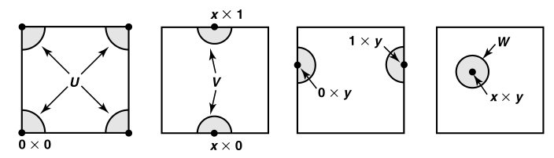
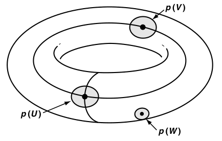
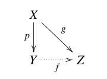
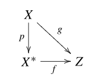
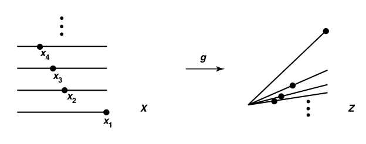
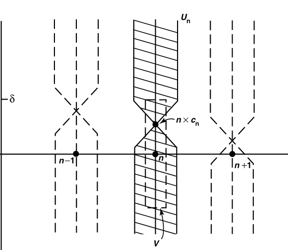

# 第二章下：拓扑映射

## 前置知识

### 映射保集合运算性

- **运算缩小性**：
  - $A\subset B \Rt f(A) \subset f(B) \not\Rt A\subset B$
    - **反例**：$f$ 在B上是单射，在A上是非单射，则可能出现A不含于B，但映射后被压缩到B的像中
  - $f(A\cap B) \subset f(A)\cap f(B)$
    - **反例**：$B$ 中某些 $A\cap B$ 以外的元素，在映射后和 $A$ 中 $A\cap B$ 以外的某些元素的像重叠。这部分就是 $f(A)\cap f(B)$ 多出来的元素
  - $f(A\cup B) = f(A)\cup f(B)$
    - **理解**：因为映射必须单值，因此只能缩小，不能扩大。即只能将多点压成单点，不能使单点扩成多点
- **逆缩小性**：
  - 设
    - $f: A\to B$
    - $A_0\subset A，B_0\subset B$
  - 则 $\begin{cases} A_0\subset f^{-1}\big[ f(A_0) \big] ，单射则相等\\\\ f\big[ f^{-1}(B_0) \big]\subset B_0，满射则相等 \end{cases}$
  - **理解**：一般函数的逆映射可能是多值映射
    - $f^{-1}$ 的像为 $f$ 原像的等价类，从而包含 $f$ 的原像。若是单射，则等价类等于本身
    - $f^{-1}$ 的原像可能超出 $f$ 的值域，从而包含 $f$ 的像。若是满射，则像等于值域
  - **反例**：$f: \R\to\R，f(x) = 3x^2+2$，非单射非满射
    - 则
      - $f^{-1}\big[ f[0,1] \big] = f^{-1}[2,5] = [-1,1]$
      - $f\big[ f^{-1}[0,5] \big] = f[-1,1] = [2,5]$
- **逆运算相等性**
  - $A'\subset B' \Rt f^{-1}(A') \subset f^{-1}(B')$
  - $f^{-1}(A'\cap B') = f^{-1}(A')\cap f^{-1}(B')$
  - $f^{-1}(A'\cup B') = f^{-1}(A')\cup f^{-1}(B')$
  - $f^{-1}(A'- B') = f^{-1}(A')- f^{-1}(B')$
  - $f^{-1}(\complement A') = \complement f^{-1}(A')$
  - **理解**：逆映射可以多值，从而无缩小性

## 封闭缩小性

- **拓扑空间上的连续函数**：像空间中，开集的原像都是开集
  - **本质**：这样定义的理由是，连续的核心是讨论点的邻域，而邻域是开集
    - 比如连续映射将边界映射成边界，就是通过取边界点邻域来表达这个性质，然后由连续映射的定义，可以很方便地导出结论。这就是契合性质来定义的威力
    - 再比如闭集的聚点定义，在收敛性中比开集补集的定义要有力的多。而前者在拓扑空间的诱导关系中更加有力一些
    - 连续映射，意思就是保持连续性的映射。而具有连续性的映射就是开集，所以连续映射的定义必然和开集有关
    - 同时，因为映射是可能损失信息的（比如二维到一维的投影），但映射不可能增加信息（映射具有单值性）。所以一个映射可能把开集的连续性破坏掉，但绝不可能把不连续的集合映射成开集。因此就有了现在的定义
  - **连续性由基表出**：由于开集可以写成某些基的并，从而开集的原像也是基的原像的并
  - **连续性由子基表出**：任何基的像都是子基像的有限交
  - **连续的封闭性、缩小性**：在拓扑中，“连续”的意义是，像中的拓扑元素必定也是原像中的拓扑元素。但并不是每个原像中的拓扑元素都被映射为拓扑元素
- **（定理18.1）连续函数等价命题**
  - **理解**：因为从像集到原像集是封闭的，但反之却不一定。所以一般都从像集中构造邻域进行反推
  - **本质**：映射的保集合运算性和缩小性 + 闭包的扩充性 + 连续映射的保邻域性
  - **保收敛性**：$x_n\to x_0\red\Rt f(x_n)\to f(x_0)$
    - **证明**：
      - **必要性**：由连续性，任取 $f(x_0)$ 的邻域 $V$，其逆像还是开集，从而是 $x_0$ 的邻域，故总能找到 $x_n\in f^{-1}(V)$，使得 $f(x_n)\in V$，从而收敛性得证
      - **充分性**：由闭集聚点定义，即得闭集传递性，从而是连续映射
  - **闭包缩小性**：$\forall A\subset X$，$f(\ol A)\subset \overline{f(A)}$
    - **必要性**：
      - $\forall x\in \ol A$，对于 $\forall O(f(x))$，其原像设为 $B(x)$。
        - 由闭包的邻域定义，$\exist y\in X，B(x)\cap A \supset y$
        - 由映射保包含性，$f(B(x)\cap A) \supset f(y)$
        - 再由映射交缩小性， $f(B(x)\cap A) \subset  O(f(x))\cap f(A)$
      - 综上，$O(f(x))\cap f(A) \supset f(y)$，满足闭包邻域判定法，$f(x)\in \ol{f(A)}$
      - 再由 $x$ 和 $O(f(x))$ 的任意性，即得 $f(\ol A)\in \overline{f(A)}$
    - **充分性**：目前能用的定理太少，闭集只能通过补集得到开集。所以用闭集传递性反推
  - **闭集传递性**：像集上的闭集，原像也为闭集
    - **必要性**：
      - 设 $B$ 是闭集，$A=f^{-1}(B)$
      - 则 $\forall x\in\ol A$，有 $f(x)\in f(\ol A) \subset \overline{f(A)} = B = f(A)$
      - 所以 $\ol A \subset A$，从而 $A$ 是闭集
    - **充分性**：
      - 像空间 $Y$ 上，设 $Y-B = V$
      - 则由逆映射保集合运算性，$f^{-1}(B) = X-f^{-1}(V)$
      - $V$ 原像是闭集 $B$ 原像的补集，从而是开集，从而 $f$ 连续
  - **邻域缩小性**：$\forall V = O(f(x))，\exist U = O(x)$，使得 $f(U)\subset V$
    - **必要性**：令 $U=f^{-1}(V)$ 即可
    - **充分性**：$\forall x\in f^{-1}(V)$，存在 $f(U_x)\subset V$
      - 则适当选取 $x$，即可有 $f^{-1}(V) = \bigcup U_x$ ，所以 $f^{-1}(V)$ 是开集

### 同胚

- **同胚**：双射 $f: X\to Y$，若正逆均连续，则为同胚
  - **等价命题**：连续双射且为开映射/闭映射
    - **证明**：连续定义法/拓扑性质（基+序）的传递性
  - 连续双射不是同胚：连续指 $f$ 连续，但 $f^{-1}$ 不一定连续
  - **实例**：
    - **实轴上**：$(a,b) \sim (0,1)，[a,b]\sim [0,1]$
    - **截口同胚性**：设 $X,Y$ 是拓扑空间，则 $X\times \{y_0\}$ 和 $X$ 同胚
      - **证明**：取映射 $f(x,y_0) = x$ 和 $f^{-1}(x) = (x,y_0)$，易得双射性、双边连续性
      - **理解**：一个超平面和一个高维空间的超平面是一样的
- **拓扑性质**：可以通过同胚传递的性质
- **拓扑嵌入**：连续单射 $f:X\to Y$ 中，满足像集 $Z\subset Y$ 和 $X$ 同胚
  - **封闭缩小性**
  - **实例**：
    - **管道嵌入**：设 $\begin{cases} f:X\to X\times Y，x\mapsto x\times y_0 \\ g:Y\to X\times Y，y\mapsto x_0\times y\end{cases}$，则它们都是同胚
  - **拓扑包含**：$f:X\to Y$，其中 $X\subset Y$
    - 区别是嵌入只需要同胚，包含必须是原来的集合

### 构造连续函数

- **（定理18.2）连续函数构造法则**：实际上是派生法则……
  - 常函数、恒等嵌入函数
  - 连续函数的复合
  - 连续函数的限制、值域限制、值域扩充（只要集合等势就可以做到）
  - 局部连续函数的并：$f = \mathop{\bigcup}\limits_{\alpha\in A}f|_{U_\alpha}$
  - （基本连续函数）：适用于任何拓扑空间
- **（定理18.3）粘贴引理**： 拓扑空间 $(X,\tau)$ 中
  - 若
    - $X=A\cup B$，且 $A$ 和 $B$ 均为 $X$ 中的闭集
    - $f/g:A/B\to X$ 均为连续函数
    - $A\cap B$ 中两个映射相等
  - 则 $h(x) = \begin{cases} f(x)，x\in A \\ g(x)，x\in B \end{cases}$ 是连续函数
  - **证明**：
    - 任取闭集 $C$ ，则 $h^{-1}(C) = f^{-1}(C)\cup g^{-1}(C)$（逆映射保集合运算性）
    - 由闭集并传递性即得结论
  - **推论（开集形式）**：A和B是开集时也成立
- **（定理18.4）向量值连续（组合性）**：
  - 设 $f:A\to X\times Y，a \mapsto f_1(a) \times f_2(a)$
  - 则 $f$ 是连续函数 $\Leftrightarrow$ 两个分量函数均连续
  - **证明**：
    - **必要性**：
      - 坐标函数投影性得 $f_i(a) = \pi_i(f(a))$
      - 由投影的连续性 + 连续的复合传递性，得坐标函数连续
    - **充分性**：
      - 类似投影映射，易得 $f^{-1}(U\times V) = f^{-1}_1(U) \cap f^{-1}_2(V)$
        - 设 $a\in f^{-1}(U\times V)$，则 $f(a)\in U\times V$
        - $a$ 是一维点，故 $f_1(a)\in U，f_2(a)\in V$
      - 再由开集交封闭性，得 $f$ 连续
  - **推论**：
    - 高维到低维的映射无组合性
      - $f:X\times Y\to A$ 中，“$f$ 在 $X$ 和 $Y$ 上均连续 $\neq f$ 连续”
      - **反例**：数分中，必须沿各个曲线方向均连续，才能有 $f$ 连续
    - 参数化曲线的连续性
      - 参数方程均连续

### 习题

#### 同数分

- **连续映射保聚点性**：
  - **证明**：设 $x$ 是 $A$ 聚点，则 $\forall O(f(x))$ 的原像都为 $x$ 邻域，从而都包含 $A$ 中的点 $y$，从而由 $f(y)$ 总存在得到 $f(x)$ 也是聚点

#### 

- 设 $f:A\to Y$ 是连续映射，$Y$ 是H空间
- 若 $f$ 可连续延拓到 $\ol A$ 上，则其被唯一决定
  - **证明（存在性）**：设 $g(\ol A\j A) = \lim\limits_{n\to\infty} f(x_n)$，其中 $x_n\to x\in (\ol A\j A)$ 即可
  - 唯一性见引理38.3即可

## 任意维度的积拓扑

- 由于是积运算诱导的拓扑，故开集只能为矩形
- **箱拓扑**：取积空间上所有的开集 $\prod U_i$ 为基
  - 基为任意矩形
- **积拓扑**：取 $\mc S = \{\pi_i^{-1}(U_i)\mid i\in I\}$ 为子基。基为其有限交
  - 基为长条的有限交
  - **投影性**：$S\in \mc S \Leftrightarrow \forall i，\pi_i(S)\in U_i$
- **J-元组**：任意的笛卡尔积指标映射
  - **指标集合**：向量集合 $J$
    - 元素为向量 $\alpha \in J$
  - **指标映射** $\bold{x}:J\to X，\alpha \mapsto (x_\alpha)_{\alpha\in J}$
- **任意笛卡尔积**：
  - 设有赋标集族 $X = \mathop{\bigcup}\limits_{\alpha\in J} A_\alpha$，则其所有的笛卡尔积可表示为 $\prod\limits_{\alpha\in J} A_\alpha$
- **任意积空间**：$\prod\limits_{\alpha\in J} X_\alpha$（**因子空间**：$X_\alpha$）
  - **箱拓扑的开集**：$\prod\limits_{\alpha\in J} U_\alpha$
  - **积拓扑的开集**：
    - **指标投影映射** $\pi_\beta:\prod\limits_{\alpha\in J} X_\alpha\to X_\beta$
    - **因子空间开集的逆投影**：$\mathcal{S}_\beta = \{\pi_\beta^{-1}(U_\beta)\mid U_\beta 是开集\}$
    - **因子空间开集的逆投影全集**：$\mathcal{S} = \mathop{\bigcup}\limits_{\beta\in J} \mathcal{S}_\beta$
    - **$\mathcal{S}$ 生成的基**：$B = \pi_{\beta_1}^{-1}(U_{\beta_1}) \cap ... \cap \pi_{\beta_n}^{-1}(U_{\beta_n})$（开集逆投影的所有有限交）
      - **积子集方向性**：这里的开集并不是传统意义上的子集，而是所有正交方向上的子集
      - **积子集筛选性**：无数个积，却只能有有限个交。所以经过有限交后，长条依然不能变成点，而是变成低维的长条。
        - $B = \prod\limits_{\alpha\in J} U_\alpha，U_\alpha = \begin{cases} X_\alpha，\alpha\neq\beta_1,...,\beta_n（长条的无界面） \\ U_\alpha，其它情况\qquad （长条的有界面）\end{cases}$
  - **（定理19.1）箱拓扑和积拓扑**
    - 有限积上两者相同
      - **理解**：长条可以通过有限交化为点
    - 箱拓扑细于积拓扑
      - **证明**：哪种方法都挺易得的
  - **（定理19.2）基的任意积性**：因子空间的基的积 $\{\prod\limits_{\alpha\in J} B_\alpha\}$ 是箱拓扑的积
    - **证明**：箱拓扑定义即可
  - **（定理19.3）子空间的任意积性**：若因子空间的子空间具有箱/积拓扑，则其任意积也具有积空间中的箱/积拓扑
    - **证明**：
  - **（定理19.4）H空间的任意积性**：若因子空间是H空间，则其任意积既是箱拓扑又是积拓扑空间
  - **（定理19.5）闭包的任意积性**：若因子空间具有箱拓扑或积拓扑，则其子集 $A_\alpha$ 满足 $\prod \ol{A_\alpha} = \overline{\prod A_\alpha}$
    - **证明**：只需考虑积拓扑情况
      - **必要性**：$\forall x\in \prod \ol{A_\alpha}$，设 $U=\prod U_\alpha$ 是包含该点的基
        - 则每个维度下x的投影为 $y_\alpha \in U_\alpha\cap A_\alpha$
        - 从而任意包含x的开集（x的邻域）和 $\prod A_\alpha$ 有重叠，即 $x\in \ol{\prod A_\alpha}$
      - **充分性**：$\forall x\in \ol{\prod A_\alpha}$，设 $V_\beta$ 是包含x的因子空间中的开集（$\beta$ 是向量）
        - 则 $\pi^{-1}(V_\beta)$ 是积空间中的开集，包含一点 $y$ 使得 $y_\beta\in V_\beta\cap A_\beta$
        - 从而任意包含x的开集（x的邻域）和 $A_\beta$ 有重叠，x在闭包的积中
    - **理解**：
  - **（定理19.6）向量值连续（任意积空间）**：
    - $f:A\to \prod\limits_{\alpha\in J}X_\alpha，f(a)=(f_\alpha(a))_{\alpha\in J}$
    - 若 积空间上存在积拓扑
    - 则 函数连续 $\LR$ 坐标函数均连续
    - **证明**：
      - **必要性**：投影连续性 + 复合连续性即可
      - **充分性**：转化为证明子基元素的 $f$ 逆像均为开集
        - 由穿脱原理，$f^{-1}(\pi^{-1}_\beta(U_\beta)) = f^{-1}_\beta(U_\beta)$，左边是子基的逆像，右边为开集（**得证**）
    - **理解**：积拓扑的意义是将有限引入了无限，从而同胚性质得以传递到任意维度上
    - **推论**：箱拓扑不具有连续映射组合性
      - **反例**：$R^\omega$ 上的恒等扩充映射 $f(t) = (t,...,t,...)$，其在积拓扑上连续，但在箱拓扑上不连续
      - 箱拓扑的开集 $B = \prod\limits^\infty_{n=1} (-\frac{1}{n},\frac{1}{n})$，其逆像只能是区间。若区间为开区间 $(-\delta,\delta)$，则其属于 $\forall (-\frac{1}{n},\frac{1}{n})$，是不可能的。
      - 而如果是积拓扑，则B不构成开集。开集只能是无限维的长条，其被映射为有限区间

## 度量拓扑

- **集合的度量**：$d:X\times X\to R$，满足非负性、对称性、三角不等式
  - d度量下的距离 $d(x,y)$
  - d度量下的球 $B_d(x,r) = \{y\mid d(x,y) < r\}$
- **度量拓扑**：集合内所有的球为基构成的拓扑
  - **覆盖性**：球定义易得
  - **交稠密性**：定义 + 三角不等式 + 构造更小的球
  - **基生成性**：U是度量开集 $\Leftrightarrow$ U内所有点都是一个被U包含的球的球心
    - **必要性**：基判定引理得 $\forall x\in U，\exist B(x_0,r)\subset U$，使得 $x\in B(x_0,r)$
      - 再取 $B' = O(x,\min\{d(x,x_0), r-d(x,x_0)\})$ 即可
    - **充分性**：基判定引理直得
- **可度量拓扑空间**：$(X,\tau)$ 中，存在某个度量 $d$ 可以诱导出 $\tau$
- **有界子集**：$\forall a_1,a_2\in A，d(a_1,a_2)\leq M$
  - **直径**：$diam\ A = sup\{ d(a_1,a_2)\mid a_1,a_2\in A \}$
- **（定理20.1）标准有界度量**：$\bar{d}:X\times X\to R（\bar{d}(x,y) = min\{d(x,y),1\}）$
  - 则其也是一个度量，且和d导出相同的度量拓扑
  - **证明**：
    - 因为其同样具有三角不等式，所以可诱导拓扑
    - 因为半径小于1的球在两个空间内是同一个，所以其诱导出相同的度量拓扑
- **范数**：$\|x\|$
  - **欧氏度量**：距离为欧氏空间上的范数（2-范数）
  - **平方度量**：$\rho(x,y) = max\{|x_1-y_1|,...,|x_n-y_n|\}$）（1-范数）
    - 由实数三角不等式可以导出度量三角不等式
- **（引理20.2）度量单调性**：$\tau'$ 细于 $\tau \Leftrightarrow B_d(x,\delta) \subset B_d(x,\varepsilon)$ 
  - **证明**
    - **必要性**：基的单调性
    - **充分性**：同上，本质是基的性质
- **（定理20.3）** $R^n$ 上，欧氏度量和平方度量诱导的拓扑均等价于积拓扑
  - **证明**：
    - 易得 $\rho \leq d \leq \sqrt{n}\rho$（三角形边关系）
      - 因此 $B_\rho(x,\frac{\varepsilon}{\sqrt{n}}) \subset B_d(x,\varepsilon) \subset B_\rho(x,\varepsilon)$
      - 两个拓扑互包，从而相等
    - 同时，有限维空间上，积拓扑的基 $B = (a_1,b_1)\times ... \times (a_n,b_n)$ 是一个长方体，其中可以找到更小的矩形。并且，平方度量的基本身就是积拓扑的基的一种。因此平方度量拓扑和积拓扑等价
- **无穷维空间**：欧氏度量若不收敛则失去意义
  - **一致度量**：$\bar{\rho} = \sup\{\bar{d}(x_\alpha,y_\alpha)\mid \alpha\in J\}$，其中 $\bar d$ 是标准有界度量
    - **理解**：用于在任意维空间上定义度量
  - **一致拓扑 $\tau_{\bar{\rho}}$**：一致度量诱导的拓扑
- **（定理20.4）粗细关系**：箱拓扑 $\subset$ 一致拓扑 $\subset$ 积拓扑
  - **证明**：
    - 积拓扑的基中无界面上可以找到矩形基，有界面上可以找到更小的矩形基。从而 $\tau_\rho$ 细于 积拓扑
    - 因为总存在比矩形基更小的矩形，所以箱拓扑 细于 $\tau_\rho$
- **（定理20.5）**  $R^\omega$ 上可以定义度量 $D(x,y) = \sup\{\cfrac{\bar{d}(x_i,y_i)}{i}\}$，其生成一个积拓扑
  - **证明**：
    - 首先，其满足三角不等式，生成一个拓扑
    - D拓扑上找到球 $B_D(x,r)$
      - 设 $V = (x_1-r,x_1+r)\times ... \times (x_N-r,x_N+r) \times R   \times ... \\$（$\frac{1}{N} < r$）
      - 设 $y$ 满足 $\forall i > N，D(x,y) \leq \frac{1}{N}$（N后面的维度上，$d(x_i,y_i) \leq 1$）
      - 因此 $D(x,y) \leq r$，从而 $V\subset B_D(x,r)$
    - 在每个有界面上取 $(x_i-r_i,x_i+r_i)（r_i<1）$
      - 设 $r = \min\{\frac{r_i}{i}\mid i=\alpha_1,...,\alpha_n\}$
      - 设 $y$ 是 $B_D(x,r)$ 中一点，则 $D(x,y) < r$
      - 再因为 $\frac{\bar{d}(x,y)}{i}<D(x,y)$ ，则 $|x_i-y_i|\leq r_i$，从而 $B_D(x,r)\subset U$

### 度量上的连续性

- 子空间可传递度量
- 序拓扑不一定可度量
- 度量拓扑 $\subset$ H空间
- **（定理21.1）连续函数的度量定义**
  - $\forall \varepsilon>0，\exist \delta>0，\forall d_X(x,y) <\delta，有 d_Y(f(x),f(y)) < \varepsilon$
  - **证明**：
    - 必要性：开球的逆像 $f^{-1}(B_Y(f(x),\varepsilon))$，其为开集。内部一定可以找到更小的球
    - 充分性：取 $f(B(x,\delta))\subset B(f(x),\varepsilon) \subset V$，则 $B(x,\delta)$ 是x的邻域。由x的任意性，得V的逆像可被开集并出，从而是开集
- **（引理21.2）数列引理（度量空间完备性）**：
  - 若A中存在收敛到x的数列，则x在A的闭包中
    - **证明**：聚点定理
  - 若X是度量空间，则满足完备性
    - **证明**：利用 $B_d(x,\frac{1}{n})$ 即可导出一个数列
- **（定理21.3）Heine定理**：
  - 连续函数 $f$ 满足 $f(x_n)\to f(x)$
    - **证明**：构造邻域列 $V(n) = O(f(x),\frac{1}{n})$ ，则 $f^{-1}(V(n))$ 是x的邻域，由聚点定理得到 $x_n\to f(x_n)$ 收敛
  - 度量空间上满足H定理的函数是连续函数
    - **证明**：A闭包中一点x，存在 $x_n\to x$，H定理得 $f(x_n)\to f(x)$。再由Y完备性得 $f(x)\in \overline{f(A)}$，从而 $f(\bar{A})\subset \overline{f(A)}$，闭集传递性得连续
- **可数基**：x点的邻域列 $\{U_n\}_{n\in Z_+}$，使得任意 $O(x)$ 至少含有其中一项
  - 刚才的邻域开球列就是一个可数基，$V(n) = \mathop{\bigcap}\limits^\infty_{n=1}U_n$
  - **第一可数公理**：每个点都有可数基
  - 度量空间均满足第一可数公理，反之不一定
- **（引理21.4）四则运算连续性**：四则运算本身可看作函数，用度量定义即可证明
- **（定理21.5）函数四则运算连续性**：运算的本质是二维到一维的映射。函数运算本质是两个函数空间的积映射到像集中。而积具有连续性（向量值组合连续性）
- **一致收敛**：只需要Y是度量拓扑空间，X是拓扑空间
  - $\forall \varepsilon>0，\exist N>0，\forall n > N，有 d_Y(f_n(x),f(x)) < \varepsilon$
  - （似乎度量拓扑中没有点态，只有一致）
  - **函数拓扑空间**：$f:X\to R$ 的所有函数形成一个拓扑空间 $R^X$，其上定义一致度量，则 $f_n \to f \Leftrightarrow f、f_n$ 均为 $R^X$ 上的开集（？）
- **一致极限定理**：一致收敛的连续性
  - **证明**：设开集V中一点 $y_0 = f(x_0)$，其逆像 $x_0$ 邻域为 $U$
    - 选择适当小的U、适当大的N
      
    - 利用一致收敛性 + 三角不等式，得到 $d(f(x),f(x_0)) < \varepsilon$

### 习题

- $R^w$ 上的箱拓扑不可度量
  - **证明**：
    - 数列引理在可数维空间上不成立
- 可数个 $R$ 的乘积不可度量
  - **证明**

#### 习题：度量收敛性

- $X$ 是所有 $R^n$ 上满足 $\forall \a,\b，p_{\a,\b}(f) = \sup\limits_{x\in R^n}|x^\a\a^\b f(x)|$ 的光滑函数，则 $\{p_{\a,\b}\}$ 构成一个半范数列，且一致收敛
- 对 $X\in C[a,b]$，不存在 $\rho$ 使得度量空间 $(X,\rho)$ 上的 $f_n\to f \LR f_n(x)\to f(x)$

## 等价性

### 商映射

- **开映射**：开集的像均为开集
- **闭映射**：闭集的像均为闭集
- **非等价性**：开映射不等价于闭映射
  - **反例**：
    - **开非闭**：投影映射
      - $\pi : R^2\to R，\{y=\frac{1}{x}\}\mapsto (0,\infty)$
      - 闭曲线 $\to$ 开区间
    - **闭非开**：嵌入映射
      - $E: R\to R^2，(0,1)\mapsto (0,1)\times \{0\}$
      - 开区间 $\to$ 开线段（闭集）
    - **开且闭**：恒等映射、同胚映射
- **商映射**：满射 $p$ 满足：$U$ 是开集 $\LR p^{-1}(U)$ 是开集
  - **本质**：
    - 强连续性：$p$ 和 $p^{-1}$ 均连续，但不是双射（等价压缩性）
      - 若是单射则进化为同胚
    - 等价性：$p$ 将等价元素映射为等价类
    - 饱和同胚性：$p$ 是饱和集合的同胚映射
    - **饱和集合**：定义依赖于某个满射
      - **定义**：设 $f:X\to Y$ 是满射
        - 则满足以下条件的 $C\subset X$ 是饱和集合：
        - $\forall y\in Y$，若 $f^{-1}\{y\}\cap C\neq \varnothing$，则 $f^{-1}(y) \in C$
      - **本质**：$\forall x\in C$，像与其相同的点（$f$ 等价类）必定在 $C$ 内部
      - **理解**：
        - $C$ 包含其全部的 $f$ 等价类，从而 $f$ 在 $C$ 上是单射，$C$ 和 $f(C)$ 同胚
        - $f^{-1}\big[ f(C) \big] = C$
- **等价条件**：
  - **闭集强连续性**：$B$ 是闭集 $\Leftrightarrow p^{-1}(B)$ 是闭集
    - **证明**：由逆映射保集合运算性，$f^{-1}(Y-U) = X-f^{-1}(U)$
  - **饱和单射性**：$p$ 连续，且把饱和开/闭集映射成开/闭集
    - **证明**：
      - **必要性**：
        - **连续性**：若 $U\subset Y$ 是开集，则 $p^{-1}(U)$ 是开集
        - **饱和开性**：设 $C\in X$ 是 $p$ 的饱和开集
          - 由饱和性得单射性，从而 $p^{-1}\big[ p(C) \big] = C$，其为开集
          - 再由连续性即得 $p(C)$ 是开集
      - **充分性**：
        - **满射性**：
        - **强连续性**：只需证明开集 $U$ 的像 $p(U)$ 也是开集
    
    - **理解**：
      - 满射的逆映射可能是多值的，若原像出现C以外的点，则可能变为闭集
      - 因此，C饱和保证了满射的可逆性
- **充分条件**
  - 开映射或闭映射（同胚映射）
    - **证明**：定义易得满足强连续性
  - **非必要性**：商映射可以既不开也不闭
    - **反例**：非开非闭的商映射
      - $x$ 轴投影映射 $p:A\to R$，A为含y轴的右半平面
        - 商映射：
        - 非开映射：$[0,\delta)\times U_y \to[0,\delta)$ ，开集映射成非开非闭集合
        - 非闭映射：$\{y=\frac{1}{x}\}\to (0,\infty)$ ，闭集映射成开集
    - **本质**：并非 $X$ 中所有开/闭集均可写为 $f^{-1}(U)$ 的形式，所以存在某些开集的像不是开集

#### 实例

- $X = [0,1]\cap [2,3]，Y = [0,2]$
- $p = \begin{cases} x，\qquad x\in[0,1] \\ x-1，\ x\in[2,3] \end{cases}$
  - 其为商映射
  - 其不为开映射：开集 $[0,1]\subset X$ 的像 $[0,1]\subset Y$ 不是开集

#### 反例

- 投影映射 $\pi_1: \R\times\R \to \R$
  - 其为开映射
  - 其不为闭映射
- 饱和延拓 $q: A\to\R$
  - $A = \{y = \frac{1}{x}\} \cup \{\bf 0\}$
  - 其为连续满射
  - 其不为商映射：$\bf \{0\}\subset A$ 是开集，对 $q$ 饱和，但其像 $\{\bf 0\}\subset\R$ 不是开集

### 商拓扑

- **商映射导出的商拓扑**：设 $A$ 是空间 $X$ 的子集，$p: X\to A$ 是满射
  - 若 $p$ 相对于 $A$ 是商映射
  - 则 $A$ 中存在 $p$ 生成的商拓扑 $\mc T$
    - 基：原像为开集的集合
  - **证明**：$\mc B = \{B\mid p^{-1}(B) = U\}$ 是基即可
    - **覆盖性**：$p^{-1}(A) = X$ 是开集，从而 $A$ 是基
    - **交稠密性**：由逆映射保集合运算性，$p^{-1}(B_1\cap B_2) = U_1\cap U_2 = U_3$ 是开集
      - 则 $(B_1\cap B_2) \in \mc B$，有限交封闭，满足交稠密性
  - **实例**：
    - 有限商拓扑
      - $p: \R\to \{a,b,c\}，x\mapsto \begin{cases} a，x>0 \\ b，x<0 \\ c，x=0 \end{cases}$
      - 商拓扑 $\mc T = \{\{a\}，\{b\}，\{a,b\}，\{a,b,c\}\}$
- **商空间**：
  - 设 $X^*$ 是 $X$ 的分拆中的一个等价类
  - 则
    - $p:X\to X^*$ 构成商映射
    - $(X^*,\mc T)$ 是拓扑空间
    - $X^*$ 称为 $X$ 的商空间
  - **证明**：恒等映射罢了
  - **实例**：
    - 球等价：$X = \{(x,y)\mid x^2+y^2 \leq 1\}$
      - **等价条件**：内部等价
        - 圆边界等价，收缩为一点
      - **商空间**：最终同胚于三维空间中的2-范数单位球面
    - 正方形等价：$X = [0,1]\times[0,1]$
      - **等价条件**：
        - 矩形内部不变
          - $i = \{(x,y)\}$
        - 对边等价，四条边收缩为两个边
          - $e_1 = \{(x,0),\ (x,1)\}，e_2 = \{(0,y),\ (1,y)\}$
        - 四个角等价，收缩为一个点
          - $a = \{(0,0),\ (0,1),\ (1,0),\ (1,1)\}$
      - **等价类**：$X^* = \{i,e_1,e_2,a\}$
      
      - **商空间**：最终正方形变为一个环面
        - 把两条对边粘合成环的内外侧边 $p(V) = e_1,e_2$
        - 把四个角粘合成环的一点 $p(U) = a$
- **（定理22.1）商映射的限制传递条件**：
  - 设 $p:X\to Y$ 是商映射，$A\subset X$ 是 $p$ 的饱和集，$q = p|_A$
  - 若 $A$ 是开集或闭集，或 $p$ 是开映射或闭映射
  - 则 $q$ 也是商映射
  - **证明**：
    - 设 $q^{-1}(V)$ 是 $A$ 中开集
      - 若 $A$ 是开集
        - 由子空间开集传递性（**核心**），$q^{-1}(V)$ 是 $X$ 中开集。
        - 由 $p$ 强连续性， $V$ 是 $Y$ 中开集
        - 再由子空间开集性，$V$ 是 $q(A)$ 中开集，从而 $q$ 是商映射
      - 若 $p$ 是开映射，设 $p^{-1}(V) = U\cap A$
        - $V = p(U)\cap p(A)$ 是 $Y$ 中开集
        - 由子空间开集性，$V$ 是 $q(A)$ 中开集，从而 $q$ 是商映射
    - 闭集同理
- **商映射的传递性**：
  - 复合传递性（可逆性）
  - 无积传递性：
    - 局部紧条件：
    - 开映射具有积性，从而可传递
  - 无H传递性
- **（定理22.2）常点映射等价类**：
  - 设
    - $p:X\to Y$ 是商映射（Y是等价类）
    - $g:X\to Z$ 是常点映射（将每个映射为）
  - 则
    - $g$ 由关系 $f\circ p = g$ 可导出映射 $f: Y\to Z$
    - $f$ 连续/强连续 $\Leftrightarrow g$ 连续/强连续
  
  - **证明**：利用强连续可逆，传递开集即可
    - 由常点映射，得 $\forall y\in Y，\exist z\in Z，g(p^{-1}\{y\}) = z$
      - 设 $f(y) = z$，即导出了 $f:Y\to Z$
    - **必要性**：（强）连续的复合传递性直得
    - **充分性**：
      - **连续性**：设 $V\in Z$ 是开集，则 $g^{-1}(V) = p^{-1}f^{-1}(V)$ 是开集。由于 $p$ 是商映射，故 $f^{-1}(V)$ 是开集
      - **强连续性**：若 $g$ 是商映射，则其为满射，故 $f$ 也是满射
        - 若 $f^{-1}(V)$ 是开集，则由 $p$ 连续性，$p^{-1}f^{-1}(V) = g^{-1}(V)$ 也是开集。从而 $V$ 是开集
  - **理解**：
- **（推论22.3）连续满射等价类**：
  - 设
    - $g:X\to Z$ 是连续满射
    - $X$ 的子集族 $X^* = \{g^{-1}\{z\}\mid z\in Z\}$，具有商拓扑 $\mc T$
    
  - 则
    - $f: X^*\to Z$ 是连续双射
      - **证明**：连续性由定理22.2，或复合传递性直接给出
        - 由 $p,g$ 均为满射得 $f$ 是满射，由 $X^*$ 的定义得 $f$ 是单射
      - **本质**：$X^*$ 是 $X$ 关于 $g$ 的等价类
    - $f$ 是同胚映射 $\Leftrightarrow g$ 是商映射
      - **必要性**：商拓扑得 $g^{-1}$ 是商映射，从而 $f^{-1}$ 存在且为满射，从而是双射。
      - **充分性**：$g$ 强连续则 $f^{-1}$ 连续，从而同胚 （$\subset$ 商映射）
    - 若 $Z$ 是H空间，则 $X^*$ 也是H空间
      - **证明**：$X^*$ 中的不同点，在双射 $f$ 映射下在Z中也不同
        - 由于 $Z$ 是H空间，存在两个不同的邻域
        - 由 $g$ 连续性 + $g^{-1}$ 保集合关系性，两邻域原像在 $X$ 中也是不相交邻域，从而 $X^*$ 是H空间

### 映射等价类实例

- $X = \{(x,n) \mid x\in [0,1]，n\in Z_+\}$
  - 等距线段
- $Z = \{(x,\dfrac{x}{n}) \mid x\in [0,1]，n\in Z_+\}$
  - 斜率向低处迭代的原点直线
- $g : X\to Z，x_n\to z_n = (x,\dfrac{x}{n})$
  - 连续满射
- 

- 同一个n之间建立y到k的映射关系 $g$
- **等价类商空间** $X^* = \{g^{-1}(z)\mid z\in Z\}$
  - **等价关系**：把y轴上的点收缩为一个点 $g^{-1}(0\times 0)$ 即可
  - 导出的 $f$ 是连续双射，但不是同胚（因为孤立点 $(0,0)$ 的存在），即g不是商映射

### 商映射无积传递性

- **反例（等价收缩映射）**：$p\times i:X\times Q\to X^*\times Q$ 不是商映射
  - $X$ 是实数集
  - 等价类 $X^*$ 压缩正整数为单点b，则 $p:X\to X^*$ 是商映射
  - 有理数恒等映射 $i$ 是商映射
- **证明**：令 $c_n = \frac{\sqrt{2}}{n}$
  - $U_n\in X\times Q$ 是穿过 $(n,c_n)$ 的斜率为 $\pm 1$ 的直线与 $x = n\pm\frac{1}{4}$ 包围成的开集
    - 其可以包含孤立点 $(n,c_n)$，因为 $c_n$ 不是有理数
  - 
  - 并集U也是开集，且其在等价收缩映射下饱和（U包含所有的n，且仅有n在y轴上周延），其像为U'
    - U'不包含极限点 $b\times 0$，取不到无穷
      - $W=O(b,\varepsilon)$
      - $I_\delta = Q\cap \{|y|<\delta\}$（$\varepsilon<\delta$）
    - 由其取不到无穷，以及p的强连续性，得 $p^{-1}(W)\times I_\delta\subset U$
      - （竖长条矩形，处于 $x$ 轴上方的直角三角形内部）
    - 当 $n\to\infty，c_n\to 0<\delta$ 时，$\exist (x,y)和\varepsilon$ 满足 $x = n + \frac{1}{2}\varepsilon，|y-c_n|<\frac{1}{2}\varepsilon$
      - 其在U外（横长条矩形，超出直角三角形）
      - 其在 $p^{-1}(W)\times I_\delta$ 内
      - 产生矛盾，除非U'不是开集，即饱和开集无法被映射为开集，从而不是商映射