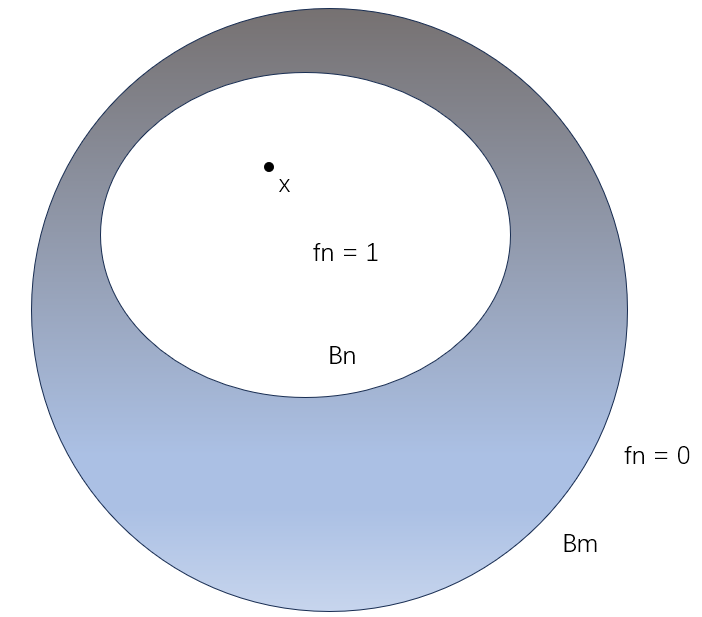

# 度量化与扩张性

## 正规空间

- **（定理32.1）正则进化定理**：A2的正则空间是正规空间
  - **证明**：
    - 设 $X$ 是正则空间，具有可数基 $\mc B$，且 $A,B$ 是不相交闭集
      - 由闭集聚点性，易得 $\forall x\in A$，存在邻域 $U$ 与 $B$ 不相交
      - 由正则性，可选邻域 $V$，满足 $\ol V\subset U$
      - 由可数拓扑基性质，可选邻域 $B_x\in \mc B$，满足 $x\subset B_x\subset V$
    - 由A2空间的弱紧性，对每个 $x\in A$ 进行选取，可得 $A$ 的可数覆盖 $\{U_n\}$，其元素闭包与 $B$ 不相交
    - 同理，可选取 $B$ 的可数覆盖 $\{V_n\}$
    - 只需证 $U = \bigcup U_n$ 与 $V = \bigcup V_n$ 不相交
      - 设 $U'_n = U_n\ \D \mathop{\bigcup}\limits^n_{i=1} \ol V_i，V'_n = V_n\ \D \mathop{\bigcup}\limits^n_{i=1} \ol U_i$（消去重叠部分）
        - 由 $A,B$ 不相交性，易得 $\{U_n'\}，\{V_n'\}$ 依然是 $A,B$ 的开覆盖
      - 设 $U' = \bigcup U'_n，V' = \bigcup V'_n$，只需证明它们不相交
        - 反设 $x\in U'\cap V'$，不妨设 $x\in U'_k \cap V'_j\quad (j\leq k)$
        - 从而由定义，$x\in U_j$，但 $x\notin \ol U_j$，矛盾
  - **理解**：正则性导出单点邻域不交，可数性导出邻域分拆，这两个分拆就是所有闭集的不相交邻域，从而正规得证
  - **本质**：将单点不交性质通过可数拓扑基传递到可数邻域覆盖上，从而传递到闭集上
   
- **（定理32.2）度量正规定理**：度量空间是正规空间
  - **证明**：设 $X$ 是具有度量 $d$ 的空间，$A,B$ 是不相交闭集
    - 由实数稠密性，$\forall a\in A，\exist B(a,\varepsilon_a)$ 与 $B$ 不相交。同理，$\exist B(b,\varepsilon_b)$ 与 $A$ 不相交
    - 设 $U,V$ 是包含 $A,B$ 的开集
      - 反设 $z\in U\cap V$，则 $\exist a,b$ 使得 $z\in B(a,\dfrac{\varepsilon_a}{2})\cap B(b,\dfrac{\varepsilon_b}{2})$
      - 从而 $d(a,b) < \dfrac{\varepsilon_a+\varepsilon_b}{2} < \varepsilon_a$ 或 $\varepsilon_b$，从而必定有 $B(a/b)$ 包含 $b/a$，矛盾
    - 从而满足正规性
  - **本质**：实数稠密性 + 放缩，类似数分证明某集合无上确界
- **（定理32.3）H进化定理**：紧的H空间是正规空间
  - **证明**：设 $X$ 是紧的H空间
    - **其为正则空间**
      - 设 $x,B$ 不相交，由紧H空间性质，闭集 $B$ 是紧集，从而存在有限邻域覆盖
      - 再由T2性，可找到不相交邻域，从而满足正则性
    - **其为正规空间**
      - 由紧性，对某个 $a\in A$，可取有限邻域 $\{U_a\}$ 覆盖 $A$
      - 由正则性，存在对应的 $B$ 邻域 $\{V_a\}$ 与之不相交
      - 取 $U = \bigcup U_a，V = \bigcap V_b$，它们就是 $A,B$ 的不交邻域，满足正规性
  - **理解**：紧空间可将点的覆盖性推广到整个闭集（紧集）上
  - **推论**：弱紧H空间也是正规的
- **（定理32.4）良序集进化定理**：良序集在序拓扑上是正规空间
  - **证明**：设 $X$ 是良序集
    - 首先，序拓扑包含 $\{(x,y]\mid x,y\in X\}$
      - 若 $y$ 是最大元，则所有 $(x,y]$ 构成 $X$ 的基
      - 若 $y$ 不是最大元，设 $y'$ 是 $y$ 的直接前继，则有 $(x,y] = (x,y')$。其为开集
        - 良序元素都有直接前继，从而良序集几乎就是离散可列集（仿离散可列）
    - 设 $A,B$ 是不相交闭集
    - 若均不包含最小元 $a_0$
      - **邻域性**
        - $\forall a\in A$，由无最小元性 + 离散性，存在基 $B_a\supset (x_a,a]$ 与 $B$ 不相交。同理，$\exist B_b\supset (y_b,b]$ 与 $A$ 不相交
          - 这里就体现出仿离散性了（每个单点 $a$ 自身和其邻域最多差一个前继），它也是导出正规性的核心
        - 故由任意性，$U = \mathop{\bigcup}\limits_{a\in A} (x_a,a]，V = \mathop{\bigcup}\limits_{b\in B} (y_b,b]$ 可覆盖 $A,B$，从而是它们的邻域
          - 这两个并集不一定可数，但可通过良序构造得到仿可列性，从而达到紧集将点不交性传递到闭集上的同样效果
      - **不相交性**
        - 反设 $z\in U\cap V$，则 $z\in (x_a,a]\cap (y_b,b]$，不妨设 $a<b$
          - 若 $a\leq y_b$，则两区间不相交
          - 若 $a > y_b$，则与 $y_b,b$ 与 $A$ 不相交矛盾
    - 若 $A$ 包含最小元 $a_0$
      - 则 $\{a_0\}$ 是闭开集，从而 $A-\{a_0\}$ 是闭集。则应用结论到 $A-\{a_0\}, B$ 即可
  - **理解**：已知离散可数集是正规的，而良序拓扑空间仿离散可列，故差不多的讨论方式即可
  - **推论**：每个序拓扑都是正则的（用不着）

### 例子

- $[0,1]^J$ 是正规空间
  - **证明**：$[0,1]$ 是紧的H空间，而紧性、T2性均可任意积传递
- 不可数积空间 $\R^J$
  - 是正则空间
    - **证明**：
  - 不是正规空间
    - **证明**：挺难
    - **推论**：正规空间无遗传性、无任意积传递性
      - **反例**：$\R^J$ 同胚于 $(0,1)^J\subset [0,1]^J$
- $S_\Omega\cap \ol S_\Omega$ 不是正规空间
  - **证明**：$S_\Omega$ 是具有序拓扑的最小良序集

### 习题

- **完全正规空间(complete)**：子空间均为正规空间
- **完美正规空间(perfect)**：正规空间中，每个闭子集为 $G_\d$ 集
  - **完全正规性**
    - **证明**：
  - **实例**：度量空间

## 度量化定理

- **度量化与可分性**：之前讨论可分性都是定性表示，但没有定量表示。这里就用连续映射将空间投射到实轴上，从而定量地讨论可分的程度
  - 但这里只是在可分范畴中讨论度量化，后面还有拓扑空间范畴上的的度量化

### 值域分离引理

- **Urysohn引理**：设 $X$ 是正规空间，$A,B$ 是不相交闭子集，$[a,b]$ 是实轴上闭区间
  - 则 存在连续映射 $f: X\to [a,b]$ 使得 $f(x) = \begin{cases} a，x\in A \\ b，x\in B \end{cases}$
- **证明如下**：
- **归纳法定义有理指标开集族**：首先考虑 $[0,1]$ 集合
  - 设 $P$ 是 $[0,1]$ 中的有理数
  - 由 $P$ 可数，可以归纳定义开集列 $\{U_p\}_{p\in P}$ 满足 $U_p\ss U_q\quad (p<q)$
    - **基础集**：设 $U_1 = X-B$，则是 $A$ 的邻域
      - 由正规性，存在 $U_0$ 满足 $A\ss U_0\ss U_1$
    - **前n个集合**：设 $P_n$ 是良序下前 $n$ 个有理数的集合，$U_p$ 是满足 $p<q\red\Rt U_p\ss U_q$ 的集合
      - 人为使良序中的大小关系对应集列中的紧含关系
    - **递推关系**：设 $P_{n+1} = P_n\cup \{r\}$，$r\neq 0,1$
      - 故可以定义直接前继和直接后继 $p,q\in P_{n+1}$
      - 由 $X$ 正规性，存在开集 $U_r$ 满足 $U_p\ss U_r \ss U_q$，从而归纳法可行
      - 证明归纳法可行的本质就是寻找前继后继（定义良序）的过程
  - 归纳法证明上述一一对应关系成立
    - 对于 $P_{n+1}$ 中的任意两个元素
      - 若两元素为 $p,q\in P_n$，由归纳假设，关系成立
      - 若两元素为 $r\in P_{n+1}-P_n$ 和 $s\in P_n$，
        - $s\leq p$，由归纳假设得 $U_s\ss U_p \ss U_r$
        - $s\geq q$，由归纳假设得 $U_r\ss U_q \ss U_s$
  - **具体归纳过程**：
  - $P = \{1,0,\dfrac{1}{2},\dfrac{1}{3},\dfrac{2}{3},\dfrac{1}{4},\dfrac{3}{4},\dfrac{1}{5},\dfrac{2}{5},\dfrac{3}{5}\}$
    - 首先定义 $U_0,U_1$，然后用分子分母字典序逐步细化即可
    - 分母为2
      - $U_0\ss U_{\frac{1}{2}}\ss U_1$
    - 分母为3
      - $U_0\ss U_{\frac{1}{3}}\ss U_{\frac{1}{2}} \ss U_{\frac{2}{3}}\ss U_1$
    - 分母为4……
  - 
  - **推广到整个 $\Q$**
    - 定义 $\begin{cases} U_p = \varnothing，p<0 \\ U_p = X，p>1 \end{cases}$
    - 易得 $\forall p,q\in\Q$，满足 $p<q \red\Rt U_p\ss U_q$
- **构造分离函数**
  - 设 $\Q(x) = \{p\mid x\in U_p\}$
    - **有界性**：其不含负数，包含所有大于1的数，上确界存在于 $[0,1]$ 中
    - **上确界**：设 $f(x) = \inf\Q(x)$
      - 压缩映射，将每个 $U_p-\ol U_q$ 映射为 $p,q$ 之间的一列稠密有理数，即将每个相邻的 $U_p,U_q$ 压缩为 $p$
  - **$f$ 为连续分离函数**
    - **分离性**：
      - 若 $x\in A$，则 $x\in \{U_p\mid p\geq 0\}$，$\Q(x)$ 为非负有理数，$f(x) = 0$
      - 若 $x\in B$，则 $x\in \{U_p\mid p>1\}$，$\Q(x)$ 为大于1的有理数，$f(x) = 1$
    - **连续性**
      - $x\in \ol U_r\red\Rt f(x)\leq r$
        - 易得 $x\in \{U_s\mid s>r\}$，从而 $\Q(x)$ 为大于 $r$ 的有理数
      - $x\notin U_r\red\Rt f(x)\geq r$
        - $\Q(x)$ 不包含小于 $r$ 的有理数
      - 任取 $x_0\in X$，$f(x_0)\in (c,d)\subset\R$
        - 由有理数稠密性，可选中间数 $c
p$，$x_0\notin \ol U_p$
            - 从而 $x_0\in U$
          - **对于 $f$ 是开集**
            - 任取 $x\in U$
              - 得 $x\in U_q\subset \ol U_q$，从而 $f(x)\leq q$
              - 得 $x\notin \ol U_p$，从而 $f(x)\geq p$
            - 从而由任意性，$f(U)\subset [p,q]\subset (c,d)$
        - 由于陪域是 $\R$，故开集都是不相交开区间的可数并 $\bigcup (c_n,d_n)$，由上述结论，无理点不在像集中，每个有理点的原像为 $U_q-\ol U_p$ 是开集，故 $\R$ 上开集的原像为 $\bigcup (U_q-\ol U_p)$ 也是开集，从而 $f$ 连续
- **本质**：若两个不相交闭集可被邻域分离，则也可被连续映射分离（将可分性度量化）
- **理解**：
  - 首先通过序号的方式，将紧含链与有理数关联起来（归纳法）
  - 然后取每个点的所处开集序号，构造映射
  - 核心是分离映射要有连续性，我们构造紧含集列的目的也是模拟度量连续性。
  - 为什么要用有理数序号：因为稠密（可构造连续）且可数（可用归纳法）
  - 为什么要紧含：保证每个 $U_p,U_q$ 之间存在开集 $U_q-\ol U_q$
  - 为什么要正规空间：因为正则空间中不成立
    - 第二步中，无法寻找 $U_0,U_1$ 之间的紧含集 $U_p$
    - 也就是说，分离性越强的空间，越可被度量化
  - 为什么要闭子集：分离性就是在闭集上探讨的，因为它具有“全聚点性”，从而可定义分离
- **推论**：逆命题成立
  - **证明**：设 $f: X\to [0,1]$ 是分离函数，则 $f^{-1}[0,\dfrac{1}{2}]，f^{-1}[\dfrac{1}{2},1]$ 是 $A,B$ 的不相交邻域

### 映射分离性

- **连续分离函数**：设 $A,B$ 是拓扑空间 $(X,\tau)$ 子集
  - 若存在连续映射 $f:X\to[0,1]$ 使得 $f(x) = \begin{cases} 0，x\in A \\ 1，x\in B \end{cases}$
  - 则称 $A,B$ 可被 $f$ 分离
- **完全正则空间（T5公理）**：
  - 满足T1公理（单点集是闭集）
  - 单点集和不相交闭集均可被连续函数分离
  - **推论**：
    - 完全正则空间是正则的（连续函数可分 $\subset$ 邻域可分）
      - **证明**：由U引理的逆命题，可设 $f(x_0) = 0，f(A) = 1$，则 $g = 1-f$ 是分离函数
    - 正规空间是完全正则的
      - **证明**：Urysohn度量化引理就是在证明这个
  - **实例**：
  - **反例**：
    - 完全正则，但非正规
      - $\R^2_\ell$
      - $S_\Omega\cap \ol S_\Omega$
    - 正则，但非完全正则
      - 难
- **（定理33.2）完全正则封闭性**：完全正则性在遗传和积下均封闭
  - **证明**：设 $X$ 是完全正则空间
    - **遗传封闭性**：设 $Y$ 是子空间，$x_0,A$ 是 $Y$ 中不相交闭集
      - 由 $A = \ol A\cap Y$，得 $x_0\notin\ol A$（这里指的是 $X$ 中闭集）
      - 由完全正则性，可选分离函数。其在 $Y$ 上的限制就是 $Y$ 的分离函数
    - **积封闭性**：设 $X = \prod X_\a$，$\bd b, A$ 是 $X$ 中不相交闭集
      - 选择 $\prod U_\a$ 为 $\bd b$ 的邻域，且与 $A$ 不相交
      - 则只有有限个维度上 $U_\a\neq X_\a$
      - 设 $f_i$ 为它们的连续分离函数，$\phi_i(\bd x) = f_i(\pi_{\a_i}(\bd x))$，则其连续，且支撑在 $\pi^{-1}_{\a_i}(U_{\a_i})$ 上
      - 则它们的积函数就是 $X$ 的连续分离函数

### 可度量条件

- **（定理34.1）Urysohn度量化定理**：A2的正则空间可度量
- **证明思路**：
  - 将 $X$ 嵌入到可度量空间 $Y$ 中
  - 有两种证明版本：积拓扑和一致度量拓扑下的 $\R^\omega$ 
- **嵌入引理**：A2的正则空间 $X$ 中，存在可数的连续映射列 $f_n: X\to [0,1]$ 满足：
  - $\forall x_0$ 和其邻域 $U$，$\exist n$，使得 $f_n(x_0)>0$，且支集为 $U$
  - 此时 $f_n$ 为 $X$ 到 $U$ 的嵌入
  - **证明**：存在性由U引理直得，只需可数性
    - 设 $\{B_n\}$ 是 $X$ 的可数拓扑基，序号 $n,m$ 满足 $B_n\ss B_m$
    - 构造连续分离函数 $g_{m,n}: X\to [0,1]，\begin{cases} g_{m,n}(\ol B_n) = 1 \\ g_{m,n}(X-B_m) = 0 \end{cases}$
      - **验证**：给定 $x_0$，邻域 $U$
        - 则由A2性，存在 $x_0$ 邻域 $B_m\subset U$
        - 再由正则性，还可选择邻域 $B_n \ss B_m$
        - 则由此定义的 $g_{m,n}$ 支撑在 $B_m$ 上，且 $g_{m,n}(x_0) = 1 > 0$
        - 易得该列也可数
  - **理解**：构造一列内部邻域基 $B_n$ 和外部邻域基 $B_m$ 的紧含链，在其上取分离函数列
  
- **积拓扑法**：
  - 设映射 $F: X\to\R^\omega，x\mapsto \Big(f_1(x),...,f_n(x),...\Big)$。只需证明其为嵌入
  - **连续性**：连续的任意积传递性直得
  - **单射性**：由嵌入引理易得
  - **像集同胚性**：设像集为 $Z$，连续双射性易得，只需开映射性
    - 开集 $U$ 中任取 $x_0$，则 $F(x_0) = z_0\subset F(U)$
    - 由嵌入引理，$\exist N$ 满足 $\begin{cases} f_N(x_0)>0 \\ f_N(X-U) = 0 \end{cases}$
    - 设 $V = \pi_N^{-1}\Big( (0,+\infty) \Big)$，则由子空间开集传递性，$W = V\cap Z$ 是 $Z$ 上开集
      - 由 $\pi_N(z_0) = \pi_N(F(x_0)) = f_N(x_0) > 0$，得 $z_0\in W$
      - 由 $U$ 支集性得 $W \subset F(U)$，再由 $x_0$ 任意性，即得 $F(U)$ 是开集的并
    - 综上，开映射性成立
- **一致度量拓扑法**：
  - 设映射 $F: X\to [0,1]^\omega，x\mapsto (f_1(x,)...,f_n(x),...)$，可数列值改为 $f_n(x) \leq \dfrac{1}{n}$
  - **度量**：$\rho(\bd x,\bd y) = \sup\{|x_i-y_i|\}$
  - **单射性**：嵌入引理直得
  - **像集同胚性**：只需开映射性，而由度量拓扑易得开映射性
  - **连续性**：不能用任意积性导出
    - 任取 $x_0 \in X$
      - 则对于每个 $n<N = \dfrac{\varepsilon}{2}$，均可找出邻域 $U_n$ 满足 $\forall x\in U，|f_n(x)-f_n(x_0)| \leq \dfrac{\varepsilon}{2}$
      - 而对于 $n>N$，由 $f_n(x) \leq \dfrac{1}{n}$，同样可得上述不等式
    - 综上，设 $U = \mathop{\bigcap}\limits^N_{n=1} U_n$，即可有 $\rho(F(x),F(x_0)) < \varepsilon$，从而 $F$ 连续。
- **理解**：
  - 核心是可数拓扑基导出的可数分离函数列，将原先的A缩成一个点，使得原先的有理数压缩单射被强化为实数同胚
  - 积拓扑易得连续，难得开映射，需要构造
  - 度量拓扑易得开映射，难得连续，需要放缩讨论

### 度量化推论

- **（定理34.2）嵌入定理**：设 $X$ 是T1空间，$\{f_\a\}_{\a\in J}$ 是嵌入引理的函数列
  - 则其组合函数 $F: X\to\R^J$ 是嵌入映射（$[0,1]^J$ 同理）
  - **证明**：同U定理
  - **理解**：T1空间为了确保是单射
- **（定理34.3）标准度量可分空间**：完全正则空间 $\LR$ 同胚于 $[0,1]^J$ 的子空间

## 延拓性定理

### Tietze扩张定理

- **（定理35.1）T扩张定理**：设 $X$ 是正规空间，$A$ 是闭子空间
  - 则连续映射 $f: A\to [a,b]$ 可被延拓为 $g: X\to [a,b]$（$\R$ 同理）
- **证明思路**：
  - 构造连续函数列 $s_n$，满足一致收敛且逐步延拓到 $g$
  - 由同胚等价性，像集 $[a,b]$ 可简化为 $[-1,1]$
- **三分引理**：设连续函数 $f: A\to[-r,r]$
  - 若将像集三等分为闭区间 $I_1,I_2,I_3$
  - 则由连续性，$B = f^{-1}(I_{1})，C = f^{-1}(I_{3})$ 为 $A$ 的不相交闭子集
  - **证明**：由U引理，存在连续映射 $g: X\to I_2$，此时 $B,C$ 的像为两端点，且易得满足
    - $|g(x)|\leq \dfrac{1}{3}r$（由连续性，$g(x)$ 的值域为 $[-\dfrac{1}{3},\dfrac{1}{3}]$）
    - $|g(a)-f(a)| \leq \dfrac{2}{3}r\quad (\forall a\in A)$（分类讨论 $a$ 即可）
- **构造函数列**：
  - 取 $r = (\dfrac{2}{3})^0$，进行三分，得到 $g_1$，取 $(f-g_1)|_A$，其值域为 $[-\dfrac{2}{3},\dfrac{2}{3}]$
  - 再取 $r = (\dfrac{2}{3})^1$，再进行三分，得到 $g_2$，再取 $(f-g_1-g_2)|_A$
    - $f-\sum g_i$ 的像集 $[-r,r]$ 不断向原点收缩，从而两不等式的右式也等比变小
  - 不断进行上述过程，设 $s_n(x) = \sum\limits^{n}_{i=1}g_{i}(x)$
  - 归纳可得 $\begin{cases} |g_n(x)| \leq \dfrac{1}{3}(\dfrac{2}{3})^{n-1}，\whh x\in X\\\\ |f(a)-s_n(a)| \leq (\dfrac{2}{3})^n，\quad a\in A \end{cases}$
  - 设 $g(x) = \sum\limits^\infty_{n=1} g_n(x) \color{chartreuse}= s_\infty(x)$
    - **一致收敛性**：同等比级数比较直得
    - **连续性**：由一致收敛性 + $s_n$ 连续性直得
    - **延拓性**：由第二个不等式，取极限得 $g(a) = f(a)\pad (\forall a\in A)$
    - **扩张性**：由第一个不等式，等比列求和得 $|g(x)|$ 上界极限为 $1$。再由连续性即得 $g: X\to[-1,1]$
  - 即使只知道 $g:X\to \R$
    - 也可以设 $r: \R\to [-1,1]，\begin{cases} r(y) = y，y\in[-1,1] \\ r(y) = \dfrac{y}{|y|}，y\notin [-1,1] \end{cases}$
    - 此时 $r\circ g$ 即为所需映射
- **理解**：
  - 正规空间和闭子集条件的意义：可以使用度量化引理
  - 度量化定理本身已经将定义域扩张为总空间，但只能将两个集合映射为两个区间端点（$\pm 1$），且和原映射存在有限偏差（$\dfrac{2}{3}r$）
  - 但是此时我们发现，取的两侧集合越大，造成的偏差越小。故采取迭代逼近的方式（逐步构造 $g_i$ 并在每一步取 $\sum g_i$ 迭代），即可造出几乎没有偏差的函数 $g = \sum\limits^\infty_{i=1} g_i$
  - 同时很巧合的是，如果我们取三分等比逼近，则正好 $g$ 的值域为 $[-1,1]$。当然我们在上面也补充了如果值域不为 $[-1,1]$ 时的补救方法，所以这个其实不重要。最重要的还是上面在 $A$ 上与 $f$ 几乎没有偏差的性质，也即延拓性
  <!-- - 要想达到扩张的效果，就必须取两部分集合 $I_1,I_2$ 来投射为端点。此时像集变为 $\{-1\} \cup I_2 \cup \{1\}$，偏差不超过 $\dfrac{2}{3}r$
  - 但是，我们可以不断缩小 $I_1,I_3$，最终将其压缩成两个点，此时像集就变回了 $[-1,1]$，从而达到了扩张的效果 -->
  <!-- - 扩张时需要再次使用度量化，将闭集三等分后再在度量空间上合并两侧的闭集，来实现 $g_n$ 的值域等比缩小，从而构造出收敛且上界为1的函数级数
  - 此时由于值域等比缩小了无穷次，所以为了达到和原来相同的值域，定义域就要相应扩大无穷次，也就是充满了整个空间 -->

### 推论（像集拓展到 $\R$ 上）

- 所有 $f:A\to \R$ 的连续函数均可被延拓为 $h:X\to\R$ 的连续函数
- **证明**：
  - 由同胚等价性，像集 $\R$ 可简化为 $(-1,1)$
  - 由T扩张定理，$f:A\to (-1,1)$ 存在连续延拓 $g:X\to [-1,1]$
    - 其中多出来的 $-1,1$ 两个点，取两个保连续的集合构建对应关系即可。但此时这两个集合的关系暂时未知
  - 设 $D = g^{-1}\{-1\}\cup g^{-1}\{1\}\subset X$
    - 由 $g$ 连续得 $D$ 为闭集。再由 $g(A) = f(A) = I_2 \subset (-1,1)$，得 $D,A$ 不相交
    - 从而由U引理，存在连续分离映射 $\phi: X\to [0,1]$ 使得 $\phi(D) = 0，\phi(A) = 1$
  - 设 $h:X\to [-1,1]，x\mapsto \phi(x)g(x)$
    - **连续性**：由度量嵌入的四则运算连续性，连续函数的乘积也连续
    - **延拓性**：$\forall a\in A，h(a) = 1\cdot g(a) = f(a)$
    - **收缩性**：$h: X\to (-1,1)$
      - 若 $x\in D$，则 $h(x) = 0\cdot g(x) = 0$
      - 若 $x\notin D$，则 $|h(x)|\leq 1\cdot |g(x)| < 1$
- **理解**：不过是将闭集结论推广到开集上而已
  - **延拓**：先在定义域上的 $D$ 取连续延拓，将像集补充两个端点
  - **扩张**：然后进行扩张操作
  - **反延拓（收缩）**：再由连续易得不相交性，也即可分离性。故取分离映射 $\phi$，即可在延拓函数中再消去 $D$ 所带来的影响
- **本质**：分离映射可将某个闭集的像完全消去（取为0），利用这点可将闭区间的不相交边界消去，从而开区间像的映射也具有一定的扩张能力

## 拓扑流形初步（Lee）

- **$n$ 流形**：A2的H空间，满足每个点都有一个邻域与 $\R^n$ 中开子集同胚
  - **实例**：曲线是1流形，平面是2流形
  - **反例**：
    - 闭球 $B^n$ 不是流形，因为边界点的邻域不可度量化
    - 边界为空集
  - **开遗传性**
  - **局部性**：局部为n维欧氏空间的可分度量空间是n流形

### 边界流形

- **闭上半空间**：$\H^n = \set{(x_1,\cdots,x_n)\in\R^n\mid x_n\geq 0}$
- **边界 $n$ 流形**：A2的H空间，满足每个点都有一个邻域与 $\R^n$ 或 $\H^n$
  - **实例**：
    - 闭球 $B^n$ 是边界 $n$ 流形
    - 半开半闭球 $B^m$
  - **反例**：边界为空的流形

### 流形的嵌入

- **单位分解**：设 $\{U_n\}$ 是 $X$ 的有限开覆盖
  - $\{\phi_i\} :X\to [0,1]$ 若满足
    - $\supp{\phi_i} \subset U_i$
    - $\forall x\in X，\sum\limits^n_{i=1} \phi(x) = 1$
  - 则 $\{\phi_i\}^n_{i=1}$ 是依赖于 $\{U_i\}$ 的单位分解
  - **实例**：$X$ 上的概率测度
- **（定理36.1）有限单位分解定理**：正规空间存在有限单位分解
  - **开覆盖缩小引理**：$\forall \{U_n\}\supset X，\exist \{V_n\}\supset X$，使得 $V_k\ss U_k$
    - **初始归纳**：
      - 设 $A = X-(U_2\cup ... \cup U_n)$，其为闭集，且含于 $U_1$
      - 由正规性，存在 $A$ 的邻域 $V_1$ 满足 $V_1\ss U_1$
      - 从而 $\{V_1,U_2,...,U_n\}$ 也覆盖 $X$
    - **递推关系**：
      - 不断进行下去，设 $\{V_1,...,V_{k-1},U_k,...,U_n\}$ 覆盖 $X$
      - 则设 $A = X-(V_1\cup ...\cup V_{k-1}) - (U_{k+1}\cup ... \cup U_n)$
    - 从而开覆盖可缩小
  - **证明**：再设 $\{W_n\}$ 是 $\{V_n\}$ 的缩小开覆盖
    - 由U引理，存在分量映射 $\psi_i: X\to [0,1]，\begin{cases} \psi(\ol W_i) = 0 \\ \psi_i(X-V_i) = 1 \end{cases}$
    - 从而 $\supp{\psi_i} \subset \ol V_i\subset U_i$
    - 再由 $\{W_n\}$ 覆盖性，设 $\Psi(x) = \sum\limits^n_{i=1} \psi_i(x) > 0$
      - 则设 $\phi_j(x) = \cfrac{\psi_j(x)}{\Psi(x)}\quad (j=1,...,n)$ 即为有限单位分解
  - **理解**：
- **（定理36.2）流形嵌入定理**：紧的 $m$ 流形可被嵌入到有限维空间 $\R^N$ 上
  - **证明**：
    - 设 $X$ 为紧m流形，$\{U_n\}$ 为其开覆盖，嵌入映射 $g_i: U_i\to\R^m$
      - 易得 $X$ 紧H性，从而是正规空间
    - 设 $\phi_i$ 是依赖于 $\{U_i\}$ 的单位分解，$A_i = \supp{\phi_i}$
    - 设 $h_i: X\to\R^m，x \mapsto \begin{cases} \phi_i(x)\cdot g(x)，\quad x\in U_i \\ \bd 0 = (0,...,0)，\pad x\in X-A_i \end{cases}$
      - **存在性**：定义域为 $\phi,g$ 的交集
      - **连续性**：易得
    - 设 $F:X\to(\R\times\cdots\times\R)_n\times(\R^m\times\cdots\times\R^m)_n，x\mapsto \Big( \bs[\phi_i(x)\bs]_n,\bs[h_i(x)\bs]_n \Big)$
      - **连续性**：易得
      - **嵌入性**：由 $X$ 紧性，只需证其为单射
        - 反设，易得与 $g_i$ 单射性矛盾
  - **理解**：