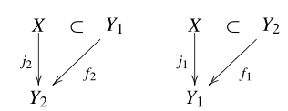

# 紧致化

## 吉洪诺夫定理

- 紧性是数学中最强、最有用的拓扑性质，它能控制收敛、极值、有界、无限行为，是分析学的基石。而连通性、可数性、分离性等只是说明了空间的拓扑结构
- 吉洪诺夫定理保证了泛函分析中大量函数空间的紧性，是拓扑学最有用的定理之一
- 吉洪诺夫定理是选择公理的重要应用例

<!-- ### 思路

- **任意积空间紧性的判定法**：
  - **归纳法**：已知可数个成立，则由良序集 + 超穷归纳法，可推广到任意维上
  - **有限交法**：任意闭子集是有限交的
- **积拓扑法**：设 $\mc A$ 是有限交子集族，在每个 $\hkh{\ol{\pi_i(A)}}_{i\in J}$ 中选取一点，则其积在 $\bigcap\mc A$ 中
- **反例**：
  - 设 $X = [0,1]\times [0,1]$，$\mc A$ 是所有焦点为 $p\dkh{\dfrac{1}{3},\dfrac{1}{3}}，q\dkh{\dfrac{1}{2},\dfrac{2}{3}}$ 的闭椭圆
  - 则 $\mc A$ 具有有限交性质，由闭集套定理得 $$\bigcap \mc A = \hkh{(x,y)\mid x\in [\dfrac{1}{3},\dfrac{1}{2}]，y\in [\dfrac{1}{3},\dfrac{2}{3}]}$$
  - 此时点 $(\frac{1}{2},\frac{1}{2})\notin \bigcap \mc A$
- **改进**：设 $\mc D$ 为以 $p$ 和线段 $pq$ 上某点为交点的椭圆族
  - 则其依然具有有限交性质，但 $\bigcap\mc D = \{(\dfrac{1}{3},\dfrac{1}{3})\}$ -->

### 引理

- **集族的保性质扩张**：保持原来集族性质的超集
- **有限交集族的全体保性质扩张**：$\mb A = \hkh{\mc B\supset\mc A \Bigm| \forall n，\mathop{\bigcap}\limits^n_{i=1} (B_i\in\mc B) \neq \varnothing}$
    - 细于原集族 $\mc A$ 的有限交子集族 $\mc B$ 的集合
- **（引理37.1）最大有限交扩张引理**：
  - 设 $X$ 是集合，$\mc A$ 是有限交性质子集族
  - 则存在子集族 $\mc D$ 满足
    - 细于 $\mc A$（即 $\mc A\subset \mc D$）
    - 具有有限交性质
    - 没有更细的子集族也含有上述性质
  - $\mc D$ 实际上就是 $\mc A$ 在包含偏序关系下扩张成的最大有限交集族
  - 由于是偏序，故 $X$ 的最大有限交子集族可能不唯一。所以必须声明 $\mc A$
  - **证明**：
    - 取 $\mb A$，设其元素为 $\mc B\supset \mc A$，易得都是有限交集族
    - 由Zorn引理，设 $\mb B$ 是 $\mb A$ 的严格偏序子集，则其有上界 $\mc C = \mathop{\bigcup}\limits_{\mc B\in\mb B} \mc B$
      - **更细性**：由 $\mc B$ 细于 $\mc A$ 得 $\mc C\supset \mc A$
      - **有限交性**：$\mc C$ 的有限交均为某个 $\mc B_k$，而 $\mc B_k$ 是有限交的，易得该性质可传递
    - 综上，$\mc C$ 即为所需的子集族
  - **理解**：本质是有限交性质可通过并集传递，故用Zorn引理取最大元即可
- **（引理37.2）最大有限交性质引理**：
  - 设 $X$ 是集合，$\mc D$ 是最大有限交子集族
  - 则
    - **封闭性**：$\mathop{\bigcap}\limits^n_{i=1} D_i\in \mc D$（$\mc D$ 关于有限交封闭）
    - **极大性**：若 $A$ 与全部 $D$ 相交，则 $A\in \mc D$
  - **证明**：
    - 任取有限交 $B$，设 $\mc E = \mc D\cup\{B\}$，只需证其也具有有限交性质
      - 若 $\mc E$ 的有限交元素 $\mc C$ 中没有 $B$，则 $\mc C\subset \mc D$，从而 $\mc C$ 是有限交的
      - 若 $\mc E$ 的有限交元素 $\mc C$ 中有 $B$，此时 $\mc C\cap \mc D$ 是有限交的，$\mc C\cap B = B$ 是有限交的，从而 $\mc C$ 是有限交的 （**证毕**）
    - 再设 $\mc E = \mc D\cup\{A\}$，只需证其也具有有限交性质
      - 方法同上

### 定理

- **（定理37.3）Tyconoff定理**：紧空间的任意积在积拓扑下是紧集
  - **证明**：
    - 设 $X = \prod\limits_{\a\in J}X_\a$ 是紧空间任意积，$\mc A$ 是有限交子集族
      - 由最大有限交存在引理，存在 $\mc D$
      - 易得其投影 $\{\pi_\a(D)\mid D\in\mc D\}$ 也是有限交的
        - 再由 $X_\a$ 的紧性 + 紧空间有限交定理即得存在 $x_\a \in \mathop{\bigcap}\limits_{D\in\mc D}\ol{\pi_\a(D)}$，设 $\bs x = \prod x_\a$
        - 若某维度上 $U_\a$ 是 $x_\a$ 的邻域，则由 $x_\a$ 定义得 $\exist\bs y\in \pi^{-1}_\a(U_\a)\cap\mc D$，即包含 $\bs x$ 的积拓扑子基均与 $\mc D$ 相交
          - 由最大有限交性质引理，积拓扑子基 $\pi^{-1}_\a (U_\a)\in\mc D$
          - 再由 $\mc D$ 有限交封闭性，积拓扑基 $\mathop{\bigcap}\limits^n_\a \pi^{-1}_\a (U_\a)\in \mc D$
          - 再由 $\mc D$ 有限交性，积拓扑基和每个 $D\in \mc D$ 相交，即 $\bs x \in \mathop{\bigcap}\limits_{D\in\mc D}\ol{D}$，得其非空
      - 由 $\mc D$ 最大性，其包含了所有的有限交闭集。再因为 $\mathop{\bigcap}\limits_{D\in\mc D}\ol{D}$ 非空，从而任意有限交闭集族的全体交均非空，由紧空间有限交定理即得 $X$ 是紧的
  - **理解**：开覆盖就是子基，有限交就是积拓扑中的开集
    - 有限交的传递性保证了开集（拓扑基）的存在性
    - 因子空间的紧性，保证了分空间中任意交非空性
    - 最大有限交集族的传递性，保证了积拓扑基含于其中
    - 最大有限交集族的有限交性，保证了其中集合均存在交点
    - 最大有限交集族的最大性，保证了空间中所有闭集族均是有限交的，取补集分析性质，即得空间是紧的
  - **本质**：通过佐恩引理极大化，将"任意的全体交"变成"极大集的全体交"

## 紧致化

- **动机**：已知紧集上的连续函数具有良好的性质，所以对任意连续函数，都希望把它连续延拓到紧集上，即对定义域进行紧化
- **紧化空间**：若 $Y = \ol X$ 是紧H空间，则称为 $X$ 的紧化空间
  - 即构造紧H空间 $Y$，使得 $X$ 在其中稠密
  - **实例**：
    - **最小紧化**：单点局部紧化
    - **最大紧化**：Stone-Cech紧化
  - 紧化空间必须足够小（稠密性 $\LR$ 连续延拓唯一性）
    - 设 $X = \R$，取足够大的紧集 $Y = [0,1]\cup S^1$，显然满足紧性和嵌入性。但多余点实在太多，会使连续延拓不唯一，违背最初动机
  - 紧化空间必须是豪斯多夫的（紧 + T2 = T4）

### 紧化空间的存在性

- 紧化可以看作"给空间补全聚点"，但它和闭包的"给子集补全聚点"不同
  - 闭集是外蕴性质，闭包只能在子集上取。任何空间自身都是闭集，取"闭化"没有意义
  - 紧集是内蕴性质，空间内部的网可能极限在外部，所以我们把这些聚点添加回来
- 如果取一个容纳 $Y$ 的紧H空间 $Z$，则（$X$ 紧化为 $Y$）就可看作（$X$ 在 $Z$ 中取闭包 $Y$）
- **（引理38.1）紧化存在唯一定理**：
  - 设 $X$ 是拓扑空间，$Z$ 是紧H空间，$h: X\to Z$ 是嵌入映射
  - 则存在 $X$ 的紧化空间 $Y$，满足
    - **延拓性**：存在 $h$ 的连续延拓 $H: Y\to Z$
    - **唯一性**：$Y$ 唯一
  - $Y$ 称为嵌入映射 $h$ 诱导的紧化空间
  - 显然不同嵌入 $h$、不同靶空间 $Z$ 诱导的紧化空间 $Y$ 都不同
    - $Z$ 决定可供添加的全部聚点
    - $h$ 决定哪些聚点是可添加的
  - 如果存在一个最大的靶空间，把这些紧化空间都放进去，就能比较大小
    - 显然这个最大靶空间可通过全体靶空间的积构造出来，即Stone-Cech紧化空间
  - **证明**：
    - 由紧闭等价性 $\ol{h(X)}$ 是紧H空间，即它是 $h(X)$ 的紧化
    - 只需构造 $Y$ 使得 $(X,Y)\to \Big( h(X),\ol{h(X)}\Big) = (X_0,Y_0)$ 是同胚
    - 设 $A\subset X$ 是映射 $k: A\to (Y_0-X_0)$ 的饱和集合，$k$ 在 $A$ 上是双射
    - **构造 $H$**
      - 设 $Y = X\cup A$，双射 $H:Y\to Y_0，\begin{cases} H(x) = h(x)，x\in X \\ H(a) = k(a)，a\in A \end{cases}$
      - 定义 $Y$ 上拓扑为 $U\in\tau_Y \LR H(U)\in\tau_{Y_0}$，则 $H$ 此时是开映射，从而是嵌入，$X$ 成为其子空间
    - **唯一性**
      - 反设 $Y_1,Y_2$ 都是 $H$ 的紧化空间，$H_i:Y_i\to Z$ 是延拓嵌入
      - 由延拓性 + 连续性，$H_i(Y_i) = \ol X_0$，$H_2^{-1}\circ H_1$ 是 $Y_i$ 同胚，同时也是 $X$ 恒等映射
  - **理解**：其实不难，就是在闭包补集 $\ol{h(X)} - h(X)$ 上通过饱和集合取连续延拓，再通过该延拓定义拓扑，从而使其成为一个开映射
  - **实例**：
    - $X = (0,1)$
      - $h: (0,1)\to S_1，t\mapsto (\cos 2\pi t,\sin 2\pi t)$（$\R^2$ 上的单位圆）
        - **饱和集合**：$A = \{0\}，Y_0 = S_1，X_0 = S_1-\{(1,0)\}$
        - **拓扑**：圆周上的开集为开线段的任意并
        - **单点局部紧化**：闭包只添加一个点，就变成了紧空间
      - $h: (0,1)\to [0,1]$（包含映射）
        - **饱和集合**：$A = \{0,1\}，Y_0 = [0,1]，X_0 = [0,1]-\{0,1\}$
        - **拓扑**：像与原像开集相同
        - **双点局部紧化**：闭包只添加两个点，就变成了紧空间
      - $h: (0,1)\to [-1,1]^2，x\mapsto (x,\sin\dfrac{1}{x})$（拓扑正弦曲线）
        - **饱和集合**：$A = 0\times [0,1]，Y_0 = 0\times [0,1]\cup sin，X_0 = sin$
        - **拓扑**：度量拓扑？
    - 连续延拓
      - $X = (0,1)$ 的单点/双点局部紧化中，有界连续函数 $f:X\to\R$ 可紧化延拓 $\LR f(0^+) = f(1^-)$

### 紧化空间的比较

- **等价紧化**：若存在同胚 $h: Y_1\to Y_2$，使得 $\forall x\in X，h(x) = x$，则称 $Y_1,Y_2$ 是等价的紧化空间
- **商紧化**：

### 最大紧化（Stone-Cech）

- **（定理38.2）最大紧化定理**：
  - 设 $X$ 是完全正则空间
  - 则存在紧化空间 $Y$，使得任意有界连续映射 $f:X\to\R$ 可唯一延拓到 $Y$ 上
  - 完全正则空间都有一个最大紧化空间
  - **证明**：
    - **分量函数**：设 $\{f_\a\}_{\a\in J}$ 是 $X$ 上连续有界实函数集合
      - **像集**：$I_\a = \Big[\inf f_\a(X), \sup f_\a(X)\Big]$
    - **积函数** $h: X\to\prod\limits_{\a\in J} I_\a，x\mapsto (f_\a(x))_{\a\in J}$
      - 由吉洪诺夫定理，$\prod I_\a$ 是紧集
      - 由 $X$ 完全正则性，$\{f_\a\}$ 分离单点集和闭集。由[嵌入引理和积拓扑法的构造方式](./第4章下：分离法度量化.md)得，积函数 $h$ 是嵌入映射
    - 由紧化引理，可设 $Y$ 是 $h$ 诱导的紧化空间，且存在紧化延拓 $H:Y\to\prod I_\a$
      - **延拓性**：任取 $f_\b$，设投影 $\pi_\b: \prod I_\a\to I_\b$，则 $\pi_\b\circ H$ 即为 $f$ 的延拓
  - **理解**：
    - 利用Tyconoff定理的维度任意性，将所有连续函数组成一个直积，此时其诱导出的紧化空间就是最大的，利用投影函数可使其中任意值均能取到
    - 完全正则性是为了使直积是嵌入映射
- **（引理38.3）H闭包延拓唯一定理**：
  - 设 $X$ 是拓扑空间，$A$ 是其子集，$Z$ 是H空间
  - 则任意连续映射 $f: A\to Z$ 存在至多一个闭包连续延拓 $g: \ol A\to Z$
  - **证明**：
    - **唯一性**：
      - 反设 $g,g'$ 是不同的连续延拓，则 $\exist x_0，g(x_0)\neq g'(x_0)$
      - 由H空间性，存在 $U,U'$ 是 $g(x_0),g'(x_0)$ 的不相交邻域，则此时存在 $x_0$ 邻域 $V$ 使得 $g(V)\subset U，g'(V)\subset U'$
      - 由于 $A$ 是 $\ol A$ 的内部，故 $\ol A-A$ 是 $\ol A$ 的边界，从而存在 $y\in V\cap A$
        - 此时由延拓性，在其上 $g=f=g'$，与像邻域不相交矛盾
  - **理解**：若延拓不唯一，则必有外侧不同点。但此时外侧就是边界，而边界邻域必定与内部相交，此时H空间不交性与延拓内部相同性矛盾
  - **本质**：定义直得，不难
- **（定理38.4）紧H最大延拓唯一定理**：
  - 设 $X$ 是完全正则空间，$Y$ 是其最大紧化空间，$C$ 是紧H空间
  - 则任意连续映射 $f: X\to C$ 可唯一延拓到 $Y$ 上
  - **证明**：
    - 易得 $C$ 完全正则，从而可设 $C\subset [0,1]^J$
    - 设 $f_\a$ 延拓为 $g_\a$，组合函数为 $g$
      - **连续性**：由 $\R^J$ 具有积拓扑，$g$ 连续
      - **延拓性**：由 $g(Y) = g(\ol X) \subset \ol{g(X)} = \ol{f(X)} \subset \ol C = C$
  - **理解**：
- **（定理38.5）唯一性定理**：设 $X$ 完全正则，若 $Y_1,Y_2$ 均是其最大紧化空间，则它们等价
  - **证明**：由延拓定理得下图
    
    - 从而 $f_1\circ f_2$ 是 $X$ 上恒等映射的连续延拓
    - 由H延拓唯一性，$f_1,f_2$ 均为同胚，从而等价
- **Stone-Cech紧化**：完全正则空间 $X$ 的最大紧化空间 $\b(X)$
  - **唯一性**：$X$ 到紧H空间的嵌入，则均可唯一延拓到 $\b(X)$ 上