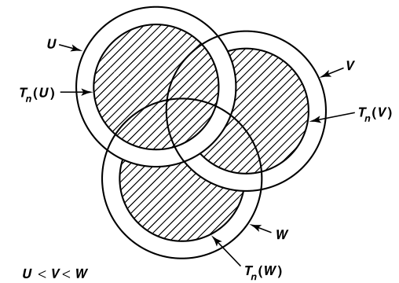
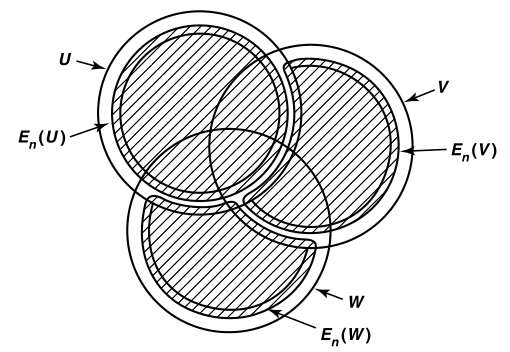

# 度量化

- 前面分离法只是度量化的充分条件，本章则是要找出充要条件

## 可度量的充要条件

### 局部有限性

- **局部有限族 $\mc A$**：拓扑空间 $X$ 中，若 $\forall x$ 均存在只与 $\mc A$ 中有限个元素相交的邻域 $U$ ，则 $\mc A$ 称为 $X$ 中的局部有限族
  - **实例**：
    - $\R$ 上的 $\mc A = \{(n,n+2)\mid n\in\Z\}$
    - $(0,1)$ 上的 $\mc B = \{(0,\dfrac{1}{n})\mid n\in\Z_+\}$
- **（引理39.1）传递性**：局部有限族满足遗传性、闭包传递性
  - **证明**：
    - **遗传性**：设 $Y\subset X$，由于 $\forall y\in Y$ 都有 $y\in X$，故结论直得
      - （局部性质都可遗传）
    - **闭包传递性**：设 $\mc B$ 是 $\mc A$ 的闭包集族
      - 由闭包的邻域判定法，任意开集 $U$ 若与 $\ol A$ 相交，则必定与 $A$ 相交
      - 此时 $\forall O(x)$ 与有限个 $A$ 相交，由上得也与这些 $\ol A = B$ 相交，从而 $\mc B$ 是有限交的
      - （交性质都可闭包传递）
  - **推论**：$\ol{\mathop{\bigcup}\limits_{A\in\mc A} A } = \mathop{\bigcup}\limits_{A\in\mc A} \ol A$
    - **互包证明**：设 $Y = \mathop{\bigcup}\limits_{A\in\mc A} A$，易得 $\bigcup\ol A\subset \ol Y$。反设 $\ol Y\not\subset \bigcup\ol A$
      - 任取 $x\in\ol Y-\bigcup\ol A$，设 $U$ 为 $x$ 的只与 $\{A_1,...,A_n\}$ 相交的邻域
      - 由局部有限的闭包传递性，$\forall 1\leq k\leq n，x\notin\ol A_k$
        - 故此时 $U-\mathop{\bigcup}\limits^n_{i=1}\ol A_i$ 依然是 $x$ 的邻域，且与 $\mc A$ 不相交
      - 但由局部有限性，得 $x$ 必定与某些 $A\in\mc A$ 相交，矛盾
    - **理解**：开集-闭集 = 开集，再由局部有限性，可采取删除法来净化集合，从而发现矛盾
    - **本质**：对 $\mc A$ 取并集不会出现新的聚点，也就是说，不会有无穷个 $A$ 聚集在某个点附近（废话啊，因为是局部“有限”交啊）
- **可数局部有限族**：可数个局部有限族的并（此时局部有限变为 $\sigma$ 局部有限）
- **集族 $\mc A$ 的细化**：$\forall B\in\mc B，\exist A\in\mc A$，使得 $B\subset A$
- **集族 $\mc A$ 的开细化**：$\mc B$ 是开集族
- **（引理39.2）细化定理**：设 $X$ 是可度量空间，$\mc A$ 是开覆盖
  - 则存在细化开覆盖 $\mc E$ 满足可数局部有限性
  - **证明**：在 $\mc A$ 上设良序 $<$（为了使任意两个集合在良序下不相等，从而达到剔除集合 $A$ 内部其它集合的目的。可以将其理解为图层，良序下较大的集合位于上方）
  - **度量细化**：设 $S_n(U) = \{x\mid B(x,\dfrac{1}{n})\subset U\}$，$T_n(U) = S_n(U) - \mathop{\bigcup}\limits_{V<U} V$
    - $S_n$ 其实就是[偏微分方程](../../偏微分方程/0.衔接.md)中提到过的，集合 $U$ 的 $\dfrac{1}{n}$ 中心域
    - $T_n$ 是中心域再删去所有人为规定的良序小集合 $V$  
    - 设 $V<W，x\in T_n(V)，y\in T_n(W)$
        - 由于 $S_n$ 削去了 $\dfrac{1}{n}$ 的外层，故 $y\notin B(x,\dfrac{1}{n})$
    - 
  - **开集细化**：设 $E_n(U) = \mathop{\bigcup}\limits_{x\in T_n(U)} B(x,\dfrac{1}{3n})$
    - 再将 $T_n$ 边界的 $\dfrac{1}{3n}$ 外层加回来
    - 易得其为开集，且任何 $E_n(A)$ 之间距离 $\geq \dfrac{1}{n}-2\cdot\dfrac{1}{3n} = \dfrac{1}{3n}$
    - 
  - **可数局部有限性**：此时 $\forall x\in X，B(x,\dfrac{1}{6n})$ 最多和一个 $\mc E_n = \set{E_n(A)\mid A\in\mc A}$ 相交
  - **构造覆盖**：设 $\mc E = \mathop{\bigcup}\limits_{n\in\Z_+} \mc E_n$
    - 任取 $x\in X$，设邻域 $U$ 位于 $\mc A$ 的良序下最小集合 $A$ 中。则由度量空间局部可数性，$\exist n，B(x,\dfrac{1}{n})\subset U$。此时 $x\in S_n(U)$
    - 由 $U$ 的良序最小性得 $T_n(U) = S_n(U)$，从而 $x\in T_n(U)$，再由 $T_n(U)\subset E_n(U)\subset E_n(A)$ 得也属于 $\mc E$
  - **理解**：
    - 先取中心域和良序，并剔除良序小集合，达到有距分离目的
    - 然后再取少量开外层，达到开集目的，同时不破坏有距分离性
    - 最后取 $n\to\infty$，使间距几乎为0，从而达到覆盖目的
  - **本质**：（可）度量空间具有可数局部有限性

### Nagata-Simironv度量化定理

- **$G_\delta$ 集**：可数个开集的交
  - **实例**
    - 拓扑空间的开集
    - 第一可数H空间的单点集
    - 度量空间的闭集
  - **反例**：
    - $\ol S_\Omega$ 的单点集 $\{\Omega\}$
    - 实数上的有理数集
- **（引理40.1）正规引理**：设 $X$ 是正则空间，具有可数局部有限的拓扑基 $\mc B$
  - 则 $X$ 是正规空间，每个闭集均为 $G_\delta$ 集
  - **可数闭开覆盖引理**：设 $W\subset X$ 是开集，则存在可数开集族 $\{U_n\}$ 满足 $W = \bigcup U_n = \bigcup \ol U_n$
    - **互包证明**：
      - 由可数局部有限性，可设 $\mc B = \bigcup\mc B_n$ 为局部有限拓扑基的可数并
        - 从中选取**正则基** $\mc C_n = \{B\in \mc B_n\mid \ol B\subset W\}$，显然其为局部有限子族
      - 设 $U_n = \mathop{\bigcup}\limits_{B\in\mc C_n} B$，由于其为拓扑基的并，从而是开集。再由正则基定义和局部有限性闭包结论，得 $\ol U_n = \ol{\mathop{\bigcup}\limits_{B\in\mc C_n} B} = \mathop{\bigcup}\limits_{B\in\mc C_n} \ol B \subset W$，从而 $\bigcup\ol U_n\subset W$
      - 任取 $x\in W$
        - 由正则基局部有限性，存在 $x\in B$，且 $B\in \mc C_n$，从而也有 $x\in U_n$
        - 由 $x$ 任意性即得 $W\subset \bigcup U_n$
    - **理解**：良覆盖就是正则基的并。本质是正则基存在性和局部有限性
  - **证明**：
    - **$G_\d$ 闭性**：$X$ 中任意闭集 $C$ 均为 $G_\d$ 集
      - 设 $W = X-C$，其为开集，则存在可数闭开覆盖 $\{U_n\}$。此时 $C = \bigcap (X-\ol U_n)$
    - **正规性**：设 $C,D$ 是不相交闭集
      - 构造 $X-D$ 的可数闭开覆盖 $\{U_n\}$
        - 其也覆盖 $C$，且 $\ol U_n$ 均与 $D$ 不相交
      - 同理构造 $X-C$ 的可数闭开覆盖 $\{V_n\}$
      - 类似[正则进化定理](./第4章下：分离法度量化.md)的方法，可证 $X$ 是正规空间
  - **理解**：
- **（引理40.2）连续分离引理**：设 $X$ 是正规空间，$A$ 是闭 $G_\d$ 集
  - 则存在连续映射 $f:X\to [0,1]$，满足 $\begin{cases} f(x) = 0，x\in A \\ f(x)>0，x\notin A \end{cases}$
  - **证明**：
    - 由 $G_\d$ 性，设 $A = \bigcup U_n$，选取 $f_n$ 为 $U_n$ 连续分离函数
    - 设 $f = \sum\limits_{n\in\Z_+} \cfrac{f_n(x)}{2^n}$，易得其一致收敛，从而连续
- **（定理40.3）N-S度量化定理**：$X$ 可度量 $\LR X$ 是正则空间，具有可数局部有限的拓扑基
  - **充分性**：
    - **$X$ 可被嵌入映射到 $(\R^J,\rho)$ 中**
      - 已知 $\mc B = \bigcup \mc B_n$
      - 可设 $f_{n,B}: X\to [0,\dfrac{1}{n}]$ 是支撑在 $B$ 上的正值函数
      - 设 $J\subset \Z_+\times\mc B$，$F:X\to[0,1]^J，x\mapsto (f_{n,B}(x))_{(n,b)\in J}$
        - 由[嵌入引理和积拓扑法构造](./第4章下：分离法度量化.md)得其为嵌入映射
    - **可一致度量性**：
      - 由于一致度量拓扑细于积拓扑，从而 $F$ 是单射，且为开映射
      - 一致度量为 $\rho((x_\a),(y_\a)) = \sup\{x_\a-y_\a\}$
    - **连续性**：任取 $x_0\in X$
      - 由一致度量性，等价于证明：
        - $\forall \varepsilon>0$，存在邻域 $W$ 满足 $ x\in W \Rt \rho((F)(x),F(x_0)) < \varepsilon$
      - 设 $U_n$ 是 $x_0$ 的和有限个 $\mc B_n$ 相交的邻域，则只有有限个映射 $f_{n,B}$ 在其上不为0
      - 由 $f_{n,B}$ 连续性，可选邻域 $V_n$ 使得函数在其上变化小于 $\dfrac{\varepsilon}{2}$
      - 选取 $\dfrac{1}{N}\leq \dfrac{\varepsilon}{2}$，设 $W = V_1\cap\cdots\cap V_N$
        - 若 $n\leq N$，由 $V_n$ 定义得极小
        - 若 $n> N$，由 $f_{n,B}$ 定义得极小
    - **理解**：
  - **必要性**：设 $X$ 是度量空间，已知其正则，只需可数局部有限基
    - 设 $\mc A_m$ 是半径为 $\dfrac{1}{m}$ 的开球覆盖
    - 由细化定理，存在可数局部有限的细化开覆盖 $\mc B_m$，设并集为 $\mc B$，其也为可数局部有限族
    - **$\mc B$ 是基**：
      - **覆盖性**：定义直得
      - **交稠密性**：等价于 $\forall B(x,\varepsilon)，\exist B$，满足 $x\in B，B\subset B(x,\varepsilon)$
        - 易得
    - **理解**：
- **本质**：

## 仿紧致性

- **紧空间**：任意开覆盖 $\mc A$，均存在（有限）的（细化开覆盖）$\mc B$
- **Lin空间**：任意开覆盖 $\mc A$，均存在（可数）的（细化开覆盖）$\mc B$
- **仿紧空间**：任意开覆盖 $\mc A$，均存在（可数局部有限）的（细化开覆盖） $\mc B$
  - Bourbaki将T2性作为紧性的定义条件之一
  - **实例**：
    - $X = \R^n$，设 $B_m = B(\bd 0,m)$。给定 $m$，选取 $\mc C_n = \{U\in\mc A\mid \ol B_m\subset U\}$
      - 则 $\mc C = \bigcup\mc C_m$ 是 $\mc A$ 的细化
        - **局部有限性**：（？）
        - **覆盖性**：$\forall x$，总存在最小的 $m$ 满足 $x\in\ol B_m$，从而 $x\in \mc C_m$ 的某个元素
- **（定理41.1）仿紧分离性**：仿紧H空间是正规空间
  - **证明**：
    - **正则性**：设 $a,B$ 不相交，用开集 $U_b$ 覆盖 $X$
    - **正规性**：用 $A$ 代替 $a$，相似步骤即可
  - **本质**：类似紧H空间的正规性证明
- **（定理41.2）仿紧闭遗传性**：仿紧空间具有闭遗传性
  - **证明**：设 $Y$ 是闭子空间，$\mc A$ 是开覆盖
    - 则 $\forall A\in\mc A$ 存在开集 $A'\subset X$ 使得 $A'\cap Y = A$
    - 用 $A'$ 覆盖 $X$，设 $\mc B$ 是 $X$ 的（局部有限）（细化开覆盖）
      - 则 $\mc C = \{B\cap Y\mid B\in\mc B\}$ 就是 $Y$ 的局部有限细化开覆盖
  - **推论**：
    - H空间的仿紧子空间不一定是闭集
      - **反例**：$(0,1)$ 仿紧，同胚于 $\R$，但不是闭集
    - 仿紧空间无遗传性
      - **反例**：$\ol S_\Omega\times\ol S_\Omega$ 是紧集，从而仿紧。但 $S_\Omega\times\ol S_\Omega$ 是H非正规空间，从而非仿紧
- **（引理41.3）细化关系**：正则空间 $X$ 的开覆盖 $\mc A$ 的细化 $\mc B$ 的以下性质等价
  - $\mc B$ 是开覆盖，且可数局部有限
  - $\mc B$ 是覆盖，且局部有限
  - $\mc B$ 是开/闭覆盖，且局部有限
  - **证明**：
  - 4-1：易得
  - 1-2：
- **（定理41.4）度量仿紧性**：度量空间是仿紧空间
  - **证明**：
- **（定理41.5）L紧进化定理**：正则的Lindelof空间是仿紧空间
  - **证明**：由L性，存在可数开覆盖，从而存在（局部有限）（细化开覆盖）
  - **推论**：仿紧空间无积传递性
    - **反例**：$\R_\ell$ 是是正则L空间，从而仿紧。但 $\R_\ell\times\R_\ell$ 是H非正规空间，从而不仿紧
  - **实例**：$\R^\omega$ 在积拓扑和一致拓扑下均可度量，从而均是仿紧的
    - 但在箱拓扑下不一定
  - **反例**：不可数积空间 $R^J$ 是H非正规空间，不仿紧
- **X上的单位分解**：设 $\{U_\a\}_{\a\in J}$ 是 $X$ 开覆盖，则指标连续函数族 $\phi_\a: X\to [0,1]$ 若满足下列条件，则称为 $X$ 上的单位分解
  - $\forall \a\in J，\supp{\phi_\a}\subset U_\a$ 
  - $\{\supp{\phi_\a}\}_{\a\in J}$ 局部有限
  - $\forall x\in D(\phi_\a)，\sum \phi_\a(x) = 1$
- **依赖性**：$U_\a$ 可唯一决定 $\{\phi_\a\}$
- **（引理41.6）**：设 $X$ 是仿紧H空间，$\{U_\a\}_{\a\in J}$ 是开覆盖
  - 则存在（局部有限）的（细化开覆盖） $\{V_\a\}$ 满足 $\ol V_\a\subset U_\a$

## Smirnov度量化定理

- **局部可度量空间**：$\forall x\in X$，都有一个在子空间拓扑中可度量化的邻域
  - **实例**：
    - 度量空间均局部可度量
- **（定理42.1）S度量化定理**：$X$ 可度量 $\LR X$ 为局部可度量的仿紧H空间
  - **证明**：
    - **必要性**：易得
    - **充分性**：易得 $X$ 正则，故由N-S定理，只需存在可数局部有限拓扑基即可
      - 在 $X$ 的可度量开覆盖中，取局部有限开细化覆盖 $\mc C$，其元素 $C$ 均可度量为 $d_C:C\times C\to \R$
        - 设 $x\in C$，由子空间开集传递性，$B_C(x,\e)$ 在 $X$ 中也是开集
        - 设 $\mc A_m = \set{B_C(x,\dfrac{1}{m})\mid x\in C，m\in\Z^+}$，由仿紧性，其存在局部有限开细化 $\mc D_m$，从而可数局部有限，可设为 $X$ 的基
      - 任取 $x\in X$ 和邻域 $U$，只需找到 $x\in D\subset U$
        - 此时 $x$ 只处于有限个 $\{C_i\}^k_{i=1}$ 中，从而 $\forall i<k，\exists \e_i$ 使得 $B_{C_i}(x,\e_i) \subset (U\cap C_i)$
        - 设 $\dfrac{2}{m} < \min\{\e_k\}$，由 $\mc D_m$ 覆盖性，存在 $x\in D$。再由细化性，存在 $D\subset B_{C_j}(y,\dfrac{1}{m})$。再由 $m$ 定义，即得 $x\in D\subset B_{C_j}(y,\dfrac{1}{m}) \subset B_{C_j}(x,\e_j) \subset U$（**证毕**）