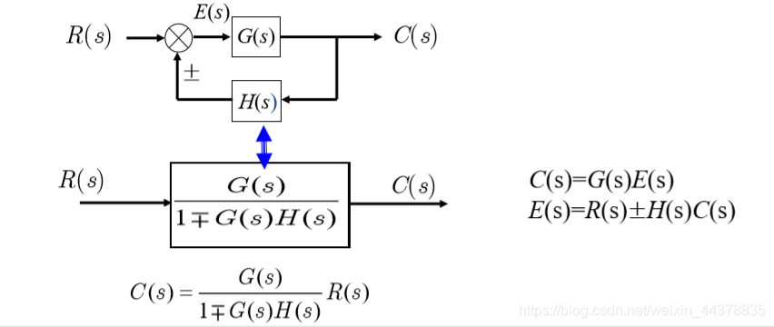
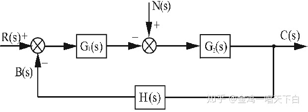

# 数学模型

- 参考教材：《自动控制原理》宋永瑞

## 控制方法

- **开环控制**：只存在控制器对被控对象的单向作用
  - 给定输入：期望得到的值
- **闭环控制**（反馈控制）（偏差控制）：存在被控对象到控制器的反向联系
  - 主反馈信号：被控量的检测值
  - 偏差：主反馈信号与给定输入的差
  - 正反馈、负反馈：主反馈信号的符号
- 自动控制装置：控制器、执行机构、检测装置
  - 前向通道：系统输入端到被控量端的信号通路
  - 前馈通道：综合点
  - 反馈通道：被控量端到系统输入端的信号通路

### 控制系统的类型

- 输入信号
  - **恒值控制系统**：给定输入为常数
  - **随动控制系统**：给定输入为未知时间函数，系统需要快速跟随输入进行变化
  - **程序控制系统**：给定输入为已知时间函数
- 数学模型
  - **线性系统**
    - 线性微分方程
    - 线性（叠加原理）：叠加性、齐次性
  - **非线性系统**：输入输出关系中，至少有一个是非线性关系
- 系统参数
  - **定常系统**：系数是常数
  - **时变系统**：系数是时间函数
- 函数关系
  - **连续时间系统**
  - **离散时间系统**
    - **采样控制系统**：脉冲信号
    - **数字控制系统**：数字量

### 控制系统的性质

- 稳定性
  - **系统稳定**：干扰消失后被控量回到期望范围内的现象
- 平稳性
  - **动态过程**：被控量跟随给定输入而变化，达到期望值
  - **稳态**：被控量的平衡状态
  - **动态性能**：动态过程的形态和快慢
- 快速性
- 准确性
  - **稳态误差**：稳态值与给定值的差

# 建立数学模型

- 步骤
  1. 划分环节，确定输入、输出变量
  2. 写出动态方程
  3. 消去中间变量，写出各环节输入、输出变量的表达式和各阶导数

## 微分方程线性化

- 直接忽略法
- **小偏差法**：用（增量的线性方程）代替（变量的非线性函数）
  - 使用条件：非本质线性特性（连续可导）
  - 取的增量越小，精度越高
  - 方法：Taylor展开后，只取第一项

# 定常系统传递函数

## 常用变换

- **Fourier变换**：$\mathscr{F}[f(t)](w) = \int^\infty_{-\infty}f(t)e^{-2\pi iwt}dt$
 
  
  - **Fourier逆变换**：$f(x) = \int^\infty_{-\infty} \hat{f}(\xi)^{-2\pi ix\xi}d\xi$
 

- **Laplace变换**：$\mathscr{L}[f(t)](s) = \int^\infty_0 f(t)e^{-st}dt\quad (s = \sigma+wi)$
 

  - **Laplace逆变换**：$f(t) = \int^\infty_{0} \hat{f}(s)e^{st}dsx$
  - 常用函数的变换结果：[https://blog.csdn.net/wh_STUDY/article/details/126403817]
  - **性质**：和Fourier变换相同

## 传递函数

- **线性定常系统的传递函数**：输出量 $y$ 与输入量 $r$ 的Laplace变换比
  - 设为n阶微分方程：$\sum\limits^n_{i=0} a_i y^{(n-i)}(t) = \sum\limits^m_{i=0} b_j r^{(m-j)}(t)$
  - 由L变换微分性质，得到多项式结果：$(\sum\limits^{n}_{i=0} a_is^{n-i})Y(s) = (\sum\limits^{m}_{j=0} b_js^{m-j})R(s)$
    - 设为 $N(s)Y(s) = M(s)R(s)$
- **传递函数**：$G(s) = \frac{Y(s)}{R(s)} = \frac{M(s)}{N(s)}$
  - **意义**：表示输出与输入的关系
  - **表示形式**
    1. 多项式表示：分子分母为多项式
    2. 零点、极点表示：多项式全部分解为根形式（s系数化为1），此时总系数（**传递系数**） $K^* = \large\frac{b_0}{a_0}$
    3. 时间常数型表示：对根形式进行变形（根系数化为1），总系数（**放大系数**） $K = \frac{b_m}{a_n}$，s的系数（时间常数） $T_j$
 - **性质**
   - 线性定常性
   - 与微分方程一一对应
   - 依赖于系统的结构和参数
   - $m\leqslant n$
   - Laplace反变换为单位脉冲响应函数

### 典型环节

- 按传递函数性质对环节分类
- **比例环节**：$y(t) = Kr(t)$
- **积分环节**：$y(t) = K\int r(t)dt$
  - 积分速度：K越大，输出量斜率越小，变化越慢
  - 多出现在阶跃输入
- **微分环节**：$y(t) = T_d \frac{dr(t)}{dt}$
  - 微分时间常数
  - 多出现在发电过程
- **惯性非周期环节**：$T\frac{dy(t)}{dt} + y(t) = Kr(t)$
  - s
- **一阶微分环节**：$y(t) = T_d\frac{dr(t)}{dt} + r(t)$
  - s
- **振荡环节**：$T^2\large \frac{d^2y(t)}{dt^2} \normalsize+ 2\zeta T\large\frac{dy(t)}{dt}\normalsize + y(t) = Kr(t)$
  - 阻尼比 $\zeta$
  - 增益 K
  - 时间常数 T
- **延迟环节**：$y(t) = r(t-\tau)$
  - 延迟时间 $\tau$

## 动态结构图

- **动态结构图（系统方框图）**
  - 信号线：箭头线段 + 信号名
  - 方框（环节）：传递函数
    - 信号流经后需要乘上传递函数
  - 引出点（分支点）：引出的多个信号完全相同
  - 综合点（比较点、相加点）：多个信号在此处进行加减运算

### 绘制方法

- **机理分析法**：
  1. 将系统划分成多个环节，分别确定输出输出量
  2. 建立微分方程，并Laplace变换为s域代数方程
  3. 分别画各个方框的图
  4. 输入量在结构图最左端，从左至右连接各方框

### 等效变换

- **串联**：首尾连接，没有分支，前输出即后输入
  - 传递函数直接累乘
- **并联**：输入相同，输出在同一综合点叠加
  - 传递函数直接相加
- **反馈**：输出信号反馈到输入端，并与输入信号叠加
  - **闭环系统**：反馈信号形成的闭合回路
    - 前向通道
    - 前馈通道
    - 反馈通道
- **简单闭环系统**：无干扰信号
  - 
  - **反馈信号**：$B(s) = Y(s)H(s)$
  - **偏差信号**：$E(s) = R(s) - B(s)$
  - **前向传递函数**：$G(s) = \dfrac{Y(s)}{E(s)}$
  - **反馈传递函数**：$H(s) = \dfrac{Y(s)}{B(s)}$
  - **开环传递函数**：$G(s)H(s) = \dfrac{B(s)}{E(s)}$
    - **理解**：前向传递函数 $\times$ 反馈传递函数 = 
    - 理论损耗比？如果按照虚拟的话确实是这样
  - **闭环传递函数** $\varPhi(s)$，输出信号 $\div$ 输入信号
    - 虚拟宇宙理解法（**错误**，时空不统一）：
      - 首先求出 $Y(s)$ 的理论值（$G(s)R(s)$），然后进行 $H(s)$ 削弱得到 $B(s)$
      - 现在，之前求的理论值看作是虚拟宇宙中的，可以舍去。
      - 而之前保留的值 $R(s)$ 经过削弱成为 $E(s)$，为实际宇宙中的输入，重新计算得实际的 $Y(s)$ 值
      - **错误原因**：
        - 方程两端的 $Y(s)$ 应当是同一个值（即处在同一时空，例如ODE中的变量代换公式，可以同时在等式两边对不同变量积分，原因就是它们代表同一系统的同一时空变化过程）
        - 但这个理解方法中，方程左右两边分别是两个宇宙中的不同Y值，所以不对
    - 统一时空理解法：直接列方程，唉

### 简化

- **引出点平移**：只需要补充相应的方框和传递函数，保证环节输出不变
  - 前移：乘上G，输出不变
  - 后移：除上G，输出不变
- **综合点平移**：补充方框后，还需要调整反馈模式，保证环节输出不变
  - 前移：除上G，输出不变
  - 后移：乘上G，输出不变
- **相邻同类点移动合并后等效**

## 信号流图

- **信号流图**：
  - **节点**：小圆圈
    - **源节点**：只有输出支路，没有输入支路
    - **阱节点**：只有输入支路，没有输出支路
    - **混合节点**
  - **支路**：有向线段
    - **通路**：从一个节点出发，沿支路经过多个节点
    - **前向通路**：每个节点只经过一次的通路
    - **回路**：起点和终点相同的前向通路
    - **不接触回路**：没有公共节点的多个回路

### 绘制方法

1. 节点是变量值，变量值变化则新绘制一个节点
2. 传递函数是通路的支路增益
3. 画出节点和通路（实质是方框和信号线反过来）

### 梅森增益公式

- $G(s) = \frac{1}{\Delta} \sum\limits^n_{k=1} P_k\Delta_k$
  - 特征式 $\Delta = \sum\limits^m_{i=0} \big[ (-1)^i\sum L_i \big]$，
  - 第k条前向通道总增益 $P_k$
  - 第k条前向通路特征式 $\Delta_k$
  - $\sum L_1$：所有单独回路的增益之和
  - $\sum L_i$：所有 $i$ 个互不接触回路的增益乘积之和

### 习题

- **求闭环传递函数**：先化简为多个串联的简单闭环系统，再分别用闭环公式 $\Phi(s) = \dfrac{G}{1+GH}$
- **求开环传递函数**：将整个系统化简为一个简单闭环系统，然后用公式 $\dfrac{B(s)}{E(s)}$

## 一般的闭环控制系统

- **典型动态结构图**：
  - **干扰信号**：$N(s)$
  - **开环传递函数**：$\frac{B(s)}{E(s)} = G_1(s)G_2(s)H(s) = \frac{M(s)}{N(s)}$
    - **开环根轨迹增益**：根形式下的传递系数 $K^* = \frac{b_0}{a_0}$
      - 开环零点、开环极点
    - **开环增益（开环放大系数）**：时间常数形式下的放大系数 $K = \frac{b_m}{a_n}$
  - **闭环传递函数**：线性叠加即可 $Y(s) = \varPhi(s)R(s) + \varPhi_n(s)N(s)$
    - 纯干扰：$\varPhi_n(s) = \frac{Y(s)}{N(s)} = \large\frac{G_2(s)}{1+G_1(s)G_2(s)H(s)}$
     
    - 无干扰：$\varPhi(s) = \frac{Y(s)}{R(s)} = \large\frac{G_1(s)G_2(s)}{1+G_1(s)G_2(s)H(s)}$
  - **误差**：$e(t) = r(t) - b(t)$
    - 表示控制精度
    - **误差传递函数**：$\varPhi_{e}(s) = \frac{E(s)}{R(s)}$