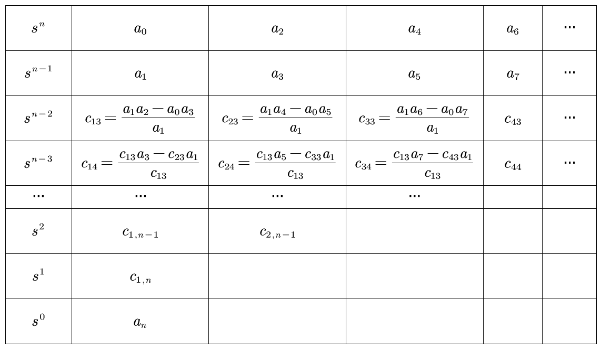

# 时域分析

- **时域分析**：对系统输入和输出在一定时间域内的变化的性质进行分析
- 关心的参数
  - **是否稳定**：劳斯判据
    - 稳定性对参数的要求
  - 稳定状态下的误差传递函数 $\varPhi_{e/n}(s)$、误差终值 $e_{ss}$
    - 静态稳态误差系数 $K_{p/v/a}$
  
- **时域响应**：
  - 上升时间
  - 调节时间
  - 延迟时间

## 过程与指标

### 典型输入信号

- 不利输入：变化迅速
  - **阶跃函数**：$r(t) = \begin{cases} 0，t<0 \\ R，t\geqslant 0 \end{cases}$
  - **斜坡函数**：$r(t) = \begin{cases} 0，t<0 \\ Rt，t\geqslant 0 \end{cases}$
  - **加速度函数**：$r(t) = \begin{cases} 0，t<0 \\ \frac{R}{2}t^2，t\geqslant 0 \end{cases}$
  - **脉冲函数**：$r(t) = \begin{cases} 0，t<0 \\ \frac{R}{\varepsilon}，0<t<\varepsilon \\ 0，t > \varepsilon\end{cases}$
  - **正弦函数**：$r(t) = \begin{cases} 0, \qquad t<0 \\ Asinwt, t\geq 0 \end{cases}$

### 性能指标

- **时间响应**：$y(t) = y_{ss}(t) + y_{tr}(t)$
  - 稳态响应 $y_{ss}(t)$：$t\to \infty$ 时的响应
  - 动态响应 $y_{tr}(t)$：初始状态到最终状态时的响应
- **稳态性能指标**：
  - 稳态误差 $e_{ss}$：稳态响应中的实际值与期望值之差
- **动态性能指标**：
  - 超调：响应函数在某些点超过终值（存在峰值）
  - 响应速度
    - 上升时间 $t_r$：从0上升到第一个终值 $y(\infty)$ 的时间
    - 延迟时间 $t_d$：从0上升到第一个终值的 $50\%$ 的时间
    - 峰值时间 $t_p$：从终值到第一个峰值 的时间
  - 快速性
    - 调节时间 $t_s$：保持在误差带$\Delta$（终值 $\pm 5\%$）的时间
  - 平稳性
    - 最大超调量 $\sigma\%$：$\large\frac{y(t_p) - y(\infty)}{y(\infty)}$

## 稳定性

- **平衡状态**：无干扰时输出量不变
  - **稳定平衡点**：在干扰后，可凭自身能力回到原有平衡状态
  - **不稳定平衡点**
  - **临界稳定**：输出量持续不断振荡
- 线性系统传递函数：$Y(s) = \frac{M(s)}{D(s)}R(s) + \frac{Q(s)}{D(s)}$
  - 分析稳定性时令 $R(s) = 0$，求 $\lim\limits_{t\to\infty} L^{-1}(\frac{Q(s)}{D(s)}) =  \lim\limits_{t\to\infty}\sum\limits^n_{i=1} (\lim\limits_{s\to s_i}\frac{Q(s)}{D(s)}(s-s_i)e^{s_it})$
    - （将Laplace逆变换的Riemann积分形式拆解成Darboux级数形式）
    - 为使其收敛到0，必须 $s_i<0$
  - 特征方程：$D(s) = 0$，特征根即为函数极点 $s_i$
    - 系统稳定 $\Leftrightarrow$ 极点在虚轴左侧
    - 临界稳定 $\Leftrightarrow$ 极点在虚轴上

### 劳斯判据

- 由根与系数关系，稳定必要条件为：$\forall a_i>0$
- **劳斯表**：
  - **衰减性**：每两行少一列（因为需要用到n+2列元素，所以最右两列注定无值）
- **劳斯定理**：劳斯表第一列均为正 $\Leftrightarrow$ 系统稳定
  - **证明**：
  - 符号改变次数 = 右根个数
  - **特殊情况**：不稳定。
    - 某行第一列某系数为0，其余不全为0（用 $\varepsilon$ 代替0，计算右根个数）
    - 某行系数全为0（存在中心对称特征根）
    - （右根个数为0 $\Leftrightarrow$ 临界稳定）

### 参数对稳定性影响

- **开环增益**：$G(s) = K\frac{(s_m-b_1)...}{(s_n-a_1)...}$，闭环传递函数为 $\frac{K}{()... + K}$
- **开环根轨迹增益**：……

### 相对稳定性

- 绝对稳定性：右根个数
- 相对稳定性（**稳定裕量**）：右根与虚轴的距离（移动虚轴后继续劳斯判定）

## 稳态误差

- **偏差信号**：从输入端定义的误差 $E(s) = R(s) - B(s)$
  - 变形版本：从输出端定义的误差 $E'(s) = \frac{R(s)}{H(s)} - Y(s) = \frac{E(s)}{H(s)}$
- **稳态误差**：稳定系统中，误差的终值 $e_{ss} = \lim\limits_{t\to\infty} e(t) = \lim\limits_{s\to 0} sE(s)$
  - 给定稳态误差：$e_{ssr}$
  - 干扰稳态误差：$e_{ssn}$

### 给定输入下 $R(s)$

- **系统类型**：积分环节个数 $\nu$（根因式形式中，分母中s的个数）
  - 0型系统、I型系统、II型系统
  - $\nu$ 越大，精度增加，稳定性降低
  - 时间常数形式下，稳态误差 $e_{ss}$ 只由开环增益 $K$ 决定
    - 变形配凑 $K$ 可得 $e_{ss} = \large\frac{\lim\limits_{s\to 0} \big[ s^{\nu+1}R(s) \big]}{\lim\limits_{s\to 0}s^\nu + K}$

### 干扰作用下 $N(s)$

## 动态性能分析

### 一阶系统的时域分析

- **典型一阶系统**：$G(s) = \frac{K}{s}$
  - 闭环传递函数：$\varPhi(s) = \frac{Y(s)}{R(s)} = \frac{K/s}{1+K/s}$
  - 放大系数：当前系统传递函数是典型一阶系统形式的多少倍
- 单位阶跃响应
- 单位斜坡响应
- 单位脉冲响应

### 二阶系统的时域分析

- **典型二阶系统**：$G(s) = \dfrac{K}{s(Ts)+1} = \frac{\omega_n^2}{s(s+2\zeta\omega_n)}$
  - 闭环传递函数：$\varPhi(s) = \dfrac{Y(s)}{R(s)} = \dfrac{\omega^2_n}{s^2 + 2\zeta\omega_n^2+\omega^2_n}$
  - **特征参数**：
    - **阻尼比** $\zeta$
    - **无阻尼自然震荡角频率** $\omega_n$
    - 