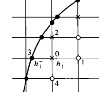
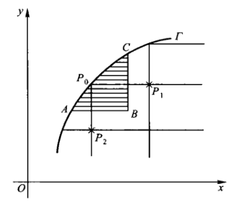
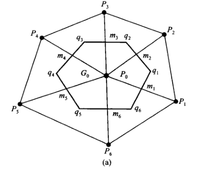
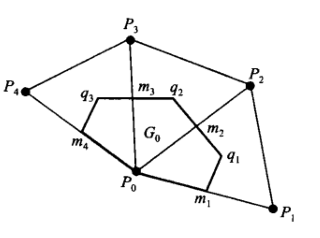
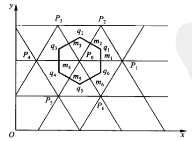
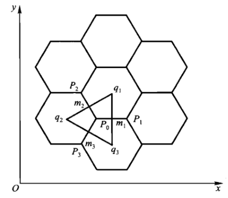

# 椭圆型方程的有限差分法

## 一维差分格式

### 有限差分法

- **第一类方程**：$-\dfrac{d}{dx}\dkh{p\dfrac{du}{dx}} + r\dfrac{du}{dx} + qu = f，u(a) = \a，u(b) = \b$
  - 其中 $p$ 是连续可微、下界为正的函数，$r,q,f$ 是连续函数
  - 方程左端第一项称为扩散项，数学形式是散度的散度。物理意是物质和能量从高浓度向低浓度扩散，$p$ 是扩散系数
  - 方程左端第二项称为对流项，数学形式是散度，物理意义是表示物质和能量被流体携带着移动，$r$ 是对流速度
  - 方程左端第三项称为反应项，表示物质和能量在原地生成或消耗，$q$ 是生成系数
  - 方程右端称为源项，表示不依赖未知量 $u$ 的外部输入和输出
  - 该方程实际上是物质/能量守恒公式在每点的微分形式。将其积分就是在区域上的守恒式
- **推导**：
  - 只需考虑 $(pu')'$ 如何用差分逼近即可
  - 一般剖分：设 $v = pu'$，则 $v'(x_i) \approx \cfrac{v(x_{i+1})-v(x_{i-1})}{h_{i+1}+h_i}$
    - 此时若继续进行中心差分，则需要用到 $x_{i-2}$ 和 $x_{i+2}$。我们希望只用到 $x_{i-1},x_i,x_{i+1}$，使得最终的矩阵是三对角矩阵（而非五对角矩阵）。故舍去
  - 对偶剖分：设 $v = pu'$，在节点中加入中点，则 $v'(x_i) \approx \cfrac{v(x_{i+\frac{1}{2}})-v(x_{i-\frac{1}{2}})}{\frac{1}{2}h_{i+1}+\frac{1}{2}h_i}$
    - 再已知 $u'(x_{i+\frac{1}{2}}) \approx \cfrac{u(x_{i+1})-u(x_i)}{h_{i+1}}$
    - 故只需用 $x_{i-1}，x_i，x_{i+1}$ 即可
  - 以此类推，遇到三重嵌套格式 $(q(pu')')'$ 时需要取 $\dfrac{1}{4}$ 端点
- **计算**：
  - 初步展开得 $(pu')'|_{x_i} \approx \cfrac{p_{i+\frac{1}{2}}[u']_{i+\frac{1}{2}}-p_{i-\frac{1}{2}}[u']_{i-\frac{1}{2}}}{\frac{1}{2}(h_{i+1}+h_i)}$
  - 继续将 $u'$ 取中心差分得 $$\cfrac{2}{h_i+h_{i+1}}\fkh{p_{i+\frac{1}{2}}\cfrac{u_{i+1}-u_i}{h_{i+1}} + p_{i-\frac{1}{2}}\cfrac{u_{i}-u_{i-1}}{h_{i}}}$$
- **差分方程**：$$\cfrac{2}{h_i+h_{i+1}}\fkh{p_{i+\frac{1}{2}}\cfrac{u_{i+1}-u_i}{h_{i+1}} + p_{i-\frac{1}{2}}\cfrac{u_{i}-u_{i-1}}{h_{i}}} + r_i\cfrac{u_{i+1}-u_{i-1}}{h_i+h_{i+1}} + q_iu_i = f_i + R_i$$
  - $N-1$ 阶线性方程组 $AU = F$，其中 $A$ 是三对角矩阵
  - 若 $r\not\equiv 0$，则 $A$ 不对称
  - 若 $r\equiv 0$
    - 当网格均匀时 $A$ 对称
    - 当网格不均匀时 $A$ 不对称，但可对称化，只需每行都乘 $h_i+h_{i+1}$ 即可
- **截断误差**：通过泰勒展开作差计算可得 $$ R_i = -(h_{i+1}-h_i)\dkh{\frac{1}{4}\Big[ (pu')'' \Big]_i + \frac{1}{12} \Big[ pu''' \Big]_i -\frac{1}{2}\Big[ ru'' \Big]_i} + O(h^2) $$
  - 本质上只是用相应阶数的中心差商代替微商而已

### 有限体积法

- **有限体积法**：需要进一步学习物理意义
  - 有限差分法是在点上用差商近似导数，有限体积法是在小区域上用积分列出守恒公式
- **第二类方程**：$-\dfrac{d}{dx}\dkh{p\dfrac{du}{dx}} + qu = f，u(a) = \a，u(b) = \b$
  - 其中 $p$ 是连续可微的正下界函数，$q,f$ 是连续函数
  - 非守恒形式指将微分算子展开为 $p'u' + pu''$。该形式下若 $p$ 存在间断点，则中心差分解可能不收敛
- **推导**：
  - 设 $W = pu'$，将原方程写为积分守恒型 $$ W(x^{(1)})-W(x^{(2)}) + \int^{x^{(2)}}_{x^{(1)}} qudx = \int^{x^{(2)}}_{x^{(1)}} fdx $$
  - 先将第二项近似为 $\dis u_i\int^{x_{i+\frac{1}{2}}}_{x_{i-\frac{1}{2}}} qdx$，再用积分插值公式计算即可
  - 如果 $p$ 存在间断点，则不应当对 $W$ 直接进行差分近似。但由于 $W$ 连续，故可将定义式变形为 $u_i-u_{i-1} = \dis\int^{x_i}_{x_{i-1}}\frac{W}{p}dx \approx W_{i-\frac{1}{2}}\dis\int^{x_i}_{x_{i-1}}\frac{1}{p}dx$，最后变形即得 $$ W(x_{i-\frac{1}{2}}) = \frac{h_i}{\dis\int^{x_i}_{x_{i-1}}\frac{1}{p}dx}\cdot\frac{u_i-u_{i-1}}{h_i}$$
  - 这样写是为了保证前项与 $h$ 无关，从而统一形式。此后都将前项简写为 $a_i$
- **差分方程**：$$  -\fkh{a_{i+1}\cfrac{u_{i+1}-u_i}{h_{i+1}} - a_i\frac{u_{i}-u_{i-1}}{h_{i}}} + \frac{h_i+h_{i+1}}{2}d_iu_i = \frac{h_i+h_{i+1}}{2}\phi_i$$
  - 其中 $a_i,d_i,\phi_i$ 的值由积分插值公式的选取决定
  - 若 $p,q,f$ 存在第一类间断点，则该处取值为左右极限的平均值
- **优点**：
  - 具有物理量守恒的实际意义
  - 降低系数函数光滑性的要求
  - 适配任意网格和边值条件

### 待定系数法

- **第三类方程**：$-\dfrac{d}{dx}\dkh{p\dfrac{du}{dx}} = f，u(a) = \a，u(b) = \b$
  - 其中 $p$ 是连续可微的正下界函数，$f$ 是连续函数
- **推导**：
  - 对 $\a u(x_{i+1}) + \b u(x_{i}) + \g u(x_{i-1})$ 进行六阶泰勒展开
  - 易得第零项之后的全部系数只有 $\a+\g$ 和 $\a-\g$ 两种
  - 为了保证 $0$ 阶和 $1$ 阶微分项系数为 $0$，$2$ 阶微分项系数为 $1$，需要 $\begin{cases} \a + \b + \g = 0 \\ \a - \g = 0 \\ \a + \g = \dfrac{2}{h^2} \end{cases}$
  - 代入即得中心差分格式 $$\cfrac{u_{i+1}-2u_i + u_{i-1}}{h^2} = f_i$$
- **截断误差**：$R_h = \cfrac{h^2}{12}u^{(4)}(x_i) + O(h^4)$

### 边值条件的处理

- **边值条件的作用**：
  - **将边界处的差分方程正常化**：正常的差分方程是以 $u_1,...,u_N$ 为变量的，但边界处的差分方程可能包括边界点和虚点
    - 三点差分格式在 $i=1$ 时包含边界点 $u_0,u_N$
    - 五点差分格式在 $i=1$ 时包含边界点 $u_0,u_N$ 和虚点 $u_{-1}$
    - 边值条件可将边界点和虚点化为常数，从而将全体方程的形式统一起来
  - **确定唯一解**：
- **第一边值条件**：$u(a) = \a，u(b) = \b$
  - **处理**：直接取 $u_0 = \a，u_N = \b$ 即可
  - 对于三点差分格式足够了，但对于五点差分格式这就是不完整的边值条件
- **第二/三边值条件**：$\begin{cases} u'(a) = \a_0u(a) + \a_1 \\\\ u'(b) = \b_0u(b) + \b_1 \end{cases}$
  - 我们希望将它转化为第一边值条件，或至少转化为线性方程组
  - 但如果直接取差分，会有两个缺点
    - 泰勒展开易得（边值条件的截断误差的阶）是 $O(h)$，而内点是 $O(h^2)$。即解的截断误差阶变低
    - 将边值方程加入差分线性方程组时，可能破坏方程组的对称性
  - **处理（有限体积法）**：
    - 不失一般性，不妨写为 $\begin{cases} -p(a)u'(a) = \a_0u(a) + \a_1 \\\\ -p(b)u'(b) = \b_0u(b) + \b_1 \end{cases}$
    - 已知原方程的积分形式 $\dis W(a) - W(x_{\frac{1}{2}}) + \int^{x_{\frac{1}{2}}}_{x_0} qudx  = \int^{x_{\frac{1}{2}}}_{x_0} fdx$
    - 再由定义得 $W(a) = p(a)u'(a)$
    - 将两式代入边值条件后，进行数值近似即得左端点的线性方程 $$ -a_1\frac{u_1-u_0}{h_1} + \dkh{-\a_0 + \frac{h_1}{2}d_0 }u_0 - \dkh{\a_1 + \frac{h_1}{2}\phi_0 } = 0 $$
    - 之前的截断误差是微分近似时的泰勒展开，而这里用的是数值积分公式，它的截断误差阶数更高
    - 同理可得右端点的线性方程。再求解二阶线性方程组即可

### 习题

- **有限体积法求第一类方程**：只需讨论 $ru'$ 项即可
  - **解**：
    - 首先化为积分形式 $\dis\int^{x_{i+\frac{1}{2}}}_{x_{i-\frac{1}{2}}}r\frac{du}{dx}dx$
    - 在保持守恒的条件下近似为 $\dis\int^{x_{i+\frac{1}{2}}}_{x_{i-\frac{1}{2}}}(ru)'dx = r_{i+\frac{1}{2}}u_{i+\frac{1}{2}} - r_{i-\frac{1}{2}}u_{i-\frac{1}{2}}$
      - 不要随便取近似，比如 $r_i(u_{i+\frac{1}{2}}-u_{i-\frac{1}{2}})$，因为它会破坏物理量的守恒（对流项的积分必须要写成左通量和右通量作差的形式），违背了有限体积法的思想
    - 最后取近似 $u_{i+\frac{1}{2}} = \dfrac{u_i+u_{i+1}}{2}$ 即可
      - 容易发现差分化后，二阶微分项有因子 $\dfrac{1}{h}$，一阶微分项无 $h$，零阶微分项有因子 $h$
- **高阶方程**：$(pu'')'' + (qu')' + ru = f$，边值条件 $\begin{cases} u(a) = u'(a) = 0 \\\\ u(b) = u'(b) = 0 \end{cases}$
  - **解（有限差分法，五点格式）**：
    - 对 $ru,f$ 项，直接取点即可
    - 对 $(qu')'$ 项，有两个一阶微分，故取对偶剖分，类似之前的处理即可
    - 对 $(pu'')''$ 项，有两个二阶微分，取一般剖分，直接用二阶中心差分公式计算即可
      - 因为二阶中心差分公式需要三个点，所以四阶导项最终会化为五点差分格式
    - 对于边值条件，首先已有 $u_0 = u_N = 0$
      - 五点差分格式中，$i=1$ 时牵扯到 $u_{-1},u_0,u_1,u_2,u_3$ 五个点，所以还需要用 $u'(a) = 0$ 来求出 $u_{-1}$ 这个虚点的值
      - 中心差分得 $u'(a) = \cfrac{u_{1}-u_{-1}}{2h} = 0$，即 $u_{-1} = u_1$
  - **解（有限差分法，尝试化为三点格式）**：
    - 如果我们处理四阶导项时，取 $\dfrac{1}{4}$ 剖分，然后逐次应用一阶差分公式，最终是否可以化为三点差分格式呢？
    - 对 $(pu'')''$ 项，设 $w = pu''$
    - 首先有 $$w''(x_i) = \cfrac{\frac{w_{i+\frac{1}{4}}-w_i}{\frac{1}{4}h} - \frac{w_i-w_{i-\frac{1}{4}}}{\frac{1}{4}h}}{\frac{1}{8}h + \frac{1}{8}h} = \frac{16}{h}\Big[ p_{i+\frac{1}{4}}u''_{i+\frac{1}{4}} - 2p_iu''_i + p_{i-\frac{1}{4}}u''_{i-\frac{1}{4}} \Big]$$
    - 然后逐次一阶中心差分 $$u''_{i+\frac{1}{4}} = \frac{u'_{i+\frac{1}{2}}-u'_i}{\frac{1}{2}h} = \frac{2}{h}\Big[ \frac{u_{i+1}-u_i}{h} - \frac{u_{i+1}-u_{i-1}}{2h} \Big]$$
    - 结果发现最终化为 $\cfrac{u_{i+1}-2u_i+u_{i-1}}{h^2}$，又变回了二阶中心差分公式
    - 然后将三者都代入就变为 $$ w''(x_i) = \frac{16}{h^2} (p_{i+\frac{1}{4}} - 2p_i + p_{i-\frac{1}{4}}) u''_i$$，这显然不对
- **点格式定理**：四阶微分方程的差分格式至少为五点
  - **证明**：
    - 用待定系数法易得，三个点的泰勒展开式无法通过线性组合同时消去 $u,u',u'',u'''$

## 二维差分格式

- **二维泊松方程**：$-\D u = f(x,y)，(x,y)\in G$
  - $G$ 是定义域，$\G$ 是 $G$ 的边界
  - $f,\a,\b,\g,k$ 都是二元连续函数
- **第一边值条件**：$u|_\G = \a(x,y)$
- **第二边值条件**：$\dpfrac{u}{n}|_{\G} = \b(x,y)$
- **第三边值条件**：$\dpfrac{u}{n}|_{\G} + k(x,y)u|_{\G} = \g(x,y)$

### 矩形网差分格式（五点差分格式）

- **网点**：在 $x,y$ 轴上分别取均匀步长 $h_1,h_2$，两直线的交点称为节点
- **内点**：$G_h$ 表示所有位于 $G$ 内的节点
  - **正则内点**：四个相邻点都位于 $G$ 中的内点
- **界点**：$\G_h$ 表示所有网线和 $\G$ 的交点
- **差分方程**：用两个未知数的二阶中心差商代替二阶微分得 $$ -\fkh{\frac{u_{i+1,j}-2u_{ij}+u_{i-1,j}}{h_1^2} + \frac{u_{i,j+1} - 2u_{ij} + u_{i,j-1}}{h_2^2}} = f_{ij} $$
- **截断误差**：由二阶泰勒展开式可得差分算子 $-\D_h$ 的截断误差 $$R_{ij}(u) = (\D-\D_h) u(x_i,y_j) = -\frac{1}{12}\fkh{h_1^2u_{xxxx} + h_2^2 u_{yyyy}}_{ij} + O(h^4)$$
  - 其中 $h = \sqrt{h_1^2+h_2^2}$，即 $R_{ij} = O(h^2)$

#### 习题

- **有限体积法**：
  - 取对偶剖分，设 $G_{ij}$ 为以 $(i,j)$ 为中心，边长为 $\dfrac{1}{2}$ 个节点的矩形域
  - 泊松方程两边积分后应用格林公式得 $\dis -\int_{\pa G_{ij}} \pfrac{u}{n}ds = \iint_{G_{ij}} fdxdy $
  - 由于边界是矩形，故外法向恒定。再用中心差商代替外法向导数即得 $$\hspace{-2em} \int_{\pa G_{ij}} \pfrac{u}{n}ds \approx \frac{u_{i,j-1}-u_{ij}}{h_2}h_1 + \frac{u_{i+1,j}-u_{ij}}{h_1}h_2 + \frac{u_{i,j+1}-u_{ij}}{h_2}h_1 + \frac{u_{i-1,j}-u_{ij}}{h_1}h_2 $$
  - 代入积分方程，两边除以 $h_1h_2$ 即得上面的差分方程

### 处理边值条件

- **第一边值条件**：
  - **界点**：直接取 $u_{ij} = \a(x_i,y_i)$ 即可
  - **非正则内点**：以下图为例，构造非正则内点 $x_0$ 处的差分方程
  
  - 设 $h_1$ 是横向步长，$h_2$ 是纵向步长，$h_1^- = x_0-x_3$
  - 我们希望保持五点差分格式的对称正定性，故用下列方程替换原本的中心差分 $$-\fkh{ \frac{1}{h_1}(\frac{u_1-u_0}{h_1} - \frac{u_0-u_3}{h_1^-}) + \frac{1}{h_2^2}(u_2-2u_0+u_4)} = f_0$$
- **第二/三边值条件**：以下图为例
  
  - **作图**：
    - $P_0(x_{i_0},y_{j_0})$ 是界点，$P_1(x_{i_0+1},y_{j_0}),P_2(x_{i_0},y_{j_0-1})$ 是相邻的界点
    - 过连线中点，作曲边三角形 $ABC$
  - **有限体积法**：
    - 在三角形内部积分后使用格林公式得 $$ -\int_{ABCA} \pfrac{u}{n}ds = \iint_{ABC} fdxdy$$
    - 直角边的外法向量可用 $P_0,P_1,P_2$ 中心差分得到
    - 曲边的外法向量可用边值条件得到，再用中矩形公式计算积分
    - 最终方程为 $$ -\fkh{\frac{u_{2}-u_{0}}{h_2}\cdot\ol{AB} + \frac{u_{1}-u_{0}}{h_1}\cdot\ol{BC} + (\g_{0}-k_{0}u_{0})\wh{CA} } = \iint_{ABC} fdxdy$$

#### 习题

- **第三类方程（五点差分格式）**：$-\nabla(k\nabla u) = f$
  - 将其展开可得 $-\nabla \cdot (ku_x,ku_y) = -(ku_x)_x - (ku_y)_y = f$
  - **解（有限体积法）**：
    - 取均匀正方形网格
    - 由散度的高斯公式，积分后可化为 $$-\int_{\pa G_{ij}} k\nabla u\cdot nds = -\int_{\pa G_{ij}} k\pfrac{u}{n}ds= \iint_{G_{ij}} fdxdy$$
    - 由于边界是矩形，故外法向恒定。再用中心差商代替外法向导数即得
  - **第一边值条件**：
  - **第二边值条件**

### 极坐标形式的差分方程

- **泊松方程（极坐标形式）**：$-\fkh{\dfrac{1}{r}\dpfrac{}{r}\dkh{r\dpfrac{u}{r}} + \dfrac{1}{r^2}\dpfrac{^2u}{\t^2}} = f(r,\t)$
  - 当 $G$ 是扇形或扇环时，极坐标变换将 $G$ 变为 $r\t$ 平面上的矩形区域 $\O$
- **第一边值条件**：$u(R,\t) = g(R,\t)$
  - 当 $G$ 是扇形时，$\O$ 的上下边即 $G$ 的上下边，$\O$ 的右边即 $G$ 的外边
  - 当 $G$ 是圆时，$\O$ 的下边是 $G$ 的 $x$ 轴右半径边。再由周期性，$\O$ 的上边和下边相同
  - $\O$ 的左边对应 $G$ 的原点，同时也是方程的奇点，无法建立边值条件
- **推导**：
  - 在 $u_{00}$ 处进行中心差分得 $$\frac{u_{00}-2u_{10}+u_{20}}{h^2_r} + \cfrac{1}{r_1}\cfrac{u_{20}-u_{00}}{2h_r} + \cfrac{1}{r_1^2}\cfrac{u_{1,-1} -2u_{10} + u_{11}}{h_0^2} = -f_{10}$$
    - 由于周期性，$u_{1,-1}$ 对应 $u_{1,N-1}$
  - 发现当步长满足 $r_1 = \cfrac{h_r}{2}$ 时，$u_{00}$ 的系数为 $0$，从而边值不依赖于该奇点
  - 同理取相应的步长，可使得边值不依赖于左边界所有点
- **极坐标剖分**：$\begin{cases} h_r = \cfrac{R}{M+\frac{1}{2}}， & r_i = (i-\frac{1}{2})h_r & 特定步长 \\\\ h_\t = \cfrac{2\pi}{N}， & \t_j = jh_\t & 均匀步长\end{cases}$
- **差分方程**：
  - 当 $i\geq 1$ 时，$$ \frac{u_{i-1,j}-2u_{ij}+u_{i+1,j}}{h^2_r} + \cfrac{1}{r_i}\cfrac{u_{i+1,j}-u_{i-1,j}}{2h_r} + \cfrac{1}{r_i^2}\cfrac{u_{i,j-1} -2u_{ij} + u_{i,j+1}}{h_\t^2} = -f_{ij} $$
  - 当 $i=0$ 时，$$ 2\frac{u_{1j}-u_{0j}}{h_r^2} + \frac{1}{r_0^2}\frac{u_{0,j-1}-2u_{0,j}+u_{0,j+1}}{h_\t^2} = -f_{0j} $$ 

### 三角网差分格式

- **泊松方程**：$-\D u = f，(x,y)\in G$
- **三角剖分**：
  - 在边界 $\G$ 上取一系列节点，连接成闭折线 $\wt\G$
  - 设 $\wt G$ 是多边形域，将它分割为有限个锐角三角形，称为**三角单元**
- **对偶单元**：将节点相邻的三角单元的外心用线段（即中位线）连接，构成的多边形域称为对偶单元

#### 内点

- **推导（有限体积法）**：
  - 设 $P_0$ 是内点，$P_i$ 是相邻节点，$q_i$ 是三角形 $P_0P_iP_{i+1}$ 的外心，$m_i$ 是 $P_0P_i$ 的中点，$G_0$ 是对偶单元（控制容积）
  - 原方程在对偶单元积分，再由格林公式可得 $$ -\int_{\pa G_0} \pfrac{u}{n}ds = \iint_{G_0} fdxdy $$
  - 容易计算多边形的外法向差分，即 $\dis \int_{\pa G_0} \pfrac{u}{n}ds = \sum^6_{i=1} \int_{q_iq_{i+1}} \pfrac{u}{n}ds$ $$ =  \sum^6_{i=1} \ol{q_iq_{i+1}}\frac{u(P_{i+1})-u(P_0)}{\ol{P_0P_{i+1}}} + m(G_0)R_{G_0}(u)$$
    - 其中 $m(G_0)$ 表示面积，$R_{G_0}(u)$ 是截断误差
- **差分方程**：$$ \sum^6_{i=1} \ol{q_iq_{i+1}}\frac{u_{P_{i+1}}-u_{P_0}}{\ol{P_0P_{i+1}}}  = m(G_0)\p_0$$，其中 $\p_0$ 是 $f$ 的积分平均值

#### 界点

- **推导（有限体积法）**：
  - 设 $P_0$ 是界点，其它同上
  - 仿照上面得到差分方程，但还需处理边界处的外法向导数
    - 若是第一边值条件，则已有 $u_{P_0} = \a(P_0)$，直接计算即可
    - 若是其它边值条件 $\cpfrac{u}{n} + ku|_{\G} = \g$
      - 此时边界处外法向导数可化为 $\g-ku$，再用梯形公式计算积分即可

### 三角网举例

- **直角三角网**：
  - **解**：取矩形网，将每个矩形分解成两个直角三角形。此时对偶单元是矩形，差分方程就是五点差分格式
- **正三角网**：
  
  - **解**：易得此时 $\ol{P_0P_i} = h，\ol{q_iq_{i+1}} = \dfrac{h}{\sqrt{3}}$，$m(G_0) = \dfrac{\sqrt{3}h^2}{2}$
    - 即差分格式为 $$-\frac{2}{3h^2}\dkh{\sum^6_{i=1}u_i - 6u_0} = \frac{2}{\sqrt{3}h^2}\iint_{G_0} fdxdy$$
- **正六边形网**：
  
  - **解**：易得此时 $\ol{P_0P_i} = h，\ol{q_iq_{i+1}} = \dfrac{h}{\sqrt{3}}$，$m(G_0) = \dfrac{3\sqrt{3}h^2}{4}$
    - 即差分格式为 $$-\frac{4}{3h^2}\dkh{\sum^6_{i=1}u_i - 3u_0} = \frac{4}{3\sqrt{3}h^2}\iint_{G_0} fdxdy$$

### 习题

- **第三类方程（三角网格式）**：$-\nabla(k\nabla u) = f$
  - **解（有限体积法）**：
    - 仿照上面得到 $$-\int_{\pa G_{ij}} k\pfrac{u}{n}ds= \iint_{G_{ij}} fdxdy$$
    - 根据具体的三角网，计算对偶单元的外法向导数。再用中心差商代替即可

## 解的分析

- **二阶椭圆方程第一边值问题**：$$\begin{cases} -(Au_x)_x -(Au_y)_y +Cu_x + Du_y + Eu = F \\ u|_\G = \a \end{cases}$$
  - 其中 $A,B\in C^1(\ol G)，C,D,E,F\in C(\ol G)，\a\in C(\G)$
  - 满足 $A,B$ 有正下界，$E$ 非负
  - 在矩形剖分，总设 $G_h$ 道路连通

### 极值定理

- **极值定理**：
  - 设 $u_{ij}$ 是 $\ol G_h$ 上某个网格函数
  - 若任意内点满足 $L_hu_{ij} \leq 0$，则 $u_{ij}$ 不可能在内点取正的极大值
  - 反过来，任意 $L_hu_{ij} \geq 0$ 时不可能在内点取负的极小值
  - **证明**：
    - 反设 $u_{ij}$ 在内点 $(x_{i_0},y_{j_0})$ 达到正极大值 $M$。由连通性得至少存在一个相邻网点的值更小
    - 再由对角占优性即得下列矛盾 $$L_hu_{i_0j_0} > (a_{i_0j_0} - a_{i_0-1,j_0} - a_{i_0+1,j_0-1} - a_{i_0+1,j_0} - a_{i_0,j_0+1})M \geq 0$$
- **唯一解定理**：
  - **证明**：
    - 设 $u_{ij}$ 是相应齐次问题的解，则有极值定理，其在内点无法取极大极小值，从而只能是 $u_{ij}\equiv 0$，从而非齐次问题存在唯一解
- **正定定理**：若 $u_{ij}$ 满足内点处 $L_hu_{ij} \geq 0$，界点处 $u_{ij} \geq 0$，则内点处 $u_{ij} \geq 0$
  - **证明**：极值定理直得

### 比较定理

- **比较定理**：
  - 设 $u_{ij},U_{ij}$ 都是网格函数
  - 若对任意内点都有 $|L_hu_{ij}| \leq L_hU_{ij}$，对任意界点都有 $|u_{ij}|\leq U_{ij}$
  - 则任意内点都有 $|u_{ij}| \leq U_{ij}$
  - **证明**：
    - 将两函数相加、相减，由极值定理即可
- **最大原理**：
  - 差分方程 $\begin{cases} L_hu_{ij} = 0 & 内点G_h \\ u_{ij} = \a_{ij} & 界点\G_h \end{cases}$ 的解满足 $\max\limits_{G_h} |u_{ij}| \leq \max\limits_{\G_h} |\a_{ij}|$
  - **证明**：
    - 构造优差分方程 $\begin{cases} L_hU_{ij} = 0 & 内点G_h \\ U_{ij} = |\a_{ij}| & 界点\G_h  \end{cases}$，则由比较定理得内点处 $|u_{ij}| \leq U_{ij}$
    - 若 $U_{ij}$ 是常数，则由边值条件得 $U_{ij} = \max\limits_{\G_h} |\a_{ij}|$
    - 若 $U_{ij}$ 不是常数，则由极值定理，$U_{ij}$ 的最大值在边界取到，再由边值条件即得结论

### 敛速估计

- **五点差分格式**：
  - 已知截断误差 $R_{ij} = \begin{cases} O(h^2) & 正则内点 \\ O(h) & 非正则内点 \end{cases}$，故可设 $|R_{ij}| \leq Kh$
  - 不妨设 $G$ 包含原点，$R$ 是以原点为心、包含 $G$ 的最小圆半径
  - 设网格函数 $E_{ij} = \cfrac{Kh}{4}(R^2-x_i^2-y_j^2)$，由 $R$ 定义得其非负
    - 计算易得 $\begin{cases} L_hE_{ij} = Kh & 内点G_h \\ E_{ij} \geq 0 & 界点\G_h  \end{cases}$
      - 在正则内点处，$L_hE_{ij} = Kh$
        - 易得 $x_i^2$ 关于 $x$，$y_j^2$ 关于 $y$ 的二阶中心差商均为 $2$
      - 在非正则内点处，
    - 再已知误差问题 $\begin{cases} L_he_{ij} = R_{ij}& 内点G_h \\ e_{ij} = 0 & 界点\G_h  \end{cases}$
    - 由比较定理即得 $|e_{ij}| \leq E_{ij}$，从而 $\max\limits_{G_h} |e_{ij}| \leq \cfrac{KR^2h}{4}$