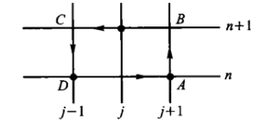
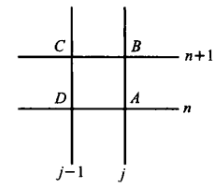
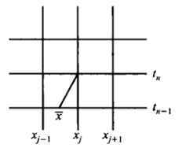

# 双曲方程的有限差分法

## 波动方程

- **一维波动方程**：$u_{tt} = a^2u_{xx}$，其中 $a>0$
  - **特征方程**：$dx^2 -a^2dt^2 = 0$，解得特征线为 $x-at = C_1$ 和 $x+at = C_2$
  - **达朗贝尔公式**：
    - 设特征向量为 $c_1 = (1,a)$ 和 $c_2 = (1,-a)$
    - **改写方程**：
      - 易得 $u_t = \dfrac{u_{c_1}+u_{c_2}}{2}，u_x = \dfrac{u_{c_1}-u_{c_2}}{2a}$
      - 同理 $u_{tt} = a^2\dkh{u_{c_1c_1}-2u_{c_1c_2}+u_{c_2c_2}}，u_{xx} = u_{c_1c_1}+2u_{c_1c_2}+u_{c_2c_2}$
      - 故原方程可写为 $u_{c_1c_2} = 0$
      - 易得通解为 $u = f_1(c_1) + f_2(c_2) = f_1(x-at) + f_2(x+at)$
    - **初值**：
      - 设初值为 $\begin{cases} u(x,0) = \p_0(x) \\ u_t(x,0) = \p_1(x) \end{cases}$，则可以得到 $f_1,f_2$，最终答案为 $$ u(x,t) = \frac{\p_0(x-at)+\p_0(x+at)}{2} + \frac{1}{2a}\int^{x+at}_{x-at} \p_1(\xi) d\xi $$
- **依存域**：若（解在点 $\bs x$ 的值）仅依赖于（初值函数在区域 $P(\bs x)$ 的值），则称该区域为解的依存域
  - **实例**：波动方程的解在 $(x_0,t_0)$ 上的点仅依赖于 $\p_0,\p_1$ 在 $[x_0-at_0,x_0+at_0]$ 上的值
- **决定域**：若（初值函数在区域 $P$ 的值）可决定（解在区域 $Q$ 上的值），则称 $Q$ 是 $P$ 的决定域
  - **实例**：波动方程中，区间 $[x_0-at_0,x_0+at_0]$ 的决定域是（过点 $(x_0,t_0)$ 的两条特征线与 $x$ 轴围成的三角区域）
- **影响域**：（依存域中包含点 $\bs x$ 的）全体点组成的区域称为 $\bs x$ 的影响域

### 显格式

- **剖分**：取均匀正方形网格剖分
<!-- - **差分**：将泰勒展式代入波动方程得 $$\hspace{-2em} \frac{u(x_j,t_{n+1}) - 2u(x_j,t_{n}) + u(x_j,t_{n-1})}{\tau^2} = \frac{u(x_{j+1},t_n) - 2u(x_j,t_{n}) + u(x_{j-1},t_n)}{h^2} + R^n_j(u) $$ -->
- **三层差分格式**：将泰勒展式代入波动方程得 $$\frac{u^{n+1}_j - 2u^n_j + u^{n-1}_j}{\tau^2} = a^2\frac{u^n_{j+1} - 2u^n_j + u^n_{j-1}}{h^2} + R^n_j(u) $$
  - 截断误差 $R^n_j = O(\tau^2+h^2)$
- **初值问题**
  - 初值条件若取向前差分 $\begin{cases} u^0_j = \p_0(x_j) \\\\ \dfrac{u^1_j - u^0_j}{\tau} = \p_1(x_j) \end{cases}$，则误差为 $O(\tau)$
  - 初值条件若取中心差分 $\begin{cases} u^0_j = \p_0(x_j) \\\\ \dfrac{u^1_j - u^{-1}_j}{2\tau} = \p_1(x_j) \end{cases}$，此时需要代入 $n=0$ 情况下的方程，从而消去 $u^{-1}$，用初值计算出 $n=0,1$ 的网点，再按方程逐个计算后面的网点
- 补充边值条件后也可解混合问题

#### 稳定性

- 为了沿用前面的判稳方法，需要化为二层差分格式，即化为一阶微分方程组
- **方程组形式**：设 $\begin{cases} v = u_t \\ w = au_x \end{cases}$，则有关系式 $\begin{cases} v_t = aw_x & 波动方程 \\ w_t = av_x & 变量定义 \end{cases}$
  - **向量化**：设 $U = \tvec{v \\ w}，A = \tvec{0 & a \\ a & 0}$，则可写为 $U_t - AU_x = 0$
  - **双层差分格式**：
    - 设向后差分格式 $v^n_j = \cfrac{u^n_j-u^{n-1}_j}{\tau}，w^{n+1}_{j-\frac{1}{2}} = a\cfrac{u^{n+1}_j - u^{n+1}_{j-1}}{h}$，再将方程组向前差分化为 $$ \begin{cases} \cfrac{v^{n+1}_j - v^n_j}{\tau} = a\cfrac{w^n_{j+\frac{1}{2}} - w^n_{j-\frac{1}{2}}}{h}  \\\\ \cfrac{w^{n+1}_{j-\frac{1}{2}} - w^n_{j-\frac{1}{2}}}{\tau} = a\cfrac{v^{n+1}_{j} - v^{n+1}_{j-1}}{h} \end{cases} $$
- **傅立叶方法**：以周期边值混合问题为例
  - 设 $v^n,w^n$ 的傅立叶系数为 $V^n_1，V^n_2$，将两函数傅立叶展开后按照逐项相等可变形为 $$\begin{cases} V^{n+1}_1 - 2ir\dkh{\sin\dfrac{\pi ph}{l}}V^n_2 = V^n_1 \\\\  - 2ir\dkh{\sin\dfrac{\pi ph}{l}}V^{n+1}_1 + V^{n+1}_2  = V^n_2 \end{cases}$$
  - 即增长系数矩阵为 $G(\dfrac{\pi ph}{l}) = \tvec{1 & ic \\ ic & 1-c^2}$，其中  $c = 2r\sin\dfrac{\pi ph}{l}$
- **冯诺依曼条件**：$r\leq 1$
  - **证明**：
    - 已知稳定等价于 $\hkh{G(\t) \mid 0\leq \t \leq \pi ，n=1,2,...}$ 一致有界
    - 增长矩阵的特征方程为 $\l^2 - (2-c^2)\l + 1 = 0$，故易得特征值 $|\l| \leq 1 \LR |2-c^2| \leq 2$
- **稳定定理**：双层差分格式稳定 $\LR r<1$
  - **证明（二阶特征值方法）**：
    - 计算易得 $|\l_1-\l_2| = |c|\sqrt{2+\dfrac{c^2}{2}}$
    - 再计算得 $G-\cfrac{\l_1+\l_2}{2}I = \tvec{\dfrac{c^2}{2} & ic \\ ic & -\dfrac{c^2}{2}}$，其F模为 $|c|\sqrt{2+\dfrac{c^2}{2}}$
    - 故按照二阶特征值方法，只需存在 $M>0$ 使得 $$ |c|\sqrt{2+\dfrac{c^2}{2}} \leq M|c|\sqrt{4-c^2} $$
    - 当 $r<1$ 时显然成立，而当 $r=1$ 时 $\t = \dfrac{\pi}{2}，c^2 = 4$，不可能成立
  - **证明（依存域方法）**

### 隐格式

- **恒稳定差分格式**：首先用 $n-1,n,n+1$ 层的（中心差商的权平均）逼近，再找出最佳权重值，使得差分格式恒稳定
  - 设 $D_n = \cfrac{u^n_{j+1} - 2u^n_j + u^n_{j-1}}{h^2}$，则差分格式为 $$ \frac{u^{n+1}_j - 2u^n_j + u^{n-1}_j}{\tau^2} = a^2\Big[ \t D_{n+1} + (1-2\t)D_n + \t D_{n-1} \Big]  $$
  - 当 $\t = 0$ 时就是显格式
  - 当 $\t = \dfrac{1}{4}$ 时，计算得增长矩阵 $G(\t)$ 是酉矩阵，从而一致有界

## 一阶线性双曲方程组

- **一阶线性方程组的向量形式**：设分量函数 $L_i(\bs u) = \sum\limits^n_{j=1} b_{ij}\dpfrac{u_j}{t} + \sum\limits^n_{j=1}a_{ij}\dpfrac{u_j}{x} = c_i$，其中系数函数均光滑
  - 设系数函数矩阵 $B = (b_{ij})_{n\times n}，A = (a_{ij})_{n\times n}，\bs c = \tvec{c_1 \\ \vdots \\ c_n}$，则方程组可写为 $ B\dpfrac{\bs u}{t} + A\dpfrac{\bs u}{x} = \bs c$
  - 若设 $B$ 有逆，则只需考虑 $$  L(\bs u) = \pfrac{\bs u}{t} + A\pfrac{\bs u}{x} = \bs c $$
- **一阶线性偏微分方程组的分类**：
  - 对于 $2\times 2$ 线性偏微分方程组
    - 若 $A$ 的特征值均为复数，则为椭圆型
    - 若 $A$ 只有一个 $2$ 重特征值，则为抛物型
    - 若 $A$ 有两个 $1$ 重特征值，则为双曲型
  - 对于一阶线性偏微分方程组
    - 若 $A$ 的特征值均为互异实数，则为双曲型
    - 没有抛物型和椭圆型的定义
- **约定**：
  - 本节只讨论在任意点上均为双曲型的方程组
  - 特征值默认按升序排列
- **特征关系**：
  - 设行向量 $\bs l^{(1)}(x,t),...,\bs l^{(n)}(x,t)$ 是 $A$ 的左特征向量系，
  - 原方程两边左乘左特征向量得 $\sum\limits^n_{j=1} l^{(i)}_j \dkh{\dpfrac{u_j}{t} + \l_i \dpfrac{u_j}{x}} = \sum\limits^n_{j=1} l^{(i)}_jc_j$
    - 如果能找到某个方向上的导数为括号内形式，则该方向即为特征方向
  - 设方程 $\dfrac{dx}{dt} = \l_i$ 确定的曲线为 $\tau_i$，则 $\dkh{\dfrac{du_j}{dt}}_{\tau_i} = \dpfrac{u_j}{t} + \l_i \dpfrac{u_j}{x}$
  - 此时原方程可化为ODE方程组 $$ \sum^n_{j=1} l^{(i)}_j \dkh{\frac{du_j}{dt}}_{\tau_i} = \sum\limits^n_{j=1} l^{(i)}_jc_j $$
- **黎曼不变量**：设 $r_i = \sum\limits^n_{j=1} l^{(i)}_j u_j$，向量形式为 $\bs r = L\bs u$
  - 直接计算得 $\dkh{\dfrac{dr_i}{dt}}_{\tau_i} = \dpfrac{r_i}{t} + \l_i\dpfrac{r_i}{x} = \sum\limits^n_{j=1}\dkh{l^{(i)}_jc_i + u_j\Big( \dfrac{dl^{(i)}_j}{dt} \Big)_{\tau_i}}$
  - 设 $M = L^{-1}$，则上式可重写为 $$ \dkh{\frac{dr_i}{dt}}_{\tau_i} = \sum^n_{j=1} l^{(i)}_jc_i + \sum^n_{j=1} \dkh{ \frac{dl^{(i)}_j}{dt} }_{\tau_i} \sum^n_{k=1} m_{jk}r_k $$
  - 写成向量形式容易发现它是对角方程组
  - **实例**：当 $A$ 是常矩阵且右端 $\bs c = \bs 0$ 时，黎曼不变量 $r_i$ 沿特征线 $\tau_i$ 是常量

### 初值问题

- **问题**：在线段 $P_1P_2:\begin{cases}  t=0 \\ x\in [a,b] \end{cases}$ 上，给定初值 $\bs u^0(x)$，求某个邻域内的解
- **解的适定性**：由于 $x$ 轴不是特征方向，故该线段邻域内有唯一解，且连续依赖于初值
- **初值依赖关系**：
  - 易得过任意点恰有 $n$ 个不同族的特征线，设过某点 $P$ 的特征线 $\tau_n$ 和 $\tau_1$ 与 $x$ 轴相交于 $P_1,P_2$
  - **依存域**：在 $PP_1$ 和 $PP_2$ 上积分对角方程组，可计算出黎曼不变量，从而解出 $\bs u$。即 $\bs u(P)$ 只和线段 $P_1P_2$ 上的初值有关，即 $P_1P_2$ 是依存域
  - **决定域**：再由于 $\tau_1$ 和 $\tau_n$ 是特征线边界，故曲边三角形 $PP_1P_2$ 是决定域
  - **影响域**：在 $x$ 轴上任取线段 $Q_1Q_2$，它能影响到上半平面中 $\tau_1$ 和 $\tau_n$ 之间的所有点

### 初边值问题

- **问题**：以 $2\times 2$ 对角方程组 $\begin{cases} \dpfrac{u}{t} +\l_1\dpfrac{u}{x} = f_1 \\\\ \dpfrac{u}{t} +\l_2\dpfrac{u}{x} = f_2 \end{cases}$ 为例，其中 $f_i = a_iu + b_iv + c_i$
  - 给出初值条件后，如何给边值条件能使解是适定的
- **约定**：规定 $t$ 增加的方向是特征线的正向。正反向特征线夹角内部的方向称为时向，其它称空向

## 双曲方程（初值问题）

### 迎风格式

#### 方程

- **变系数一阶方程**：$u_t + a(x)u_x = 0$
- **稳定性定理**：
  - 时间向前、空间中心差分格式恒不稳定
  - 时间向前、空间向前差分格式稳定 $\LR a\geq 0，|r| \leq 1$
  - 时间向前、空间向后差分格式稳定 $\LR a< 0，|r| \leq 1$
  - **证明（傅立叶方法）**：
    - 易得 $v^{n+1} = \Big( 1-ir\sin\a h \Big)v^n$，显然 $|\l| > 1$，故恒不满足冯诺依曼条件
    - 易得 $v^{n+1} = \Big( (1+r) - re^{-i\a h}\Big)v^n$，此时 $|\l| \leq 1 \LR r^2\leq r$
    - 易得 $v^{n+1} = \Big( re^{-i\a h} + (1-r) \Big)v^n$，此时 $|\l| \leq 1 \LR r^2 > r$
- **迎风格式**：$$ \begin{cases} \cfrac{u^{n+1}_j - u^n_j}{\tau} + a_j\cfrac{u^n_j - u^n_{j-1}}{h} = 0 & 若 a_j\geq 0 \\\\ \cfrac{u^{n+1}_j - u^n_j}{\tau} + a_j\cfrac{u^n_{j+1} - u^n_j}{h} = 0 & 若 a_j < 0 \end{cases}$$
  - **稳定条件**：$\abs{\dfrac{\tau}{h}}\max\limits_{j} |a_j| \leq 1$

#### 方程组

- **线性双曲方程组**：$u_t + Au_x = f$
- **推导**：
  - 左特征向量 $l^{(i)}$ 左乘得 $\sum\limits^m_{k=1} l^{(i)}_k (\dpfrac{u_k}{t} + \l_i\dpfrac{u_k}{x}) = \sum\limits^m_{k=1} l^{(i)}_k f_k$
  - 设 $\l_{ij} = \l_i(x_j)$，设算子 $$\l_{ij}\D^* u = \begin{cases} \l_{ij}\cfrac{u^n_{kj} - u^n_{k,j-1}}{h} & 若 \l_{ij} \geq 0 \\\\ \l_{ij}\cfrac{u^n_{kj} - u^n_{k,j-1}}{h} & 若 \l_{ij} \geq 0 \end{cases}$$
  - 再设 $l^{(i)}_{kj} = l^{(i)}_k(x_j)$，则迎风格式为 $$ \sum^m_{k=1} l^{(i)}_{kj}\dkh{\cfrac{u^{n+1}_{kj} - u^n_{kj}}{\tau} + \l_{ij}\D^* u^n_{kj}  } = \sum^m_{k=1} l^{(i)}_{kj}f_{kj} $$
- **稳定条件**：$\abs{\dfrac{\tau}{h}}|\l_{ij}| \leq 1$

### 积分守恒差分格式

- **守恒方程**：$\dpfrac{u}{t} + \dpfrac{f(x,u)}{x} = 0$

#### Lax-Friedriches格式

- **推导**：
  - 方程两边积分后由格林公式得 $\dis\int_{\G} (fdt - udx) = 0$
  - 取下图的网格，将积分化为 $\dis\int_{DA}(-u)dt + \int_{BC}(-u)dx + \int_{AB}fdx + \int_{CD}fdt$
  
  - 第一个积分用梯形公式，第二个用中矩形公式，第三四个用下矩形公式即得 $$ \frac{u^{n+1}_j - \frac{1}{2}(u^n_{j-1} + u^n_{j+1})}{\tau} + \frac{f^n_{j+1}- f^n_{j-1}}{2h} = 0 $$
- **截断误差**：$O(\tau + h^2)$
- **习题**：取 $f = au$ 时，稳定条件为 $\dfrac{\tau}{h}|a| \leq 1$

#### 盒式格式

- **推导**：
  - 方程两边积分后由格林公式得 $\dis\int_{\G} (fdt - udx) = 0$
  - 取下图的网格，将积分化为 $\dis\int_{DA}(-u)dt + \int_{BC}(-u)dx + \int_{AB}fdx + \int_{CD}fdt$
  
  - 全体积分用梯形公式逼近即得 $$ \frac{u^{n+1}_j - u^n_j}{\tau} + \frac{u^{n+1}_{j-1} - u^n_{j-1}}{\tau} + \frac{f^{n}_j - f^n_{j-1}}{h} + \frac{f^{n+1}_j - f^{n+1}_{j-1}}{h} = 0$$
- **习题**：取 $f = au$，此时可化为 $$(1+ar)u^{n+1}_j +(1-ar)u^{n+1}_{j-1} = (1-ar)u^n_j + (1+ar)u^n_{j-1} $$
  - 当 $a>0$ 时，取左侧边值，从左到右进行显格式递推
  - 当 $a<0$ 时，取右侧边值，从右到左进行显格式递推
  - 该格式恒稳定
  - 若变为 $a(x)u$，则用 $a_{j-\frac{1}{2}}$ 代替 $a$
  - 若视为在 $(x_{j-\frac{1}{2}},t_{n+\frac{1}{2}})$ 的差分逼近，则截断误差为 $O(\tau^2+h^2)$

### 粘性差分格式

- **思想**：引入带空间二阶导的小参数项，将方程变为抛物方程，然后差分逼近该方程，最后 $\tau\to 0$ 时 $\e\to 0$

### 其它差分格式

- **符号约定**：设 $\D_+$ 是向前差分，$\D_-$ 是向后差分
- **Beam-Warming格式**：$\begin{cases} u^*_j = u^n_j - r\D_-u^n_j \\\\ u^{n+1}_j = \frac{1}{2}(u^n_j + u^*_j - r\D_-u^*_j - r\D_-\D_+ u^n_{j-1})  \end{cases}$
  - **稳定性条件**：$|r|\leq 2$
  - **截断误差**：$O(\tau^2) + O(\tau h) + O(h^2)$
- **MacCormack格式**：$\begin{cases} u^*_j = u^n_j - r\D_+u^n_j \\\\ u^{n+1}_j = \frac{1}{2}(u^n_j + u^*_j - r\D_-u^*_j)  \end{cases}$
  - **稳定性条件**：$|r|\leq 1$
  - **截断误差**：$O(\tau^2) + O(h^2)$
- **隐式迎风格式**：$$ \begin{cases} \cfrac{u^{n+1}_j - u^n_j}{\tau} + a_j\cfrac{u^{n+1}_j - u^{n+1}_{j-1}}{h} = 0 & 若 a\geq 0 \\\\ \cfrac{u^{n+1}_j - u^n_j}{\tau} + a\cfrac{u^{n+1}_{j+1} - u^{n+1}_j}{h} = 0 & 若 a < 0 \end{cases}$$
  - 仅把第二项变成了 $n+1$
  - **稳定性条件**：恒稳定
  - **截断误差**：$O(\tau) + O(h)$
- **隐式中心格式**：$\cfrac{u^{n+1}_j - u^n_j}{\tau} + a\cfrac{u^{n+1}_{j+1} - u^{n+1}_{j-1}}{2h} = 0$
  - **稳定性条件**：恒稳定
  - **截断误差**：$O(\tau) + O(h^2)$
- **跳蛙格式**：$\cfrac{u^{n+1}_j - u^{n-1}_j}{2\tau} + a\cfrac{u^n_{j+1} - u^n_{j-1}}{2h} = 0$
  - **稳定性条件**：$|r|\leq 1$
  - **截断误差**：$O(\tau^2) + O(h^2)$

## 双曲方程（初边值问题）

- **模型问题**：本章以下列条件为例，考虑不同边值条件下的差分方法
  - 方程 $u_t + au_x = 0\quad x\in (0,1)，t>0$ 
  - 初值条件 $u(x,0) = \p(x)\quad x\in [0,1]$
- **周期边值条件**：$u(0,t) = u(1,t)$
- **狄利克雷边值条件**：
- 数值边界条件

### 对流占优扩散方程

- **对流占优扩散方程**：$u_t + bu_x = au_{xx}$，其中 $a,b$ 是常数，满足 $0<a<<|b|$
  - 它是带对流项的抛物方程，但解具有双曲性质
- **推导**：
  - 设 $\a = \sqrt{1+b^2}$，则 $u_t + bu_x$ 的特征方向为 $\nu = (\dfrac{1}{\a},\dfrac{b}{\a})$
  - 此时方程可写为 $\dpfrac{u}{\nu} = a\dpfrac{^2u}{x^2}$
  - 此时从 $(x,t_n)$ 出发的特征穿过 $\ol x = x-b\tau$，此时方向导数的差分逼近为 $\cfrac{u(x,t_n)-u(\ol x,t_{n-1})}{\sqrt{(x-\ol x)^2 + \tau^2}}$
  - 代入即得差分方程为 $$ \frac{u(x,t_n) - u(\ol x,t_{n-1})}{\tau} = a\pfrac{^2u}{x^2} $$
  
  - 取 $x = x_j$，则当 $b\geq 0$ 时，$\ol x$ 位于 $x_j$ 左侧
    - 取线性插值得 $u(\ol x,t_{n-1}) = \dfrac{b\tau}{h}u^{n-1}_{j-1} + \dfrac{h-b\tau}{h}u^{n-1}_j$，再代入差分方程即得迎风格式 $$ \frac{u^n_j-u^{n-1}_j}{\tau} + b\frac{u^{n-1}_j-u^{n-1}_{j-1}}{h} = a\frac{u^{n-1}_{j+1}-2u^{n-1}_j + u^{n-1}_{j-1}}{h^2}$$
  - 当 $b<0$ 时，$\ol x$ 位于 $x_j$ 右侧
    - 处理方法同上，迎风格式只需将第二项改为向前差分
- **截断误差**：$O(\tau + h)$
  - 若用二次插值取代线性插值，则截断误差为 $O(\tau + h^2)$
- 若 $a > |b|$，则将第二项改为中心差分