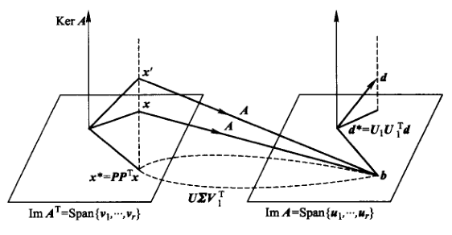

# 矩阵约化

## QR分解

- **QR分解**：$A = QR$，其中 $Q$ 是正交矩阵，$R$ 是上三角矩阵
  - **QR算法**：$Ax = b\red\Rt Rx = Q^Tb$，转化为上三角方程组
  - **存在及唯一性**：非奇异矩阵 $A$ 的QR分解存在且唯一
    - **证明**：
      - 归纳法得存在性，反证法得唯一性
- **QR算法的思想**：用正交变换将原矩阵 $A$ 变为上三角矩阵，则变换阵就是 $Q^T$，变换结果就是 $R$
- **常用正交变换**：
  - Gram-Schmidt变换：减去投影向量，从而转化为垂线向量
  - Givens变换：二维旋转变换
  - Householder变换：镜像翻转变换

### Gram-Schmidt正交化方法

- 详见[高等代数](../../高等代数/91.欧氏空间.md)
- $Q = [\b_1,...,\b_n]，R = \tvec{1 & \dfrac{(\a_2,\b_1)}{(\b_1,\b_1)} & \cdots \\ & 1 & \cdots \\ && \ddots}$

### Givens变换

- **Givens矩阵**：平面旋转矩阵 $T_{ij}$，将 $I$ 中的 $i,j$ 两行两列元素替换为二阶旋转阵 $\tvec{\cos\t & \sin\t \\ -\sin\t & \cos\t}$
  - **几何意义**：在维度 $i,j$ 构成的二维平面上，进行 $\theta$ 角度的旋转
  - **正交性**：定义易得
- **算法**：用辅助角公式，把向量在 $ij$ 平面的分量旋转到 $i$ 轴上，则像的第 $j$ 分量变为 $0$
  - 取 $\begin{cases} a = \cfrac{x_i}{\sqrt{x^2_i + x^2_j}} = \sin\lang \vec x_i,\vec x_j \rang\\ b = \cfrac{x_j}{\sqrt{x^2_i + x^2_j}} = \cos\lang \vec x_i,\vec x_j \rang \end{cases}$，则有 $\begin{cases} y_i = \sqrt{x^2_i + x^2_j} （ij投影模长） \\ y_j = 0  \\ y_k = x_k \pad (k\neq i,j)\end{cases}$
  - <font color='chartreuse'> $n$ 维空间中共有 $C^2_n$ 个二维平面
    - 先把 $1i \pad (i > 1)$ 平面的分量都旋转到 $1$ 上，即把 $A$ 的第一列以下归零
    - 再把 $2i \pad (i > 2)$ 平面的分量都旋转到 $2$ 上，即把 $A$ 的第二列以下归零
    - 不断旋转下去，最终将 $A$ 化为上三角矩阵。所有变换阵组成 $Q$，变换结果组成 $R$</font>
- **QR分解**：$\begin{cases} Q^T = T_{n-1,n}\ T_{n-2,n}\cdots T_{1n}\cdots T_{12} \\ R = Q^TA \end{cases}$
  - <font color='red'>每一次迭代后，都根据当前的 $x^{(k)}\pad(k\leq n^2)$ 来构造 $T_{ij}$</font>
  - **运算次数**：
    - $\frac{4}{3}n(n^2-1)$ 次乘除运算
    - $\frac{1}{2}n(n-1)$ 次开方运算
  - **应用**：适用于稀疏矩阵


```matlab
function [a,b] = givens(x,y)
  if y == 0
    a = 1, b = 0;
  elseif abs(y) > abs(x)
    temp = x/y;
    b = 1/sqrt(1+temp^2);
    a = b*temp;
  else
    temp = y/x;
    a = 1/sqrt(1+temp^2);
    b = a*temp;
  end
end
```

### Householder变换

- **Householder矩阵**：镜像投影矩阵。设 $v$ 是单位向量，则 $H = I-2vv^T$
  - **镜面对称性**：$Hx$ 是（以 $v$ 为法向量的超平面）的（关于 $x$ 的镜像投影）
    - **理解**：
      - $2vv^Tx$ 是等腰三角形的底边，也是镜面指向 $x$ 的法向量
        - <font color='chartreuse'>实际上应该写成 $2(v^Tx)\cdot v$</font>
      - $x$ 和 $Hx$ 是两条腰
      - $x$ 在镜面的投影是高
  - **对称正交性**：
    - **对称性**：$vv^T = \begin{pmatrix} v_1^2 & v_1v_2 & \cdots & v_1v_n \\ v_1v_2 & v_2^2 & \cdots & v_2v_n \\ \vdots & \ddots \\  \end{pmatrix}$ 对称，故 $H$ 也对称
    - **正交性**：由对称性，$HH^T = (I-2vv^T)^2 = I-4vv^T + (2vv^T)^2 = I$
- **算法**：
  - **求镜像平面**：设 $\|x\|_2 = \|y\|_2$，取 $v = \cfrac{x-y}{\|x-y\|_2}$，则有 $y = Hx$
  - **上三角化**：
    - 设已经迭代到第 $m$ 列，即要归零该列第 $m$ 行以后的元素
    - 构造 $\overline{H}_m\overline{x}= \overline{H}_m\begin{pmatrix} x_{m} \\ \vdots \\ x_n \end{pmatrix} = \begin{pmatrix} -\alpha_{m} \\ 0 \\ \vdots \end{pmatrix}$，其中 $\alpha_{m} = \|\overline{x}\|_2\cdot \sgn(\overline{x})$
      - <font color='chartreuse'>这里已知像和原像，那么可以求出 $v$，从而求出 $\ol H_m$</font>
    - 再取 $H = \diag(I_m,\overline{H}_m)$ 即可
- **QR分解**：$\begin{cases} Q = H_1...H_{n-1} \\ R = Q^TA \end{cases}$
  - <font color='chartreuse'>首先构造 $H_1$ 将 $A$ 的第一列映射到 $\tvec{-\alpha_1 \\ 0 \\ \vdots}_n$
  - 再构造 $H_2 = \diag(1,\overline{H}_2)$，将 $A$ 的第二列映射到 $\tvec{a_{12} \\ -\a_2 \\ 0 \\ \vdots}_{n-1}$
  - 不断进行下去，最终 $A$ 变为上三角矩阵 $R$。将所有 $H$ 合并即得 $Q$</font>
  - **应用**：适用于稠密矩阵


## Hessenberg标准型

- **上Hessenberg矩阵**：$G = \begin{cases} g_{ij}\quad i\leq j+1 \\ 0，\pad 其他情况 \end{cases}$
  - $G = \begin{pmatrix} g_{11} & g_{12} & \cdots & g_{1,n-1} &  g_{1n} \\ g_{21} & g_{22} & \cdots & g_{2,n-1} & g_{2n} \\ 0 & g_{23} & \ddots & g_{3,n-1} & g_{3n} \\ \vdots & \ddots & \ddots  & \ddots & g_{n-1,n} \\ 0 & 0 & \cdots & g_{n,n-1} & g_{nn} \end{pmatrix}$，即对角元下方一对角行也不为0
- **Hess相似定理**：任意实方阵均可正交相似于上Hess矩阵
  - <font color='chartreuse'>但不一定正交相似于上三角阵，详见Jordan型</font>
  - **构造性证明**：
    - 将矩阵分块为 $A = \begin{pmatrix} a_{11} & c^T_1 \\ b_1 & D_1 \end{pmatrix}$
    - 由Householder变换的存在性，存在 $\overline{H}_1b_1 = \tvec{\beta_1 \\ 0 \\ \vdots}$
      - <font color='chartreuse'>即从次对角元 $a_{i,i+1}$ 开始变换，上三角部分的元素均保持不动</font>
      - 设 $H_1 = \diag(1,\overline{H}_1)$，则 $H_1AH_1 = \begin{pmatrix} a_{11} & c_1^T\ol H_1 \\ \ol H_1 b_1 & \ol H_1D_1\ol H_1 \end{pmatrix}$
      - <font color='chartreuse'>由Householder变换阵的对称正交性，这是正交相似</font>
    - 不断作用下去，即得 $(H_1\cdots H_{n-1})^TA(H_1\cdots H_{n-1}) = G$
  - **不唯一性**
- **QR分解**：$\begin{cases} Q = H_1...H_{n-2} \\ R = Q^TA \end{cases}$
    - **推论**：若 $A$ 是对称矩阵，则 $G$ 为三对角矩阵
- **复杂度**：$\T = \dfrac{10n^3}{3}$

## 奇异值分解（SVD）

- **奇异值分解**：设 $A$ 是复矩阵，则存在酉矩阵 $U,V$ 和 $\Sigma = \tvec{\diag(\sigma_1,...,\sigma_r) & O \\ O & O}_{m\times n}$，使得  $U^TAV = \Sigma$
  - <font color='chartreuse'>（详细定义见高等代数）</font>
  - **推论**：
    - $U^TAA^TU = \diag(\sigma_1^2,...,\sigma_r^2,0,...,0)_m$
    - $V^TA^TAV = \diag(\sigma_1^2,...,\sigma_r^2,0,...,0)_n$
    - <font color='chartreuse'>即 $u_i$ 和 $v_i$ 分别是 $A^TA$ 和 $AA^T$ 的特征向量</font>
    - **证明**：直接计算即可
  - **左右奇异向量**：$\begin{cases} A^Tu_i = \sigma_i v_i \\ Av_i = \sigma_i u_i \end{cases}$
- **像核对偶定理**：$(\Im A)^\perp = \Ker A^T$
  - **证明**：
    - 已知 $\Im A$ 是 $A$ 的列空间，$\ker A$ 是 $Ax = 0$ 的解空间，再由矩阵乘积的内积视角即可得到结论
  - **矩阵理解**：将 $AX = b$ 奇异值分解，$b\in Im\ A$ 或 $b\perp Ker\ A^T$ 时有界
  - **几何理解**：
- **奇异值分解的性质**：
  - $\ker A = \span\{v_{r+1},...,v_n\}$
    - **证明**：
      - 由于 $U$ 可逆，$UAV$ 是对角阵，故只能是 $AV$ 的 $r$ 列以后均为零向量，从而得到结论
  - $\Im A = \span\{u_1,...,u_r\}$
    - **证明**：
      - 同上得此时 $\ker A^T = \span\{u^T_{r+1},\cdots,u^T_{n}\}$
      - 由酉矩阵性质得 $(\ker A^T)^\perp = \span\{ u_1,\cdots ,u_r \} = \Im A$
  - 设 $U_1,U_1$ 分别表示表示 $U,V$ 的前 $r$ 列子阵，则 $A = U_1\Sigma V_1^T$
    - **证明**：
      - 由实酉方阵的逆转置性，移项即可
  - $\|A\|^2_F = \sum\limits^r_{i=1} \sigma_i^2$
    - **证明**：
      - 由于标准正交基的2范数均为 $1$，故易得酉矩阵的F范数均为 $1$，即 $\|UAV\|_F^2 = \|A\|^2_F$，从而得到结论
  - $\|A\|_2 = \sigma_1$
    - **证明**：
      - 定义易得
- **奇异值分解算法**：利用酉方阵性质，用转置运算代替求逆运算，从而简化线性方程组的求解
  - **简化结果**：$\tvec{\Sigma V_1^Tx \\ 0} = \tvec{U_1^Tb \\ U_2^Tb}$
    - <font color='chartreuse'>线性方程组有解 $\LR U_2^Tb = 0 \LR b\perp\ker A^T \LR b\in\Im A$</font>
  - **规范解**：$x^* = V_1\Sigma^{-1}U_1^Tb = \sum\limits^r_{j=1} \cfrac{1}{\sigma_j}(u_j^Tb)v_j$
    - **2范数最小性**
      - **证明**：已知解均满足 $V_1^T\ol x = \Sigma^{-1} U_1^T b$，故 $$\|\ol x\|^2_2 = \|V^T\ol x\|^2_2 = \sum^r_{j=1} (v_j^T\ol x)^2 + \sum^n_{j=r+1} (v_j^T\ol x)^2 = \|x^*\|^2_2 + \sum^n_{j=r+1} (v_j^T\ol x)^2$$
- **解的几何意义**：
  - **正交射影**：设 $S\subset \R^n$，若 $P\in \R^{n\times n}$ 满足以下性质，则称其为到 $S$ 上的射影矩阵 $$\begin{cases} \Im P = S  &（射影性） \\ P^T = P &（对称性）\\ P^2 = P & （幂等性） \end{cases}$$
    - <font color='chartreuse'>由高等代数可知，幂等矩阵对应投影映射，若对称则为正交投影</font>
  - **求射影矩阵**：已知 $S$ 时，求出它的标准正交基矩阵 $V\in\R^{n\times r}$，则 $P = VV^T$
      - **投影的像**：$\forall x\in \R^n，Px \in S$
      - **投影的法向量**：$(I-P)x\perp S$
      - **射影最小定理**：$\|(I-P)x\|_2 = \min\limits_{y\in S} \|x-y\|_2$
        - **证明**：
          - 详见高等代数和后面的最小二乘问题
  - **规范解的射影性**：
    - 已知 $\begin{cases} \R^m = \span\{u_1,...,u_r\} \oplus \span\{u_{r+1},...,u_m\} = \Im A + \ker A^T \\\\  \R^n = \span\{v_1,...,v_r\} \oplus \span\{v_{r+1},...,v_n\} = \Im A^T + \ker A \end{cases}$
    - 设 $\ol x$ 是解，可求得其在 $(\ker A)^\perp$ 上的正交射影为 $x^* = V_1V_1^Tx$
    - 再由于 $V$ 是酉矩阵，故 $V_1V_1^T = I$，验证即得 $x^*$ 也是解
    
- **Moore-Pernose广义逆定理**：$A^\dag = V_1\Sigma^{-1}U_1^{-1}$
  - **证明**：
  - **广义逆性**：$AA^\dag A = A，A^\dag AA^\dag = A^\dag$
  - **对称性**：$(AA^\dag)^T = AA^\dag$，$(A^\dag A)^T = A^\dag A$
  - **子空间射影性**：$AA^\dag = P_{Im}A，A^\dag A = P_{(Ker\ A)^\perp}A$