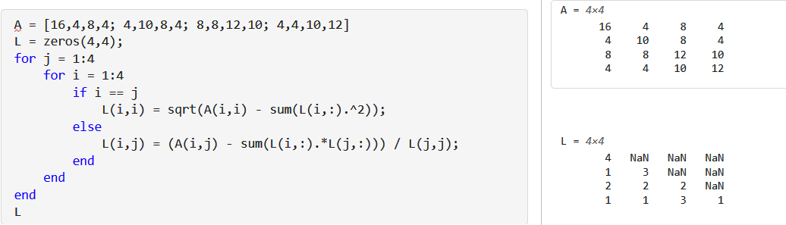

# 第一章：求解线性方程组

## 分解算法

- 算法运算量：加减乘除次数
- **LU分解法**
  - 将矩阵分解为上下三角阵乘积
  - 前代法：下三角矩阵 L 依次代入，运算量 $\sum\limits^n_{i=1} (2i-1)^2$
  - 回代法：上三角矩阵 U 依次代入

### Gauss消元

- **Gauss变换阵**：$\begin{cases} L_k = I-l_ke^T_k \\ l_k = (0,...,l_{k+1,k},...,l_{nk})^T \end{cases}$
- **Gauss消元**：
  - 若取 $l_k=\frac{x_i}{x_k}$
  - 则有 $L_kx = (x_1,...,x_k,0,...,0)^T$（用 $x_k$ 去消除第 $k$ 列的 $k$ 以后的变量）
  - **主元**：$a^{(k-1)}_{kk}$，即第 $k$ 次消元的 $(1,1)$
- **本质**：就是初等行变换的初等矩阵写法。
  - 单位下三角矩阵L是变换阵
  - 上三角矩阵U是变换结果
- **应用**：上三角阵 $A = (L_nL_{n-1}...L_1)^{-1}A^{(n-1)}$，成功分解为 $LU$形式
  - **应用条件**：存在唯一LU分解 $\Leftrightarrow$ 主元均不为0 $\Leftrightarrow$ A的顺序主子阵均非奇异
    - **证明**：归纳阶数 + 利用三角阵的行列式为1性，求行列式即可
- **算法复杂度**：$\sum\limits^{n-1}_{k=1}\big[ (n-k)+2(n-k)^2 \big]$

### 主元换序法

- **算法改进**：选主元三角分解（行列换序）
  - 顺序主子式非奇异条件 退化为 系数矩阵非奇异条件（Cramer法则）
  - 避免小主元使传播误差过早出现
- **全主元Gauss消去法**：每次迭代前先对所有主元大小进行比较，选取最大做主元
  - $(L_rP_r...L_1P_1)A(Q_1...Q_r) = U$
- **全主元三角分解**：先整体换序，再进行迭代
  - $PAQ = LU$
  - **算法复杂度**：$\sum\limits^{n-1}_{k=1}(n-k+1)^2$

- **列主元Gauss消去法**：无列交换，只有行交换（简化复杂度，）

## 平方根法

- **Cholesky分解法**：求解* *对称正定线性方程组**
- **Cholesky分解定理**：对称正定矩阵存在对角元均为正数的下三角阵，使得 $\widetilde{L}\widetilde{L}^T = A$
  - **证明**：
    - 先添项对角矩阵D：$A = LU = LD\widetilde{U}$。其中 $\widetilde{U}$ 是单位上三角阵，$d_{ii} = \dfrac{1}{u_{ii}}$
    - 由对称性得 $A^T = \widetilde{U}^TDL^T$（对称式）
    - 将对称式变形为 $L^T\widetilde{U}^{-1}$，则原式同步变形为 $D^{-1}(\widetilde{U}^T)^{-1}LD = (L^T\wt U^{-1})^T$
    - 由三角阵封闭性，对称式化为单位上三角阵，原式化为下三角阵。由它们相等，得都是单位阵，从而 $\widetilde{U} = L^T$
    - 那么 $\widetilde{L} = L\sqrt{D}$ 即可
  - **理解**：
    - 将一系列矩阵作用于 $A$ 得到单位下三角 $B$
    - 再将（这些矩阵的对称）（对称作用在 $A^T$）上，可得到单位上三角 $B^T$
    - 故 $B = I$，得到 $\wt U$ 和 $L$ 的关系（**核心**）
    - 则可将 $U$ 转化为 $L$
  - **本质**：
    - L和U本来就存在简单的转化关系。Cholesky指明并利用了这一点
    - <font color='chartreuse'>对称性在（一系列对称的运算）下可以保留</font>
  - **Cholesky因子**：$\widetilde{L}$ 唯一
  - **推论（$LDL$ 分解）**：$L^T = D^{-1}U$，则 $A = LU = LDL^T\quad (d_{ii} = \dfrac{1}{u_{ii}})$
- **平方根法（暴力计算）**：设可分解为 $LL^T$
  - 总体关系：$a_{ij} = \sum\limits^j_{p=1} l_{ip}l_{jp}$
  - 递推关系：假设 L 的前 $k-1$ 列已知
    - 先通过形式简单的对角元得到 $l_{kk} = \sqrt{a_{kk}-\sum\limits^{k-1}_{p=1}l^2_{kp}}$
    - 再通过总体关系得到 $l_{ik} = (a_{ik} - \sum\limits^{k-1}_{p=1}l_{ip}l_{kp})/l_{kk}$
- **算法复杂度**：$\frac{1}{3}n^3$
- 

```matlab
A = [16,4,8,4; 4,10,8,4; 8,8,12,10; 4,4,10,12]
L = zeros(4,4);
for j = 1:4
    for i = 1:4
        if i == j
            L(i,i) = sqrt(A(i,i) - sum(L(i,:).^2));
        else
            L(i,j) = (A(i,j) - sum(L(i,:).*L(j,:))) / L(j,j);
        end
    end
end
L
```
```python
import numpy as np

A = np.array([[16, 4, 8, 4], [4, 10, 8, 4], [8, 8, 12, 10], [4, 4, 10, 12]])
L = np.zeros((4, 4))

for j in range(4):
    for i in range(4):
        if i == j:
            L[i, i] = np.sqrt(A[i, i] - np.sum(L[i, :] ** 2))
        else:
            L[i, j] = (A[i, j] - np.sum(L[i, :] * L[j, :])) / L[j, j]

print(L)
```

- **$LDL^T$ 分解**：避免开方运算，将原矩阵分解式改为 $A = LDL^T$
  - 总体关系：$a_{ij} = \sum\limits^{j-1}_{k=1}l_{ik}d_kl_{jk} + l_{ij}d_j$
  - $d_j = a_{jj}-\sum\limits^{j-1}_{k=1}l_{jk}(d_kl_{jk})$
  - $l_{ij} = (a_{ij} - \sum\limits^{j-1}_{k=1}l_{ik}(d_kl_{jk}))/d_j$
- **算法复杂度**：同上

```matlab
for j=1:n
    for i = 1:j-1
        v(i) = A(j,i)A(i,i);
    end
    A(j,j) = A(j,j) - A(j,1:j-1)v(1:j-1);
    A(j+1:n,j) = ( A(j+1:n,j) - A(j+1:n,1:j-1)v(1:j-1))/A(j,j);
end
```

## 分块三角分解

- **效率问题**：存取的速度比运算慢得多，尽量减少存取
- **分块解法**：
  - **线性代数基础子程序（BLAS）**
    - BLAS1：向量运算
    - BLAS2：矩阵向量运算
    - BLAS3：矩阵矩阵运算
    - $\tvek{L_{11} & 0}{L_{21} & I}\tvek{U_{11} & U_{12}}{0 & \widetilde{A}_{22}} = \tvek{A_{11} & A_{12}}{A_{21} & A_{22}}$
  - **运算步骤**：
    1. $A_{11}$ LU分解
    2. 解 $A_{12}，A_{21}$ 方程
    3. 求出 $\widetilde{A}_{22}$

## 习题

- **LU分解唯一性**：若 $A$ 非奇异，则LU分解唯一
- **Gauss变换的逆**：
  - $L_k = I-l_ke^T_k$
  - $L_k^{-1} = I+l_ke^T_k$
- **保对称性**：对称矩阵在Gauss变换后，余矩阵仍对称
- **保对角占优性**：对角占优阵在Gauss变换后，余矩阵仍对角占优
- **保正定性**