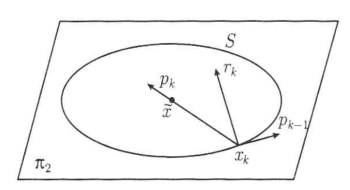
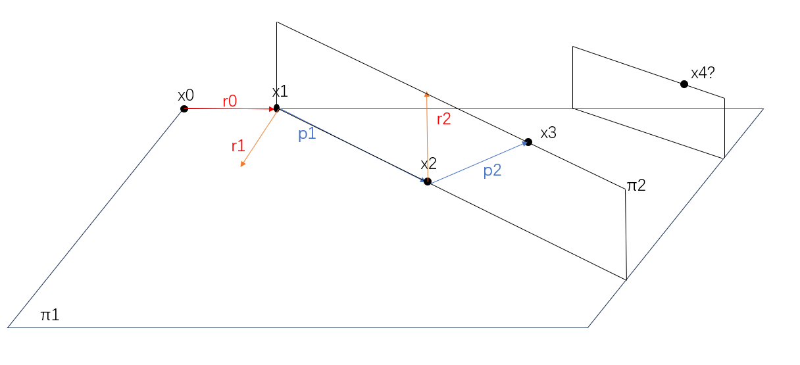

# 第五章：共轭梯度法（CG法）

- **本章所有 $A$ 都是对称正定阵**
- **向量的数值化**：将二次型的展开视为多项式展开
  - 因为二次型具有对称性，所以向量运算的不可交换性在这里被弱化。如果不是对称矩阵的话，向量数值化一般都是错的
  - **分配律**：$(x+y)^T(x+y) = (x^T+y^T)(x+y) = x^Tx + y^Ty + 2x^Ty$
  - **交换律**：$(x^Ty)z = z(x^Ty)$（其它顺序都不能换）
  - **二次函数**：
    - $ax^2+bx+c = x^TAx + bx + c$
    - $a(x-d)^2 = (x-b)^TA(x-b)$
- **方程组梯度法的思想**：
  - 本来梯度法是用来求最小值的，是运筹学的方法
  - 但是这里我们提出了工具函数 $\p$，将解方程问题（即求线性函数的零点问题）转化成了求最值问题（即求二次函数导函数的零点问题）。所以可以看作是将计算问题转为运筹问题，然后借用运筹方法来做

## 最速下降法（DS）

- **二次泛函**：$\p: \R^n\to\R，x \mapsto x^TAx -2b^Tx$
- **极小解定理**：若 $A$ 对称正定，则方程组 $Ax = b$ 的解 $\LR$ 二次泛函 $\p$ 的极小值点
  - **必要性**：
    - 设解为 $x^*$，展开计算易得 $\varphi(x^*+y) = \varphi(x^*) + y^TAy$
      - 原式中，左项中取一个 $x^*$ 一个 $y$ 时，会和右边的 $by$ 抵消，从而只剩下左项两端的两项
    - 由 $A$ 正定性，$\varphi(x^*+y) \geqslant \varphi(x^*)$，从而是极小值点
  - **充分性**：
    - 将 $\p$ 视为多元函数，求偏导得 $\cpfrac{\varphi}{x_i} = 2\sum\limits^n_{j=1} a_{ij}x_j - 2b_i$，即梯度 $\grad\varphi = 2(Ax-b)$
    - 已知梯度在极小值点处为 $0$，故极小值点就是 $Ax = b$ 的解
  - **数值法理解**：$f(x) = ax^2-2bx$ 的极小值点 $\LR ax-b=0$ 的解
- **最速下降法**：
  - **思想**：
    - 给定某起始点 $x_0$
    - 搜索方向 $p_k = -\grad \p(x_k)$
      - 因为负梯度方向是 $\p$ 下降最快的方向
    - 步长 $\a_k$ 满足 $\p(x_k+\a_k p_k) \leq \p(x_k+\a p_k)\quad (\forall \a\in \R)$
      - 即在直线 $p_k$ 方向上前进到最小点处停下
    - 残差 $r_k = b-Ax_{k}$（负梯度）
      - 从数学形式上可以看出，它就是 $\p$ 在 $x_k$ 处的负梯度向量
      - 要注意的是 $\p$ 是一个纯工具对象，提出它的唯一目的就是为了应用它的导函数。也就是说它本身的意义是不需要考虑的，只需要从形式上处理它即可
  - **求解**：
    - 设 $f(\a) = \p(x_k+\a p_k)$
      - 已知当前点梯度，求当前点步长
    - 求导 + 向量数值化计算可得 $\a_k = \cfrac{r^T_k p_k}{p_k^T Ap_k}$
      - 或者用多元函数求驻点，并用Hessian矩阵判断极小性也可，但很麻烦
      - 用向量数值化的思想，把向量看作数后求导，可以快速得出向量形式的极小点
    - 当前点的下降值 $\p(x_{k+1})-\p(x_k) = -\cfrac{(r_k^Tp_k)^2}{p^T_k Ap_k}$
      - 从结果来看 $p_k$ 与 $r_k$ 方向相同时下降值最大，也就是说 $r_k$ 确实是负梯度方向
- **归一性**：$p_k = r_k$
  - **证明**：前面定义已知
- **相邻垂直性**：$p_k\perp r_{k+1}$
  - **证明**：
    - $f'(\a) = 0$ 变形易得 $r^T_{k+1}p_k = 0$
  - 梯度下降法相邻的迭代方向垂直，但不能保证两两垂直。

### DS的收敛性

- **收敛性引理**：
  - 设 $A$ 的特征值为 $\{\lambda_i\}_n$，$P(t)$ 是 $t$ 的多项式，$\|x\|_A = \sqrt{x^TAx}$ 是二次型范数
    - 对称阵用二次型范数更好
  - 则 $\|P(A)x\|_A \leqslant \max\limits_{1\leqslant i\leqslant n} |P(\lambda_i)|\cdot \|x\|_A$
    - C-S不等式 + 最值放缩的组合版本
  - **证明**：
    - 由于 $A$ 是对称正定阵，故其可对角化，即特征子空间的直和为 $\R^n$
    - 设 $\{y_i\}^n_{i=1}$ 是特征空间的标准正交基，任取 $x\in \R^n$，可设 $x = \sum\limits^n_{i=1}  \b_i y_i$
    - 计算 $\big[ P(A)x \big]^T A \big[ P(A)x \big]$
      - 由特征性，原式 $= \Big[\sum\limits^n_{i=1}\b_i P(\l_i) y_i\Big]^T A \Big[ \sum\limits^n_{i=1} \b_i P(\l_i)y_i \Big] $
        - 将 $x$ 分解为 $y_i$，此时 $P(A)$ 就等价于 $P(\l_i)$
      - 由乘法分配律 + $y_i$ 标准正交性，原式 $= \sum\limits^n_{i=1} \l_i\b_i^2 P^2(\l_i)$
        - 将两个和拆开，发现只有前后的 $i$ 相同的项才不为 $0$，故可化简为上面形式
      - 最值放缩得：原式 $\leq \max\limits_{1\leq i\leq n} P^2(\l_i)\cdot\sum\limits^n_{i=1} \l_i\b_i^2$
        - 用最值放缩来提公因式，老手段了
      - 用特征性再转化回来：右式 $= \max\limits_{1\leq i\leq n} P^2(\l_i)\cdot x^TAx$
        - 把 $P(\l_i)$ 提取出去后，再重新将 $y_i$ 组合为 $x$，就得到上面的式子
    - 综上，我们得到不等式 $$x^T\Big[ P(A)\cdot A\cdot P(A) \Big]x \leq \max\limits_{1\leq i\leq n} P^2(\l_i)\cdot x^TAx $$
      - 显然它就是题设中的二次型范数不等式（**证毕**）
    <!-- - 接下来对它进一步做变形
      - 易得 $\|P(A)\|\leq \max\limits_{1\leq i\leq n} P(\l_i)$
      - 令原式消去 $\Big[ P(A)x \Big]^T$，右式消去 $x^TP(\l_i)$，则不等号依然成立
        - ss
      - 最终得到 $\biggm\|A\Big[ P(A)x \Big]\biggm\|_A \leq \max\limits_{1\leq i\leq n} P(\l_i)\cdot Ax$ -->
  - **理解**：思路很清晰直接，不难
  - **本质**：特征值的确界不等式，添项 $P(A)$ 使得更加具有一般性，并采用正交规范基进行标准化
- **收敛性定理**：
  - 设 $A$ 的特征值为 $\{\lambda_i\}_n$
  <!-- - $\|x\|_A$ 是二次型范数 -->
  - 则 $\|x_k-x^*\|_A \leqslant \left( \cfrac{\lambda_n-\lambda_1}{\lambda_n+\lambda_1} \right)^k \|x_0-x^*\|_A$ （其中 $x^* = A^{-1}b \approx \dfrac{b}{a}$）
  - 这个和前面的单步定长迭代法的（收敛速度估计式）具有相似形式，可以看作是给出了迭代矩阵 $M$ 在（二次型范数）下的上界
  - **证明**：
    - 由最速下降性，$\p(x_k)\leq \p(x_{k-1}+\a r_{k-1})\quad (\forall \a\in\R)$
      - 这是最速下降法给出的唯一信息，我们接下来要用这个信息得到题设的不等式
      - 用向量的数值法配方，容易发现 $\p(x) + (x^*)^TAx^* = (x-x^*)^TA(x-x^*)$
        - 即 $ax^2-2bx+\dfrac{b^2}{a} = a(x-\dfrac{b}{a})^2$
      - 综合上面两式可得 $$(x-x^*)^TA(x-x^*) \leq (x_{k-1}+\a r_{k-1} - x^*)^TA(x_{k-1}+\a r_{k-1}-x^*)$$
        - 它实际上就是最速下降性的（二次型范数写法）
    - 我们希望把两式都写成二次型范数的形式。左式是容易变形的，且它就是题设不等式左边的形式。关键是右式需要化简和放缩一下，转变为题设不等式右边的形式
      - 将 $r_k$ 代入右式可得 $\big[ (I-\a A)(x_{k-1}-x^*) \big]^TA\big[ (I-\a A)(x_{k-1}-x^*) \big]$
        - 要带着目的去看每一步，不然纯靠数学形式打死也看不出为什么能写成这样
        - 这一步的数值化写法为 $a(x_k-\dfrac{b}{a})^2 \leq a(1-\a\cdot a)^2(x_{k-1}-\dfrac{b}{a})^2$，看着就不容易想
        - 时刻谨记，每一步处理目的都是为了尽量将其转化为已知定理或公式的形式
      - 设 $P_\a(t) = 1-\a t$，则右式变为 $\|P_\a(A)(x_{k-1}-x^*)\|_A$
        - 这里就看出，上面的引理完全是为了处理这个多项式而特意包的饺子
      - 由上面引理得右式 $\leq \max\limits_{1\leq i\leq n} |P_\a(\l_i)| \cdot\|x_{k-1}-x^*\|_A\quad (\forall \a\in\R)$
      - 再易得 $\min\limits_{\a}\max\limits_{\l_1\leq t\leq \l_n} |1-\a t| = \cfrac{\l_n-\l_1}{\l_n+\l_1}$，代入上式即得题设不等式（**证毕**）
  - **理解**：
  - **推论**：
    - **最速下降法的收敛速度**：$speed = \cfrac{\lambda_n-\lambda_1}{\lambda_n+\lambda_1}$
    - **收敛判别法**：当 $speed < 1$ 时收敛，其它情况发散

### 习题

- **有限步停止定理**：SD中若某个 $p_k$ 是 $A$ 的特征向量，则该次迭代可收敛到精确解
  - **证明**：
    - 由于 $p_k$ 和 $r_k$ 相等，故只需对 $r_k$ 证明即可
    - 设精确解为 $x^*$，由迭代公式得 $x^* = x_k + \a_k r_k$
    - 由精确性得 $b = Ax^* = Ax_k + \a_k Ar_k$
    - 从而 $r_k = b-Ax_k = \a_k Ar_k$，即 $(I-\a_k A)r_k = 0$，即 $r_k$ 是 $A$ 的关于 $\dfrac{1}{\a_k}$ 的特征向量
    - 套套定义就出来了，不难

## 共轭梯度法（CG法）

- **思想**：
  - SD一般不能有限步终止
  - SD可能出现局部最优终止，但不是整体最优的情况
- **初始条件**
  - 初始向量 $x_0$
  - 负梯度 $r_0$
  - 下降方向 $p_0$
  - 步长 $\a_k$
- **共轭平面** $\pi_k = \{x_k+\xi r_k + \eta p_{k-1}\mid \xi,\eta\in \R\}$
  - 它表示过 $x_k$ 点的（负梯度 $r_k$）和（上个下降方向 $p_{k-1}$）张成的二维平面
  - 不难发现梯度向量至少为 $3$ 维时，取共轭平面才有意义。也就是不能用标准二元函数来进行几何理解了，至少得三元才行
- **共轭梯度法**：
  - 第 $1$ 次迭代，取 $r_0 = p_0$，进行最速下降迭代
  - 第 $k+1$ 次迭代，下降至 $\pi_k$ 内 $\p$ 的极小值点，然后根据下降方向构造新的 $\pi_{k+1}$，进行第 $k+2$ 次迭代
  - 它并不是仅仅把 $\R^n$ 内的最速下降改成 $\pi_k$ 内的最速下降
    - 最速下降法是依赖于下降方向（$x_k$ 处梯度）的，而共轭梯度法是依赖于下降终点（$\pi_k$ 内最小值点）的。也就是每一步都下降到子空间内的最小值点，从而逐步下降到总空间的最小值点
    - 沿着当前点的梯度并不一定能走到最小值点，就像速度快不一定等于走的远一样。所以CG法的 $p_k$ 可能不等于 $r_k$
- **二次泛函在共轭平面上的限制**：$\p|_{\pi_k} = \psi(\xi,\eta) = \p(x_k+\xi r_k + \eta p_{k-1})$
  - 如果知道了 $x_k,r_k,p_{k-1}$，就可将 $\p|_{\pi_k}$ 退化为二元函数
  - $x_k$ 和 $p_{k-1}$ 可由上一次迭代得出。$r_k$ 可由定义直接得出，都不难
  
- **$\psi$ 在共轭平面的极小值点**：$\wt x$
  - **求解**：
    - 令 $\psi$ 对两个变量求偏导，得到二元线性方程组 $\begin{cases} \dpfrac{\psi}{\xi} = 0 \\\\ \dpfrac{\psi}{\eta} = 0 \end{cases}$
    - 设线性方程组的解为 $(\xi_0,\eta_0)$，则 $\wt x = x_k + \xi_0 r_k + \eta_0 p_{k-1}$ 
      - 具体的结果形式就不写了
    - **下降方向**：$p_k = \cfrac{\wt x - x_k}{\xi_0}  = r_k + \cfrac{\eta_0}{\xi_0}\cdot p_{k-1}$
      - 第一个等式是 $\wt x$ 的定义（由克拉默法则，化为齐次系数时形式更简单）。第二个等式是代入了上一行的结果
      - 由第二式可以看出，$p_k$ 不再是单纯的负梯度 $r_k$，而是在此基础上添加了偏折向量 $\cfrac{\eta_0}{\xi_0}p_{k-1}$，使得下降方向偏转到共轭平面内
    - **偏折步长**：$\b_{k-1} = \cfrac{\eta_0}{\xi_0} = -\cfrac{r^T_k A p_{k-1}}{p^T_{k-1} A p_{k-1}}$
      - 第一个等式是上一行变形的结果，第二个等式是其展开形式（齐次形式可约去系数行列式）
- **数学建模**：$\begin{cases} x_{k+1} = x_k + \a_k p_k \quad 迭代公式 \\\\ r_k = b-Ax_k \quad 残差 \\\\ p_k = r_k + \b_{k-1} p_{k-1} \pad 下降方向  \end{cases}$ **计算结果**：$\begin{cases} \a_k = \cfrac{r_k^Tp_k}{p^T_k A p_k} \\\\ \b_{k-1} = -\cfrac{r^T_k A p_{k-1}}{p_{k-1}^T A p_{k-1}} \end{cases}$
  - **证明**：
    - $\p_{k+1}$ 和 $\b_{k+1}$ 的公式前面已推出
    - 与前面SD法相同，对 $\p(x_k + \a p_k)$ 关于 $\a$ 求导即可计算出 $\a_k$
  - 注意CG法中的残差 $r_k$ 是 $\p$ 的负梯度，而不是 $\psi$ 的负梯度
- **结果简化**：$\begin{cases} \a_k = \cfrac{r_k^Tr_k}{p^T_k A p_k} \\\\ \b_{k-1} = \cfrac{r^T_kr_k}{r^T_{k-1}r_{k-1}} \end{cases}$
  - **证明**：
    - **引理（残差递推公式）**：$r_{k+1} = r_k - \a_k Ap_k$
      - **证**：$x_k$ 的递推公式直接变形即可
    - **引理（p-r转化公式）**：$Ap_k = \dfrac{1}{\a_k}(r_k-r_{k+1})$
      - **证**：上式直接变形即可
    - 用 $p$ 和 $r$ 的递推式、转化式对 $\a_k,\b_k$ 变形，再利用Krylov子空间的垂直性即可
  - 发现该系数和首一正交多项式的三项递推式很像
    - $r_k$ 对应 $Q_k$，$Ar_k$ 对应 $xQ_k$，$r_k^Tr_k$ 对应 $(Q_k,Q_k)$
    - 因为它们本质都是将一组基共轭正交化的产物
  - 这里的 $p_k$ 是中间产物，在首一正交多项式中没有对应
- **三项递推式**：$$ r_{k+1} = \dkh{A-\frac{r_k^TAr_k}{r_k^Tr_k}}r_k - \frac{r_k^Tr_k}{r_{k-1}^Tr_{k-1}}r_{k-1}$$
  - **证明**：
    - 由Krylov子空间结论，$r_k = Q_k(A)r_0$，再由首一正交多项式三项递推即得结论

### CG法的性质

- **Krylov子空间**：$\mc K(A,r_0,k+1) = \span\{r_0,Ar_0,\cdots,A^kr_0\}$
  - **方程意义**：初始负梯度向量 $r_0$ 在系数矩阵 $A$ 下的像所张成的子空间
- **共轭正交向量组**：若一组向量满足 $p_i^TAp_j = 0 (i\neq j)$，则称它关于 $A$ 共轭正交
  - **几何意义**：因为 $A$ 是对称正定的，所以它相当于Gram矩阵，共轭正交本质是线性变换后的正交
  - **数值意义**：类似函数空间中的加权内积，这里的 $A$ 相当于内积的权矩阵
  - **应用意义**：共轭正交可以保证 $p_i,p_j$ 在二次型度量下互不干扰，从而每步迭代不会破坏之前迭代的最优性，从而必定有限步收敛
- **CG性质**：
  - **共轭平面垂直性**：$\pi_i\perp r_j \pad (0\leq i < j \leq k)$
    - **几何理解**：
      - 因为 $x_k$ 是二维平面 $\pi_k$ 上的最小值点，所以【（$x_k$ 处的负梯度 $r_{k+1}$） 在 $\pi_k$ 的两个维度上的分量】均为 $0$，也就是说 $\pi_k \perp r_{k+1}$
      - 下面是 $x_k\in \R^3$ 时的例子（但它不是最好的例子，因为三维空间中的最大维度超平面就是二维的，是一个特例）
      - 本来我还想对所有的 $r_i\perp r_j$ 都写上几何意义的，但发现它绕不开二次泛函本身的性质。而二次向量函数在几何上的意义又太复杂了，违背了几何法追求直观的本意，所以还是等到以后再写吧（反正类似Jordan标准型这种东西也是没有几何意义的，单纯是代数形式简单比较好理解。这个代数意义也不复杂，就是公式变形复杂了点）
    
  

    - **代数证明**：
      - 用数学归纳法，假设 $k$ 以下均成立下面四个性质。再证明下面四个性质的 $k+1$ 阶情况也成立
  - **旧方向垂直性**：$p_i^Tr_j = 0\quad (0\leq i<j\leq k)$
    - （新的负梯度）与（旧的共轭平面）均垂直
    - **几何理解**：由共轭平面垂直性的几何意义即可
    - **归纳证明**：
      - 由梯度递推式 + 归纳法假设即可 $%\forall p_i^Tr_{k+1} = 0$
  - **梯度垂直性**：$r_i^Tr_j = 0\quad (0\leq i\neq j\leq k)$
    - 负梯度之间两两垂直
    - **几何理解**：由共轭平面垂直性的几何意义即可
    - **归纳证明**：
      - 由梯度递推式 + 归纳法假设即可
      <!-- - 由归纳假设得 $\span\{r_0,...,r_k\} = \span\{p_0,...,p_k\}$
      - 再由旧方向垂直性即得结论 -->
  - **方向共轭性**：$p^T_i A p_j = 0 \quad (0\leq i\neq j\leq k)$
    - （方向向量）均关于 $A$ 共轭正交
    - **几何理解**：
      - 因为 $A$ 是正定对称阵，所以可分解为 $L^TL$，即方向向量组 $\{p_i\}$ 被 $L$ 变换后的像是正交向量组
    - **归纳证明**：
      - 已知 $Ap_k = \dfrac{1}{\a_k}(r_{k+1}-r_k)$，再由旧方向垂直性即可
  - **基性**：$$\mc K(A,r_0,k+1) = \span\{r_0,\cdots,r_k\} = \span\{p_0,\cdots,p_k\} = \pi_1\oplus\pi_2\cdots\oplus \pi_k $$
    - **几何理解**：
    - **代数证明**：
      - 由归纳假设得 $r_k，p_k\in \mc K(A,r_0,k+1)$
      - 再由梯度递推式即得 $r_{k+1} \in \mc K(A,r_0,k+2)$
      - 再由方向递推式即得 $p_{k+1}\in \mc K(A,r_0,k+2)$
      - 再由垂直性得线性无关，从而是直和
  - **推论**：共轭梯度法最多 $\dim \mc K$ 次便会得到结果
    - **证明**：
      - 上面结论易得 $r_k$ 是Kry空间的正交基，$p_k$ 是Kry空间的共轭正交基
      - 也就是说CG法每一次迭代都是在取新的基，显然最多只有 $\dim\mc K$ 个基向量
- **估计定理**：$\p(x_k) = \min\set{\p(x)\mid x\in \big[ x_0 + \mc K(A,r_0,k+1) \big]}$
  - **证明**：

### 习题

- **共轭无关性**：设 $A$ 是 $n$ 阶正定实对称方阵，$\{p_i\}^k_{i=1}$ 关于 $A$ 共轭正交，则 $p_i$ 彼此线性无关
  - **证明**：
    - 反设线性相关，即 $\sum\limits^k_{i=1} \l_i p_i = 0$，添项得 $p_i^T A(\sum\limits^k_{i=1} \l_ip_i) = 0$
    - 再由共轭正交性，上式 $= \l_i p_i^T Ap_i$，故只能是 $\l_i = 0$
    - 由 $i$ 任意性即得 $\forall \l_i = 0$，从而线性无关
- **krylov维数定理**：
  - 设 $A$ 是 $n$ 阶正定实对称方阵，有 $k$ 个不同特征值
  - 则 $\forall r\in\R^n$，其Krylov子空间 $K = \span\{r,...,A^{n-1}r\}$ 维数至多为 $k$
  - **证明**：
    - 由实对称性，特征子空间相互正交且直和为 $\R^n$，设特征基为 $\{e_i\}^n_{i=1}$
    - 可设 $r = a_1e_1  + ... + a_ne_n$
    - 此时 $Ar = \l_1(a_1e_1 + ...)  + \l_2(...) + ... + \l_k()$
    - 然后 $A^2 r = \l_1^2(a_1e_1 + ...)  + \l_2^2(...) + ... + \l_k^2()$
    - 显然 $k$ 个括号内的向量不会变，改变的只有线性组合系数。再由 $k$ 个线性组合系数最多导出 $k$ 个线性无关向量，即得 $\dim K \leq k$（**证毕**）
- **对称阵的线性最小二乘**：
  - 设 $A$ 是 $n$ 阶正定实对称方阵，$S$ 是 $\R^n$ 中的 $k$ 维子空间
  - 则对 $\forall b\in\R^n$，都有 $$\|x_k-A^{-1}b\|_A = \min\limits_{x\in S}\|x-A^{-1}b\|_A  \LR r_k\perp S$$
  - **证明（必要性）**：
    - 题设条件等价于 $x_k$ 是 $S$ 中线性最小二乘问题的最优解
    - 由线性最小二乘关系，此时残向量满足 $r_k\perp \Im A|_{S}$
    - 再由于正定实对称方阵非奇异，故 $\Im A = \R^n$，从而 $\Im A|_{S} = S$
  - **证明（充分性）**：
    - 同上即可

## 实用共轭梯度法（ACG）

- **优点**：防止计算误差导致的正交性损失

### ACG收敛性

- **直接定理**：设 $A = I+B$
  - 若 $rank(B) = r$
  - 则 共轭梯度法最多 $r+1$ 步即得精确解
  - **证明**：
- **误差估计定理**：

## 预优共轭梯度法（PCG）

## Krylov子空间法

