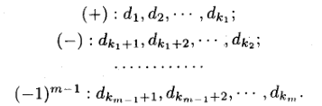

# 一致逼近问题

- **泛函分析复习**：
  - **无穷范数**：$\|f\|_{\infty} = \sup\limits_{x\in [a,b]} |f(x)|$
  - **函数距离**：$d(f,g) = \|f-g\|_{\infty}$
- **一致逼近**：寻找函数列 $f_n$ ，使得 $\|f_n-f\|_{\infty}\to 0$，即依无穷范数一致收敛到 $0$
  - 在整个闭区间内，逼近函数所有点都和被逼近函数相似，但无准确节点

## 多项式一致逼近

### 组合多项式

<!-- - **Newton二项式系数**：$C^k_n$ -->
- **Bernstein多项式**：设 $f\in C[0,1]$，则 $(B_nf)(x) = \sum\limits^n_{k=0} f(\dfrac{k}{n})C^k_n x^k(1-x)^{n-k}$
  - 抽象代数、组合数学中也有提到
- **组合性**：取 $f(y) = n^2(y-x)^2$ 时，$(B_nf)(x) = nx(1-x)$
  - **证明**：
    - **括号展开**：此时 $f(\dfrac{k}{n}) = (k-nx)^2$，将其展开后，$B_nf$ 分裂为三个部分
    - **提取因数**：
      - 再由于二项式系数的性质，易得 $\begin{cases} k(k-1)C^k_n = n(n-1)C^{k-2}_{n-2} \\\\ kC^k_n = nC^{k-1}_{n-1} \end{cases}$
      - 故三个部分中都可将 $k$ 变为 $n$，从而从加和式中提取出来
    - **改变序号**：
      - 提取因数后，再提取一定次数的 $x^i$，并改变加和式的序号，即可将其转化为二项式展开形式
      - 最终就能化为题设右式的形式
- **一致逼近性**：$\forall f\in C[0,1]$，都有 $\lim\limits_{n\to\infty} \|f-B_nf\|_{\infty} = 0$
  - **证明**：
    - 由极限定义，给定一个 $\e$，证明 $\sup| f-B_n f| < \e$ 即可
    - 由康托尔定理，$f$ 在 $[0,1]$ 上一致连续，故对 $\e$ 存在一个相应的 $\d(\e)$
    - **拉普拉斯方法**：
      - 取 $n$ 足够大，使得 $\dkh{\dfrac{1}{n}}^{\dfrac{1}{4}} < \d$
      - 将截集合 $K = \{0,1,...,n\}$ 分为 $K' = \hkh{k\in K : |\dfrac{k}{n}-x| < \dkh{\dfrac{1}{n}}^{\frac{1}{4}}}$ 和其补集 $K''$
      - $K'$ 内可直接得出 $\e$，再证明 $K''$ 极小即可
    - **分别放缩**：
      - 将 $|f-B_nf|$ 分为 $k\in K'$ 和 $k\in K''$ 两个部分的加和
        - Bernstein多项式具有一定的离散性
      - **上界放缩**：
        - 设 $M = \sup\limits_{x\in [0,1]} |f(x)|$
        - 对 $K'$ 部分由一致连续性得到 $\e$，对 $K''$ 部分上界放缩，可得 $$|f-B_nf| \leq \frac{\e}{2}\sum_{k\in K'} C^k_n x^k(1-x)^{n-k} + 2M\sum_{k\in K''} C^k_n x^k(1-x)^{n-k}$$
      - **添项放缩**：
        - 左项直接将加和式放大为 $\Big( x+(1-x) \Big)^n = 1$，即可转化为 $\dfrac{\e}{2}$
        - 右项需要进一步放大
          - 定义易得 $k\in K''$ 时 $n^{\frac{1}{2}}(\dfrac{k}{n}-x)^2 \geq 1$，故可将其作为因子添加进去，则右项放大为 $$ 2Mn^{-\frac{3}{2}}\sum_{k\in K''} (k-nx)^2 C^k_n x^k(1-x)^{n-k} $$
          - 由上面引理得加和式等于 $nx(1-x)$，转化为 $\cfrac{x(1-x)2M}{\sqrt{n}}$
          - 对 $x\in [0,1]$ 求极值即得右项 $\leq \dfrac{M}{2}(\dfrac{1}{n})^{\frac{1}{2}}$，再取 $n$ 足够大就能得到右项 $\leq \dfrac{\e}{2}$

### W逼近定理

- **Weierstrass一致逼近定理**：
  - 设 $f\in C[a,b]$，则 $\forall \e>0，\exists p(x)\in \mc P$ 使得 $\|f-p\|_{\infty} < \e$
  - 即任意（闭区间上连续函数）都可被多项式一致逼近
  - **证明**：
    - 取线性变换 $x = (b-a)t + a$，设 $f(x)$ 变为 $\wt f(t)$
      - 即将定义域 $[a,b]$ 等比变换为 $[0,1]$
    - 由Bernstein多项式的一致逼近性，存在多项式 $\wt p(t) = (B_nf)(t)$ 满足题设
    - 再将其换元回来即可

## 最佳一致逼近

- **逼近偏差**：$\D (f,p_n) = \|f-p_n\|_{\infty}$
  - 多项式 $p_n$ 与 $f$ 最值的绝对差
- **最小偏差（最佳逼近）**：$E_n(f) = \inf\limits_{p_n\in\mc P_n} \D(f,p_n)$
  - 用 $n$ 次多项式逼近 $f$ 时，逼近偏差的下确界
  - **单调性**：$E_0(f) \geq E_1(f) \geq ...$
    - **证明**：
      - 显然多项式次数越高，其种类越多，即 $|\mc P_n|$ 越大，且是包含升链
      - 从而相差值只可能变小，不可能变大
- **Borel逼近定理**：$\forall f\in C[a,b]，\exists p_n\in\mc P_n$ 使得 $\D(f,p_n) = E_n(f)$
  - 即最小偏差是可取到的下确界
  - **证明**：
    - 设 $p_n(x) = a_nx^n + ...  + a_0$。则 $f$ 给定时，可设 $\D (f,p_n) = \phi(a_0,...,a_n)$
      - 问题转化为证明 $\phi$ 的下确界可取到
    - **引理**：
      - **连续性**：$\phi$ 是连续函数
      - **差分有界性**：$\forall a_i,a_i'\in\R$，存在常数 $C$ 使得 $\D \phi \leq C\sum\limits^n_{i=0}|a_i-a_i'|$
        - **证明**：
          - 由连续性易得结论
      - **下界性**：存在 $A,B > 0$ 使得 $\phi \geq A\sqrt{\sum\limits^n_{i=0} a_i^2} - B$
        - **证明**：
          - 由差分有界性，取 $\begin{cases} C = \sup\{1,|x|,...,|x^n|\} \\\\ A = \inf\hkh{\sup |\phi(x)| : \sum\limits^n_{i=0} a_i = 1} \\\\ B = \|f\|_{\infty} \end{cases}$ 即可
    - 由下界性得当 $\phi$ 的系数向量 $\|\a\|_2\to +\infty$ 时，$\phi\to +\infty$
      - 由极限保号性，存在 $r>0$ 使得当 $\|\a\|_2 > r$ 时，$\phi(\a) \geq \phi(\bs 0)$ 
        - 设 $G = \{\a: \|\a\|_2 \leq r\}$，显然 $G$ 以内的值均小于 $G$ 以外的值
        - 由于我们要找的是 $\phi$ 的下确界，故 $G$ 以外的区域可以不予考虑
      - 再由 $G$ 是闭区域，故由 $\phi$ 连续性得存在可取到的下确界 $\phi(\a_0) \leq \phi(\bs 0)$
        - 紧集上连续函数的最值定理
      - 取 $p_n^*(x) = \a_0^T X_n$，易得它就是最佳逼近多项式

## 最佳逼近的性质

- **偏离点**：由于 $f,p_n$ 都是闭区间上的连续函数，故 $f-p_n$ 的上确界可取到。
  - 即偏离点就是最大值点/最小值点
- **正偏离点**：$p_n(x_i) - f(x_i) = \D (f,p_n)$
  - 向上偏离最大的点
- **负偏离点**：$f(x_i) - p_n(x_i) = \D (f,p_n)$
  - 向下偏离最小的点
- **交错点组**：若 $x_1,...,x_s$ 满足 $p_n(x_i)-f(x_i) = (-1)^{i-1}\sigma \D (f,p_n)\quad (\sigma = \pm 1)$，则称为 $p_n(x)$ 的交错点组
  - 即一个正偏离点，一个负偏离点，按序号交错分布
  - （注意 $\sigma$ 是未定常数而非变量，即对每个具体的 $p_n$ 它是不会变化的）
- **切比雪夫定理**：
  - 设 $f\in C[a,b]$
  - 则 $p_n^*$ 是最佳逼近 $\LR$ 在 $[a,b]$ 上存在 $p^*_n$ 的不少于 $n+2$ 个点构成的交错点组
  - **证明（充分性）**：
    - 设 $a\leq x_1 < ... < x_{n+2} \leq b$ 是 $p_n$ 的一个交错点组
    - 反设不是最佳逼近，设 $p_n^*$ 是最佳逼近
    - 考虑 $p_n(x_i) - p_n^*(x_i) = \Big[ p_n(x_i) - f(x_i) \Big] - \Big[ p_n^*(x_i) - f(x_i) \Big]$
      - 由最佳逼近性，易得左式和右式第一项同号
      - 再由交错点组的定义，左式在每个区间中依次变号
      - 由多项式连续性，左式在每个区间中都存在一个零点，即左式至少有 $n+1$ 个零点，与次数相矛盾
  - **证明（必要性）**：
    - **构造交错点组**：由 $p^*_n(x)-f(x)$ 连续得存在一组分划 $a = u_0 < ... < u_s = b$ 使得每个区间上振幅小于 $\dfrac{E_n(f)}{2}$
      - **正负偏离区间**：若某区间中至少有一个正偏离点，则称为正偏离区间。负偏离区间同理
      - **正负恒定性**：由振幅上界易得每个区间只能是正偏离或负偏离的一种
      - **区间分组**：给区间从左到右编号为 $d_1,...,d_N$，并按照下列规则分组
        
        - 第一组连续的正偏离区间有 $k_1$ 个，连续的负偏离区间有 $k_2$ 个……
        - 每个（连续正负区间的端点）都是交错点
    - **交错点组数量**：易得 $m$ 就是交错点组的元素数量，故只需证明 $m\geq n+2$ 即可
      - 反设 $m < n+2$，由函数连续性 + 区间反号性得 $d_{k_1}$ 和 $d_{k_1+1}$ 的端点不重合，故两区间之间存在一个点 $\a_1$
      - 同理可找出一列点 $\a_1,...,\a_{m-1}$
      - 设 $\rho(x) = \prod\limits^{m-1}_{i=1} (\a_i-x)$
        - 由假设得 $\rho\in\mc P_n$
        - 观察易得 $\rho$ 在每个 $d_i$ 上都与 $p^*_n(x)-f(x)$ 同号
      - 设 $Q(x) = p^*_n(x) - \e\rho(x)$
        - 只需证明 $\e\to 0$ 时，$\D (f,Q) < E_n(f)$，即得矛盾
        - 若 $[u_k,u_{k+1}]$ 不是偏离区间，则 $\sup\limits_{x\in [u_k,u_{k+1}]} |p^*_n(x)-f(x)| < E_n(f)$
          - 最小逼近？
          - 此时由三角不等式得 $|Q(x)-f(x)| \leq E + \e\rho|x| \leq E_n(f)$
        - 若 $[u_k,u_{k+1}]$ 是偏离区间
          - 由同号性，绝对值可直接展开，即 $$|Q(x)-f(x)| = |p_n^*(x)-f(x)| - \e|\rho(x)|$$
          - 由最小逼近性，前项大于 $\dfrac{E_n(f)}{2}$
          - 取 $\e$ 足够小，则后项小于 $\dfrac{E_n(f)}{2}$
          - 综上即得 $|Q(x)-f(x)| \leq E_n(f)$
        - 最后结合两种情况即可给出结论
- **唯一性定理**：设 $f\in C[a,b]$，则 $f$ 在 $\mc P_n$ 中的最佳一致逼近多项式是唯一的
  - **证明**：
    - 反设 $p_1,p_2$ 都是最佳逼近多项式
    - 设 $R(x) = \cfrac{p_1(x)+p_2(x)}{2}$，易得 $|R(x)-f(x)| \leq E_n(f)$，故其也是最佳逼近
    - 由切比雪夫定理，存在 $R(x)$ 的交错点组 $a = x_1<...<x_{n+2} = b$
      - 设 $x_k$ 是正偏离点，则 $R(x_k)-f(x_k) = E_n(f)$    
        - 正偏离点也是最大值点
      - 再由 $p_2$ 的最佳逼近性，$p_2(x_k)-f(x_k) \leq E_n(f)$
        - $x_k$ 不一定是 $p_2$ 的偏离点，但可以给出上界
      - 从而得 $p_1(x_k)-f(x_k) \geq E_n(f)$
        - 定义变形易得
      - 再由于 $p_1$ 也是最佳逼近，故只能是 $p_1(x_k)-f(x_k) = E_n(f)$。从而 $p_1$ 和 $R$ 的交错点组相同
      - 同理可得 $p_1,p_2$ 交错点组完全相同，即 $\forall p_1(x_k) = p_2(x_k)$。再由多项式的性质即得 $p_1\equiv p_2$
        - 同解的多项式必定相等

## 最佳逼近的数值计算

### 直接利用特性

### Remes算法

- **思想**：
  - 给出 $p_n(x)-f(x)$ 的交错点组的初始近似
  - 设 $\sigma = \pm E_n(f)$，则易得 $p_n$ 满足线性方程组 $$(-1)^{i+1}\sigma + \sum\limits^n_{k=1}a_ix_i^k = f(x_i)，i=1,...,n+2$$
  - 求解线性方程组，即得 $p_n$ 和 $f$ 的近似
  - 再通过分析差值，找到新的近似，不断迭代
- **步骤**：
  - 

## 最小零偏差问题

- **符号约定**：
  - $\mc Q_n$ 表示首一 $n$ 次多项式
- **最小零偏差问题**：求 $p_n\in\mc Q_n$ 使得 $\sup\limits_{x\in [a,b]} p_n(x) = \inf\limits_{q_n\in\mc Q_n}\sup\limits_{x\in [a,b]} |q_n(x)|$
  - 即求与 $f(x) \equiv 0$ 偏差最小的首一多项式
- **Chebyshev多项式**：$T_n(x) = \cos(n\arccos x)$
  - **递推公式**：$T_{n+1}(x) = 2xT_n(x) - T_{n-1}(x)$
    - **证明**：
      - 三角函数诱导公式即可
  - **多项式性**：$T_n(x)$ 是 $n$ 次多项式
    - **证明**：
      - 易得 $T_0(x) = 1，T_1(x) = x$
      - 再由递推公式 + 数学归纳法即得结论
  - **零点**：设 $x_k = \cos\dfrac{2k+1}{2n}\pi$，则 $T_n(x_k) = 0$
    - **证明**：代入得显然
  - **最值点**：设 $x_k = \cos\dfrac{k}{n}\pi$，则 $T_n(x_k) = (-1)^{k-1}\sup\limits_{x\in [-1,1]} |T_n(x)|$
    - **证明**：代入得显然
  - **周期交错性**：在单位圆上，以 $\dfrac{1}{2n}\pi$ 为步长（再取余弦）的交错点组
    - 奇数点是零点，偶数点是最值点
- **切比雪夫零偏差定理**：$p_n(x) = \cfrac{1}{2^{n-1}}T_n(x)$ 是 $[-1,1]$ 上的最小零偏差多项式
  - **证明**：
    - 设 $p_n(x) = x^n-p_{n-1}(x)$，则最小零偏差问题可转化为求 $x^n$ 的最佳一致逼近多项式 $p_{n-1}$
    - 由切比雪夫定理，存在交错点组 $-1\leq x_1<...<x_{n+1} \leq 1$ 使得 $p_n(x_i) = \sigma_i$
      - 其中 $\sigma_i = \pm \sup |p_n(x)|$，且 $\sigma_i\sigma_{i+1} < 0$
    - 由切比雪夫多项式的性质，显然可选取 $\hkh{x_k = \cos\dfrac{k\pi}{n}}^{n+1}_{k=0}$ 作为交错点组，再令首项系数为 $1$ 即可

### 切比雪夫加速

- **多项式加速方法**：
  - 设 $Ax = b$ 是线性方程组，$x^*$ 是精确解
  - 设迭代序列为 $w^{(n)} = Gw^{(n)} + g$，误差向量为 $\wt \e^{(n)} = w^{(n)} - x^*$
    - 易得误差迭代关系 $\wt \e^{(n)} = G\wt \e^{(n-1)} = ...$
  - 取线性组合序列 $x^{(n)} = \sum\limits^n_{i=0} a_{ni}\wt \e^{(n)}$，其中 $\sum\limits^n_{i=0} a_{ni} = 1$
    - 为了确保迭代序列为精确解时，组合序列也为精确解
  - 设加速误差向量为 $\e^{(n)} = x^{(n)} - x^*$
    - 易得误差转化关系 $\e^{(n)} = \Big[ \sum\limits^n_{i=0} \a_{ni}G^i \Big]\wt e^{(0)}$
    - 此时加速误差迭代关系为 $\e^{(n)} = Q_n(G)\e^{(n)}$，其中 $Q_n$ 是满足 $Q_n(1) = 1$ 的多项式
- **切比雪夫加速方法**：
  - **思想**：取合适的 $Q_n$，使加速误差向量 $\e^{(n)}$ 的范数尽可能小
  - **分析**：
    - 设 $S_n$ 是满足要求的所有多项式，则只需满足 $$\sup\limits_{\l\in [\a,\b]} |p_n(\l)| = \inf\limits_{Q_n\in S_n}\sup\limits_{\l\in [\a,\b]} |Q_n(\l)|, \quad -1<\a<\b<1 $$
    - 即满足 $p_n$ 是满足条件的、无穷范数最小的多项式
  - **解**：存在唯一解 $p_n(\l) = \cfrac{T_n(\dfrac{2\l-\b-\a}{\b-\a})}{T_n(\dfrac{2-\b-\a}{\b-\a})}$

## 三角多项式的一致逼近

- **符号约定**：
  - $C_{2\pi}$ 表示所有的 $2\pi$ 周期连续函数
  - $\mc T$ 表示所有的三角多项式
- **Weierstrass定理**：设 $f\in C_{2\pi}$，则 $\forall \e>0$，存在 $s\in\mc T$ 使得 $\|f-s\|_{\infty} < \e$
  - **证明（de la Vallee Poussin）**：

## 最佳一致逼近的收敛速度

- 