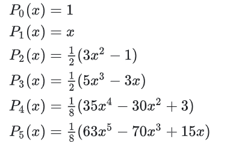
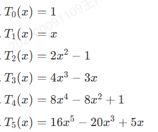

# 平方逼近问题

- **平方逼近**：一致逼近是依无穷范数收敛，平方逼近是依2范数收敛
- **权函数** $\rho(x)$：在 $(a,b)$ 上满足非负性、连续性、零点有限性、可积性的函数
- **加权平方度量**：
  - 给定权函数 $\rho$，则加权平方度量为 $\|f\|_{2,\rho} = \dis\sqrt{\int^b_a \rho(x)f(x)^2dx}$
- **符号约定**：规定以后的2范数都默认为加权平方度量

## 最佳平方逼近

- **W定理**：设 $f\in C[a,b]$，则 $\forall \e > 0，\exists p\in\mc P$ 使得 $\|f-p\|_2 < \e$
  - **证明**：
    - 由积分第一中值定理易得 $\|f-p\|_2 \leq \sqrt{\dis\int^b_a \rho(x)dx} \cdot \|f-p\|_{\infty}$
    - 再由 $\rho$ 是给定函数，故转化为最佳一致逼近问题。再由最佳一致逼近问题的W定理即得结论

## 最小二乘拟合

- **最佳二乘拟合问题**
  - 设 $\phi_0,...,\phi_n\in C[a,b]，\Phi_n = \span\{ \phi_0,...,\phi_n \}$
  - 给定 $f\in C[a,b]$，是否存在 $\phi^*(x) \in \Phi_n$ 使得...
- **Gram矩阵**：
  - 设 $g_{i,j} = \dis\int^b_a \rho(x)\phi_i(x)\phi_j(x)dx$，则 $G = (g_{i,j})_{(n+1)\times (n+1)}$ 称为 $\Phi_n$ 的Gram矩阵
  - **内积性**：$G$ 的元素就是相应函数的内积
  - 类似高代中的Gram矩阵，同时线性系统中也有能控Gram矩阵
- **法方程**：函数系数线性方程组 $G\a = \bs b$，其中每行为 $\sum\limits^n_{j=0} (\p_k,\p_j)a_j = (f,\p_k)$
  - $a_j$ 表示线性组合系数，$\a$ 就是线性组合向量
- **Gram行列式**：$\D_n = \det G$
  - **线性无关性**：$\D_n\neq 0 \LR$ 函数列线性无关
    - **证明**：列出法方程，仿照Cramer法则直接计算其非零解即可
- **最小二乘拟合定理**：
  - 存在唯一的最佳平方逼近函数 $\LR \Phi_n$ 的Gram行列式非零 $\LR \phi_i$ 彼此线性无关
  - **证明**：
    - 设 $\phi(x) = \sum\limits^n_{i=1}c_i\phi_i(x)$，$S(c_0,...,c_n) = \|f-\phi\|^2_2$
    - 问题转化为寻找 $S$ 的最小值点
    - 易得 $S$ 可微，由无条件极值问题的驻点法，可得一个函数系数方程组 $G\bs c = \bs b$
      - 如果系数是常数，则由线性代数知识易得题设等价关系。但这里系数是函数矩阵，故需要一些分析
    - 易得 $S$ 是非负二次函数，故必定存在最小值点 $\bs c^*$，由费马引理得其满足驻点方程组
      - 将 $S(\bs c)$ 展开为积分形式后放缩
        - 首先在平方项 $(f-\phi)^2$ 中添项 $\phi^*$ 后展开
        - 再将 $\phi$ 写成线性组合形式
        - 再放缩掉 $(\phi^*-\phi)^2$ 项
        - 最终可得 $$S \leq \|f-\phi\|^2_2 + 2\sum^n_{i=0} \Big[ \int \rho(x)f(x) - \phi^*(x)\phi_i(x)dx \Big](c_i^*-c_i)$$
      - 由于 $c_i^*$ 满足驻点方程组，故后项的积分值均为 $0$，从而转化为 $$\|f-\phi^*\|^2_2 \geq \|f-\phi\|^2_2$$
  - **推论**：取 $\phi_i(x) = x^i$ 时，就转化为多项式最佳平方逼近问题。显然它的Gram矩阵非零，故必定存在解

### 习题

- **求最佳平方逼近多项式（给定空间）**：已知定义域 $[a,b]$，被逼近函数 $f$，权函数 $\rho$，函数空间 $\Phi_n$，求最佳平方逼近多项式
  - 首先由于是多项式逼近，故 $\Phi_n = \span\{1,x,...,x^n\}$，即得到 $\{\phi_i\}$
  - 可求出 $(\phi_i,\phi_j)$，从而求出 $G$
  - 再求出 $(f,\phi_i)$，并求解法方程 $G\a = \bs b$，即可得到线性组合系数 $\a$，从而得到 $p_n(x)$
- **求最佳平方逼近多项式（未定空间）**：已知定义域 $[a,b]$，被逼近函数 $f$，权函数 $\rho$，求最佳平方逼近多项式
  - **情况1**：
    - 若存在和**定义域**与**权函数**均匹配的**规范正交多项式**（详见下面介绍）
    - 则由于是正交的，故 $G = I_n$，即此时 $\bs b$ 就是解
  - **情况2**：
    - 若不存在，则用下面的方法自己求一个首一正交多项式系，然后将其规范化即可

## 正交函数系

- 关于函数空间内积的内容详见泛函分析和傅里叶分析
- **内积逼近定理**：
  - 设 $f\in C[a,b]，\phi^*\in \Phi_n$
  - 则 $\phi^*$ 是最佳平方逼近 $\LR (f-\phi^*,\phi_j) = 0$
  - 即函数向量 $f-\phi^*$ 与超平面 $\Phi_n$ 正交
  - 由数值线性代数的最小二乘法可直观得出几何意义
  - **证明**：
    - 构造函数系数线性方程组，说明一下即可
- **（仿）Riesz表示定理（推论）**：
  - 设 $\{\phi_i(x)\}^n_{i=1}$ 是标准正交基，则最佳平方逼近函数可写成 $\phi^* = (\bs c^*, \bs \phi)$
    - 其中 $c_i = (f,\phi_i) = \dis\int^b_a \rho(x)f(x)\phi_i(x)dx$
  - **证明**：
    - 此时Gram矩阵为单位矩阵，仿照之前证明即可

### 函数组的正交化

- **Gram-Schmidt正交化**

### 正交多项式

- **Legendre多项式**：勒让德多项式是区间 $[-1,1]$ 上关于权函数 $\rho(x) = 1$ 的正交多项式
  - 将单项式基函数 $\{1,x,x^2,...\}$ 正交化所得的多项式
  - **首项系数**：$\cfrac{(2n)!}{2^n(n!)^2}$
  - **规范形式**：$\wt P_n(x) = \sqrt{\dfrac{2n+1}{2}}P_n(x)$
    - **证明**：
      - 求范数然后添加比例系数即可
  - **计算实例**：
    - $P_n(x) = \cfrac{1}{2^n n!}\cfrac{d^n}{dx^n}(x^2-1)^n$
    
- **Chebyshev多项式**：切比雪夫多项式是区间 $[-1,1]$ 上关于权函数 $\rho(x) = \cfrac{1}{\sqrt{1-x^2}}$ 的正交多项式
  - 将单项式基函数 $\{1,x,x^2,...\}$ 正交化所得的多项式
  - **规范形式**：$\begin{cases} \wt T_0(x) = \sqrt{\dfrac{1}{\pi}}T_0(x) \\\\ \wt T_n(x) = \sqrt{\dfrac{2}{\pi}}T_n(x)  \end{cases}$
    - **证明**：
      - 求范数然后添加比例系数即可
  - **计算实例**：
    
- **Laguerre多项式**：拉盖尔多项式是区间 $[0,+\infty]$ 上关于权函数 $\rho(x) = e^{-x}$ 的正交多项式
  - **表达式**：$L_n(x) = e^x\cfrac{d^n}{dx^n}(x^ne^{-x})$
  - **递推公式**：$\begin{cases} L_0(x) \equiv 1 \\\\ L_1(x) = 1-x \\\\ L_{n+1}(x) = (1+2n-x)L_n(x) - n^2L_{n-1}(x) \end{cases}$
  - **规范形式**：略
    - **证明**：
      - 求范数然后添加比例系数即可
  - **正交关系**：
- **Hermite多项式**：厄米特多项式是区间 $\R$ 上关于上关于权函数 $\rho(x) = e^{-x^2}$ 的正交多项式
  - **表达式**：$H_n(x) = (-1)^n e^{x^2}\cfrac{d^n}{dx^n}(e^{-x^2})$
  - **递推公式**：$\begin{cases} H_0(x) \equiv 1 \\\\ H_1(x) = 2x \\\\ H_{n+1}(x) = 2xH_n(x) - 2nH_{n-1}(x) \end{cases}$
  - **正交关系**

### 正交多项式的性质

- **性质定理**：设 $\{Q_i\}^n_{i=1}$ 是首一正交多项式系，则
  - **线性表出性**：任意多项式都可写为正交多项式系的线性组合
  - **实根性**：$(a,b)$ 上有 $n$ 个不同实根
  - **首一递推关系**：$Q_{n+1}(x) = (x-\a_n)Q_n - \b_n Q_{n-1}(x)$
    - 其中 $$\begin{cases} \a_n = \cfrac{(x\p_n,\p_n)}{(\p_n,\p_n)} \\ \b_n = \cfrac{(\p_n,\p_n)}{(\p_{n-1},\p_{n-1})} \end{cases}$$
    - 特例 $\begin{cases} \p_0(x) = 1 \\\\ \p_1(x) = (x-\a_0)\p_0 = x-\a_0 \end{cases}$
  - **最小零偏差性**：$Q_n$ 是平方度量下的最小零偏差多项式

### 习题题

#### 算法

- 已知权函数和区间，求首一正交多项式
  - **解**：
    - 首先取 $\p_0(x) = 1，\p_1(x)  = x-\a_0$
    - 再由递推关系，不断计算即可

#### 性质

- **切比雪夫多项式的性质**：
  - **积分性**：$\dis\int^1_{-1} \frac{\Big[ T_n(x) \Big]^2}{\sqrt{1-x^2}}dx = \frac{\pi}{2}$
    - **证明**：
      - 换元 $x=\cos\t$ 直接计算积分即可
  - **保正交变换**：
    - 设 $T^*_n = T_n(2x-1)$，则它是 $[0,1]$ 上关于权函数 $\rho(x) = \cfrac{1}{\sqrt{x-x^2}}$ 的正交多项式
    - **解**：直接积分换元求解即可
- **第二类切比雪夫多项式**：$U_n = \cfrac{\sin\Big[ (n+1)\arccos x \Big]}{\sqrt{1-x^2}}$ 是 $[-1,1]$ 上关于权函数 $\rho(x) = \sqrt{1-x^2}$ 的多项式
  - **证明**：
    - 换元 $x=\cos\t$ 计算积分 $(U_n,U_n)$
    - 三角正交性计算积分 $(U_m,U_n)$ 即得结论

## 收敛性

- **问题的归一化**：最佳平方逼近多项式的收敛性等价于正交多项式展开的收敛性

### 平方度量的收敛性

### 一致度量的收敛性

## Fourier级数

- 详见数分和傅里叶分析

## 离散平方逼近

- **多余观测问题**：在建立多个变量之间的函数关系时，有些观测点存在误差。希望能减少观测点数量的同时减少误差影响
- 

### 最小二乘法

- **思想**：
  - 实际上它和数理统计的最小二乘法是一样的

### 线性最小二乘法

- **曲线拟合问题**：
  - 已知
    - 函数组 $\{\phi\}^n_{i=1}\in C[a,b]$ 线性无关，一阶零点至多为 $n+1$ 个
      - 零点数量约束是为了满足Gram矩阵的可逆性
    - $\{(x_i,y_i)\}^N_{i=1}$ 是一组互不相同的观测数据，且 $N>n$
      - 观测数据数量也是为了满足Gram矩阵可逆性
  - 求使得 $Q(a_0,...,a_n) = \sum\limits^N_{i=1} \Big[ y_i - \sum\limits^n_{j=0} a_j\phi_j(x_i) \Big]^2$ 最小的系数向量 $\a$
  - **解**：
    - 设 $\bs \phi_j = \tvec{\phi_j(x_1) \\ \vdots \\ \phi_j(x_N)}$，$\bs Y = \tvec{y_1 \\ \vdots \\ y_N}$
    - 本质是无条件极值问题。对 $Q$ 求偏导得法方程 $$\sum\limits^n_{j=1} a_j (\bs \phi_j,\bs \phi_k) = (\bs Y, \bs \phi_k)\quad k=0,...,n$$
      - 此时的系数矩阵即为 $\{\bs\phi_j\}^n_{j=0}$ 的Gram矩阵
  - **法方程的正则化形式**： $A = \tvec{\bs\phi_0,...,\bs\phi_n}$，则法方程为 $A^TA\bs X = A^T\bs Y$
- **求解简化式**：
  - $(\p_i,\p_j) = \sum\limits^N_{i=1} \p(x_i)\p(x_j)$
  - $(\p_i,y) = \sum\limits^N_{i=1}\p(x_i)y_i$
  - 其实就是把积分形式换成了求和形式而已

### 习题

- **计算最小二乘拟合（用多项式逼近）**：
  - 设 $\phi_j = x^j，0\leq j\leq n$
  - 首先计算出 $\bs \phi_j = \tvec{\phi_j(x_1) \\ \vdots \\ \phi_j(x_N)}$，从而得到 $A = \tvec{\bs\phi_0,...,\bs\phi_n}$
  - 再由节点值得到 $\bs Y = \tvec{y_1 \\ \vdots \\ y_N}$
  - 求解法方程 $A^TA\bs X = A^T\bs Y$，其解就是系数向量 $\a$

## Fourier数值方法

### 离散傅立叶变换

- 