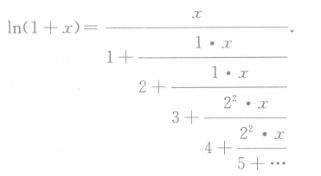

# 非线性逼近

- **思想**：对于存在极点的函数，多项式或三角函数逼近不再适用

## 最佳一致有理逼近

- **最佳一致有理逼近问题**：
- **存在性定理**：

## 有理函数插值

## Pade逼近

- **帕德逼近 $R(n,m)$**：
  - 设
    - 有理函数 $R_{nm}(x) = \cfrac{P_n(x)}{Q_m(x)}$，其中 $Q$ 常数项为 $1$
    - 函数 $f\in C^{m+n+1}(-a,a)$
  - 若成立插值条件 $R^{(k)}_{nm}(0) = f^{(k)}(0)\quad k=0,1,...,m+n$
  - 则称 $R_{nm}(x)$ 为 $f$ 在 $x=0$ 处的 $(n,m)$ 阶帕德逼近
- **帕德逼近定理**：
  - 设
    - $f,R_{nm}$ 满足上面条件
    - $a_n$ 是分子多项式 $P_n$ 的系数，$b_m$ 是分母多项式 $Q_m$ 的系数
      - 由定义得 $b_0 = 1$
    - $c_j = \cfrac{f^{(j)}(0)}{j!}，\bs b = \tvec{b_m \\ \vdots \\ b_1}，\bs c = \tvec{c_{n+1} \\ \vdots \\ c_{n+m}}$
      - 显然 $c_j$ 是泰勒系数，$\bs c$ 就是泰勒展开式的系数向量
    - $H = \bvec{-c_{n-m+1} & \cdots & -c_{n-1} & -c_n \\ -c_{n-m+2} & \cdots & -c_n & -c_{n+1} \\ \vdots && \vdots & \vdots \\ -c_n & \cdots & -c_{n+m-2} & -c_{n+m-1}}_{m\times m}$
      - 这是个对称矩阵
  - 则
    - **系数关系式**：$a_k = \sum\limits^{k}_{j=0} c_jb_{k-j}\quad k=0,...,n$
    - **充要条件**：$R_{nm}$ 是 $f$ 的帕德逼近 $\LR$ 线性方程组 $H\bs b = \bs c$
  - **证明**：
    - 设 $h(x) = P(x)Q_{m}(x) - P_n(x)$，则插值条件等价于 $h^{(k)}(0) = 0$
    - 由莱布尼茨高阶导公式，即可得到系数关系式和方程组

### 习题

- **求帕德逼近**：
  - 首先利用 $f$ 的泰勒展开式求出 $\bs c$ 和 $H$
  - 然后解方程组 $H\bs b = \bs c$ 求出 $\bs b$
  - 再由关系式求出 $a_k$

## 连分式展开

- **连分式**：
- **辗转相除法**：

### 习题

- 求 $\ln(x+1)$ 的连分式展开
  - **辗转相除法**：
    - 取泰勒展开式的部分和 $S_n = \sum\limits^n_{k=1} (-1)^{k-1}\dfrac{x^k}{k}，x\in [-1,1]$
    - 对其应用辗转相除法，可转化为
    
    - **紧凑形式**：$\cfrac{x}{1}_+ \cfrac{1\cdot x}{2}_+ \cfrac{1\cdot x}{3}_+ \cfrac{2^2\cdot x}{4}_+ \cfrac{2^2\cdot x}{5}_+\cdots$

## 最佳指数函数和逼近

## 