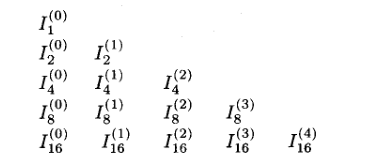

# 数值积分

- **求积公式**：设 $I(f) = \dis\int^b_a f(x)dx$，则 $I_n(f) = \sum\limits^n_{j=0} A_{j,n}f(x_{j,n})$
  - **求积系数**：$A_{j,n}$
  - **求积节点**：$x_{j,n}$
  - 求积公式是以 $f$ 为变量的泛函。它的形式只由求积节点和求积系数决定，而不依赖于具体函数 $f$ 的选取
  - 但同一个求积公式对不同函数的收敛性有所不同
- **插值型求积公式**：用插值多项式逼近被积函数，然后对其积分。将积分结果作为求积公式
- **求积余项**：$R_n(f) = I(f) - I_n(f) = \dis\int^b_a E_n(f)dx$
  - 易得它就是插值余项的定积分
- **代数精度**：若取至多 $m$ 次多项式时均相等，但 $m+1$ 次多项式不相等，则称求积公式 $I_n$ 具有 $m$ 次代数精度

## N-C求积公式

- **Newton-Cotes求积公式**：等距节点插值型求积公式
- **符号约定**：
  - 设 $f\in C[a,b]$
  - 将 $[a,b]$ 区间 $n$ 等分，步长为 $h = \dfrac{b-a}{n}$，节点为 $x_j = a+jh$

### 特例

- **梯形公式**：取 $n=1$ 的求积公式
  - **几何意义**：积分值就是梯形面积
  - **求积余项**：$R_1(f) = \dis\int^b_a f[x,a,b](x-a)(x-b)dx$
    - **微分形式**：$R_1(f) = -\dfrac{1}{12}f''(\eta)(b-a)^3$
      - **证明**：
        - 由差商的微分表出性 + 积分第一中值定理即可
  - **代数精度**：$1$
- **Simpson公式**：取 $n=2$ 的求积公式
  - **几何意义**：积分曲线就是抛物线
  - **求积余项**：$R_2(f) = \dis\int^b_a f[x,a,b,c](x-a)(x-b)(x-c)dx$
    - **微分形式**：$R_2(f) = -\dfrac{h^5}{90}f^{(4)}(\eta)$
      - **证明**：
        - 易得 $(x-c) = d(\cfrac{(x-a)(x-b)}{2})$，故可分部积分
        - 再对 $f[x,a,b,c]$ 分部积分 + 积分第一中值定理，可化为 $$-\frac{1}{4}f[a,b,\xi,\xi]\int^b_a (x-a)^2(x-b)^2dx $$
        - 若 $f\in C^4[a,b]$，则由差商的微分表出性即得结论
  - **代数精度**：$3$
- **Cotes公式**：取 $n=4$ 的求积公式

### 求积定理

- **通项定理**：设 $f_i = f(a+ih)$，则 $\dis\int^b_a f(x)dx = Ah(B_0f_0 + ... + B_nf_n) + R_n(f)$
  - 以上求积系数有专门的系数表
- **余项微分表出定理**：
  - 若 $n$ 为偶数，$f\in C^{n+2}[a,b]$，则 $R_n(f) = C_n h^{n+3}f^{(n+2)}(\eta)$
    - 其中 $C_n = \dis\frac{1}{(n+2)!}\int^{n}_0 t^2(t-1)\cdots (t-n)dt$
    - **证明**：略
  - 若 $n$ 为奇数，$f\in C^{n+1}[a,b]$，则 $R_n(f) = C_n h^{n+2}f^{(n+1)}(\eta)$
    - 其中 $C_n = \dis\frac{1}{(n+1)!}\int^{n}_0 t(t-1)\cdots (t-n)dt$
    - **证明**：略
- **推论（代数精度定理）**：
  - $n$ 为奇数时，代数精度为 $n$
  - $n$ 为偶数时，代数精度为 $n+1$
    <!-- - 导数降次性得，余项中$f^{(n+1)}$会把所有n次多项式余项降为0 -->

#### 习题

- **求代数精度**：给出求积公式（共 $n$ 项），求其代数精度
  - **解**：
    - 将单项式基 $\{1,x,x^2,...,x^{n-1}\}$ 逐个代入，求出一个解 $A_0,...,A_n$
    - 接着代入 $x^n,x^{n+1}$，直到出现不相等的值为止
    - 因为多项式可被单项式线性表出，故只需要对基验证公式就行
    - 再因为公式是可继承的，故求出一个解后没必要每一步都解方程了，直接代入即可

### 收敛性

- 略

<!-- ## 定积分数值计算（详见数值分析）

- **Newton-Cotes求积公式**：
  - 零阶的L插值多项式：$p_n(x) = \sum\limits^n_{i=0} [\prod\limits^n_{\substack{j=0 \\ j\neq i}} \frac{x-x_j}{x_i-x_j}]f(x_i)$
    - $q_k(x)$的一种形式，利用了0的乘积性和加法筛选得到开关性
    - i是分点序号，j是所有分点的遍历序号（k）
  - 积分得系数为（$f(x_i)是常数，不用积分$）：$\Large C_i^{(n)} = (b-a)\frac{1}{b-a}\int^b_a \prod\limits^n_{\substack{j=0 \\ j\neq i}} \frac{x-x_j}{x_i-x_j}dx$
    - 等间距性：$(b-a)\frac{h}{b-a}\int^n_0 \prod\limits^n_{\substack{j=0 \\ j\neq i}} \frac{t-j}{i-j}dt = (b-a)\frac{1}{n}\int^n_0 (-1)^{n-i}\frac{t-j}{i!(n-i)!}dt$
      - i在每个加法项中是不变的，t是自变量
- 规范函数$f(x) = 1$恒成立，多项式又足够简单。得$\sum C = 1$
- **误差估计定理**：就是L插值余项的中值取最大值 -->

### 复化求积公式

- **复化梯形公式**：
  - 将 $[a,b]$ 进行 $n$ 等分，对每个小区间使用梯形公式，可得 $$I(f) = h\Big( \frac{f_0}{2} + f_1 + ... + f_{n-1} + \frac{f_n}{2} \Big)$$
  - **证明**：
    - 首先转化为 $\dis\sum\limits^{n-1}_{j=0} \int^{x_{j+1}}_{x_j}f(x)dx$
    - 然后应用梯形公式，求余项，合并即得结论
  - **余项公式**：若 $f\in C^2[a,b]$，则 $R_n(f) = I(f) - I_n(f) = -\cfrac{b-a}{12}h^2 f''(\eta)$
  - 误差为 $O((b-a)h^2)$，m等分降m次，再复化梯形各降一次，共 $m^2$ 次
- **复化Simpson公式**：
  - 将 $[a,b]$ 进行 $n = 2m$ 等分，对每个小区间使用Simpson公式，可得 $$I(f) = \frac{h}{3}\Big( f_0 + 4f_1 + 2f_2 + ... + 4f_{n-3} + 2f_{n-2} + 4f_{n-1} + f_n \Big)$$
  - **证明**：
    - 首先转化为 $\dis\sum\limits^{n-1}_{j=0} \int^{x_{2j}}_{x_{2j-2}}f(x)dx$
    - 应用Simptson公式，转化为 $$\sum^m_{j=1} \frac{h}{3}\Big[ f_{2j-2} + 4f_{2j-1} + f_{2j}\Big] - \sum^m_{j=1}\frac{h^5}{90}f^{(4)}(\eta_j) $$
  - **余项**：若 $f\in C^4[a,b]$，则 $R_n(f) = -\cfrac{b-a}{180}h^4f^{(4)}(\eta)$

## 外推法与细化法

### 伯努利数

- **Bernoulli数**：
  - 设母函数 $G(t) = \begin{cases} \dfrac{t}{e^t-1} & t\neq 0 \\\\ 1 & t=0 \end{cases}$
  - 将其在 $x=0$ 处泰勒展开得 $G(t) = \sum\limits^\infty_{j=0}\dfrac{B_j}{j!}t^j$ ，其中系数 $B_j$ 称为伯努利数
  - **偶函数性**：$B_1 = -\dfrac{1}{2}，B_{2k+1} = 0$
    - **证明**：
- **Bernoulli多项式**：
  - 设母函数 $H(x,t) = \begin{cases} \dfrac{te^{xt}}{e^t-1} & t\neq 0 \\\\ 1 & t=0 \end{cases}$
  - 将其在 $x=0$ 处泰勒展开得 $H(x,t) = G(t) = \sum\limits^\infty_{j=0}\dfrac{B_j}{j!}t^j$ ，其中系数函数 $B_j(x)$ 称为伯努利多项式
  - **通项公式**：$B_k(x) = \sum\limits^k_{j=0} \tvec{k \\ j} B_j x^{k-j}$
    - **证明**：
      - 由两式泰勒展开式的性质，计算易得
    - **推论**：$B_k(0) = B_k$
      - **证明**：代入通项公式即可
  - **微分迭代性**：$B_j'(x) = jB_{j-1}(x)$
    - **证明**：
      - 对母函数的泰勒展开两边求导数即可
    - **推论（积分迭代性）**
  - **中心对称性**：$B_j(1-x) = (-1)^j B_j(x)$
    - **证明**：
      - 易得 $H(1-x,t) = H(x,-t)$，比较泰勒展开式中两边系数即可
    - **推论**：
      - $B_{2k+1}(1) = B_{2k+1}(0) = 0$
      - $B_{2k}(1) = B_{2k}(0) = B_k$
  - **根数性**：$B_{2k+1}(x)$ 在 $[0,1]$ 中仅有 $0,\dfrac{1}{2},1$ 三个根
  - **保号性**：$B_{2k}(x) - B_{2k}$ 在 $[0,1]$ 中不变号
- **周期Bernoulli函数**：伯努利函数的周期延拓

### 欧拉-麦克劳林公式

- **Euler-Maclaurin公式**：
  - 设自然数 $m\geq 0，n>1$，$f\in C^{2m+2}[a,b]$
  - 则复化梯形公式的余项可写为 $$R_n(f) =  -\sum^m_{j=1} \frac{B_{2j}h^{2j}}{(2j)!} \Big[ f^{(2j-1)}(b) - f^{(2j-1)}(a) \Big] \\\ \\ + \frac{h^{2m+2}}{(2m+2)!}\int^b_a \Big[ \ol B_{2m+2}(\frac{x-a}{h}) - B_{2m+2} \Big] f^{(2m+2)}(x)dx $$
  - **证明**：
  - **推论**：由前面的保号性，将后项用积分第一中值定理提取出 $f^{()}$，然后再由伯努利函数的积分迭代性，最终得到中值形式的余项

### 理查德森外推法

- **外推法**：详见数分的泰勒公式部分
- **Richardson外推法**：
  - 设 $f$ 在 $[a,b]$ 上充分光滑，$I(f)$ 是定积分
  - **初始公式**：设 $T_n(f)$ 是 $n+1$ 个节点的复化梯形公式，则由E-M公式得 $$I(f) - T_n(f) = a_2h^2 + a_4h^4 + a_6h^6 + ... \tag{1}$$
  - **细化区间**：再将每个小区间二等分，设新的复化梯形公式为 $T_{2n}(f)$，则由E-M公式得 $$ I(f) - T_{2n}(f) = a_2\dkh{\frac{h}{2}}^2 + a_4\dkh{\frac{h}{2}}^4 + a_6\dkh{\frac{h}{2}}^6 + ... \tag{2}$$
  - **组合约项**：将 $(1)$ 乘 $\frac{1}{2^2}$ 并与第二式相减得 $$I(f) - \frac{T_{2n}(f) - \frac{1}{4}T_n(f)}{1-\frac{1}{4}} = \ol a_4h^4 + \ol a_6h^6 + ...$$
  - **完成外推**：此时我们得到了一个收敛速度更快的迭代公式 $$ T_{2n}^{(1)}(f) = \frac{4}{3}T_{2n}(f) - \frac{1}{3}T_n(f) $$
- **外推定理**：
  - 复化梯形公式的外推是复化Simpson公式
  - 复化Simpson公式的外推是复化Cotes公式
  - 推导表如下（陈纪修课本）：

### 龙贝格积分法

- **思想**：
  - 复化公式（外推）和细化区间（加点）是加速的两个不同方向
  - 结合使用这两个方法，就是龙贝格积分法
- **Romberg方法（逐次分半加速求积方法）**：
  - 设 $I_1^{(0)} = T_n(f)，I_2^{(0)} = T_{2n}(f)，I_2^{(1)} = T_{2n}^{(1)}，...$
    - 上标表示外推次数，下标表示细化次数
  - 计算可得递推公式 $I^{(k)}_{2n} = \dfrac{1}{4^k-1}\Big( 4^k I^{(k-1)}_{2n} - I_n^{(k-1)} \Big)$
  - **求积公式序列**：向下是复化，向右是外推
    
  - **应用**：当两个对角线元素的差小于精度时，即可停止迭代，以最新的对角值为近似值

### 习题

- **龙贝格积分法**：
  - 首

## 自适应积分方法

- **思想**：变化剧烈的部分取细区间，变化平缓的部分取大区间
- **自适应Simpson公式**：
  - 首先对整个区间 $[a,b]$ 应用Simpson公式
  - 再将区间对半分，分别计算两个子区间上的Simpson积分值，考察是否满足 $|S_1-S_2| \leq 15\e$（未完）
    - 若满足，则该区间不再计算
    - 若不满足，则对该区间继续二分，直到满足某个条件（？）为止

## Gauss求积公式

- **权积分问题**：$I(f) = \dis\int^b_a \rho(x)f(x)dx$，其中 $\rho(x)$ 是赋权函数

## 代数精度

- **代数精度上限**：$n+1$ 个插值节点的求积公式精度不会超过 $2n+1$
  - **证明**：
    - 设插值节点为 $x_0,...,x_n$
    - 构造 $2n+2$ 次的多项式 $f(x) = \prod\limits^n_{k=0} (x-x_k)^2$
      - 核心是让这个多项式以插值节点为根，从而导出矛盾
    - 已知 $I_n(f) = \sum\limits^n_{i=0} A_kf(x_k)$，故插值积分 $I_n(f) = 0$
    - 但直接计算易得 $I(f) = \dis\int^b_a \rho(x)f(x)dx > 0$，故 $I_n(f) \neq I(f)$，即不具有 $2n+2$ 次代数精度。再由插值节点的任意性即得结论
    - 如果选取 $f(x) = \prod\limits^n_{k=0} (x-x_k)$，易得其关于所有节点中心对称，从而 $I(f) = I_n(f) = 0$，是准确的
  - **理解**：
    - 已知 $2n+1$ 次多项式有 $2n+2$ 项
    - 若 $n+1$ 个节点值为 $0$，如果还有 $n+1$ 个节点值为0，则只能是 $f(x)$ 的所有项都为0
- **最高精度定理**：
  - 设 $I_n(f) = \sum\limits^n_{k=0} A_kf(x_k)$ 是插值型求积公式，$w(x) = \prod\limits^n_{k=0} (x-x_k)$
  - 则 $I_n(f)$ 具有 $2n+1$ 次代数精度 $\LR \forall Q\in \mc P_n[a,b]$，都有 $Q$ 关于 $\rho$ 与 $w$ 正交
  - **证明（必要性）**：
    - 已知 $\forall Q\in \mc P_n$，所有 $w(x)Q(x)$ 的次数都不超过 $2n+1$
    - 由题设代数精度可得 $I(wQ) = I_n(wQ) = 0$
      - 因为 $w$ 以节点为根，故 $I_n(wQ) = 0$。再由$wQ$ 在代数精度内，故 $I(wQ) = 0$
    - 由定义即得正交性
  - **证明（充分性）**：
    - 设 $f\in \mc P_{2n+1}$，由带余除法得可设 $f(x) = w(x)Q(x) + r(x)$
    - 再由正交性条件得 $\dis\int^b_a \rho(x)f(x)dx = \int^b_a \rho(x)r(x)dx$
    - 再由代数精度定理，得插值型求积公式精度至少为 $n$，故 $I(r) = I_n(r)$
    - 再由 $w$ 以 $x_k$ 为根，易得 $I_n(wQ) = 0$，从而 $I(f) = I_n(f)$。再由 $f$ 的任意性即得结论

### 高斯型求积公式

- **Gauss型求积公式**：
  - **分析**：
    - 已知对给定的权函数 $\rho$，可以构造出正交多项式系 $\{w_k(x)\}^\infty_{k=0}$
    - 再已知 $w_k(x)$ 在 $[a,b]$ 上有 $k$ 个不同的实根，则取 $w_{n+1}$ 的根作为节点，构造插值型求积公式
    - 由最高精度定理，它的代数精度为 $2n+1$
- **高斯点**：高斯型求积公式的节点，即 $w_{n+1}$ 的根
- **求积系数定理**：高斯型求积公式中，$A_k = \dis\int^b_a \rho(x)\Big[ \frac{w(x)}{(x-x_k)w'(x_k)} \Big]^2dx > 0$
  - **证明**：
    - 取中括号内部为Lagrange基函数 $l_k(x)$ 。
    - 
- **积分余项定理**：若 $f$ 在 $[a,b]$ 上 $2n+2$ 次连续可微，则余项公式为 $$R_n(f) = \frac{f^{(2n+2)(\xi)}}{(2n+2)!} \int^b_a \rho(x)w^2(x)dx $$
  - **证明**：
- **收敛性引理**：
  - 设 $I_n(f) = \sum\limits^n_{k=0} A_{n,k} f(x_{n,k})$
  - 若
    - 存在常数 $M>0$ 使得 $\sum\limits^n_{i=1} |A_{n,k}| \leq M$
    - $\lim\limits_{n\to\infty} I_n(x^k) = \dis\int^b_a \rho(x)x^kdx$
  - 则 $\forall f\in C[a,b]$ 都有 $\lim\limits_{n\to\infty} I_n(f) = \dis\int^b_a \rho(x)f(x)dx$
  - 当所有求积系数都有界，且幂函数均收敛时，高斯型求积公式收敛
  - **证明**：
- **收敛性定理**：
  - 设 $[a,b]$ 上关于权函数 $\rho(x)$ 的高斯型求积公式序列为 $I_n(f)$
  - 则 $\forall f\in C[a,b]$，都有 $\lim\limits_{n\to\infty} I_n(f) = \dis\int^b_a \rho(x)f(x)dx$
  - **证明**：
 
### 习题

- **构造高斯型求积公式**：
  - **直接法**：
    - 代入 $f(x) = 1,x,...,x^{2n}$，求解线性方程组即可
  - **正交多项式法**：
    - 找到权函数的正交多项式系，计算零点，可得 $x_0,...,x_{n+1}$
    - 再代入 $f(x) = 1,x,...$，求解线性方程组即可
- 构造高斯型求积公式 $\dis\int^1_0 \sqrt{x}f(x)dx = A_0 f(x_0) + A_1f(x_1)$
  - **解**：
    - 权函数 $\rho(x) = \sqrt{x}$，找不到经典正交多项式，故自己构建
      - 由于 $n=1$，节点只有两个，故正交多项式只需要二次
      - 取 $\{1,x,w(x) = (x-x_0)(x-x_1)\}$
        - 由正交性，$(w(x),1) = (w(x),x) = 0$，计算可得 $x_0,x_1$
    - 再代入 $x = $

### 高斯-勒让德求积公式

- **Gauss-Legendre求积公式**：取定义域 $[a,b] = [-1,1]$，权函数 $\rho(x) \equiv 1$ 时的高斯型求积公式
  - **求积节点**：$n$ 次勒让德多项式的根
  - **正交函数系**：$w(x) \approx \cfrac{n!}{(2n)!}$
  - **求积系数**：$A_k = \dis\int^1_{-1} \frac{w(x)}{(x-x_k)w'(x_k)}dx$
  - **求积余项**：$R_n(f) = ...$
- **应用**：
  - **直接法**：首先换元为 $[-1,1]$ 上的积分，然后套用公式计算
  - 给出被积函数 $f$ 和区间数量 $n$
    - **解**：
      - 首先求 $P_{n+1}$ 的零点，即求积节点
      - 由代数精度为 $2n+1$，代入 $f(x) = 1,x,...,x^{n+1}$，求解方程组即可得 $\{A_k\}$

### 高斯-切比雪夫求积公式

### 高斯-拉盖尔求积公式

### 高斯-厄米特求积公式

## 特殊积分的近似计算

### （变量替换 + 分部积分）简化法

### 高斯型求积法

### 分离奇点法

### 振荡函数积分

<!-- - $\int^b_a f(x) \approx \sum a_i^{(n)}f(x_i)$
  - $a_i$是系数，类似于刚才的$C_i$
  - $\int^b_a p_{2n+1}(x)dx = \sum a_i^{(n)}p_{2n+1}(x_i)$，则求和公式为Gauss求积公式
  - 和Newton-Cotes求积公式不同：阶数不同，系数a未定，取区间不均，p不是L插值 -->

## 数值重积分

