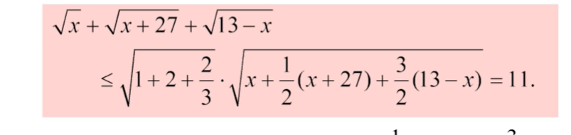

# 预备知识

- 参考教材：陈纪修、裴礼文

## 集合

- **元素分析法**：证明集合 $A$ 中元素均具有性质 $P$ 时，一般是任取 $A$ 中元素 $a$，证明其具有性质 $P$，这样由任意性就能证明 $A$ 中元素均有性质 $P$。这种方法称为元素分析法
- **互包法**：
  - 证明 $A = B$ 时，一般都是分别证明 $A\leq B、B\leq A$
  - 证明 $A$ 是 $B$ 的充要条件时，一般都是分别证明 $A$ 是 $B$ 的充分条件和必要条件
  - 上面这种方法称为互包法

### 集合的运算律

- **交换律**
- **结合律**
- **分配律**
  - **扩缩理解**：
    - 我们不妨将“交”视为“集合的缩小”，“并”视为“集合的扩大”
    - 这时我们看 $ (A \cup B)\cap(A \cup D)$，其中A是重复的，所以取交时不缩也不扩，而B和D在取交时都会缩小
    - 再看 $A \cup (B \cap D)$，它相当于是把重复的A给省略了，表示取交时只有B和D会缩小。即上面两式的结果相等
  - **本质**：实际上，满足分配律的运算都可看作同一运算的复杂写法和简化写法，比如代数的因式分解、集合的分配律等
- **对偶律**：$(A \cup B)^C = A^C \cap B^C，(A \cap B)^C = A^C \cup B^C$
  - **扩缩理解**：补表示取反。即原来是扩的运算，再取补就会变成缩。

### 可列性

- **可列集**：和自然数集 $\N$ 存在双射的集合
  - 实际上就是该集合是否可以通过自然数来表达，“可列”列出的序号就是自然数
- **实例**：
  - 有理数集 $\Q$ 可列，因为分子和分母都是自然数，它几乎等价于二元自然数集合 $(\N,\N)$（以此类推，即使是n维组合（笛卡尔积），只要是自然数依次组成的，都是可列集）
- **排列方法**：
  - **对角线排列（Cauchy乘积）**：纵横序号i+j的和固定
  - **正方形排列**：i和j依次递增
- **反例**：实数集 $\R$ 是不可列集，因为存在不可以用有限个自然数表示的无理数（详见实变函数）

## 映射

- 映射的严格定义详见拓扑学
- **函数 $y = f(x)$**：函数的定义域和陪域必须是数集
  - **定义域**
  - **陪域**
  - **值域**
  - **自变量**：
  - **因变量**：
  - 函数和因变量不是一个东西
    - $f$ 指的是一种对应关系，它并没有具体的值
    - $f(x)$ 指的是（变化规律）符合（变量 $x$ 在 $f$ 下的对应规律）的一个变量，这里将其写为 $y$。
- **复合函数** $f\circ g:X\rightarrow Y，x \mapsto y=f(x)$

## 常用不等式

### 三角不等式

- **三角不等式**：设 $\cdot$ 是集合 $A$ 上的运算，$f$ 是以 $A$ 为定义域的函数，则形如 $f(x\cdot y) \leq f(x) \cdot f(y)$ 的不等式都可称为三角不等式
  - **实数三角不等式**：$|x+y| \leq |x| + |y|$
    - **距离理解**：要么正数，要么负数，要么相加要么相消。
    - **矢量三角形理解**：分解成垂直向量的话，只可能有制约或直接相加，不可能有增益。
  - **向量三角不等式**：$(\a+\b,\a+\b) \leq (\a,\a)+(\b,\b)$
- **$n$ 维三角不等式**：
  - 使用均值不等式证明

### 均值不等式

- **柯西不等式**：
- **均值不等式**：$\cfrac{a_1+a_2+...+a_n}{n} \geq \sqrt[n]{a_1a_2...a_n} \geq \cfrac{n}{(\frac{1}{a_1}+\frac{1}{a_2}+...\frac{1}{a_n})} $ 
  - **归纳法证明**：
    - 当 $ n = 2^k $ 时，连环使用基本不等式即可
      - $\frac{(a+b)+(c+d)}{4} \geq \frac{\sqrt{ab}+\sqrt{cd}}{2} \geq \sqrt[4]{abcd}$
      - $\cdots$
    - 当 $ n \neq 2^k$ 时
      - **左侧不等式**：记 $ \sqrt[n]{a_1a_2...a_n} = \bar{a} $，然后在两边添项 $(2^l-n)\ol a$，补全成 $n = 2^k$  的形式后。应用均值不等式即可
      - **右侧不等式**：对 $\dfrac{1}{a_i}$ 应用均值不等式，即可得到右边的不等号
  - **拉格朗日乘子法证明**

## 实数的定义

- **代数定义法**：详见[拓扑学的朴素集合论]
- **切割定义法**：使用Dedekind分割来定义实数
- **Dedekind分割**：设 $\Q = A\cup B$，若 $\forall a\in A，b\in B$ 有 $a<b$，则称 $A/B$ 为 $\Q$ 的一个切割
  - **单端点性**：不可能 $A$ 有最大数 $a_0$ 且 $B$ 有最小数 $b_0$，否则 $\dfrac{a_0+b_0}{2}\in\Q$ 但不属于 $A,B$，矛盾
  - **无理数**：若 $A$ 无最大数，$B$ 无最小数，则称 $C = \{c\in\R\mid A<c<B\}$ 为该切割确定的数
    - **唯一性**：该集合 $C$ 只有一个元素
      - **证明**：反设 $c_1<c_2$ 都在该集合中，则由有理数稠密性，存在 $q\in (c_1,c_2)$，与 $C$ 定义矛盾
  - **实数**：所有切割 $A/B$ 确定的数和 $\Q$ 共同组成的集合称为 $\R$
- **Dedekind切割定理**：实数集的切割 $\ol A/\ol B$ 中，要么 $\ol A$ 有最大数 $a_0$，要么 $\ol B$ 有最小数 $b_0$
  - **证明**：
    - 取 $A = \ol A\cap \Q，B = \ol B\cap \Q$。易得它们构成 $\Q$ 的切割
    - **第一种情况**： $ \exist a \in A $ 是最大值，要证 $ a $ 也是 $ \ol{A} $ 的最大值
      - 反设 $a $ 不是 $ \ol{A} $ 的最大值，则存在无理数 $a_0 \in \ol{A} > a $ ，但由有理数稠密性，$a$ 和 $a_0$ 之间有无穷多个有理数，与 $a$ 是 $A$ 的最大值矛盾
    - **第二种情况**：$A/B$ 确定了一个无理数 $c$，要证 $c$ 是 $\ol{A}$ 或 $\ol{B} $ 的最值
      1. 若两集合都不是最值，则与有理数切割的单端点性矛盾
      2. 若两集合都是最值，则与有理数切割定义中两集合的大小关系矛盾
      3. 或者说，再在有理数和实数之间构造矛盾点。

## 实数子集的确界

- **实数子集的上界**：若 $\exist M\in \R$，使得 $\forall x\in S$ 都有 $x\leq M$，则 $M$ 是 $S$ 的上界
- **实数子集的上确界**：设 $\b$ 是 $S$ 的上界。若 $\forall \e>0，\exist x\in S$ 都有 $x>\b-\e$，则 $\b$ 是 $S$ 的上确界

### 判断确界是否含于集合

- 证明 $\{x\mid 0\leq x < 1\}$ 没有最大数
  - **构造平均值法**
    - 设 $\beta$ 是最大数，然后上确界 $n$ 与 $\beta$ 的平均值 $\dfrac{\beta+n}{2} > \beta $，发生矛盾
- 设 $T=\{x\in \Q\mid x>0,x^2<2\}$，证明 $T$ 在 $\Q$ 内没有上确界
  - **放缩法**：
    - 反设 $\dfrac{n}{m}$ 是 $T$ 中最大数
    - 易得 $1<\dfrac{n}{m}<2 $，若 $\exist r>0$ 使得 $(\dfrac{n}{m}+r)^2<2$，则可得到矛盾
      - （实际上可以跳过下面的思考过程，直接换成更简便的形式  $ [(k+1)\dfrac{n}{m}]^2<2$）
      - 为了统一左式的形式，设 $r = k\dfrac{n}{m} \quad (k\in \Q)$，则左式变为 $(k+1)^2(\dfrac{n}{m})^2 < 2$ 
      - 移项后换元简化，设 $ 2-(\dfrac{n}{m})^2=a > 0$，则等式可变形为 $ k<\sqrt{\dfrac{2}{2-a}} $ ，由有理数稠密性，存在 $k\in \Q$ 符合条件
    - 同理易得 $2<\dfrac{n}{m}<3 $ ，同样方法证明即可
  - **理解**：通过换元和移项等变形，把不等式的一端化 $0$，就可以通过简单地判定符号来简化问题（比如本题中的 $x^2$

### 确界存在性

- **确界存在定理**：$\R$ 中的非空有界集合必有上确界（在拓扑学的朴素集合论中的实数连续统会进一步介绍）
- **级数证明法**：
  - 设 $[x]$ 表示实数的整数部分，$(x)$ 表示实数的小数部分
  - 设集列 $S_n$ 为 $\{a_0+0.a_1a_2...a_n \mid a_0=[x]，0.a_1a_2\dots a_n=(x),\ x\in S\} $ 
  - 设集列 $S_k$ 为 $\{x\in S_{k-1}\mid x的第k位小数为\alpha_k\}$
    - 无穷个有规律的集合构成一个级数 $ \{S_n\} $ ，，引出极限数n
  - 此时 $\b = 0.a_1a_2...a_n...$  就是上确界。通过定义验证即可
    -  $\beta $ 是上界： $ \forall S_m < \beta$
    -  $\beta $ 是确界：由于 $\e$ 是给定的数，故存在 $\dfrac{1}{10^{n_0}} < \e$，从而取 $x_0\in S_{n_0}$ 就有 $\beta - x_0 =  \dfrac{1}{10^{n_0}} < \epsilon$
    - （小数位的相似用法：推导无限循环小数的分数形式）0.3333... = 1/3
  - **本质**：
- **Dedekind切割证明法**：
  - 任取实数集 $P$，设其上界集合为 $T$，$T$ 关于的补集为 $S$。则 $T$ 和 $S$ 构成实数集切割
  - 由Dedekind切割定理，$T$ 或 $S$ 有最值。
    - 若 $T$ 有最小值，则该值就是上确界
    - 若 $S$ 有最大值：
    - **反证法**：设 $a$ 是 $S$ 的最大值
      - 由S定义得，a不是P的上界 $\LR$ $S$ 中存在 $a_0>a$
      - 由切割定义得，若 $ a_0 > S$，则 $a_0 \in T \red\Rightarrow a_0$ 是P的上界 $\red\Rightarrow a_0$ 是P的上确界
      - 由实数的稠密性得，只要构造平均值矛盾，就能发现  $ a_0 $  不唯一，则P的上确界不唯一，与上确界定义矛盾。**证毕**
    - **正证法（平均值矛盾法）**：
      - 任取 $x \in S$，则由S定义得，x不是P的上界 $\LR \exist x_0 \in P>x $ 
      - （构造平均值矛盾）设 $ x' = \dfrac{x+x_0}{2} $ ，则 $x'< x_0$，其也不是P的上界 $\red\Rt x'\in S $ 
      - 由 $ x'>x $ ，得 $x$ 不是 $S$ 的最大值。再由 $x$ 的任意性，得 $S$ 不存在最大值（**证毕**）
    - 这两个方法实际上是一样的

## 实数系的连续性

- **稠密性**：若任意长度的区间上都有无穷多个对应点，则称实数子集具有稠密性
- **连续性**：若任意实数在实轴上都有对应点，且任意对应点都唯一对应一个实数，则称实数子集具有连续性（详细的还是看[实变函数]吧）
- **实数的六大定理**：
  - **确界存在定理**：确界定义中就设出了 $ \epsilon $ 
     - 应用：对*单调区间*赋予明确意义后
  - **单调有界数列收敛定理**（确界存在定理的极限形式）：通过收敛引出 $ \epsilon $ （收敛于一个确界）
  - **闭区间套定理**：通过收敛引出 $ \epsilon $ （区间收敛于一个点）
     - 应用：对
  - **Cauchy收敛定理**：通过收敛引出 $ \epsilon $ （收敛于未知的点）
  - **Heine-Borel有限覆盖定理**：“开”覆盖大小任意性  $ \to $  引出 $ \epsilon \qquad $ 开覆盖数量有限性  $ \to $   $ \epsilon \neq 0 \qquad $  开覆盖的覆盖性：“一致”性
  - **Bolzano-Weierstrass定理（凝聚定理）**：通过收敛引出 $ \epsilon $ （点列收敛于一个值）
     - 任何数列都有单调或相等的子列，可以用单调有界数列证明B-W定理
  - 实际上有的书认为是八大定理
    - **聚点定理**：设 $A$ 是 $\R^n$ 上的有界无穷点集，则 $A$ 中至少有一个 $A$ 的聚点
    - **Dedekind分割定理**

### 单调有界数列收敛定理

- $\R$ 上的单调有界数列必然收敛
  - **证明**：设 $\{x_n\}$ 单调递增，存在上界
    - 则由确界存在定理，其有上确界 $x_0$
    - 由上确界定义，$\forall \e>0，\exist N$ 使得 $x_0-x_N < \e$
    - 再由单调递增性，$\forall n>N$ 都有 $|x_0-x_n| < \e$
    - 显然其符合数列极限的定义，从而 $\{x_n\}$ 收敛于 $x_0$

## Heine-Borel有限覆盖定理

- **开覆盖**：一族开区间 $A_n = \{(a_n,b_n)\}_{n=1}$，它们的并若包含集合 $A$，则称 $A_n$ 是 $A$ 的开覆盖
- **有限覆盖定理**：设 $H$ 是闭区间 $[a,b]$ 的一个开覆盖（开区间数量未知），则必定可以从 $H$ 中选择有限个开区间 $H_n$，使得 $H_n$ 也是 $[a,b]$ 的开覆盖
  - “无限”必须有某种章法，比如级数（向 $ \frac{1}{n} $ 这种，具有明确的阶数的）
  - **理解**：
    - 以闭区间 $[0,1]$ 为例，若取 $A_n = (0,\frac{1}{n})$，则它们不能覆盖端点0。所以 $A_n$ 中必定存在某个开区间 $(a,b)$ **向左越过了0，进入了负半轴**，即 $a<0$
    - 由于右端点 $\frac{1}{n}$ 在 $0$ 附近是稠密的，所以 $(a,b)$ 包含有无限个开区间 $(0,\frac{1}{n})\pad (n\to\infty)$，可以用它来代替这无限个区间，然后我们发现，剩下的其它开区间就只有有限个了。
  - **证明**：上面给出了一个具体的情况。但是我们发现，任意闭区间都可以通过连续映射来变为 $[0,1]$，然后由连续映射的性质，就可以把这个结论推广到任意闭区间和任意开覆盖。但是比较麻烦。所以官方给出的方法是勒贝格方法
    - 若开覆盖存在无界区间，则容易发现有限开覆盖。故只讨论开覆盖均为有限区间的情况
    - 容易发现，我们只需要讨论开覆盖中一个端点在闭区间内，另一个端点在闭区间外的开区间是否有限即可
      - 对于两端点都在闭区间外的开区间，显然此时取它一个就能构成有限开覆盖
      - 对于两端点都在闭区间内的开区间，其数量是否有限的问题，本质是一个更小闭区间的有限覆盖问题。因此证明了本题就相当于证明了该情况
    - 再容易发现，我们只需要讨论左端点在闭区间外，右端点在闭区间内的开区间是否有限即可
    - 此时开覆盖的所有右端点是闭区间上的有界数列 $x_n$，由凝聚定理，其收敛于一个数 $\xi\in [a,b]$
      - 如果 $\xi$ 是闭区间端点或在闭区间内，则由收敛的定义，则必定存在一个包含 $ \zeta $ 的开区间。由于其大小为有界量，则其包含无穷个收敛区间端点 $ x_n $ ，然后利用这个开区间和无限个区间中最大的那个区间代替这无限个区间即可
  - **证明（确界存在定理 + 闭区间套定理）**：
    - 对于左端点在闭区间外，右端点闭区间内的开区间，由确界存在定理，其右端点存在上确界 $a_1$，同理另一边左端点存在下确界 $b_2$
      - 由覆盖性，开覆盖中必定存在以 $a_1,b_1$ 为端点的开区间
      - 由开区间性，$a < a_1 < b_1 < b$
      - 则此时问题转化为 $[a_1,b_1]$ 的有限覆盖问题
    - 不断进行下去，由闭区间套定理，最终 $[a_n,b_n]$ 收缩到一个点 $\xi$
    - 由覆盖性，必定存在一个 $(a_0,b_0)$ 包含 $\xi$，但由收敛性，存在 $N>0$ 使得 $\forall n>N$，$[a_n,b_n]\subset [a_0,b_0]$，故开覆盖最多只能有 $2N$ 个
      <!-- （错的，无限开覆盖可以没有最小长度）再由开覆盖开集性，其中必定存在区间长度的最小值 $\d$
      - 由收敛定义，存在 $N>0$ 使得 $N$ 之后的 $[a_n,b_n]$ 长度小于 $\d$，故这样找到的开覆盖最多有 $2N$ 个 -->

## 习题

- 证明 $\sqrt{6}$ 不是有理数
  - **证明1**：反设 $\sqrt{6}$ 是有理数 $\dfrac{n}{m}$（其中n和m互素）。接下来证明它们不互质，从而构成矛盾
    - 此时 $n^2 = 6m^2$，即 $6\mid n^2$
    - 又因为 $\sqrt{2}$ 和 $\sqrt{3}$ 不是有理数，而 $6$ 的唯一分解为 $2×3$（n是整数）
    - 所以 $6\mid n$（n是偶数）
    - 由于 $n$ 和 $m$ 互素，故 $6$ 与 $m$ 互素，即 $m$ 是奇数
    - 再由于 $36\mid n^2$，则 $6\mid m$，矛盾
  - **证明2**：以上其实是错误的证明方法，$\sqrt{2}和\sqrt{3}是无理数的条件是循环论证 $ 
    - 由于 $6\mid n^2$，而 $n$ 是整数，所以 $n$ 必须是偶数，从而 $4\mid n^2$
    - 再由 $m^2 = \dfrac{n^2}{6}$ 得 $2\mid m^2$，即 $m$ 也是偶数，不是既约分数，矛盾 $ 
    - 这里主要是利用了6的因子只有一个2，可以和平方构成矛盾
- 寻找集合的最大数和最小数
  - **实例**：$C=\{\dfrac{n}{m}\mid m,n\in \N^+ 且n < m \}$
  - **解**：没有最大数和最小数
    - 最大数：$\forall m,n \in N^+$ ，有 $\frac{m+1}{n+1} > \frac{m}{n}$（糖水定理）
  - 最小数同理 
- A、B是两个有界集，证明它们的衍生集也是有界集
  - **证明**：元素分析法

### 习题

- 不等式
  - 