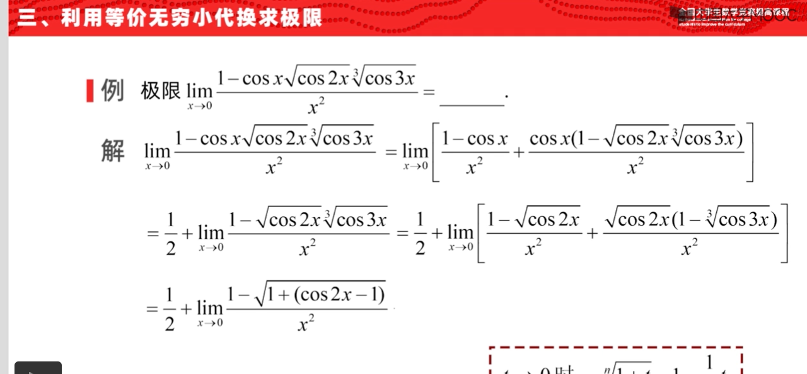

# 裴礼文 + 李扬（极限）

## 极限的性质

### 集合性质

- **伪Riemann数列定理**：
  - 设非零数列 $a_n\to 0$，$P = \set{ka_i\mid k\in\Z，i\in\N}$
  - 则对任意实数 $b$，都存在 $b_n\subset P$ 使得 $b_n\to b$
  - **证明**：
    - **构造法**：
      - 等价于取整数列 $c_n$ 和子列 $a_{n_k}$ 使得 $c_na_{n_k}\to b$
      - 取 $c_n = [\dfrac{b}{a_n}]$，则此时 $c_na_n = \begin{cases} b, & \dfrac{b}{a_n} \in\Z \\ b-a_n, & \dfrac{b}{a_n}\notin \Z \end{cases}$，符合题意
    - **$\e-\d$ 法**：
      - 易得 $\forall n\in\Z,b\in\R$，都 $\exist k\in\Z$ 使得 $|b-ka_n| \leq |a_n|$
      - 再由 $\forall \e，\exist N$ 使得 $|a_N|<\e$
      - 此时存在依赖关系 $\e\xto{决定} N\xto{决定} k$，取对应的 $k$ 为 $k_n$，即得 $b_n = k_na_n\to b$
- **乱序数列**：设 $f:\N\to \N，f(m) = n$
  - 若 $\forall n\in \N$，$f^{-1}(n)$ 为有限集
  - 则 $\lim\limits_{n\to\infty} a_n = a \red\Rt \lim\limits_{n\to\infty} a_{f(m)} = a$
  - 本质：$f$ 仅将有限个数映射为同一值，故 $m\to\infty$ 时，$f(m)$ 必定是无界量
  - **证明**：
    - 由极限定义，可得 $$\forall \e>0，\exist N_0 > 0，\forall n>N_0，有 |a_n-a| < \e$$
    - 反设 $\lim\limits_{n\to\infty} a_{f(m)}$ 不存在，则此时 $$\exist \e_0，\forall m>0，\exist m_0 > m ，使得 |a_{f(m_0)}-a| > \e_0 $$
      - 即使得 $f(m_0) \leq N_0$ 的 $m_0$ 有无穷多个
    - 再由于 $f^{-1}$ 有限，故 $\sup\limits_{所有满足条件的f}\set{ 不同 f^{-1}(m)的个数\mid 0\leq m\leq N_0}$ 是有限值，可设为 $M$
      - 则 $m_0$ 最多有 $M(N_0+1)$ 个，与其无穷多矛盾

### 收敛性质

- **隔项收敛定理**：若 $x_n-x_{n-2}\to 0$，则 $\lim\limits_{n\to\infty} \dfrac{x_n-x_{n-1}}{n} = 0$
  - **证明**：
    - 题设条件等价于奇项子列和偶项子列均收敛，证明奇偶项差值小于 $n$
    - 由C收敛定理易得可设 $x_{2n-1}\to A_1$，$x_{2n}\to A_2$，从而结论显然
- **子列单调定理**：任意数列均存在一个单调子列（不一定严格）
  - **证明**：
    - 若存在（不严格递增子列），则问题已经解决
    - 若不存在（不严格递增子列），则由定义，$\exist n_1，\forall n>n_1$ 恒有 $x_n<x_{n_1}$
      - 再由于 $\{x_n\}_{n>n_1}$ 中也无递增子列，故还可以取到 $n_2$ 使得 $\forall n>n_2$ 有 $x_n < x_{n_2}$
      - 不断进行下去，即得严格递减子列
    <!-- - 若数列无界，则显然成立
    - （错误的）若数列有界，则由凝聚定理，其存在收敛子列，设极限为 $A$
      - 对数列值域取二分闭区间套 $[a,\dfrac{a+b}{2}]，[\dfrac{a+b}{2},b]$，选定有无穷多项的那一侧（不妨设为 $[a,\dfrac{a+b}{2}]$），取其中一项 $d_1$
      - 然后以 $d_1$ 为中点，取二分闭区间套 $[d_1,\dfrac{a+b}{2}]，[d_1-(\dfrac{a+b}{2}-d_1),d_1]$，易得必定是 $[]$ -->
- **错题**：设 $0\leq x_{n+1} \leq x_n + y_n$，若 $\lim\limits_{n\to\infty} \sum\limits^n_{k=1} y_k < +\infty$，则 $x_n$ 收敛
  - **证明（错的，其实这题很简单，不需要分类讨论）**：
    - 若 $x_n$ 单减，由于其有下界 $0$，故收敛
    - 若 $x_n$ 单增，则 $x_{n+1}-x_1 \leq \sum\limits^n_{k=1} y_k$ 有上界，故收敛
    - 若 $x_n$ 不单调，则其存在单减子列，再由非负性，得有下界 $0$，从而任意单减子列均收敛
      - 再由C收敛定理，若数列的任意单减和单增子列均收敛，则其必然收敛
  - **证明**：由C收敛原理易得结论

### 二级结论

- 若 $\lim\limits_{n\to\infty} a_{kn+i} = m_i$，则 $\lim\limits_{n\to\infty} \dfrac{a_1+... + a_n}{n} = \dfrac{m_0 + ... + m_{k-1}}{k}$
- 黎曼函数的极限处处为0
  - **证明**：本质就是证明黎曼函数连续性的方法，一摸一样……
    - 有理点处，不妨设为 $x_0 = \dfrac{p}{q}$，将邻域半径初步放缩为 $\d < \dfrac{1}{N}$。则在该邻域中
      - 若 $x-x_0$ 为无理点，则 $x$ 也为无理点，从而 $R(x) = 0$
      - 若 $x-x_0$ 为有理点，设为 $\dfrac{r}{n}$，则必定有 $n>N$，从而 $x = \cfrac{p\frac{[q,N]}{q}-r\frac{[q,N]}{N}}{[q,N]}$，即 $R(x) = \dfrac{1}{[q,N]}$。取 $N$ 足够大即有 $R(x) < \e$
        - 中括号表示最小公倍数
    - 无理点处，
      - 若 $x$ 为无理点，则已有 $R(x) = 0$
      - 若 $x$ 为有理点，则取 $[0,1]$ 的 $N$ 个均等划分，则 $x_0$ 必定位于某个区间内，设为 $(\dfrac{N_1}{N},\dfrac{N_1+1}{N})$，显然里面分母比 $N$ 小的点至多有限。我们取定 $N = [\dfrac{1}{\e}] + 1$，再放缩邻域使得其中不含分母比 $N$ 小的点即可
  - **推论**：$[0,1]$ 上两两不相交的有限集列 $A_n$，以其为支集定义函数 $f(x) = \dfrac{1}{n} \pad (x\in A_n)$，则函数极限处处为 $0$
    - **证明**：
      - 易得 $I = \mathop{\bigcup}\limits^\infty_{n=1} A_n$ 是可数集
      - 若 $x_0\notin I$，则任意邻域内使得函数值有界的点至多有限。模仿上面证明即可
      - 若 $x_0\in I$，同上
- **奇葩函数的阶数估计式**：
  - $x^x = 1+(\ln x)x+\dfrac{(\ln x)^2}{2!}x^2+\dfrac{\ln x^3}{3!}x^3+\cdots$
    - **证明**：
      - 易得 $x^x = e^{x\ln x}$，再对 $e^u$ 泰勒展开即可
      - 它不是泰勒展开式，因为系数不是常数，而是 $x$ 的函数。但在求相关极限时非常有用
  - $(1+x)^{\dfrac{1}{x}} = e - \dfrac{e}{2}x + \dfrac{11e}{24}x^2 - \dfrac{7e}{16}x^3 + \cdots$
    - **证明（只展开到前三项即可）**：
      - 易得 $(1+x)^{\dfrac{1}{x}}-e = e(e^{\dfrac{\ln(1+x)}{x}-1}-1)$
      - 将 $\dfrac{\ln(x+1)}{x}$ 泰勒展开得 $e(e^{-\large\frac{x}{2} + \frac{x^2}{3} - \frac{x^3}{4} + \cdots} - 1)$
      - 将 $e^u$ 泰勒展开得 $e\Big[ u+\dfrac{u^2}{2}+\dfrac{u^3}{6}+\cdots \Big]$
      - 再将 $u = \large -\frac{x}{2} + \frac{x^2}{3} - \frac{x^3}{4}$ 代入即可
      - 这个方法其实在导数章节也写过，没啥难的

## 定义法求极限

###  放缩法

- 定义法的核心是取合适的 $\d(\e)$ 使得 $|x_n-A| < \e$。
- **重要公式**：$\sum\limits^n_{k=1} k^3 = (\sum\limits^n_{k=1}k)^2$
  - **证明1**：数学归纳法即可
  - **证明2**：见第一章习题
- **极限定义法复习**：$\lim\limits_{n\to\infty} \sqrt[n]{x^n+1} = x$
  - **证明（定义法）**：
    - 易得 $|\sqrt[n]{x^n+1}-x| = \cfrac{(x^{n}+1)-x^n}{x^{n-1}(x^n+1)^{\frac{1}{n}} + \cdots + x(x^n+1)^{\frac{n-1}{n}}} < \cfrac{1}{x^{n-1}(x^n+1)^{\frac{1}{n}}}$
    - 易得该式 $<\dfrac{1}{x^{n-1}}$，要使其 $<\e$，只需 $n>[ \log_x \dfrac{1}{\e} + 1 ]$ 即可
- **重要不等式**：
  - $(x-1)^n < x^k-1 \quad (x,n\to +\infty)$
    - **证明**： 求导
  - **伯努利不等式**：设 $x>-1$，则 $(1+x)^\a \geq 1+\a x\pad (\a \geq 1)$，其它情况相反
    - **证明**：求导

### 递推法

- 设 $f:(0,+\infty)\to (0,+\infty)$ 单增，$\lim\limits_{t\to\infty} \dfrac{f(2t)}{f(t)} = 1$，则对任意 $$
  没事就把考研过程中的所有解答抄下来吧，不然挺可惜的
- 设 $f$ 在 $\R$ 上有定义，$0$ 附近有界，$f(ax) = bf(x)，(a>1,b>1)$，则 $\lim\limits_{x\to 0} f(x) = 0$
  - **证明**：
    - 易得 $f(0) = 0$
    - 由有界性，设 $|f(x)| \leq M$，则 $|f(\dfrac{x}{a^n})| \leq |\dfrac{M}{b^n}|\to 0$
    - 再选取合适的 $N$ 用定义证明即可

### 拟合法

- **拟合法**：其中对 $A$ 进行变形，使得不等式得到简化，这种方法称为拟合法
- **拟合定理**：若恒有 $\sum\limits^\infty_{k=1} a_k = a，f(x)\sim x$，则 $\sum\limits^\infty_{k=1} f(a_k) = a$
  - **证明**：
    - 首先将 $a$ 化为 $\sum\limits^n_{k=1} a_k + \e$
    - 由三角不等式，$|\sum\limits^n_{k=1}f(a_k)-\sum\limits^n_{k=1}a_k| \leq \sum\limits^n_{k=1} |f(a_k)-a_k| < o(na_k)$
    - 再由 $a_k$ 级数收敛性得 $a_k = o(\dfrac{1}{n})$，从而得到结论
  - 这实际上是一个级数收敛问题，在后面数项级数里非常有用
- 设 $\lim\limits_{n\to\infty} a_n = a$，则 $\lim\limits_{n\to\infty} \dfrac{\sum\limits^n_{k=0} C_n^ka_k}{2^n} = a$
  - **证明（放缩法）**：设 $b_k = C^k_n$，则原式等价于 $\lim\limits_{n\to\infty} \dfrac{b_1a_1 + ... + b_na_n}{b_1+...+b_n} = a$
    - 再由于 $\sum\limits^n_{k=1} b_k = 2^n$，故 $\cfrac{b_n}{\sum\limits^n_{k=1} b_k} \to 0$，由前面结论即可
  - **证明（拟合法）**：

### 夹逼法

- 数列夹逼函数
- 函数夹逼数列
- 特殊不等式：$\lim\limits_{n\to\infty} \cfrac{1\cdot 3\cdot 5... (2n-1)}{2\cdot 4\cdot 6... (2n)}$
  - **解**：
    - 应用 $2k > \sqrt{(2k-1)(2k+1)}$ 即可
- 夹逼法与其它方法的混用：$\lim\limits_{x\to 0} \sqrt[\large x]{\dfrac{a_1^x + ... + a_n^x}{n}}$
  - **解（归纳法）**：对 $n=2$ 的情况，二项式定理 + 数列夹逼容易证明，或化为 $e^{f(x)}$ 的形式来证明
  - **解（夹逼法）**：
    - 由均值不等式，该式 $\geq \sqrt[n]{a_1...a_n} \to 0$
    - 由
  - **解（洛必达法则）**：取对数后洛必达即可

### Stolz法

- 设 $\lim\limits_{n\to\infty} \dfrac{a_{2n}}{2n} = a，\lim\limits_{n\to\infty}\dfrac{a_{2n+1}}{2n+1} = b$，则 $\lim\limits_{n\to\infty}\dfrac{a_1+a_2+...+a_n}{1+2+...+n} = \dfrac{a+b}{2}$
  - **证明**：分离奇数项和偶数项，分别用Stolz公式，然后极限相加即可

### 阶数估计法

- 求 $\sqrt[n]{n}-1$ 的无穷小阶数
  - **解**：
    - 不妨取为更加灵活的函数极限 $\lim\limits_{x\to+\infty}(x)^{\dfrac{1}{x}} -1$
    - 它等价于 $\lim\limits_{x\to +\infty} e^{\dfrac{\ln x}{x}}-1$，由于 $\lim\limits_{x\to +\infty}\dfrac{\ln x}{x} = 0$，故由 $e^x-1\sim x(x\to 0)$ 即得 $\sqrt[n]{n}-1 \sim \dfrac{\ln n}{n}$
- **应用**：求 $\lim\limits_{n\to\infty} \Big( \cfrac{\sqrt[n]{a}+\sqrt[n]{b}}{2} \Big)^n$
  - **解**：
    - 配凑指数函数得 $\to e^{\large n(\frac{\sqrt[n]{a}+\sqrt[n]{b}}{2}-1)}$
    - 再由上面得出的结论，$\to e^{\dfrac{1}{2}(\ln a+\ln b)} = \sqrt{ab}$

### 简化证明

- **邻域法**：邻域列实际上只是一个工具，但邻域列可以简化很多极限问题。到了欧氏空间那里会更加体会到这一点，到了拓扑学中就只有邻域列没有点列了。
- 若 $n<m$ 时总有 $|x_n-x_m| > \dfrac{1}{n}$，则 $x_n$ 无界
  - 结论是很显然的，但要严格证明需要分类讨论，很麻烦。若使用邻域工具，则可以把多种分类方式归一，从而简化证明
  - 其实邻域本质和三角不等式一样，都是将正向和负向的两种向量关系归一化为模的关系
  - **证明**：
    - 对 $x_1$ 有 $O_1(x_1,1)$，此时后面的项均在该邻域外
    - 同理对 $x_k$ 有 $O_k(x_k,\dfrac{1}{k})$，此时后面的项均在该邻域外
    - 综上，我们得到邻域列 $O_n$，其中后项的中心点均不在前项里，由调和级数无界即得 $x_n$ 无界

## 其它法求极限

- **部分泰勒展开法**：$\lim\limits_{n\to\infty} n\sin(2\pi n!e)$
  - **解**：将 $e$ 泰勒展开，发现只有最后两项可保留，即变为 $\lim\limits_{n\to\infty} n\sin\Big[ \dfrac{2\pi}{n+1} + \dfrac{2\pi e^{\t_n}}{(n+1)(n+2)} \Big]$，结论易得
- **连续函数法**：$\lim\limits_{n\to\infty} \sin^2\Big[ \pi\sqrt{n^2+n} \Big]$
  - **解**：
    - 易得 $\sin\Big[ \pi\sqrt{n^2+n} \Big] = \sin\Big[ (\sqrt{n^2+n}-n)\pi \Big]\cos n\pi \\ = \pm\sin \Big[ \pi\sqrt{n^2+n}-n \Big]\pi$
    - 再由 $\lim\limits_{n\to\infty} \sqrt{n^2+n}-n = \dfrac{1}{2}$，故原式 $\to \sin^2\dfrac{\pi}{2} = 1$
- **连续函数法**：
  - $\lim\limits_{x\to 0} f(x) = a，g(x) = a，且f(x) \neq g(x)$，求$\lim\limits_{x\to 0} \dfrac{f(x)^{g(x)} - g(x)^{g(x)}}{f(x)-g(x)}$
    - 分离$g(x)^{g(x)}$，得到等价量$(1+x)^a-1$
<!-- - 一眼泰勒
  - $\large\lim\limits_{x\to 0} \dfrac{sin^2x- x^2cos^2x}{x^2sin^2x} = \dfrac{(sinx+xcosx)(sinx-xcosx)}{x^4} = \dfrac{sinx+xcosx}{x} · \dfrac{sinx-xcosx}{x^3}$ -->
- **裂项法**：
  - $x_n = \sum\limits^n_{k = 1} \dfrac{k}{(k+1)!} = \sum\dfrac{1}{k!} - \dfrac{1}{(k+1)!}$
  - 
<!-- - 放缩（裴礼文一堆这种题，见怪不怪了）
  - $\lim\limits_{x\to +\infty} \sqrt[3]{x} \int^{x+1}_x \dfrac{sint}{\sqrt{t+cost}}dt$
    - 先加绝对值，放缩掉$|sin| = 1$。再放缩掉$cost = -1$。简化积分为根式形式
    - （前提是你知道结果为0） -->
- **发动机组**：
  - $a_n = \cos\dfrac{\theta}{2}\cos\dfrac{\theta}{2^2}...\cos\dfrac{\t}{2^n}$
    - **解**：两边同时乘一个 $\sin\dfrac{\t}{2^n}$ 即可
  - $a_n = \dis\frac{3}{2}\cdot\frac{5}{4}\cdot\frac{17}{16}\cdots\frac{2^{2^n}+1}{2^{2^n}}$
    - **解**：两边同时乘一个 $(1-\dfrac{1}{2})$ 即可

### 收敛准则法

- **二叉压缩映射**：设 $x_0\in (1,\dfrac{3}{2})，\begin{cases} x_1 = x_0^2 \\ x_{n+1} = \sqrt{x_n} + \dfrac{x_{n-1}}{2} \end{cases}$，证明收敛并求极限
  - **解**：
    - 易得极限只能为 $4$
    - $|x_n-4| = |\sqrt{x_{n-1}}-2 + \dfrac{x_{n-2}-4}{2}| = |\dfrac{x_{n-1}-4}{\sqrt{x_{n-1}}+2} + \dfrac{x_{n-2}-4}{2}| \\ \leq \dfrac{1}{2}\Big( |x_{n-1}-4| + |x_{n-2}-4| \Big)$
    - 还是那一套放缩思想，即尽量往相同形式放缩
    - 压缩映射递推即得结论
- **循环开根**：
  - $a_{n+1} = \sqrt{a_n + c} \pad (c>0)$ 收敛
    - **证明**：
      - 易得单增，且方程 $\D = \sqrt{\D + c}$ 有解。易得该解即为上界，从而收敛
  - $a_{n+1} = \sqrt{a_n + n}$ 收敛
    - **证明**：
      - 易得单增，再由于 $n < 2^{2^n}$，放缩即得有上界

### 子列法

<!-- - **有理数与无理数的错位性**：$\lim\limits_{n\to\infty}\sin n$ 不存在
  - **证明**：证明很简单，是我草率了
    - 易得不可能存在 $n,m\in \N，k\in\Q$ 使得 $n-m = k\pi$
  - 类似实变函数的Vitali不可测集 -->

### 微分法

- 微分中值定理
- 洛必达法则
- Stolz法
- 泰勒展开法

### 积分法

- 利用定积分定义
- $A_n = \sum\limits^n_{k=1} \dfrac{n}{n^2+k^2}，求\lim\limits_{n\to \infty} n(\dfrac{\pi}{4}-A_n)$
  - **解**：$$

#### 齐次函数的夹逼

- **齐次夹逼积分定理**：设 $f(x)$ 在零点附近可微，$f(0) = 0，f'(0) = a$，则 $\forall p\in \N^+$ 都有 $$\lim_{n\to\infty}\sum^n_{k=1} f(\frac{k^p}{n^{p+1}}) = \frac{a}{p+1}$$
  - **证明**：
    - 易得 $\lim\limits_{x\to 0}\dfrac{f(x)}{x} = f'(0) = a$（**核心**）
    - 再已知 $\dis\lim\limits_{n\to\infty} \sum\limits^n_{k=1} \frac{k^p}{n^{p+1}} = \int^1_0 x^pdx  = \frac{1}{p+1}$
    - 故结论易得

##### 直接放缩

- 求 $\lim\limits_{n\to\infty} \sum\limits^n_{k=1} \cfrac{k}{n^2+k}$
  - **解**：
    - 显然原式中分母的 $k$ 是非齐次项，故考虑放缩掉
    - $\red{\cfrac{n}{n+1}\cdot\cfrac{1}{n}\cdot\cfrac{k}{n} = \cfrac{k}{n^2+n}} < \cfrac{k}{n^2+k} < \red{\cfrac{k}{n^2} = \cfrac{1}{n}\cdot\cfrac{k}{n}}$
    - 化为积分 $\dis\int^1_0 xdx = \frac{1}{2}$
- 求 $\lim\limits_{n\to\infty} \sum\limits^n_{k=1} \cfrac{k}{n^2+n+k^2}$
  - **解**：
    - 显然原式分母中 $n$ 是非齐次项，故考虑放缩掉
    - $\cfrac{k}{(n+1)^2+k^2} < \cfrac{k}{n^2+n+k^2} < \cfrac{k}{n^2+k^2}$
    - 左边配凑成 $[0,1]$ 的 $\dfrac{1}{n+1}$ 均等划分，右边配凑成 $\dfrac{1}{n}$ 均等划分
    - 化为积分 $\dis\int^1_0 \frac{x}{1+x^2}dx = \frac{\ln 2}{2}$

##### 错位放缩

- 求 $\lim\limits_{n\to\infty} \sum\limits^n_{k=1} \cfrac{n}{n^2+k}\ln(1+\dfrac{k}{n})$
  - **解**：
    - $\red{\cfrac{1}{n} \leftarrow \cfrac{n}{n^2}} < \cfrac{n}{n^2+k} < \red{\cfrac{n}{n^2+n} \to \cfrac{1}{n+1}}$
    - 两边夹逼发现等价于积分 $\dis\int^1_0 \ln(1+x)dx = 2\ln 2-1$
    - 这里是先夹逼后积分
- 求 $\lim\limits_{n\to\infty} \sum\limits^n_{k=1} \cfrac{k}{n^2+k}\ln(1+\dfrac{k}{n})$
  - **解**：
    - $\red{\cfrac{n}{n+1}\cdot\cfrac{1}{n}\cdot\cfrac{k}{n} = \cfrac{k}{n^2+n}} < \cfrac{k}{n^2+k} < \red{\cfrac{k}{n^2} = \cfrac{1}{n}\cdot\cfrac{k}{n}}$
    - 两边积分后取极限，夹逼即得 $\dis\int^1_0 x\ln(1+x)dx = $
    - 这里是先积分后夹逼

#### 一般函数的夹逼

- 求 $\lim\limits_{n\to\infty} \sum\limits^n_{k=1} \cfrac{\sin\frac{k\pi}{n}}{n+\frac{k}{n}}$
  - **解**：
    - 从形式易得肯定是要化为定积分的，但是我们无法配凑成 $f(\dfrac{k}{n})$ 的形式，怎么办呢？此时就需要放缩和夹逼了
    - 那么放缩的方向是什么呢？显然同时含有 $\sin$ 和有理函数的不定积分都不好求，所以我们干脆取最简单的形式，即 $a\int\sin x$ 的形式

##### 阶数估计后截取

- 求 $\lim\limits_{n\to\infty} \sum\limits^n_{k=1} (1+\dfrac{k}{n})\sin\dfrac{k\pi}{n^2}$
  - **解**：
    - 由泰勒展开易得 $x-x^2 \leq \sin x \leq x$
    - 显然 $(\dfrac{k\pi}{n^2})^2$ 是高阶无穷小，故在积分中可忽略
    - 原式等于 $\lim\limits_{n\to\infty}\sum\limits^n_{k=1} (1+\dfrac{k}{n})(\dfrac{k\pi}{n})$，积分即可
- 求 $\lim\limits_{n\to\infty} \sum\limits^n_{k=1} (\cfrac{1}{\sqrt{n^2+k}})^n$
  - **解**：
    - 由泰勒展开得 $1-\dfrac{x}{2} \leq \dfrac{1}{\sqrt{1+x}} \leq 1-\dfrac{x}{2} + x^2$
    - 夹逼即可

### 柯西定理

- **柯西定理**：设 $f$ 在 $(a,+\infty)$ 上有定义，且内闭有界，则
    - $\lim\limits_{x\to\infty} \dfrac{f(x)}{x} = \lim\limits_{x\to\infty} \Big[ f(x+1)-f(x) \Big]$
      - **证明**：取 $g(x) = x$，由stolz的函数形式即得结论
    - 当 $f$ 有非负下界，且右式极限存在时，$\lim\limits_{x\to\infty} \sqrt[\large x]{f(x)} = \lim\limits_{x\to\infty} \dfrac{f(x+1)}{f(x)}$
      - **证明**：两边取 $\ln$，对 $\ln f(x)$ 和 $x$ 应用stolz的函数形式即得结论

### 级数法

- **类调和级数定理**：设 $f$ 连续正定，在 $[1,+\infty)$ 单减，则 $a_n = \sum\limits^n_{k=1} f(k) - \dis\int^n_1 f(x)dx$ 收敛
  - **证明**：额，这不就是级数的积分判别法
  - **实例**：
    - $f(x) = \dfrac{1}{x}，\dfrac{1}{\sqrt{x}}，\dfrac{\ln x}{x}，\dfrac{1}{x\ln x}$
- **类调和级数1**：$x_n = \sum\limits^n_{k=2} \dfrac{1}{k\ln k} - \ln(\ln n)$ 收敛
  - **证明**：
    - 计算得 $x_{n+1}-x_n > \dfrac{1}{(n+1)\ln(n+1)} - \dfrac{1}{n\ln n}$
    - 易得右式收敛，故 $\sum\limits^\infty_{n=2} |x_{n+1}-x_n|$ 收敛，故 $x_n$ 收敛
- **类调和级数2**：$x_n = \sum\limits^n_{k=1} \cfrac{1}{k+\frac{1}{k}} - \ln\dfrac{n}{\sqrt{2}}$ 收敛
  - **证明**：
    - 计算得 $x_{n+1}-x_n > \dfrac{1}{(n+1) + \frac{1}{n+1}} - \dfrac{1}{n + \frac{1}{n}}$
    - 易得右式收敛，故 $\sum\limits^\infty_{n=2} |x_{n+1}-x_n|$ 收敛，故 $x_n$ 收敛
- **级数作差法**：求Leibniz级数的和
  - **解**：调和级数错位相减

### 对偶法

- 设 $\{x\}$ 表示小数部分，求 $\lim\limits_{n\to\infty} \{(2+\sqrt{3})^n\}$
  - **解（构造对偶问题）**：
    - 将其展开后可设为 $A_n + B_n\sqrt{3}$，其中 $A_n$ 表示偶数项和，$B_n$ 表示奇数项和的系数，易得 $A_n,B_n$ 都是整数
      - 此时问题简化为求 $\{B_n\sqrt{3}\}$
      - 这种类型的问题很特殊，它的对偶问题很简单，故可用对偶问题推原问题
    - 考虑对偶问题 $\lim\limits_{n\to\infty} \{(2-\sqrt{3})^n\}$，易得其大于 $0$ 且极限为 $0$，故 $A_n \searrow B_n\sqrt{3}$
      - 也就是说，此时 $\{B_n\sqrt{3}\} = B_n\sqrt{3}-(A_n-1)\to 1$

### 切线法

- **切线法求根（泛函分析）**：设 $f(x)$ 在 $[a,b]$ 上二阶可微
  - 若 $\begin{cases} f(a)f(b) < 0 \\ f'(x)>0 \\ f''(x) > 0 \end{cases}$，则 $x_{n+1} = x_n - \dfrac{f(x_n)}{f'(x_n)}$ 存在极限，且极限为 $f(x) = 0$ 的根
  - **证明**：
    - 求导易得 $f(x) = 0$ 只有一个根 $c$，再由 $f'(x_n) > 0$，对其应用L中值定理，发现若 $x_n > c$，则 $x_n\searrow$ 有下界，即得结论
    - 由题设变形得 $x_{n+1}-c = x_n-c-\dfrac{f(x_n)-f(c)}{f'(x_n)}$，应用两次L中值定理，转换为 $(x_n-c)\dfrac{f''(\zeta_n)(x_n-\eta_n)}{f'(x_n)}$
      - 也就是说，若 $x_1 > c$，则 $\forall x_n > c$
      - 若 $x_1 < c$，则 $x_2,x_3,... > c$
      - 若 $x_1 = c$，则 $\forall x_n = c$（**证毕**）

## 递推公式求极限

### 求通项公式的方法

- **一次特征函数**
- **齐次特征函数**：$a_{n+1} = \cfrac{Aa_n + B}{Ca_n + D}$
  - 若仅有一个不动点，则 $\dfrac{1}{a_n-x_0}$ 是等差数列
  - 若有两个不动点，则 $\dfrac{a_n-x_1}{a_n-x_2}$ 是等比数列
- **二次特征函数**：$a_{n+1} = \cfrac{Aa^2_n+B}{2Aa_n + D}$
  - 若仅有一个不动点，则 $a_n-x_0$ 是等比数列
  - 若有两个不动点，则 $\dfrac{a_n-x_1}{a_n-x_2} = \Big( \dfrac{a_{n-1}-x_1}{a_{n-1}-x_2} \Big)^2$
- **累加法**：$a_{n+1} = Aa_n + f(n)$
  - 此时 $\dfrac{a_n}{A^n}$ 可累加求通项
- **阶乘累加法**：$a_{n+1} = na_n + f(n)$
  - 此时 $\dfrac{a_n}{n!}$ 可累加求通项

### 同构法

- 设 $a_0 = a > 0，a_1 = \sqrt[3]{a+\sqrt[3]a}，a_{n+1} = \sqrt[3]{a_n+\sqrt[3]{a_{n-1}}}$，则其收敛
  - **证明**：
    - 易得 $a_{n+1}^3-a_n^3 = (a_n-a_{n-1}) + (\sqrt[3]{a_{n-1}}-\sqrt[3]{a_{n-2}})$
    - 若 $a_1 > a$
      - 易得 $a_2^3-a_1^3 \geq 0$，从而数列单增
      - 反设无上界，则由单增性 $\lim\limits_{n\to\infty} \cfrac{a_n^3}{a_{n-1}+\sqrt[3]{a_{n-2}}} \geq \lim\limits_{n\to\infty} \cfrac{a_n^3}{a_n+\sqrt[3]{a_n}} = +\infty$
      - 但由递推公式，右式还等于 $\lim\limits_{n\to\infty} \cfrac{a_n^3}{a_{n+1}^3}$，不可能为 $+\infty$，矛盾
    - 若 $a_1 < a$，相似方法即可

### 压缩映射法

- 要明确的一点是，递推函数的导数正定 $\red\Rt$ 数列单增，但并不等价。因为数列是需要迭代的。所以证明单调性时不能无脑求导。实际上，不动点方法才是真正通过递推函数单调性研究数列收敛性的最佳方法

### 不动点方法

- **二元函数的不动点**：$f(x,x)$ 的不动点称为 $f$ 的二元不动点
- **推广形式**：
  - 设
    - $f(x,y)$ 是 $(0,+\infty)^2$ 上的正连续函数，分别对 $x,y$ 单增
    - $\begin{cases} a_1 = f(a,a) \\ a_2 = f(a_1,a) \\ a_n = f(a_{n-1},a_ {n-2}) \end{cases}$
  - 若
    - 存在二元不动点 $b$
    - $x> b \LR x>f(x,x)$
  - 则 $a_n$ 单调有界，极限为 $b$
  - **证明**：
    - 若 $a \leq a_1$
      - **单增**：
        - 由单调性 $a_2 \geq a_1，a_3\geq a_2$
        - 也就是说，若 $a_{n-1} \geq a_{n-2}$ 且 $a_n \geq a_{n-1}$，则 $a_{n+1} \geq a_n$
      - **有上界**：由题设，此时只能是 $a\leq b$，从而 $a_1 = f(a,a)\leq f(b,b) = b$，归纳即得 $a_n \leq b$
    - 若 $a\geq a_1$，证明同理
- **应用**：设 $a>0，\begin{cases} a_1 = (a+a^{\dfrac{1}{3}})^{\dfrac{1}{3}} \\ a_2 = (a_1+a^{\dfrac{1}{3}})^{\dfrac{1}{3}} \\ a_n = (a_{n-1}+a_{n-2}^{\dfrac{1}{3}})^{\dfrac{1}{3}} \end{cases}$
  - 则 $a_n$ 单调有界，且收敛于 $x^3 = x+x^{\dfrac{1}{3}}$ 的一个正根
- 遇到递推函数先求导，若单减则单调有界。若单增则不动点定理

### 不动点比较法

- 设 $x_n>0，x_n + \cfrac{4}{x_{n+1}^2} < 3$，则 $x_n$ 收敛
  - **证明**：
    - 易得 $\dfrac{2}{\sqrt{3}} < x_n < 3$，从而有上下界，若单调则收敛，不妨设不单调
    - 易得 $p(x) = x^3-3x^2+4$ 在 $(0,2)$ 单减，$(2,3)$ 单增，且只有 $2$ 一个零点
      - 故若存在极限，则只能是 $2$
    - **尝试不动点法**：变形得 $x_{n+1} > \cfrac{2}{\sqrt{3-x_n}}$，右式设为 $f(x)$
      - 易得 $f(x)$ 以 $x=2$ 为不动点
      - 易得 $f'(x) = \cfrac{1}{(3-x)^{\frac{3}{2}}}$，单增
        - 当 $x<2$ 时，$f'(x) < 1$
        - 当 $x>2$ 时，$f'(x) > 1$
        - 所以是一个下凸函数，完全位于 $y=x$ 上方，相切于 $x=2$。无法使用不动点法
    - **讨论法**：
      - 当 $x_n \neq 2$ 时，由上面分析得 $x_{n+1} > x_n$，故满足单调有界收敛定理
      - 当 $x_n = 2$ 时，发现也有 $x_{n+1} > 2 = x_n$，故满足单调有界收敛定理
    - 本质上，还是这个伪递推函数太特殊了。只给一个递推不等式一般推不出收敛
- 设 $a = \sqrt[3]3，x_1 = a，x_{n+1} = a^{x_n}$，则 $x_n$ 收敛，且极限不为 $3$
  - **证明**：
    - 易得 $x_n$ 单调
    - 求不动点方程，易得可转化为 $\dfrac{\ln x}{x} = \dfrac{\ln 3}{3}$
      - 原递推函数是指数形式，不太好计算。反正我们关心的只有不动点而已，所以干脆根据不动点方程直接转化为更好研究的对数形式
    - $f(x) = \dfrac{\ln x}{x}$ 在 $(0,e)$ 递增，$(e,+\infty)$ 递减，最小值为 $f(e) = \dfrac{1}{e}$
    - 故不动点方程有两个解 $\xi < 3$ 和 $3$
    - 显然 $\xi$ 附近满足不动点定理条件，而 $3$ 附近不满足，故由极限唯一性即得结论

## 上下极限

## 函数列

- **端点收敛性**：若 $f_n(x)$ 在 $(a,b)$ 上一致收敛，每个 $f_n(x)$ 在 $[a,b]$ 上连续，则其在端点处也一致收敛
  - **证明**：三个三角不等式即可
  - **推论**：连续性定理、交换取极限定理等
- 若 $f(x)$ 在 $\R$ 上任意阶连续可微，$f^{(n)}(x)$ 在任意有限闭区间上一致收敛到 $\p(x)$，则 $\p(x) = ke^x$
  - **证明**：
    - $\lim\limits_{n\to\infty} f^{(n)}(x) = \p(x)$，由一致收敛的可积性定理，$f(x) = \lim\limits_{n\to\infty} \dis\int\cdots\int \p(x)dx^n$