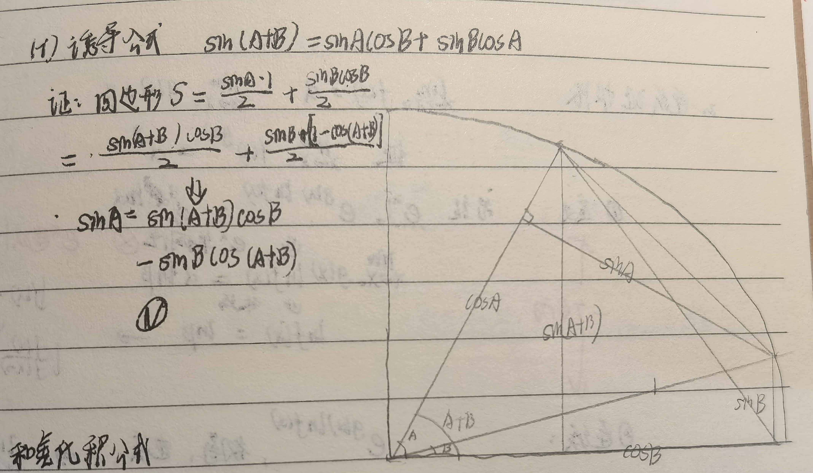

# 极限

- 所有的极限证明题，几乎都要用到实数系基本定理，因为整个数分都构建在这些定理上
- 这些定理的作用一个是引出无穷小量 $\e$（连续函数很需要这个引子），一个找到某种规律，从而确定“无界”的确切点（因为不能直接任取一个无界点）（这种规律其实也定义了无穷大的阶数。没有阶数描述的无穷大不能被直接定义/取到）
- 这些定理之间并不是完全可以等价，但也不是毫不相关。在证明中应用它们时，具体要看“概念上的需要”，比如题目的条件是数列还是区间还是确界为主，甚至混合着来
- **概念说明**：
  - **定义式**：xx定义中的等式和不等式以后简称为xx的定义式
- **放缩法**：放缩是数学分析的精髓，学会了放缩就是学会了数分
  - **分步放缩**：为了达到某个条件，先将 $n$ 取的足够大
    - 注意，每一步应尽可能地少放缩，最大限度地保留原函数的自由度（比如上一章证明无上界时，用未知数 $k$ 当系数，可在完全保留自由度的基础上，实现合并同类型的目的）
  - **部分放缩**：只放缩函数的其中一部分
  - **分段放缩**：若函数在某些区域上单调（$\{\dfrac{1}{n}+5^{-n}\}$），可以对定义域中的不同部分采取不同的放缩

## 数列极限

- **数列极限**：
  - **定义**：
    - 设 $\{x_n\}$ 是一个给定数列，$a$ 是一个实常数
    - 若 $\forall \e，\exist N>0$, 对于 $\forall n>N$，有 $|x_n-a| < \e$，则称**数列收敛于a，或a是数列的极限**
  - **极限的两种表示方法**：$\lim\limits_{n\to \infty}x_n = a$ 和 $x_n\to a \quad (n\to \infty)$
  <!-- - **核心**：$\e$ 的有阶任意性 -->
- **邻域**：以 $a$ 为中心，$\e$ 为半径的一个开区间（开集），称为点 $a$ 的 $\e$ 邻域
- **常见极限**：基本用定义 + 放缩都能证明，下面只是介绍一些常见放缩思路
  - 分式极限：
    - 分式很容易放缩
    - $\dis\lim_{n\to\infty}\frac{2n^2-1}{3n^2+2} = \frac{2}{3}$
      - **证明**：
        - 通分得只需证明 $\abs{1-\cfrac{9}{3n^2+2}}\cfrac{1}{3} < \e$ 即可
        - 显然取 $n$ 足够大时，左边绝对值为正，故只需证明 $\cfrac{9}{3n^2+2} < 1-3\e$ 即可
          - 这就是用了分步放缩技巧
        - 变形即得只需 $n > \sqrt{\cfrac{7-6\e}{3(1-3\e)}}$ 即可
  - 指数极限
    - $|q^n| < \e$
    - $|\sqrt[n]{a} - 1| < \e$
      - **证明**：
        - 利用二项式定理拆成多项式即可（实际上是应用了伯努利不等式）
        - 设 $y= \sqrt[n]{a} - 1$，则 $a = (1+y)^n = 1+ny +... > 1+ny$，即 $y < \dfrac{a-1}{n} \to 0$，夹逼法即得结论
    - $|\sqrt[n]{n}-1| < \e$
      - **证明（二项式定理）**：$n = 1+ny + \dfrac{n(n-1)}{2}y^2 + ... > 1+\dfrac{n(n-1)}{2}y^2$
        - 只需要将不等式左边放大为形式简单、容易求解的样子即可
      - **证明（均值不等式）**：$$\sqrt[n]{n} = \sqrt[n]{\sqrt{n}\sqrt{n}\cdot 1\cdot 1\cdots} \leq \frac{\sqrt{n}+\sqrt{n}+1+1+\cdots}{n} = \frac{2}{\sqrt{n}} + 1-\frac{2}{n}$$
    - $|\sqrt[n]{n^p} - 1| < \e$（$p > 0$）
      - **证明（二项式定理）**：
        - $n^p = 1+ny + ... > \cfrac{n(n-1)...(n-p)}{(p+1)!}y^{p+1}$
        - 即 $y < \sqrt[\large p+1]{\cfrac{n^p(p+1)!}{n(n-1)...(n-p)}} \to 0$
  - 根式极限
    - 平方差配凑法：根据公式 $\sqrt{n+1}+\sqrt{n} = \dfrac{1}{\sqrt{n+1}-\sqrt{n}}$ 进行变形放缩即可
    - 一般还需要用到通分 + 极限的四则运算
  - 奥特曼极限：
    - $\sqrt[n]{a_1^n + a_2^n + ... + a_p^n} = \max\{a_i\}$
      - **证明（夹逼法）**：
        - 左式 $\leq \sqrt[n]{n\max a_i^n} = $ 右式
        - 左式 $\geq \sqrt[n]{\max a_i^n} = $ 右式
      <!-- - 取对数证明（未完？） -->
- **均值极限**：若 $\lim\limits_{n\to\infty}a_n = a$，则 $\lim\limits_{n\to\infty}\cfrac{a_1+a_2+...+a_n}{n} = a$
  - **证明（定义法）**：
    - 任取有限值 $N$，分开前 $N$ 项和后 $n-N$ 项后，应用三角不等式实现分离
  - 三角不等式可以在很多时候进行添项、分离项，然后分隔成两个绝对值式子，可以配凑出想要的结果。比如应用和差化积公式可证 $|\sin x_1-\sin x_2| < |x_1-x_2|$
  - **证明（Stolz法）**：Stolz定理直得结论

### 极限的性质

- **唯一性**：收敛数列的极限必定唯一
  - **证明**：
    - 反设不唯一，则 $\forall \e>0，\exist N_1,N_2$，使得 $\forall n>N_1$ 有 $|x_n-a| < \e$，且 $\forall n>N_2$ 有 $|x_n-b| < \e$
    - 则 $\forall n>\max\{N_1,N_2\}$，都有 $|a-b| \leq |x_n-a|+|x_n-b| < \e$
    - 再由 $\e$ 的任意性即得 $a=b$
- **有界性**：收敛数列必定是有界数列（既有上界又有下界）
  - **证明**：
    - 设 $x_n\to a$，则有 $\forall n>N，|x_n-a| < \e$
    - 前 $N$ 项是有限个项，其中可取最大值，且最大值必定是有界量（归纳原理的直接推论）
    - 后 $n-N$ 个项是无限项，但都位于 $(a-\e，a+\e)$ 中，故也有界
- **保序性**：设两个收敛数列满足 $x_n\to a<y_n\to b$，则 $\exists N，\forall n>N$ 有 $x_n<y_n$
  - **证明**：
    - 取 $N = \max\{N_1,N_2\}$，则 $|x_n-a| < \e$ 且 $|y_n-b| < \e$
    - 则此时 $x_n \leq a+\e < b-\e \leq y_n$
  - **理解**：利用 $\e$ 极小性
  - **推论**：$<$ 可改为 $\leq$
- **保号性**：若 $\lim\limits_{n\to \infty}x_n = a > 0$，则 $\forall r\in (0,a)$，$\exists N，\forall n>N$ 有 $x_n>r$
  - **证明**：
    - 由极限定义中 $\e$ 的任意性，取 $\e > a-r$ 即得题设结论
- **夹逼性**：设 $\forall n$ 都有 $x_n\leq y_n \leq z_n$，若 $x_n\to a，z_n\to a$，则 $y_n\to a$
  - **证明**：由极限定义易得
  - **应用**：一般用于无限求和，两端推导
- **极限的四则运算**
  - 加法：定义 + 三角不等式直得
  - 乘法：添项 + 乘法分配律 + 三角不等式
  - 除法：类似乘法的证明，配凑即可
    - **证明**：
      - $\dis\abs{\frac{x_n}{y_n}-\frac{a}{b}} = \abs{\frac{bx_n-ab - ay_n+ab}{y_nb}} \leq \frac{|\max\{|b-a|,|b+a|\}|}{|y_nb|}\e$，再由 $\e$ 的任意性即得结论
  - 根号：$\lim\limits_{n\to \infty}\sqrt{x_n} = \sqrt{\lim\limits_{n\to \infty}x_n}$
    - **证明**：
      - 设 $x_n\to a$，则只需证明 $\sqrt{x_n}\to \sqrt{a}$
      - 由极限得 $|x_n-a| = |\sqrt{x_n}-\sqrt{a}|\cdot |\sqrt{x_n}+\sqrt{a}| < \e$
        - 再由 $\sqrt{x_n}+\sqrt{a}$ 是有界量即得结论
    - 或者用函数极限的Heine定理证明
- **极限的阶**：
  - **高阶无穷小**：若 $\lim\limits_{n\to\infty}\dfrac{x_n}{y_n} = 0$，则称 $x_n = o(y_n)$
  - **等价无穷小**：若 $\lim\limits_{n\to\infty}\dfrac{x_n}{y_n} = A$，则称 $x_n = O(y_n)$ 或 $x_n \sim y_n$
  - **低阶无穷小**：若 $\lim\limits_{n\to\infty}\dfrac{x_n}{y_n} = \infty$，则称 $x_n = \t(y_n)$

### 习题

- **变量是哪个**：$\lim\limits_{n\to \infty}x_{n+k} = a$，极限定义中依然是取 $n>N$，因为 $n$ 才是数列的自变量
- 几个跟级数有关的有意思的证明：
  - **等比级数收敛**：设 $a_n>0$，且 $\lim\limits_{n\to\infty}\dfrac{a_{n+1}}{a_n} = q \in (0,1)$，则 $a_n \to 0$
    - **证明**：
      - 定义即可（取 $m$ 足够大，使得满足等比条件。再由 $a_m$ 是有限数和 $q^n\to 0$ 即可）
  - **等比数列开根**：若 $\lim\limits_{n\to\infty}\dfrac{a_{n+1}}{a_n} = q$，则 $\lim\limits_{n\to\infty}\sqrt[n]{a_n} = q$
    - **证明**：
      - 取对数后化为等差数列，极限定义即可
  - **部分和极限**：若 $S_n$ 极限存在，则 $\lim\limits_{n\to \infty} \dfrac{a_1+2a_2+...+na_n}{n} = 0$
    - **作差证法**：$$\frac{a_1+2a_2+...+na_n}{n} - \frac{a_1+2a_2+...+(n+1)a_{n+1}}{n+1} \\\ \\ = \frac{a_1+2a_2+...+na_n-(n+1)a_{n+1}}{n(n+1)}$$
      - 再放缩为 $\dfrac{n(a_1+...+a_n)}{n(n+1)} - \dfrac{a_{n+1}}{n} = 0$ （√）
    - **级数证法（换元证法）**：
      - 原式可转化为部分和 $\dfrac{nS_n - S_{n-1} - ... - S_1}{n}$
      - 设 $\lim\limits_{n\to\infty} S_n = A$，$b_k = A-S_k$
      - 则原式可化为 $\lim\limits_{n\to\infty} \dfrac{b_1+...+b_n + n\e}{n} = \lim\limits_{n\to\infty} b_n = 0$
      - 本质就是阿贝尔变换
    - **判敛证法**：
      - Stolz公式不能证明，因为 $a_n$ 不一定单调
  - 若 $S_n$ 极限存在，则 $\lim\limits_{n\to \infty} \sqrt[n]{n!·a_1a_2...a_n} = 0$
    - **证明**：
      - 利用上式结论 + 均值不等式即可
      - 这里不能取对数了，因为 $\ln a_n \to -\infty$，无法应用上题结论
      - 但实际上取对数和取均值不等式的思想是差不多的
    - 无穷乘积也是放在无穷级数后面讲的。加法比乘法简单，但结论可类似推广到乘法上
  - **双重加和**：设 $a_n\to a，b_n\to b$，则 $\lim\limits_{n\to \infty} \cfrac{a_1b_n+a_2b_{n-1} + ... + a_nb_1}{n} = ab$
    - 这个形式类似级数的柯西乘积
    - **证明**：
      - 易得 $(a_i-a)(b_j-b) = a_ib_j - a_ib - b_ia + ab$
        - 题设左式的分子 $\sum\limits^n_{i=1}a_ib_j$ 是柯西乘积
        - 由均值极限易得 $\cfrac{1}{n}\sum\limits^n_{i=1} a_ib \to ab，\cfrac{1}{n}\sum\limits^n_{i=1}ab_i \to ab，\cfrac{1}{n}\sum\limits^n_{i=1}ab = ab$
        - 故题设等式等价于 $\lim\limits_{n\to\infty}\cfrac{\sum\limits^n_{i=1}(a_i-a)(b_{n-i}-b)}{n} = 0$。即只需对 $a=b=0$ 情况证明即可
        - 具体证明见后面
- **综合题**：$\lim\limits_{n\to\infty} \dkh{\sqrt{n^2+n+1} - \cfrac{n^2+5n+1}{n+3}}$
  - 看起来很复杂，其实一点也不难
  - **解**：
    - 由极限的加法运算，可以转化为 $\sqrt{n^2+n+1}-n$ 和 $-\dfrac{2n+1}{n+1}$ 两个极限，分别求解
    - 前者由平方差配凑法可转化为 $\cfrac{n+1}{\sqrt{n^2+n+1}+\sqrt{n^2}}$
    - 通分 + 极限的除法运算即得 $\cfrac{1+\frac{1}{n}}{\sqrt{1+\frac{1}{n}+\frac{1}{n^2}} + 1} \to \cfrac{1}{2}$

### 无穷大量

- **无穷大量**：若数列 $a_n$ 满足 $\forall G，\exists N$ 满足 $\forall n>N$ 都有 $|a_n| > G$，则该数列称为无穷大量
  - 前面的数列极限值都必须有界，但其实可以扩充它的定义
- **广义极限**：规定正无穷大量的极限为 $+\infty$，负无穷大量的极限为 $-\infty$
- **stolz($\dfrac{\infty}{\infty}$ 型)**：若 $y_n\nearrow +\infty$，则 $\lim\limits_{n\to\infty}\cfrac{x_n-x_{n-1}}{y_n-y_{n-1}} = a \red\Rt \lim\limits_{n\to\infty}\cfrac{x_n}{y_n} = a$
  - 左式的意思是收敛速度，极限为 $0$ 说明 $N$ 极大时 $y_n$ 的发散速度远快于 $x_n$，即 $y_n$ 远远大于 $x_n$
  - **证明**：
    - 当 $a=0$ 时，有 $|x_n-x_{n-1}| < \e|y_n-y_{n-1}|$
      - 由 $y_n$ 单增性，右式绝对值可改为括号
      - 由三角不等式，$|x_n-x_{N_1}| \leq |x_n-x_{n-1}| + \cdots + |x_{N_1+1}-x_{N_1}|$
      - 右式放缩得 $|x_n-x_{N_1}| < \e(y_n-y_{N_1})$
      - 即 $|\dfrac{x_n}{y_n}-\dfrac{x_{N_1}}{y_n}| < \e(1-\dfrac{y_{N_1}}{y_n}) < \e$
    - 当 $a\neq 0$ 且有限时，作差即可化为上式情况
    - 当 $a=+\infty$ 时，$x_n-x_{n-1} > y_n-y_{n-1} > 0$，从而 $x_n$ 是单增无穷大量。取倒数即可化为上式情况
  - **理解**：
    - 保证 $y_n$ 单增是为了将绝对值合并成 $\e(y_n-y_N)$
    - 保证 $y_n$ 无穷大是为了无穷消有穷
  - **反例（反命题不成立）**：$x_n = (-1)^n$，$y_n = n$
- **stolz($\dfrac{0}{0}$ 型)**：若 $y_n\searrow 0$ 且 $x_n\to 0$，则 $\lim\limits_{n\to\infty}\cfrac{x_n-x_{n-1}}{y_n-y_{n-1}} = a \red\Rt \lim\limits_{n\to\infty}\cfrac{x_n}{y_n} = a$
  - 左式的意义是收敛速度，故极限为 $0$ 说明 $N$ 极大时 $x_n$ 每项的收敛效果远小于 $y_n$，即 $x_n$ 早就收敛完成了
    - 再由于 $x_n\to 0$，所以取同一个 $n$ 时，$x_n$ 当然也远远小于 $y_n$ 了，也就是右式的结论
  <!-- - **证明（$x_n>0$）（错误方法）**：
    - 此时 $\dfrac{1}{x_n}\to +\infty，\dfrac{1}{y_n}$ 单增趋于正无穷
    - 由stolz得 $$\frac{\frac{1}{x_n}-\frac{1}{x_{n-1}}}{\frac{1}{y_n}-\frac{1}{y_{n-1}}} \to 0 \red\Rt \frac{y_n}{x_n}\to 0 \tag{1}$$
    - 再由于 $$\frac{\frac{1}{x_n}-\frac{1}{x_{n-1}}}{\frac{1}{y_n}-\frac{1}{y_{n-1}}} = \dfrac{x_n-x_{n-1}}{y_n-y_{n-1}}\cdot\dfrac{y_n}{x_n}\dfrac{y_{n-1}}{x_{n-1}} \tag{2}$$
      - 若 $\dfrac{y_n}{x_n}\to+\infty$，则 $\dfrac{x_n}{y_n}\to 0$，此即为所需结果，得证
      - 若 $\dfrac{y_n}{x_n} = A$
        - 由题设条件 $\dfrac{x_n-x_{n-1}}{y_n-y_{n-1}}\to 0$，再由 $(2)$ 式和 $(1)$ 式即得 $\dfrac{y_n}{x_n}\to 0$，这与题目结论矛盾，所以必须证明 $\dfrac{y_n}{x_n}$ 无界，陷入循环论证
        - 究其原因，还是形式写复杂了 -->
  - **证明**：
      - **引理**：$\dfrac{x_n}{y_n}$ 极限存在
        - 不证明这个就没法用Stolz定理
        - **证**：
          - 反设 $x_n = b_ny_n$，其中 $b_n$ 有界振荡
          - 则 $\cfrac{x_n-x_{n-1}}{y_n-y_{n-1}} = b_n + \cfrac{b_n-b_{n-1}}{\frac{y_n}{y_{n-1}}-1} \to \infty$，且有正有负，矛盾
      - 易得 $$\dfrac{x_n-x_{n-1}}{y_n-y_{n-1}} = \frac{\frac{1}{x_n}-\frac{1}{x_{n-1}}}{\frac{1}{y_n}-\frac{1}{y_{n-1}}}\cdot \frac{x_n}{y_n}\cdot \frac{x_{n-1}}{y_{n-1}}$$
      - 右式：由Stolz定理易得 $= \cfrac{\frac{1}{x_n}}{\frac{1}{y_n}}\cdot \cfrac{x_n}{y_n}\cdot \cfrac{x_{n-1}}{y_{n-1}} = \cfrac{x_{n-1}}{y_{n-1}}$
      - 左式：由题设极限得 $\to a$
      - 即 $\cfrac{x_n}{y_n} \to a$
    <!-- - **再证明 $a=0$ 情况**
      - 计算易得 $$\lim_{n\to\infty}\cfrac{x_n-x_{n-1}}{y_n-y_{n-1}} = 0 \red\Rt \lim_{n\to\infty}\cfrac{(x_n+ay_n)-(x_{n-1}+ay_{n-1})}{y_n-y_{n-1}} = a $$
      - 易得此时 $x_n+ay_n\to 0$，故由有界情况结论即得 $\lim\limits_{n\to\infty}\cfrac{x_n}{y_n} = 0$
    - **再证明 $a=\infty$ 情况**
      - 取倒数后应用 $a=0$ 情况的结论即可 -->
- **stolz函数极限**：
  - 设 $T>0$ 为常数，函数 $f,g$ 在 $[a,+\infty)$ 内闭有界
  - 若
    - **区间单增**：$\forall x\geq a，g(x+T) > g(x)$
    - **无穷大量**：$\lim\limits_{x\to\infty}g(x) = +\infty$
  - 则 $$\lim\limits_{x\to\infty}  \frac{f(x+T)-f(x)}{g(x+T)-g(x)} = l \red\Rt \lim\limits_{x\to\infty} \frac{f(x)}{g(x)} = l$$
  - **证明**：
    - 按照Stolz定理的方法即可
  - 本质就是差分形式的洛必达法则
- **柯西定理（均值函数极限）**：
  - 设 $f$ 在 $(a,+\infty)$ 上有定义，且内闭有界，则 $$\lim\limits_{x\to\infty} \frac{f(x)}{x} = \lim\limits_{x\to\infty} \Big[ f(x+1)-f(x) \Big]$$
    - **证明**：取 $g(x) = x$，由stolz的函数形式即得结论
  - 设 $f$ 有非负下界，且右式极限存在，则 $$\lim\limits_{x\to\infty} \sqrt[\large x]{f(x)} = \lim\limits_{x\to\infty} \frac{f(x+1)}{f(x)}$$
    - **证明**：两边取 $\ln$，对 $\ln f(x)$ 和 $x$ 应用stolz的函数形式即得结论

#### 习题

- **陷阱**：$\lim\limits_{n\to \infty} \cfrac{a_1+a_2+...+a_n}{n} = +\infty$
  - 证明大体和之前相同，但要注意一点：因为 $n-N < n$，所以需要把前面的 $N$ 项的和放缩到 $\dfrac{G}{2}$，这样后面 $n-N$ 可以多分到 $\dfrac{3G}{2}$
- **双重加和**：设 $0<\lambda<1，\lim\limits_{n\to \infty} a_n = a$，则 $\lim\limits_{n\to \infty}(a_n + \lambda a_{n-1}+..+\lambda^n a_0) = \dfrac{a}{1-\lambda}$
  <!-- - **证法1**（错误的，因为$\e$和$k$之间是循环高阶，出现矛盾）
    - $\forall \e>0，\exist N>0，\forall k>N，有\lambda^k < \e$。而此时由$a_n$有界得$\lambda^ka_{n-k} < \e a_{n-k}$，由$\e$任意性得$\lambda^ka_{n-k} = 0\quad (n\to \infty)(k>N)$
    - 而$k<N$时，之前证明过$a_n和a_{n-k}$的极限是相同的，所以前N项$\to a(\lambda+\lambda^2+...+\lambda^N)$，再把后面的$n-N$项添进来得$a(1+\lambda+...+\lambda^n)$得证 -->
  - **证明（换元法变为单重加和）**：
    - 换元，设 $b_n = \dfrac{a_n}{\l^n}$，则原式变为证明 $\lim\limits_{n\to\infty} \l^n(b_1 + ... + b_n) = \dfrac{a}{1-\l}$
    - 显然其可利用stolz定理，计算即得结论
- **广义部分和极限**：
  - 设
    - $A_n = \mathop{\sum}\limits_{k=1}^n a_k$ 存在极限
    - $\{p_n\}$ 为单调递增的正数列，发散到正无穷
  - 求 $\lim\limits_{n\to \infty} \cfrac{p_1a_1+ ... + p_na_n}{p_n}$
    - 若取 $p_n = n$，就是前面的部分和极限，所以方法也是类似的
  - **解（部分和换元法，变为Stolz形式）**
    - 设 $b_n = p_n-p_{n-1}$
    - 仿照之前题目，发现原式等于 $$\hspace{-2em}\frac{p_nA_n - (p_n-p_{n-1})A_{n-1} - (p_{n-1}-p_{n-2})A_{n-2}-...}{p_n} = \frac{\sum\limits^n_{k=1} b_kA_k + 有限项}{\sum\limits^n_{k=1} b_k}$$
    - 由Stolz定理即得原极限等价于 $\cfrac{b_nA_n}{b_n} = A_n$ 的极限
- **双重加和**：
  - 设 $p_k > 0，\lim\limits_{n\to\infty}\cfrac{p_n}{p_1 + ... + p_n} = 0，\lim\limits_{n\to\infty}a_n = a$
    - $p_n$ 可以有界、无界或极小，也可能发散
  - 则 $\lim\limits_{n\to\infty}\cfrac{p_1a_n + ... + p_na_1}{p_1+... + p_n} = a$
  - **证明（无穷消有穷）**：
    - 这种题的核心问题在于，$p_n$ 和 $a_n$ 趋于极限时的项数对应两个不同的 $P,A$
      - 即 $P$ 右边的项 $|...|<\e$，且 $A$ 左边的项有 $|a_n-a|<\e$
    - 如果 $P+A < n$，那么可以覆盖整个 $1\sim n$
    - 如果 $P+A > n$，那么此时存在一些同时位于 $P$ 左边和 $A$ 右边的“中间项”。它们无法应用极限定义
      - 但我们发现，$P,A$ 都是依赖于 $\e$ 的函数。取定 $\e$ 时，它们不变
      - 此时如果取 $n$ 足够大，就能满足条件
      <!-- - ，此时 $P+A > n$。再由于 $P,A$ 是依赖于所选的 $\e$ 的，即取定 $\e$ 后，它们到两端的距离是固定的，即存在 $C(\e) = P+(n-A)$，即 $A = n+P-C(\e)$
      - 所以我们可以取 $n > f(\e)$，就转化为 $P < A$ 的情况 -->
    - 不妨设 $a=0$，则存在 $M = \sup |a_n|$
    - 设 $S_n = \sum\limits^n_{k=1}\cfrac{p_k}{p_1+...+p_n}$，易得 $S_n\to 1$，故由柯西收敛原理即得极限处极小
    - 取定 $\e$，则由极限定义得
      - 存在 $A$ 使得 $n>A$ 时 $|a_n| < \dfrac{\e}{2}$
      - 存在 $P$ 使得 $n>P$ 时 $|S_n-S_P| < \dfrac{\e}{2M}$
    - 设 $b_{k} = \cfrac{p_ka_{n-k}}{p_1+...+p_n}$
      - 只是为了方便书写而已
      <!-- - 则由极限定义易得 $k>P$ 或 $k<n-A$ 时，都有 $b_k < \e$
      - 故取 $n > A+P$ 就有 $\forall b_k < \e$ -->
    - 此时有 $$b_1 + ... + b_{n-A} < \cfrac{p_1+...+p_{n-A}}{p_1+...+p_n}\cdot\frac{\e}{2} < \frac{\e}{2}$$ 且 $$b_P + ... + b_n < \max\{a_1,...,a_P\}\frac{\e}{2M} < \frac{\e}{2}$$
    - 故取 $n>A+P$ 就有原极限 $ < \e$
    

### 收敛准则

- **单调有界数列收敛定理**
- **闭区间套定理**：
  - 若
    - 一列闭区间满足 $[a_{n+1}, b_{n+1}] \subset [a_n,b_n]$
    - $\lim\limits_{n\to \infty}(b_n-a_n) = 0$
  - 则
    - 存在唯一的 $\xi$ 位于所有闭区间中
    - $\lim\limits_{n\to \infty}a_n = \lim\limits_{n\to \infty}b_n = \xi$
  - **证明**：
    - **$\xi$ 存在性**：由闭区间的两端点单调有界，得两极限存在。取 $\xi = \lim\limits_{n\to\infty}a_n$ 即可
    - **$\xi$ 唯一性**：易得两极限相等，反设不唯一，由极限唯一性易得结论
  - **推论**：如果推广到开区间上，则区间不能是包含关系，也不能是真包含关系，必须是两端点的严格大小关系（防止 $\xi$ 最终收敛到区间端点上导致取不到）
  - **应用**：实数集是不可列集
    - **证明（三分法构造闭区间套）**：
      - 反设存在排列 $\R = \{x_1,x_2,...\}$
      - 任取不包含 $x_1$ 的闭区间 $[a_1,b_1]$，则将其三等分，必然有一个不包含 $x_2$，设为 $[a_2,b_2]$
        - 一般取闭区间套都是二分法，为什么这里是三分呢？
        - 因为防止 $x_2$ 刚好处于 $[a_1,b_1]$ 的中点处，此时两个二分子区间都包含 $x_2$，就找不到 $[a_2,b_2]$ 了
      - 不断做下去，得到闭区间套，收敛到 $\xi$，此时发现 $\xi$ 不可能等于任何实数，矛盾
- **凝聚定理**：有界数列必有收敛子列
  - **子列**：$\{x_n\}$ 是一个数列，定义 $n_1 < n_2 < ... < n_k$，则 $\{x_{n_k}\}$ 形成一个数列，称为其子列
    - **收敛性质**：任意子列收敛 $\LR$ 数列收敛
      - **必要性**：数列本身也是其子列，故其收敛
      - **充分性**：由极限定义易得结论
  - **证明**：
    - 设数列的上下界为 $B,A$，则取二分查找闭区间套 $$[A_n,B_n] = \begin{cases} [A_{n-1},\dfrac{A_{n-1}+B_{n-1}}{2}] & 若该区间内有无限多项 \\\\ [\dfrac{A_{n-1}+B_{n-1}}{2},B_{n-1}] & 若该区间内有无限多项 \end{cases}$$
    - 再由闭区间套定理，它最终收敛到一个数 $\xi$。在每个区间套中取点，则 $\xi$ 即为该点列的极限
  - **无界判别**：若 $\exist \{x_{n_k}\}$，使得 $\lim\limits_{k\to \infty}x_{n_k} = \infty$，则 $x_n$ 无界
    - 若存在子列无界，则无界
- **基本数列**：若 $\forall \e>0，\exist N，\forall m,n>N$ 都有 $|x_m-x_n|<\e$，则 $x_n$ 称为基本数列
- **Cauchy收敛原理**：$\{x_n\}$ 收敛 $\LR \{x_n\}$ 是基本数列
  - **证明**：
    - **必要性**：定义 + 三角不等式添项即可
    - **充分性**：
      - 易得基本列有界
      - 由凝聚定理，存在收敛子列 $\{x_{n_k}\}\to A$
      - 再利用基本列定义，得其它极限项和该子列项无限接近，从而也收敛到 $A$

#### 习题

- **根据递推公式求极限**
- **圆周率 $\pi$ 的定义**：$L_n = \{n\sin\dfrac{180°}{n}\}$ 的极限
  - **证明**：
    - 用单调有界定理，证明数列收敛即可
    - **几何意义**：割圆法，发现该数列 $L_n$ 表示一个边长为 $1$ 的正 $n$ 边形的半周长
    - **有界性**：已知单位正 $n$ 多边形的面积为 $n\sin\dfrac{180\degree}{n}\cos\dfrac{180\degree}{n}$，它有上界，故由几何意义 $L_n$ 有上界
    - **单增性**：
      - 首先有 $\sin\Big[ (n+1)t \Big] = \sin(nt)\cos t \Big[ 1+\dfrac{\tan t}{\tan nt} \Big]$
        - 尽量化为统一的形式，为此需要将多余的项放缩掉
        - 已知 $\cos t \leq 1$
        - 将诱导公式展开，易得 $\tan nt \geq n\tan t$（**核心**）
          - 其它步骤都是自然的思路，就这一步放缩是最难想到的
          - 但是这个不等式本身的意义不难，就是 $\tan x$ 的增长率快于 $x$ 而已
      - 综上即得右式 $\leq (1+\dfrac{1}{n})\sin nt$，从而 $\sin(n+1)t \geq \dfrac{n+1}{n}\sin nt$，即得 $L_n \leq L_{n+1}$
      - 求导法是错误的：设 $f(x) = \sin\dfrac{t}{x}$，求导得 $\lim\limits_{x\to\infty} f'(x) = 0$，$f''(x) < 0$，故始终有 $f'(x) > 0$，从而 $L_n$ 单增
        - 实际上求 $\sin x$ 的导数需要用到 $\dfrac{\sin x}{x}$ 极限，而该极限又能立刻导出本题结论，故这个方法涉及循环论证
      - 诱导公式的证明不需要微分，详见下图：
      
- **自然对数 $e$ 的定义**：$a_n = (1+\dfrac{1}{n})^n$ 单增，$ b_n = (1+\dfrac{1}{n})^{n+1}$ 单减，收敛于同一极限 $e$
  - **证明（均值不等式）（配凑法）**：
    - $(1+\dfrac{1}{n})^n·1$，配凑成 $n+1$ 项的乘积，然后用均值不等式，即得 $a_n \leq a_{n+1}$，说明是单增数列
    - $\Big( \dfrac{1}{(1+\dfrac{1}{n})} \Big)^{n+1}\cdot 1$，然后用均值不等式，即得 $\dfrac{1}{b_n} \leq \dfrac{1}{b_{n+1}}$，说明是单减数列
  - **证明（均值不等式）（直接法）**
    - 要证 $\cfrac{a_{n+1}}{a_n} \leq  1$，即 $1+\dfrac{1}{n+1} \leq \Big( \cfrac{n+1}{n+\frac{1}{n+1}} \Big)^n$，即 $\sqrt[n]{1+\dfrac{1}{n+1}} \leq \cfrac{n+1}{n+\frac{1}{n+1}}$
      - 从这里可以看出来了，要证明这个结论，均值不等式是绕不开的工具。因为均值不等式的本质就是衡量 $n$ 次幂的增长速率
      - 而那些比它强的不等式，形式都没它好看
    - 左边根号内添项 $n-1$ 个 $1$，应用均值不等式得左式 $\leq \cfrac{n-1+\frac{1}{n+1}}{n}$，不难发现它小于右式
- **$p$ 级数**：$\sum\limits^\infty_{n=1}\dfrac{1}{n^p}$，当 $p>1$ 时收敛
  - **证明（放缩成等比形式）**：
    - 设 $r = \dfrac{1}{2^{p-1}}$
    - $\dfrac{1}{2^p} + \dfrac{1}{3^p} < \dfrac{1}{2^p} + \dfrac{1}{2^p} = r$
    - $\dfrac{1}{4^p} + \dfrac{1}{5^p} + \dfrac{1}{6^p} + \dfrac{1}{7^p} < \dfrac{1}{4^p} + \dfrac{1}{4^p} + \dfrac{1}{4^p} + \dfrac{1}{4^p} = r^2$
    - 综上可得 $\dfrac{1}{2^{kp}} + \cdots + \dfrac{1}{(2^{k+1}+1)^p} < \dfrac{2^k}{2^{kp}} = r^k$
    - 设级数和为 $a_n$，则 $a_n \leq a_{2^n-1} < \sum\limits^{n-1}_{i=1} r^i < \dfrac{1}{1-r}$
  - **推论**：同理可证 $p\leq 1$ 时级数发散
- **调和级数**：$\sum\limits^n_{i=1}\dfrac{1}{n} - \ln n\to  \g$
  - **调和数**：调和级数的前 $n$ 项和 $H_n$ 称为 $n$ 阶调和数（在解析数论中非常有用）
  - **证明（单调有界法）**：
    - 设 $S_n = \sum\limits^n_{i=1}\dfrac{1}{n} - \ln n$，则 $S_{n+1}-S_{n} = \dfrac{1}{n+1} - \ln\dfrac{n+1}{n}$
    - **单调性**：
      - 前面已证 $(1+\dfrac{1}{n})^n < e < (1+\dfrac{1}{n})^{n+1}$
      - 用对数不等式可直接得到结论。但为了避免循环论证，最好用初等方法
      - 两边取 $\ln$ 即得 $\dfrac{1}{n+1} < \ln\dfrac{n+1}{n} < \dfrac{1}{n}$，即 $S_{n+1}-S_{n} < 0$，单调递减
      - 这里实际上就是用初等方法证明了对数不等式
    - **有界性**：
      - 由上面的不等式，$S_n > \sum\limits^n_{k=1} \ln\dfrac{k+1}{k}-\ln n = \ln(n+1)-\ln n > 0$，从而有下界
      - 或者直接泰勒展开 $\ln \dfrac{n+1}{n}$，将原式化为等比级数
      <!-- - 累加得 $a_n - a_1 = \sum\limits^n_{k=1} \dfrac{1}{k+1} - \ln(n+1)$
      - 已知 $\ln n = \sum\limits^n_{k=1} \ln k-\ln(n+1)$
      - 数列不等式那一套 -->
  - **证明（L中值法）**
    - 作差得 $|S_n-S_{n-1}| = \biggm|\dfrac{1}{n} - \Big[ \ln n - \ln(n-1)\Big]\biggm|$
    - 对中括号内使用L中值定理得 $原式 = |\dfrac{1}{n}-\dfrac{1}{\xi}| < |\dfrac{1}{n(n-1)}|$，由数项级数的比较判别法即得结论
  - **证明（达布和比较法）（数项级数积分判别法）**：利用 $\dis\frac{1}{n+1} < \int^{n+1}_n \frac{dx}{x} < \frac{1}{n}$
  - **推论（错位求和法）**：$$\lim_{n\to \infty} \fkh{ 1-\frac{1}{2}+\frac{1}{3}+...+(-1)^{n+1}\frac{1}{n} } = \ln 2$$
    - **证明**：设调和级数为 $b_n$，则左式 = $b_{2n}-b_{n} = \ln 2$
    - **理解**：实际就是级数的错位求和，利用了偶数项之间的 $\dfrac{1}{2}$ 关系化正为负
- **压缩性条件**：设 $k<1$，若 $|x_{n+1} - x_n| \leq k|x_n - x_{n-1}|$，则该数列收敛
  - **证明1**：柯西收敛原理 + 三角不等式
  - **证明2**：易得 $|x_{n+1}-x_n| \leq k^n|x_2-x_1| \to 0$，从而由极限定义得收敛

### 递推函数

#### 压缩映射（更一般的形式见泛函分析）

- **压缩映射方法**：
  - 设 $f$ 可微，$x_{n+1} = f(x_n)$
  - 若 $\exist r\in\R$ 使得 $|f'(x)| \leq r < 1\pad (\forall x\in\R)$，则 $x_n$ 收敛到不动点
    - 中间必须有一个小于1的数，而不能是 $|f'(x)|< 1$，否则可能是 $|f'(x)| \to 1-$
  - **证明**：
    - 导数增长性 + 三角不等式得 $|x_{n+p}-x_n| \leq \sum\limits^{n+p}_{k=n+1} r^{k-1}|x_1-x_0| \leq \\ |x_1-x_0|\dfrac{r^n}{1-r}$
    - 由柯西收敛原理即得 $x_n$ 收敛
  - 压缩映射法本质是不动点方法的子集

#### 不动点方法（更一般的形式见泛函分析）

- **不动点方法（单增）**：
  - 设 $f$ 是区间 $I$ 上连续增函数，$x_{n+1} = f(x_n)$ 
  - 若 $f$ 在 $I$ 上有不动点 $x^*$，且 $\Big[ x_1-f(x_1) \Big](x_1-x^*) \geq 0$
    - 几何意义：左边高于 $y=x$，右边低于 $y=x$ 的单增函数
    <!-- - ：$x_1$ 和 $x^*$ 之间 $\begin{cases} f'(x) \geq 1 & x_1 > x^* \\ f'(x) \leq 1 & x_1 < x^* \end{cases}$ -->
  - 则 $x_n$ 收敛，且 $\lim\limits_{n\to\infty} x_n = f(\lim\limits_{n\to\infty} x_n)$，即极限为不动点
  - **证明**：
    - 证明单调有界即可
    - 若题设式子成立等号，则 $x_1$ 即为不动点，从而 $x_n$ 恒等，当然收敛。故只需考虑不等情况
    - 接下来我们证明 $\forall x_1\in I$，都有 $x_n\to x^*$
    - 设 $g(x) = f(x) - x$
      - 由于 $x_{n+1}-x_n = g(x_n)$，故 $g(x_n)$ 的正负性等价于 $x_n$ 的单调性（**核心**）
      - 此时 $x^*$ 是 $g$ 的零点
    - 由题设不等式，$g(x_1)(x_1-x^*) < 0$，故不妨设 $\begin{cases} x_1 > x^* \\ g(x_1) < 0 \end{cases}$
      - 由 $g$ 为负得 $x_2 < x_1$
      - 再由于 $f$ 是增函数，故 $x_2 = f(x_1) > f(x^*) = x^*$，即 $x^*$ 是 $x_n$ 的下界
      - 再由题设不等式，$g(x_2)(x_2-x^*) < 0$，即 $g(x_2) < 0$
      - 以此类推，后面 $g$ 始终小于 $0$，即 $x_n$ 始终缩小，从而单减
      - 再由于 $x_n$ 有下界 $x^*$，故其收敛到 $x^*$
    <!-- - 若 $\begin{cases} x_1 > x^* \\ g(x_1) > 0 \end{cases}$，则 $x_1$ 增加，从而 $g(x_1)$ 也增加，则其最终会不断发散 -->
  - **理解**：其实画个函数图像就很容易发现了
- **不动点方法（单减）**：
  - 设 $f$ 在 $I$ 上严格单减，$x_{n+1} = f(x_n)$
  - 若 $f$ 有不动点 $x^*$
  - 则奇偶子列 $b_n = x_{2n}，c_n = x_{2n-1}$ 分别在 $x^*$ 两侧，且 $F(x) = f\circ f(x)$ 是它们的递推函数，严格单增
  - 然后再判断 $F$ 是否满足单增情况的适配条件，从而应用不动点方法即可
  - （易得 $F$ 和 $f$ 的不动点相同）
- 错误想法：可导时，不动点方法的条件等价于 $|f'(x)| < 1$（实际上只是充分条件）
  - 反例：设递推函数 $f(x) = e^x-e$，$x_1 = 1$
  - 证明：
    - 易得在 $x=1$ 左边和右边各有一个不动点
    - 易得 $f'(1) = e > 1$
    - 但在 $[x^*_1,x^*_2]$ 上 $f(x)$ 图像位于 $y=x$ 下方，从而由不动点方法得收敛
  - 对于可导函数，直接写出它的单调区间，从而判断与 $y=x$ 的图像位置即可。没那么多弯弯绕绕的
- 迭代时的方向：从 $f$ 到 $y=x$ 时取横线，从 $y=x$ 到 $f$ 时取竖线
  
#### 习题
  
- **1**：递推函数 $f(x) = -\dfrac{x(x-2)}{2}$，则初值为正时收敛，为负时不收敛
  - **证明**：
    - 此时 $f'(x) = 1-x$，不动点为原点
    - 几何意义：不动点是 $f$ 与 $y=x$ 的切点，即 $f$ 始终处于 $y=x$ 下方
    - 所以不动点右边收敛，左边不收敛
- **2**：$$x_1 = 1，x_2 = \frac{1}{2}，x_{n+1} = \cfrac{1}{1+x_n}$$
  - **解**：
    - 显然 $f$ 单减，故 $F = f\circ f$ 单增
    - 计算易得不动点为 $x^* = \dfrac{\sqrt{5}-1}{2}$
    - 选取区间为 $I = [0,1]$，计算易得 $x_{2n}$ 和 $x_{2n-1}$ 均满足不动点方法条件，故极限为 $x^*$
    - 此时 $x_{2n}$ 在 $x^*$ 左端单增收敛，$x_{2n-1}$ 在 $x^*$ 右端单减收敛。通过直接计算就容易发现这一点
- **3**：$$x_1 = 2，x_{n+1}  = 2+\cfrac{1}{x_n}$$
  - **解**：
    - 显然 $f$ 单减，故 $F = \cfrac{5}{2}-\cfrac{1}{2(2x+1)}$ 单增，不动点为 $x^* = 1+\sqrt{2}$
    - **法一**：
      - 计算易得 $|F'(x)|$ 在 $x<-1$ 或 $x>0$ 时满足不动点方法的条件
      - 再由于 $x_2 = \dfrac{5}{2} > 1+\sqrt{2} > 0$，故由不动点方法，其收敛到 $x^*$
    - **法二**：
      - $x_{2n}$ 在 $(1-\sqrt{2},1+\sqrt{2})$ 区域单增，其余情况单减
      - 再由于 $x_2 = \dfrac{5}{2} > 1+\sqrt{2}$，故由单调有界收敛原理，其单减收敛到 $x^*$
    - 同理可得 $x_{2n-1}$ 单增收敛到 $x^*$
    - 综上即得结论
- **4**：$$x_1 > 1，c>1，f(x) = \frac{c(1+x)}{c+x}$$
  - **解**：
    - 变形易得 $f(x) = c+\cfrac{c(1-c)}{c+x}$，不动点为 $\sqrt{c}$
    - 画出图像发现满足不动点条件

### 实数系的完备性

- **完备性**：基本数列必定收敛（任何一个满足收敛性条件的数列，都有唯一一个极限实数与它匹配）
- **连续性**：非空有上界的集合必有上确界（引出 $\e$）
- **六大定理的等价性**：
  - 将前面的证明顺序反过来即可，即用柯西收敛原理逆推确界存在定理
  - **闭区间套定理**
    - **证明**：
      - 取 $m>n$，则 $a_m - a_n < b_n - a_n\to 0$，从而 $a_n$ 收敛，同理 $b_n$ 收敛
      - 设 $\xi_1 = \lim\limits_{n\to\infty} a_n，\xi_2 = \lim\limits_{n\to\infty} b_n$，反设 $\xi_1 \neq \xi_2$，证明同上
  - **确界存在定理**
    - **证明**：
      - 设集合 $A$ 有界
      - 构造同时包含上界和集合 $A$ 的闭区间，然后不断将其二分，选取其中同时包含 $A$ 和 $A^c$ 的子区间
        - 若不存在，则由定义容易证明二分点就是确界
        - 若始终存在，则形成闭区间套。由闭区间套定理，其最终收敛于一点。由定义容易发现该点是确界
  - **凝聚定理**：
    - **证明**：和之前相同，用闭区间套定理即可
  - **单调有界数列收敛定理**：直接用确界存在定理
    <!-- - **闭区间套法**：
      - 构造单调递减且收敛到上确界的上界数列即可，但很难
      - 首先对于 $x_1$，取一个上界 $M_1$，再对 $x_2$，取一个上界 $M_2 = \cfrac{M_1+x_1}{2}$
        - 可以证明 $M_{k+1}$ 可以无限取到，否则 $M_k$ 就根据定义成为上确界
      - 再设 $\e_k = M_k - x_k$，其单减
        - 此时 $\forall \e>0 ，\exist k > 0，\forall n>k$ 有 $|M_n-x_n|<\e$
        - 又由上界定义有 $M_n>x_n$，即 $[x_n,M_n]$ 构成闭区间套。由闭区间套定理，它最终收敛于 $\xi$。可以验证 $\xi$ 就是上确界，同时也是 $x_n$ 的极限
    - **凝聚定理法**：
      - 反设不收敛，则由单增性，$x_{n+p}-x_n > \e_0 > 0$，累加起来，得到一个无界子列，与凝聚定理矛盾 -->

### 习题

- **数集的直径**：$\diam A_k = \sup\{|x_n-x_m|L: x_n,x_m\in A_k\}$
- 设数集 $A_k = \{x_n|\ n\geq k\}$，则数列 $x_n$ 收敛 $\LR \lim\limits_{n\to\infty} \diam A_n = 0$
  - **证明**：
    - 在多元函数中类似的是Cantor闭矩形套定理，证明的方法是直径定义给出存在性，反证证明唯一性
    - 在这里，也是根据Cauchy收敛原理定义来就行

## 函数极限

- **函数极限**：
  - 在函数 $f$ 定义域中给定 $x_0$
  - 若 $\forall \e>0，\exist \d>0，\forall x\in O(x_0,\d)$ 都有 $|f(x)-A| < \e$
  - 则称 $\lim\limits_{x\to x_0} f(x) = A$  

### 极限的性质

- **唯一性**：
  - **证明**：同样是三角不等式分隔
- **局部保序性**
  - （数列极限是数列整体的性质，而函数极限只是某点局部的性质）
  - **证明**：同样是 $\e$ 任意性
- **局部保号性**
- **局部有界性**：
  <!-- - 我觉得任意性完全可以做，但是这里偏偏用了常数函数和局部保序性。我猜是编者有意为之（坑死我了） -->
- **夹逼性**
- **函数极限的四则运算**

### 函数极限与数列极限

- **重要极限**：$\lim\limits_{x\to 0}\dfrac{\sin x}{x} = 1$
  - **证明1**：
    - 平面直角坐标系的单位圆中，容易发现内部三角形面积（$\dfrac{\sin x}{2}$） < 扇形面积 （$\dfrac{x}{2}$） < 外部三角形面积 $\dfrac{\tan x}{2}$
    - 变形可得 $\cos x < \dfrac{\sin x}{x} < 1$，然后应用夹逼定理即可
      - （但实际上它是循环论证，因为求扇形面积公式时，割圆法推导需要用到化曲为直，即必须要用到该极限）
  - **证明2**：
    - 用别的方法求出上述不等式
    - 级数法：
      - 用幂级数定义 $\sin x$，用级数方法证明在 $x=0$ 附近一致收敛，然后直接求极限（但这定义太粗暴了，而且教学顺序错误）
    - 积分法：
      - 沿用 $\sin x$ 的几何定义，即（弧度制下某个任意角对应的单位圆弧的长度）到（对应的端点纵坐标）的映射
      - 用定积分 + 勾股定理求出弧长 $l = \dis\int^1_x \sqrt{1+(\sqrt{1-t^2})'}dt$，从而写出 $\sin x$ 的定积分形式，由此计算得 $\sin x < x < \tan x$
  - **证明3**：
    - 用两个数列夹逼函数极限
    - 前面已证 $\lim\limits_{n\to\infty}n \sin(\dfrac{\pi}{n}) = \pi$，设 $a_n  = \cfrac{\sin(\frac{\pi}{n})}{\frac{\pi}{n}}$，则 $a_n \to 1$
    - 取夹逼 $$ \blue{\frac{\sin(\frac{\pi}{n+1})}{\frac{\pi}{n}} = \frac{\sin(\frac{\pi}{n+1})}{\frac{\pi}{n+1}}\cdot \frac{n}{n+1}} < \frac{\sin x}{x} <  \green{\frac{\sin(\frac{\pi}{n})}{\frac{\pi}{n}}\cdot \frac{n+1}{n} = \frac{\sin(\frac{\pi}{n})}{\frac{\pi}{n+1}}}$$
- **Heine定理**：$\lim\limits_{x\to x_0}f(x) = A \LR \lim\limits_{n\to\infty}f(x_n) = A\quad (\forall x_n\to x_0)$
  - **证明**：
    - **必要性**：定义易得
    - **充分性**：由离散情况出发，证明稠密情况，采用反证法即可
  - **应用**：
    - 跳跃性的无极限/不连续
    - 把函数极限转化成数列极限
      - e极限
    - 数列极限的Heine定理其实就是子列法
  - **理解（本题的反证法逻辑）**：
    - 要证明 $p\land q \rightarrow r$，则先证明 $p\land q\land \neg r$ 为假
      - 易得若其中某两个条件为真，则剩下一个必须为假
      - 所以若 $p\land q$ 为真（题设），则 $\neg r$ 为假，则 $r$ 为真
- **逻辑运算律**
  - $\neg(p\lor q)为真 = \neg p \lor \neg q 为真= (\neg q \land p) \lor (\neg p \land q) \lor (\neg p \land \neg q)为真$
  - 一对多的关系，这也是为什么对于一对多的问题都倾向于反证法
- **单侧极限**
- **广义极限**
- **Cauchy收敛原理**：
  - **有限点处**：$\lim\limits_{x\to x_0}f(x)$ 存在且有限 $\LR \forall \e>0，\exist \d > 0，\forall x_1,x_2 \in O(x_0,\d)$ 都有 $$|f(x_1)-f(x_2)| < \e$$
  - **无穷远处**：$\lim\limits_{x\to\infty}f(x)$ 存在且有限 $\LR \forall \e>0，\exist X>0，\forall x_1,x_2>X$ 都有 $$|f(x_1)-f(x_2)| < \e$$
  - **证明**：
    - **必要性**：定义即可
    - **充分性**：取数列 $x_n\to x_0$，对 $\{f(x_n)\}$ 应用数列的柯西收敛原理，最后由Heine定理即得结论

### 习题

- **阶数转化技巧**：
  - 当 $x_n\to 1+$ 时，有 $x_n-1 = (e^{\ln x_n}-1)\sim \ln x_n$
    - 由 $e^x-1\sim x$ 的引申
  - 当 $x_n\to 1-$ 时，有 $(1-x_n) \sim (1-\dfrac{1}{\a} x)^{\a}$
    - 由 $(x+1)^\a\sim (1+\a x)$ 的引申
- **分步放缩法**：$$\lim_{x\to 1}\frac{x(x-1)}{x^2-1} = \frac{1}{2}$$
  - **解**：
    - 由极限定义，只需取 $x$ 使得 $\dfrac{|x-1|}{2|x+1|} < \e$
      - 我们希望除去干扰项 $x+1$，用放缩法即可
      - 首先令 $x > 0$
        - 将讨论的邻域缩小为 $|x-1| < 1$
      - 同时还有 $x+1>1$，从而 $\dfrac{|x-1|}{2|x+1|} < \dfrac{|x-1|}{2}$
        - 这样就排除了干扰项
      - 再取 $\d < \min\{1,2\e\}$ 即可
        - 分步放缩后，要把所有放缩过的值都写进来，从中选出最小值
- **数列夹逼法**：
  - $\lim\limits_{n\to\infty} \dkh{1+\cfrac{x}{n}}^n$ 及其变形
  - $\lim\limits_{x\to +\infty}x[\dfrac{1}{x}]$
  - $\lim\limits_{x\to +\infty}x^{\dfrac{1}{x}}$
  - $\lim\limits_{x\to +\infty}\dfrac{x^k}{a^x}$
  - $\lim\limits_{x\to +\infty}\dfrac{\ln^kx}{x}$

