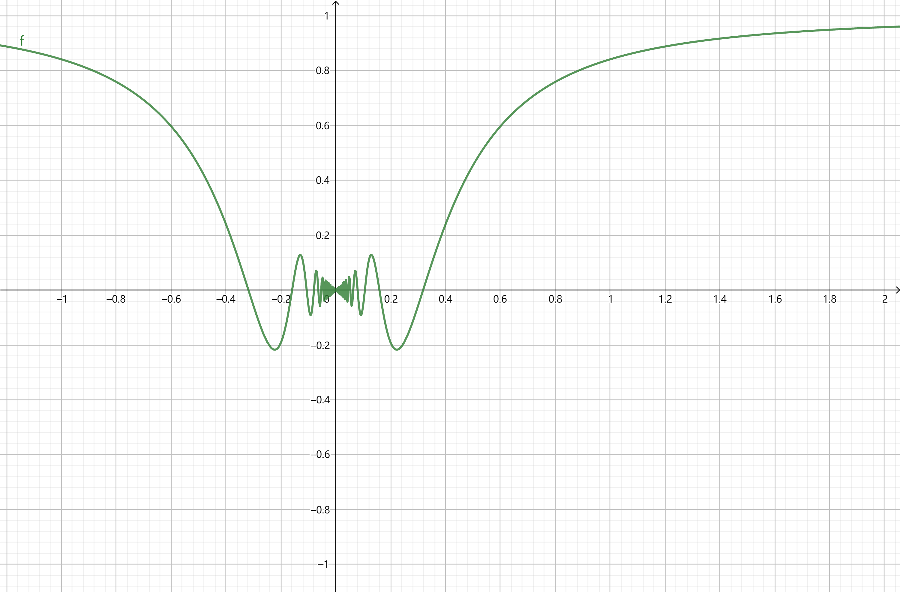
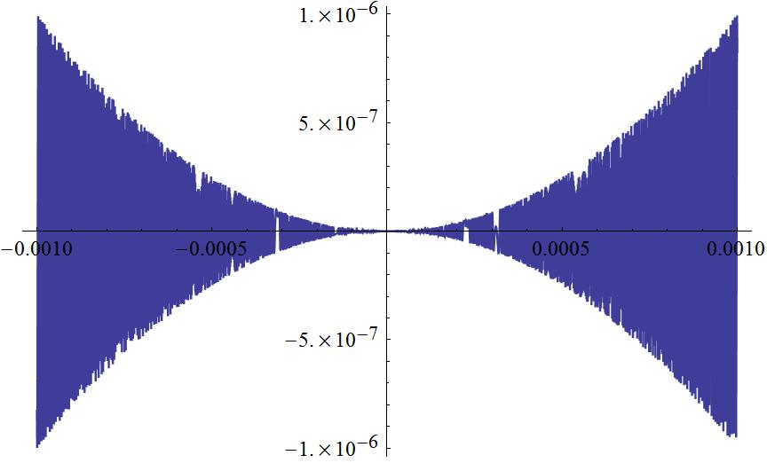
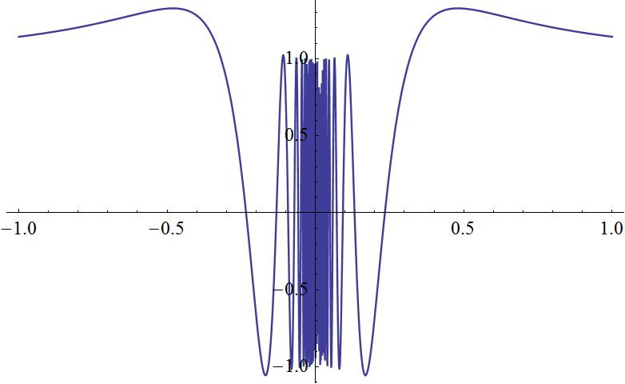

# 导数和微分

## 微分

- **差分**：某个增量
  - **可微（微分存在）**：若存在 $g(x_0)$ 使得 $\D x\to 0$ 时总成立 $\D y = g(x_0)\D x + \omicron(\D x)$，则称 $y$ 在 $x_0$ 处可微
  - **差分的线性主要部分**：$g(x)\D x$
- **微分**：设 $f(x)$ 在 $x_0$ 处可微，则 $\D x\to 0$ 时
  - $\D x$ 称为自变量 $x$ 的微分
  - $\D y$ 的线性主要部分 $g(x_0)\D x$ 称为因变量 $y$ 在 $x_0$ 处的微分
- **导函数（微分定义法）**：$f'(x) = \lim\limits_{\D x\to 0} \dfrac{\D y}{\D x}$
  - 由定义，$\D y$ 是 $\D x$ 和 $x$ 的二元函数，故导函数的本质是二元函数对单变量取极限
  - $f'(x)$ 就是上面的线性主要部分 $g(x)$
- **导函数（极限定义法）**：$f'(x) = \lim\limits_{\D x\to 0} \dfrac{f(x+\D x) - f(x)}{\D x}$
  - 其实微分在这里的定义并不严谨，更多只是想让读者理解。如果想要像（拓扑学从集合论出发定义开集）一样定义微分，需要等到后面学习微分形式才行
  - 但是极限用 $\e-\d$ 语言定义的很好，连带着导数的定义也非常好，所以更多时候我们是先用极限性质推出导数性质，然后由此推出微分的性质。后面的高阶微分就是这样
  - **导数**：$x_0$ 的导函数 $f'(x_0)$ 称为该点的导数
  - **可导**：若 $f$ 在某点导数存在，则称在该点可导
  - 显然可微等价于可导
  - 以收敛速度的视角，导函数的意义是：$f'(x_0)$ 就是函数中（因变量 $f(x)$ 趋向于 $f(x_0)$ 的速度）与（自变量 $x$ 趋向于 $x_0$ 的速度）的比值
    - 若无论 $x$ 以任何速度收敛到 $x_0$，这个比值都是确定的，那么 $x_0$ 处可导
    - 若存在两个不同的 $x$ 收敛速度会得到不同的比值，那么 $x_0$ 处不可导（“不同的收敛速度”如果用数学语言表示出来，就是Heine定理中的不同数列 $x_n'\to x_0$ 和 $x_n''\to x_n$）
    - 其中 $\D x$ 就是自变量收敛速度，$\D y$ 就是因变量收敛速度
  - 极限是函数收敛的终点，导数是函数收敛的速度
- **连续与可微**：
  - **连续但是不可微**：$y = \sqrt[3]{x^2}$
    - **证明**：$\D y = \sqrt[3]{(\D x)^2} = o(\D x)$，即 $\D y$ 无法表示为 $\D x$ 的线性函数，故不可微
  - **一致连续但是不可导**：$y = \begin{cases}x \sin\dfrac{1}{x}, & x\neq 0 \\ 0,& x=0 \end{cases}$，在 $x=0$ 处连续但不可导（导函数为 $\sin\dfrac{1}{\D x}$，函数在极小区域内跳跃式变化（但是连续））
    
    - 连续的本质是 $\D y = \omicron(1)$
      - 即 $\D x$ 无穷小时，$\D y$ 也跟着无穷小。但 $\D y$ 和 $\D x$ 之间的阶数关系是任意的
    - 可导的本质是 $\D y \leq \D x$，且不跳跃，且左右导数相等
      - 即 $\D x$ 无穷小时，$\D y$ 不是低阶无穷小
    - 连续但不可导：三种可能情况
      - $\D x$ 是高阶无穷小，而 $\D y$ 是低阶无穷小
      - $\D x$ 和 $\D y$ 是同阶无穷小，但商是跳跃函数
      - 左右导数不相等（一般不是初等函数）
  - **可导但导函数不连续**：$y = \begin{cases}x^2 \sin\dfrac{1}{x}, & x\neq 0 \\ 0, & x=0\end{cases}$，导函数为 $2x\sin\dfrac{1}{x}-\cos\dfrac{1}{x}$
    - 导函数在 $x=0$ 处极限不存在（第二类不连续点）
    - 原函数图像
    - 导函数图像

## 导数运算

- **导数的四则运算**
  - **加法**：$(f+g)' = f' + g'$
    - **证明**：前面极限相似
      - $\lim\limits_{\D x\to 0} \dfrac{\Big[ f(x+\D x)+g(x+\D x) \Big]-\Big[ f(x)+g(x) \Big]}{\D x} = \lim\limits_{\D x\to 0} \dfrac{\Big[ f(x+\D x)-f(x) \Big]-\Big[ g(x+\D x)-g(x) \Big]}{\D x}$
    - **理解**：
  - **乘法**：$(fg)' = f'g + fg'$
    - **证明**：和前面极限相似，添项配凑即可
    - **理解**：把函数看成参数方程。$f(x)x(t)+g(x)x(t)$，一方的增长率建立在另一方函数值的基础上，并且应该相加
  - **除法**：$(\dfrac{f}{g})' = \dfrac{f'g-fg'}{g^2}$
    - **证明**：看作 $f(x)\cdot \dfrac{1}{g}(x)$ 即可
- **复合函数求导**：$\Big[ f\circ g(x) \Big]' = f'(g(x))\cdot g'(x) $
  - **证明**：
    - $\lim\limits_{\D x\to 0} \dfrac{f(g(x+\D x))-f(g(x))}{\D x} = \lim\limits_{\D x\to 0} \dfrac{f(y+\D y)-f(y)}{\D y}\cdot\dfrac{\D y}{\D x} = f'(y)\cdot y'$
  - **链式法则**：中间添项的这个步骤如同累乘的链条一般，称为链式法则
- **反函数求导**：$\Big[ f^{-1}(y) \Big]' = \dfrac{1}{f'(x)}$
  - **证明**：
    - $\lim\limits_{\D x\to 0} \dfrac{f^{-1}(y+\D y)-f^{-1}(y)}{\D y} = \lim\limits_{\D x\to 0} \dfrac{(x+\D x)-x}{f(x+\D x)-f(x)} = \dfrac{1}{f'(x)} = \dfrac{1}{f(f^{-1}(y))}$
    - 最后还需要有一个回代过程，即按照这个公式求出来的导函数是以 $x$ 为自变量的，但我们希望得到的是以 $y$ 为自变量的形式。所以最后还需要将 $x$ 替换为 $f^{-1}(y)$
- **参数函数求导**：若 $\begin{cases} y = y(t) \\ x = x(t) \end{cases}$，则 $y'(x) = \dfrac{y'(t)}{x'(t)}$
  - **证明**：$y(t) = y(x^{-1}(x))$，则由复合函数 + 反函数求导法则得 $y'(t) = \dfrac{dy}{dt}\dfrac{dt}{dx} = \dfrac{y'(t)}{x'(t)}$

### 高阶导数和微分

  <!-- - 这里后面的 $\dfrac{dy}{dx}$ 也是链式法则对数学意义到数学本质的转化。$[D(f(x))]' = D'(f(x))f'(x)$，前面的D是数学意义($\dfrac{dy}{dx}$)，后面的是数学本质（$\dfrac{1}{y'}$）
  - 也可以使用$f(x+\D x)-f(x)$（微分形式）来解题，不过需要凑导数 -->

- **高阶微分公式**：$d^2y = d(dy) = d\Big[ f'(x)dx + o(dx) \Big] = f''(x)dx^2$
  - $dx$ 的定义是 $x$ 的足够微小的差分。前面对可微的定义中，说明了一个函数可微的前提是它的微分公式与 $x$ 的取值无关，也就是说对于可微的函数来说，$dx$ 的值与 $x$ 的取值无关，即 $dx$ 不是 $x$ 的函数，因此可以视为一个常量，从而 $d(dx) = 0$
  - 麻了，这个解释确实差点意思。其实用外微分可以很好解释。所以先别纠结这个，大胆往后学吧
- **Leibniz公式**：设 $f,g$ 都是 $n$ 阶可导函数，则 $fg$ 也 $n$ 阶可导 $$\Big[ f(x)g(x) \Big]' = \sum\limits^n_{k=0} C^k_n f^{(n-k)}g^{(k)}$$
  - **证明**：采用数学归纳法和组合数的性质即可
- **一阶微分的形式不变性**：详见多元函数的微分
  - **实例**：设 $x = \p(t)$，求 $d^2(e^x)$
    - **解**：
      - 首先 $d(e^x) = e^xdx = e^x\p'dt$
      - **使用形式不变性**：先计算中间量 $d(e^xdx) = e^xdx^2 + e^xd^2x$，再代入 $x=\p'$ 计算
      - **不使用形式不变性**：$d(e^x\p'dt)$，直接对 $t$ 取微分
      - 容易发现最终结果的形式相同
- **反例（详见微分几何）**：平面上圆心为原点，半径为 $R$ 的圆
  - 角度形式：$r(t) = (R\cos t,R\sin t)$
  - 弧长形式：$r(s) = (R\cos\dfrac{s}{R},R\sin\dfrac{s}{R})$
  - 弧长角度转换公式：$s(t) = Rt$
  - 若承认形式不变性，则若设 $\vec t = \or r'(t)$，即可得到 $|\or t'(s)| = |\dfrac{d\vec t}{dt}|\cdot |\dfrac{dt}{ds}|$
    - 但实际上，$左式 = \dfrac{1}{R}$，$右式 = \dfrac{1}{R}\cdot R = 1$，不相等
  - 原因是 $\vec t$ 已经是一阶微分，故 $\or t'(s)$ 实际上是二阶微分，不具有形式不变性。我们从头开始推导：
    - $|\or t'(s)| = |\cfrac{d^2\vec r}{ds^2}| = |\cfrac{d(\dfrac{dr}{dt}\dfrac{dt}{ds})}{dt}\cdot \cfrac{dt}{ds}| = |\cfrac{d^2r}{dt^2}(\cfrac{dt}{ds})^2 + \cfrac{dr}{dt}\cdot \cfrac{d^2t}{ds^2}\cdot \cfrac{dt}{ds}|$
    - 此时 $右式 = \dfrac{1}{R} = 左式$

### 习题

- **反函数的高阶导求法**：已知 $\dfrac{dx}{dy} = \dfrac{1}{y'}$，则 $\dfrac{d^2x}{dy^2} = -\dfrac{y''}{(y')^3}$
  <!-- - 已知 $\dfrac{dy}{dx} = \dfrac{1}{y'}$，则 $\dfrac{d^2y}{dx^2} = \dfrac{d(\dfrac{1}{y'})}{dx}·\dfrac{dy}{dx} = -\dfrac{y''}{(y')^2}·\dfrac{1}{y'}$ -->
  - **链式法则法**
    - 设 $y' = u$，则 $\dfrac{d\dfrac{1}{u}}{dy} = \dfrac{d\dfrac{1}{u}}{du}·\dfrac{du}{dx}·\dfrac{dx}{dy}$，依次计算即可
    - 首先应当用复合函数的思想来看待高阶导数，上面也提到了。然后要使用链式法则转化为可求解的形式
  - **微分法**
    - 设 $g(y) = x$，$A(x) = y'$，$f^{-1'}(y) = B(y) = \dfrac{1}{A(x)}$
    - 则 $B'(y) = \dfrac{B(y+\D y)-B(y)}{\D y} = \dfrac{\dfrac{1}{f'(x+\D x)} - \dfrac{1}{f'(x)}}{f(x+\D x) - f(x)}$
    - 上下同乘一个 $\D x$ 即可配凑出微分形式，再取极限即可
  - **本质**：利用形式不变性，换元换到可求解的形式，然后逐步拆解换元即可 
- **利用Leibniz公式求高阶导数**：
  - $y = \arctan x$，计算 $y^{(n)}(0)$
    - **解**：
      - 首先求一阶导，$f(x) = \arctan x$，即 $f^{-1}(y) = \tan y$。已知 $\Big[ f^{-1}(y) \Big]' = (\dfrac{1}{\cos^2 y})^{-1} = \dfrac{1}{\tan^2 y+1}$
      - 再由于 $y = \arctan x$，则原式化为 $y'(x) = \dfrac{1}{\tan^2(\arctan x)+1} = \dfrac{1}{1+x^2}$
      - 将等式化为 $y'(1+x^2) = 1$。两边求 $n-1$ 阶导。再由于取 $x=0$ 会消去绝大多数的项，所以可以得到递推公式
- **导数的应用**
  - 证明不等式
  - 证明恒等式（求导数为0）
  - 证明数列单调性（裴礼文中的重要章节）

### 导数极限

- **右导数**：$f'(x_0) = \lim\limits_{\D x\to 0}\dfrac{f(x_0+\D x)-f(x_0)}{\D x}$
- **右导数极限** $\lim\limits_{x\to x_0+}f'(x) = \lim\limits_{\substack{x\to x_0 \\ \D x\to 0}}\dfrac{f(x+\D x)-f(x)}{\D x}$
  - **累次性**：可写成累次极限 $\lim\limits_{x\to x_0}\lim\limits_{\D x\to 0} \dfrac{f(x+\D x)-f(x)}{\D x} \LR \D x << x_0$
  - 这里有点二重极限的意味了
    - 提前剧透一下极限函数的概念：一个二元函数 $f(x,y)$，若对其中一个自变量 $x$ 取极限，则极限值是 $y$ 的函数
    - 二重极限就是再对极限函数的 $y$ 取极限，最终得到一个极限值
  - 而这里就是：$x$ 和 $\D x$ 是两个无关变量，导函数可看作对 $\D x$ 取极限后的极限函数，导函数极限就是再对 $x$ 取极限，即二重极限
  <!-- - 如果该点导数存在，则左右导数相等。如果导数是连续的，则导数极限等于左右导数。 -->
- **例子**：
  - **分段函数 $|x|$**：
    - 原点 $x=0$ 处左右导函数不相等，但 $x=0$ 附近的极限点可导
  - 导函数不连续，但导函数极限存在
    - **证明**：则导函数为第一类不连续点，左右导数极限不相等（×），**不可能有这种情况**
  - **可导但不连续的函数** $y = \begin{cases}x^2 \sin\dfrac{1}{x}, & x\neq 0 \\ 0, & x=0\end{cases}$
    - 原点 $x=0$ 处可导，但导函数极限不存在，原函数是无穷小震荡，其连续，***该点及其附近均不可导，但其它有界点可导***

### 导数和一致连续
  
<!--（错的） - 连续和一致连续的区别在于在奇点极限处能否保持确定的收敛速度比（如果出现不同构的多元函数，则不一致连续）
  - 而导数和连续的阶数条件是相同的，可以说**导数就是连续的量化表达，导数极限就是一致连续的量化表达**。
  - 导数有界 $\Rightarrow \D f$ 的收敛速度 $\geq \D x$ 的收敛速度 $\Rightarrow$ 函数一致连续
  - 奇点处导数发散速度 $\leq$ $\dfrac{1}{x}(x\to 0)$ $\Rightarrow$ 函数一致连续
    - 因为导数定义本身中就包含了$x_1和x_2的\delta$，而导数极限就是在检验“一致性”。此时只需要令$\D f(x)$无穷小即可，所以导数可以乘一个x再验证是否有界（错了，乘上无穷小量反而是对条件的强化。无论如何，一致连续对导数都没有任何约束作用的）
      - 因为 $\lim\limits_{\substack{x\to x_0 \\ \D\to 0}} \dfrac{f(x+\D x)-f(x)}{\D x}·(x-a)$ 中，$x-a$ 是比 $\D x$ 远大的，所以对导数并没有任何影响
      - 只要导数的乘数收敛速度在 $\dfrac{1}{x}$ 的收敛速度内，任何函数均一致连续
      - 但若乘数大于这个速度，就要依具体导数而定（比如 $(\dfrac{1}{x})'$ 超过二阶速度就不行了） -->
- 性质具有点态性质和一致性质的划分，特别需要说明的是：内闭有界性对应点态性质，有界性对应一致性质
- 若开集 $I$ 上 $f'(x)$ 有界，则 $f$ 在 $I$ 上一致连续
  - 一致有界的解释详见[泛函分析](../../泛函分析/1.度量空间.md)，关于一致性的详细讨论详见[5.级数](5.级数.md)
  - **证明**：
  - **理解**：
    - 函数内闭有界不能强化为一致连续，反例为 $y = \sin\dfrac{1}{x}$ 在 $(0,1)$ 上处处连续且内闭有界，但逼近 $0$ 时反复跳跃，不一致连续
      - 因为不连续的情况并不只有无界一种，还有极限不存在和左右极限不相等的情况。因此需要一个更加严格的性质（比如可导避免了极限不相等的情况，导函数有界避免了跳跃的情况）
    - 导函数内闭有界不能强化为一致连续。反例为 $\dfrac{1}{x}$ 的导函数在 $(0,1)$ 上内闭有界，但 $\dfrac{1}{x}$ 在逼近 $0$ 时急速上升，不一致连续
      - 因为性质不能无中生有，一个性质必然由其相关性质导出。导函数只是一个衡量增长率的量，它的重点在于“邻域”，而不是“区间的极限部分”。因此导函数本身并不具有一致性的相关性质，必须再加上一个和“区间的极限部分”有关的性质才行（也就是有界性）
    - 一致连续不能强化为可导。反例为 $y = \begin{cases}x \sin\dfrac{1}{x}, & x\neq 0 \\ 0,& x=0 \end{cases}$
      - 因为一致连续只是比连续多了一致性而已。前面也说了，导函数注重的是邻域内的微观性质，一致性则是一个宏观性质，故无法为可导带来增益
    - 由此可见，反例的构造能力也是衡量数学水平的重要参考对象。因为很多古怪反例的提出（尤其是实分析中的反例）并不是瞎猫碰上死耗子，而是深入了解研究对象的各种性质后一步一步想出来的。构造反例的前提是，既要知道研究对象的能力是什么，也要知道它的能力边界在哪里
  - **实例**：
    - 若 $\sqrt{x}f'(x)$ 在 $x=0$ 处有界，则 $f(x)$ 一致连续
    - 若 $f$ 在 $\R$ 上一致连续，则存在 $a,b>0$ 使得 $|f(x)| \leq a|x| + b\pad (\forall x)$
      - **本质**：一致连续函数在无穷远处的阶数为 $O(x)$

## 微分中值定理

- **极大值点**：若 $x_0$ 的某个邻域内，所有函数值都不大于 $f(x_0)$，则称 $x_0$ 为 $f$ 的极大值点
- **Fermat引理**：若函数 $f$ 在极值点 $x_0$ 的导数存在，则 $f'(x_0) = 0$
  - **证明**：由可导性，$x_0$ 的左右导数相等。再由导数的定义式，左导数非负，右导数非正，只能是都为 $0$
  - 如果极大值点的定义条件改为严格小于，那么极值点处不可导。比如 $f(x) = |x|$ 的 $x=0$ 处
- **Roll中值定理**：
  - 设
    - $f$ 在闭区间 $[a,b]$ 上连续，在开区间 $(a,b)$ 上可导
    - $f(a) = f(b)$
  - 则存在一点 $\xi\in (a,b)$ 使得 $f'(\xi) = 0$
  - **证明**：
    - 由连续函数的最值定理，$[a,b]$ 上存在最大值点和最小值点
    - 若 $f(a) = f(b)$ 同时是最大值和最小值，则 $f$ 是常函数，任意点都是极值点
    - 若 $(a,b)$ 中存在最值点 $\xi$，则由定义得其必定为极值点，从而由Fermat引理有 $f'(\xi) = 0$
  - **理解**：
    - 若退化为开区间连续，则可能是 $f(a) = f(b)$，但 $(a,b)$ 上 $f$ 单调。这样就不存在 $\xi$ 点
    - 端点处仅存在单侧导数，故只能定义开区间上可导
  - **推论**：
    - 若区间上有 $l_1$ 个点 $f(x)=0$，同时这 $l_1$ 个点中又有 $l_2$ 个点 $f'(x)=0$
    - 则区间上 $f'(x)$ 一共有 $l_1+l_2-1$ 个零点
    - **证明**：用两次R中值定理即可
- **Legendre多项式**：$p_n(x) = \cfrac{1}{2^nn!}\cfrac{\text{d}^n}{\dx^n}(x^2-1)^n$
  - **根数定理**：$p_n(x)$ 在 $(-1,1)$ 上恰有 $n$ 个不同的根
  - **证明**：
    - 由Leibniz公式，$f(x) = (x^2-1)^n$ 的 $n$ 阶以下导函数都存在因式 $x^2-1$ ，因此总以 $-1$ 和 $1$ 为零点，即 $-1,1$ 始终满足Roll中值定理的条件 $f(1) = f(-1) = 0$
      - 后面到复变函数会学到，这里的 $-1,1$ 叫做 $n$ 阶零点
    - 对 $f$ 反复使用Roll定理，每次都分割区间增加一个零点，最后得到 $n$ 个
      - 首先 $(-1,1)$ 上有 $f'(\xi_0) = 0$
      - 然后 $(-1,\xi_0)$ 和 $(\xi_0,1)$ 上分别有 $f''(\xi_{11}) = 0，f''(\xi_{12}) = 0$
      - 不断做下去，最终就得到 $f^{(n)}$ 有 $n$ 个零点
- **Lagrange中值定理**：
  - 设 $f$ 在闭区间 $[a,b]$ 上连续，在开区间 $(a,b)$ 上可导
  - 则存在一点 $\xi\in (a,b)$ 使得 $f'(\xi) = \dfrac{f(b)-f(a)}{b-a}$
  - **证明**：
    - **辅助函数**：只要找到一个满足 $F(a)=0，F(b)=0$，且 $F'(x) = f'(x)-\dfrac{f(b)-f(a)}{b-a}$ 的函数，则对其使用Roll中值定理，就得到L中值定理的结论
    - 对右侧做不定积分即得 $F(x) = f(x)-\dfrac{f(b)-f(a)}{b-a}(x-a)$
  <!-- - 这个构造是自然的 -->
  - **推论**：反过来不成立，即并不是 $\forall \xi\in I$ 都存在 $b,a\in I$ 使得 $f'(\xi) = \dfrac{f(b)-f(a)}{b-a}$
    - **反例**：$f(x) = x^3$ 中取 $\xi = 0$
- **一阶导数与单调性的关系**：$f$ 在 $I$ 上单增 $\LR \forall x\in I，f'(x)>0$
  - **证明**：L中值定理的公式正好是单调函数的定义公式
  <!-- （tmd这是个错的猜想，逼得我专门去看了《数学分析中的问题与反例》）- **推论（小邻域法）**：若 $f'(x_0) > 0$，则存在 $O(x_0,\d)$ 使得 $f$ 在其上单增
    - **证明**：下面是常微分方程中经常使用的方法：右端分析
      - 由确界存在定理，可设 $x_1 = \inf\{x\in\R \mid x>x_0，f'(x)\leq 0\}$，则 $(x_0,x_1)$ 是 $f$ 的单增区域
        - 接下来只需要证明 $x_1 \neq x_0$ 即可
        - 这里若承认习题中的Darboux定理，则可立即得到 $f'(x_1) = 0$，即 $x_1 \neq x_0$
        - 反设 $x_1=x_0$，则其右侧点的导数均非负，左侧点的导数均为正。
        - 若右侧点导数均为负，则
      - 同理设 $x_2 = \sup\{x\in\R \mid x<x_0，f'(x)\leq 0\}$，则 $(x_2,x_0)$ 是 $f$ 的单增区域
      - 在 $(x_2,x_1)$ 中取邻域即可 -->
- **二阶导数和凹凸性的关系**
  - **凸函数**：若 $\forall x_1,x_2\in I，\l\in (0,1)$ 都有 $$f(\lambda x_1 + (1-\lambda)x_2) \leq \lambda f(x_1) + (1-\lambda)f(x_2)$$，则称 $f$ 在 $I$ 中是（下）凸函数
    - **几何意义**：任取 $x_1,x_2\in I$，则 $f$ 的图像始终位于连接 $x_1,x_2$ 的直线下方
  - **导数关系**：$f$ 下凸 $\LR$ $f''(x) \geq 0$
    - **证明（直线比较法）**：任取 $x_1,x_2\in I$，设 $$h(\l) = \dkh{f(x_2)-\l\Big[f(x_2)-f(x_1)\Big]} - f\Big(x_2-\lambda(x_2-x_1)\Big)\quad \lambda\in(0,1)$$
      - 设连接 $f(x_1)$ 和 $f(x_2)$ 的直线为 $l$，则 $h$ 的几何意义是（当 $x$ 相同时，曲线 $f$ 和直线 $l$ 的函数值的差）
      - $h$ 定义在 $(x_1,x_2)$ 上，$\l$ 表示当前 $x$ 值在该区间上的比例位置
      - 这个构造思想其实是很简单的，写成数学形式略微有些复杂罢了
      - 易得 $h(0) = h(1) = 0$
      - 再由Roll中值定理得存在 $h'(\xi) = 0$
        - 端点效应得只能是 $h'(0)>0，h'(1)< 0$ ，再由零点存在定理也能得到该结论。这是Roll中值定理的另一个证明方法
      - **充分性**：
        - 此时 $h''(\l) = -(x_2-x_1)^2f''(...) \leq 0$，即 $h'$ 在 $(x_1,x_2)$ 上单调递减
        - 故
          - $(x_1,\xi)$ 上 $h' > 0$，$h$ 单增
          - $(\xi,x_2)$ 上 $h' < 0$，$h$ 单减
          - 最终得到 $h(x) \geq 0$，即函数下凸
      - **必要性**：若函数下凸，则 $h$ 在 $(x_1,x_2)$ 上非负
        - 显然右侧结论比左侧更强，更难推。若正方向难推，相应地反方向就容易推。也就是说，由弱条件推强结论应当用反证法
        - 反设存在 $f''(x_0) < 0$，即 $h''(\l_0) > 0$，如果存在某处邻域 $O(\l_0,\d)$ 使得 $h'(\l)$ 单调递增，那么就很容易得到矛盾
        - **遗憾的是，上面的假设是错误的，详见下面的反例“单点导数无单调性”。不过无关紧要，这个思路绝对是正确的。也就是说，用现有理论得出一个较弱的结论，应该一样是可以做的。下面让我们验证一下**
          - 若存在 $f''(x_0) < 0$，则由导数定义，存在 $x_1 < x_0 < x_2$ 使得 $\dfrac{f'(x_2)-f'(x_1)}{x_2-x_1} < 0$，即 $f'(x_1) > f'(x_2)$（这里还需要再说明一下，但懒得写了，详见下面的习题“单点导数的弱化单调性质”）
        - 由于 $h$ 的定义依赖于 $x_1,x_2$ 的选取。也就是说我们从这个反常的地方选取 $x_1,x_2$，就可以得出矛盾
        - 如果你觉得这个思路很绕，那么我们可以换一个说法。实际上 $h$ 应当是以 $x_1,x_2,\l$ 三者为自变量的多元函数，然后 $h'(\l)$ 实际上是对 $\l$ 求偏导。因为还没有学多元函数，所以我之前用的是比较容易接受的说法。
        <!-- - 由于 $h'(\l) = -\Big[ f(x_2)-f(x_1) \Big] + (x_2-x_1)f'\Big(x_2-\l(x_2-x_1)\Big)$，故它的单调性与 $f'$ 相同 -->
        - 考虑这两个 $x_1,x_2$ 对应的 $h$，易得 $h'$ 单调性与 $f'$ 相同，从而 $h'(1) > h'(0)$
          -  $h'(1)$ 的几何意义是（以 $f'(x_1)$ 为增长率的直线在 $x_1$ 与 $x_2$ 两点的函数差）与（$f$ 的曲线在 $x_1$ 与 $x_2$ 两点的函数差）的差
        - 由 $h(0) = h(1) = 0$，接下来我们只需证明 $h'(0) < 0$ 或 $h'(1) > 0$，则由导数定义或L中值定理，即得存在某点 $h(\l) < 0$，与 $h$ 非负构成矛盾
          - 反设 $h(0) \geq 0$ 且 $h'(1) \leq 0$，则此时 $h'(1) \leq h'(0)$，与之前结论矛盾（**证毕**）
    - **证明（微分法）**
      - **必要性**：取 $\l = \dfrac{1}{2}$，则凸函数定义式转化为 $$f(x+\D x)-f(x) \geq f(x) - f(x-\D x)$$，两边同除 $\D x$ 再取极限即得 $\lim\limits_{\D x\to 0} \dfrac{f'(x)-f'(x-\D x)}{\D x} = f''(x) \geq 0$
      - **充分性**：
        - 设 $x_0 = \l x_1 + (1-\l)x_2$，在 $[x_1,x_0]，[x_0,x_2]$ 上分别使用L中值定理得 $\begin{cases} f(x_1) = f(x_0) + f'(\eta_1)(x_1-x_0) \\ f(x_1) = f(x_0) + f'(\eta_1)(x_1-x_0) \end{cases}$
        - 再由 $f'$ 单增得 $f'(\eta_1),f'(\eta_1) \geq f'(x_0)$
        - 两不等式变形、相加，即可配凑出凸函数定义式
  - **拐点**：二阶导数等于0的点
- **Jensen不等式**：若 $f$ 是凸函数，则 $f(\sum\limits_{i=1}^n\l_ix_i) \leq \sum\limits_{i=1}^n\l_i f(x_i)$
  - **证明**：这种由二推多的结论，一概用归纳法即可
- **Cauchy中值定理**：
  - 设
    - $f,g$ 在 $[a,b]$ 上连续，在 $(a,b)$ 上可导
    - $\forall x\in (a,b)，g'(x) \neq 0$
  - 则存在 $\xi\in (a,b)$ 使得 $\dfrac{f'(\xi)}{g'(\xi)} = \dfrac{f(b)-f(a)}{b-a}$
  - **反函数证明**：
    - 将 $x$ 看成 $g$ 的反函数，则由 $f(g^{-1}(x))$ 的L中值定理即得题设公式
    - 使用前需要说明一下两函数定义域与值域的关系
  - **辅助函数证明**：设 $F(x) = f(x)-f(a)-\dfrac{f(b)-f(a)}{g(b)-g(a)}(g(x)-g(a))$，使用Roll中值定理即可
  - **理解**：实际上就是参数函数形式的L中值定理

### 习题

### 反例

- **仅在一点连续且可微的函数**：$f(x) = \begin{cases} x^2 & x是无理数 \\ 0 & x是有理数 \end{cases}$
- **狄利克雷函数**：无处可微函数，但存在 $\lim\limits_{n\to\infty} \cfrac{f(x+\dfrac{1}{n})-f(x)}{\dfrac{1}{n}}$
  - **证明**：有理数加上 $\dfrac{1}{n}$ 还是有理数，无理数加上 $\dfrac{1}{n}$ 还是无理数
- **可微函数在极值点两侧都不单调**：$f(x) = \begin{cases} 2-x^2(2+\sin\dfrac{1}{x}), & x\neq 0 \\ 2 , & x=0 \end{cases}$
  - **证明**：其在 $x=0$ 处取极大值，
- **单点导数无单调性意义**：一个可微函数 $f$，满足 $f'(x_0) > 0$，但在 $x_0$ 的任何邻域内不单调
  - **反例**：$f(x) = \begin{cases} \dfrac{x}{2} + x^2\sin \dfrac{1}{x}, & x\neq 0 \\ 0, & x=0 \end{cases}$
    - $f'(0) = \dfrac{1}{2} > 0$
    - 但 $f'(x) = \dfrac{1}{2} - \cos\dfrac{1}{x} + 2x\sin\dfrac{1}{x}$
      - 取 $x_k = \dfrac{1}{k\pi}$ 即有 $f'(x_k) = \dfrac{1}{2} + (-1)^k$
      - 即 $x=0$ 处的导数极限不存在，从而任何邻域内不单调
    - 关于导数连续性的各种问题，直接取 $\sin\dfrac{1}{x}$ 的变形就能举出反例
- **单点导数的弱化单调性质**：若 $f'(x_0) > 0$，则存在 $x>x_0$ 使得 $f(x) > f(x_0)$
  - **证明**：
    - 设 $F(y) = \dfrac{f(x_0+y)-f(x_0)}{y}$，则其在 $0$ 处的极限为 $f'(x_0)$
    - 由Heine定理，$\forall x_n\to 0$ 都有 $\lim\limits_{n\to\infty} F(x_n) = f'(x_0)$
    - 由极限保号性，若取 $\e = f'(x_0)$，则存在 $N$ 使得 $F(x_N) > \dfrac{f'(x_0)}{2} > 0$，从而 $f(x_0+x_N) > f(x_0)$（**证毕**）
- **连续函数在邻域内有无穷个极值**：$f(x) = \begin{cases} |x|(2+\cos\dfrac{1}{x}) , & x\neq 0 \\ 0, & x=0 \end{cases}$
  - 其在 $O(0,\d)$ 内有无穷多个极值
- **两个极限的微分必须不同**：$\lim\limits_{h\to 0} \dfrac{f(x+h)+f(x-h)-2f(x)}{h^2}$ 存在，但 $f''(x)$ 不存在
  - **反例**：$[-1,1]$ 上的函数 $f(x) = \begin{cases} x^2\sin(\dfrac{1}{x}), & x\neq 0 \\ 0, & x=0 \end{cases}$
- **导函数在无理点连续，有理点间断**：
  - **反例**：设 $f(x) = \begin{cases} x^2\sin(\dfrac{1}{x}), & x\neq 0 \\ 0, & x=0 \end{cases}$，已知它的导函数在 $x=0$ 处间断，在其它地方连续
    - 取 $\{r_n\}$ 为 $[0,1]$ 内全体有理数，设 $g(x) = \sum\limits^\infty_{n=1} \dfrac{1}{r^n}g(x-r_n)$
    - 易得其导函数一致收敛，且满足题意
- **导数几乎处处为0的连续函数**：Cantor-Lebesgue函数
- **导数几乎处处为0的严格单调连续函数**：详见实变函数的微分理论
- **严格单增函数，连续但不可微（Pringshiem）**：
  - **反例**：$f(x) = \begin{cases} x\Big[ 1+\dfrac{1}{3}\sin(\ln x^2) \Big] & x\neq 0 \\ 0, & x=0 \end{cases}$
- **严格单调的有界可微函数，但** $\lim\limits_{n\to\infty} f'(x) \neq 0$
  - **反例**：

### 不等式证明

- **Holder不等式**
- **反三角不等式**：$|\arctan a-\arctan b| \leq |a-b|$
  - **证明**：L中值定理，变形即可
- **指数均值不等式**：若 $\dfrac{1}{p} + \dfrac{1}{q} = 1$，则 $ab\leq \dfrac{1}{p}a^p + \dfrac{1}{q}b^q$
  - **证明**：由于 $\ln x$ 是上凸函数，将定义式变形即得结论
  - **推论**：$\ln(ab) \leq \ln(\dfrac{1}{p}a^p + \dfrac{1}{q}b^q)$

#### 中值定理的应用

- **有界性**：$e^{-x^2}f'(x)$ 在 $(1,+\infty)$ 上有界，证明 $xe^{-x^2}f(x)$ 在其上也有界
    - **证明1**：
      - 容易发现，这两个函数正好是 $\dfrac{f(x)}{e^{x^2}}$ 导函数的两部分，所以题目转化为证明 $\dfrac{f(x)}{e^{x^2}}$ 的导函数有界
      - 对 $\dfrac{f(x)}{e^{x^2}}$ 使用Cauchy中值定理得 $\dfrac{f'(\xi)}{2\xi e^{\xi^2}} = \dfrac{f(x_2)-f(x_1)}{e^{x_2^2}-e^{x_1^2}}$
        - 由题设条件易得左式在无穷远处为无穷小，即右式在无穷远处也是无穷小
        - 由 $x_1,x_2$ 的任意性，取 $\begin{cases}x_1 = x+\D x \\ x_2 = x \end{cases}$ 即得 $\dfrac{f(x)}{e^{x^2}}$ 导数有界
    - **证明2**：
      - 仿照L'hospital法则的放缩，先裂项，再放缩分母，凑成Cauchy公式，由中值定理证明有界
- **Darboux定理**：若 $f(x)$ 在 $(a,b)$ 上可导，且有 $f'(x_1)\cdot f'(x_2)<0$，则 $(x_1,x_2)$ 中存在导函数的零点
  - **证明（测度法）**：
    - 由Fermat引理，只需证明 $(x_1,x_2)$ 中存在 $f$ 的极值点即可
    - 由闭区间上连续函数最值定理，$[x_1,x_2]$ 中 $f$ 必定可以取到最大值和最小值。
    - 最值不是极值的情况只有最值位于端点处
      - 不妨设 $x_1<x_2，f'(x_1)>0，f'(x_2)<0$，考虑最大值为 $x_2$，则 $$
    <!-- （纯属多此一举，测度是用来研究不可导函数的，你都可导了还要测度干啥。而且你下面写的证明也不对，实轴上的区域只能是开区间，而区间的测度不可能为0）- 由题设条件，$f$ 在 $(x_1,x_2)$ 中同时存在单增区域和单减区域
      - 容易发现，存在一个有限次的分割方法，将 $(x_1,x_2)$ 分割为 $f$ 的单增区域、单减区域、常值区域（**核心**）（这里需要用到实变函数的结论）
        - 反设不存在，则由于 $(x_1,x_2)$ 长度有限，只能是存在相邻的（即不存在 $x$ 满足 $A<x<B$）单增区域 $A$ 和单减区域 $B$，且测度都为 $0$
        - 定义易得这两个区域上 $f$ 不可导，与题设矛盾
          - 反设两区域均可导
            - 取 $a,b\in A(a > b)$，由L中值定理，$\dfrac{f(b)-f(a)}{b-a} = f'(\xi_1) > 0$
            - 再取 $c > d\in B(c>d)$，同上得 $\dfrac{f(c)-f(d)}{c-d} = f'(\xi_2) < 0$
            - 由测度为 $0$ 得 $f'(\xi_1) = f'(\xi_2)$，矛盾
      - 若存在常值区域，则其上导函数均为零
      - 若不存在常值区域，则必定存在一个单增区域和单减区域相连，它们的连接点就是极值点 -->
  - **证明**：其实这就是高中导数题的难度
  - **理解**：
    - 这里没有要求导函数连续。因为已经有了 $f$ 可导，那么导函数只可能存在第二类不连续点
      - 如果 $f'$ 存在第一类不连续点 $x_0$，那么 $x_0$ 处 $f$ 的左右导数不相等，即不可导，矛盾
      - 如果 $f'$ 存在可去间断点 $x_0$，
      - 所以是可导的苛刻条件反而给了导数好的性质
    - 如果想要真正理解函数的可导性，需要学完实变函数才行
  - **推论**：
    - 导数的中间值定理、不动点定理（×），仔细想想，不一样，导数有其本身意义，不能随意构造（可以吧？）
    - 开区间上可导的函数，导数在该区间上连续 $\LR$ 微分中值定理，端点极限接近
- **中值定理求极限**：$\lim\limits_{n\to\infty} n^2\Big[ \arctan \dfrac{a}{n}-\arctan\dfrac{a}{n+1} \Big]$
  - 其实就算不知道中值定理可以求极限，写一下几何意义也可以很快发现这个方法。数分简单就简单在容易想象图像，以及容易发现问题的本质
- **中值定理证明恒等式**：$ae^b-be^a = (1-\xi)e^\xi(a-b)$
  - **证明**：取函数 $f(x) = xe^{\frac{1}{x}}$，用L中值定理（这TM太难想了）
- **中值定理证明不等式**：
- 设 $f(x)$ 在 $[a,b]$ 中连续，在 $(a,b)$ 中可导
- 若 $f(a) = f(b) = 0$
  <!-- - $\begin{cases} a<b<c<d \\ f(a) = f(c) = 0 \\ f(b) > 0 \\ f(d) < 0\end{cases}$ -->
- 则 $\forall \l\in\R$，存在 $\eta\in (a,b)$ 使得 $f'(\eta) = \l f(\eta)$
  - **证明1**：这个“总可以取到”的说法，容易想到连续函数的介值定理。但是很遗憾，这里没有说导函数连续，所以这个方向做不出来
  - 首先将双端化为单端，这样容易证明一些
    - 设 $g(x) = \dfrac{f'(x)}{f(x)}$，则问题转化为证明 $g(x)$ 在 $(0,\xi)$ 上可以取到一切实数
  - 显然重心应该放在 $f$ 和 $f'$ 的零点上，用 $0$ 和无限的关系说明任意性
    - 由Roll中值定理，$g$ 存在零点，故 $\l = 0$ 的情况成立
    - 由导数定义易得 $(b,c]$ 中总有一个 $f$ 零点的导数为负，不妨设 $f'(c)<0$
    - 草，还是做不出来，没有导函数连续就白瞎
    - 我的大多数题目都是用分类讨论法做的，是一种初见者喜欢用的笨方法。而答案大多都很巧妙地利用已知结论规避了，是在已有笨方法的基础上优化得到的。但要成为一个优秀的数学学生，一眼看出巧妙解法的能力是必不可少的，否则数论这种类型的方向根本提不出好点子。不过这种“数学直觉”一样的东西，实在是可遇不可求的。所以，对我来说，本科程度的数学水平已经足矣，润了润了
  - **证明2**：取 $g(x) = e^{-\l x}f(x)$，由Roll中值定理即得存在 $g'(\eta) = 0$

<!-- ### 习题总结

- 分散和聚合：
  - Jensen不等式：函数外和函数内
  - Lagrange公式：常函数和另外的函数
- 导数的应用（高中知识）
  - 比较大小
  - 零点存在问题
  - 恒成立问题
  - 放缩、同构、求极限、数列不等式、极值点偏移
- 凑函数（抽象积分？未完）
  - $f'(\eta)-1-\lambda(f(\eta)-\eta) \Rightarrow e^{-\lambda x}f(x)$
  - $(abc)^{\dfrac{a+b+c}{3}} \leq a^ab^bc^c$：$f(x) = xlnx上凸，f(x)=lnx下凸$（这题有高中导数压轴难度）
  - **L中值构造方法**：
    - 分式放缩（如L'Hospital证明）
    - 乘法配凑：$\dfrac{f(x)}{x} = |\dfrac{f(x_0)}{x} + \dfrac{f(x)-f(x_0)}{x-x_0}·\dfrac{x-x_0}{x}|$
    - 嵌套构造：$要证明\eta_1-\eta_2 = \dfrac{b-a}{2}$，只要构造$g(x) = f(x)-f(x-\dfrac{b-a}{2})$，则有$g(\eta_2)$的中值定理可以使用两次，得到想要的结果（？未完） -->

## L'Hospital法则

- **本质**：微分中值定理两个点无限逼近时的结果，得到$f'(\eta)=f'(x) \quad(x\to a或\infty)$（可以看作是使用了Cauchy收敛原理）
- **洛必达法则**：设 $f,g$ 在 $(a,a+d]$ 上可导，且 $g'(x) \neq 0$
- **$\dfrac{0}{0}$ 型**：
  - 若有
    - $\lim\limits_{x\to a+} f(x) = g(x)=0$
    - $\lim\limits_{x\to a+}\dfrac{f'(x)}{g'(x)}$存在
  - 则
    - $\lim\limits_{x\to a+}\dfrac{f(x)}{g(x)} = \lim\limits_{x\to a+}\dfrac{f'(x)}{g'(x)}$
  - **证明**：
    - 取连续延拓使得 $f(a) = g(a) = 0$
    - 则此时 $\dfrac{f(x)}{g(x)} = \dfrac{f(x)-f(a)}{g(x)-g(a)}$，由Cauchy中值定理得到等式，再取 $x\to a+$ 即得结论
- **$\dfrac{\infty}{\infty}$ 型**：
  - 若有
    - $\lim\limits_{x\to a+} g(x)=\infty$
    - $\lim\limits_{x\to a+}\dfrac{f'(x)}{g'(x)}$存在
  - 则 $\lim\limits_{x\to a+}\dfrac{f(x)}{g(x)} = \lim\limits_{x\to a+}\dfrac{f'(x)}{g'(x)}$
  - **证明**：
    - 取 $x_0\in (a,a+d]$，将 $\dfrac{f(x)}{g(x)}$ 配凑成 $$\Big[ 1-\dfrac{g(x_0)}{g(x)} \Big]\cdot\dfrac{f(x)-f(x_0)}{g(x-g(x_0))} + \dfrac{f(x_0)}{g(x)}$$
    - 设 $\lim\limits_{x\to a+} \dfrac{f'}{g'} = A$，证明 $|上式-A|<\e$ 即可
    - 不断放缩 + Cauchy中值定理证明即可
- **推论**：$x\to\pm \infty$ 时也成立
- **推论（不适用的情况）**：当 $\dfrac{f'}{g'}$ 的极限不存在时，$\dfrac{f}{g}$ 在 $a+$ 处振荡收缩。此时中值定理虽然处处成立，但中值定理并不一致成立（不能取极限 $\xi\to a+$）

### 习题

- **有用的定理**：若 $f(0) = 0$，$f'(0)$ 存在，则 $\lim\limits_{x\to 0+} x^{f(x)} = 1$
  - **证明**：取对数得即证 $\lim\limits_{x\to 0+} f(x)\ln x = 0$
    - 将其变形为 $\dfrac{f(x)-f(0)}{x-0}\cdot x\ln x$，前者用C中值定理得 $\to f'(0)$，后者由导数得 $\to 0$，故原式 $\to 0$，**证毕**
- **很巧的用法**：设 $f$ 在 $(a,+\infty)$ 上可导，若 $\lim\limits_{x\to +\infty} f(x)+f'(x) = k$，则 $\lim\limits_{x\to +\infty} f(x) = k$
  - **证明**：对 $f(x) = \dfrac{e^xf(x)}{e^x}$ 用洛必达法则即可

## 插值多项式

- **插值多项式**：
  - 已知 $f$ 在 $[a,b]$ 上的 $m+1$ 个不同的**插值节点** $x_i$ 的函数值和 $n_j$ 阶导数值已知（其中 $\sum\limits^m_{j=0} n_j = n+1$）
  - 若存在 $n$ 次多项式 $p_n(x)$ 满足**插值条件** $p_n^{(j)}(x_i) = f^{(j)}(x_i)$
  - 则称其为 $f(x)$ 在 $[a,b]$ 上关于插值节点的 $n$ 次插值多项式
- **插值余项**：$r_n(x) = f(x)-p_n(x)$
- **插值节点**：函数值和若干阶导数值已知相等的点
- **插值条件**：
- **数量关系式**：$\sum\limits^{n+1}_{i=0} m_i = \sum\limits^m_{j=0} n_j = n+1$
  - $m+1$：插值节点的个数
  - $n_i$：插值节点 $x_i$ 上已知导数的个数
    - $i$：插值节点的序号（从0开始计数）
    - $j$：导数的阶数（从0开始计数）
  - $m_j$：已知 $j$ 阶导数的插值节点数量
  - $n$：插值多项式的次数

### 插值多项式的收敛速度

- **插值多项式的余项定理**：设 $f$ 在 $[a,b]$ 上有 $n$ 阶连续导数，$(a,b)$ 上有 $n+1$ 阶导数
  - 若 $f$ 满足插值多项式的前提条件
  - 则存在插值多项式 $p_n$，且余项满足下列估计式 $$ r_n(x) = \frac{f^{(n+1)}(\xi)}{(n+1)!} \prod_{i=0}^{m}(x-x_i)^{n_i}$$
  - $\xi\in (x_{\min},x_{\max})$，且一般依赖于 $x$
- **证明**：
  - 首先设辅助多项式 $$w_{n+1}(t) = \prod\limits_{i=0}^m (t-x_i)^{n_i}$$
  - 再设辅助函数（它类似L中值定理的辅助函数，具有Kronecker性质） $$\varphi(t) = f(t)-p_n(t)-\frac{w_{n+1}(t)}{w_{n+1}(x)} \Big[ f(x)-p_n(x) \Big]$$
  - 容易发现
    - $\varphi^{(j)}(t) = 0$（前面是节点定义中的相等，后面是w的导数降次性（Legendre多项式））
    - $\varphi(x)=0$
  - 所以 $\p$ 至少有 $m_0+1$ 个零点，同理 $\p^{(j)}(t)$ 至少有 $m_j$ 个零点
    - 再由Roll中值定理的推论，可得 $\p^{(j)}(t)$ 至少 $\sum\limits_{l=0}^j m_l-j+1$ 个零点
    - 再由我们留了一手，取 $m=n+1$，故至少有一个点 $\xi$ 使得 $\varphi^{(n+1)}(\xi)=0$
  - 再由导数降次性，$\p^{(n+1)}$ 把 $p$ 给导没了，把 $w$ 给导成了 $(n+1)!$，所以最后移项就能得到余项了
- **理解**，辅助函数类似Taylor公式的Lagrange余项证明中的构造，只不过采用 $t$ 而不是 $x$ 来替换 $x_0$，使得在 $x_0$ 处
- **推论（唯一性）**：
  - **证明**：反设存在 $q_n(x)$，易得 $p_n(x)-q_n(x)$ 根的数量超过了次数，故只能恒为 $0$（因为函数值也相等，j阶导数也相等，）

### 常用的插值多项式

- **广度型**：每个插值节点都是 $0$ 阶导（$\forall n_i = 1，m=n$）：
  - **基函数法**：
    - **Kronecker记号**：$q_k(x_i) = \delta_{ik} = \begin{cases} 0,i\neq k \\ 1, i=k \end{cases}$
    - 设 $p_n(x) = \sum\limits_{k=0}^n f(x_k)q_k(x)$
      - $i$ 表示插值节点 $x_i$ 的序号
      - $k$ 是多项式的序号
    - 则此时 $p_n(x_i) = f(x_i)$（其它加法项都被K记号消除了），符合题意
    - 利用分式开关性，$$ q_k(x) = \frac{\prod\limits^n_{\substack{i=0 \\ i\neq k}}(x-x_i)}{\prod\limits^n_{\substack{i=0 \\ i\neq k}}(x_k-x_i)}$$。当我们选定的$x_i\neq x_k$时，上面总有一个因式为0，因而q为0。当选定的$x_i=x_k$时，上下所有因式相等
      - （上面的$x_i$表示遍历）
  - **Lagrange插值多项式**：$$ p_n(x) = \sum\limits^n_{k=0} \Big[ f(x_k)\prod\limits^n_{\substack{i=0 \\ i\neq k}} \frac{x-x_i}{x_k-x_i} \Big] $$
- **深度型**：只有一个插值节点（$m=1，n=\sum n_i-1$）
  - **基函数法**：
    - 取 $q_k(x) = \dfrac{(x-x_0)^k}{k!}$
      - 由导数降次性，阶数过大会导成 $0$，阶数过小会保留因子，从而各个节点的值还是 $0$。所以必须正好是 $j=k$，才能将使得 $q_k(x_0) = 1$
    - 再取 $p_n(x) = \sum\limits_{k=0}^n f^{(k)}(x_0)q_k(x)$ 即可
  - **Lagrange余项的Taylor公式**
- **Hermite插值多项式**：把插值取为一阶和0阶（未完？）

## Taylor公式

- **Peano余项的Taylor公式**：
  - 若 $f$ 在 $x_0$ 处 $n$ 阶可导
  - 则存在 $O(x_0,\d)$ 使得其中的任一点均满足下列等式：$$ f(x) = f(x_0) + \sum^n_{k=1} \frac{f^{(k)}(x_0)}{k!}(x-x_0)^k + r_n(x)$$
  - 其中余项满足 $r_n = o\Big[ (x-x_0)^n \Big]$，称为Peano余项
  <!-- $$f(x) = f(x_0) + \frac{f'(x_0)}{1!}(x-x_0) + \frac{f''(x_0)}{2!}(x-x_0)^2 + ... + \frac{f^{(n)}(x_0)}{n!}(x-x_0)^n + \omicron((x-x_0)^n)$$ -->
- **证明**：
  - 已知一阶微分公式：$f(x)-f(x_0) = f'(x_0)(x-x_0) + \omicron(x-x_0)$
    - 对其求导得：$f'(x) = f'(x_0) + (\omicron(x-x_0))'$
  ---
  - 再由二阶微分公式：$f'(x)-f'(x_0) = f''(x_0)(x-x_0) + \omicron((x-x_0)^2)$
  ---
  - 结合上面两式可得：$(\omicron(x-x_0))' = f''(x_0)(x-x_0) + \omicron((x-x_0)^2)$
  - 两边再积分得：$\omicron(x-x_0) = \frac{f''(x_0)}{2!}(x-x_0)^2 + \int(\omicron(x-x_0)^2)$。依次做下去就得到Taylor公式
  ---
- **Lagrange余项的Taylor公式**：
  - 若 $f$ 在 $[a,b]$ 上具有 $n$ 阶连续导数，$(a,b)$ 上有 $n+1$ 阶导数
  - 则任取 $x_0\in [a,b]$，都成立Taylor公式
  - 其中余项满足 $r_n = \cfrac{f^{(n+1)}(\xi)}{(n+1)!}(x-x_0)^{n+1}$
- **证明1**：
  - 对Taylor公式求n次导，得到 $f^{(n)}(x) = f^{(n)}(x_0) + \Big[\omicron(x-x_0)^n \Big]^{(n)}$
  ---
  - 移项后对左氏使用L中值定理得：$f^{(n+1)}(\xi)(x-x_0) = \Big[\omicron(x-x_0)^n \Big]^{(n)}$
  ---
  - 再求 $n$ 次积分得 $\omicron((x-x_0)^n) = \frac{f^{(n+1)}(\xi)}{(n+1)!}(x-x_0)^{n+1}$
  - **理解**：就是层层深入、处理一下，再层层退出
- **证明2**：
  - 设 $\begin{cases} G(t) = f(x) - T_n(t) = P_n(t) \\ H(t) = (x-t)^{n+1} = \omicron((x-x_0)^n) \end{cases}$ 
  - 因为在点x取x的Taylor，0阶相等，其余项为0，所以$G和H$都为0，可以配凑中值定理
  - 而对G的t求导，可以达到前项消后项的裂项效应，从而导数是单项式。
  - 再对G和H使用Cauchy中值定理即可
- **理解**：本质上还是中值定理，不过最有意思的是对$x_0$求导可以达到前项消后项的效果。为什么呢？**因为借债性！Taylor公式离得越远效果越差，因为每一项向余项借债借到的越来越少，余项的压力越来越大，所以说导数（变化率）是把压力都留给了余项（最后一项）的，所以导数只有一项，就是余项！**

### 初等函数的Taylor公式

- **广义二项式系数**：$\begin{pmatrix} \alpha \\ k \end{pmatrix} = \dfrac{\alpha(\alpha-1)...(\alpha-k+1)}{k!}$
- **双阶乘**：$k!! = \begin{cases} k(k-2)(k-4)\cdots 2, &  k=2n \\ k(k-2)(k-4)\cdots 1, & k=2n-1 \end{cases}$

### 计算技巧

- **复合函数的Taylor公式（形式不变性）**：函数 $f\Big[ u(x) \Big]$ 的泰勒公式，就是先将 $u$ 作为自变量，对 $f$ 展开后，再将式子中的 $u(x)$ 再次展开
  - **二次展开式不是泰勒公式**
    - 由Taylor系数的定义得 $\dfrac{f^{(n)}(a)}{n!}(x-a)^n$
    - 按照上面方法二次展开得 $\dfrac{f^{(n-m)}(u(a))}{(n-m)!}(\dfrac{u^{(n)}(a)}{m!}x^m)^{n-m}$
    - 发现它们并不相等，即复合函数按照此方法得到的并不是Taylor展开
  - **余项的阶数相同**
    - 上面的二次展开式也收敛到 $f\Big[ u(x) \Big]$，但它并不是泰勒展开式（因为每项的系数不相等），而是一种新的展开
  - **注意**：u的展开式不能有1项，否则以后的项都会源源不断地补充$x^2$这种低阶项，造成展开无法借债
- **Taylor公式的四则运算**：加减乘成立，但除法不成立
  - **证明**：只需证明余项都收敛到 $0$ 即可，类似极限的四则运算
- **错位定理**：$f(x)$ 的 $n+1$ 阶泰勒展开式就是 $f'(x)$ 的 $n$ 阶泰勒展开式
  - **证明**：直接写出来即可
  <!-- - **应用**：对于一些不容易展开的函数，可以先求导数，再求导数的Taylor展开 -->
- **借债性**：误差不仅可以用无穷小量来衡量，有界量一样可以衡量误差。比如定积分的数值计算中
  - 比如 $x-x_0 < 1$ 时，后面的误差会越来越小，但减小的非常缓慢。这就是因为离得太远，借债困难。
  - $x-x_0 \to 1$ 时，就是幂级数展开中的余项不为0，不可借债
  - 而 $x-x_0 > 1$ 时，后面的误差反而会越来越大。这时候借债反而起反效果，

### 习题

#### 中值定理证明L余项的泰勒公式

- **以二阶为例**：将泰勒展开式化为 $\cfrac{f(x)-f(x_0)-f'(x_0)(x-x_0)}{\frac{1}{2}(x-x_0)^2} = f''(\xi)$
  - 设左边的分子分母分别为 $F,G$，两次应用C中值定理即可

#### 泰勒展开的应用

- **近似计算**：在函数是基本的Taylor公式的前提下，尽量把x转化成离0近的数
  - 求 $e$ 的 $5$ 位小数近似值
    - **解**：利用 $e^x$ 在 $x_0=0$ 处的泰勒展开即可
  - $\sqrt[5]{20} = 3\sqrt[5]{\dfrac{7}{243}}，令x= \dfrac{7}{243}$
- **求极限**：
  - 设 $x_{n+1} = \sin x_n$，则
    - $\lim\limits_{n\to \infty}x_n = 0$
      - 法一：单调有界数列收敛定理
      - 法二：$x_n = x_{n-1} = sin(x_{n-1})(n\to +\infty)，由\lim\limits_{x\to 0}sinx = x$可得
    - $x_n^2 \LR \dfrac{3}{n}$
      - 法一：Stolz定理 + Taylor展开
  - 设 $y_{n+1} = \ln(1+y_n)$，则
    - $\lim\limits_{n\to \infty}y_n = 0$
      - 法一：单调有界数列
      - 法二：同上
    - $y_n \LR \dfrac{2}{n}$
      - 法一：Stolz定理
- **证明不等式**：
  - $(1+x)^{\alpha}\geq 1+\alpha x$
    - **证明**：直接展开 $(1+x)^\a$ 即可
  - 若在 $[0,1]$ 上有 $\begin{cases} |f(x)| \leq A \\ |f''(x)| \leq B \end{cases}$，证明 $|f'(x)|\leq 2A+\dfrac{1}{2}B$
    - **证明（泰勒公式）**：
      - 已知某点 $c\in [0,1]$ 的L余项泰勒公式为 $$f(x) = f(c) + f'(c)(x-c) + \frac{1}{2}f''(\xi)(x-c)^2$$
        - 分别取 $x=0,1$，两式作差得 $f'(c) = f(1)-f(0)+\dfrac{1}{2}f''(\xi)(2c-1)$
        - 再由三角不等式 + 上界不等式即得结论
    <!-- - **证明2（取端点）**：直接假设f'(x)最大的情况，然后根据两个函数的最值导出一阶导数的最值即可（很垃圾的方法，不建议用） -->
  - **规划问题**：若在 $[0,1]$ 上由 $\begin{cases} \min f(x) = -1 \\ f(0) = f(1) = 0 \end{cases}$，则 $\max f''(x) \geq 8$
    - **证明**：
      - 在最小值点 $x_0$ 处取泰勒公式，即得 $\begin{cases} f''(\xi) = \dfrac{2}{x_0^2} & \xi\in (0,x_0) \\\\ f''(\eta) = \dfrac{2}{(x_0-1)^2} & \eta\in (x_0,1) \end{cases}$
      - 由最值性，$\max f''(x)$ 同时大于它们两个。此时转化为非线性规划问题，即求 $\min\max\limits_{x\in (0,1)} \{\dfrac{2}{x_0},\dfrac{2}{(x_0-1)^2}\}$
      - 画图易得结论
- **渐近线方程**：极限的几何意义之一，就是求曲线 $f(x)$ 的渐近线方程
  - **解法**：设渐近线为 $y = ax+b$，则 $a=\lim\limits_{x\to \infty}\dfrac{f(x)}{x}，b=f(x)-ax$
    - **证明**：
      - 由渐进性，两者无穷远处切线斜率相同，再由洛必达法则即得 $a$ 的公式
      - 由渐进性，两者无穷远处坐标相同，故 $\lim\limits_{x\to +\infty} \Big[ f(x)-(ax+b) \Big] = 0$，从而得到 $b$
  - **实例**：$y=x + \text{arccot} x$，可以直接求 $\lim\limits_{x\to \infty}y-x=0或\pi$，所以可以直接求得
- **外推法**：将两个精度较低的泰勒展开式（收敛速度较慢的极限）相减，推出精度较高的公式极限
  - 泰勒公式的收敛速度取决于最低次项的次数
  - **调和级数**：错位相减
  - **Riemann级数定理**
  - **单位圆的内接正 $n$ 边形的面积**：$S(h) = \dfrac{1}{2h}\sin(2h\pi)$，将 $S(h)$ 和 $S(\dfrac{h}{2})$ 的泰勒展开相减，则最低次数升高，从而收敛速度加快
- **$e$ 是无理数**：
  - **证明**：
    - 反设 $e$ 是有理数，则存在 $m$ 使得 $m!e$ 是正整数
    - 取 $e^1$ 的L余项泰勒公式，两边乘 $m!$ 后分离余项，则此时 $\dfrac{e^\t}{m+1}$ 等于正整数
    - 但由于 $e^\t\in (1,3)$，故不可能是正整数，矛盾

### 总结

- **比较Taylor公式的准确性**：看余项趋于0的速度（借债的效果）（因为是使用Maclaurin公式，所以取的$x_0$越接近0越好）
- **Taylor公式相关证明的特征**：与导数有关
- **Taylor公式和中值定理证明的区别**：中值定理太弱，形式比较固定，一般可以看出来，技巧在构造函数上。Taylor公式可以应用到任意阶导数，但是（？）
- **Taylor不等式的二象性**：对0和1两个端点分别使用Taylor公式，是构造了两个等式，也就是两个f(x)的值。求这两个值的最大值，实际上是一个规划问题，必须同时考虑两个约束条件。
  - 比如 $maxf(x) = \dfrac{1}{2}f''(\xi)(a-c)^2 = \dfrac{1}{2}f''(\eta)(b-c)^2 \leq A$，则必须考虑$(a,c)和(c,b)$两个区间的中值分别是max的情况，而且是$\land$关系，所以取它俩值域的$\cap$即可

## 数值分析前瞻：方程的近似求解

- **求解方法分类**：
  - **解析法（公式法）**：解为解析解（精确解）
  - **数值法（近似法）**：解为数值解（近似解）

### 二分法

- 依据：$\lim\limits_{n\to \infty}|x_k-x^*| = 0$
- 函数必须连续

### Newton迭代法（详见[运筹学](../../运筹学/4.非线性规划.md)）

- **迭代函数**：$f(x)=0 \Rightarrow F(x) = x$，然后有$x_{k+1}=F(x_k)$，则方程被转化为数列。如果数列收敛，则数列的极限就是方程的解
  1. $F(x) = x - f(x)$
  2. $F(x) = x - \dfrac{f(x)}{f'(x)}$
     - 由Taylor公式$f(x^*)$（二阶L余项）的一阶导数项导出
     - 几何意义：切线方程中$y(x_0)=0$的情况，也就是切线和x轴的交点。割线越接近切点，准确度越高
     - **二次收敛（平方收敛）性**：每迭代一次，误差中的指数×2。因为余项$x^*-x_{k+1}$是二阶无穷小
- 需要数列收敛，也就是切线交点收敛。
  - **单调性、凸性是基本的。**
  - **$f(x)·f''(x_0)>0$是为了与$x_k-\dfrac{f(x_k)}{f'(x_k)}$的符号相符，使得每次迭代都逐步接近而不是远离**