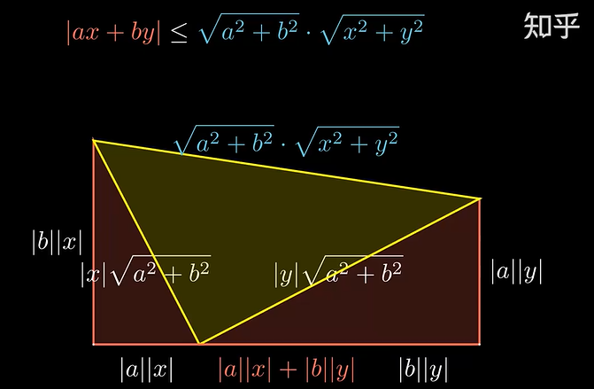
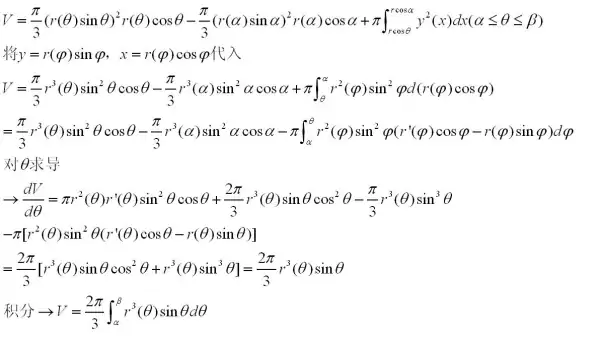

# 定积分

## 定义

- **分割法求面积**：$S_n = \sum\limits_{i=1}^n \frac{1}{n}·(\frac{i-1}{n})^2$。若 $i-1$ 可以换成中值 $\xi$，或者右端点值 $i$，那么称为可积（？）
- **黎曼可积**：
  - 设 $f$ 是 $[a,b]$ 上有界函数
    - 取**划分** $P:a = x_0 < x_1 < ... < x_n = b$
    - 在**划分区间**中取点 $\xi_i\in [x_{i-1},x_i]$
    - **区间长度**设为 $\D x_i$
    - 设**最大长度** $\l = \max\limits_{1\leq i\leq n} \D x_i$
  - 若 $\l\to 0$ 时，**黎曼和**的极限 $\lim\limits_{\l\to 0} \sum\limits^n_{i=1} f(\xi_i)\D x_i$ 存在，且与 $P$ 和 $\xi_i$ 的取法无关
  - 则称 $f$ 在 $[a,b]$ 上Riemann可积
- **定积分**：$\lim\limits_{\l\to\infty} S_n$ 称为 $f$ 在 $[a,b]$ 上的定积分 $I = \int^b_a f(x)dx$
  - **积分上限**：$b$
  - **积分下限**：$a$
<!-- - **划分**：在区间上取分点$\{x_i\}^n_{i=0}$，称为形成一个划分P -->

### 达布和

- **Darboux大和/小和**：若黎曼和的每个划分区间中 $\xi_i$ 都取最大值点/最小值点，则称其为达布大和/小和
  - **确界性**：达布大和为 $\sup S_n$，达布小和为 $\inf S_n$
- **达布划割引理**：若原划分中添加新分割点，则大和不增，小和不减（大和可能减，小和可能增）
  - **证明**：由确界定义易得结论
- **达布确界引理**：
  - 设
    - $\ol S$ 是达布大和，$\ul S$ 是达布小和
    - $M$ 和 $m$ 是 $f$ 在 $[a,b]$ 中的上/下确界
  - 则 $\forall P_1,P_2$ 都有 $m(b-a) \leq \underline{S}(P_2) \leq \ol{S}(P_1) \leq M(b-a)$
  - **证明**：
    - 由确界定义易得最前和最后两个不等式
    - 要证中间的不等式，只需取细于 $P_1,P_2$ 的划分 $P_3$，则由达布划割引理就有 $\ul S(P_2) \leq \ul S(P_3) \leq \ol S(P_3) \leq \ol S(P_1)$
- **达布定理**：
  - 设所有的划分中，$L$ 为最小的大和 $\inf \ol S$，$l$ 是最大的小和  $\sup\ul S$
  - 则对任意 $[a,b]$ 上有界的函数 $f$ 都有 $\begin{cases} L = \lim\limits_{\l\to 0}\ol S(P) \\ l = \lim\limits_{\l\to 0}\ul S(P) \end{cases}$
    - 最大的小和是无限分割的大和，最小的大和是无限分割的小和，若极限值相等，说明无限分割时大小和相等，从而可积
  - **证明**
    - 任取 $\e$，由 $L$ 是下确界，存在划分 $P$ 满足 $\ol S(P) - L < \e$
      - $P$ 的作用是引出 $\e$
    - 设 $\delta = \min\{\D x_i，k\e\}$，以其为最大区间长，构造划分 $P'$
      - $P'$ 的作用是引出 $\d$
    - 在 $P'$ 中插入新分点，构成 $P^*$
      - $P^*$ 的作用是引出上下界不等式，从而组合 $\delta$
    - 依赖关系：$\e\xto{决定} P \xto{决定} \d \xto{决定} P' \xto{划割} P^*$
    - 将 $\ol{S}(P') - L$ 裂项为下面三个式子的和
      - $[\ol{S}(P') - \ol{S}(P^*)] < (M-m)\d \sim \e$
        - 由达布确界引理，在每个划分区间中进行上下界放缩
        - 设 $P'$ 中共有 $p$ 个区间，则设 $k = \dfrac{1}{(p-1)(M-m)}$ 即得 $\e$
      - $[\ol{S}(P^*) - \ol{S}(P)] < 0$
        - $P^*$ 更细，由达布划割引理，上式是负数
      - $[\ol{S}(P)-L] < \e$
        - 由确界定义引出 $\e$ 之一
      - 综上即得 $[L - \ol S(P')] < \e$，再由 $\e$ 任意性即得 $L = \lim\limits_{\l\to 0} \ol S$
  - **理解**：还是不断放缩的过程，和前面的本质没什么差别

### 黎曼可积条件

- **黎曼可积条件**：设 $f$ 在 $[a,b]$ 上有界，则以下命题等价
  - $f$ 黎曼可积
  - **最小大和 = 最大小和**：$\sup \ul S = \inf \ol S$
  - **无限细分割中，大和=小和**
  - **黎曼和的极限存在**：$I = \lim\limits_{\l\to 0}\sum\limits^n_{i=1} f(\xi_i)\D x_i$
  - **证明**：
    - 由黎曼可积的定义，$(1)\LR (4)$
    - 由达布定理，$(2) \LR (3)$
    - 由达布和的定义，$(3) \LR (4)$
  <!-- - **必要性**：夹挤易得
  - **充分性**：
    - 由 $M$ 确界性，存在 $\xi_i$ 使 $|M-f(\xi_i)| < \e$
    - 再由 $|b-a|\e \to 0$ 即可得到 $|\ol{S}(P)-\sum\limits^n_{i=1}f(\xi_i)\D x_i| < \e$ -->
  <!-- - **本质**：
    - 无限分割的$\D x$是高阶无穷小（相对于$\D f(\xi)$而言）（数学本质就是振幅$\omega$极限为0）
    - 闭区间上只有有限个不连续点的有界函数可积：单独给每个不连续点一个无穷小区间，设$\delta = \frac{\e}{4k(M-m)}$
      - k用来消去k个不连续点的累加
      - M-m用来消去有界的不连续点造成的影响
      - $\e$用来引出无穷小量
      - 连续区间共有k+1个，不连续区间共有k个，共有2k+1个子区间。（4不用管） -->
- **振幅和定义法**：
  - 设划分区间的振幅为 $w_i = M_i-m_i$
  - 则 $f$ 黎曼可积 $\LR f$ 的振幅和 $\lim\limits_{\l\to 0}\sum\limits^n_{i=1} w_i\D x_i = 0$

### 习题

- **闭区间上连续函数可积**
  - **证明**：
    - 由连续性，$\forall \e>0，\exists \d > 0$，取 $\l<\d$ 时有 $\forall w_i<\e$
    - 则此时振幅和 $\lim\limits_{\l\to 0}\sum\limits^n_{i=1} w_i\D x_i < \e\sum\limits^n_{i=1} \D x_i = (b-a)\e \to 0$（**证毕**）
- **闭区间上单调函数可积**
  - **证明**：
    - 易得闭区间上的单调函数必定有界
    - 不妨设 $f$ 单增
    - 由单调性，任意划分区间中都有 $w_i = f(x_i) - f(x_{i-1})$
    - 不妨取均等划分 $x_i-x_{i-1} = \dfrac{1}{n}\pad (n\to\infty)$
    - 则此时振幅和 $= \cfrac{f(b)-f(a)}{n} \to 0$（**证毕**）
- **闭区间上仅有限点不连续的有界函数可积**
  - **证明**：
    - 设不连续点为 $\{x_i\}^m_{i=1}$，取它们的一共 $m$ 个邻域，使得邻域外的点均连续
    - 则转化为证明这 $m$ 个邻域内的振幅和为 $0$
    - 取定 $\e$
    - 由于 $f$ 有界，故每个邻域的振幅满足 $w_i < M-m$，再取邻域半径足够小即可得振幅和 $<\e$，从而极限趋于 $0$（**证毕**）
- **闭区间上不连续点收敛的有界函数可积**：
  - 设 $[a,b]$ 上有界函数 $f$ 的不连续点为 $\{x_n\}^\infty_{n=1}$，若 $\lim\limits_{n\to\infty} x_n$ 存在，则 $f(x)$ 可积
  - **证明**：
    - 由收敛性，设不连续点极限为 $x_0$，则存在一个 $O(x_0,\d)$，使得其外的不连续点数量有限，故只需讨论该邻域内的可积性即可
    - 再由 $f$ 有界性，放缩即可得振幅和为 $0$（**证毕**）
  - **实例**：$f(x) = \begin{cases} 0 & x=0 \\ \dfrac{1}{x}-[\dfrac{1}{x}] & x \in (0,1] \end{cases}$，不连续点集中在 $x=0$ 处
- **复合可积性**：
  - 若 $f$ 在 $[a,b]$ 上可积，$A\leq f\leq B$，$g$ 在 $[A,B]$ 上连续
  - 则 $g\circ f$ 在 $[a,b]$ 上可积
  - **证明**：
    - 和连续函数复合传递性的证明相似。化为黎曼和语言即可
- **黎曼函数可积**：
  - **证明1**：分成两种区间，讨论其振幅和
    - 一种是 $R(x) < \dfrac{\e}{2k}$
      - 此时黎曼和的分母单元无穷小。虽然这样的区间有无限个，但总体区间长度是有限的，故放缩可得振幅和无穷小
    - 一种是 $\D x_i < \dfrac{\e}{2k}$
      - 此时分母单元有界，从而振幅有界。但这样的区间只有有限个，且区间长度无穷小，故放缩可得振幅和无穷小
  - **证明2**：
    - 将 $[0,1]$ 均分为 $n$ 份，易得振幅为 $\dfrac{1}{k}$ 的情况至多出现在 $k-1$ 个区间中
    - 不妨设 $n = \dfrac{m(m+1)}{2}$，则振幅和为 $\dfrac{2}{m(m+1)}(\dfrac{1}{2}+\dfrac{2}{3} + ... + \dfrac{m-1}{m}) \sim \dfrac{2(m-\ln m)}{m(m+1)} \to 0$
- **狄利克雷函数不可积**：
  - 微观上来看，它处处不连续，且振幅处处有界，所以找不到可以以直代曲的无穷小区间。
  - 宏观上来看，它是离散的点组成的，相当于让你求无限条直线的面积
- **$L^p$ 范数的极限**：
  - 设 $f,g$ 在 $[a,b]$ 上连续，且 $f\geq 0，g>0$
  - 则 $$ \lim\limits_{n\to\infty} \dkh{\int^b_a \Big[ f(x) \Big]^ng(x)dx}^{\dfrac{1}{n}} = \max_{a\leq x\leq b} f(x)$$
  - **证明（泛函方法）**：
    - 易得 $g$ 有界，故由积分上下界不等式 + 夹逼法可删去 $g$，转化为泛函分析的范数关系式 $\lim\limits_{n\to\infty} \|f\|_{L^n(\R)} = \|f\|_{L^\infty(\R)}$
  - **证明（数分方法）**：
    - 其实这就是数列的奥特曼极限的积分形式。尝试仿照奥特曼极限用夹逼法做
    - 设 $\max f = M$
    - 首先由积分上界不等式，左式 $\leq \lim\limits_{n\to\infty} \sqrt[n]{|M|^n(b-a)} = M$
    - 再由积分第一中值定理，存在 $\xi\in [a,b]$ 使得左式 $= \lim\limits_{n\to\infty}\sqrt[n]{|f(\xi)|^n(b-a)}$
      - 再由于 $f$ 有界，故 $\forall n$ 都存在 $\d(n)>0$ 使得 $|f(\xi)|^n \geq \d(n)|M|^n$
      - 从而左式 $\geq \lim\limits_{n\to\infty}\sqrt[n]{ \d(n)|M|^n(b-a)}$（错的，这个右式是小于 $M$ 的）
      - 但是证明思路肯定是没问题的。我应该把重心放在对 $\xi$ 位置的讨论上
    - 奥特曼极限的原理是，项的值越大，其取幂时的增长速度越快。且幂极限之间的差值远远超过其它项。所以最终取极限时，最大项的权值会膨胀到无穷大。
    - 积分和有限数列和的区别是，有限和是离散对象，每项的初始权值都是 $1$。而积分是连续对象，每项的初始权值是无穷小。所以相比奥特曼极限，我们在这里还需要多考虑一个无穷小量 $\D x_i$。不过既然该结论成立，也就是需要我们证明，这个无穷小量的加入是无伤大雅的
    - 取均匀划分 $x_i = \dfrac{i}{n}$，将左式写成黎曼和形式。不难发现题目等价于证明 $\lim\limits_{n\to\infty}\sqrt[\large n]{\dfrac{1}{n}\sum\limits^n_{i=1} |f(\xi_i)|^n} = \max f(x)$。也就是说积分形式的结论和级数形式结论是等价的（这不还是奥特曼极限的夹逼法来做吗？气死我了。原来我和答案只差一个黎曼和吗？）
    - 由于 $\forall |f(\xi_i)| > 0$，故左式 $\geq \lim\limits_{n\to\infty}\sqrt[\large n]{\dfrac{1}{n}|M|^n} = M$。**证毕**
  - hx跟我狂吹的这道“有意思的题”不过是一个普通教材的课后题而已……

## 定积分的性质

- 以下均设 $f,g$ 在 $[a,b]$ 上可积
- **线性**
  - **证明**：黎曼和具有线性 + 极限具有线性 = 定积分也有线性
- **乘积可积性**
  - **证明**：黎曼和 + 三角不等式（仿照极限的乘法）
  - **推论**：乘积的定积分 $\neq$ 定积分的乘积
<!-- - **有界性**
  - **证明**：废话，极限存在可不就是有界吗 -->
- **连续性**：$\int f(x+h) \to \int f(x) \quad (h\to 0)$
  - **证明**：
    - 只需证明 $[a,a+h]$ 和 $[b,b+h]$ 上积分值相等即可
    - 由于这两个区间都是无穷小，故黎曼和极小，积分值均为 $0$
- **保序性**：若 $[a,b]$ 上恒有 $f(x)\geq g(x)$，则任意子区间 $I$ 上有 $\dis\int_I f(x)dx \geq \int_I g(x)dx$
  - **证明**：由黎曼和的保序性直得结论
- **绝对可积性**：$\dis \abs{\int^a_b f(x)dx} \leq \int^a_b|f(x)|dx$
  - **证明**：讨论黎曼和即可
- **区间可加性**：$\dis\int^a_b f(x)dx + \int^b_c f(x)dx = \int^a_c f(x)dx$
  - **证明**：讨论黎曼和即可
- **积分第一中值定理**：设 $f,g$ 在 $[a,b]$ 上连续，$g$ 在其上不变号，则存在 $\xi\in (a,b)$ 使得 $\dis\int^b_a f(x)g(x)dx = f(\xi)\int^b_a g(x)dx$
  - **证明**：
    - **存在性**：取上下界 + 连续函数的介值定理即可
    - **中值点性**：设 $\xi = a$，则 $\dis\int^b_a \Big[ f(x)-f(a) \Big]g(x)dx = 0$
      - 易得被积函数有正有负，故由连续性得存在零点 $c$，从而取 $\xi = c$ 即可
    - **中值性**：设 $f(\xi) = m$，则 $\dis\int^b_a \Big[ f(x)-m \Big]g(x)dx = 0$
      - 同上，由连续性得必定 $f(x)-m$ 必定存在零点 $c$，取 $\xi = c$ 即可
    - 零点存在定理本质是介值性，故将 $f$ 的连续性退化为介值性也可
  - **推论（积分上下界不等式）**：若 $[a,b]$ 上恒有 $f\in [m,M]$，则 $\dis\int^a_b f(x)dx \in [m(b-a), M(b-a)]$
    - **证明**：讨论黎曼和即可

### 习题

- **积分不等式**：设 $f(\cfrac{a+b}{2}) = 0$，$M = \sup|f''(x)|$，则 $\dis\int^b_a f(x)dx \leq \frac{M(b-a)^3}{24}$
  - **证明**：
    - 构造原函数 $F$，应用泰勒展开即可
    - 或利用 $\dis\int^b_a (x-\frac{a+b}{2})dx = 0$
- **中值点阶的估计**：
  - 设 $f$ 在 $[0,1]$ 上二阶连续可微，$f'(0) = 0，f''(0) \neq 0$
  - 则对任意 $x\in (0,1)$ 都有 $\xi(x)\in (0,x)$ 使得 $\dis\int^x_0 f(t)dt = f(\xi)x$，且 $\lim\limits_{x\to 0+} \dfrac{\xi(x)}{x} = \dfrac{1}{\sqrt{3}}$
  - **证明**：
    - 由积分中值定理易得存在性，只需证明阶数关系即可
    - 洛必达易得 $$\lim_{x\to 0+} \frac{\int^x_0 f(t)-f(0)}{x^3} = \frac{f''(0)}{6} \tag{1}$$ 和 $$\lim_{x\to 0+} \frac{x^2}{f(x)-f(0)} = \frac{2}{f''(0)} \tag{2}$$
    - 再由 $f$ 连续性，可将第二式中的 $x$ 替换为 $\xi(x)$（不是对 $f(\xi(x))$ 直接洛必达，而是先洛出等式后再替换）
      - 再将 $(1)$ 和替换后的 $(2)$ 相乘，结合题设等式即得 $\lim\limits_{x\to 0+} \dfrac{\xi(x)^2}{x^2} = \dfrac{1}{3}$，开平方即得结论

### 基本积分不等式（更一般的形式详见[偏微分方程](../../偏微分方程/0.衔接.md)）

- **不等式的多种形式**：
  - 由于定积分的保序性，函数间的不等式可直接套用到定积分中
  - 由于定积分的黎曼和定义，级数间的不等式可直接套用到定积分中
- **Young不等式**：
  - 设 $f$ 在 $[0,a]$ 上可积、可逆、严格单增，且 $f(0) = 0$
  - 则 $\dis\int^a_0f(x)dx + \int^b_0f^{-1}(y)dy \geq ab$
  - 当 $b = f(a)$ 时等号成立
  - **证明（等号）**：
    - 利用反函数的图像关于 $y=x$ 对称即可。由于有了单调性前提，这题用几何意义就能很容易做出来
    - 由严增性，可取两个函数的黎曼和极小划分满足以下关系 $$\begin{cases} \D y_i = f(x_i)-f(x_{i-1}) \\\\ \D x_i = f^{-1}(y_i)-f^{-1}(y_{i-1}) \end{cases}$$
    - 再由单增性 + 可积性，黎曼和可裂项相消，即 $$\sum y_{i-1}(x_i-x_{i-1}) + \sum x_i(y_i-y_{i-1}) = x_ny_n-x_0y_0$$
      - 注意，这个形式不是随便配凑的，必须一个取左端点，一个取右端点，才能达到相消的效果。
    - 因此我们得到下面的等式 $$\int^c_0f(x)dx + \int^{f(c)}_0f^{-1}(y)dy = cf(c)$$
  - **证明（不等号）**：
    - 设 $f(c) = b$，$\dis F(a) = \int^a_0f(x)dx + \int^{b}_0f^{-1}(y)dy - ab$
    - 易得 $F'(a) = f(a)-b$
      - 由 $f$ 单增性，$(0,c)$ 上 $F\searrow$，$(c,+\infty)$ 上 $F\nearrow$
      - 而前面已知 $F(c) = 0$，从而得到结论
  - **推论**
    - 若 $\dfrac{1}{p} + \dfrac{1}{q} = 1$，则 $ab \leq \dfrac{a^p}{p} + \dfrac{b^q}{q}$
      - **证明1**：用 $\ln$ 的上凸性，详见前面
      - **证明2**：设 $f(x) = x^{p-1}$，由Young不等式易得结论
- **琴生不等式**
- **Holder不等式**：
  - **范数形式**：若 $\dfrac{1}{p}+\dfrac{1}{q} = 1$，则 $(f,g) \leq \|f\|_p\|g\|_q$
  - **积分形式**：设 $\dfrac{1}{p} + \dfrac{1}{q} = 1$，则 $$\int^b_a |f(x)g(x)|dx \leq \dkh{\int^b_a|f(x)|^p dx}^{\frac{1}{p}}\dkh{\int^b_a|g(x)|^q dx}^{\frac{1}{q}}$$
  - **证明**：
    - 这个简化技巧非常有用，一定要学会
    - 设 $\p(x) = \cfrac{|f(x)|}{(\dis\int^b_a |f(x)|^pdx)^{\frac{1}{p}}}，\psi(x) = \cfrac{|g(x)|}{(\dis\int^b_a |g(x)|^qdx)^{\frac{1}{q}}}$
    - 由于分母是个常数，故不影响积分值。只需证明 $\dis\int^b_a \p(x)\psi(x)dx \leq 1$ 即可
    - 由前面结论，$\p\psi \leq \dfrac{\p^p}{p} + \dfrac{\psi^q}{q}$，从而得到结论
<!-- - **中间式和、平方式和**
  - 平方式和的乘积：$(a_1^2+a_2^2+...)(b_1^2+b_2^2+...)$
    - 积 复合平方式和：$a_1^2b_1^2+...$
  - 和 复合平方式和：$(a_1+b_1)^2+...$
    - 平方式和：$a_1^2+a_2^2+...$
    - 中间式和：$a_1b_1+a_2b_2+...$
      - 复合中间式：$a_1b_1a_2b_2$
- **应用的原则**：
  - 首先我们得知道已有的不等式和需要导出的不等式
    - 它们可以分为根式和平方式
    - 根式必须要整体平方，所以考虑 -->
- **Cauchy-Schwarz不等式**：
    - Holder不等式中 $p=q=2$ 的情况
    - 后面学了泛函分析就知道，C-S不等式本质上是内积的关系式。这里给出的形式是连续函数空间上，以积分作为内积时的C-S不等式
  - **范数形式**：$(f,g) \leq \sqrt{(f,f)}\sqrt{(g,g)}$
  - **积分形式**：若 $f,g$ 在闭区间上可积，则 $$\Big[ \int^a_b f(x)g(x)dx \Big]^2 \leq \Big[ \int^a_b f^2dx \Big]\Big[  \int^a_b g^2dx \Big]$$
  - **级数形式**：$$(a_1b_1+a_2b_2)^2 \leq (a_1^2 + a_2^2)(b_1^2 + b_2^2) \red\Rightarrow 2a_1b_1a_2b_2 \leq a_1^2b_2^2 + a_2^2b_1^2$$
     <!-- 基本不等式的 $(a+b)^2 \leq 2(a^2+b^2)$
     向量的 $(\vec{a}·\vec{b})^2 \leq a^2·b^2$
     左：通过**中间式和的平方**导出**复合中间式**。右：通过**平方式和的乘积**导出**积复合平方式和**
     - **使用意义**：
     - 积分平方 $\Rightarrow$ 平方积分的乘积
     - 小积和 $\Rightarrow$ 和大积 -->
- **Minkowski不等式**：
  - 后面学了泛函分析就知道，Minkowski不等式其实就是 $L^p$ 范数的三角不等式
  - **范数形式**：$\|f+g\|_2 \leq \|f\|_2+\|g\|_2$
  - **积分形式**：$\sqrt{\int [f+g]^2} \leq \sqrt{\int f^2} + \sqrt{\int g^2}$
  - **级数形式**：$$\sqrt{(a_1+b_1)^2 + (a_2+b_2)^2} \leq \sqrt{a_1^2+a_2^2} + \sqrt{b_1^2 + b_2^2}$$
  <!-- - 左：通过**和复合平方式和**导出**中间式和的平方**，右：通过**平方式和的根式的和**构造**二次平方**导出**平方式和的乘积**，
  - **使用意义**：
    - 平方和积分 $\Rightarrow$ 平方积分根号和
    - 小和平方的和 $\Rightarrow$ 大平方和的根式和 -->

#### 习题

- **瞎jb凑的不等式**：
    - **级数形式**：$$|\sqrt{x_1^2+x_2^2} -\sqrt{y_1^2+y_2^2}| \leq \sqrt{(x_1-y_1)^2+(x_2-y_2)^2} \leq |x_1-y_1|+|x_2-y_2|$$
      - 左边是Minkowski不等式的减法形式，右边是基本不等式
    - **积分形式**：$\sqrt{\int f^2}-\sqrt{\int g^2} \leq \sqrt{\int (f-g)^2} \leq \int |f-g|$
- **常用的Holder不等式**：
  - **形式1**：
    - **级数形式**：$\sqrt{a_1b_1} + \sqrt{a_2b_2} \leq \sqrt{a_1+a_2}\cdot\sqrt{b_1+b_2}$
    - **积分形式**：Holder不等式关于函数 $\sqrt{f},\sqrt{g}$，参数 $p=q=2$ 时的特殊形式
  - **形式2**：
    - **级数形式**：$|a_1b_1 + a_2b_2| \leq \sqrt{a_1^2+a_2^2}\cdot\sqrt{b_1^2+b_2^2}$
    - **积分形式**：Holder不等式关于函数 $f,g$，参数 $p=q=2$ 时的特殊形式
    - **几何意义**：
    

## 微积分基本定理

- **上限函数**：$F(x) = \dis\int^x_0 f(t)dt$
  - **存在条件**：若 $f$ 可积，则  $F$ 存在
    - 可积函数的上限函数一定存在，但不一定可导，故不一定是原函数
  - **原函数条件**：若 $f$ 连续，则 $F$ 是 $f$ 的一个原函数
    - **证明**：导数定义 + 微分中值定理 + $f$ 的连续性
    - 当把积分下限 $0$ 替换为其它常数时，相当于改变 $C$ 的值
  - **反例（$f$ 不连续）**：设 $f(x) = \begin{cases} \sin\frac{1}{x}, & x\in (0,1] \\ 0, & x=0 \end{cases}$，其可积，但不连续，故上限函数不可导
  - **实例（连续但不可微的分段函数）**
      - 对于连续的分段函数，比如 $f(x) = \begin{cases} x & [0,1] \\ 2x-1 & [1,2] \end{cases}$
      - 若分别对其两个分段作积分，则取不同的 $C_1,C_2$ 值可以得到无数个函数，但大多都不可导，所以不是原函数
      - 只有函数 $F(x) = \begin{cases} \dfrac{1}{2}x^2 & [0,1] \\ x^2-x+\dfrac{1}{2} & [1,2] \end{cases}$ 才在 $x=1$ 处连续可导
- **微积分基本定理**：设 $f$ 在 $[a,b]$ 上连续，$F$ 是其上的原函数，则 $\dis\int^b_a f(x)dx = F(b)-F(a)$
  - **证明**：由微分的唯一性，原函数之间只会相差一个常数
    - 故可设 $F(x) = \dis\int^x_0 f(x)dx + C$
    - 直接验证等式即可
  - **强化**：若除有限个点外都有 $F'(x) = f(x)$，则也满足微积分基本定理
    - **证明**：
      - 取划分，使得不连续点都在区间端点上。再对每个区间内部使用L中值定理，即得 $F(b) - F(a) = \sum\limits^n_{i=1} f(\xi_i)\D x_i = \int f$
- **经典反例**：
  - **可积无原函数**：
    - 不连续的可积函数
    - 黎曼函数
  - **有原函数不可积**：
    - **开区间（反常积分不收敛）**：在 $(0,1)$ 上的 $\dfrac{1}{x}$
    - **闭区间（函数无界）**：在 $[0,1]$ 上的 $f(x) = \begin{cases} 2x\sin\frac{1}{x^2} - \frac{2}{x}\cos\frac{1}{x^2} & x\neq 0 \\ 0 & x=0\end{cases}$
      - 它的原函数为 $F(x) = \begin{cases} x^2\sin\frac{1}{x^2} & x\neq 0 \\ 0 & x=0\end{cases}$，可导但导函数无界
    - **Volterra函数**：处处可导，导数有界，但导函数甚至勒贝格不可积
      - 本质是将 $0$ 附近的 $x^2\sin\dfrac{1}{x^2}$ 通过构造推广到整个实数轴上
- **弱化定理**：闭区间上有定义、有原函数的 $f$，其反常积分收敛
  - **证明**：由N-L公式易得结论

### 习题

- **复合函数积分求导**：$\dis\int^{u(x)}_0 f(t)dt$ 的导数是 $f(u)·u'(x)$，
  - **证明**：由链式法则可得
- **含参变量积分**：
  - 设 $f$ 连续，若 $\dis\int^1_0 tf(2x-t)dt = \frac{1}{2}\arctan(x^2)$，求 $\dis\int^1_2 f(x)dx$ 
    - **解**：
      - 在左式中，$t$ 是变量，$x$ 是参量，它实际上是后面章节的含参变量积分。这里把 $x$ 当成未定常数处理即可
      - 换元 $u(t) = 2x-t$，再对 $x$ 求导即可
  - 设 $\dis f(x)=\frac{1}{2}\int^x_0(x-t)^2g(t)dt$，则 $\dis f'(x) = x\int^x_0g(t)dt - \int^x_0tg(t)dt$
- **含积分的极限**：洛必达法则即可
- **乘法对称性**
  - $\dis\int^4_1 f\dkh{\frac{x}{2}+\frac{2}{x}} \frac{\ln x}{x}dx = (\ln 2)\int^4_1 f\dkh{\frac{x}{2}+\frac{2}{x}} \frac{1}{x}dx$
    - **证明**：同构法，令 $t = \frac{4}{x}$，发现积分形式可以化为和原来相同
    - **理解**：
      - $g(x) = \dfrac{2}{x} + \dfrac{x}{2}$ 在 $x=2$ 处关于乘法对称，故 $f(x) = f(\dfrac{4}{x})$
      - 已知关于加法对称时可分解，故关于乘法对称也可分解。剩下的项仅用于处理换元时产生的余项
  <!-- - $\dis\int^a_1 f\dkh{x^2+\frac{a}{x^2}} \frac{1}{x}dx = \int^a_1 f\dkh{x+\frac{a}{x}} \frac{1}{x}dx$
    - **证明**： -->

### 特殊函数的积分

- **周期函数的积分**
  - **证明**：换元积分法，或区间可加性
- **奇偶函数的积分**
- **正交函数列**：若一列函数 $\{g_i\}$ 满足下列性质，则称其为正交函数列 $$\int^b_a g_m(x)g_n(x)dx = \begin{cases} 0, & m\neq n \\\\ \dis\int^b_a g^2_n(x)dx > 0, & m=n \end{cases}$$
  - **实例**：
    - 勒让德多项式为 $[-1,1]$ 上的正交多项式列
      - **证明**：分部积分和导数降次性（根性）即可解决
    - 三角函数列：$\{1,\sin x,\cos x,\sin 2x,\cos 2x,...\}$为$[2k\pi,2(k+1)\pi]$上的正交函数列
      - **证明**：积化和差即可
- **三角函数复合积分公式**
  - $\dis\int^\frac{\pi}{2}_0 f(\sin x,\cos x)dx = \int^\frac{\pi}{2}_0 f(\cos x,\sin x)dx$
    - **证明**：换元 $t=\frac{\pi}{2}-x$ 即可
    - **理解**：都是从0到1的积分，而且 $y$ 与 $x$ 的对应全部相同，只是顺序反了，故积分值相等
    - **应用**：
      - $\dis\int^{\frac{\pi}{2}}_0 \ln(\tan x) = 0$
        - **证明**：写成 $\sin,\cos$ 的形式即得结论
      - $\dis\int^{\frac{\pi}{2}}_0 \frac{\sin^k x}{\sin^k x+\cos^k x} = \int^{\frac{\pi}{2}}_0 \frac{\cos^k x}{\sin^k x+\cos^k x} = \int^{\frac{\pi}{2}}_0 \frac{dx}{1+\tan^k x} = \frac{\pi}{4}$
        - **证明**：前两式相等，而它们相加值为 $\int 1dx$，故除以2即得结论
  - $\dis\int^\pi_0 xf(\sin x)dx = \frac{\pi}{2}\int^\pi_0 f(\sin x)dx$
    - **证明**：换元 $t = \pi-x$
    - **应用**：
      - $\dis\int^{\pi}_0 \frac{x\sin x}{1-\cos^2x}dx$
- **对称函数积分公式**
  - 设 $f$ 关于 $x=T$ 轴对称
  - 则 $\dis\int^b_a f(x)dx = \int^{2T-b}_a f(x)dx + 2\int^b_Tf(x)dx$
  - **证明**：
    - 易得 $2T-b$ 是b关于T的对称点
    - 换元积分即可
<!-- - **不定积分到定积分的转化**：
  - $\dis\int f(x)dx = \int^x_0 f(s)ds + F(0)$
  - $\dis\int f(x)dx = \int^x_{x_0} f(s)ds$（原函数零点）
  - $\dis\int f(x)e^{\int g(x)dx}dx = \int^x_0 f(s)e^{\int^s_0 g(t)dt + G(0)} ds + FE_{(即fe^{\int})}(0)$ -->

### 积分实例

<!-- - 垃圾题目**
  - 设 $f(x) = \ln x - \dis\int^e_1 f(x)dx$，求 $\dis\int^e_1 f(x)dx$
    - **解**：由于定积分结果是个常数，故两边取定积分即可 -->
- **奇偶积分**：
  - $\dis\int^{\pi}_{-\pi} \frac{x\sin x\cdot\arctan e^x}{1+\cos x}dx$
    - 易得是奇函数，故积分值为0
  - $\dis\int^a_{-a}\frac{1+\sin x}{1+\sqrt[3]{x^2}}dx$
    - **解**：
    - 易得 $f(x)+f(-x) = \dfrac{2}{1+\sqrt[3]{x^2}}$，故转化为 $\dis\int^a_0 \frac{1}{1+\sqrt[3]{x^2}}dx$
    - 换元 $\tan^3 t = x$ 即可
- **常用三角积分**：
  - $\dis\int\sin nx\cos nxdx$
    - **解**：正交函数列
  - $\dis\int\cos^m x\sin^nxdx$
    - **解**：分部积分
- **Wallis公式**：$\dis\int^{\dfrac{\pi}{2}}_0 \sin^mx\cos^n xdx = \begin{cases} \cfrac{(m-1)!!(n-1)!!}{(m+n)!!}\cfrac{\pi}{2} & m,n均为偶数 \\\\ \cfrac{(m-1)!!(n-1)!!}{(m+n)!!} & 其它情况 \end{cases}$
  - **证明**：由前面不定积分的递推公式易得结论
- **欧拉积分**：$I = \dis\int^{\dfrac{\pi}{2}}_0 \ln(\sin x)dx = -\frac{\pi}{2}\ln 2$
  - **解**：
    - 使用升幂公式 $\sin x = 2\sin\dfrac{x}{2}\cos\dfrac{x}{2}$ 后裂项，再由 $\sin$ 和 $\cos$ 关于 $\dfrac{\pi}{2}$ 的对称性，重新组合后得到方程，求解后再换元 $\dfrac{x}{2}$ 为 $x$ 即得结论
  - **应用（三角函数和分式函数的混合积分）**：
    - $\dis\int^{\frac{\pi}{2}}_0 \frac{x}{\tan x}dx$
      - 分部积分，积 $\dfrac{1}{\tan x}$
    - $\dis\int^{1}_0 \frac{\ln x}{\sqrt{1-x^2}}dx$
      - 换元 $x = \sin t$，或分部积分积 $\dfrac{1}{\sqrt{1-x^2}}$
    - $\dis\int^{1}_0 \frac{\arcsin x}{x}dx$
      - 换元 $x = \sin t$，或分部积分导 $\arcsin x$
    - $\dis\int^{\pi}_0 \frac{x\sin x}{1-\cos x}dx = 0$
      - 分部积分导 $x$，化为 $\dis\int^\pi_0 \ln(1-\cos x)dx$，再用升幂公式即可
- **狄利克雷核积分**：$\dis\int^\pi_0 \frac{\sin\dfrac{2n+1}{2}x}{2\sin\dfrac{x}{2}}dx = \frac{\pi}{2}$
  - **证明**：
    - 只需将分子拆成级数和即可
    - 积化和差 + 裂项相加得 $$ 2\sin\frac{x}{2}\sum^n_{k=1} \cos kx = \sum^n_{k=1} \Big[ \sin\frac{2k+1}{2}x - \sin\frac{2k-1}{2}x \Big] $$
    - 原积分转化为 $$\int^\pi_0 \frac{2\sum\limits^n_{k=0} \cos (kx) +1}{2} dx = \int^\pi_0 \frac{1}{2}dx$$
  - **变体**：
    - $\dis\int^{\dfrac{\pi}{2}}_0 \frac{\sin (2n+1)x}{\sin x}dx = \frac{\pi}{2}$
      - 换元 $u=\dfrac{x}{2}$ 即可
    - $\dis\int^\pi_{\dfrac{\pi}{2}} \frac{\sin (2n+1)x}{\sin x}dx = (-1)^n\int^{\dfrac{\pi}{2}}_0 \frac{\cos(2n+1)x}{\cos x}= \frac{\pi}{2}$
    - 换元 $u=x-\dfrac{\pi}{2}$ 可得第一个等式
    - 再由于 $\sin x$ 和 $\sin(2n+1)x$ 都关于 $x=\dfrac{\pi}{2}$ 对称，故积分值相等
  - **实例**：$\dis\int^{\dfrac{\pi}{2}}_0 \frac{\sin 3x}{\sin x}dx = \int^{\dfrac{\pi}{2}}_0 \frac{\sin 5x}{\sin x}dx = \frac{\pi}{2}$
    - 对任意 $n$ 都相等，很有用
- **Fejer核积分**：$\dis\int^{\dfrac{\pi}{2}}_0 \Big( \frac{\sin nx}{\sin x} \Big)^2 dx = \frac{n\pi}{2}$
  - **证明**：分部积分 $\cot x$ 后，分子分母同时乘 $\cos x$，再对分子积化和差即转化为狄利克雷积分
  - **变体**：
- **利用傅立叶级数求积分**：
  - $\dis\int^{\pi}_0 \frac{\cos x\sin(nx)}{\sin x}dx$
    - **证明**：
      - 易得被积函数为偶函数，故 $[-\pi,\pi]$ 上的积分为 $2$ 倍
      - 已知 $\cot x$ 的傅立叶系数 $b_n = \begin{cases} 2 & n为偶数 \\ 0 & n为奇数 \end{cases}$
      - 再由 $I_n = \dfrac{\pi b_n}{2}$ 即得结论
  - $\dis\int^{\dfrac{\pi}{2}}_0 \frac{\cos x\sin(nx)}{\sin x}dx$
    - **解**：
      - 易得上题的被积函数在 $n$ 为奇数时关于 $\dfrac{\pi}{2}$ 中心对称，偶数时轴对称
      - 故 $n$ 为偶数时，$I_n = \dfrac{\pi}{2}$，奇数未知
    - 实际上用积化和差公式 + 狄利克雷核积分也可做，多此一举了
- **积分不等式（朴素解法）**
  - $\dis\max\limits_{x\in [a,b]}|f(x)| \leq |\frac{1}{b-a}\int^b_a f(x)dx|+\int^b_a |f'(x)|dx$
    - |函数最值| $\leq$ |积分均值| + |函数两端差值|
    - **证明（自己想的）**：
      - 设 $M = \max\limits_{x\in [a,b]}|f(x)|$
      - 由微分中值定理，化为证明 $M-|f(\xi)| \leq \dis\int^b_a |f'(x)|dx$，其中 $\xi\in [a,b]$
      - 尝试证明 $左式\leq |f(b)-f(a)|$
        - 若 $f$ 单调，则上式显然成立
        - 若 $f$ 不单调，我们发现 $|f'(x)|$ 的积分相当于把 $f$ 的所有非单增区域转换为单增后，得到的新函数 $g$ 的 $|g(b)-g(a)|$
          - 也就是说，此时可以转化为单调情况，从而上式也就成立了
      - 综上就得到了结论
    <!-- - ***很多概念性的东西不能直接定量，但是可以用一个不等式弱化一下*** -->
  - 若 $f''(x) \geq 0$，则 $\dis\int^a_0 f(x)dx \geq af(\frac{a}{2})$
    - 画个图很容易就能发现成立。接下来将几何意义转化成数学语言即可（处理凸函数的常用方法：直线比较法）
    - **证明（直线比较法）**：
      - 等价于证明 $\dis\int^a_0 \Big[ f(x)-f(\frac{a}{2}) \Big]dx \geq 0$，被积函数设为 $g(x)$
      - 将积分区间分为 $[0,\dfrac{a}{2}]，[\dfrac{a}{2},a]$
      - 由于 $g$ 为下凸函数，且 $g(\dfrac{a}{2}) = 0$
        - 由之前的直线比较法，设 $L(x) = g'(\dfrac{a}{2})(x-\dfrac{a}{2})$，易得其在 $[0,a]$ 上积分为 $0$
        - 由导数容易发现，在 $[0,a]$ 上恒有 $g(x) \geq L(x)$，从而由定积分保序性即得结论
    - 因为是大于号，故用的不是琴生不等式的弦线（上方），而是凸集分离定理的切线（下方）
  - 若 $f''(x)\leq 0$，则 $\dis\int^1_0 f(x^2)dx \leq f(\frac{1}{3})$
    - **证明（泰勒法）**：
      - 泰勒展开得 $f(x) \leq f(\dfrac{1}{3}) + f'(\dfrac{1}{3})(x-\dfrac{1}{3})$
      - 将 $x$ 换为 $x^2$，两边积分即得结论
    - 凸函数性质太粗了，做不了这题。必须泰勒展开，采取更精细的放缩才行
- **分部积分与二重积分**：
  - $\dis\int^x_0 f(u)(x-u)du = \int^x_0 \Big[ \int^u_0 f(x)dx  \Big] du$
    - **证明**：先线性分解，再分部积分
    - **理解**：$f(u)(x-u)$ 可以看作函数的卷积 $f*x$，所以实际上它就是卷积公式。卷积内容详见偏微分方程和傅里叶分析
  - $\dis\int^b_a f(x)dx\int^b_xf(t)dt = F(a)-F^2(b)$
    - **证明**：超纲了，先不看了，后面再说
- **上限函数的应用**：若 $\dis\int^\pi_0 f(x)dx=0, \int^\pi_0 f(x)\cos xdx = 0$，则 $f(x)$ 至少有两个零点
  - **证明**：
    - 分部积分得 $\dis\int^\pi_0 F(x)\sin xdx = 0$，再由积分第一中值定理得存在 $F(\xi)=0$
    - 再易得 $F(0) = F(\pi) = 0$，由Roll中值定理，$F$ 最少有两个导数为0的点
    <!-- - 只需讨论 $[0,-\pi]$
    - 然后换元、积分合并，发现反三角函数arctan可以取恒定值 -->

## 定积分与几何计算

- **积分的同时性**：
- **积分的有阶性**：
  - 积分实际上积的是极小的三维体，而不是二维图形。dx就是那个极小值
  - 举个例子，用积分计算圆的面积时，$dS$ 是极小的扇形，而不是半径线段
  - 另一个很经典的例子，不可用平移法证明正方形和其内接圆的周长相等，因为（圆的弧长微分 $dl$）与（正方形两边的微分 $dx+dy$）的差值 $\D$ 始终不是（前两者的无穷小量），故在积分过程中不可忽略

### 计算图形面积

- **参数函数形式**：$\begin{cases} y = y(t) \\ x=x(t) \end{cases}$ 在 $t\in [a,b]$ 上的图像面积为 $S = \dis\int^b_a y(t)dt$
- **显函数形式**：$f(x)$ 在 $[a,b]$ 上的图像面积为 $S = \dis\int^b_a f(x)dx$
  - **证明**：由定积分的定义直得
- **极坐标形式**：$r = r(\t)$ 在 $[\a,\b]$ 上的图像面积为 $S = \dis\frac{1}{2}\int^\beta_\alpha r^2(\theta)d\theta$
  - **证明**：
    - 取角度极小的曲边三角形，由正弦定理，其面积为 $dS = \dfrac{1}{2}r(\t)r(\t+d\t)d\t$
    - 由 $r$ 的光滑性，$r(\t+d\t) = r(\t)$
    - 对这些三角形的面积取积分得 $S = \dis\int^\b_\a dS = 原式$

### 计算曲线弧长

- **显函数形式**：$L = \dis\int \sqrt{1^2+[f'(x)]^2}dx$
- **参数函数形式**：$\dis\int \sqrt{[x'(t)]^2+[y'(t)]^2}dt$
  - **证明**：
    - 只需证明：曲线取极小部分时，该部分可以近似看为直线（以直代曲）
      - 核心在于证明（曲线与直线的长度差）是（曲线长度）的无穷小量，从而在（对曲线长度积分）时，该差值可忽略不计
    - 设曲线长度的微分为 $dl$，将 $dl$ 两端连接起来的直线长度为 $dL$
    - 由勾股定理，$dL = \sqrt{dx^2+dy^2}$
    - 写成坐标形式即为 $\ol{P_{i-1}P_i} = \sqrt{[x(t_i)-x(t_{i-1})]^2 + [y(t_i)-y(t_{i-1})]^2}$
    - 由微分中值定理，$\ol{P_{i-1}P_i} = \sqrt{x'(\xi_i)^2 + y'(\eta_i)^2}dt$
    - 再由光滑性易得作差函数的振幅和为 $0$，从而积分值相等
    - 由Minkowski不等式，$\sqrt{x_1^2+y_1^2} - \sqrt{x_2^2+y_2^2} \leq \sqrt{(x_1-x_2)^2 + (y_1-y_2)^2}$
    - 再由三角不等式，$\leq |x_1-x_2| + |y_1-y_2| = w_1+w_2$
    - 再由可积性，两个振幅和均为 $0$，故相加起来也为 $0$
- **极坐标形式**：$\dis\int \sqrt{r^2(\theta) + [r'(\theta)]^2}d\theta$
  - **证明**：
    - 做变量代换 $\begin{cases} y = r\sin\t \\ x = r\cos\t \end{cases}$ 即可

### 计算几何体体积

- **沿坐标轴积分**：设 $x$ 的底面积为 $A(x)$，则 $V = \dis\int A(x)dx$
- **旋转体积分**：函数 $f(x)$ 绕 $x$ 轴旋转得到的几何体的体积
  - **显函数形式**：$\dis\int \pi f^2(x)dx$
  - **极坐标形式**：

### 计算旋转曲面面积

- **沿坐标轴积分**：
  - 已知圆台侧面积 $S = \pi(r+R)h$
  - 则 $f(x)$ 的旋转曲面面积为 $$\sum \pi (y(t_{i-1})+y(t_i))·\ol{P_{i-1}P_i} = \int \pi· 2y(t)\sqrt{[x'(t)]^2+[y'(t)]^2}dt$$

### 计算曲线曲率（详见[古典微分几何](../../解析与微分几何/古典微分几何)）

- **曲率半径**：一个弧所对应的圆的半径
  - $\theta = \frac{\D k}{2}，R = l/\theta，K = \theta/l$
  - $\Large K = \frac{d\varphi}{dl} = \frac{\frac{d\varphi}{dt}}{\frac{dl}{dt}}$（$\varphi$ 是切线倾斜角，l是弧长）