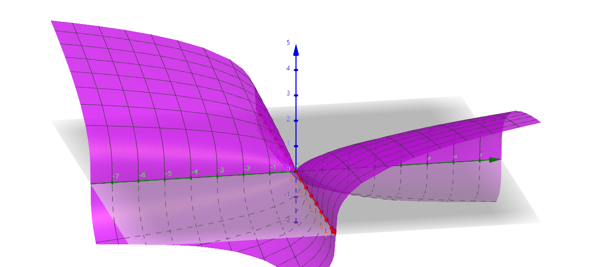
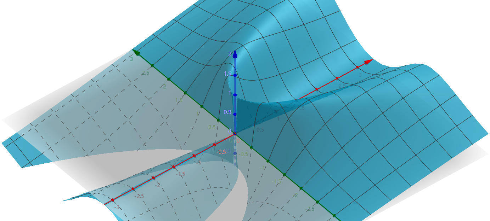
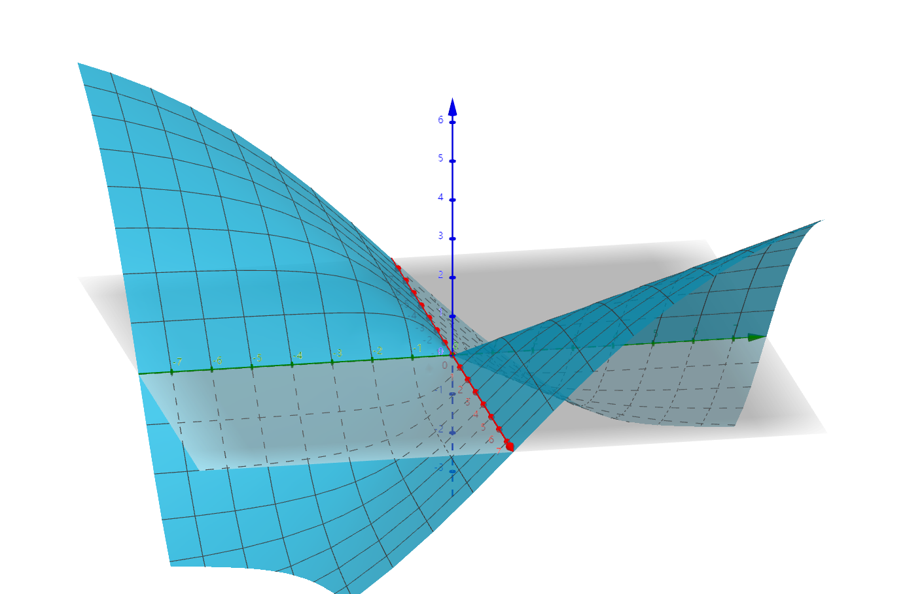
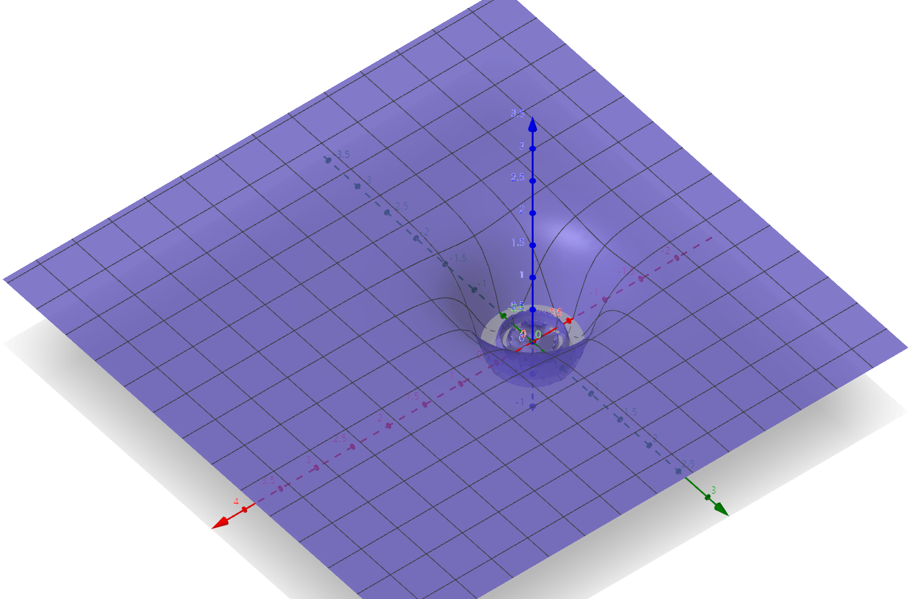

# 多元函数的微分

- 如果说上一章是把拓扑学搬到前面来了，那么这一章就是把微分几何搬到前面来了。另外只要是个分析学科就有泛函分析的影子，所以也一直在提它

## 多元函数的导数

### 偏导数

- **偏导数**：若 $\lim\limits_{\D x\to 0} \cfrac{f(x_0+\D x, y_0) - f(x_0,y_0)}{\D x}$ 存在，则称 $f$ 在 $(x_0,y_0)$ 处关于 $x$ 可偏导
  - **符号**：$f$ 在 $(x_0,y_0)$ 的偏导数记为 $\dfrac{\partial f}{\partial x}(x_0,y_0)$ 或 $f_x(x_0,y_0)$
- **几何意义**
  - 二元函数的图像是个曲面，求偏导数时会把另一个自变量$y$看成常数。
    - $f_x(x,y_0)$是截取$y = y_0$作为函数平面，表示这个平面上的函数的导数。（$y_0$的值不同，函数也不同）
    - $f_x(x_0,y)$是截取$x = x_0$这个点，然后研究$y$的变化对该点导数的值的影响情况
- **无连续性**：在某点可偏导，不能推出在该点连续
  <!-- - 一元函数
    - 连续的条件是$\D y的阶数$ $\geq$ $\D x的阶数$就行了
    - 而可导的条件是$\D y的阶数 \geq \D x的阶数$（有界）、以及$f'(x)_- = f'(x)_+$，以及x和y阶数相同时不跳跃（不是跳跃点），第二个条件不满足会导致突变
    - 可导 $\Rightarrow$ 连续
  - 多元函数
    - 连续的条件是**阶数**和**方向**
    - 可偏导的条件是**阶数**和**左右导数相同**（因为偏导是平面函数，连续是多面函数，所以可偏导 $\nRightarrow$ 多元函数连续）以及**和x同阶时不跳跃** -->

### 方向导数

- 选择一条直线作为方向进行求导，此时x轴和y轴都不是坐标轴，所以选择t作为该方向的自变量，但由于$z = f(x,y)$还是由x和y组成的，所以先把t转化成x和y，然后再转化成$g(t) = f(x,y)$，此时对 $t$ 求导就是方向导数
- **二元函数的方向导数**
  - 设 $\a$ 为平面上的方向角，即 $\begin{cases} x = t\cos\alpha \\ y = t\sin\alpha \end{cases}$
    - $\a$ 就是解析几何中提到的，平面上的方向余弦
  - 则 $f$ 在 $\a$ 方向上的 $(x_0,y_0)$ 处导数为 $$\frac{\partial f}{\partial v}(x_0,y_0) = \lim\limits_{t\to 0+} \frac{f(x_0+t\cos\alpha,\ y_0+t\sin\alpha) - f(x_0,y_0)}{t}$$
- **$n$ 元函数的方向导数**
  - 设 $\vec{v}$ 是单位向量，$\vec{v_i}$ 是其在 $x_i$ 方向上的分量
  - 则 $f$ 在 $\vec{v}$ 方向上的 $(x_0,y_0)$ 处导数为 $$\frac{\partial f}{\partial x}(x_0,y_0) = \lim\limits_{t\to 0+} \frac{f(x_1+t\vec{v_1},\ x_2+t\vec{v_2},\ ...,\ x_n + t\vec{v_n})}{t}$$

### 曲线导数

- $f$ 既然可以在 $xOy$ 平面上选取一个直线后沿该方向求导，那么是否可以在其上选择一个曲线求导？
- 答案是可以的。设曲线为 $y(x)$，则 $f(x,y)$ 在该曲线上的限制为 $f(x,y(x))$，不妨设为 $g(x)$。也就是说，$f$ 退化成了一元函数
- 我们也可将该限制 $g(x)$ 写为 $\begin{cases} z = f(x(t),y(t)) \\ x = x(t) \\ y = y(t) \end{cases}$，也就是说本质上还是参数函数求导。这一点在后面的微分几何中看得更清楚

<!-- - **曲线导数（参数函数）**：若曲线为 $y = y(x)$
  - **实例**： -->

### 全微分

- **全增量**：对于函数 $z = f(x,y)$，称 $\D z = f(x_0+\D x, y_0+\D y) - f(x_0,y_0)$ 为其全增量
- **可微**：
  - 设 $D\subset \R^2$ 是开集，$z = f(x,y)$ 定义在 $D$ 上，$(x_0,y_0)\in D$
  - 若存在只依赖于 $(x_0,y_0)$ 的常数 $A,B$，使得 $$\D z = A\D x + B\D y +  \omicron(\sqrt{\D x^2+\D y^2})$$
  - 则称 $f$ 在该点可微
  - 可微没有极限定义：即使 $\lim\limits_{\substack{\D x \to 0 \\ \D y\to 0}} \dfrac{f(x_0+\D x，y_0+\D y) - f(x_0,y_0)}{\sqrt{\D x^2 + \D y^2}}$ 不存在，$f$ 也可以可微
    - 实际上只要右式对于任意 $\D x\to 0，\D y\to 0$ 总存在（各个方向不一定相等）就行
- **全微分**：若 $f$ 在 $(x_0,y_0)$ 可微，则线性主要部分 $A\D x + B\D y$ 称为其在 $(x_0,y_0)$ 的全微分
  - **各向同性**：全微分仅依赖于点，不依赖于方向
  - **连续性**：在该点可微的函数必定在该点连续
    - **证明**：$\D z \sim A\D x + B\D y \geq |\sqrt{\D x^2+ \D y^2}| = \delta$，符合连续性定义
  - **可偏导性**：在该点可微的函数必定在该点可求偏导
    - **证明**：在上式中令 $\D x或\D y = 0$，则发现 $A$ 就是 $f_x$，$B$ 就是 $f_y$（各种方向上的两个坐标轴方向）
- **全微分公式**：$dz(x_0,y_0) = Adx + Bdy$
  - **偏导数是线性系数**：
    - **证明**：
      - 由可微性， $\sqrt{\D x^2 + \D y^2} \sim \D z$
      - 再易得 $\D x + \D y \sim \sqrt{\D x^2 + \D y^2}$，故 $\D z \sim \D x+ \D y$
      - 已知等价量之间只相差一个有界量因子，下面求这个因子
      - 前面已知 $\begin{cases} dz = Adx（x轴方向上dy = 0）\\dz = Bdy（y轴方向上dx = 0）\end{cases}$，联立即可解得 $dz = Adx + Bdy$
        <!-- - （跟坐标分解中， $2\D x \D y \ll \D x或y$那一套不同，这里是可以直接相加。而且拓展到宏观上也一样相同） -->
    - **几何意义**：
    
    - 等到后面学习微分向量形式和外微分时，看的更明白
- **方向导数存在条件**：若 $f$ 在 $\bd x_0$ 处可微，则 $f$ 在 $\bd x_0$ 的任意方向上可导
  - **证明**：方向导数的定义式 + 全微分公式即可
- **可微判别法（充分条件）**：若 $f$ 在 $(x_0,y_0)$ 的邻域内可偏导，且偏导数连续，则其在该点可微
  - **证明**：取全微分，添项配凑 + L中值定理 + 偏导数连续性即得结论
  - **理解**：
    - 函数不可微 $\LR$ 偏导数不可表示所有的方向导数
      - 偏导数均为 $0$，但某个（曲线）方向上导数不为 $0$
      - 偏导数发散
    - 若偏导数均连续，不妨反设 $f(0,0) = 0$，且原点处偏导数均为 $0$。但某个微小邻域内，沿 $\D ax + \D by$ 方向上导数不为 $0$，即 $f(\D a,\D b) = c$
      - 那么我们先沿 $x$ 轴走 $\D a$ 的距离时，由 $f_x$ 的连续性可得 $f(\D a,0) = f(0,0) + \D af_x(0,0) = 0$
      - 同理在此处再沿 $y$ 轴走 $\D b$ 的距离时，由 $f_y$ 的连续性可得 $f(\D a,\D b) = f(\D a,0) + \D bf_y(\D a,0) = 0$，矛盾
    - 显然的嘛，由全微分公式我们知道方向导数可以被偏导数线性组合而来，上面其实就论述了线性组合的实现过程。

<!-- - **函数在点上可微**：
  - 点上的偏导数计算后还需要代入，是一个确定的值
  - 所以即使 $\bs x_0$ 的去心邻域内任意点的偏导都无穷大，只要在 $\bs x_0$ 上有 $f_x(\bs x_0) = f_y(\bs x_0) = 0$，再满足$df(x_0) = 0$，$f$ 依然在 $\bs x_0$ 可微
- **函数在区域内可微**：
  - 区域的偏导数是一个二元函数，几何意义是一个曲面
  - 分别对x和y使用中值定理，再利用连续才可以变成$(x_0,y_0)$上的偏导数 -->

### 反例

<!-- - **二重极限存在，二次极限均不存在（此时函数值跳跃）**：
  - $f(x,y) = \begin{cases} (x^2+y^2)sin\frac{1}{x} cos\frac{1}{y}, x \neq 0且y \neq 0, \\ 0, x=0或y=0 \end{cases}$
  - 因为x和y都是分母，所以不能对任何一个量的值预先设置为0
  - 二重极限存在是因为0的乘积性，通过x、y=0消去跳跃因子
- $y = xsin\frac{1}{x}$，**在(0,0)处连续但不可导**（导数为$sin\frac{1}{\D x}$，函数在极小区域内跳跃式变化（但是连续））
  -  -->
- $f(x,y) = (xy)^{\frac{1}{3}}$，**在原点只有偏导数，没有其它方向导数（不可微）**
  - **证明**：偏导数为 $$\begin{cases} f_x = \dfrac{1}{3}\dkh{\dfrac{y}{x^2}}^{\frac{1}{3}} \\\\ f_y = \dfrac{1}{3}\dkh{\dfrac{x}{y^2}}^{\frac{1}{3}} \end{cases}$$
  - **理解**：上面两式单独取极限都为 $0$，但若线性组合起来，则一方为 $0$ 时另一方就为无穷大，故只有两个方向可导
  
  

- $f(x,y) = \begin{cases} \dfrac{2xy^2}{x^2+y^4} & (x^2+y^2 \neq 0) \\\\ 0 & (x^2+y^2=0) \end{cases}$，**在原点不连续，但任意方向可导（不可微）**
  - **证明**：偏导数为 $$\begin{cases} f_x = \dfrac{2y^2(y^4-x^2)}{(x^2+y^4)^2} \\\\ f_y = \dfrac{-4xy(y^4-x^2)}{(x^2+y^4)^2} \end{cases}$$
    - 比较次数易得，在原点附近偏导数都趋于 $0$，故各方向导数也都为 $0$
    - 但取 $x = ky^2$ 时，函数变为 $f(t) = \dfrac{2k}{1+k^2}$，仅依赖于 $k$，而 $k$ 又是任意取的，故沿曲线方向极限值不同，即 $x,y$ 不独立，从而 $f$ 在原点不连续
  - **理解**：沿直线方向都是连续可导的，但是沿曲线 $x = ky^2$ 就不连续
  
- $f(x,y) = \begin{cases} \dfrac{xy}{\sqrt{x^2+y^2}} & (x^2+y^2 \neq 0) \\\\ 0 & (x^2+y^2=0) \end{cases}$，**在原点连续、可偏导，但是不可微**
  - **证明**：偏导数为 $$ \begin{cases} f_x  = \dfrac{y(y^2-x^2)}{(x^2+y^2)^{\frac{3}{2}}} \\\\ f_y  = \dfrac{x(x^2-y^2)}{(x^2+y^2)^{\frac{3}{2}}} \end{cases}$$
    - 易得 $f$ 在原点的二重极限为 $0$，且偏导数在原点都为 $0$
    - 但和第一个例子相同，这两个偏导数不能线性组合，所以方向导数均不存在
  
  
- $f(x,y) = \begin{cases} (x^2+y^2)\sin\dfrac{1}{x^2+y^2} & (x^2+y^2 \neq 0) \\\\ 0 & (x^2+y^2=0) \end{cases}$，**在原点偏导数不连续，但可微**
  - **证明**：偏导数为 $$ \begin{cases}  f_x = 2x\sin\dfrac{1}{x^2+y^2} - \dfrac{2x}{x^2+y^2}\cos\dfrac{1}{x^2+y^2} \\\\ f_y = 2y\sin\dfrac{1}{x^2+y^2} - \dfrac{2y}{x^2+y^2}\cos\dfrac{1}{x^2+y^2}  \end{cases} $$
    - 偏导数在原点附近受后一项的影响，是振荡函数，故不连续
    - 但
    - 所以它仅在单点可微，不在区域上可微
    - 因为 $f(\D x,\D y) = 0$，而且$f_{x/y}(0,0) = 0$，0和0之间可以进行代表，所以仅在(0,0)可微（导数在(0,0)处跳跃至无穷）
  
  

### 小总结

- **可微 > 连续 $\neq$ 有所有方向导数（在某个方向上可导） > 在某个方向上连续**
  - **仅有偏导**：分母无穷大，只能用分子因式x或y=0相消
  - **有所有导数但不连续、不可微**：曲线方向上不连续
  - **连续但没有所有方向导数**：平面函数在极小范围内不断跳跃
  - **连续可偏导但不可微**：偏导数都是0，无法构成所有方向上的方向导数
- **可微 > 连续 > 存在累次极限 > 该点存在二重极限**
  - **不存在累次极限**：分母无穷大，必须同时达到0才能相消
  - **存在极限但不连续**：可去间断点
  - **连续但不可微**：同上
- 可微必连续，可微必可偏导，可微必定有所有方向导数，可微必定可以用偏导数表示所有方向导数

### 梯度

- **梯度**：向量 $\Big(f_x(x_0,y_0)，f_y(x_0,y_0)\Big)$ 称为 $f$ 在 $(x_0,y_0)$ 处的梯度
  <!-- - **梯度的模**：向量都有模 -->
- **最速下降性**：函数沿梯度方向的变化率最大
  - **证明**：
    - 设 $\vec v$ 是单位向量，易得下列等式 $$\frac{\partial f}{\partial \vec{v}} (x_0,y_0) = \grad f(x_0,y_0)\cdot\vec{v} = \|grad\ f(x_0,y_0)\| * \cos\langle grad\ f,v \rangle$$
    - 两边取绝对值，即得（任意方向导数的绝对值）均小于（梯度的模），从而得到结论
  - **理解（优化问题的解）**：
    - 可以看作是选择 $\D x$ 和 $\D y$ 的最优相关关系，来使得方向导数绝对值最大
    - 直接建模，得 $\dfrac{\D z}{\D t} = \dfrac{A\D x + B\D y}{\sqrt{\D x^2+\D y^2}} = \dfrac{A+Bk}{\sqrt{1+k^2}}$
      - 即 $k = \tan\alpha = \dfrac{B}{A}$ 时为最大值 $\sqrt{A^2+B^2}$
    - 或用导数法求解，已知 $df(x,y) = \dfrac{\partial f}{\partial x}t\cos\alpha + \dfrac{\partial f}{\partial y} t\sin\alpha$
      - 对 $\alpha$ 求导得 $\tan\alpha = \dfrac{f_y}{f_x}$ 时 $df(x,y)$ 最大
<!-- - **梯度的四则运算**：偏导数的四则运算证明和导数相同，而梯度就是两个偏导数的集合而已。所以可以直接得到 -->

### 二阶偏导数

<!-- - 因为偏导数依然是二元函数，所以可以再次求偏导
  - 双重偏导数就是一元函数的二阶导，平面不变。 -->
- **混合偏导数**：$\frac{\partial}{\partial y} (\frac{\partial z}{\partial x})$ 和 $\frac{\partial}{\partial x} (\frac{\partial z}{\partial y})$
- **混合偏导数相等条件（充分条件）**：两个混合偏导数都在该点连续
  - **证明**：仿照可微充分条件，混合偏导定义 + 添项配凑 + L中值定理 + 连续性即得结论
<!--   
  $$ \frac{[f(x_0+\D x,y_0+\D y)-f(x_0+\D x, y_0)] - [f(x_0,y_0+\D y,) - f(x_0,y_0)]}{\D x \D y}$$ = $$\frac{[f(x_0+\D x,y_0+\D y)-f(x_0, y_0+\D y)] - [f(x_0 + \D x,y_0,) - f(x_0,y_0)]}{\D x \D y}$$

    - 只要先对x，再对y使用Lagrange中值定理，即可得到$f_{xy}(x_0+\alpha1 \D x, y_0+\alpha2 \D y)$。然后先对y使用，再对x使用Lagrange中值定理，即可得到$f_{yx}(x_0+\alpha4 \D x, y_0+\alpha3 \D y)$**（上面两种$I$的写法就对应了这两种顺序）**
    - 然后由连续性和$I$作为媒介，得到$f_{xy}(x_0,y_0) = f_{yx}(x_0,y_0)$ -->
  - **理解**：由微分中值定理，将两个混合偏导数都升阶为 $f$ 在微小邻域内的差值。再由于混合偏导数连续性，故它们在微小邻域内相等
  - **理解2**：
    - 偏导数是 $x$ 轴和 $y$ 轴方向的切线斜率，那么混合偏导数 $f_{xy}$ 就是【（某点在 $x$ 轴方向的切线斜率）沿 $y$ 轴的变化率】。混合偏导数相等就是两个切线的变化速度相等
    - 把上面偏导数连续即可微的线性组合过程类似地重复一遍就能理解了
  - **反例**：

### 高阶微分

- **莱布尼茨公式**：$d^kz = (\dfrac{\partial}{\partial x}dx + \dfrac{\partial}{\partial y}dy)^kz$
  - **证明**：全微分公式 + 数学归纳法即可
  - 学了泛函分析可知，这里 $\dfrac{\pa }{\pa x}$ 叫做偏微分算子
  - 其将（函数）映射为（函数的 $x$ 偏导数）的映射
  - 它是线性算子的一种，满足二项式定理。故可以采用这种简便算法

### 向量值函数的导数

- **向量值函数**$\quad f = (f_1(x_1,x_2,...,x_n),f_2,...,f_m)\quad R^n \to R^m$
  - 或者写成$\begin{cases}
      f_1(x_1,x_2,...,x_n) = y_1   \\
      f_2(x_1,x_2,...,x_n) = y_2   \\
      ...           \\
      f_m(x_1,x_2,...,x_n) = y_m
  \end{cases}$
- **可导**：若任意分量函数都在 $x^0$ 点对任意自变量可求偏导，则称向量值函数在 $x^0$ 点可导
  - 多元函数也可以仿照Jaboci矩阵来定义一个向量形式的导数。实际上在偏微分方程中也确实是这么定义的
  <!-- - 多元函数没有可导与导数的定义，但是向量值函数有。不过向量值函数的导数和一元函数的导数还不一样
  - 多元函数是因为导数不唯一，所以才没有一个确定的概念独揽“导数”的定义。但是 $n$ 个偏导数已经足以
  - 而向量值函数也只是把所有分量函数的偏导数排列在一个矩阵中而已。它并不能完全涵盖所有方向增长率的信息 -->
- **Jacobi矩阵**：（向量默认为列向量）
$$\dkh{\frac{\partial f_i}{\partial x_j}(x^0)}_{m×n} = 
\begin{pmatrix}
    \dfrac{\partial f_1}{\partial x_1}(x^0) & \dfrac{\partial f_1}{\partial x_2}(x^0) &\cdots \dfrac{\partial f_1}{x_n}(x^0) \\ & \\
    \dfrac{\partial f_2}{\partial x_1}(x^0) & \dfrac{\partial f_2}{\partial x_2}(x^0) & \cdots \dfrac{\partial f_2}{\partial x_n}(x^0) \\ 
    \vdots & \vdots & \vdots \\
    \dfrac{\partial f_m}{\partial x_1}(x^0) & \dfrac{\partial f_m}{\partial x_2}(x^0) & \cdots \dfrac{\partial f_m}{\partial x_n}(x^0) 
\end{pmatrix}$$
  - **符号**：$f'(x^0)$ 或 $Df(x^0)$ 或 $J_f(x^0)$
  - **所有的向量默认为列向量**，共有m个函数（新向量的分量），n个元（原向量的分量），所以矩阵是m×n大小
    - 每列都是：原向量的$x_1$分量变化对新向量的m个分量的影响（偏导数）
    - 每行都是：原向量的n个分量变化后对新向量的某个分量的影响（分量函数，方程组中的函数）
  - **微分公式**：$\D f =  J_f * \begin{pmatrix} \D x_1 \\ \D x_2 \\  ... \\ \D x_m \end{pmatrix}_{n×1} = \begin{pmatrix} \D f_1 \\ \D f_2 \\ ... \\ \D f_m \end{pmatrix}_{n×1}$
  - **导数的几何意义**：依然是表示增长率，把各个分量看成各个多元函数即可

### 补充

- **定理的强化**：
  - **可微**：只要一个偏导存在，另一个偏导连续，则可微
  - **混合1**：只要一个混合偏导数存在，另一个混合偏导数连续，则混合偏导数相等
  - **混合2**：设 $f$ 在 $(x_0,y_0)$ 的邻域内存在两个偏导数，且在该点可微，则混合偏导数相等
    - **证明**：
- **奇点连续进化为可微**：设 $f:\R^n\to \R$ 在原点外均可微，在原点连续
  - 若 $f(\bs 0) = 0$ 且任意偏导数极限 $\lim\limits_{\bs x\to \bs 0} f_{x_i}(\bs x) = 0$
  - 则 $f$ 在原点可微
    - **证明**：由导数只有第二类不连续点，得偏导数在原点均连续，都为 $0$
      - 此时所有方向上导数都为 $0$，要证明可微，不妨证明可微极限存在。用坐标极限定理放缩即可
- **表出性与可微性**：设 $f(x,y)$ 在某点上存在非零方向导数，且存在三个方向的导数相等，则 $f$ 在该点不可微
  - **证明**：
    - 三个方向导数相等，等价于三个关于 $A,B,C$ 的线性方程 $A\cos\t_i + B\sin\t_i - C = 0$
    - 再由方向导数的线性表出性，易得该方程组只有零解，从而不可微
- **关于方向导数和梯度的计算问题，具体看偏微分方程更好**
- **方向导数的均值性**：设 $f(x,y)$ 在 $P(x_0,y_0)$ 处可微，$\bs l_i$ 是该点的 $n$ 个单位向量，彼此夹角均为 $\dfrac{2\pi}{n}$，则 $\sum\limits^n_{i=1} \cpfrac{f(x_0,y_0)}{\bs l_i} = 0$
  - **证明**：
- **梯度正交变量代换公式**：设 $\begin{cases} x = x(u,v) \\ y = y(u,v) \end{cases}$，坐标为 $\vec r(u,v)$
  - 若 $x,y$ 连续可微，Jacobi行列式 $\dpfrac{(x,y)}{(u,v)} \neq 0$，$\dpfrac{\vec r}{u}\perp \dpfrac{\vec r}{v}$
  - 则对任意可微函数 $F(u,v)$，其梯度为 $$\grad F = \dfrac{1}{H_u^2}\dpfrac{F}{u}\dpfrac{\vec r}{u} + \dfrac{1}{H_v^2}\dpfrac{F}{v}\dpfrac{\vec r}{v}$$
    - 其中 $H_u = |\dpfrac{\vec r}{u}|，H_v = \dpfrac{\vec r}{v}$
  - **证明**：
- **轮换对称的应用**：若 $\dis\frac{x^2}{a^2+u} + \frac{y^2}{b^2+u} + \frac{z^2}{c^2+u} = 1$，则 $(\grad u)^2 = 2(x,y,z)\cdot\grad u$
  - **证明**：易得 $u$ 是 $x,y,z$ 的隐函数，对题设式子分别关于 $x,y,z$ 求偏导，将三个式子平方后相加，变形即得结论
- 