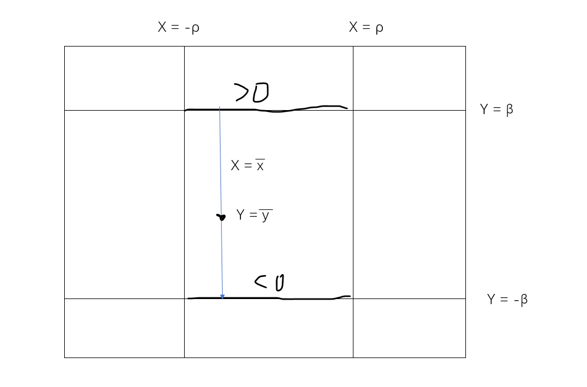
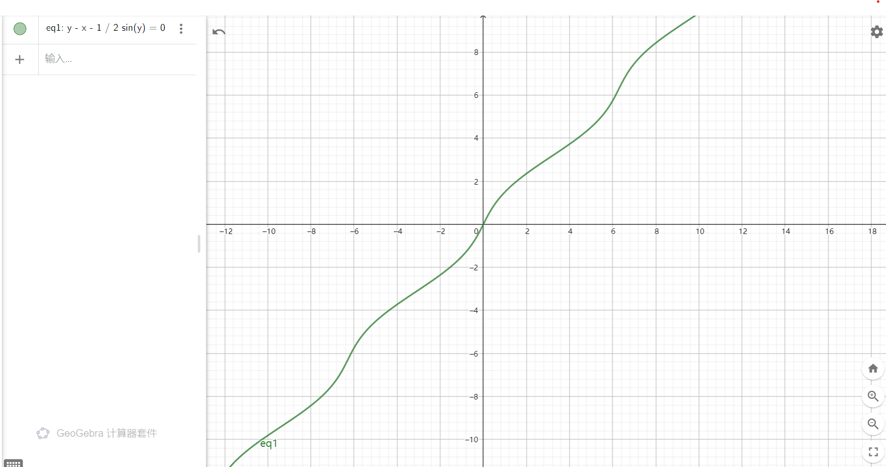

# 隐函数和逆映射

## 基础知识

- **显函数**：因变量在左边，自变量在右边的函数表达形式 $y = f(x)$
- **隐函数**：自变量和因变量混合在一起的方程 $F(x,y) = 0$
- **一元隐函数求导**：
  - **实例**：圆的方程 $x^2+y^2 = r^2$
    - **解**：对 $x$ 求导得 $2x + 2yy' = 0$，即 $y' = -\frac{x}{y}$
      - 实际上，它就是复合函数 $F(x,y(x))$ 关于 $x$ 的偏导数的链式法则

## 一元隐函数存在定理

- **一元隐函数存在定理**：
  - 设 $F(x,y) = 0$ 中，$y$ 是 $x$ 的因变量，$(x_0,y_0)$ 是某一点
  - 若
    - $F(x_0,y_0) = 0$
    - 在闭矩形上 $F(x_0,y_0)$ 连续，且具有连续偏导数（可微）
      - 连续是为了应用零点存在定理，以及保证 $y$ 与 $x$ 的唯一性
      - 可微是为了应用微分中值定理，以及隐函数可导性
    - $F_y(x_0,y_0)\neq 0$
      - 数学意义上是保证零点的唯一性即y一一对应x
      - 数学本质上作为隐函数导数的分母
  - 则
    - 存在一个邻域 $O(x_0,\rho)$，在其中可以唯一确定隐函数 $y = f(x)$
      - 因为条件只给了一个点附近的约束，所以结论也只能是该点的一个邻域内适用
    - 该隐函数连续
    - 该隐函数具有连续的导数 $\cfrac{dy}{dx} = -\cfrac{F_x(x,y)}{F_y(x,y)}$
- **证明（隐函数存在和唯一性）**：
    - 不妨设 $F_y(x_0,y_0)>0$
      - 则由 $F(x,y)$ 连续性 + 原点值为0，即得在 $y$ 轴两侧某微小邻域的两点，正负性相反。
        - 也就是说存在 $\b>0$ 使得 $\begin{cases} F(x_0,y_0-\beta)<0 \\ F(x_0,y_0+\beta)>0 \end{cases}$
      - 再由 $F(x,y)$ 连续性 + 原点值为0，即得在 $x$ 轴两侧的两点，正负性相反
        - 也就是说存在 $0<\rho << \b$ 使得 $\begin{cases} F(x_0-\rho,y_0 - \b)<0, & F(x_0+\rho,y_0 - \b)<0 \\ F(x_0-\rho,y_0+\b) > 0, & F(x_0+\rho,y_0 + \b) > 0 \end{cases}$
    - 这样，将小矩形 $O(x_0,y_0)[\b,\rho]$ 中的竖线设为 $l_\l:\begin{cases} x = x_\l \\ y\in [y_0-\b,y_0+\b] \end{cases}$
      - 由一元函数的零点存在定理，对 $\forall x_\l\in [x_0-\rho,x_0+\rho]，\exist y_\l$ 使得 $F(x_\l,y_\l) = 0$
        - 也就是说每条竖线 $l_\l$ 中都存在 $F$ 的零点。将这些零点连接起来，就是 $F(x,y) = 0$ 的显函数图像
      - 再由于 $F_y>0$，单调函数是单射，故上面 $x_\l$ 和 $y_\l$ 是一一对应的，符合函数的单值性。从而存在唯一的隐函数 $y(x)$。写成参数形式就是 $\begin{cases} x = x(\l) \\ y = y(\l) \end{cases}$
    
- **证明（隐函数连续性）**
    - 把 $\epsilon$ 作为新的 $\beta$，然后把 $\delta$ 作为新的 $\rho$，形成一个新的小矩形，与上面推导同理，得这个矩形中依然成立隐函数存在和唯一性，即 $y_\l$ 在这个小矩形内唯一依赖于 $x_\l$
    - 则 $\forall \epsilon >0，\exist\delta >0$，对于 $\forall x\in O(x_\l,\delta)$，有 $|y(x)-y(x_\l)| < \epsilon$
- **证明（隐函数可导性）**
  - **证明**：
    - 任取某个 $x_\l$ 和 $x_\l+\D x_\l$ 以及相应的 $y_\l$ 和 $y_\l+\D y_\l$，形成两个点，用微分中值定理获得导数形式。再由 $F$ 的偏导连续性去掉 $\theta$ 即可
- **理解**：一元隐函数竟然用多元函数的性质得到，有意思
- **实例**：
  - 圆方程 $x^2+y^2 = 1$
    - 在 $y = 0$ 处 $F_y = 0$，此处 $y(x)$ 的斜率无穷，故不存在隐函数
  - **开普勒方程的解函数**：
    

### 多元隐函数存在定理

- 任意 $n+1$ 元函数 $f(x_1,...,x_n)$ 都存在 $n$ 元隐函数 $y=f(x_1,x_2,...,x_n)$
  - **证明**：由点列极限的坐标分解性，将上述证明过程推广到多维即可
- **多元隐函数偏导数**：$\cfrac{\partial y}{\partial x_i} = -\cfrac{F_{x_i}(x_1,x_2,..,x_n,y)}{F_y(x_1,x_2,...,x_n,y)}$

### 向量值隐函数存在定理

- 设向量值函数为 $\begin{cases} F(x,y,u,v)=0 \\ G(x,y,u,v)=0 \end{cases}$，
- 若Jacobi行列式 $J_{(u,v)} = \cfrac{\partial(F,G)}{\partial(u,v)} = \begin{vmatrix} F_u & F_v \\ G_u & G_v \end{vmatrix} \neq 0$
- 则其存在隐函数 $\begin{pmatrix} u \\ v \end{pmatrix} = \begin{pmatrix} f(x,y) \\ g(x,y) \end{pmatrix}$
  - 上面的 $F_u$ 指的是将等式左边的式子看作显函数 $F$，然后对其求偏导的结果
- **证明（存在性）**：对分量函数分别应用隐函数存在定理即可
  - **存在部分隐函数**：由于 $|J| \neq 0$，即 $F_u$ 和 $F_v$ 至少有一个不为0，即至少有存在一个隐函数因变量
    - 不妨设 $F_u$ 不为0，则由一元隐函数存在定理，存在关于 $u$ 的隐函数，设 $u = \varphi(x,y,v)$
    - $F$ 规定了 $u$ 的隐函数关系，这个前面已经知道，但是 $G$ 为什么也适用这个隐函数规则呢？
    - 因为 $G$ 中还剩余三个自变量 $v,x,y$，也就是说还有三个自由度可供调配。所以当我们认为这个隐函数关系成立时，我们可以自行将 $G$ 的形式调配为 $G_1(x,y,v) = G(x,y,\p(x,y,v),v)$
    - 由此还可以得到一个推论：只要还存在自由变量，且保持向量值函数不退化（$|J|\neq 0$），那么就可以接着求隐函数
   - **求 $u$ 部分隐函数**：对 $F$ 求 $v$ 的偏导，则有 $\varphi_v = -\cfrac{F_v}{F_u}$
     - （由一阶微分的形式不变性，将 $v$ 看作自变量时，求关于 $v$ 的偏导不用管 $\partial x$ 与 $\partial y$）
   - **继续求部分隐函数**：将 $u = \varphi(x,y,v)$ 代入 $G$ 得 $G(x,y,\varphi(x,y,v),v) = 0$
     - 对其求 $v$ 的偏导得 $G_v = \cfrac{1}{F_u}\cfrac{\partial(F,G)}{\partial(u,v)} \neq 0$。则由一元隐函数存在定理，存在关于 $v$ 的隐函数 $g(x,y)$
     - 此时 $v$ 可以进化为因变量，即存在隐函数 $v(x,y)$
   - 综上，$\begin{cases} u = \varphi(x,y,g(x,y)) = f(x,y) \\ v = g(x,y) \end{cases}$ 即为两个隐函数
- **求导数**：由链式法则易得下列方程组，应用Cramer法则即得导数
$$\begin{pmatrix}
  \cfrac{\partial F}{\partial u} & \cfrac{\partial F}{\partial v} \\\\
  \cfrac{\partial G}{\partial u} & \cfrac{\partial G}{\partial v}
\end{pmatrix}
\begin{pmatrix}
  \cfrac{\partial u}{\partial x} & \cfrac{\partial u}{\partial y} \\\\
  \cfrac{\partial v}{\partial x} & \cfrac{\partial v}{\partial y}
\end{pmatrix} = 
-\begin{pmatrix}
  \cfrac{\partial F}{\partial x} & \cfrac{\partial F}{\partial y} \\\\
  \cfrac{\partial G}{\partial x} & \cfrac{\partial G}{\partial y}
\end{pmatrix} $$
- **理解**：一元隐函数求导是方程，这里是两个方程组。而Jacobi行列式就是Cramer法则的计算结果，呈现**对称性**
  - **进化性**：
    - $n$ 元函数最多可以存在 $n-2$ 个因变量，即最少存在 $2$ 个自变量
      - 若最多只有一个自变量，则此时 $F$ 和 $G$ 都是一元函数，必定线性相关（函数的线性相关理论详见常微分方程或泛函分析），从而向量值函数退化
    - 体现在题设条件中就是：如果 $J_f = 0$，则F和G对隐函数u和v的偏导数线性相关，$J_f$ 退化（不可逆），即向量值函数

### 习题

- **计算向量值隐函数导数**：
  - 设有 $n$ 个自变量，$m$ 个分量函数
  - 分别对所有其它自变量求导，然后形成一个 $m$ 阶非齐次线性方程组
  - 使用Cramer法则解方程组，结果为 $$\cfrac{\partial y_k}{\partial x_j} = -\cfrac{\partial(F_1,F_2,...,F_m)}{\partial(y_1,y_2,...,x_j,..,y_m)}\div \cfrac{\partial(F_1,F_2,...,F_m)}{\partial (y_1,y_2,...,y_m)}$$
- **复合函数求导的变换**
  - 已知二元函数 $z(x,y)$，以及关于其二阶偏导数的方程
  - 若对自变量作变换$\begin{cases} u = x+y \\ v = x-y \end{cases}$，再对因变量作变换 $w = xy-z$
  - 求 $w$ 关于 $u、v$ 的偏导数方程
  - **解**：
    - 首先题目里确定了自变量是u、v，所以这里就不应该保留u、v的对x、y复合形式，而应该反过来变成$\begin{cases}
        x = \frac{u+v}{2} \\ y = \frac{u-v}{2}
    \end{cases}$，~~然后对w进行求偏导即可……结果发现z的导数消不掉，并不是本题想要的形式。~~（本题很幸运，自变量的反函数一下子就求出来了。如果复杂一些，可能就要用到下面的逆映射定理）
     - 其实应该注意到题目里给出的z的二阶偏导数等式，这其实就是表明我们应该把z(x,y)变成w(u,v)，也就是用w表示z。所以有$z = xy-w$，然后把二阶偏导结果（自变量代换只在这里有用）代入等式，得到想要的结果$\frac{\partial^2 w}{\partial u^2} = \frac{1}{2}$
     - 然后本题是在隐函数一章中出现的原因，就是接下来需要对该等式求积分。
     - 偏导数的积分中，**C是会因为只对单一变量求导而消去的函数，而不只是一个常数**，所以结果是$w = \frac{1}{4}u^2 + \varphi(v) + \psi(v)$。**因为使用x和y会有相应的u偏导，但是v和u是独立的，没有这个问题**
 <!-- - **启发**：本题的启发是通过变量代换可以简化常微分方程 -->
<!-- - **不可随意在方程两端求导**
 - 方程相等，指的是两个不同的函数存在一个交点。此时值相等但斜率不一定相等，所以不可以对方程两边求导的同时等号还成立
     - 但函数相等就可以两边求导
 - 函数相等的情况一般都是抽象条件。如果出现了实际条件，那必然是方程相等。 -->

## 逆映射定理

- 设
  - $P_0(u_0,v_0)$ 和 $P_0'(x_0,y_0)$ 是区域 $D$ 中两点
  - $f:\begin{cases}x=x(u,v)\\ y=y(u,v)\end{cases}$ 是以 $u$、$v$ 为自变量的向量值函数
- 若
  - $f$ 在 $D$ 上具有连续的导函数
  - $P_0$ 处 $f$ 的Jacobi行列式 $\cfrac{\partial(x,y)}{\partial(u,v)} \neq 0$
- 则存在一个邻域 $O(P'_0,\rho)$，在其上存在 $f$ 的逆映射 $g:\begin{cases} u = u(x,y) \\ v = v(x,y) \end{cases}$，且其存在连续的导函数
- **证明**：
  - 题设条件满足隐函数存在定理，故可得方程组 $\begin{cases} F(x,y,u,v) = x-m(u,v) = 0 \\ G(x,y,u,v) = y-n(u,v) = 0 \end{cases}$
    - $F$、$G$ 均看作三元隐函数。在这里为了区分，把 $x(u,v)$ 变成了 $m(u,v)$
  - 所以 $\cfrac{\partial(F,G)}{\partial(u,v)} = \cfrac{\partial(m,n)}{\partial(u,v)} \neq 0$
    - 为了把题目中的非线性条件转化为隐函数条件，才把函数变成三元函数。这也是逆映射定理的核心点
  - 然后把 $u$、$v$ 看成隐函数的因变量，$x$、$y$ 看作隐函数的自变量（地位相等）。应用向量值函数的隐函数存在定理即可
- **逆映射求导**：列出 $F$、$G$ 的偏导方程组，应用Cramer法则即可
  - 此时求出的是自变量为 $(u,v)$ 的形式，为了得到一般形式，还需要再代入 $u(x,y)$ 和 $v(x,y)$，将自变量转化为 $(x,y)$
- **理解**：这里是把逆映射当成了隐函数，而由于$F、G=0在O(P_0',\rho)$上均成立，即该邻域上的点都是隐函数点，也就是说该邻域上的点都成立逆映射条件。

### 习题

- **Jacobi行列式快速求逆算法**：$\Big[ \cfrac{\pa (x,y)}{\pa (u,v)} \Big]^{-1} = \cfrac{\pa (u,v)}{\pa (x,y)}$
  - **证明**：设 $|J|_{(x,y)} = \cfrac{\partial (x,y)}{\partial (u,v)}$，由逆映射定理易得 $\begin{cases} \cfrac{\partial u}{\partial x} = \cfrac{y_v}{|J|} & , & \cfrac{\partial v}{\partial x} = \cfrac{-y_u}{|J|} \\\\ \cfrac{\partial u}{\partial y} = \cfrac{-x_v}{|J|} &,& \cfrac{\partial v}{\partial y} = \cfrac{x_u}{|J|} \end{cases}$
    - 由上式易得 $u_xv_y - u_yv_x = \cfrac{x_uy_v - x_vy_u}{|J|^2_{(x,y)}} = \cfrac{1}{|J|}$
- **开映射的充分条件**：
  - 设 $D$ 是开集，$f$ 在 $D$ 上具有连续导数
  - 若在 $D$ 上恒有 $|J_f| \neq 0$，则 $f(D)$ 是开集
  - **证明**：
    - 由导数连续和 $|J_f| \neq 0$ 即得 $f$ 在 $D$ 上具有逆映射 $g$
    - 隐函数在邻域 $O(f(x_0,y_0),\rho)$ 上均成立，则均为内点，$f(D)$ 为开集

## 复合函数求导和隐函数求导的联系

- 隐函数存在定理其实就是寻找可能成为复合函数的自变量
- 它们都要用到全微分的加和性，不过隐函数用来解方程。若方程成立（Jacobi行列式$\neq 0$不退化，或$F_y \neq 0$一一对应），则可以变换产生复合函数，然后复合函数求导需要用到全微分加和性
- 隐函数还有一个能力：求逆映射，或通过变换来产生复合函数
  - 这源于隐函数的一个重要性质：由于链式法则对计算和代入的分离，利用它可以直接求出变换的导数，然后积分即可得到隐函数

- 在求变换中，隐函数是反解，复合函数是正解。
  - 比如$\begin{cases}
      x = rcos\theta \\ y = rsin\theta
  \end{cases}$变换下，求$\frac{\partial^2 f}{\partial x^2}和\frac{\partial^2 f}{\partial y^2}$
    - 复合函数求导是把$x、y$看作自变量，所以需要先解出反函数，然后再利用复合函数求导
      - 但是如果反函数不好解，就需要使用隐函数积分
    - 而隐函数解法是依然把$r、\theta$看作自变量，但是最后需要配凑方程。
  - 总结：显式函数其实也是隐函数的一种，方程求导解法算是普适解法

### 隐函数的进化问题

1. $y = f(x,t)$，而t有$F(x,y,t) = 0，求\frac{dy}{dx}$
   - 即t是第一元，y是第二元，x是自变量
   1. 这里就不能有$y_t = \frac{1}{t_y}$，因为$一个是f一个是F$，也就是说先计算后代入时等式不能成立，但是先代入后计算的话（$\frac{dy}{dx}$）可以成立。不过我们求的链式法则都是先计算后代入
   2. 本题的解法是：$\frac{dy}{dx} = \frac{\partial f}{\partial t}\frac{\partial t}{\partial x} + \frac{\partial f}{\partial x}$，又有$\frac{\partial F}{\partial x}（先代入后计算） = 0 = \frac{\partial F}{\partial x}（先计算后代入） + \frac{\partial F}{\partial y}(\frac{\partial f}{\partial x} + \frac{\partial f}{\partial t}\frac{\partial t}{\partial x}) + \frac{\partial F}{\partial t}\frac{\partial t}{\partial x}$，方程可解得结果
   - 最重要的是$\partial y要换成\partial f，这就是先代入后计算$。
   - 链式法则，前因子项是先计算后代入，后因子项是先代入后计算

## 习题

### 构造证明题

- 二元函数$f(x,y):R\to R^2$有连续偏导数，证明：存在一对一的连续向量值函数$G(t):R^2\to R$，使得$f\omicron\ G \equiv 常数$
  1. 构造$F(x,y) = f(x_0,y_0) - f(x,y)$，则存在隐函数$F(x,g(x)) \equiv 0$即$f(x,y)为常数（在邻域(a,b)中），其中g(x)连续$
  2. 然后构造一个$定义域为(a,b)$值域为R的初等函数$x(t)$，得到$G(t) = (x(t),g(x(t)))连续$
  - 利用隐函数定义中恒等于0的性质，来化为常数（类似零点存在定理 $\to$ 中间值定理的应用）