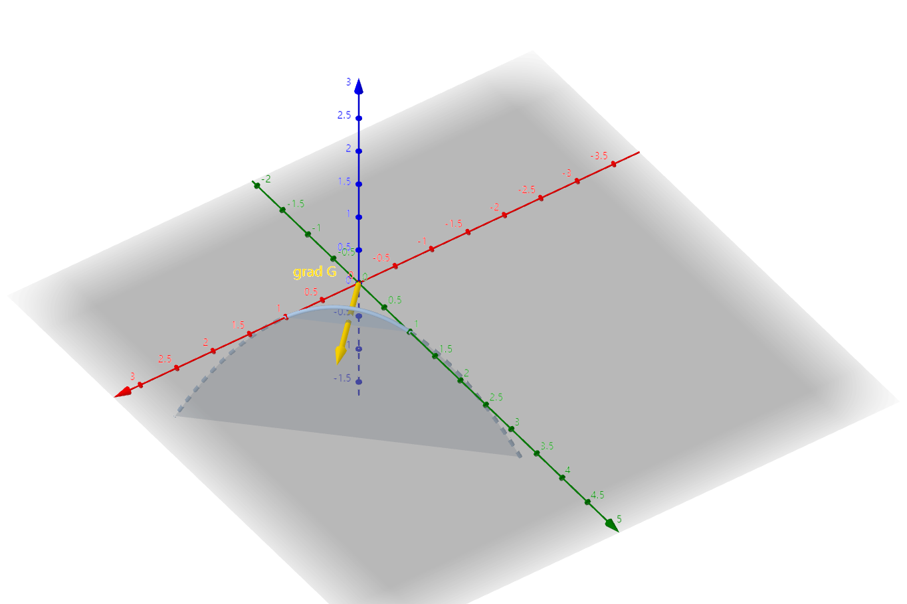

# 运筹学前瞻

- 求极值问题在运筹学中会有更详细的讲解，这里不用太纠结

## 无条件极值问题

- **无条件极值问题**：给定多元函数 $f$，没有其它约束，求多元函数的极大/极小值
- **目标函数**：想要求极值的函数

### 多元函数的极值

- **极大值点**：
  - 设
    - $D$ 为开区域（一般的定理都不会设闭区域，因为边界点无内部邻域）
    - $f(x)$ 为定义在 $D$ 上的函数
  - 若存在 $O(x_0,r)$ 使得 $\forall x\in O(x_0,r)$ 都有 $f(x_0) \geq f(x)$
  - 则称 $x_0$ 为 $f(x)$ 的极大值点
- **费马（Fermat）引理**：设 $x_0$ 为 $f(x)$ 的极值点，若 $f$ 在 $x_0$ 可偏导，则 $f(x_0)$ 的一阶偏导数均为 $0$
  - **证明**：
    - 构造一元函数 $\varphi(x) = f(x,x_2^0,...,x_n^0)$，然后逐个使用一元函数费马定理即可
- **驻点**：函数的各个一阶偏导数均为 $0$ 的点
- **极值关系**：驻点和极值点互不包含
  - **反例**：
    - 常函数的点都是驻点，但不是极值点
    - 连续可偏导但不可微的函数 $f(x,y) = xy$，其中 $(0,0)$ 是驻点，但不是极值点
    - 偏导数不存在的点可能是极值点，如 $f(x,y) = |x|$，其中 $(0,0)$ 是极值点，但不是驻点
- **极值定理**：
  - 设 $n$ 元函数 $f$ 在驻点 $\bs x_0$ 附近有二阶连续偏导数
  - 则当二次型 $g(\zeta) = \mathop{\sum}\limits^n_{i,j=1}f_{x_ix_j}(\vec{x_0})\zeta_i\zeta_j$ 正定时 $\bs x_0$ 是极小值点，负定时 $\bs x_0$ 是极大值点，不定时 $\bs x_0$ 不是极值点
    - 其中 $\sum\zeta_i^2 = 1$
  - **证明（二元情况）**
    - 本质是判断驻点附近各方向导数的符号
    - 泰勒公式展开到二阶得 $$df(x_0,y_0) = \frac{1}{2}\Big[ f_{xx}(x_0,y_0)dx^2 + 2f_{xy}(x_0,y_0 dxdy + f_{yy}(x_0,y_0)dy^2 \\\ \\ + \alpha dx^2 + 2\beta dxdy + \gamma dy^2\Big]$$
      - 后面三项为无穷小量，可以舍去
    - 设 $\begin{cases} \rho = \sqrt{dx^2+dy^2} \\\\ \z_1 = \dfrac{\D x}{\rho} ， \z_2 = \dfrac{\D y}{\rho} \end{cases}$，易得 $\z_1^2 + \z_2^2 = 1$
    - 此时 $df(x_0,y_0)$ 的泰勒展开式变为二次型 $g(\z_1,\z_2)$，从而得到结论
  - **证明（$n$ 元情况）**：
    - 由前面推导，$g(\zeta)$ 是闭球面 $S^{n-1}(\bs x_0,\rho)$ 上的连续函数，故由最值定理，其存在极值点（正定为最小值，负定为最大值）
    - 而当 $\rho\to 0$ 时，由 $f$ 连续性即得 $\bs x_0$ 是最值点
- **Hessian矩阵**：设 $a_{ij} = f_{x_ix_j}(x_0^0)$，则 $H_f(x_0^0) = \begin{pmatrix} a_{11} & a_{12} & ... & a_{1n} \\ ... \\ a_{n1} & a_{n2} & ... & a_{nn} \end{pmatrix}_{n×n}$ 称为海森矩阵
  - 它是 $g(\zeta)$ 的系数矩阵，故其正定性和负定性等价于 $g(\zeta)$ 的正定性、负定性

### 习题

<!-- - 求三角形距离三顶点的距离的平方和最大点
- 长方形铁板弯折形成水槽，问横截面梯形体积最大的折法
- 证明：$xy \leq xlnx - x + e^y, \quad x\geq 1,y\geq 0$
  - 求偏导两次（因为x的偏导数中没有y） -->
- **求极值总结**：
  - $H_f(P_0)$ 正定，则为极小值点
  - $H_f(P_0)$ 负定，则为极大值点
  - $H_f(P_0)$ 可逆，非正定，非负定，则不为极值点
  - $H_f(P_0)$ 不可逆，不能判断极值
- **曲线极值反例**：$f(x,y) = (y-x^2)(y-2x^2)$ 在每条过原点的直线上，原点都为极值点，但原点并不是 $f$ 的极值点
  - 沿着 $y=x^2$ 和 $y=2x^2$ 两条曲线时，原点都不是极值
- **极值点曲线**：
  - 设 $f$ 在 $(x_0,y_0)$ 处二次连续可微
  - 若该点处 $f_x = 0，f_{xx} > 0$
  - 则
    - 存在邻域 $O = (y-\d,y+\d)$，使得 $\forall y\in O$ 都存在 $f$ 关于 $x$ 的极小值
  - 它不是 $f$ 的二元极小值点，而是退化为一元函数后的极小值点
  - 所有的极小值点可构成一个隐函数曲线 $g(y)$，且导数就是 $f$ 的偏导
  - **证明**：
    - 由隐函数存在定理，方程 $f_x(x,y) = 0$ 可决定一个隐函数 $x(y)$
      - 再由于 $f_{xx}(x_0,y_0) > 0$，故 $x=x_0$ 是 $f(x,y_0)$ 的极小值点
        - 此时 $f_x(x_0-,y_0) < 0$，$f_x(x_0+,y_0) > 0$
      - 再由 $f_{xx}$ 连续性，存在邻域 $O\Big( (x_0,y_0),\d \Big)$ 使得 $f_{xx} > 0$，从而 $f_x = 0$ 的图像 $x(y)$ 在该邻域内都是极小值点
  - **推论**：设极小值函数为 $g(y)$，则 $g'(y_0) = f_y(x_0,y_0)$
    - 不是极小值点函数，是极小值函数
    - **证明**：
      - 由导数定义，$g'(y_0) = \lim\limits_{\D y\to 0} \cfrac{g(y_0+\D y)-g(y_0)}{\D y}$
      - 由全微分公式，分子可化为 $$ f_x(x_0,y_0)\Big[ x(y_0+\D y)-x(y_0) \Big] + f_y(x_0,y_0)\D y + o(\D x) + o(\D y)$$
      - 再由题设 $f_x(x_0,y_0) = 0$ 即得结论

#### 配凑

- **我知道它什么意思，但是我配凑不出形式**：设 $f$ 在单位圆盘上有一阶连续偏导数，且 $|f(x,y)| \leq 1$，则存在某点使得 $f_x^2 + f^2_y < 16$
  - **证明**：
    - 设 $g(x,y) = f(x,y) + 2(x^2+y^2)$
    - 则 $g(0,0) = f(0,0) \leq 1$，$g|_{\pa D} = f(x,y) + 2 \geq 1$
    - 故在圆盘内部存在 $g$ 的极小值点 $(x_0,y_0)$，再由连续可微性，它是 $g$ 的驻点
      - 从而有 $g_x = g_y = 0$，即 $f_x = -4x_0，f_y = -4y_0$，易得这个点就是满足题意的点
    - 难道想不出这个构造就真白瞎了？

#### 弱调和性

- 设 $f$ 在 $D$ 上连续可偏导，若 $f_x+f_y = f，f|_{\pa D} = 0$，则 $f$ 在 $D$ 上恒为0
  - **证明**：
    - 反设不恒为0，则由连续性，存在最大值点 $ (x_0,y_0) \in D^o$，即 $f_x(x_0,y_0) = f_y(x_0,y_0) = 0$，但这与题设式子矛盾
- 设 $u$ 在单位圆盘上连续，在内部 $u_{xx} + u_{yy} = u$
  - 若边界上 $u\geq 0$，则内部也 $u\geq 0$
  - **证明**：
    - 反设内部存在负值点 $(x_0,y_0)$，则由 $u$ 连续性，内部也存在最小值点 $(a,b)$
    - 若 $u_{xx}(a,b) < 0$，易得 $u(x,b)$ 在该点取最大值，与最小值定义矛盾，即只能是 $u_{xx}(a,b) \geq 0$
    - 同理 $u_{yy}(a,b) \geq 0$
    - 再由题设关系式即得 $u(a,b) = u_{xx}+u_{yy} \geq 0$，矛盾
  - **推论**：条件和结论都可以改为大于号
    - **证明**：添加一个同样满足题设条件的余项函数即可
      - 易得 $u$ 在边界存在最小值 $m>0$，$e^{x} + e^y$/ 在边界存在最大值 $M>0$
      - 设 $v = u-c(e^x+e^y)$，且 $v_{xx}+v_{yy} = v$
      - 由上面结论得 $v\geq 0$，故 $u\geq e^x+e^y > 0$

#### 无界区域的最值不等式

- **两种方法**：开矩形 $\{0<x<1,0<y<+\infty\}$ 上恒有 $yx^y(1-x)<\frac{1}{e}$
  - **证明（驻点法）**：
    - $\begin{cases} f_x = yx^{y-1}[y(1-x)-x] \\\\ f_y = (1-x)x^y(1+y\ln x) \end{cases}$，则驻点为 $y = \dfrac{-1}{\ln x}$ 或 $\begin{cases} x=1 \\ y=0 \end{cases}$（舍去）
    - 易得 $f_x > 0$ 时，$y>\cfrac{1}{\ln\frac{1}{x}}$，$f_y>0$ 时，$y<\cfrac{1}{\ln\frac{1}{x}}$
    - 因此，$\begin{cases}x\to 1- \\ y\to +\infty\end{cases}$ 时，函数单调递增趋于某极限
    - 又因为函数连续，所以极限值有界，令 $x = 1-\frac{1}{n}，y = n$ 即可得到极限值为 $\frac{1}{e}$（**证毕**）
  - **证明（分离变量法）**
    - 首先固定 $y$，将其退化为 $f(x)$，求导易得最大值点为 $x = \dfrac{y}{y+1}$，最大值 $g(y) = (\dfrac{y}{y+1})^{y+1}$
    - 再对 $g(y)$ 求导求最值即可（可以先取对数进行简化）
- **整体换元法**：在 $[0,+\infty)\times [0,+\infty)$ 上有 $\dfrac{x^2+y^2}{4} \leq e^{x+y-2}$
  - **证明**：
    - 换元 $t = x+y$，易得左式 $\leq \dfrac{t^2}{4}$，故转化为一元函数的最值问题

#### 隐函数的极值

- **隐函数求极值**：设 $F(x,y) = 0$ 确定了隐函数 $y(x)$，求它的极值
  - **解**：
    - 用隐函数求导法则得 $y'(x) = -\dfrac{F_x}{F_y}$
    - 故 $F_x = 0$ 的点即为 $y'(x) = 0$ 的点
    - 再求 $y''(x)$ 的正负性，从而判断极大极小

<!-- ### 最小二乘法

- 回归模型中，寻找一个拟合直线，使得观测值$y_i$和直线函数值$ax_i+b$的差的平方和$Q = \mathop{\sum}\limits^n_{i=1}(y_i-ax_i-b)^2$最小
  - 残差：$y_i-(ax_i+b)$
  - 相关系数：$r = \frac{\sum (X_t - X)(Y_t - Y)}{\sqrt{\sum (X_t-X)^2\sum(Y_t-Y)^2}}$，介于1和-1之间，0表示无相关性
  - 经验公式
- 求Q的极小值点即可得到a和b

### 牧童经济模型

- 第i个牧民饲养的羊数：$x_i$，羊的总数：$X$，单价成本$c$
- 每只羊的平均价值：$V(X)$，得到的利润$P_i(x_1,x_2,...,x_n) = x_i(V(X)-c)$要求其最大值
  - 方程组$\frac{\partial P_i}{\partial x_i} = V(X)+x_iV'(X)-c=0$，共n个方程，表示第i个牧民应该饲养多少羊
- **反应函数**：$x_i = x_i(x_1,...,x_{i-1},x_{i+1},...,x_n)$，而$\frac{\partial x_i}{\partial x_j} < 0$
- 整个牧场的最大利润：$P = X(V(X)-c)$
  - 可以把方程组相加，然后利用$V(X)$的单调性进行比较，得到个人最优饲养量的总和>牧场最优饲养量，这表示不受管控必然发生过度使用 -->

## 条件极值问题

- **条件极值问题**：给定多元函数 $f$，对自变量的取值范围作出限制后，求函数的极大/极小值
- **退化性**：$n$ 元显函数的图像是 $n+1$ 维空间中的超曲面，但是由于约束条件的存在，使得至少有一个自变量退化为隐函数的因变量，从而目标函数在约束下退化为更低维的图像

### 二元函数

- **简单实例**：目标函数为 $f(x,y) = xy$，约束条件是 $x+y=1$
  - **解**：
    - 将约束条件 $y = 1-x$ 代入目标函数，没有任何信息损失，且问题转化为求 $f(x) = x(1-x)$ 的最值
  - **数学意义**：$\Phi'(x,y(x)) = 0 \rightarrow \frac{\partial f}{\partial x} + \frac{\partial f}{\partial y}\frac{\partial y}{\partial x} = 0$
  - **几何意义**：
    - 目标函数是一个标准曲面，约束条件是另一个曲面。它们的交集是一个曲线。问题实际上是求这个曲线上的最值

### 三元函数

- **条件极值点的性质**：若 $\bs x_0$
  <!-- - **几何意义**：约束条件可以是一个曲线，也可以是一个曲面。
    - 曲线是知一得二（两个因变量），退化为一个曲线显函数。曲面是知二得一（一个因变量），退化为一个曲面显函数。 -->

#### 曲线约束

- **曲线约束**：设目标函数为 $f(x,y,z)$，约束条件为曲线 $\G:\begin{cases} G(x,y,z) = 0 \\ H(x,y,z) = 0 \end{cases}$，条件极值点为 $(x_0,y_0,z_0)$
  - **极值的必要条件**：
    - 由隐函数存在定理，代入约束条件后可转化为 $\Phi(x) = f\Big( x,y(x),z(x) \Big)$
    - 由费马定理得极值点必定满足 $\Phi'(x_0) = (f_x,f_y,f_z)\cdot \Big( 1,y'(x),z'(x) \Big)= 0$
      - 也就是说，$\grad f$ 是（约束曲线的法平面）中某向量
    - 再由于两曲面的法向量可张成交线的法平面，故存在以下关系式 $$\grad f = \l\cdot \grad G(x,y,z) + \mu\cdot\grad H(x,y,z)$$
      - 且由线性表出的唯一性，每个 $(x,y,z)$ 都唯一对应一个 $(\l,\mu)$
    - 它实际上就是拉格朗日方程组
    - 相比无条件极值直接求驻点（仅依赖于 $f$ 的性质），这里的极值点条件还依赖了 $G,H$，也就是过滤了一些和约束曲线无关的极值点。但是它依然不是充分条件，还需要加上原本的约束条件才行
  <!-- - **注意**：这并不是条件极值问题原本的几何意义，因为目标函数是三元函数，图像是四维空间中的标准三维体，但由于其和三维曲面隐函数形式$F(x,y,z)$数学本质的相似之处，可以把目标函数“**巧妙**”地套进$F(x)=0$的数学意义中，并应用其性质得出一些结论。可以说，这个过程是很取巧的。 （写的什么够吧玩意）-->
- **Lagrange函数**：$L(x,y,z,\lambda,\mu) = f(x,y,z) - \lambda G(x,y,z) - \mu H(x,y,z)$
  - **约束性**：$\grad L = \bs 0$ 的点即为 $f$ 满足约束条件的驻点
  - **极值性**：可微时条件极值点肯定是驻点，故 $L$ 的极值点也是 $f$ 的极值点
- **Lagrange乘子法**：
  - **构造拉格朗日方程**：$\begin{cases} L_x = 0、L_y=0、L_z=0（极值条件） \\ G=0、H=0（约束条件）\end{cases}$
    - **向量简写形式**：$\begin{cases} \grad L = \bs 0 \\ x\in\G \end{cases}$
  - **筛选**：它的解集包含 $f$ 的全体极值点，从中筛选出极值点，即得条件极值问题的解
    - 此时 $F_x = F_1 + F_3z_x$，利用约束条件求隐函数导数，最终求出Hessian矩阵
  - 本质还是梯度下降法，只不过是求出所有的梯度峰值，挑选出最高的而已

#### 曲面约束

- **曲面约束**：设目标函数为 $f(x,y,z)$，约束条件为 $G(x,y,z) = 0$，条件极值点为 $(x_0,y_0,z_0)$
  - **化简**：代入约束条件后可转化为 $\Phi(x,y) = f(x,y,z(x,y))$，求这个二元函数的无条件极值即可
  - **直接法**：如果隐函数 $z(x,y)$ 比较好求，则可以直接用无条件极值的方法求解
    - **求驻点**：$\begin{cases}  \dfrac{\partial\Phi}{\partial x} = 0 \\\\ \dfrac{\partial\Phi}{\partial y} = 0  \end{cases}$
    - **讨论Hessian矩阵的正定性**：即 $f_{xx} + 2f_{xy} + f_{yy}$ 的正定性
    - 若隐函数不好求，老老实实用L乘子法 
  - **L乘子法**：同上使用费马定理得到垂直关系，再由几何意义得到梯度方程即可
- **Lagrange函数**：$L(x,y,z,\lambda) = f(x,y,z) - \lambda G(x,y,z)$

### 多元函数

- **拉格朗日乘子法的存在性**：
  - 设
    - 目标函数为 $f(x_1,x_2,...,x_n)$
    - 约束条件为：$\begin{cases} g_1(x_1,x_2,...,x_n)=0 \\ ... \\ g_m(x_1,x_2,...,x_n)=0 \end{cases}$
    - 条件极值点为  $\bs x_0 = (x_0^{(1)},...,x_0^{(n)})$
  - 若
    - $f$ 和 $\forall g_i$ 都有连续的偏导数
    - Jacobi矩阵 $J_{g_i}$ 在约束点处满秩
  - 则存在 $m$ 个常数 $\l_i$，使得在 $\bs x_0$ 点成立 $\grad f = \l_1 \grad g_1 + ... + \l_m \grad g_m$
  - **证明**：
    - m个约束条件（方程组的解空间）（总空间中的子空间）（m个自由的基）使得目标函数退化为n-m维图像（n-m个非自由的向量），从而存在一个m维法空间。里面的约束基向量（解空间的基）$grad\ g_i$可以表出目标函数的法向量$grad\ f$

### 习题

- **初等法求条件极值**：
  - **二阶齐次问题**：$f(x,y) = ax^2 + 2bxy + cy^2$ 在 $x^2+y^2 \leq 1$ 下的最值
    - **解**：
      - 区域内部用驻点法
      - 区域边界用三角换元 + 辅助角公式即可
  - **二元非齐次问题**：同上，内部用驻点法，边界求隐函数后换元成一元函数即可
- **二元函数条件极值问题的几何意义**：
  - **Lagrange函数**：$L(x,y,\lambda) = f(x,y) - \lambda G(x,y)$
  - **Lagrange乘子法** ：$\begin{cases} L_x=0、L_y=0（极值条件） \\ G=0（约束条件） \end{cases}$
  - **几何意义**：
    - $f(x,y)$是三维空间中的标准二维曲面，受到直线约束后退化为一条曲线的显函数。
    - 费马定理得 $\Phi'(x,y(x)) = f_x + f_y·y'(x) =0$
      - 几何意义是 $(f_x,f_y) \perp (1,y'(x)) = (1,-1)$
      - 其中 $(1,y'(x))$ 是一元函数图像的切向量 $\vec{\tau}$，所以 $(f_x,f_y)$ 就是梯度向量（约束曲线的法平面向量），垂直于约束曲线 $y(x)$
    - 即垂直于约束曲线所处面的向量（直线的法平面向量）$\grad G$ 与 $\grad f$ 共线，即 $\grad f = \lambda\grad G$
    - 

#### 几何应用

- 求 $y=x^2$ 和 $x-y-2=0$ 的最短距离
  - **解**：
    - 即求二元函数 $F(x_1,x_2) = |(x_1,x_1^2) - (x_2,x_2-2)|$ 的最小值
- 光滑曲面 $C:F(x,y,z) = 0$ （离原点最近的点）的法线过原点
  - **证明**：
    - 离原点最近的点为 $\min\limits_{P\in C} (x^2+y^2+z^2)$ 的解
      - 构造L函数 $L(x,y,z,\l) = x^2+y^2+z^2+\l F$
      - 解方程得 $\cfrac{-x_0}{F_x(x_0,y_0,z_0)} = \cfrac{-y_0}{F_y(x_0,y_0,z_0)} = \cfrac{-z_0}{F_z(x_0,y_0,z_0)}$
    - 再易得法线方程为 $l:\cfrac{x-x_0}{F_x(x_0,y_0,z_0)} = \cfrac{y-y_0}{F_y(x_0,y_0,z_0)} = \cfrac{z-z_0}{F_z(x_0,y_0,z_0)}$
    - 两者结合即得结论
- 求椭球 $C$ 被平面 $w$ 截出的椭圆的面积
  - **解**：
    - 求出该椭圆的长短半轴即可，即求距离函数 $r = \sqrt{x^2+y^2+z^2}$ 在 $C,w$ 约束下的最大值和最小值

#### 分析应用（证明不等式）

- **均值不等式**

#### 条件极值问题的分类

- 求完可疑点后，还需判断是否为最值
  - 若约束区域为闭集，则可疑点必为最值，挨个比较即可
  - 若约束区域为开集，则需要用驻点法判断是否为极值。若是极值则为最值

#### 和高等代数结合