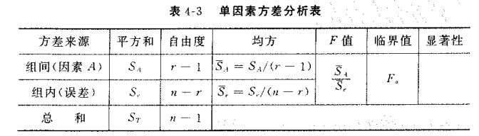
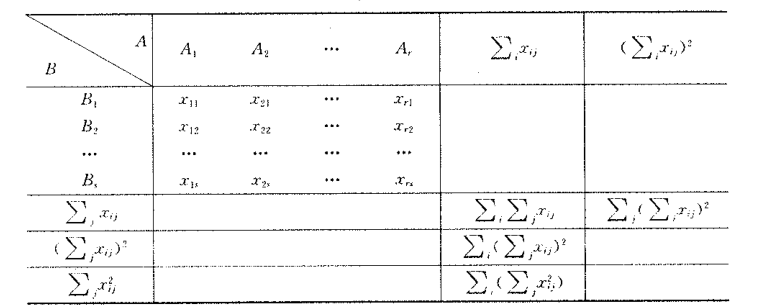
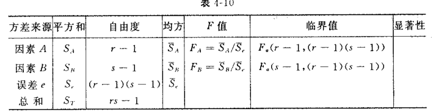

# 方差分析

- **试验指标**：衡量试验结果的量
- **因素**：影响试验指标的量
  - **水平**：因素在试验中所处的等级

## 单因素方差分析

- **单因素方差分析**：固定其它因素的水平，将所观察因素控制在几个水平上进行试验
  - **因素** $A$
  - **水平** $A_1,...,A_r$
  - 水平 $A_i$ 下
    - 试验指标的全体（**总体**） $X_i$
    - 试验结果（**样本**） $X_{i_1},...,X_{i_{n_i}}$，**容量**为 $n_i$
    - $\{X_{ij}\}^{n_i}_{j=1}$ 独立同正态分布
    - $X_i$ 的均值为 $\mu_i$
  - **检验假设**：$\begin{cases} H_0: \mu_1 = \cdots = \mu_r \\ H_1: \{\mu_i\} 不全相同 \end{cases}$
- **简化**：
  - 样本偏移量：$\varepsilon_{ij} = X_{ij}-\mu_i$
  - **样本总容量**：$n = \sum\limits^r_{i=1} n_i$，
  - **一般平均**：$\mu = \dfrac{1}{n}\sum\limits^r_{i=1} n_i\mu_i$（所有水平下样本理论均值的算术平均）
  - **水平 $A_i$ 的效应**：$\a_i = \mu_i - \mu$（该水平下理论均值对一般平均的偏移量）
- **模型**：$\begin{cases} X_{ij} = \mu + \a_i + \varepsilon_{ij} \\ \varepsilon_{ij}\sim N(0,\sigma^2)，相互独立 \\ \sum\limits^n_{i=1} n_i\a_i = 0 \\ \mu,\a_i,\sigma^2 未知 \end{cases}$
  - 本质：为了把均值化为0
- **检验假设**：$\begin{cases} H_0: \a_1 = \cdots = \a_r = 0 \\ H_1: \{\a_i\} 不全为0 \end{cases}$
  - **因素A显著**：拒绝 $H_0$

### 平方和分解

- **样本存在差异的原因**：
  - 各水平的效应存在差异
  - 存在随机误差
- **平方和分解**：
  - **总偏差平方和**：$S_T = \sum\limits^r_{i=1}\sum\limits^{n_i}_{j=1} (X_{ij}-\ol X)^2$
    - **统计意义**：样本间差异程度正相关（同时受两个因素影响）
  - **组内平方和**：$S_e = \sum\limits^r_{i=1} D_i$
    - $D_i = \sum\limits^{n_i}_{j=1} (X_{ij}-\ol X_i)^2$
    - **统计意义**：与同水平下各个样本间差异正相关（随机误差的影响）
  - **组间平方和**：$S_A = \sum\limits^r_{i=1} S_i$
    - $S_i = n_i(\ol X_i - \ol X)^2$
    - **统计意义**：与各水平样本总体间差异正相关（水平效应的影响）
  - **平方和分解公式**：$S_T = S_e+S_A$
    - **证明**：添项后完全平方展开即可
    - **理解**：正因为是平方和，故 $2()()$ 项才会归零。
- 

### 统计量分布

- $S_e \sim \sigma^2\cdot\chi^2(n-r)$
  - $D_i$ 服从 $\sigma^2\cdot\chi^2(n_i-1)$ 分布
  - 由卡方分布可加性，$\cfrac{S_e}{\sigma^2}\sim \chi^2(n-r)$
- $S_A\sim \sigma^2\cdot\chi^2(r-1)$（假设 $H_0$ 成立时）
  - $X_{ij}$ 标准化为 $Y_{ij}\sim N(0,1)$
  - 易得 $\sum\limits^r_{i=1}\sum\limits^{n_i}_{j=1}Y_{ij} = Q_1 + Q_2 + Q_3$（添项配凑）
    - $Q_1 = \cfrac{S_e}{\sigma^2}$
    - $Q_2 = \cfrac{S_A}{\sigma^2}$
    - $Q_3 = \big[ \cfrac{\sqrt{n}(\ol X-\mu)}{\sigma^2} \big]^2$
  - 由柯赫仑定理，相互独立，且分别服从卡方分布
- $E(S_A) = (r-1)\sigma^2 + \sum\limits^r_{i=1} n_i\a_i^2$（分解计算即可）
  - 当 $H_0$ 成立，$S_A$ 完全由随机误差决定
  - 当 $H_0$ 不成立，两个因素均有关系

### 检验统计量

- **推论**：
  - $H_0$ 成立时， $\cfrac{S_e}{n-r}$，$\cfrac{S_A}{r-1}$ 是 $\sigma^2$ 的无偏估计
  - $H_0$ 不成立时，$\cfrac{S_e}{n-r}$ 依然是无偏估计，$\cfrac{S_A}{r-1}$ 变大
- **检验统计量**：$F = \cfrac{S_A/(r-1)}{S_e/(n-r)}$
  - $H_0$ 成立时，$F\sim F(r-1,n-r)$
- **拒绝域**：$W = \{F>C\}$
  - $H_0$ 成立时，$C = F_\a(r-1,n-r)$
- 

### 未知参数的估计

#### 点无偏估计

- $\hat\mu_i = \ol X_i$，$\hat\mu = \ol X$
- $\hat\a_i = \ol X_i-\ol X$
- $\hat\sigma^2 = \cfrac{S_e}{n-r}$
- $\hat\sigma_i = \hat\a_i$

#### 区间估计

- **各水平均值 $\mu_i$**
  - $t = \cfrac{Q_4}{\sqrt{Q_5/(n-r)}} = \cfrac{\sqrt{n_i(n-r)(\ol X_i-\mu_i)}}{\sqrt{S_e}}\sim t(n-r)$
- **总体方差 $\sigma^2$**

## 双因素方差分析

- 两个因素 $A,B$，水平分别为 $\{A_r\}，\{B_s\}$
- 设 $X_{ij} = A_iB_j$
- 假设 $X_{ij}\sim N(\mu_{ij},\sigma^2)$
- **一般平均**：$\mu = rs\sum\limits^r_{i=1}\sum\limits^s_{j=1} \mu_{ij}$
  - **分效应**： $\begin{cases} \mu_{i\cdot} = \dfrac{1}{s}\sum\limits^s_{j=1} \mu_{ij} \\ \a_i = \mu_{i\cdot}-\mu \end{cases}$，$\begin{cases} \mu_{\cdot j} = \dfrac{1}{r}\sum\limits^r_{i=1} \mu_{ij} \\ \b_j = \mu_{\cdot j} - \mu\end{cases}$
    - **约束条件**：$\sum \a_i = \sum b_j = 0$
- **总效应**：$\mu_{ij} - \mu$
  - **无交互作用**：总效应等于两效应之和
  - **有交互作用**：不相等
  - **交互作用**：$(\a\b)_{ij} = \mu_{ij} - \mu - \a_i - \b_j$
    - 总效应扣除相应两个效应的剩余
    - **约束条件**：$\sum\limits^r_{i=1} (\a\b)_{ij} = \sum\limits^s_{j=1} = 0$

### 无交互作用

- **模型**：$\begin{cases} X_{ij} = \mu + \a_i + \b_j + \varepsilon_{ij} \\ \varepsilon_{ij}\sim N(0,\sigma^2)，相互独立 \\ \sum\limits^r_{i=1} \a_i = \sum\limits^s_{j=1} \b_j = 0 \\ \mu,\a_i,\b_j,\sigma^2 未知 \end{cases}$
- **检验假设**：$\begin{cases} H_{0A}: \a_1 = \cdots = \a_r = 0 ，& H_{0B}: \b_1 = \cdots = \b_r = 0 \\ H_{1A}: \{\a_i\} 不全为0  &  H_{1B}: \{\b_i\} 不全为0  \end{cases}$

#### 计算步骤

1. 
2. 计算 $S_T,S_e,S_A$
3. 

### 判断交互作用是否显著

- 在最后一个表中再加入一行 $A\times B$，比较临界值即可