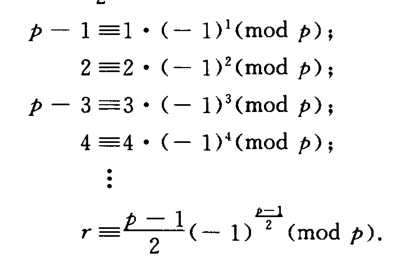
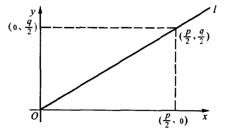

# 原根和指数

## 原根

### 缩系幂的遍历与跳跃

- **a对模的阶**：$a^n \equiv 1 \pmod m$ 的最小解
  - **因子性**：阶整除欧拉函数
- **模m有原根**：$\exist g$ 满足 $(g,m) = 1$，使得欧拉函数等于 $g$ 模 $m$ 的阶
- **原根的循环性**：根据缩系的满溢性，得到 $g$ 的幂可以表示 $m$ 的整个缩系
- **循环群**：$Z^*_m = \{ \bar{1},\bar{g},...,\bar{g}^{\varphi(m)-1}\}$，即群由一个元生成
  - 主理想是一个元素的乘积生成的集合，而循环群是一个元素的幂生成的集合

### 原根存在判别

- 若 $m$ 不为 $2,4,p^l,2p^l$，则 $m$ 没有原根
  - **证明**：易得此时 $m$ 是合数
    - 若 $m = 2^l$
      - 首先易得对 $\forall (a,m)=1$，$a^k \equiv 1 \pmod{2^l}$ 有解 $k = 2^{l-2}$
      - 再由平方差公式，$a^{k}-1 = \prod\limits^{k/2}_{i=1} a^{\dfrac{k}{2i}}+1$
        - 再由 $(a,m)=1$，得 $a$ 是奇数，故当 $k = 2^{l-2}$ 时，$a^{k}-1$ 至少有 $\dfrac{k}{2} = 2^{l-3}$ 个 $2$
        - 再由于 $\begin{cases} (2k-1)^2-1 = 4k^2-4k \\ (2k-1)^4-1 = (4k^2-4k+1)^2-1 \end{cases}$，故其中还至少有两个 $4$
        - 综上即得 $2^l \mid a^k-1$
      - 再由 $k< \varphi(2^l) = 2^l-2^{l-1} = 3\cdot 2^{l-2}$，得 $k$ 是更小阶，从而没有原根
    - 若 $m = r\cdot s$
      - 由于欧拉定理的加强定理，以及 $2\mid \varphi(m)$，所以由欧拉函数的积性，存在阶 $\frac{1}{2}\varphi(r)\varphi(s) < \varphi(r)\varphi(s)$，从而没有原根
  - **理解**：$k$ 的公用性。即合数被唯一分解后，$p_1$ 内的循环会侵吞其它完系内的一部分，从而失去致密性。而如果是单个素数的幂，则 $k=1$
- **奇素数有原根**：
  - 已知缩系中模 $p$ 的阶都是 $\varphi(p) = p-1$ 的因子
  - 设 $S(d) = \{ x\mid 1\leq x \leq p-1,x模p的阶是d\}$，证明 $S(p-1)$ 非空即可
    - 设 $S(d)$ 的元素个数为 $R_d$
    - 各个集合之间不重复：（因为阶的最值性），一个数只能有一个阶
      - 由阶的因子性得 $\sum\limits_{d\mid p-1}R_d = p-1 = \sum\limits_{d\mid p-1}\p(d)$
    - **阶元素引理**：$R_d = \varphi(d)$
    - **证明**：构造同余方程 $x^d \equiv 1 \pmod p$，设解为 $a$
      - 若 $a$ 模 $p$ 的阶为 $d$，此时 $1,a,a^2,...,a^{d-1}$ 都是解（1的自返性，阶的因子性），而且互不相等（阶的最小周期性）
        - 但是由（拉格朗日定理），解最多为 $d$ 个，所以这就是全部解
      - 而 $1\sim d$ 中，已知只有和 $d$ 互质的数才模 $p$ 阶为 $d$（否则由加强的欧拉定理得矛盾），所以 $R_d \leq \varphi(d)$，再由之前的等式得只能是 $R_d = \p(d)$
    - 综上，$R_{p-1} = \varphi(p-1) \neq 0$。（**证毕**）
  - **理解**：还是利用了满溢性。其中
  - **本质**：阶元素引理
  - **推论**：
    - **阶的集合** $S(d) = \{k\cdot g^{\dfrac{\varphi(m)}{d}} \mid 1\leq k\leq d, (k,d)=1\}$
    - **奇素数的原根数量** $\varphi(p-1)$
- **$p^l$ 有原根**：
  - **原根累加引理**：若 $r<l$，则 $p^l$ 的原根必定是 $p^r$ 的原根（遍历性）
    - **理解**：因为不同幂之间的完系是累积关系，能遍历 $p^l$ 完系说明能遍历 $p^{l-r}$ 个 $p^r$ 完系
  - **定理证明**：
      - 由此，若 $g$ 是 $p$ 的原根，则设 $g$ 模 $p^l$ 的阶为 $d$，由阶的因子性有 $d\mid \p(p^l) = (p-1)p^{l-1}$
      - 而要在 $p^l$ 完系能循环到 $1$，则必在 $p$ 完系也能循环到 $1$，因此由阶的因子性 $\p(p) = (p-1)\mid d$
      - 综上得 $d = (p-1)p^{r-1} = \varphi(p^r)\quad (1\leq r\leq l)$
        - （可以看作幂在模空间中的性质）
  - **非原根引理**：$\forall r<l，\exists g^{\varphi(p^r)} \not\equiv 1 \pmod{p^{r+1}}$
    - **对 $r$ 归纳**
    - **起始**：$\exist p$ 的原根 $g$ 满足 $g^{p-1} \not\equiv 1 \pmod{p^2}$
      - 设原根 $g$ 不满足条件，则构造 $g+xp$，其在 $p$ 完系内等价，故也是原根（但在 $p^k$ 完系内不等价）
        - 由二项式展开得 $(g+xp)^{p-1} \equiv 1+(p-1)·px·g^{p-2} \pmod{p^2}$
        - 而因为 $g$ 是 $p$ 的缩系，故 $g^{p-2} \not\equiv 0 \pmod p$。即 $x = 1\sim p-1$ 时 $g+xp$ 都满足条件
      - **理解**：因为同一个模 $p$ 中的不同原根，对 $p$ 完系遍历的顺序（小周期）不可能完全相同，但是在 $p$ 中存在大周期 $\varphi(p)$ 可以统一它们。如果扩大 $p$ 完系到 $p^2$ 完系，大周期改变，不相同就暴露出来了
        - 体现在数学本质上，就是研究幂的重要方法：二项式系数了。
    - **归纳**：$\exist g^{\varphi(p^{r+1})} = (1+p^rk_r)^p \equiv 1 + p^{r+1}k_r \pmod{p^{r+2}}$
  - **定理证明**：由非原根引理，$$
- **$2p^l$ 有原根**：
  - **互包证明**：已知 $p^l$ 存在奇数原根 $g_0$
    - 设 $g_0$ 模 $2p^l$ 的阶是 $d$
    - 由 $g_0^d \equiv 1 \pmod {p^l}$，得 $\varphi(p^l) \mid d$，即 $d \geq \varphi(p^l) = \varphi(2p^l)$（2的最小性）
    - 再由阶的因子性，$d \leq \varphi(2p^l)$
  - **理解**：就是多加了一个可忽略的2，无影响的意思
- **推论**：$S(d) = \{g^{\frac{\varphi(m)}{d}}k \mid 1\leq k\leq d, (k,d)=1\}$
  - 证明：其实就是指数完系，见下一章

### 习题

- **原根判别**：
  - 循环性：对于一个规律的系统比较好用
  - 阶与欧拉函数：依赖于式子 $g^d \equiv 1 \pmod p$ 的变形
  - $p的任意两个原根之积不是原根 \Leftrightarrow g的对称性 \Leftrightarrow 威尔逊定理$
- **原根的作用**：
  - 做到了统一，也就是只用一个g表示其它所有的数
  - 把普通运算化为幂运算
  - **同余级数2**：$S_n = \sum\limits^{p-1}_{k=1} k^n \equiv \begin{cases}
      -1 \quad \pmod p \quad p-1\mid n \\ 0 \ \pmod p \quad p-1\nmid n
  \end{cases}$
- **原根的性质**：
  - 原根的逆：$g^{p-2}$。即原根的逆还是原根
    - 欧拉加强法证明，或遍历法证明
  - 原根的数量为 $\varphi(p-1)$
    - 见p有原根的证明
  - 原根之和为 $\sum\limits^{\varphi(p-1)}_{i=1} g_i = \sum\limits^{\varphi(p)}_{\substack{i=1 \\ (i,\varphi(p)) = 1}} g_1^i = \sum\limits_{d\mid p-1}[\mu(d)\sum\limits^{\frac{p-1}{d}}_{l=1}g_1^{dl}]$。右式经过幂交换和等比求和后变为 $\mu(p-1)$
- **阶的性质**：
  - 互逆数的阶相等：指数交换律
  - 阶与同余相似的最小公倍性：
    - $a模m阶s，b模m阶t，则ab模m阶[s,t]$
    - $a模m阶s，模n阶t，则a模mn阶[s,t] 需要(m,n)=1$
  - 素因子具有形式 $2px+1$，其实就是 $2p\mid (q-1)$，也就是阶与欧拉函数关系
  - 有无穷多个素数具有 $2px+1$ 形式
  - **降幂公式**？：已知$p = 3k+2$，则 $x^3 \equiv 1 \pmod p$ 可得 $3\mid p-1$，与p的形式矛盾。故可得 $x^3 \equiv 1 \Leftrightarrow x \equiv 1 \pmod p$
    - 加强版：$令x = ab^{-1}即可得到a^3 \equiv b^3$

### 指数

- **$a$ 对 $g$ 模 $m$ 的指数**：$(a,m) = 1$，若 $a \equiv g^k \pmod m$，则称 $k = ind_g\ a$
- **基本性质**：
  - 积性：$ind(ab) \equiv ind\ a + ind\ b \pmod{\varphi(m)}$
  - 换底公式：$ind_g\ a \equiv ind_g\ g_1\cdot ind_{g_1}\ a$
  - 原根遍历的唯一性：$a \equiv b \pmod m \LR ind\ a = ind\ b$
- **模m的k次剩余**：$a$ 是 $m$ 的缩系元素，且 $\exists x^k \equiv a \pmod m$
  - 否则称模m的k次非剩余
- **加强欧拉定理的指数形式**：
  - 设 $(a,m) = 1$，$d = (k,\varphi(m))$
  - 则 $m$ 存在 $k$ 次剩余 $\LR d\mid ind_g\ a \LR a^{\dfrac{\varphi(m)}{d}} \equiv 1 \pmod m$
    - **本质**：原根幂的阶
    - **理解**：$a$ 由原根幂 $g^k$ 表示，而原根的阶为 $\varphi(m)$，相当于一个指数模 $\varphi(m)$ 的完系。因子空隙为 $k$，所以同余方程的解为 $k\cdot\dfrac{\varphi(m)}{d}$
  - **推论**：
    - 模m的完系中有 $d$ 个k次剩余
    - 模m的缩系中有 $\frac{\varphi(m)}{d}$ 个k次剩余
- **同余方程**：
  - 指数是偶数的话，解必定成对（一个正，一个负）
  - 先找一个原根，求出解的指数，然后得到解

## 二次剩余

### 二次剩余的解

- **二次方程**：$x^2 \equiv a \pmod p$（二次多项式方程的标准化）
  - **正负性**：解是一正一负配对的
  - **分布规律**：有 $\frac{p-1}{2}$ 个二次剩余，同样数量的二次非剩余
  - **积性**：类似奇偶数的加减性。是+非=非（偶+奇=奇）
    - 因为它实际是指数方程 $2ind\ x \equiv ind\ a \pmod {p-1}$
    - 二次剩余是 $g^{2i}$，二次非剩余是 $g^{2i-1}$，就是奇偶数
- **勒让德符号**：$\left( \frac{a}{p} \right) = \begin{cases} 1,\qquad a是p的二次剩余 \\ -1,\quad a是p的二次非剩余 \\ 0,\qquad p\mid a \end{cases}$
  - **本质**：指示函数，和Mobius函数一样。
  - **积性**：$\left( \frac{ab}{p} \right) = \left( \frac{a}{p} \right)\left( \frac{b}{p} \right)$
- **欧拉判别法则**：$\left( \frac{a}{p} \right) \equiv a^{\frac{p-1}{2}} \pmod p$
  - **讨论法**：
    - 若 $a$ 是二次剩余，则 $\exists x^{p-1} \equiv a^{\frac{p-1}{2}} \equiv 1$
    - 若 $a$ 不是二次剩余，则由 $(a^{\frac{p-1}{2}})^2 \equiv a^{p-1} \equiv 1$，由1的幂性得 $a^{\frac{p-1}{2}}\equiv -1$
    - 若 $a$ 是原根，则 $a^{\frac{p-1}{2}}\equiv -1$，也就是二次非剩余
  - **整体法**：
    - 若 $a$ 是二次剩余，易得符合条件
    - 若 $a$ 是二次非剩余，设 $a_1,\cdots,a_{\frac{p-1}{2}}$ 是全部二次剩余，则 $aa_1^{-1},\cdots,aa_{\frac{p-1}{2}}^{-1}$ 是全部二次非剩余，两者构成 $p$ 的缩系。由威尔逊定理即得结论
  - **推论**：
    - $\left( \frac{-1}{p} \right) = (-1)^{\frac{p-1}{2}} = \begin{cases} 1, \qquad p=4k+1\\ -1, \quad p=4k-1 \end{cases}$
      - **证明**：计算易得
    - $\left( \frac{2}{p} \right) = (-1)^{\frac{p^2-1}{8}} = \begin{cases} 1,\qquad p=8k\pm 1 \\ -1, \quad p=8k\pm 3 \end{cases}$
      - **证明**：
        - 
        - 把上面 $\frac{p-1}{2}$ 个同余式相乘，得到 $2^{\frac{p-1}{2}}\cdot (\frac{p-1}{2})! \equiv \dkh{\frac{p-1}{2}}!(-1)^{\frac{p^2-1}{8}} \pmod p$
        - 化简即得 $2^\frac{p-1}{2}\equiv (-1)^{\frac{p^2-1}{8}} \pmod p$

#### 习题

- 若 $a$ 是奇数，则
  - $x^2\equiv a \pmod 2$ 恒有解
    - **证明**：由奇数得 $a\equiv 1 \equiv -1 \pmod 2$，直接列举即可
    - **本质**：2的完系太小了
  - $x^2\equiv a \pmod 4$ 有解 $\LR a\equiv 1\pmod 4$
    - **推论**：有两个不同解
    - **证明**：讨论完全平方数的奇偶性即可
  - $x^2\equiv a \pmod{2^k}$ 有解 $\LR $
    - **推论**：有四个不同解 $\pm x_0,\pm x_0+2^{k-1}$
    - **证明**：

### 二次互反律

- **高斯引理**
  - 设
    - $p$ 是奇素数，$p\nmid a,\pad r=\frac{p-1}{2}$
    - $a,2a,...,ra$ 模 $p$ 的余数大于 $\frac{p-1}{2}$ 的个数为 $\mu$，其余个数为 $\l$
  - 则 $\left(\frac{a}{p}\right) = (-1)^\mu$
  - **证明**：
    - 设模 $p$ 的余数为 $b_1,...b_\lambda，c_1,...,c_\mu\quad (\lambda+\mu=r)$，则 $b_i$ 和 $p-c_j$ 两两不同（否则 $a$ 不构成缩系）
    - 则由鸽巢原理，$b$ 和 $c$ 构成 $r$ 的完系：$r! = b_1\cdots b_\lambda\cdot (p-c_1)\cdots(p-c_\mu)$
    - 两边模 $p$ 得 $r! \equiv (-1)^\mu \cdot b_1... b_\lambda \cdot c_1 ... c_\mu \pmod p$
    - 根据 $b,c$ 定义，得 $r! \equiv (-1)^\mu r!a^r \pmod p$，从而 $a^{\frac{p-1}{2}} = \left(\frac{a}{p}\right) \equiv (-1)^\mu \pmod p$，（结合欧拉判别法（$g^{\frac{p-1}{2}}=-1$））
  - **理解**：
    - 数学本质：核心是 $\frac{p-1}{2}$ 的正负分界性得到 $(-1)^\mu$，并且 $r=\frac{p-1}{2}$ 符合欧拉判别法的指数。关键是证明 $b和p-c$ 的不同性，从而得到满溢性，然后整体消去。而这恰恰是由正负分界性所决定的
    - 数学意义：
- **二次互反律**：$\left( \frac{p}{q}\right) = (-1)^{\large\frac{p-1}{2}\cdot\frac{q-1}{2}} = \begin{cases} -1,\quad p\equiv q\equiv 3 \pmod 4 \\ 1, \qquad 其他情况 \end{cases}$
  - $p,q$ 为不同的奇素数
  - $r = \dfrac{p-1}{2},s = \dfrac{q-1}{2}$，$\l,\mu$ 同上
- **证明**：
  - 第一步，取 $a$ 为奇数
    - 带余除法得 $a_i = p[\dfrac{a_i}{p}] + r_i$，其中 $r_i = b_i$ 或 $c_j$，设它们的和分别为 $B,C$
      - 将 $r$ 个 $a_i$ 相加，得到 $\dfrac{p^2-1}{8}\cdot a = pA + B + C\quad (A=\sum\limits^r_{i=1}[\dfrac{a_i}{p}])$
    - 由 $b,c$ 定义，得 $\mu p-C+B = \dfrac{p^2-1}{8}$
      - 变形得 $\dfrac{p^2-1}{8}\cdot(a-1) = (A-\mu)p + 2C$
    - 由 $a$ 是奇数，得左边被2整除，故 $\mu \equiv A \pmod 2$，从而只能是同奇或同偶
      - 由 $a$ 是奇数，欧拉判别法得到 $\left(\frac{a}{p}\right) = (-1)^\mu = (-1)^A$
    - 所以，把 $a$ 换成素数 $q$，即得 $\left(\frac{q}{p}\right) = (-1)^{\sum\limits^r_{i=1} \left[\dfrac{q_i}{p}\right]}$，$\left(\frac{p}{q}\right) = (-1)^{\sum\limits^s_{i=1}\left[\dfrac{p_i}{q}\right]}$
  - 第二步，证明 ${\sum\limits^r_{i=1} [\dfrac{q_i}{p}] + \sum\limits^r_{i=1}[\dfrac{p_i}{q}]} = rs$
    - $rs$ 可看作二维坐标系中矩形 $\begin{cases} 1\leq x\leq\dfrac{p}{2} \\ 1\leq y\leq\dfrac{q}{2} \leq \end{cases}$ 中整点的数量
    - 此时等式不成立的情况只能是整点在矩形的对角线上，从而造成重复。
    - 但是通过解析几何发现，对角线 $k = \dfrac{y}{x} = \dfrac{q}{p}$，而 $x,y,p,q$ 都是整数，$1\leq x/y \leq \dfrac{p/q}{2}$，从而整点不可能在对角线上。（**证毕**）
    - 
- **理解**：简单说来还是通过满溢性，研究整体，再加上 $\mu \equiv A\pmod 2$，使得 $(-1)$ 的次数被替换。就得到了结果。

### 习题

- **计算Legendre符号（勒让德符号积性、$\pm1$的乘积性、二次互反律、模运算与基本勒让德运算）**：
  - $x^2 \equiv 219 \pmod{383}$：
    - 根据积性：$\left( \dfrac{219}{383} \right) = \left( \dfrac{3}{383} \right)\left( \dfrac{73}{383} \right)$
    - 根据二次互反律、1的乘积性得 $\left( \dfrac{3}{383} \right) = \left( \dfrac{383}{3} \right)(-1)^{\dfrac{3-1}{2}\dfrac{383-1}{2}} = -\left( \dfrac{383}{3} \right)$
    - 根据完系等价+基本勒让德运算得 $-\dkh{\dfrac{383}{3}} = -\left( \dfrac{2}{3} \right) = 1$
- **4的缩系性质**：设p是奇素数
  - $q = 4k+1$，则 $\left( \frac{p}{q} \right) = 1 \LR p\equiv r \pmod q$
    - 其中 $r$ 是 $q$ 的任意二次剩余（即 $p$、$q$ 互为二次剩余）
    - **证明**：由二次互反律直得 $\left( \frac{q}{p} \right)\left( \frac{p}{q} \right) = 1$
  - $q = 4k+3$，则 $\left( \frac{p}{q} \right) = 1 \LR p\equiv \pm b^2 \pmod{4q}$
    - 其中 $b$ 是任意奇数，且 $(b,q) = 1$
    - **充分性**：
      - 首先有 $b = 4m+1，b^2 = 4n+1$
      - 若 $p \equiv b^2 \equiv 1 \pmod 4$
        - $\frac{p-1}{2}$ 是偶数
      - 消去律：$p\equiv b^2 \pmod q$
        - 从而 $\left( \frac{p}{q} \right) = 1$
      - 二次互反律得到：$\left( \frac{q}{p} \right) = 1$
      - 若 $-b^2$，有 $\left( \frac{q}{p} \right)\left( \frac{p}{q} \right) = -1，且\left( \frac{p}{q} \right) = -1$
    - **必要性**：反推即可