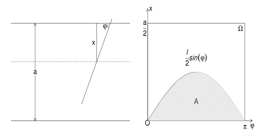

# 概率空间

- 参考教材：《概率引论》何书元（主要用书，但比较基础）、《概率论》苏淳（大数律章节的补充）
- **试验S**：按照一定想法去做的事情
  - 目的：考察试验出现的可能结果
- **样本点 $\omega$**：试验S的可能结果
  - 样本点可以是用文字（此时省略为大写字母H、T）定义，也可以用数字定义，一般用后者
- **样本空间 $\Omega$**：样本点的集合称为试验的样本空间

## 有限样本空间

- **有限样本空间**：只有有限个样本点
  - **事件 $A$**：有限样本空间 $\Omega$ 的子集
  - **事件 $A$ 发生**：当前试验的结果 $\omega \in A$
  - **不可能事件**：空集是事件，但没有样本点，因此不会发生
  - **必然事件**：全集
- **事件的运算（集合的运算公式和性质）**：$A+B = A\cup B$，$AB = A\cap B$
  - **事件互斥**：$AB = \varnothing \Leftrightarrow \overline{A} = \Omega - A$
    - 两个则称为**对立事件、逆事件**
    - 多个则称为**互斥、互不相容**

### 概率

- **概率**：$P(A)$ 表示A发生的可能性的大小，且 $P(A) \in [0,1]$
- **样本点的个数**：$^{\#}A、^{\#}\Omega$
- **古典概型**：每个事件发生的概率相同，即 $P(A) = \frac{^{\#}A}{^{\#}\Omega}$
  - 二项分布（放回）：$C^k_n(\frac{a}{a+b})^k(\frac{a}{a+b})^{n-k}$
  - 超几何分布（不放回）
- **几何概型**：样本空间的面积 $m(\Omega)$ 是正数，样本点等可能落在 $\Omega$ 中，则 $P(A) = \frac{m(A)}{m(\Omega)}$ 称为概率
  - 非负性、和1性、线性
- **会面问题**：二维线性规划
- **贝特朗问题**：在单位圆内任取一条弦，弦长 $\geq \sqrt{3}$ 的概率（圆内接等边三角形）
  - 弦的端点等可能地落在圆周上：$\frac{1}{3}$ 的圆弧长度
  - 弦的中点等可能地落在圆内：等边三角形的内切圆面积
  - 弦的中点等可能地落在垂径上：$\frac{1}{2}$ 的垂径长度
- **Buffon投针实验**：距离为a的两个平行线，投一根 $l\leq a$ 的针，求相交概率
  - 建立两个坐标 $(x,\varphi)$，x是中点到最近平行线的距离，$\varphi$ 是夹角
  - 积分面积和总面积的比就是概率
  -  

### 概率空间

- 事件经过有限次的集合运算依然是事件
- **$\sigma$ 域（代数）**：$\mathcal{F}$ 是试验S的事件的全体
- **概率的公理化条件**：非负性、完全性（规范性）（和1性）、互斥可列可加性
  - **概率的本质**：事件在概率空间中的权重，本质是集合函数
- **概率的性质**：空集零性、有限可加性、补集性、可减性、单调性、次可加性
  - 几何概型的可列可加性，即为可测集的无穷直和性
  - 无穷和有穷的可加性互推：利用空集
  - 次可加性（三角不等式），利用补集簇证明
  - 利用单调性
    - 满概率事件：$P(AB) = P(B)$
    - 零概率事件：$P(A+B) = P(B)$
- **概率空间**：$(样本空间，\sigma域，概率)$
  - 分别定义元素、运算、权重
- **非概率空间**
  - $\Omega$ 是全体正整数，$B_n$ 是前n个整数
  - 前n个数中集合C中元素出现的概率：$P(C) = \frac{^\#(C\cap B_n)}{n}$
  - $A = \{km\mid k=1,2,...\}$，则 $\mathcal{F} = \{\varnothing,A,\bar{A},\Omega\}$ 是 $\sigma$ 域，P是 $\mathcal{F}$ 上的概率，$(\Omega,\mathcal{F},P)$ 是概率空间
  - $\Omega$ 的幂集 $\sigma$ 域上不能定义概率：
    - $P(\mathop{\bigcup}\limits^\infty_{j=1} \{j\}) = 1 \neq \sum\limits^\infty_{j=1} P(\{j\}) = 0$
    - 出现 $\infty·\varepsilon$ 的情况，不满足可列可加性

### 概率连续性

- 单调事件列及其极限的定义
- **概率的连续性**：单调事件列极限的概率 是其 事件概率的极限
  - **证明**：
    - 单调增：补集簇的互不相交性（概率可加性）
    - 单调减：对偶集单增
  - **推论**：极限交换次序