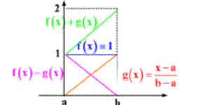

# 内积空间

- **范数和内积的关系**：
  - 内积可以诱导范数（内积范数）
  - 范数可以诱导内积（必须满足平行四边形法则）
    - 一般来说范数诱导的内积没有讨论价值
    - 我们一般都是先定义内积，再研究这个内积所诱导的内积范数的性质
  - 对于不满足平行四边形等式的 $B^*$ 空间，我们没有必要讨论与内积相关的量

## 内积

- **共轭双线性函数**：$a: \ms X\times\ms X \to \C$
  - **诱导的二次型**：$q(x) = a(x,x)$
- **内积**：满足共轭对称性、正定性的共轭双线性函数
  - 一般将欧氏空间的点积称为“点积”。内积则是更广义的概念
- **半内积**：满足共轭对称性、非负定性的共轭双线性函数
- **内积空间**：定义了内积的线性空间
  - **无穷维向量内积**：$\ell^2$ 空间，内积为 $(x,y) = \sum\limits^\infty_{i=1} x_i\overline{y_i}$
  - **函数内积**：$L^2(\Omega,\mu)$ 空间，内积为 $(u,v) = \dis\int_{\Omega} u(x)\overline{v(x)}d\mu$
  - $C^k(\overline{\Omega})$ 空间，内积为 $(u,v) = \sum\limits_{|\alpha|\leqslant k}\dis \int_{\Omega} \partial^\alpha u(x)\cdot \overline{\partial^\alpha v(x)} \overline{dx}$
  - 内积函数必须有界：维度至多可数
- **内积范数**：$\|x\| = (x,x)^{\frac{1}{2}}$
  - 内积诱导的范数，是2范数的推广
  - 在内积空间中，内积范数就是该空间上的2范数。这可被后面的正交分解公式证明
  - **证明**：
    - **正定性**：内积正定性导出
    - **齐次性**：共轭双线性导出
    - **三角不等式**：
      - 由共轭双线性得，$\|x+y\| = \sqrt{(x,x) + (x,y) + \ol{(x,y)} + (y,y)}$
      - 由共轭的性质得上式 $= \sqrt{(x,x) + 2\text{Re}(x,y) + (y,y)}$
      - 再由实数的C-S不等式即得结论
- **内积范数的性质**：
  - **C-S不等式**：内积范数满足 $|(x,y)|\leqslant \|x\|\cdot \|y\|$
    - **证明**：
      - 由实数的C-S不等式易得结论
  - **特定连续性**：内积关于内积范数连续
    - 映射连续性依赖于具体的拓扑。而在 $B^*$ 空间中，范数 $\xto{诱导}$ 度量 $\xto{诱导}$ 拓扑。故每个范数下，内积的连续性不同
    - **证明**：
      - C-S不等式得满足Heine定理式，从而连续

### 判别定理

- 对于赋范线性空间 $(\ms X,\|\cdot\|)$，其范数是已给定的（唯一的），但内积可以有不同定义。我们希望约定一个用于研究的“标准内积”，也就是希望用范数来构造一个内积
- **平行四边形等式**：$\|x+y\|^2 + \|x-y\|^2 = 2(\|x\|^2+\|y\|^2)$
  - **推论**：
    - 若成立平行四边形等式，则成立勾股定理
    - 若成立勾股定理，则向量的正交分解具有唯一性
  - **几何意义**：
    - 若满足这个等式，则说明空间中存在平行四边形，即可以定义角度，从而可以定义内积
    - 若在欧氏空间中，其表示平行四边形中，两对角线长度的平方和 = 四边长度的平方和
  - **代数意义**：
    - 若内积代表平方和，则其表示相反的完全平方式相加，只会得到完全平方项
  - **反例**：
    - 在 $\R^2$ 上取1范数，则单位圆是菱形，
- **诱导定理**：$B^*$ 空间中可定义内积 $\LR$ 范数满足平行四边形等式
  - 用范数诱导内积时所需要的条件
  - **证明**：
    - **必要性**：由内积性质即可计算得出
    - **充分性（极化恒等式）**：内积可设为 $$(x,y) = \begin{cases} \dfrac{1}{4}\Big( \|x+y\|^2 - \|x-y\|^2 \Big) & \K = \R \\\\ \dfrac{1}{4} \Big(\|x+y\|^2 - \|x-y\|^2 + i\|x+iy\|^2 - i\|x-iy\|^2 \Big) & \K = \C \end{cases}$$
      - 易得其满足内积定义
- **内积空间判别定理**：内积空间 $\LR$ 严格凸的 $B^*$ 空间
  - **证明**：相容定理的推论
    - **必要性**：
      - 首先，内积空间已经是 $B^*$ 空间
      - 由共轭双线性，易得内积范数满足如下**完全平方式**：$$\|\l x+(1-\l)y\|^2 = \l^2\|x\|^2 + 2\l(1-\l)\text{Re}(x,y) + (1-\l)^2\|y\|^2$$
      - 再代入严格凸定义式，即得内积范数是严格凸泛函，从而内积空间是严格凸的 $B^*$ 空间
    - **充分性**：
      - 将上面的过程逆推一遍即可

### 完备性

- **Hilbert空间**：完备的内积空间
- **庞加莱不等式**：
  - 设 $C^m_0(\Omega) = \set{u\in C^m(\overline{\Omega})\mid \forall u(y) = 0，y为\Omega 边界的某邻域内点}$
    - 有界开区域上所有 $m$ 次连续可微，并在其边缘邻域上值为0的函数
  - 则 $\forall u\in C^m_0(\Omega)$，有 $$\sum\limits_{|\alpha|<m} \int_\Omega |\partial^\alpha u(x)|^2 dx \leqslant C\sum\limits_{|\alpha|=m} \int_\Omega |\partial^\alpha u(x)|^2 dx$$
    - $m$ 阶以下的全部2-范数之和，与 $m$ 阶的2-范数等价
  - **证明**：
    - 由 $\Omega$ 有界，设 $\Omega_1$ 是边长为 $a$ 的包含 $\Omega$ 的正方体
      - 可选取坐标系使正方体中心为零向量 
      - 定义 $u(x)$ 在 $\Omega_1-\Omega$ 上为0
      - 从而 $u$ 在 $\Omega_1$ 上 $m$ 阶连续可微，且边界上为0
    - 已知 $\dis u(x) = \int^{x_1}_0 \pfrac{u}{t}(t,x_2,...,x_n)dt$（取 $x_1$ 维度）
      - 由C-S不等式，$\dis|u(x)|^2 \leqslant a\int^a_0 |\pfrac{u}{x_1}|^2 dx_1$
        - $a$ 上界：积分上界不等式
        - $a$ 因子：C-S不等式需要两个被积函数，选取另一个为常函数1
      - 两边对 $\Omega_1$ 积分得 $\dis\int_\Omega |u(x)|^2dx \leqslant a^2\int_\Omega |\pfrac{u}{x_1}|^2 dx$
        - 立方体的边界与参数无关，从而可累次积分
        - $a$ 因子：对 $x_1$ 积分过一次后，再在立方体中对 $x_1$ 积分，就相当于对常数积分，结果为 $a$。而每个累次积分结果在总积分中都是一个因子
      - 再由梯度最快性，$\dis\int_\Omega |u(x)|^2dx \leqslant a^2\int_\Omega |\grad u(x)|^2 dx$
        - 梯度的模是偏导数平方和，梯度本身才是向量（这都搞不清楚……）
        - 梯度是齐次的，可以看作一阶微分
    - 取 $\alpha = 1,...,m-1$，对每个 $\a$ 对应的 $\partial^\a u(x)$，应用 $m-\a$ 次不等式，则此时右侧微分阶数为 $m$。然后将所有 $\a$ 的不等式相加，即可得到庞加莱不等式
      - 此时 $C = \sum\limits_{|\a|< m} a^{2(m-\a)}$（**证毕**）
  - **本质**：C-S不等式 + 不断取导数来升阶
  - **推论**：$\|u\|_m$（m阶2-范数）和 $\|u\|$ （小于m阶2-范数）等价
- **$H^m_0(\Omega)$（Sob-0空间）**：$C^m_0(\Omega)$ 完备化后的空间
  - **完备性**：其为Hilbert空间
  - **内积**：$(u,v)_m = \dis\sum\limits_{|\alpha| = m} \int_\Omega \partial^\alpha u(x)\overline{\partial^\alpha v(x)}dx$

### 习题

- **内积的反例**：$C[a,b]$（取最值范数）中不可能引入内积 $(f,f)^{\dfrac{1}{2}} = \max\limits_{a\leq x\leq b} |f(x)|$
  - **证明**：
    - 取 $f(x) = 1，g(x) = \cfrac{x-a}{b-a}$
    - 发现它们不满足平行四边形等式
  - **几何理解**：

## 正交性

- **正交集**：任意两个元素都彼此正交
  - 判定方法：$S = \{e_\alpha\mid \alpha\in A\}$，若 $\forall e_\alpha\perp e_\beta\quad (\alpha\neq\beta)$，则 $S$ 为正交集
  - **正交规范集**：任意元素都是单位向量，且彼此正交
  - **完备正交集**：$S^\perp = \{\theta\}$
    - 正交集，同时是极大线性无关组
- **完备定理**：非零内积空间中必定存在完备正交集
  - **证明**：
    - 在全体正交集中，定义包含意义下的偏序关系
    - 由Zorn引理，$(\ms X,\subset)$ 存在极大元。该极大元就是完备正交集
  - **本质**：由良序原理，任意维度的空间均存在基
- **Hamel基（线性无关基）**：
  - **定义**：若一组向量可以张成 $\ms X$，则其中的极大线性无关组称为 $\ms X$ 的一组Hamel基
  - 有限维空间中，Hamel基就是高代中定义的基
  - 但在无穷维空间中，Hamel基不一定可数，且不能表出所有向量
  - **性质**：
    - **维数公式**：$\ms X$ 的维数 = Hamel基的个数
    - **存在性**：线性空间中一定存在Hamel基
- **Schauder基（线性表出基）**：
  - **定义**：
    - Banach空间 $\ms X$ 中，若向量序列 $\{e_i\}_{i\in\natnums}$ 满足以下性质，则称它是 $\ms X$ 的一组Schauder基
    - **非零性**：$\forall i\in \natnums，e_i\neq \t$
    - **唯一表出性**：$\forall x\in \ms X$，存在唯一一组标量 $\{\l_i\}_{i\in \natnums}$，使得 $x = \lim\limits_{n\to\infty}\sum\limits^n_{i=1} \l_i e_i$
  - **性质**：
    - **可分性**：Schauder基必须定义在可分的Banach空间上
    - **不一定存在性**：Schauder基不一定存在
- **正交规范基**：若内积空间 $\ms X$ 中，存在至多可数的完备正交规范集 $\{e_n\}^\infty_{n=1}$，则称为 $\ms X$ 的一组正交规范基
- **傅立叶级数**：设 $\{e_n\}$ 是正交规范基，则 $\sum\limits^\infty_{n=1} (x,e_n)e_n$ 称为傅里叶级数
  - 取空间为 $L^2[0,2\pi]$，正交规范基为 $\{e^{in\pi}\}$ 时，它就是数分中学到的三角级数
- **$x$ 关于基 $\{e_\a\}$ 的傅立叶系数**：$(x,e_\alpha)$
  - 几何意义：$x$ 在各个正交方向上投影分量的长度

### 习题

- **不能定义不可数个数的和**：
  - **理解**：
    - 要实现不可数个数的求和，则必须定义一个求和顺序。若不同的求和顺序导致的求和结果不同，那么这个和就不能被定义
    - 更深层的含义可由更序级数发现。当我们确定一个集合是“可数”的，那么本身就已经对它定义了一个顺序。采用这个顺序，我们才能定义出 $n$ 的函数 $a_n$
    - 比如对 $[0,1]$ 中的所有实数求和，不同求和顺序的结果不同
- **不可数个正实数之和不可能有界**
  - **证明**：
    - 用长为 $\frac{1}{n}$ 区间划分数轴，最终一共有可数个区间，故必定有一个区间内有无穷项
    - 再可证其不可能为 $(0,\frac{1}{n}]$ 区间内的可数个数
    - 与 $p$ 级数比较即得该子列无界，总列当然也无界
- **可数维欧氏空间不是Banach空间**
  - **证明**：
    - 若按正常序，
      - 投影范数：$\|x\| = |x_1|$，则不满足正定性中的零向量唯一条件
      - 无穷范数：$\|x\| = \max\limits_{i\in \natnums} |x_i|$，则若 $\{x_n\}$ 为无穷大量，范数就不可定义
    - 若自定义良序，并采用无穷范数，则不满足齐次性
- **不存在Hamel基意义下的可数维Banach空间**
  - **证明**：
    - 反设存在可数基 $\{e_i\}^\infty_{i=1}$，则存在真闭子空间 $S_n = span\{e_i\}^n_{i=1}$
    - 已知 $\forall S_n$ 是疏集，其内不存在任何开球
    - 再由 $X = \mathop{\bigcup}\limits^\infty_{n=1} S_n$，故其为第一纲集
    - 但由Baire纲定理，完备度量空间必定是第二纲集，矛盾
- **没有Schauder基的可分Banach空间（Enflo）**：

### 正交规范基

- **Bessel不等式**：
  - 设 $\ms X$ 是内积空间，$S = \{e_\a\}_{\a\in A}$ 是其中的正交规范集
    - 不是正交规范基，所以可能不完备
  - 则对 $\forall x\in \ms X$，都有 $\sum\limits_{\alpha\in A} |(x,e_\alpha)|^2\leqslant \|x\|^2$
      - 左边表示 $x$ 在 $S$ 对应的正交方向上的投影长度
      - 右边表示 $x$ 的内积范数
      - 等号成立条件为 $x\in\ol{\span S}$
        - 当 $x$ 存在 $\span S$ 以外的分量时，左式缺少这些分量对应的值，所以严格小于右式
  - **证明**：
    - **有限情况**：
      - 考虑 $\Big\| x-\sum\limits^n_{i=1}(x,e_i)e_i \Big\|^2$
        - 由内积的双线性 + $e_\a$ 的正交性得上式 $ = \|x\|^2 - \sum\limits^n_{i=1} |(x_i,e_i)|^2$
        - 再由范数正定性得上式 $\geqslant 0$
        - 综上即得有限情况下的Bessel不等式
    - **无穷情况**：
      - 易得 $\forall n\in\N$，满足 $|(x,e_\a)| > \dfrac{1}{n}$ 的 $e_\a$ 都至多有限，不妨设为 $A_n$
        - 反设 $\exists n$ 使得满足条件的 $e_\a$ 数量无限
        - 取 $N = \Big[ n\|x\| \Big]+1$ 个这样的 $e_\a$，则此时有 $\sum\limits^N_{i=1} |(x_i,e_i)|^2 > \|x\|^2$，与上面有限情况的Bessel不等式矛盾
      - 显然 $A_n$ 单增，故 $\lim\limits_{n\to\infty} A_n = \mathop{\bigcup}\limits^\infty_{n=1} A_n$，其元素至多可数，即满足 $(x,e_\a)>0$ 的 $e_\a$ 至多可数
        - （可数个有限集之并）的元素至多可数
      - 此时Bessel不等式左侧为可数级数。由有限情况 + 极限的保号性即可得到无穷情况下的Bessel不等式
  - **本质**：贝塞尔不等式其实就是正交分解公式的一般情况
- **勾股定理**：
  - 设 $\ms X$ 是Hilbert空间，$\{e_\a\}_{\a\in A}$ 是其中的正交规范集
  - 则
    - **傅立叶级数封闭性**：$\forall x\in \ms X，\sum\limits_{\alpha\in A} (x,e_\alpha)e_\alpha \in \ms X$
      - Hilbert空间中，对任意向量和任意正交规范集，其傅立叶级数均封闭（收敛）
    - **傅立叶级数收敛性**：$\Big\| x-\sum\limits_{\a\in A}(x,e_\a)e_\a \Big\|^2 = \|x\|^2 - \sum\limits_{\a\in A} |(x,e_\a)|^2$
      - 代数意义：任意傅立叶级数均收敛到对应的向量
      - 几何意义：无穷维内积空间的勾股定理
  - **证明**：
    - 由Bessel不等式得 $\sum\limits^\infty_{n=1} |(x,e_n)|^2$ 收敛，即 $\set{x_m = \sum\limits^m_{n=1} (x,e_n)e_n}$ 是 $\ms X$ 的基本列。再由Hilbert空间的完备性即得傅里叶级数封闭性
    - 易得 $\Big( x-\sum\limits^\infty_{n=1}(x,e_n)e_n \Big)\perp \sum\limits^\infty_{n=1} (x,e_n)e_n$，从而将题设等式化为可数形式后，再将左边用内积的性质进行变形即可得到右式
      <!-- - 高等代数中，对内积相关等式的证明往往采取在两边取内积的方法。这里只不过是保留思想，然后应用到了抽象空间中而已，并没有变得更难 -->
  - **理解**：
    - 内积空间中，傅立叶级数总是收敛，所以贝塞尔不等式的取等条件只需要考虑 $S$ 的完备性
- **Parseval恒等式（正交分解公式）**：
  - 设 $S$ 是Hilbert空间中的正交规范集，则下面三个命题等价：
    - $S$ 封闭
      - 即 $\forall x\in\ms X$ 都有 $x = \sum\limits_{\a\in A}(x,e_\a)e_\a$
    - $S$ 完备
      - 即 $S^\perp = \{\t\}$
    - $S$ 成立Parseval恒等式
      - 即Bessel不等式取等
  - **证明**：
    - $1\to 2$：
      - 反设不完备，则 $\exist x\in \ms X\j \{\t\}$，使得 $\forall \a\in A，(x,e_\a) = 0$
        - 等价于 $S$ 是非极大线性无关组，从而由正交补存在性，可取新线性无关向量 $x$ 与 $S$ 正交
      - 再由封闭性，$x = \sum\limits_{\a\in A}(x,e_\a)e_\a = \t$，矛盾
    - $2\to 3$：
      - 反设 $\exist x$，使得贝塞尔不等式不取等，即 $\|x\|^2 - \sum\limits_{\a\in A}|(x,e_\a)|^2 > 0$
      - 设 $y = x - \sum\limits_{\a\in A}(x,e_\a)$，易得其垂直于 $S$ 且不为 $\t$，与 $S$ 的完备性矛盾
    - $3\to 1$：
      - 由傅立叶级数收敛性 + Parseval恒等式得 $\|y\|^2 = 0$，从而 $y = \t$，即 $x = \sum\limits_{\a\in A}(x,e_\a)e_\a$

### 正交规范基举例

- **平方可积空间**：$L^2[0,2\pi]$
  - **正交规范基**：$e_n(t) = \cfrac{1}{\sqrt{2\pi}}e^{int}$
    - $int$ 表示虚数 $i$、序号 $n$、自变量 $t$ 三者的积
  - **Fourier系数**：$(u,e_n) = \dis\frac{1}{\sqrt{2\pi}} \int^{2\pi}_0 u(t)e^{-int}dt$
- **绝对收敛空间（可数维向量空间）**：$\ell^2$
  - **正交规范基**：自然基
  - **Fourier系数**：坐标
- **解析函数空间 $H^2(D)$**：设 $D$ 是复平面上的单位开球，取满足 $\dis\liint_D |u(z)|^2dxdy$ 有界的解析函数全体构成空间
  - **内积** $(u,v) = \dis\liint_D u(z)\overline{v(z)}dxdy$
  - **正交规范基** $\varphi_n(z) = \sqrt{\dfrac{n}{\pi}}z^{n-1}$
  - **幂级数展开** $u(z) = \dis\sum\limits^\infty_{k=0} b_kz^k$
  - **Fourier系数**：$(u,\varphi_n) = b_{n-1}\sqrt{\cfrac{\pi}{n}}$
    - **证明**：
      - 首先将 $u$ 进行幂级数展开，得 $\dis\liint_D \Big[ \sum^\infty_{k=0} b_kz^k \Big]\Big[ \sqrt{\frac{n}{\pi}}\ol{z}^{n-1} \Big] dxdy$
      - 由积分的线性，得 $\dis \sum^\infty_{k=0} \liint_D \Big[  b_kz^k \Big]\Big[ \sqrt{\frac{n}{\pi}}\ol{z}^{n-1} \Big] dxdy$
      - 发现幂级数和正交规范基的形式相似，配凑可得 $\dis\sum^\infty_{k=0} b_k\sqrt{\frac{\pi}{k+1}}(\p_{k+1},\p_n)$
      - 最后由正交规范基的正交性即可化为题设形式

### 内积空间的同构

- **G-S正交化方法**：详见高等代数
- **保积同构（内积同构）**：满足 $(Tx,Ty)_2 = (x,y)_1$ 的同构
  - 易得保积同构是等距同构和线性同构
- **内积空间的同构**：若存在保积同构 $T: \ms X_1\to \ms X_2$，则称内积空间 $\ms X_1,\ms X_2$ 同构
- **Hilbert可分定理**：Hilbert空间 $\ms X$ 可分 $\LR$ 存在正交规范基（正交规范集至多可数）
  - **证明**：
    - **必要性**：
      - 由可分性，存在可数稠密子集 $X = \{x_n\}^\infty_{n=1}$
      - 设 $X$ 的极大线性无关组为 $\{y_n\}^N_{n=1}$，对其G-S正交化，得 $\{e_n\}^N_{n=1}$
      - 由极大性 + 稠密性，$\overline{\span\{e_n\}^N_{n=1}} = \ol{X} = \ms X$，从而成立Paseval不等式，从而存在正交规范基
    - **充分性**：
      - 设正交规范基为 $\{e_n\}^N_{n=1}$，其中 $N$ 有限或无穷
      - 则子集 $\set{x = \sum\limits^N_{n=1} a_ne_n\mid \text{Re}(a_n),\text{Im}(a_n)\in \Q}$ 稠密，从而 $\ms X$ 可分
        - 利用有理数集 $\Q^n$ 在坐标空间 $\R^n$ 中的稠密性，可直接得到结论
    - **本质**：由于正交规范基的存在，正交规范基通过系数和 $\K^n$ 产生同构，从而有理数稠密性可推广到系数乃至向量中
- **Hilbert同构定理**：
  - 若 $|S| < \infty$，则 $\ms X$ 同构于 $\K^n$
  - 若 $|S| = \infty$，则 $\ms X$ 同构于 $\ell^2$
  - **证明**：
    - 设 $T: \ms X\to \K^n或\ell^2，x\mapsto \Big( (x,e_1),...,(x,e_N)\Big)$
    - 由Parseval等式，其为双射
    - 由定义易证其满足保内积性，从而是内积同构

### 习题

- **正交补转置性**：内积空间的子集满足 $M\subset N \red\Rt N^\perp \subset M^\perp$
  - **证明**：显然
  - **理解**：画个图就理解了
- **正交补自反性**：Hilbert空间的子集满足 $(M^\perp)^\perp = \ol{\span M}$
  - **互包证明**：
    - **反证**：每个垂直向量均可表为线性组合，从而 $(M^\perp)^\perp \subset \ol{span M}$
    - **正证**：线性组合中每个向量均与其垂直，从而 $(M^\perp)^\perp \supset \ol{span M}$
- **正交规范集的完备等价性**：Hilbert空间中，两个正交规范集若满足 $\sum\limits^\infty_{n=1} \|e_n-f_n\|^2 < 1$，则要么都完备，要么都不完备
  - **证明**：
    - 设 $\{e_n\}$ 完备，反设 $\{f_n\}$ 不完备，则存在 $u\in \ms X$，使得 $(u,\forall f_n) = 0$
    - 但由完备性（Parseval不等式）$$\|u\|^2  = \sum\limits^\infty_{n=1} |(u,e_n)|^2 \leq \sum\limits^\infty_{n=1} \|u\|^2\|e_n-f_n\|^2 < \|u\|^2$$，矛盾
  - **理解**：
- **正交规范基的并性**：Hilbert空间的闭线性子空间，其正交规范基和其正交补的正交规范基之并是总空间的正交规范基
  - **证明**：
    - 由正交分解定理，$x = y\in M+z\in M^\perp = \sum\limits^\infty_{m=1} (y,e_n)e_n + \sum\limits^\infty_{m=1} (z,f_m)f_m$
    - 表出定义式成立，从而是正交规范基
- **C-S不等式**：Hilbert空间的正交规范基 $\{e_n\}$ 满足 $|\sum\limits^\infty_{n=1} (x,e_n)\ol{(y,e_n)}| \leq \|x\|\|y\|$
  - **证明**：C-S不等式和Bessel不等式直得
- **变分不等式**：Hilbert空间 $\ms X$ 中，$a(x,y) $

## Hilbert最佳逼近问题

- **Hilbert最佳逼近定理**：Hilbert空间 $\ms X$ 中的闭凸子集 $C$ 上，范数的最小值点存在且唯一
  - 实际上就是取目标向量为 $\t$ 的最佳逼近问题
  - 在 $B^*$ 空间中，必须是有限个向量的组合才有解。但在Hilbert空间中，由于正交规范基的存在，这一限制不存在
  - 同时，$B^*$ 空间的可选范围局限在线性包（闭子空间）上，而Hilbert空间加强为了闭凸子集（为了解的唯一性，必须是凸的）
  - **证明**：
    - **存在性**：
      - 若 $\t\in C$ ，则最小范数就是 $\|\t\|$
      - 若 $\t\notin C$，则设最小范数为 $d = \inf\limits_{z\in C}\|z\|$
        - 由范数的连续性，存在 $\{x_n\}$ 满足 $d \leqslant \|x_n\| \leqslant d+\frac{1}{n}$
        - 定义 + 平行四边形等式易得 $\{x_n\}$ 为基本列。再由完备性得有极限 $x_0$，其即为范数的最小值点
    - **唯一性**：
      - 反设存在两个点，则由平行四边形等式，$\|x_0-x_0'\|^2 \leqslant 0$，故只能是最小值点唯一
  - **理解**：
    - 完备性确保最值点的存在性
    - 因为平行四边形等式的存在，使得空间是严格凸的，从而凸集上不存在直线，从而最值点唯一
  - **推论**：对任意 $y\in \ms X$，存在唯一的 $x_0\in C$，使得 $\|y-x_0\| = \inf\limits_{x\in C} \|x-y\|$
    - 一般情况下的Hilbert最佳逼近定理
    - **证明**；在上述证明中，将 $\t$ 换为 $y$ 即可
  - **实例**:
- **最佳逼近判定定理**：
  - 设 $C$ 是内积空间 $\ms X$ 中的闭凸子集，$y\in\ms X$
  - 则 $x_0$ 是 $y$ 在 $C$ 上的最佳逼近元 $\LR \forall x\in C，\text{Re}(y-x_0,x_0-x) \geqslant 0$
  - **证明**：
    - **目标函数**：设 $\p_x(t) = \Bigm\|y-\big[ tx + (1-t)x_0\big] \Bigm\|^2\quad (t\in [0,1])$
      - $\p_x$ 表示（$x$ - $x_0$ 连线上的点）到 $y$ 的距离
      - $t$ 表示 $x\to x_0$ 的已走比例
      - 则 $x_0$ 是最佳逼近元 $\LR \forall x\in C，\p_x(t)\geqslant \p_x(0)$
    - **函数简化**：
      - 首先将函数简化为 $\p_x(t) = \|(y-x_0)+t(x_0-x)\|^2$
      - 再由内积的共轭双线性得 $$\p_x(t) = \|y-x_0\|^2 + 2t\text{Re}(y-x_0,x_0-x)+t^2\|(x+x_0)\|^2$$
    - **函数计算**：
      - $\p'_x(0) = 2\text{Re}(y-x_0,x_0-x)$
      - $\p_x(t) - \p_x(0) = \p_x'(0)t + \|x_0-x\|^2 t^2$
      - 将上面几个式子联立，即可确立题设等价关系
  - **几何理解**：
    - 对于 $C$ 上任何点 $x$，$\or{xx_0}$ 都与 $\overrightarrow{x_0y}$ 垂直或同向
    - 因为一旦反向，那就说明 $x$ 比 $x_0$ 在 $\or{x_0y}$ 方向上更接近 $y$
    - 再由于 $C$ 是凸集，那么必定存在一个 $x$ 在 $\or{x_0y}$ 上的投影点 $x_1\in C$。
    - 此时 $x_1$ 比 $x_0$ 更接近 $y$，与 $x_0$ 的最佳逼近性矛盾
  - **推论（法向量性）**：
    - 设 $M$ 是Hilbert空间 $\ms X$ 上的闭线性子流形，$y\in\ms X$
    - 则 $x_0$ 是 $y$ 在 $M$ 上的最佳逼近元 $\LR (y-x_0)\perp (M-x_0)$
    - **证明**：
      - 易得闭线性子流形是闭凸集
      - 任取 $x\in M - x_0$。由最佳逼近判定条件，只需证明 $$(y-x_0,x) = 0\LR\text{Re}(y-x_0,x) \leq 0$$
      - 显然必要性易得，只需证明充分性
      - 易得 $M-x_0$ 是闭线性子空间
        - 由子空间封闭性得 $-x\in M-x_0$
        - 再由 $x$ 的任意性，可用 $-x$ 代替 $x$，可得 $\text{Re}(y-x_0,-x) \leq 0$，从而只能是 $\text{Re}(y-x_0,x) = 0$
          - 这是一个代入问题，仔细想想就明白了，在此不再赘述
      - 同理，用 $ix$ 代替 $x$，最终可得 $\text{Im}(y-x_0,x) = 0$
      - 综上即得充分性（**证毕**）
    - **本质**：线性流形的最佳逼近元是该流形的法向量
  - **推论（法向量性）**：
    - 设 $M$ 是Hilbert空间 $\ms X$ 上的闭线性子空间，$y\in\ms X$
    - 则 $x_0$ 是 $y$ 在 $M$ 上的最佳逼近元 $\LR (y-x_0)\perp M$
- **正交分解定理**：
  - 设 $M$ 为Hilbert空间 $\ms X$ 上的闭线性子空间
  - 则 $\forall x\in \ms X$，存在唯一正交分解 $x = y+z\quad (y\in M，z\in M^\perp)$
  - **证明**：
    - **存在性**：由Hilbert最佳逼近定理，$M$ 到 $x$ 的最佳逼近元存在，将其设为 $y$ 即可得到正交分解公式
    - **唯一性**：由正交补的性质易得 $M\cap M^\perp = \{\t\}$。再由最佳逼近元的唯一性即得结论
  - **几何意义**：$y$ 是 $x$ 在 $M$ 上的正交投影，$z$ 是 $M$ 的法向量
  - **推论（勾股定理）**：$\|x\|^2 = \|y\|^2+\|z\|^2$
    - **证明**：
      - 由内积范数定义 + 垂直性 + 内积双线性易得结论

### 最小二乘法

- **实际观测问题**
- **平方平均逼近**
- **最佳估计问题**

#### 习题

- **广义圆盘**：$C = \{x\in \ms X\mid \|x-x_0\|\leq r\}$
  - 则 $C$ 是闭凸集
  - $y = \begin{cases} x_0 + \dfrac{r(x-x_0)}{\|x-x_0\|}，x\notin C \\ x \whhh x\in C \end{cases}$
  - **证明**：