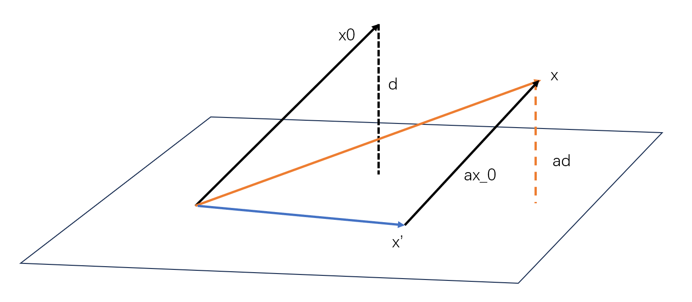

# 延拓与分离

- **内积形式表示泛函值**：$\lang f,x \rang = f(x)$
  - （$x\in \funcx$，$f$ 是其上的线性泛函）
  - 由于线性泛函本身也是 $B^*$ 空间的元素，故 $f(x)$ 可看作双线性函数，从而可用内积的形式来表达
  - 对称性：$x$ 同时也可以看作 $f$ 的泛函

## 延拓

- **延拓存在性**：
  - 首先说明一个事实，延拓是一定存在的。最平凡的情况就是分段函数
  - 但是有限制的延拓不一定存在，比如连续延拓、解析延拓、受控延拓
  - 所以证明重点是受控性在延拓中的传递

### 受控延拓定理

- **实Hahn-Banach定理**：$\funcx$ 是实线性空间，$p$ 是其上的次线性泛函，$\funcx_0$ 是实线性子空间
  - 若
    - $f_0$ 是 $\funcx_0$ 上的实线性泛函，其满足**受控条件**：$\forall x\in \funcx_0，f_0(x) \leqslant p(x)$
  - 则 $\funcx$ 上存在一个实线性泛函 $f$ 满足
    - **受控条件**：$\forall x\in\funcx，f(x) \leqslant p(x)$
    - **延拓条件**：$\forall x\in\funcx_0，f(x) = f_0(x)$
  - **构造性证明**：
    - **线性流形**：对于 $y_0\in \funcx-\funcx_0$，设 $\funcx_1 = \{x+\a y_0\mid x\in\funcx_0，\a\in\reals\}$
    - **延拓到 $\funcx_1$**：设延拓的线性泛函为 $f_1$
      - **若满足延拓条件**，则 $\forall x,\a，f_1(x+\a y_0) = f_0(x) + \a f_1(y_0)$
      - **若满足受控条件**，则 $f_1(x+\a y_0) \leqslant p(x+\a y_0)$
      - 再因为 $p$ 只有正齐次性，因此两边除 $|\a|$，有两种情况：
        - $\begin{cases} f_1(y_0-z) \leqslant p(y_0-z) ，\a > 0\\ f_1(-y_0+y) \leqslant p(-y_0+y)，\a<0 \end{cases}$
        - $z = y = \cfrac{x}{-\a}$
      - 受控条件等价于 $\\ \sup\limits_{y\in \funcx_0}\{f_0(y)-p(-y_0+y)\} \leq f_1(y_0) \leqslant \inf\limits_{z\in \funcx_0} \{f_0(z) + p(y_0-z)\}$
          - 将 $f_1$ 线性拆解，$p$ 保持不变即可（次可加性导致 $p$ 不能拆分）
      - 再因为 $p$ 满足次可加性，由 $f_0$ 受控性易得
        - $f_0(y)-f_0(z) \leqslant p(y-y_0) + p(y_0-z)$
        - 从而上式恒成立
      - 只要取 $f_1(y_0) \in [\sup,\inf]$ 的中间值即可
      - **不唯一性**：两端值不一定相等，从而可有多种取法
    - **延拓极大元**：
      - 设 $\ms F = \Large\set{(\funcx_\D,f_\D)\mid \substack{\funcx_0\subset \funcx_\D \subset \funcx \\ \forall x\in \funcx_0，f_\D(x) = f_0(x) \\ \forall x\in \funcx_\D，f_\D(x) \leqslant p(x)}}$
      - 引入延拓序关系，设 $M$ 为全序子集，$(\funcx_M,f_M(x))$ 是全序子集的并集
      - 易得其属于 $\ms F$，且为 $M$ 的上界。由Zorn引理，$\ms F$ 存在极大元，设为 $(\funcx_\Lambda,f_\Lambda)$
    - **极大元为整个空间**：
      - 反设不是，则由可由上述方法构造一个 $(\funcx_\Lambda,f_\Lambda)$ 上的延拓，与极大性矛盾
  - **理解**：分阶段构造
    - 首先证明 $\funcx_0$ 受控条件可以传递到线性流形 $\funcx_1$ 上
    - 然后再证明可以传递到整个空间上
- **复Hahn-Banach定理**：$p$ 由次线性泛函改成半范数，值受控关系改成模受控关系
  - **证明**：
    - 设 $g_0(x) = Re\ f_0(x)\quad (\forall x\in \funcx_0)$
      - 则由实H-B定理，存在受控延拓 $g$
    - 设 $f(x) = g(x) - ig(ix)\quad (\forall x\in \funcx_0)$
      - 易得延拓性、复齐次性
      - 受控性：设 $\t = \arg f(x)$，则 $\forall x\in \funcx，|f(x)| = f(e^{-i\t}x) = g(e^{-i\t}x) \leqslant p(e^{-i\t}x) = p(x)$
  - **本质**：实部投影 $g$ 的受控延拓传递
  - **推论**：复线性空间若含有均衡吸收真凸子集，则其上至少有一个非零线性泛函

### 保范延拓定理

- **广义Hahn-Banach定理**：$B^*$ 空间 $\funcx$，线性子空间 $\funcx_0$
  - 若 $f_0$ 是 $\funcx_0$ 上的有界线性泛函，范数为 $\|\cdot\|_0$
  - 则存在有界线性泛函 $f$（**保范延拓**），满足
    - **保范条件**：$\|f\| = \|f_0\|_  0$
    - **延拓条件**：$\forall x\in \funcx_0，f(x) = f_0(x)$
  - **证明**：设 $p(x) = \|f_0\|_0\cdot \|x\|$，则其为半范数。由复H-B定理，存在延拓 $f$ 受 $p$ 控制
    - 受控性导出 $\|f\| \leqslant \|f_0\|_0$
      - 由受控性，$\forall x，f(x)\leq p(x) = \|f_0\|_0\cdot\|x\|$
      - 取上界得 $\sup f(x) = \|f\|\|x\| \leq \|f_0\|_0\cdot\|x\|$
    - 延拓性导出 $\|f_0\|_0 \leqslant \|f\|$
      - 父空间中，$\|x\| = 1$ 的范围更大，从而像的上界只会更大
    - 故保范条件也成立
  - **理解**：
    - 延拓将受控进化为保范

### 经典连续延拓

- **单点延拓**：$B^*$ 空间 $\funcx$ 中，$\forall x_0\neq \t，\exist f\in \ms X^*$，使得 $f(x_0) = \|x_0\|$ 且 $\|f\| = 1$
  - **证明**：设 $\funcx_0 = \{\lambda x_0\mid \lambda\in \Complex\}$（复直线）
    - 定义 $f_0(\lambda x_0) = \lambda\|x_0\|$
      - 完全依赖于单点定义的连续线性泛函
    - 易得 $f_0(x_0) = \|x_0\|$ 和 $\|f_0\| = 1$
    - 再由广义H-B定理，存在保范延拓 $f$ 满足两个条件
  - **理解**：子空间 $\funcx_0 = \{\l x_0\}$，被延拓泛函为 $f_0:x_0\mapsto \|x_0\|$，延拓后为 $f:x\mapsto \|x\|$
  - **性质**：
    - **压缩性**：泛函范数为1，故对向量只能压缩不能伸展
  - **本质**：基于单点即可构造一个连续线性泛函，从而每个 $B^*$ 空间上均有足够多的连续线性泛函
  - **推论（判零方法）**：$x_0=\t \red\LR \forall f\in \ms X^*，f(x_0) = 0$
    - **必要性**：零向量定义易得
    - **充分性**：单点延拓保范性 + 范数正定性易得
- **流形延拓**：设 $\funcx$ 是 $B^*$ 空间，$M$ 是 $\funcx$ 的线性子空间
  - 若 $x_0\in \funcx$，且 $d = \rho(x_0,M) > 0$
  - 则 $\exist f\in \funcx^*$ 满足
    - $\forall x\in M，f(x) = 0$
    - $f(x_0) = d$
    - $\|f\| = 1$
  - **证明**：
    - **子空间**：$\funcx_0 = \{x' + \a x_0\mid x'\in M,\a\in\fk\}$
      - $M$ 沿 $x_0$ 方向平移形成的线性流形
    - **被延拓泛函**：$f_0: \funcx_0\to R，x\mapsto \a d$
      - $x$ 到 $M$ 的距离
      - 前两题设条件易得
      - 再由 $f_0(x) = |\a|\rho(x_0,M) \leqslant |\a|\|\dfrac{x'}{\a} + x_0\| = \|x\|$，得 $\|f_0\|\leqslant 1$
        - 由 $d = \min\limits_{x'\in M}\|x_0+x'\|$（$M$ 到 $x_0$ 的最佳逼近元），得不等式成立
    - 由广义H-B定理，将 $f_0$ 保范延拓到 $\funcx$ 上
      - 由延拓性，易得 $f$ 满足前两题设条件，且受控传递得 $\|f\|\leq 1$
      - 由R表示定理，$\exist y$ 满足 $f(x) = (x,y)$
        - 易得 $\forall x$，有 $|f(x)| = |(x-P_Mx,y)| \leq \|x-P_Mx\|\|y\|$
        - 左项为垂直于 $M$ 的分量长度，等于 $\rho(x,M)$
        - 右项为垂直于 $\Ker f = M$ 的单位向量像的长度，其也是像最长的向量，从而等于 $\|f\|$
        - 代入 $x=x_0$ 即得 $|f(x_0)| \leq d\|f\|$，从而由题设 $f(x_0) = d$ 得 $\|f\|\geq 1$
        - 这一段主要是R表示定理的几何意义，再看看那一部分就好
      - 综上，$\|f\| = 1$
    - 
  - **理解**：$f$ 为点到子空间 $M$ 的距离，从而 $M$ 是 $f$ 的核
    - 需要证明的只有 $\|f\| = 1$
      - 由于 $M$ 穿过 $\t$，而范数是点到 $\t$ 的距离，故所有范数为 $1$ 的点中，距离 $M$ 最远的点就是法向量，而它到 $M$ 的距离为1
  - **推论**：设 $M$ 是 $B^*$ 空间 $\funcx$ 的子集
    - $x_0\in \overline{spanM} \red\LR \forall f\in \funcx^*$，若 $\Ker f = M$，则 $f(x_0) = 0$
    - $x_0\neq\t$
    - **本质**：核与其闭线性包等价，即核是闭子空间（之前已经证明过了）
    - **证明**：
      - **必要性**：显然（核的闭线性包依然为核）
      - **充分性**：反设 $x_0$ 不在核的闭线性包中，则 $d>0$
        - 由流形延拓性，$\exist f\in\funcx^*$ 以 $M$ 为核且 $f(x_0) = d>0$，与题设矛盾。
    - **推论**：可数集 $M$ 的线性组合可逼近 $x_0 \LR \forall f\in\funcx^*$ 若满足 $\Ker f = M$，都有 $f(x_0) = 0$
      - **必要性**：由线性易得
      - **充分性**：反设 $x_0\notin \ol{spanM}$，则 $d = \rho(x_0,\ol{spanM}) > 0$
        - 则存在连续线性延拓使 $f(x_0) = d$，矛盾
      - **本质**：同上

### 习题

#### 简单延拓

- **受控存在性**：
  - 实线性空间 $\funcx$ 上任意次线性泛函 $p$，都存在实线性泛函 $f$，满足 $\begin{cases} f(x_0) = p(x_0) \\ f(x)\leq p(x)\quad (\forall x\in\funcx)\end{cases}$
  - **证明**：
    - 在子空间 $\funcx_0 = \{\a x_0\mid \a\in\R\}$ 上，由正齐次性，易得 $\forall f(x)$ 满足 $f(x_0) = p(x_0)$，都有 $f(x) \leq p(x)$ 恒成立
    - 然后延拓到整个空间即可
  - **本质**：正齐次性导致的直线受控性，在受控延拓中被传递到整个空间
- **半范数延拓**：复线性空间 $\funcx$ 上的半范数 $p$，核为空集
  - 则存在线性泛函满足
    - $f(x_0) = 1$
    - $|f(x)| \leq \cfrac{p(x)}{p(x_0)}\quad (\forall x\in\funcx)$
  - **证明**：受控存在性推论即可
- **流形延拓推论**：$B^*$ 空间 $\funcx$ 的闭子空间 $\funcx_0$ 中
  - 设点面距离为最佳逼近距离 $\rho(x,\funcx_0) = \inf\limits_{y\in\funcx_0} \|x-y\|$
  - 则 $\forall x\in \funcx，\rho(x,\funcx_0) = \sup\limits_{}\{|f(x)|: f\in\funcx^*，\|f\| = 1，f(\funcx_0) = 0\}$
  - **互包证明**：
    - $|f(x)| = \rho(x,N(f)) \leq \rho(x,\funcx_0)$，取上确界即可
    - 再由流形延拓，$\exist f(x) = \rho(x,\funcx_0)$，由绝对值不等式即得 $\sup|| \geq f(x)$
  - **理解**：呃呃，我本来以为它显然，就直接用在了证明里面
- **有界等价性推论**：$B^*$ 空间中的 $\{x_n\}$
  - 若 $\forall f\in \funcx^*$，$\{f(x_n)\}$ 有界
  - 则 $\{x_n\}$ 有界
  - **伪证1**：
    - $\{x_n\}$ 可延拓出一列 $\{f_n\}\in\funcx^*$，满足 $f_n(x_n) = \|x_n\|,\|f_n\| = 1$
    - 由题设条件，得 $\|f_n(x_n)\| = \|x_n\|$ 均有界
    - *但是处处有界不等于一致有界*
  - **伪证2**：
    - 取 $f(x) = \|x\|$ 即可
    - *但是范数不一定连续*
  - **有界等价性证明**：
  - **延拓证明**：？
  - **本质**：单点延拓定理推论的应用
- **指示函数定理**：$B^*$ 空间 $\funcx$ 中线性无关组 $\{x_n\}$，存在 $\{f_n\}\in\funcx^*$，使得 $\lang f_i,x_j \rang = \d_{ij}$
  - **证明**：设 $M = \mathop{span}\limits_{\substack{1\leq j\leq n \\ j\neq i}}\{x_j\}$，$d_i = \rho(x_i,M_i) > 0$
    - 由流形延拓定理，存在距离函数 $\bar f_i$
    - 再设 $f_i = \cfrac{\bar{f_i}}{d_i}$，其即为指示函数
  - **本质**：Hamel基方向的距离函数单位化，即成为Hamel基的指示函数

## 凸集分离定理

- **极大线性子空间**：以 $M$ 为真子集的线性子空间只能是总空间 $\funcx$
  - **等价命题**：$M$ 是线性真子空间，$\forall x_0\in \funcx-M$，有 $\funcx = \{\lambda x_0\mid \lambda\in\reals\} \oplus M$    
    - **必要性**：显然
    - **充分性**：反设即可
- **极大线性流形（超平面）**：极大线性子空间对向量的平移
  - **等价命题**：$\exist f\in\funcx^*$，使 $L = H^r_f = \{x\in\funcx\mid f\in\funcx^*，r\in\reals，f(x)=r\}$
    - **证明**：
      - **必要性**：$H^0_f$ 就是 $Ker\ f$，由前置知识，其为线性空间。
        - **极大性**：
          - 由 $\forall x_1\in \funcx-H^0_f，\forall x\in\funcx，\big[ \dfrac{1}{f(x_1)}x_1 - \dfrac{1}{f(x)}x \big] \in H^0_f$
          - 得 $x = \dfrac{f(x)}{f(x_1)}x_1 + H^0_f$
        - **流形性**：
          - 由线性得 $\exist x_0，f(x_0) = r$
          - 从而 $\forall x\in H^r_f$，$x-x_0\in H^0_f$
          - 从而 $H^r_f = x_0 + H^0_f$
        - **闭集性**：由 $f$ 连续性，其核为闭集
      - **充分性**：设 $L$ 为超平面
        - 设 $f(x_0) = r$，则 $L = x_0 + M\ (x_0\in \funcx-M)$
        - 则 $x = \lambda x_0 + y\ (\l\in\reals，y\in M)$
        - 定义 $f(x) = f(\lambda x_0 + y) = \lambda$，其为距离函数，满足流形延拓条件
          - 从而 $M = H^0_f$，$f(x_0) = 1$
          - 则 $L = H^1_f$
        - 由闭图像定理，若 $L$ 为闭集，则 $f$ 连续
    - **理解**：
      - 核是极大线性子空间，所以等值面就是极大线性流形
      - 结合之前的R表示定理几何意义
- **超平面分离集合**：$\begin{cases} E:f(x)\leq r \\ F:f(x)\geq r \end{cases}$
  - **分离函数**：$f$

### 延拓的分离意义

- **H-B几何形式（单点分离定理）**：设 $E$ 是实 $B^*$ 空间 $\funcx$ 上以 $\t$ 为内点的真凸子集
  - 则 $\forall x_0\notin E，\exist H^r_f$ 分离 $x_0$ 与 $E$
  - **证明**：设 $E$ 的M泛函为 $p$
    - 定义 $f_0(\lambda x_0) = \lambda p(x_0)$
    - 由正齐次性，$f_0(\lambda x_0) \leq p(\lambda x_0)$
    - 由实H-B定理，存在受控延拓 $f$
      - 延拓条件得 $f(x_0) = p(x_0) \geq 1$
      - 受控条件得 $f(x)\leq p(x)$，则 $f(x) \leq 1\ (\forall x\in E)$
  - **本质**：M泛函具有分离性，但不一定连续
    - 构造单点线延拓 $f$，其连续且延拓连续，只需证明受控延拓会保留分离性
  - **推论**：
    - 有穷维上可通过平移将 $\t$ 内点弱化为任意内点。无穷维则不能。
      - **证明**：
    - $H^r_f$ 是闭集
      - **证明**：$|f(x)| < \max\{p(x),p(-x)\}$
      - 再由 $p$ 有界，得 $f$ 在 $\t$ 处连续。再由 $f$ 线性即得连续性
      - 基本列定义易得闭集
- **凸集分离定理**：$B^*$ 空间 $\funcx$ 中的两个不相交非空凸集 $E_1,E_2$
  - 若 $E_1$ 有内点，则 $\exist s\in\reals，f\in\funcx^*$，使得 $H^s_f$ 分离 $E_1,E_2$
  - **证明**：
    - 定义易得 $E = E_1 + (-1)E_2$ 也是非空凸集且有内点，且 $\t\notin E$
    - 由H-B几何形式，存在 $H^r_f$ 分离 $E,\t$
      - 可设 $\begin{cases} f(x)\leq r\ (\forall x\in E) \\ f(\t) \geq r \end{cases}$，则只能为 $f(x)\leq 0$
      - 即 $f(y) < f(z)\ (\forall y\in E_1,z\in E_2)$
      - 从而 $\exist s\in\reals$，使得 $\sup\limits_{y\in E_1} \leq s \leq \inf\limits_{x\in E_2}f(z)$
      - 即 $H^s_f$ 分离 $E_1,E_2$
  - **理解**：
    - 凸集元素作差，不相交性得可与零向量分离，从而得像的单号性
    - 故两凸集的像存在严格序，则可分离
- **Ascoli定理（分离中间值定理）**：设 $E$ 是实 $B^*$ 空间 $\funcx$ 中的闭凸集 
  - $\forall x_0\in\funcx-E，\exist f\in\funcx^*，\a\in\reals$，满足 $\forall x\in E，f(x)<\a<f(x_0)$
  - **证明**：
    - 由 $E$ 是闭集，$\exist \delta > 0$，使得 $B(x_0,\d) \subset \funcx-E$
    - 对 $E,B(x_0,\d)$ 应用凸集分离定理，$\exist f\in\funcx^*$，使得 $\sup\limits_{x\in E}f(x) \leq \inf\limits_{y\in B(x_0,\d)} f(y)$
    - 由线性泛函开球中心无极值性得 $\inf\limits_{y\in B(x_0,\delta)} f(y) < f(x_0)$
    - 综上，$\sup\limits_{x\in E}f(x) < f(x_0)$，则取 $\a$ 为该式中间值即可
  - **理解**：开集中无极值，故分离公式不可取等号，从而有中间值 $\a$
  - **本质**：单点开邻域分离定理
- **Mazure定理（切线存在性）**：设 $E$ 是 $B^*$ 空间 $\funcx$ 上有内点的闭凸集，$F$ 是 $\funcx$ 上的线性流形
  - 若 $\overset{\circ}{E}\cap F = \varnothing$
  - 则 存在闭超平面 $L\supset F$，使 $E$ 在 $L$ 的一侧
  - 存在 $f,s$，使得 $f(x)\leq s\ (\forall x\in E)，f(x) = s\ (\forall x\in F)$
  - **证明**：设 $F = x_0 + \funcx_0$
    - 由凸集分离定理，$\exist H^r_f$ 分离 $E,F$ 满足 $f(E) \leq r，f(x_0+\funcx_0) \geq r$
      - 再由线性子空间无极值性，$f(x) \equiv 0\ (\forall x\in \funcx_0)$
      - 从而 $\funcx_0\subset H^0_f$
    - 设 $f(x_0) = s$，则 $F \subset x_0 + H^0_f = H^s_f$
      - 由分离公式，此时可取 $r = s$，从而 $f(E) \leq s$
  - **理解**：
    - 线性子空间无极值，但其又可以分离，所以其上为恒值
    - 再由流形性，分离值取决于原线性子空间的平移量

### 切线

- **凸集 $E$ 在 $x_0$ 的承托超平面**：$E$ 在 $L$ 的一侧，且 $\overline{E}$ 与 $L$ 有公共点 $x_0$（切线与切点）
  - **实例**：$E = \{x\in\funcx\mid \|x\|\leq r\}$，若 $\|x_0\|=r$，则 $E$ 在 $x_0$ 有一个承托超平面
    - **证明**：由单点延拓定理，存在 $x_0$ 单点延拓的函数 $f$。
      - 易得 $f(x) = \|x\| \leq \|f\|\cdot \|x\| \leq r = f(x_0)$
      - 从而 $H^r_f$ 即为承托超平面
    - （线性空间上圆的边界上有一个切点）
- **切线定理**：若 $E$ 是 $B^*$ 空间 $\funcx$ 上有内点的闭凸集，则其每个边界点均可作出承托超平面
  - **证明**：取 $x_0\in E - \oo E$，$F = \{x_0\}$
    - 由Mazure定理，$\exist f,s$，使得 $\forall x\in E，f(x)\leq s = f(x_0)$
  - **本质**：Mazure定理的本质就是切平面存在性定理

### 习题

- **极大的维数表示**：线性空间 $\funcx$ 中，$M$ 是极大线性子空间 $\LR dim(\funcx-M) = 1$
  - **证明**：
- **Ascoli引理推论**：复线性空间 $\funcx$ 中，$E$ 是非空均衡凸集，
  - 则 $\forall x_0\in\funcx_0-E$，有 $\exist f\in\funcx^*，\a>0$，使得 $\forall x\in E，|f(x)| < \a < |f(x_0)|$
  - **证明**：由Ascoli引理得实中间值函数 $g$
    - 设 $f = g(x) + ig(-ix)$，则 $\sup |f(x)| = \sup g(x) < g(x_0) = |g(x_0)| \leq |f(x_0)|$
    - 取 $\a \in (\sup f(x), |f(x_0)| )$ 即可

## 应用

### 抽象可微

- **抽象函数**：设 $\funcy$ 是 $B^*$ 空间，则 $f: (a,b)\to \funcy$ 是自变量 $t$ 的抽象函数
- **抽象微商**：$f'(t) = \lim\limits_{\D t\to 0} \dfrac{f(t+\D t) - f(t)}{\D t}$
- **中值定理**：
  - 若抽象函数可微，则 $\for t_1,t_2\in(a,b)，\exi\t\in (0,1)$
  - 使得 $\|f(t_2)-f(t_1)\| \leq \|f'(\t t_2 + (1-\t)t_1)\|\cdot |t_2-t_1|$
  - **证明**：
    - 由单点延拓定理，$\exist y^*$，范数为1，且 $\lang y^*,f(t_2)-f(t_1) \rang = \|f(t_2)-f(t_1)\|$
    - 设中值内积为 $\p(\eta)$，则其为实函数，满足L中值定理
    - 综合两式即得结论
  - **理解**：

### Lagrange乘子法

- **凸泛函**：$f: C\to R$ 满足 $\funcx$ 是线性空间，$C$ 是其上的凸集，$\\ \for x,y\in C,\l\in(0,1)，f(\l x + (1-\l)y) \leq \l f(x) + (1-\l)f(y)$
  - **等价命题**：**上方图** $epi(f) = \{(x,t)\in C\times \reals\mid f(x)\leq t\}$ 是凸集
- **凸规划问题**：
  - $(P)$：给定凸集 $C$ 上的凸函数 $\{f,g_1,...,g_n\}$，求 $x_0\in C$ 满足 $\begin{cases} g_i(x_0) \leq 0 \whhh 约束条件\\ f(x_0) = \min\{f(x)\mid x\in C,g_i(x)\leq 0\} \end{cases}$
  - **Lagrange乘子法**：将约束极值问题化为无约束极值问题
    - **L乘子**：$(\widehat{\l}_1,\widehat{\l}_2,....,\widehat{\l}_n)\in\R^n$，使得
      - 若 $x_0$ 是 $(P)$ 的解
      - 则 $f(x_0) + \sum\limits^n_{i=1} \widehat{\l_i}g_i(x_0) = \min\{f(x) + \sum\limits^n_{i=1} \widehat{\l_i}g_i(x)\mid x\in C\}$
  - **简化方法**：引入 $\widehat\l_0$ 新参数
    - 原式化为：$f(x_0) + \sum\limits^n_{i=1} \widehat{\l_i}g_i(x_0) \leq \widehat{\l}_0 f(x) + \sum\limits^n_{i=1} \widehat{\l_i}g_i(x)$
    - **几何意义**：在 $\R^{n+1}$ 上寻找超平面，使得
      - **分离集合**：
        - $E = \set{(t_0,t_1,...,t_n)\in\R^{n+1} \mid \large t_0\leq f(x_0)，  t_i\leq 0}$
        - $F = \set{(t_0,t_1,...,t_n)\in\R^{n+1} \Large\normalsize\mid \exist x\in C，使 t_0\geq f(x)，t_ig_i(x)}$
      - 易得 $F$ 是凸集，$E$ 是有内点的凸集。
      - $\oo E = \set{(t_0,t_1,...,t_n)\in\R^{n+1}\mid t_0<f(x_0), t_i < 0 }$
      - 由 $x_0$ 是 $(P)$ 的解，得 $\oo E\cap F = \varnothing$
      - 则 $\widehat{\l}_0 f(x) + \sum\limits^n_{i=1} \widehat{\l_i}g_i(x) \leq \widehat{\l}_0 (f(x) + \xi_0)  + \sum\limits^n_{i=1} \widehat{\l_i}(g_i(x) + \xi_i)$
      - 从而 $\widehat{\l_i}\geq 0$，且弱化不等式成立
    - $\widehat{g}_i(x_0) = 0$
      - 由凸集分离定理，$\widehat{\l}_0f(x_0) \leq \widehat{\l}_0 f(x) + \sum\limits^n_{i=1} \widehat{\l_i}g_i(x)$
      - 从而 $\sum\limits^\infty_{i=1} \widehat{l}_ig_i(x_0) \geq 0$
      - 再由假设，$g_i(x_0)\leq 0，\widehat{\l}_i \geq 0$
    - $\widehat{\l}_0 > 0$ 的条件
    - **引理**：若 $\exist \widehat{x}\in C$ 满足 $g_i(\widehat{x}) < 0$，则 $\widehat{\l}_0 > 0$
      - **证明**：反设 $\widehat{\l}_0 = 0$，由前式得 $\sum\limits^\infty_{i=1} \widehat{\l}_i g_i(\widehat{x}) \geq 0$
      - 由 $(\widehat{\l}_0,\widehat{\l}_1,...,\widehat{\l}_n) \neq \t$，得 $(\widehat{\l}_1,...,\widehat{\l}_0) \neq \bd 0$
      - 再由 $\widehat{\l}_i \geq 0$，由引理条件得 $\sum\limits^\infty_{i=1} \widehat{\l}_i g_i(\widehat{x}) < 0$，矛盾
- **Kuhn-Tucker定理**：设 $\funcx$ 是线性空间，$C$ 是其上凸子集，$f,g_1,...,g_n$ 是 $C$ 上凸泛函
  - 若 $x_0$ 是问题的解
  - 则 存在实数 $\l_1,...,\l_n \geq 0$ 满足 $f(x_0) = \min\{f(x) + \sum\limits^n_{i=1}\l_i g_i(x)\mid \for x\in C\}$

### 次微分

- **$x_0$ 上的次微分**：
  - 凸函数 $f:\funcx\to\reals$
  - $\partial f(x_0) = \{x^*\in\funcx^*\mid \for x\in\funcx，\lang x^*,x-x_0 \rang \leq f(x) - f(x_0)\}$
    - 所有次梯度的集合
  - **次梯度**：$x^*$
    - 小于该函数在定义域上所有差分的一个值
- **次可微定理**：若凸函数 $f:\funcx\to\reals$ 在 $x_0$ 连续，则 $\partial f(x_0) \neq \varnothing$
  - **证明**：
    - 在空间 $\funcx\times\reals$ 上，$epi(f)$ 是凸集
      - 再由连续性，其有内点 $(x_0,f(x_0)+1)$
      - 且 $\{(x_0),f(x_0)\}\cap \oo{epi(f)}$
    - 由凸集分离定理，$\exist (x^*,\xi)$ 分离该凸集和单点集

### 习题

- **Cauchy积分定理**：$B$ 空间 $\funcx$ 内，$G$ 是 $\Complex$ 中简单闭曲线 $L$ 围成的开区域
  - 若 $x(z): \ol{G}\to\funcx$ 在 $G$ 内解析，在 $\ol G$ 上连续
  - 则 $\int_L x(z)dz = 0$
  - **推论**：**算子值解析函数** $x(z)$