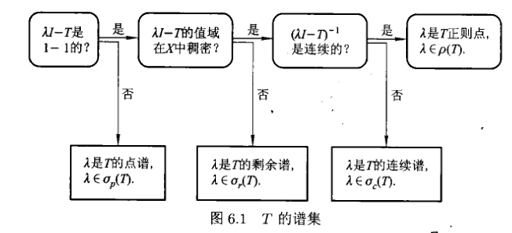

# 谱理论

- **符号约定**：
  - $D(A)$ 表示 $A$ 的定义域
  - 空间默认是复 $B$ 空间，所有线性算子默认为变换
  - $I$ 表示恒等映射

## 无穷维空间的特征值理论

- **特征值和特征向量**：
  - 设 $\ms X$ 是复 $B$ 空间，$A: \Big( D(A) \subset \ms X \Big)\to\ms X$ 是线性算子
    - 必须将空间映射到自己（变换）
  - 若存在非零向量 $x_0$ 和 $\l\in\C$ 使得 $Ax_0 = \l x_0$
    - 特征向量不能为零向量（否则特征值不唯一）
  - 则 $\l$ 称为 $A$ 的一个特征值，$x_0$ 称为 $A$ 的一个特征向量
    - 特征值和特征向量一一对应
- **预解变换**：$\l I-A$
- **预解方程**：$(\l I - A) x = \t$
- **特征值判别定理**：$\l$ 是 $A$ 的特征值 $\LR$ 对应的预解方程存在解
- **特征向量判别定理**：$x$ 是 $A$ 关于 $\l$ 的特征向量 $\LR$ $x$ 在预解方程解空间 $\ker (\l I-A)$ 中
  - （特征向量集合）就是（预解方程的解集）

### 特征子空间

- **特征子空间**：$\ker (\l I-A)$ 称为 $A$ 关于特征值 $\l$ 的特征子空间
- **几何重数**：$\dim\ker(\l I-A)$ 称为特征值 $\l$ 的几何重数
- **直和性**：特征子空间彼此构成直和
  - **证明**：
    - 只需证明不同的特征值对应的特征向量线性无关即可
    - 反设线性相关，将 $A$ 作用在线性表出式两端，容易发现矛盾
- **特征值的局域性**：$A$ 的特征值必须位于 $D(A)$ 中
  - **反例**：
    - 设 $\ms X = L^2(\R)$，$A$ 是卷积算子 $u\mapsto \dis\int^t_{-\infty} e^{-(t-\tau)}u(\tau)d\tau$
    - 易得 $D(A) = \ms X$
    - 取 $u(t) = e^{iwt}$，则计算易得 $Au(t) = \cfrac{1}{1+iw}e^{iwt} = \cfrac{1}{1+iw}u(t)$
    - 但因为 $u\notin L^2(\R)$，故 $\cfrac{1}{1+iw}$ 不是特征值（实际上它是连续谱）
- **特征子空间正交定理**：Hilbert空间上的自共轭算子，特征子空间相互正交
  - **证明**：和高代相同

## 算子的谱集

### 预解集和谱集

- **预解集**：$\rho(A) = \hkh{\l\in\C\mid (\l I-A)^{-1}连续，\Im(\l I-A)稠密}$，其中的元素称为 $A$ 的**正则值**
  - 正则值不可能是特征值
  - 要求稠密的原因：实际上一般讨论的都是闭线性算子的谱集。由前面闭图像定理的推论，逆映射连续的闭图像算子，其值域为闭集。再由像集稠密性即得 $\Im (\l I-A) = \ms X$，即 $\l I-A$ 是满射，从而 $\l I-A\in\ms L(\ms X)$
- **谱集**：$\sigma(A) = \C \j \rho(A)$
  - 非正则值也不一定就是特征值

### 谱集的分类

- **有穷维分类定理**：有穷维空间中，$\l\in\C$ 要么是正则值，要么是特征值
  - **证明**：
    - 已知有穷维空间中，线性算子必定连续，且值域为整个空间
    - 此时若 $\l I-A$ 可逆，则 $\l$ 为正则值。若不可逆，则 $\l$ 为特征值
- **无穷维分类定理**：
  - 若 $(\l I-A)^{-1}$ 不存在，则 $\l$ 是特征值
    - 不可逆等价于 $\ker (\l I-A)$ 存在非零元素，即存在特征向量
    - **点谱 $\sigma_p(A)$**：全体特征值的集合
  - 若 $(\l I-A)^{-1}$ 存在
    - （此时 $\l$ 不一定是正则值，因为 $(\l I-A)^{-1}$ 不一定连续）
    - **连续谱 $\sigma_c(A)$**：若 $\begin{cases} \Im (\l I-A)\neq \ms X \\\\ \ol{\Im (\l I-A)}= \ms X \end{cases}$，则称 $\l$ 位于连续谱中
      - 预解映射的像集稠密
    - **剩余谱 $\sigma_r(A)$**：若 $\ol{\Im (\l I-A)}\neq \ms X$，则称 $\l$ 位于剩余谱中
      - 预解映射的像集稀疏
    - **预解集**：若 $(\l I-A)^{-1}$ 连续，且 $\Im (\l I-A)$ 稠密，则 $\l$ 是正则值
      - 当 $A$ 是闭线性算子时，只需 $\Im(\l I-A) = \ms X$ 即可
      - 所有其它情况
- **谱公式**：$\sigma(A) = \sigma_p(A) \cup \sigma_c(A) \cup \sigma_r(A)$
  - **证明**：
    - 由定义易得结论
- **谱的判断过程**：
 

## 闭线性算子的谱集

- **全空间定理**：若 $A$ 是闭线性算子，则 $\l\in\rho(A)\LR(\l I-A)^{-1}\in \op(\ms X)$
  - **证明（充分性）**：显然右边条件比左边强，故充分性易得
  - **证明（必要性）**：
    - 由正则值的定义，只需证明 $D(\l I-A)^{-1} = \ms X$ 即可
    - 任取 $y\in\ms X$，由正则值定义，$\Im (\l I-A)$ 是稠密集，故存在点列满足 $\lim\limits_{n\to\infty} (\l I-A)x_n = y$
      - 易得 $\exists m>0$ 使得 $\forall x\in D(A)，\|(\l I-A)x\| \geq m\|x\|$
      - 故 $x_n$ 是柯西列，再由 $\ms X$ 完备性，存在极限 $x_n\to x$
      - 再由 $A$ 是闭算子，即得 $x\in D(A)，y\in\Im (\l I-A)$
      - 最后由任意性即得结论
- **分类定理**：
  - **点谱**：$(\l I-A)^{-1}$ 不存在
    - 预解方程存在解
  - **预解集**：$(\l I-A)^{-1}$ 存在，且 $\Im(\l I-A) = \ms X$
    - 预解映射无平凡解，且是满射
  - **连续谱 $\sigma_c(A)$**：$(\l I-A)^{-1}$ 存在，且 $\Im (\l I-A)\neq \ms X$ 稠密
    - 预解映射无平凡解，且像集稠密
  - **剩余谱 $\sigma_r(A)$**：$(\l I-A)^{-1}$ 存在，且 $\ol{\Im (\l I-A)}\neq \ms X$，则称 $\l$ 位于剩余谱中
    - 预解映射无平凡解，且像集稀疏

### 实例

- **线性变换**：有限维空间中，线性算子只有点谱
- **二阶可积空间 + 负二阶微分算子**：
  - 设 $\ms X = L^2[0,1]$，$A$ 是负二阶微分算子 $-\dfrac{d^2}{dt^2}$
  - **闭化**：
    - 先将 $u\in\ms X$ 傅立叶展开，再映射即得 $(Au)(t) = \sum\limits^\infty_{n=-\infty} (2n\pi)^2 u_ne^{2\pi int}$
    - 设定义域 $D(A) = \hkh{u\in\ms X\mid Au\in\ms X}$，则 $A$ 成为闭线性算子
  - **谱集**：$\sigma(A) = \sigma_p(A) = \hkh{(2n\pi)^2\mid n\in\natnums}$
  - **证明**：
    - 求解预解方程，易得 $(2n\pi)^2\in \sigma_p(A)$
    - 设 $\l\neq (2n\pi)^2$
      - 则 $\forall f\in L^2[0,1]，(\l I - A)u(t) = f(t)$ 有唯一解 $$\begin{cases} u(t) = \dis\sum^\infty_{i=-\infty} \cfrac{C_n}{(2n\pi)^2 - \l}e^{2\pi int} \\\\ C_n = \dis\int^1_0 f(t)e^{-2\pi int}dt \end{cases}$$
        - 由于 $\{f(t)\mid f\in L^2[0,1]\} = R(\l I-A) = \ms X$，故谱集为空？
      - 再由分母有界性，设 $M_\l = \sup\limits_{n\in\mb Z}\cfrac{1}{(2n\pi)^2 - \l^2}$
        - 则 $\|u\|^2 \leq M_\l^2\sum |C_n|^2 = M_\l\|f\|^2$
        - 从而 $u\in\opx$，其为非特征值，此时 $\forall \l\in\rho(A)$
      - 综上，$\sigma(A) = \sigma_p(A)$
  - **理解**：二阶微分与Fourier级数的契合，导致其谱集均为特征值
- **连续函数空间 + 数乘算子**：
  - 设 $\ms X = C[0,1]$，$A$ 是数乘算子 $u(t)\mapsto t\cdot u(t)$
  - 则
    - $A$ 是有界线性算子
    - 谱集为剩余谱 $\sigma(A) = \sigma_r(A) = [0,1]$
  - **证明**：
    - 若 $\l\notin [0,1]$，则 $(\l-t)^{-1}\in\opx$
      - 则 $\R\j [0,1]\subset \rho(A)$，即 $\sigma(A)\subset [0,1]$
    - 若 $\l\in [0,1]$，则 $\l-t$ 可能为0，从而 $(\l-t)^{-1}$ 不连续
      - 故预解方程只有解 $u=\t$
      - 且此时 $(\l-t)u = \bd 1$ 的解 $(\l-t)^{-1}$ 不连续
        - 从而恒等映射 $\bold 1\notin \ol{R(\l I-A)}$
        - 从而谱集为剩余谱，即 $[0,1]\subset \sigma_r(A)$
    - 综上即可得结论
- **二阶可积空间 + 数乘算子**：
  - 设 $\ms X = L^2[0,1]$，$A$ 是数乘算子 $u(t)\mapsto t\cdot u(t)$
  - 则
    - $A$ 是有界线性算子
    - 谱集为连续谱 $\sigma(A) = \sigma_c(A) = [0,1]$
  - **证明**：
    - 易得 $\bold 1\notin R(\l I-A)$
    - 再由 $t=\lambda$ 外的小邻域外，为平方可积函数，$\ol{R(\l I-A)} = L^2[0,1]$

### 习题

- **Hilbert共轭谱定理**：设 $H$ 是Hilbert空间，$T\in\op(H)$，则 $\sigma(T^*) = \hkh{\ol \l\mid \l\in\sigma(T)}$
  - （共轭算子的谱）是（原算子谱的共轭）
  - **证明**：
    - 由于 $I^* = I$，故易得 $(\ol \l I-T^*)^{-1} = \Big[ (\l I-T)^{-1} \Big]^*$，再由定义即得结论
  - **几何意义**：Hilbert空间中共轭算子的谱集关于实轴对称
- **有界自共轭等范定理**：
  - 设 $H$ 是Hilbert空间，$T$ 是有界自共轭算子
  - 则 $\forall x\in H，\|(\l I-T)x\| = \|(\ol\l I-T)x\|$
  - **证明**：
    - 由定义直接计算即可
