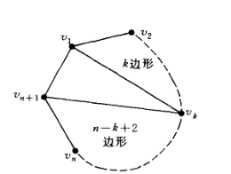
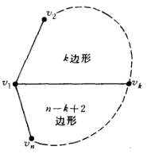

# 递推关系

- 本章实际上就是用数列的递推公式求解通项公式
- **Hanoi塔问题**：已知三个柱子。将堆叠起来的，从上到下变大的 $n$ 个圆盘移动到另一个柱子上，顺序不变，最少需要多少次
  - **归纳算法**：
    - 设从 $A$ 柱移动到 $C$ 柱，并已知 $n-1$ 个圆盘的方法
    - 则先将顶端圆盘移动到 $B$ 柱，再直接用该方法将剩下 $n-1$ 个圆盘移动到 $C$ 柱，然后将 $B$ 柱剩余的顶层移动到 $C$ 柱即可
    - 总次数为 $H_n = 2H_{n-1} + 1$

## 母函数法

- **序列的母函数**：设 $H_0,H_1...$ 是序列，则 $G(x) = \sum\limits^\infty_{k=0} H_kx^k$ 称为该序列的母函数
  - **系数公式**：$H_k = G^{(k)}(0)$
    <!-- - 以二项式系数的组合性导出的，第 $n$ 项系数即为序列 $H(n)$ 的通项公式 -->
  <!-- - **母函数法**：其具有泰勒展开式的形式，可以先求收敛形式，然后展开 -->

### 母函数外推法

- **求解Hanoi塔序列**：$H_k = 2H_{k-1} + 1$
  - **解**：
    - **外推**：由递推公式得 $$\begin{matrix} G(x)-H_0 & = &  H_1x + H_2x^2 + ... \\\ \\   &= &  (2H_0+1)x + (2H_1+1)x^2 + ... \\\ \\ & = &  2x(H_0 + H_1x + ...) + (x+x^2+...) \end{matrix}$$
    - **重组**：已知 $H_0 = 0$，再将上式重组即得 $G(x) = 2xG(x) + \dfrac{1}{1-x}$
    - **求收敛形式**：计算得 $G(x) = \dfrac{x}{(1-x)(1-2x)}$
      - 它就是我们通过外推法求出的收敛形式母函数
    - **泰勒展开**：将右式泰勒展开得 $G(x) = \sum\limits^\infty_{n=0} (2^n-1)x^n$，即 $H_n = 2^n-1$
- **求解Fabonacci数列**：$F_{n+2} = F_{n+1} + F_n$
  - **解**：
    - **外推**：由递推公式得 $$G(x) - F_1x - F_2x^2 = x(F_2x^2 + F_3x^3+...) + x^2(F_1x + F_2x^2+...)$$
    - **重组**：$G(x) - x^2 - x = x\Big[ G(x)-x \Big] + x^2G(x)$
    - **求收敛形式**：计算得 $G(x) = \dfrac{x}{1-x-x^2}$
    - **泰勒展开**：上式右端通过裂项可重组为 $\dfrac{1}{1+a(x)}$ 形式的线性组合，再对每项都泰勒展开即可
  - **推论**：利用累减性，可以得系数公式

### 优选法

- **优选法**：求函数单峰极值时，取区间并比较端点即可
  - 三等分优选法
  - 黄金分割优选法：取 $0.382$ 和 $0.618$ 两个比例点分段
  - Fabonacci优选法

### 母函数性质（本质是泰勒级数性质）

- **后移升幂**：若 $b_k = \begin{cases} 0\quad\   ,k<l \\ a_{k-l}, k\geqslant l \end{cases}$，则 $B(x) = x^lA(x)$
- **前移降幂**：若 $b_k = a_{k+l}$，则 $B(x) = \dfrac{A(x) - \sum\limits^{l-1}_{k=0}a_kx^k}{x^l}$
- **等比收敛**：若 $b_k = \sum\limits^k_{l=0}a_l$，则 $B(x) = \dfrac{A(x)}{1-x}$
- **极限等比收敛**：若 $b_k = \sum\limits^\infty_{h=k}a_h$，则 $B(x) = \dfrac{A(1)-xA(x)}{1-x}$
- **微分平移性**：若 $b_k = ka_k$，则 $B(x) = xA'(x)$
- **柯西乘积**：若 $c_k = \sum\limits^k_{h=0} a_hb_{k-h}$，则 $C(x) = A(x)B(x)$
- **积分性**：若 $b_k = \frac{a_k}{1+k}$，则 $B(x) = \dfrac{1}{x}\int^x_0 A(x)dx$

### 线性常系数齐次递推关系

- **$k$ 阶线性常系数齐次递推关系**：设 $c_i$ 是常数，$a_n$ 是数列，则下列递推公式称为... $$a_n + c_1a_{n-1} + ... + c_ka_{n-k} = 0$$
- **特征多项式**：$C(x) = x^k + ... + c_{k-1}x + c_k$
- **母函数**：$G(x) = \cfrac{P(x)}{R(x)} = \cfrac{\sum\limits^{k-1}_{h=1}\fkh{ c_hx^h\dkh{\sum\limits^{k-1-h}_{j=0}a_jx^j } }}{\sum\limits^k_{i=0} c_ix_i^i}$
  - **证明（累加法）**：
    - 由递推方程易得
      - $x^k(a_k + ... + c_ka_0) = 0$
      - $x^{k+1}(a_{k+1} + ... + c_ka_1) = 0$
      - ……
    - 将这些方程累加后重组（同一列的合并成同一项）得 
      - $a_kx^k + a_{k+1}x^{k+1} + ...$
      - $c_1x\Big(a_{k-1}x^{k-1} + a_kx^k + ...\Big)$
      - ……
      - $c_kx^k\Big( a_0+a_1+... \Big)$
    - 它们可重写为
      - $ G(x) - (a_0+a_1x+...+a_{k-1}x^{k-1}) $
      - $ c_1x\Big[ G(x) - (a_0+a_1x+...+a_{k-2}x^{k-2})  \Big]$
      - ……
    <!-- - 将这些方程累加，同列合并，再分离 $G(x)$，可得下式 $$(G(x) - \sum\limits^{k-1}_{h=0} a_hx^h) + c_1x\big[ G(x) - \sum\limits^{k-2}_{h=0}a_hx^h \big] + \\ c_2x^2\big[ G(x)-\sum\limits^{k-3}_{h=0}a_hx^h \big] + ... + c_kx^kG(x) = 0$$ -->
    - 分离 $G(x)$ 即得 $$ (1 + c_1x + ... + c_kx^k)G(x) = \sum^{k-1}_{j=0} a_jx_j + c_1x\sum^{k-2}_{j=0} a_jx_j + ... + c_{k-1}x^{k-1}a_0$$
    - 上式变形即得结论
  - **分母系数反位性**：$R(x) = x^kC(\frac{1}{x})$
  - **根的关系** $R:(x-\alpha_i)^{k_i} \LR C:(1-\alpha_ix_i)^{k_i}$
- **通项等比性**：线性齐次递推关系的序列，其通解为等比序列的线性组合，通解的等比底数为特征方程的根
  - **累加理解**：就是累加法的原理
    - 线性则可累加求解
    - 而由可递推性，项数之间存在错位，从而必定出现等比，且等比为线性
  - **展开理解**：
    - $G(x)$ 可展为 $\sum \dfrac{1}{x-\a_i}$ 的形式，其每项均可泰勒展开成幂级数（等比序列）
    - 再由特征根与 $R(x)$ 根存在转化关系，即可得到结论

### 应用

- **母函数法**：设已知递推关系
  - 通过递推关系可直得特征多项式
  - 求出特征根，即可计算出母函数收敛形式的分母和分子
  - 将母函数收敛形式裂项后泰勒展开，得到母函数系数 $a_n$，它就是通项公式
- **实例**：

### 线性常系数非齐次递推关系

- **k阶线性常系数非齐次递推关系**：设 $c_i$ 是常数，$a_n,b_n$ 是数列，则下列递推公式称为... $$a_n + c_1a_{n-1} + ... + c_ka_{n-k} = b_n$$
<!-- - **可求解的情况**
  - 若 $b_n$ 为等比数列，则直接累加即可 -->
- **线性叠加性**：通解 = 特解 + 齐次解
  - **特解法**：
    - 首先用错位相减法化为齐次形式
    - 待定系数法求 $\alpha_n = F(A,B,C,...)$
- **特解定理**：
  - 若 $b_n = p(n)\cdot r^n$，其中 $p(n)$ 是 $n$ 的 $q$ 次多项式，$r$ 是特征方程的 $m$ 重根
  - 则特解形式为 $\sum\limits^q_{i=0} k_i n^{m+i}\cdot r^n$
    - $q$ 是项数
    - $m$ 是 $n$ 的起始次数
    - $k_i$ 一般写为 $k_0 = A，k_1 = B\cdots$
  - 若 $r$ 不是根，则 $m = 0$

### 习题

- 已知序列通项，求母函数收敛形式
  - **解（幂级数求和）**：
    - 由通项可写出母函数级数形式（一般是幂级数），再求其极限函数即可
- 已知母函数收敛形式，求序列通项（母函数级数形式）
  - **解（幂级数展开）**：
    - 由收敛形式（一般是有理分式），裂项拆分成分式的线性组合，对每项泰勒展开即可
- 已知线性齐次递推关系，求母函数 + 序列通项
  - **解（待定系数累加法）**：类似高中学的方法
    - 以 $a_n + a_{n-1} + a_{n-2} = 0$ 为例，设 $(a_n-ka_{n-1}) = q(a_{n-1}-ka_{n-2})$
    - 列出参数方程求出 $q,k$，此时 $a_n-ka_{n-1}$ 是等比数列，可求出通项
    - 然后再求 $a_n-ka_{n-1} = ...$ 的通项即可
  - **解（特征法）**：写出特征方程，求特征根，待定系数法
- 已知线性非齐次递推关系，求母函数 + 序列通项
  - **情况1**：$b_n = A$
    - **解（待定系数法）**：
      - 此时存在常数特解，代入求取即可
  - **情况2**：$b_n = q^n$
    - **解（待定系数法）**：
      - 由递推式线性，存在 $kq^n$ 形式特解
      - 代入递推式求出 $k$
      - 再由解的线性组合性，再求齐次形式的解，然后两解相加即可
  - **情况3**：$b_n = r^np(n)$
    - **解**：由特解定理，存在 $r^n\sum\limits^q_{i=1} k_i n^{m+i}$ 形式特解，待定系数法即可

#### 实例

- **齐次**：$$a_n - 2a_{n-1} - a_{n-2} = 0$$
  - **解（通解）**：
    - 特征方程为 $x^2-2x-1 = 0$，特征根为 $1\pm\sqrt{2}$
    - 故通解为 $a_n = A(1+\sqrt{2})^n + B(1-\sqrt{2})^n$
  - **解（特解）**
    - 当 $a_0=a_1=2$ 时，代入通解可得参数方程，求解即得 $A,B$ 的具体值
- **非齐次**：$$a_n - 4a_{n-1} = 4\cdot 6^n - 3\cdot 5^n$$
  - **解**：
    - 特征方程为 $x-4 = 0$，特征根为 $4$
    - 故齐次通解为 $a_n = A\cdot 4^n$
    - 当 $b_n = 4\cdot 6^n$ 时，存在特解 $a_n = k\cdot 6^n$。代入递推公式即得 $k=12$
    - 当 $b_n = 3\cdot 5^n$ 时，存在特解 $a_n = k\cdot 5^n$。代入递推公式即得 $k=15$
    - 综上，非齐次通解为 $a_n = A\cdot 4^n + 12\cdot 6^n - 15\cdot 5^n$
- **非齐次（退化）**：$$a_n - 4a_{n-1} = 7\cdot 4^n$$
  - **解**：
    - 特征方程为 $x-4 = 0$，特征根为 $4$
    - 故齐次通解为 $a_n = A\cdot 4^n$
    - 此时非齐次特解可设为 $a_n = kn\cdot 4^n$，代入递推公式即得 $k=7$
    - 综上，非齐次通解为 $a_n = (A+7n)\cdot 4^n$

## 整数的拆分

- **整数的拆分**：将正整数变为正整数的和
  - 累加拆分：1，2，3……
  - 奇数拆分：1，3，5……
- **拆分数**：拆分的个数 $p(n)$
- **等价问题**：n个无区别球放入n个无区别盒子，可以有空盒
  - n个球为即将被拆分的整数
  - 盒子为可选的拆分单元
  - 盒子中球的数量为每个拆分单元的值

### 重复与不重复

- **基本拆分定理**
  - 已知拆分单元 $k_1,k_2,...,k_n$ 不允许重复，求可拼凑的整数
    - $G(x) = \prod\limits^{n}_{i=1} (1+x^{k_i})$
  - 已知拆分单元 $k_1,k_2,...,k_n$ 允许重复，求可拼凑的整数
    - $G(x) = \prod\limits^{\infty}_{i=1} (1+\sum\limits^\infty_{n=1}x^{nk_i}) = \prod\limits^{\infty}_{i=1} \large\frac{1}{1-x^{k_i}}$
  - **理解**：利用了因式分解的组合性
    - 如拆分单元 $\{1,2,3,4\}$
    - 若不允许重复，则母函数为 $(1+x)(1+x^2)(1+x^3)(1+x^4)$
      - 每个因子对应每个拆分单元 $i$，$1$ 表示不选择，$x^i$ 表示选择一次
      - 由于不可重复，所以每个因子只有两项（只能选择一次）
    - 若允许重复，则母函数为 $(1+x+x^2+...)(1+x^2+x^4+...)()()$
      - 每个因子对应每个拆分单元 $i$
        - 1表示不选择，$x^i$ 表示选择一次，$x^{ni}$ 表示选择 $n$ 次
      - 由于可以重复，所以每个因子有无限项（可以选择任意次）
    - 最终的展开式中，同次数项被合并
      - 次数表示每个可拼凑项的值
      - 对应系数表示每个可拼凑项的方案数（因为每个因式中 $x^ni$ 系数均为1）
- **条件拆分问题**：若某个拆分单元 $m$ 必须出现，则将母函数中对应因式的 $1$ 项删去（等价于排除法，原拆分减去不包含的拆分）
- **推论**：不允许重复的累加拆分数 $p(n)=$ 允许重复的奇数拆分数 $q(n)$
  - **证明**：使用平方差公式添项为分式
    - $p(n) = (1+x)(1+x^2)... \\\qquad = \dfrac{1-x^2}{1-x}\cdot \dfrac{1-x^4}{1-x^2}\cdots \\ \qquad = \dfrac{1}{1-x}\cdot \dfrac{1}{1-x^3}\cdots$
    - $q(n) = (1+x+x^2+...)(1+x^3+x^6+...)(1+x^5+x^{10}+...)...$
- **有限重复定理**：$n$ 拆分成重复数不超过 $2$ 的数之和 = $n$ 拆分成不被3整除的数
  - 左式：$\prod\limits^\infty_{n=1} (1+x^n+x^{2n})\quad =\quad$ 右式：$\prod\limits^\infty_{\substack{n=1 \\ n\nmid 3}} \cfrac{1}{1-x^n}$
  - 左式每项添项 $1-x^n$，变为分式。然后使用立方差公式，并通过累乘消去分式因子，即得右式

### Ferrers图像

- **Ferrers图像**：每行元素数量等于拆分单元值，下少上多
  - **非空性**：每行至少有一个点
  - **共轭性**：转置后还是F图像
    - **推论**：
      - 拆分成k个单元 = 拆分单元最大为k
        - **证明**：应用条件拆分问题，排除法即可
      - 拆分成互不相同奇数 = 拆分成自共轭F图像
- **自共轭图像**：行列对称图像

### 拆分数估计

- **常用拆分数**
  - $p(10) = 42$
  - $p(100) = 190509292$
  - $p(1000) = 3972999029388$
- $p_n \leqslant \large e^{\sqrt{\frac{20}{3}n}}$
- **证明**：
  - 设 $G(x) = \sum\limits^\infty_{n=1} p_nx^n = \cfrac{1}{(1-x)(1-x^2)\cdots}$
    - 取对数化为分式加法，每项泰勒展开，得
    - $\ln G(x) = \sum\limits^\infty_{n=1} \dfrac{1}{n}x^n + \sum\limits^\infty_{n=1}\dfrac{1}{n}x^{2n} + \cdots = \sum\limits^\infty_{n=1} \dfrac{1}{n}\dfrac{x^n}{1-x^n}$
  - 再由 $\sum\limits^\infty_{n=0}x^n > nx^{n-1}$，得 $\dfrac{x^n}{1-x^n} < \dfrac{1}{n}\dfrac{x}{1-x}$
    - 故 $\ln G(x) < $

## 指数型母函数

### 重复选取问题

- **重复度**：n元素全排列中某个元素重复了 $m$ 次，则排列数为 $\frac{n!}{m!}$
  - **推论**：全组合等于所有元素重复，$C^n_n = \frac{A_n^n}{n_1!n_2!...}$
- **重复选取问题**：$n$ 个元素中，含有 $n_k$ 个 $a_k$，求选取 $r$ 个的组合数
  - **方法**：列出母函数，选取其中的 $r$ 次项，除以重复度即可
  - **解决例**：比如 $n_1 = 3,n_2=2,n_3=3$。$r=4$
    - 母函数为 $G_e(x) = (1+\frac{x}{1!}+\frac{x^2}{2!}+\frac{x^3}{3!})(1+\frac{x}{1!}+\frac{x^2}{2!})(1+\frac{x}{1!}+\frac{x^2}{2!}+\frac{x^3}{3!})$
    - 将其展开，其中的四次项系数即为组合数
  - **应用例**：$n$ 被分拆为 $k$ 个单元，其中各个单元允许重复 $n_k$ 次，求分拆数
- **指数型母函数**：$G_e(x) = \sum\limits^\infty_{i=1} \large\frac{a_n}{n!}\normalsize x^n$
- 例子：
  - $\{a_n = 1\}$ 为 $e^x$
  - $\{a_n = n!\}$ 为 $\frac{1}{1-x}$
  - $\{a_n = k^n\}$ 为 $e^{kx}$
  - $\{a_n = \prod (2n-1)\}$ 为 $(\frac{1}{1-2x})^{\frac{3}{2}}$
    - 由广义二项式定理，展开式为 $\sum\limits^\infty_{h=1} \tbinom{-\frac{3}{2}}{h} (-2x)^h$

### 广义二项式定理

- **广义二项式定理**：分数指数二项式的泰勒公式展开
- $\{p^r_n\}$ 的指数型母函数
  - $p^r_n = r!C^r_n$
  - $G_e(x) = \sum\limits^n_{r=0} p^r_n \large\frac{x^r}{r!}\normalsize = (1+x)^n$

### 球盒问题总结

- 3个因素：球有无区别，盒有无区别，是否允许空盒
- 有$2^3$ 种情况：
  - 第1、2个因素的区别
    - 无区别的因素越多，需要考虑的重复性越高
    - 顺序是：指数性母函数 $(11)$ > 有重复母函数 $(01)$ > 无重复母函数 $(00)$
  - 第三个因素的区别，其实就是相差了 $x^m$ 系数的区别
  - m和n的数量关系似乎没有意义
- **111选择问题**：将 $n$ 个有区别的球放入 $m$ 个有区别的盒子，无空盒，$1\leq m\leq n$
  - 等价问题：将整数 $n$ 拆分成 $m$ 个组，组之间不允许重复
    - 但组内无顺序，所以需要除以排列数
  - $G_e(x) = (\frac{x}{1!} + ...)^m$
  - 求第 $n$ 次项的系数
    - $\color{chartreuse}\begin{cases} G_e(x) = (e^x-1)^m = \sum\limits^m_{k=1}C^k_m (-1)^ke^{(m-k)x} \\ e^{(m-k)x} = \sum\limits^\infty_{n=0} \frac{(m-k)^n}{n!}x^n \end{cases}$
    -  从而系数为 $\color{chartreuse} p^n_m = \sum\limits^m_{k=1} C_m^k (-1)^k (m-k)^n$
    - $m!S(n,m)$
- **110选择问题**：将 $n$ 个有区别的球放入 $m$ 个有区别的盒子，可以有空盒
  - 等价问题：同上，但每个括号内最低次数可以为0
  - $G_e(x) = (1 + \frac{x}{1!} + ...)^m$
  - 求第 $n$ 次项的系数
    - 等价于完全自由选择问题：$m^n$
- **101选择问题**：Stirling数 $S(n,m)$
- **100选择问题**：$\sum\limits^m_{k=1} S(n,k)$
- **011选择问题**：将 $n$ 个无区别的球放入 $m$ 个有区别的盒子，无空盒，$1\leq m\leq n$
  - $G(x) = (x+x^2+...)^m$
  - 求第 $n$ 次项的系数
    - 等价于求010选择问题的 $n-m$ 次项系数：$C^{m-1}_{n-1}$
- **010选择问题**：将 $n$ 个无区别的球放入 $m$ 个有区别的盒子，可以有空盒，$1\leq m\leq n$
  - $G(x) = (1+x+x^2+...)^m$
  - 求第 $n$ 次项的系数
    - 可重复组合问题：$C^{m}_{n+m-1}$
    - 求出系数递推关系，利用帕斯卡三角形
- **001选择问题**：将 $n$ 个无区别的球放入 $m$ 个无区别的盒子，无空盒，$1\leq m\leq n$
  - $G(x) = \cfrac{x^m}{(1-x)(1-x^2)...(1-x^m)}$
  - 求第 $n$ 次项的系数
    - YYH法：设 $t = (1+x+...)$，用来将计算分步，从而简化问题
- **000选择问题**：将 $n$ 个无区别的球放入 $m$ 个无区别的盒子，可以有空盒，$1\leq m\leq n$
  - 等价问题：整数 $n$ 拆分成 $m$ 个组，组之间允许重复
  - $G(x) = \cfrac{1}{(1-x)(1-x^2)...(1-x^m)}$
  - 求第 $n$ 次项的系数
    - yyh定理

### 习题

- **k次求和公式的递推解法**：$S_n = \sum\limits^n_{k=1}k^i$，迭代可得 $S_n$ 的线性齐次递推关系

## 非线性递推关系

### Stirling数（球盒问题）

- 110问题中，若 $m=2$，则为二项式系数
- 归纳得m项式系数
- **多项式法则**：
  - n次m项式系数为 $\large\binom{n}{n_1n_2...n_m} = \binom{n}{n_1}\binom{n-n_1}{n_2}...\binom{n-n_1...-n_{m-1}}{n_m} =  \frac{n!}{n_1!...n_m!}$
- **多项式定理**：n次m项式展开后，项数为 $\binom{n+m-1}{n}$，系数之和为 $m^n$
  - **证明**：从m种元素中取n个作可重复组合，等价于010问题，选取方式有 $C^n_{n+m-1}$ 种
    - n次m项式中取 $x=1$ 即得系数之和
- **第一类Stirling数**：$[x]_n = x(x-1)...(x-n+1) \\ \whh\whh\quad = s(n,0) + s(n,1)x + ... + s(n,n)x^n$
  - **递推关系**：$s(n+1,k) = s(n,k-1) - n\cdot s(n,k)$
- **第二类Stirling数**：101问题中的方案数 $S(n,m)$
  - **性质**：
    - $S(n,0) = S(0,n) = 0$
    - $S(n,k) > 0，(n\geqslant k\geqslant 1)$
    - $S(n,k) = 0，(k > n\geqslant 1)$
    - $S(n,1) = 1，S(n,n) = 1，n\geqslant 1$
    - $S(n,2) = 2^{n-1}-1$
      - **证明**：共有两个盒子。放入第一个盒子后，另一个的情况自动确定，因此转化为是否放入第一个盒子（不允许空盒）
        - 第一个盒子先放一个球，其余球有 $2^{n-1}$ 情况，然后排除第二个空盒
    - $S(n,3) = \frac{1}{2}(3^{n-1}+1) - 2^{n-1}$
      -  **证明**：
    - $S(n,n-1) = C^2_n$
      - **证明**：球只比盒子多一个，考虑多余的球和哪个盒子、哪个球组合即可
    - $S(n,n-2) = C^3_n + 3C^4_n$
      - **证明**：
  - **递推关系**：$S(n,m) = m\cdot S(n-1,m) + S(n-1,m-1)，n>1,m\geqslant 1$
    - **证明**：分为两类情况
      - $b_1$ 独占一盒，其它球组成退化问题，即右式后项
      - $b_1$ 不独占一盒，共有m个盒子，而其它球组成退化问题，即右式前项。
  
### Catalan数

- **Catalan数**：将凸 $n$ 边形拆分成三角形的方式的数量
- **递推关系**：
  - $C_{n+1} = \sum\limits^n_{k=2} C_kC_{n+2-k}$
    - **证明**：
      - $n+1$ 边形中，以 $v_1v_{n+1}$ 作为三角形一边，另一顶点设为 $v_k$
      - 经过分割后，变为 $k$ 边形和 $n+2-k$ 边形
        - $k$ 的选取方法共有 $n-1$ 种，相加即可
       
  - $(n-3)C_n = \frac{n}{2}\sum\limits^n_{k=3} C_kC_{n+2-k}$
    - **证明**：以 $v_1v_k$ 对角线作剖分，变为 $k$ 边形和 $n+2-k$ 边形
        - $k$ 的选取方法共有 $n-3$ 种，相加即可
       

#### 常规计算公式

- **通项公式**：$C_{n+1} = \frac{1}{n}\binom{2n-2}{n-1}$
  - **证明**：
    - $C_2 =2$，两递推公式计算可得：$(n-3)C_n = \frac{n}{2}(C_{n+1}-2C_n)$
    - 即 $nC_{n+1} = (4n-6)C_n$
    - 设 $E_{n+1} = nC_{n+1}$
      - 则 $\frac{E_{n+1}}{E_n} = \frac{(2n-2)(2n-3)}{(n-1)(n-1)}$，累乘得 $C^{n-1}_{2n-2}$
- **母函数**：$xG^2(x) - G(x) + 1 = 0$
  - **证明**：
    - 递推公式累加得 
  - **求解**：
    - 展开法：$G(x) = \frac{1\pm\sqrt{1-4x}}{2x}$，对根式展开，求 $x^{n+1}$ 次系数
      - **推论**：
        - $(2n)!! = 2\cdot n!$
        - $(2n-1)!!(2n)!! = (2n)!$（有点像二项式系数）
    - 微分方程法：利用微分迭代性，递推公式累加得微分方程

#### 应用

- $n$ 个数相乘的积可有 $C_{n+1}$ 种结合律

## 总结

- 递推关系解法
  - 母函数法（线性）：先求母函数（累加/特征方程/特解），然后变形
  - 迭代法：
  - 数学归纳法：先猜后证
  - 置换法
  - 累加法：Fabonacci数列等