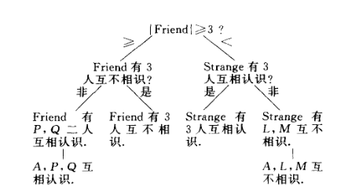
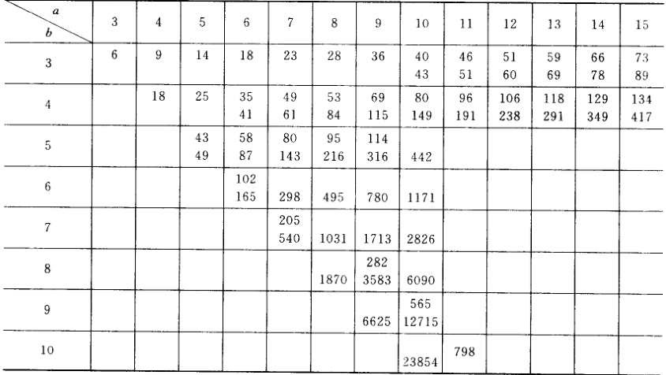

# 容斥原理

## 集合论

- **基数运算律**：
  - $|A^c| = |U| - |A|\quad $（$U$ 是全集）
  - $|A-B| = |A| - |B|\quad (B\subset A)$
- **De Morgan定理（对偶律）**
- **容斥原理**：对任意有限集合 $A_1,...,A_n$，都有 $|\mathop{\bigcup}\limits^n_{i=1} A_i| = \sum\limits_{\substack{I\subset [n] \\ I\neq \varnothing}} (-1)^{|I|+1}|\mathop{\bigcup}\limits_{i\in I} A_i|$
  - 实际上就是概率论中的Jordan加法公式
  - **证明**：
    - **写出特征函数**：
      - 设集合 $X$ 包含所有 $A_i$
      - 设 $A_i$ 的特征函数为 $f_i:X\to X，x\mapsto \begin{cases} 1 & x\in A_i \\ 0 & x\notin A_i \end{cases}$
      - 易得 $\Big( \mathop{\bigcup}\limits^n_{i=1} A_i \Big)^C$ 的特征函数为 $F(x) = \prod\limits^n_{i=1} \Big[ 1-f_i(x) \Big]$
      - 从而 $\sum\limits_{x\in X} F(x) = |X\j \mathop{\bigcup}\limits^n_{i=1} A_i|$
    - **用数关系证明集合关系**：
      - 将上式展开、变形，不难发现 $|X\j \mathop{\bigcup}\limits^n_{i=1} A_i| = \sum\limits_{I\subset [n]} (-1)^{|I|+1}|\mathop{\bigcap}\limits_{i\in I} A_i|$
      - 再由于 $|X| = |\mathop{\bigcup}\limits_{i\in \varnothing} A_i|$，故由二阶容斥原理即得结论

### 应用

- **错排问题**：$1\thicksim m$ 的全排列中，每个元素都不在自身位置上的排列数量
  - **解（递推法）**
  - **解（容斥法）**：
    - 设 $A_i$ 为 $i$ 在自身位置上，则事件为 $(A_1\cup \cdots\cup A_n)^c$
    - 方案数为 $n!\sum\limits^n_{i=0}(-1)^nC^i_n\cdot A^{n-i}_{n-i} = n!(1 - \frac{1}{1!} + \frac{1}{2!} - ... +\frac{(-1)^n}{n!})$
      - $C^i_n$ 代表从 $n$ 个元素中选择 $i$ 个（在自身位置上的元素），$A^{n-i}_{n-i}$ 代表筛出 $i$ 个元素后，对其它元素任意排序
      - 这种东西都需要单独说明，我脑子越来越不行了……
- **满射问题**：$m$ 个物体发射到 $n$ 个空间，求每个空间至少有 $1$ 个物体的概率
  - 实际上就是110选择问题的概率
  - **解（容斥法）**：
    - 易得共有 $n^m$ 种情况
    - 设 $A_i = \set{f:[m]\to [n]\mid \forall j，f(j)\neq i}$
      - 由于每个 $f(j)$ 都有 $n-1$ 种选择，且彼此不相交，故 $|A_i| = (n-1)^m$
      - 同理可得 $|\mathop{\bigcup}\limits_{i\in I} A_i| = (n-|I|)^m$
    - 最终由容斥原理得 $P = 1-\cfrac{|\mathop{\bigcup}\limits^m_{i=1} A_i|}{n^m} = \sum\limits^{n-1}_{k=0} (-1)^kC^k_n (1-\dfrac{k}{n})^m$

## 棋盘多项式

- **数独问题**：
- **棋盘问题**：$n$ 个元素的排列 $\Leftrightarrow n\times n$ 棋盘上，保证每一行列上只有一个棋子
- **棋盘多项式（母函数）**：$R(C) = \sum\limits^n_{k=0} r_k(C)x^k$
  - $C$ 是棋盘，$k$ 是阶数，$r_k$ 是 $k$ 阶的排列数，$R$ 是 $n$ 阶以下棋子总排列数
  - **递推关系**：$R(C) = xR(C_{(i)}) + R(C_{(e)})$
    - 前项为去掉该行列的余子棋盘
    - 后项为去掉该格的余子棋盘
    - **理解**：分类讨论
      - 放置了棋子：前项，剩余棋子少一个，即式子少一阶
      - 没放置棋子：后项，只需割去棋盘一格即可
  - **独立性**：
    - 若 $C$ 是两个无相同行列的棋盘拼成（对角挨对角斜着拼）
    - 则
      - $r_k(C) = \sum\limits^k_{i=1} r_i(C_1)r_{k-i}(C_2)$
      - $R(C) = R(C_1)R(C_2)$

### 有禁区排列

- **有禁区排列数**：$\sum\limits^n_{k=0} r_i(n-k)! \color{chartreuse} = n! - r_1(n-1)! + r_2(n-2)! + ... + (-1)^nr_n$
  - $r_i$ 是有 $r_i$ 个棋子在禁区中的方案数（禁区棋盘的母函数系数）
  - **证明**：设排列为 $P_1P_2...P_n$，其中 $P_i$ 是第 $i$ 个棋子在第 $i$ 行的列序号
    - 设 $A_i$ 是 $P_i$ 落入进去的事件
    - 排列数为 $|\overline{A_1}\cap \overline{A_2} \cap ... \cap \overline{A_n}|$，由容斥原理即得上式

### 应用

- **错排问题**：将对角线列为禁区即可
  - 此时 $R(C) = (1+x)^n$，故 $r_i = C^i_n$，则方案数为 $\cdots$

### 习题

- **求棋盘多项式**：利用几个基本棋盘的多项式，不断并入新棋盘，进行递推，求出新的棋盘多项式
  - 余子式递推
  - 对角线递推

## 广义容斥原理

- 设 $S$ 上的不同性质形成子集列 $\{A_n\}$
  - $\alpha(m) = \sum |A_{i_1}\cap ... \cap A_{i_m}|$
    - **意义**：任取m个性质，统计将它们均满足的元素个数，然后将性质组合下的元素数加和
  - $\beta(m)$ 
    - **意义**：$S$ 中正好具有 $m$ 个性质的元素个数
  - $\beta(m) = \sum\limits^n_{k=m}(-1)^{k-m} C^m_k \alpha(k)$
    - **证明**：元素分析法 + 分类讨论
      - 左右两式子的本质是将元素进行累加
      - 任取 $s\in S$，假设它具有 $l$ 种性质
        - $l<m$，则左式和右式均不计算它
        - $l=m$，左式计算它一次，右式只有 $\alpha_m$ 项计算它
        - $l>m$，左式不计算它，右式计算它的次数总和为0
          - $\sum\limits^{l-m}_{k=1} (-1)^kC^m_{m+k}C^{m+k}_l = 0$
      - 故最终左右两式相等
    - **推论**：
      - $\beta(0) = \sum\limits^n_{k=0}(-1)^{k}\alpha(k)$
      - $|\overline{A_1}\cap ... \cap \overline{A_n}| \\ = |S| - \sum\limits^n_{i=1} |A_i| + \sum\limits_{i<j} |A_i\cap A_j|  - \sum\limits_{i<j<k} |A_i\cap A_j \cap A_k| + ... \\ + (-1)^n|A_1 \cap A_2 \cap ... \cap A_n|$
      - **证明**：直接将 $\alpha$ 代入到推论1中

### 应用

- **n对夫妻问题**：n对夫妻围着圆桌坐下，求夫妻不相邻的方案数
  - **解**：
    - 2n个人坐下的方案数：$Q^{2n}_{2n} = (2n-1)!$
    - n对夫妻坐下，且夫妻均相邻的方案数：$Q^n_n\cdot 2^n$
    - 则由容斥原理，$N = \sum\limits^n_{k=0} 2^k C^k_n (2n-k-1)!$
- **第二类Stirling数展开**
  - **111问题展开**：$N = \sum\limits^n_{k=0} (-1)^k C^k_m (m-k)^n$
  - **101问题展开**：$S(n,m) = \frac{1}{m!}N$
- 欧拉函数
- 莫比乌斯反演定理

## 鸽巢原理

- **鸽巢原理**：若有 $n+1$ 只鸽子，$n$ 个巢，则至少一个巢内有两只鸽子

### 应用（数论的满溢性）

- 截 $S_{2n}$ 中任取 $n+1$ 个数，其中至少有一个是另一个的倍数
  - **证明**：偶数必定是某个奇数的倍数，故不能取偶数。但奇数只有n个
- $X = \{1,2,...,9\}$，剖分成两个部分 $P,Q$，必有一个含有3个等差数
  - **证明**：反证法
    - 若 $\{1,5\}\subset P，9\in Q$
    - 若 $\{5,9\}\subset P，1\in Q$
    - 若 $5\in P，\{1,9\}\subset Q$
  - **推论**：$X = \{1,2,...,2^8\}$ 剖分后，至少有一个包含 $a,ar,ar^2$
  - 
- 三个整数的任意两种排列作差后，至少有一个结果是偶数
  - **证明**：奇偶鸽巢性 + 奇偶作差转化
- 任意图中都存在两个度相同的顶点
  - **证明**：
    - 设图有 $n$ 个顶点，则度只可能是 $0\sim n-1$
    - 反设所有的顶点度都不同，则存在孤立点和与所有点邻接的顶点，显然是矛盾的

### 习题

- $n$ 鸽子，$m$ 鸽巢，则至少有一个含有不少于 $[\frac{n-1}{m}]+1$ 只鸽子
  - **证明**：
- $n(m-1)+1$ 个球放入 $n$ 个盒子，则至少有一个盒子有 $m$ 个球
  - **证明**：
- $m_1,...,m_n$ 是 $n$ 个正整数
  - 若 $\cfrac{m_1+...+m_n}{n} > r-1$
  - 则至少有一个不小于 $r$
  - **证明**：
- $p_1+...p_n - n + 1$ 鸽子，$1,...,n$ 鸽巢，则至少存在一个标号为 $j$ 的鸽巢的数量大于 $p_j$
  - **证明**：

### 作业

- **有理数逼近的界**：设 $x\in\R，n\in\N^+$，则存在 $p,q\in\Z，1\leq q\leq n$ 使得 $|x-\dfrac{p}{q}| < \dfrac{1}{nq}$
  - **证明**：
    - 将 $x,2x,...,(n+1)x$ 放到 $[0,1]$ 的 $n$ 均分区间中，则必定存在一个区间包含两个上述元素，设为 $ax \leq a'x$
    - 再取 $q = a'-a$ 即可
  - 其实用之前证明黎曼函数连续性时的方法就行
- 在互不相同的实数 $a_0,...,a_{mn}$ 中，必定存在一个长度为 $m+1$ 的递增序列，或长度为 $n+1$ 的递减序列
  - **证明**：
    - 设 $t_i$ 是（从 $a_i$ 开始的递增序列）的最大长度
    - 若 $\exist t_i > m$，则已得到结论
    - 若 $\forall t_i \leq m$
      - 再由于一共有 $mn+1$ 个 $t_i$，故由鸽巢原理，必定存在 $1\leq s\leq m$ 使得有 $n+1$ 个 $t_i = s$，不妨设为 $i_0,...,i_n$
      - 若 $a_{i_0},...,a_{i_n}$ 是递减序列，则已得到结论
      - 若存在 $a_{i_j} < a_{i_{j+1}}$，则将 $a_{i_j}$ 放到 $a_{i_{j+1}}$ 的长度为 $t_{i_{j+1}}$ 的递增序列前面，就得到一个长度为 $s+1 = t_{i_j}+1$ 的递增序列，但这与 $t_i$ 的定义矛盾
      - 最好还是画一个二维图来理解，以后补上
- 设 $t(n)$ 表示 $n$ 的因子数量，$\ol t(n) = \dfrac{1}{n}\sum\limits^\infty_{j=1} t(j)$
  - 因子判别函数 $d(i,j) = \begin{cases} 1, & i\mid j \\ 0, & 其它情况 \end{cases}$
  - **关系式**：
    - 易得 $t(j) = \sum\limits^n_{i=1} d(i,j)$
    - 从而 $n\cdot\ol t(n) = \sum\limits^n_{j=1} t(j) = \sum\limits^n_{i,j=1} d(i,j)$
  - **阶数估计**：
    - 易得 $\sum\limits^n_{i,j=1} d(i,j) \sim \sum\limits^n_{i=1} \dfrac{n}{i} \sim n\ln n$
- **作业1.1**：$\Z^n$ 上的任意 $2^n+1$ 个点中，必定存在 $\a_1,\a_2$ 使得 $\dfrac{\a_1 + \a_2}{2} \in \Z^n$
  - **证明**：
    - 即 $\a_1+\a_2$ 的分量都是偶数，即 $a_1,a_2$ 的所有对应分量的奇偶性相同
    - 当 $n=1$ 时，$S = 3$，而一维向量的奇偶性最多有 $2$ 种
    - 当 $n=2$ 时，$S = 5$，而二维向量的不同对应奇偶性最多有 $2^2$ 种
    - ……
    - 显然我们已找到了规律，数学归纳法即可（**证毕**）
- **作业1.2**：设整数列 $a_1,...,a_m$，则至少存在 $k<l$，使得 $m\mid (a_k + a_{k+1} + ... + a_l)$
  - **证明**：
    - 构造部分和序列 $s_1,...,s_m$ ，其中 $s_k = \sum\limits^k_{i=1} a_i$
    - 若均不为m的倍数，再将 $s_m$ 均视为 $m$ 完系的等价类元素 $r_m$。则由鸽巢原理，至少有一对 $r_k = r_h$
    - 那么由同余的性质，$m|(s_h-s_k)$，此时即有 $a_k+...+a_l$ 是m的倍数（**证毕**）
- **作业1.3**：设正整数 $m\geq n$，求 $[m]\to [n]$ 中的满射数量
  - **解**：
    - $n=m$ 时，所有映射都是双射，而置换的数量为 $A^n_n = n!$
    - $n<m$ 时，显然是 $[m]$ 的 $n$ 元素子集的置换，故数量为 $C^n_mA^n_n = \cfrac{m!}{(m-n)!}$

## Ramsey理论

### Ramsey问题

- **六人法则**：六个人在一起，至少（三个人相互认识）或（三个人互不认识）
  - **等价命题（边染色）**：六边形的所有顶点用红蓝线相连后，必定存在红三角形或蓝三角形
    - **证明（直接讨论法）**：类似图论，讨论端点即可
  - **等价命题（图论）**：六顶点图的点染色中，必定存在 $3$ 顶点单色独立集或单色簇
  - **等价命题**：朋友集合与陌生集合，其中至少有一个集合有三人
    - **证明（二叉树讨论法）**：
      - 任选一个人 $A$
        - 设朋友集合 $F$ 是其余 $5$ 人中与 $A$ 认识的集合
        - 设陌生集合 $S$ 是其余 $5$ 人中与 $A$ 不认识的集合
      - 将讨论过程写为下列二叉树
      
      - 从这个证明过程不难发现，Ramsey数的底层逻辑还是容斥原理和鸽巢原理
  - **推论**：

### 习题

- **九人法则**：$R(3,4) = 9$
  - **证明（二叉树讨论法）**：
    - 首先选出 $A$，建立相应的 $F,S$
    - 选择先对 $F$ 讨论（先讨论 $S$ 也可以），讨论 $|F|$ 与 $a=3$ 的大小关系（讨论 $|F|$ 与 $b=4$ 的大小关系也可以）
      - 若 $|F| < 3$，则 $|S| \geq 6$
        - **叶子中间**：若 $S$ 中有 $3$ 人互相认识，则得到结论
          - $S$ 本来就是不认识的多，故我们先把最好情况分离出来，把稍差些的情况留给后面再讨论
        - **叶子右端**：若不满足
          - 此时 $S$ 中至少有 $3$ 人互不认识
            - $R(3,3)=6$ 的直接推论。这其实也是整数公式的一个应用。我们不需要取等关系，只需要至少关系就行了
            - 低阶情况单纯用整数公式验证R条件还是很容易的，高阶情况分类就难了
          - 再加上 $A$ 就至少有 $4$ 人互不认识，得到结论
      - 若 $|F| \geq 3$
        - **叶子中间**：若 $F$ 中有 $4$ 人互不认识，则得到结论
        - **叶子左端**：若不满足
          - 此时 $F$ 中至少有 $2$ 人互相认识
            - 这就是废话了，不可能是空图吧
          - 再加上 $A$ 就有 $3$ 人互相认识，得到结论
- **18人法则**：$R(4,4) = 18$

### Ramsey数

- **拉姆齐数 $R(a,b)$**：
  - 设 $(a,b)$ 是正整数对，若 $r$ 是满足下列两个条件之一的最小人数
    - 要么有 $a$ 个人互相认识，要么 $b$ 个人互不认识
    - 要么有 $a$ 个人互不认识，要么 $b$ 个人互相认识
  - 则 $r$ 称为拉姆齐数 $R(a,b)$
  - 一般设左边数 $a$ 代表互相认识数，右边数 $b$ 代表互不认识数。该条件简称R条件
- **R定理**：
  - **对称性**：$R(a,b) = R(b,a)$ 
    - **证明**：定义易得
  - **自身完全性**：$R(a,2) = a$
    - **证明**：定义易得
  - **整数存在性**：任意 $(a,b)$ 对应的 $R(a,b)$ 都存在，且为整数
    - **证明**：存在性貌似不简单啊
  - **整数公式**：若 $a,b$ 是整数，则 $R(a,b) \leq R(a-1,b) + R(a,b-1)$
    - **证明（退化法 + 二叉树讨论法）**：
      - 设右式的值为 $r$。在 $r$ 个人中取一个人 $A$，剩下的人分为朋友集合 $F$，陌生集合 $S$
      - 易得以下两种情况互补，故此时只可能是其中一个情况
        - **四叶两端**：$|F|\geq R(a-1,b)$，或 $|S|\geq R(a,b-1)$
        - **四叶中间**：$|F|+|S| \leq R(a-1,b) + R(a,b-1) - 2 < r-1$
          - 结合 $F,S$ 的定义，我们发现此时总人数 $r$ 是矛盾的，故舍去该情况
      - 由拉姆齐数的定义，分情况讨论两个不等式，得到 $F$ 或 $S$ 的性质
        - 再把 $A$ 加进来再讨论，即可得原式成立
        - 若 $|F| \geq R(a-1,b)$，则 $F$ 中要么……要么……
          - 再加入 $A$ 后，$F\cup A$ 要么……要么……
        - 若 $|S| \geq R(b-1,a)$，则 $S$ 中要么……，要么……
          - 再加入 $A$ 后，$S\cup A$ 要么……要么……
        - 故此时 $|F\cup S\cup A| = r$ 满足R条件。再由于 $R(a,b)$ 是满足R条件的最小数，故 $R(a,b) \leq r$
    - **理解**：
      - 实际上就是二叉树讨论法。思想类似组合数的递推公式
  - **偶数公式**：若右式两项都是偶数，则 $R(a,b) \leq R(a-1,b) + R(a,b-1) - 1$
    - **证明（退化法 + 二叉树讨论法）**：
      - 设右式的值为 $r$
      - 设 $K_m$ 是完全图，删去其端点 $w$，以及它的 $r-1$ 条关联边
      - 对剩下部分2边染色，设 $F$ 为蓝色边数，$S$ 为红色边数
      - 易得以下两种情况互补
        - **四叶两端**：$|F| \geq R(a-1,b)$，或 $|S| \geq R(a,b-1)$
        - **四叶中间**：恰好 $R(a-1,b)-1$ 条边为蓝，且 $R(a,b-1)-1$ 条边为红
          - 添加回 $w$，易得 $K_m$ 的蓝色边数为 $\dfrac{r}{2}\big [R(a-1,b)-1 \big ]$
          - 由题设 $r$ 和 $R()-1$ 都是奇数，故上式结果不为整数，矛盾
      - 仿照上题，由拉姆齐数的定义，分情况讨论两个不等式即可
        <!-- - $r-1$ 个邻接点可分，再加上 $w$ 后就成为 $R(a,b)$，由最小性即得不等式 -->
  - **排列公式**：$R(a,b) \leq C^{a-1}_{a+b-2} = C^{b-1}_{a+b-2}$
    - **证明（归纳法）**：
      - 易得 $a,b = 3$ 时成立
      - 由第二数学归纳法 + 整数公式 + 组合数递推关系式易得结论
- **Ramsey表**：

### 广义Ramsey数

- **多色问题**：
  - 对任意 $a_1,...,a_k$，存在 $R(a_1,...,a_k)\in\N$，使得对至少 $R(a_1,...,a_k)$ 个顶点的图，用 $k$ 种颜色染色，必定出现单色的 $a_k$ 顶点完全图
  - 为方便叙述，称 $2$ 阶的R条件为二分，$3$ 阶的R条件为三分……
  - **引理**：
    - $R(a_1,a_2,a_3) \leq R(a_1,R(a_2,a_3))$
    - $R(a_1,...,a_n) \leq R(a_1,R(a_2,...,a_n))$
    - **证**：
      - 由拉姆齐数的最小性，我们只需要证明二分再二分的图必定可三分即可
      - 由之前结论，$R(a_2,a_3)$ 个顶点的图 $G$ 满足关于 $a_2,a_3$ 的2阶R条件
        - 我们设分出的相应子图为 $G_2$ 或 $G_3$
      - 由拉姆齐数的存在性，在 $G$ 的基础上，添加足够多的顶点，可以使得新图 $G'$ 满足关于 $a_1,R(a_2,a_3)$ 的2阶R条件
        - 我们设分出的相应子图为 $G_1'$ 或 $G_0'$
      - 此时 $|G_0'| = R(a_2,a_3)$，故其可分为 $G_2'$ 或 $G_3'$，也就是说 $G'$ 可三分（**证毕**）
      - 按类似方法不断归纳即得一般结论
  - **证明**：由引理 + 2阶拉姆齐数的存在性直得结论

## Schur定理

- **图的截表示法**：$[n] = \{1,2,...,n\}$ 表示从 $1$ 到 $n$ 对顶点标号的 $n$ 顶点图
- **Schur同余引理**：
  - $\forall k\geq 2，\exists n>3$ 使得对 $[n]$ 的任意 $k$ 染色，都存在同色的顶点 $x,y,z$ 满足 $x+y=z$
  - **证明**：
    - 设 $n = R_k(3,3,...,3)$，则完全图 $K_n$ 的任意 $k$ 染色存在单色三角形
    - 易得对 $K_n$ 的任意 $k$ 点染色，都可取一个边 $ab$ 和一个满足 $\chi'(ab) = c(|a-b|)$ 的边染色
      - 怎么易得的真头大
      - 则此时存在单色三角形 $\{i,j,k\}$，不妨设 $i<j<k$
      - 取 $\begin{cases} x = j-i \\ y = k-j \\ z = k-i \end{cases}$
        - 显然其满足相加性
        - 由三角形的单色性得 $\chi'(ij) = \chi'(jk) = \chi'(ik)$，故由边染色取法可得 $c(x) = c(y) = c(z)$，满足同色性
- **Schur同余定理**：
  - $\forall m\geq 1，\exists p_0$ 使得 $\forall p\geq p_0$，同余方程 $x^m + y^m  = z^m\pmod p$ 存在解
  - **证明**：
    - 易得乘法群 $\Z_p$ 是循环群，设生成元为 $g$
    - 将 $\Z_p$ 对应的图取满足 $c(g^{mj+i}) = i$ 的 $m$ 点染色
    - 由引理，若 $p$ 足够大，则存在 $x+y = z$ 且 $c(x) = c(y) = c(z)$
      - 设 $\begin{cases} x = g^{mj_x+i} \\ y = g^{mj_y+i} \\ z = g^{mj_z+i} \end{cases}$，则 $(g^{j_x},g^{j_y},g^{j_z})$ 就是同余方程的解

### 拓展题

- **上下界公式**：$(\sqrt{2})^s < R(s,s) \leq \dfrac{4^s}{\sqrt{s}}$
  - **证明（概率方法）**：
    - **右不等式**：与组合数比较即可
    - **左不等式**：设左式为 $n$
      - 考虑完全图 $K_n$，其每条边有 $\dfrac{1}{2}$ 的概率被染成两种颜色
      - 易得对任意 $s$ 顶点集 $S$，其中出现单色簇的可能性为 $\cfrac{2}{2^{C^2_s}}$
      - 易得 $s$ 顶点集的数量为 $C^s_n$
      - 综上，出现至少一个 $s$ 顶点单色簇的概率为 $\cfrac{2C^s_n}{2^{C^2_s}} < \cfrac{2n^s}{s!2^{\frac{s(s-1)}{2}}} = \cfrac{2^{1+\frac{s}{2}}}{s!} < 1$
      - 它不是必然事件，但由拉姆齐数定义，顶点数为 $R(s,s)$ 的图必定出现该事件，故得到结论
  - **应用**：拉姆齐数的估计

## 超图的Ramsey理论

### 超图

- **超边**：可关联任意数量顶点的边
  - **超边总集**：$\tvec{V \\ r}$ 表示所有连接 $V$ 中 $r$ 个顶点的边的集合
- **超图**：存在超边的图
- **$r$ 一致超图 $(V,E)$**：所有超边都关联 $r$ 个顶点，即 $E\subset \tvec{V \\ r}$
  - 本节默认所有超图都是一致超图
  - **空超图**：无超边的图
  - **完全 $r$ 一致超图**：$C^{(r)}_n = (V,\tvec{V \\ r})$
  - **点导出子图**：$H[S] = (S,E\cap \tvec{S \\ r})$
  - **独立集**：点导出子图是空超图的图
  - **簇**：点导出子图是完全超图的图

### 超Ramsey数

- **超拉姆齐数 $R^{(r)}(a,b)$**：使得 $r$ 一致超图（要么有 $a$ 顶点的独立集，要么 $b$ 顶点的簇）的最小顶点数量
- **推广的超拉姆齐数 $R^{(r)}_k(a_1,a_2,...,a_k)$**：使得完全超图（在 $k$ 点染色下包含一个 $a_i$ 顶点的单色簇）的最小顶点数量
- **整数公式**：
  - $R^{(r)}(a,b) \leq R^{(r-1)}\Big( R^{(r)}(a-1,b)，R^{(r)}(a,b-1) \Big) + 1$
  - **证明**：
    - 由非超图情况的结论，有 $R^{(2)}(s,t) = R(s,t)$ 存在
    - **低阶情况**：易得 $R^{(r)}(s,r) = R^{(r)}(r,s) = s$
      - 若 $s<r$，则不可能有超边，从而是空超图
      - 若 $s\geq r$，则此时（单个 $r$ 超边构成的图）就是所需单色簇
      - 综上，$s$ 满足R条件。再易得拉姆齐数同时大于 $s,r$，故其最小
    - **归纳结果**：设右式的值为 $n$，构造 $n$ 个顶点的r一致超图 $H$
      - 删去顶点 $v$，设剩下的图为 $L(v)$
      - 由于 $|L(v)| = n-1$ 是超拉姆齐数，故其要么……
- **拉姆齐染色集定理**：
  - $\forall \begin{cases}t\geq r\geq 2 \\ k\geq 2 \end{cases}，\exists n\in\N$ 使得对（$n$ 顶点的 $r$ 一致超图 $G$）的任意 $k$ 边染色 $\chi:\tvec{[n] \\ r}\to [k]$，都有 $t$ 顶点子集 $T\subset [n]$ 满足 $\tvec{T \\ r}$ 的所有子集都是单色边
  - 实际上就是超拉姆齐数的几何意义，转换成独立集和簇的语言即可
- **Erdos-Szekeres定理（凸多边形存在定理）**：$\forall m\geq 4，\exists n$ 使得对平面上（任意三点都不共线）的 $n$ 顶点完全图，都包含一个 $m$ 顶点的凸多边形
  - **引理**：
    - $n=5$ 时，$m=4$ 成立
      - **证（逐点构造法）**：
        <!-- - 由凸集的遗传性，讨论最小凸多边形的顶点个数即可
        - 已知不共线的三个点构成三角形，故原图至少包含 $3$ 顶点的凸多边形
        - 若最小凸多边形的顶点个数为 $5$，则易得删去任一点后还是凸多边形
        - 若最小凸多边形的顶点个数为 $4$，则已成立结论 -->
        - 反设不存在凸四边形
        - 先取三个点，易得其组成三角形 $\D ABC$
        - 显然新点只能添加到三角形内部，否则出现凸四边形。添加点后连线，得到 $3$ 个小三角形组成的大三角形
        - 但若再添加一个新点，显然任意位置都在某个小三角形外部，从而都会出现凸四边形，矛盾
    - 若 $m$ 个点中，任意 $4$ 个点都构成凸多边形，那么这 $m$ 个点构成凸多边形
      - **证**：
        - 等价于证明这 $m$ 个点中，任意点都不在（其它点形成的任意多边形）中
        - 反设存在点 $E$ 在凸多边形 $A$ 中
        - 连接 $A$ 的所有内对角线，将其剖分为三角形
        - 由三点不共线，$E$ 不在任意内对角线上，从而必然在某三角形中，此时出现凹四边形，矛盾
  - **证明**：
    - 取 $n = R^{(4)}(5,m)$ 即可
    - 设 $H$ 是 $n$ 顶点的 $4$ 一致超图，且满足任意三点不共线
      - 则其存在 $5$ 顶点的独立集，或 $m$ 顶点的簇
        - 若是前者，由一致超图的独立集定义，其不含 $4$ 顶点超边，故不存在凸四边形，与引理1矛盾
        - 若是后者，则其包含所有 $4$ 超边，即任意 $4$ 个点都是凸四边形，由引理2即得结论