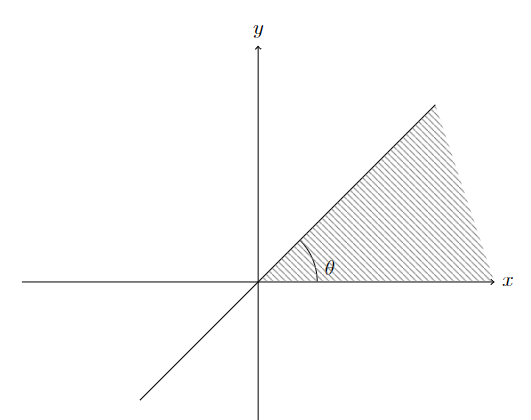
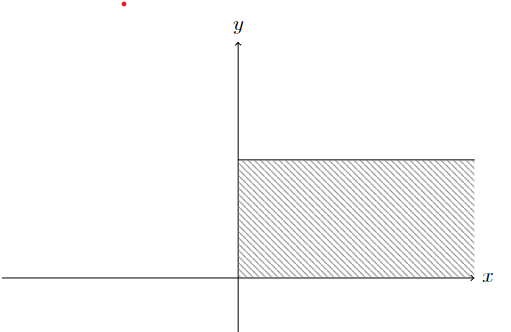
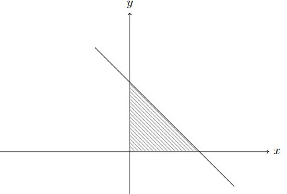
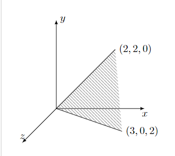
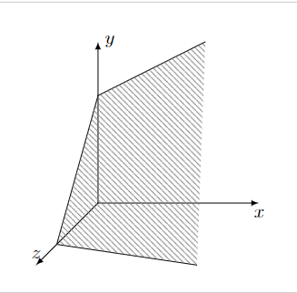
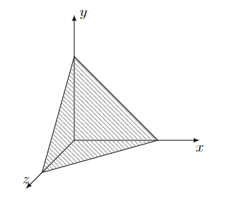
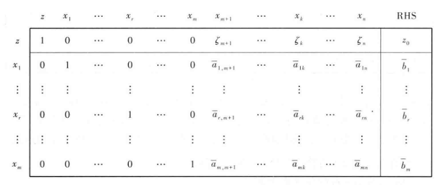
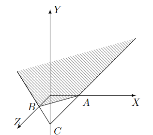

# 线性规划（单纯形法）

- 参考教材：王光辉

## 基本概念

- 目标部分
  - **价值向量 $x$**
  - **价值系数 $c^T$**
- 约束部分
  - **约束方程组**：$\begin{cases} \sum\limits^n_{j=1} a_{ij}x_j = b_i\pad (i=1,...,k) \\ \sum\limits^n_{j=1} a_{ij}x_j \geq b_i\pad (i=k+1,...,m) \end{cases}$
  - **约束矩阵 $A_{m\times n} = (a_{ij})_{m\times n}$**（必须有 $m\leq n$，否则约束方程组无解）
  - **右端向量 $b$**
  - **决策变量** $x$
  - **非负约束**：$x_i \geq 0$
- 解部分
  - **可行域** $D$、**可行解** $x^0$
  - **问题无界**：可行域内目标函数无最值
- 问题形式：
  - **规范形式**：决策变量非负，约束方程组全是大于式
  - **标准形式**：决策变量非负，约束方程组全是等式
  - **一般形式**：上面两种情况均出现
- **松弛变量**

## 图解法

- **图解法**：可行域是多个半平面的交集，是凸多边形，最优解在顶点上
  - **证明**：无字证明
  - **理解**：所有式子都是线性，从而补偿关系是等阶的。约束系数决定其补偿比率，价值系数决定其贡献比率
    - 由于补偿有差距，约束条件下，一定存在一个方向，沿这个方向运动时，补偿关系稳定。而沿这个方向，同时也会使贡献值（适应值）发生变化。否则达到极值点，即稳定点
    - 线即意味着可延伸，即意味着不稳定状态（有点控制论的意思，hh）类似梯度下降法，适应值高的状态会往低的状态坍塌，直至不可变化位置（稳态）
  - **凸集**：若 $\forall x,y\in A，tx + (1-t)y \in A\quad (0\leq t\leq 1)$，则 $A$ 是凸集
    - **理解**：
      - $y=-x$ 时：向量若被压缩后依然在集合内，则封闭
      - $y,x$ 不同向时：因为三角不等式的存在，其一定在 $\max\{x,y\}$ 为半径的圆中
    - **证明**：定义直得
    - **交集封闭性**：凸集的交还是凸集
  - **超平面**：一个 $n$ 阶线性方程的解空间（$n-1$ 维空间）
  - **多面凸集**：多个 $n$ 阶线性方程和线性不等式的解空间
    - **多面体**：非空有界多面凸集
  - **n维单纯形**：$S = \set{\sum\limits^{n+1}_{i=1} \a_iv_i\mid \a_i\geq 0，\sum\limits^{n+1}_{i=1} \a_i = 1}$
    - 实际上就是 $n$ 维的由三角形组成的多面凸集，共有 $n+1$ 个顶点
    - 二维空间中是三角形，三维空间中是四棱锥
  - **顶点**：不位于（两个凸集点的连线）中的凸集点

### 解的性质

- **基矩阵 $B_{m\times m}$**：非自由变量矩阵（rank阵），**非基矩阵** $N_{m\times n}$：$A$ 中剩余部分组成的矩阵
  - **基向量 $A_B$**：非自由变量矩阵中的列向量
  - **非基向量 $A_N$**：自由变量矩阵中的列向量
  - **基变量 $x_B$**：解中（和基向量对应）的分量（非自由变量）
  - **非基变量 $x_N$**：解中其余分量（自由变量，解空间的基）
- **基本解**：自由变量（非基变量）取0的解
  - **基本可行解 $\bar{x}$**：解分量均大于0的基本解
  - **可行基**：基本可行解对应的基向量集合
  - **退化**：基本可行解中存在取0的基变量（此时基向量线性相关，即 $A$ 退化）
- **基本可行解判别准则**：可行解是基本可行解 $\LR$ （解中正分量对应的向量）彼此线性无关
  - **证明**：定义易得
  - **算数理解**：
    - 基本可行解中，只有基变量取正值，非基变量均取0，故基矩阵是置换阵
    - 迭代过程只存在约束方程线性组合，从而线性无关性不变，顺序不改变
  - **几何理解**：
    - 可行域的线性映射意义：
      - 约束方程为 $A_{m\times n}\cdot x_{(n)} = b_{(m)}$，其表示高维向量 $x_{(n)}$ 被 $A$ 降维映射成低维向量 $b_{(m)}$
      - 线性映射 $A$ 不是单射，所以解可形成一个闭集，即解空间（可行域）
        - 设规范逆映射为 $$\tau^{-1}: F^m\to F^n，(b_1,...,b_m) \mapsto (b_1,...,b_m,0,...,0)$$
        - 则解空间为 $Ax_{(n)} = \tau^{-1}(b_{(m)})$ 的全部解，易得解空间等价于 $B^{-1}\cdot b_{(m)}$（B是基矩阵）
        - 可以用投影映射举例，辅助理解
    - 基的线性映射意义：
      - 解空间可用基础解系表示为 $x_基=c_i + kx_{非基}$
        - 基向量是 $\R^m$ 的极大线性无关组
        - 非基变量是解空间的基
      - 极大线性无关组有多个，从而解空间可以选多种基（多个基础解系）
        - 单纯形法的每次迭代中，就是基
  - **本质**：基本化过程类似阶梯消元过程，而线性无关性由极大线性无关组导出
- **顶点性定理**：基本可行解 $\LR$ 可行域（多面凸集）的顶点
  - **充分性**：设 $x$ 是顶点
    - 反设基变量 $\{x_j\}^{m}_{j=1}$ 对应的列向量 $\{A_j\}^m_{j=1}$ 线性相关，则存在非零式系数向量 $y$，从而对 $\forall \l\in\R$ 都有 $\sum\limits^n_{j=1} A_j(x_j\pm \lambda y_j) = b$
    - 易得两个 $\begin{cases} x^{(1)} = x_j + \l y_j \\ x^{(2)} = x_j-\l y_j \end{cases}$ 均为解，由 $\l$ 任意性，可以使两者均为正
    - 再易得 $x = \frac{1}{2}x^{(1)} + \frac{1}{2}x^{(2)}$，其与顶点定义矛盾
  - **必要性**：
    - 反设基本可行解 $x$ 不是顶点，则其可被两端点 $x^1、x^2$ 的凸线性组合表出
    - 由于两者均是解，故 $\sum\limits^m_{j=1} A_j(x^1_j-x^2_j) = 0$
    - 因为两端点不同，所以 $x^1_j-x_j^2 \neq 0$，从而 $\{A_j\}^m_{j=1}$ 线性相关，与基本可行解矛盾
  - **几何理解**
    - 可行域的几何意义：
      - $n-m$ 维空间中 $m$ 条直线围成的图形
      - $n$ 维空间中的 $n-m$ 维子空间
    - 基本可行解的几何意义：
      - 基本可行解是 $\R^n$ 中（解空间和坐标超平面的交点）
        - 坐标轴 $x,y$（一个变量为基）
        - 坐标平面 $xOy、xOz、yOz$（两个变量为基）
        - 坐标超平面（多个变量为基）
        - ……
      - 在迭代中不断切换基，
      - 解空间与几个坐标超平面相交，就有几个顶点
        - 由于变量非负，解空间被坐标超平面切割（只考虑第一卦限内的解空间），从而顶点必定在坐标超平面（坐标轴/正交平面）上
      - **实例**：
        - 二维空间中的一条直线 $c_1x_1 + c_2x_2 \leq b$，其和两坐标轴（两射线 $x_i\geq 0$） 围成一个角形 或 开放矩形 或 闭合三角形
          
        - 添加松弛变量 $x_3$ 后，可化为 $x_3 = b - c_1x_1 - c_2x_2$
          - 解空间是三维空间中的平面。再由变量非负约束，其在三维空间中被三个坐标平面切割，从而是开放角形平面（单顶点） 或 开放四边形平面（2顶点） 或 闭合三角形（3顶点）。顶点在坐标平面上
          
    - 基的顶点意义：
      - 基变量对应极大线性无关组，是解空间中不自由的部分。也就是说，其为解空间的截距（顶点的非零坐标分量）
  - **本质**：$x_i$ 非负，从而解空间被坐标平面切割，其交点就是（解空间在第一卦限内的部分）的顶点
  - **推论**：若想要用约束方程组来完全替代非负性约束（比如平面上，若第一象限内的三条直线围成封闭三角形，则此时不需要考虑与坐标轴的交点），则约束方程组中必须至少有一个大于号约束 $\sum\limits^n_{j=1} a_{ij}x_j \geq b_i$（详见[两阶段法](#两阶段法)）

#### 线性规划基本定理（解的基本化）

- **存在性定理**：标准形式的LP问题，若有可行解，则至少有一个基本可行解
  - **构造性证明（解的基本化）**：
    - 设可行解 $x^0$ 前 $k$ 个元不全为0，则 $\sum\limits^k_{j=1}A_jx_j = 0$ 存在非零系数。设系数向量为 $\delta$，此时 $A\delta = 0$
    - 从而可取 $\lambda$ 使得 $x^0\pm\lambda\delta_j \geqslant 0$，由非零式，它们也是可行解，并且由 $\lambda$ 的任意性，可以使解中某个分量取0
    - 不断重复上述过程，最终可得到基本可行解
  - **推论（基本可行解不唯一性）**：基本可行解数量 = 极大线性无关组数量 = 基的选取方案数量
    - 最多有 $C^m_n$ 个可行解（多面凸集的顶点数也不会超过它）
    - 比如三维空间中的被切割平面，其边界最多为三个坐标平面中的线段，因为两个坐标即可张成一个平面，故两两组合得最多 $C^2_3$ 个顶点
    - 四维空间中的平面，两两组合得最多 $C^2_4$ 个顶点
- **最优解存在定理**：若标准形式LP问题存在有限最优值，则存在一个最优基本可行解
  - **证明**：首先最优值必定有对应的解
    - 若不是基本可行解，则首先进行第一步基本化，将解的某个分量变为0，得到 $x^0\pm\lambda\vec\delta$
    - 这两个解代入目标函数并作差，即得 $c^T\delta = 0$，从而这两个解也是最优解。
    - 逐步进行基本化，每次都是最优解，从而最终得到的基本可行解也是最优的

### 小总结

- 本部分主要用的就是线性相关性
<!-- - 涉及到基本性（线性相关）与可行性（非零）时，用线性相关的非零式构造矛盾即可 -->

## 单纯形法

### 典则化

- **LP问题的典则化**：
  - **典则方程组（典式）**：约束方程组可化为 $x_B + B^{-1}Nx_N = B^{-1}b$ 的形式
    - 第一步，由矩阵乘法的列向量分解，$Ax = Bx_B + Nx_N$
    - 第二步，两边同乘 $B^{-1}$ 即可
  - **典则目标函数**：
    - 将典式代入目标函数，将 $x_B$ 表示为非基变量 $x_N$ 和右端向量 $b$。则分离合并得
    $$z = c_B^TB^{-1}b - \sum\limits^n_{j=m+1} (c^T_B B^{-1}A_j - c_j)x_j$$
    - 设 $\zeta = c^T_B B^{-1}A - c^T$（**当前基本可行解的检验数向量**），易得其前 $m$ 个分量都是0，从而可将其添加到上面式子中，最终将原目标函数化为 $$z = c^T_BB^{-1}b - \zeta^Tx$$
- **算数理解**：
  - 我们之前已经将可行域化为某个基础解系 $\{x_{j}\}^{n-m}_{j=1}$ 表出的解空间
  - 而典则化就是为了将目标函数也化为在该基础解系 $\{x_{j}\}^{n-m}_{j=1}$ 下的表示
  - 可以说是利用约束条件，将数据降维 + 标准化
- **几何理解**：
  - 由于 $z$ 不变，故检验数向量只依赖于基的选取
  - 选定一个基后，若有最优解，则一定在该基截距的某个顶点 $x$ 上取到
  - 此时非基变量 $\{x_j\}^{n-m}_{j=1}$ 均为0
    - 设换基时，某个非基变量 $x_j$ 变成了基变量（由 $0$ 变为正）
    - 由典式可得，此时若 $\zeta_j>0$ ，则换基后 $z$ 变小。也就是说，这次顶点迭代后解更优
    - 检验数向量的作用，就是在该顶点某个邻域上，检测是否有某个方向更优（分量为正）
    - 凸优化中，局部最优就一定是整体最优
    - （检验数向量在非顶点区域上没有这么大的用处，只有在顶点处，非基变量和基变量是 $0$ 和 $1$ 的关系，此时通过简单判断 $\xi$ 分量的符号就能得出是否更优。非顶点区域上还要将 $\xi_i$ 与某个值相比较，更麻烦了）

### 解的几种情况（以最小化问题为例）

- **最优性准则**：若 $\zeta \leqslant \vec{0}$，则该基本可行解 $\bar{x}$ 是最小解
  - **证明**：由 $\bar{x} = c^T\bar{b}$（N上的分量为0，只算 $x_B$ 即可），得 $z > \bar{z}$，从而最小
  - **理解**：换基时，非基变量增大（由0变为正），但此时非基变量的系数（检验数向量）均为负，故切换任意顶点，$z$ 都只增不减，从而没有更优值
  - **本质**：局部最优
- **无界性准则**：若 $\exist\zeta_k > 0$，$B^{-1}A_k \leqslant \vec{0}$，则该最小问题无界
  - 此时 $k$ 对应非基变量
  - **证明**：
    - 设 $d=  \begin{pmatrix} -B^{-1}A_k \\ \vec{0} \end{pmatrix} + \vec{e_k}$，易得 $Ad = 0$
    - 从而 $\forall \t\in\R，\bar{x} + \theta d$ 为可行解。代入目标函数值得 $z = c^T\bar{x}-\theta\zeta_k$。由 $\t$ 任意性，$z$ 无下界
  - **理解**：找到对约束条件无影响，但对目标函数值有影响的解 $d$，此时其系数 $\theta$ 就是完全自由的，可以取无穷值，从而目标函数无界
  - **本质**：还是利用了非零式
- **迭代性准则**：若 $\exist\zeta_k > 0$，所有 $B^{-1}A_k$ 中至少有一个正分量，则可以找到新的更优可行解，即 $c^T\hat x < c^T\bar{x}$
  - **构造性证明**：依然使用之前的 $d$，新解为 $\hat x = \bar{x} + \theta d = \begin{pmatrix} \bar{b} - \theta\overline{A_k} \\ \vec{0} \end{pmatrix} + \theta\vec{e_k}$
    - **可行化**：为使新解满足非负约束 $\bar{b}-\theta\overline{A_k} \geqslant \vec{0}$，令 $$\theta = \min\left\{\frac{\bar{b_i}}{\bar{a}_{ik}}\mid \normalsize\bar{a}_{ik} >0，i = 1,...,m\right\}$$
      - 设最小元的行序号为 $r$（即基变量在基中的序号），则 $\theta = \Large\frac{\bar{b}_r}{\bar{a}_{rk}}$
      - 此时 $\hat x_r = 0$ 成为非基变量，$\hat x_k\neq 0$ 成为新基变量
    - **基本化**：证明 $m$ 个基向量（其中 $A_r$ 被换为 $A_k$）无关即可
      - 反设相关，则因为迭代只改变了 $A_k$，故只能是 $A_k$ 破坏无关性，从而 $A_k$ 可被其它基向量表出。设表出式系数向量为 $\gamma$
      - 再由题设，$B^{-1}A_k$ 至少有一个正分量，可将 $A_k=B\overline{A_k}$ 转为非零式（$B$ 充当向量，$\overline{A_k}$ 充当系数），从而前 $m$ 个列向量线性无关，矛盾
    - **更优性**：取 $\theta>0$ 即更优
  - **换基（迭代）**：$A_r$ 退出基向量集，$A_k$ 进入基向量集
  - **相邻基**：换基前后的两个基
    - **几何意义**：这两个基本可行解对应相邻的两个顶点（因为迭代只能沿着边界迭代。详见[后面的详解]()）
  - **未解问题**：若同时出现多个 $\theta$ 可行值，如何选取

### 单纯形表

#### 原始解法

- **单纯形表原始解法**：
  1. 寻找初始可行基，并得到 $B$
     - 这个需要自己去找
  2. 求出典式和检验数向量
     - 由典式等价性，用初等行变换使基B对应的列为 $e_j$ 即可
       - 因为非基变量在目标函数中取0，所以右端变量为 $\bar{b}_B = x_B$
     - 得到基列 $\overline{A_j} = e_j$，非基列 $\overline{A_k} = B^{-1}A_k$
     - 得到检验数向量 $\zeta = c^T_B\bar{A} - c^T$
  3. 最优判断，若 $\zeta < 0$，则已有最小解。否则得到正分量序号 $k$，进行下一步
  4. 无界判断，若 $\overline{A_k} \leqslant \vec{0}$，则原问题无界，否则下一步
  5. 求 $\theta>0$，得到 $r$
  6. 重新进行初等行变换，得到新典式（变换方法其实是固定的，称为**旋转变换**）
     - $\hat a_{rj} = \Large\frac{\bar{a}_{rj}}{\bar{a}_{rk}}$
     - $\hat a_{ij} = \bar{a}_{ij} - \bar{a}_{ik}\hat{a}_{rj}（i\neq r）$
     - **原理**：
       - 我们已知变换后的 $A$ 中，第 $k$ 列成为新基变量，即 $A_k$ 线性组合后变为 $e_k$
       - 再因为算法中只有初等行变换（行向量的线性组合），故我们由 $A_k$ 的变化即可得到所有线性组合的系数，从而可以求出所有的行变换
  7. 换基，回到2
- **单纯形表（课本版）**
  
  - **$z$ 行（检验数行）**
    - $z$ 是目标函数中系数向量（典则化后为检验数向量）
    - 最右边 $z_0$ 是当前最优值
  - RHS是右端向量 $b$（典则化后为当前解）
  - 最上行是检验数向量 $\zeta$，其中 $z+\zeta^Tx = z_0 = c^T\bar{b}$
  - 行是基变量，列是所有变量

#### 快速解法

- 首先写初始检验数向量 $\zeta = c^T$，初始适应值 $0$
- 然后确定转轴元
- 然后直接利用单纯形迭代的线性组合本质
  - 将转轴行除以转轴元
  - 用转轴元将转轴列的其它系数减为0，得出其它行减去转轴行的系数
  - 用转轴元将转轴列的检验数减为0，即可得出检验数行减去转轴行的系数
- 然后不断迭代，直至得到最终结果

### 总的理解

- **典则化本质**：将适应值用非基变量表示，系数为检验数向量
- **最优本质**：用检验数向量、非基变量的正负号，判断是否达到局部最优
  - 由于凸优化中，只有一个局部最优，其也为全局最优
- **无界本质**：
  - 几何意义：首先典则化（线性变换），类似主成分分析法，找到目标函数的主成分维度，降维成仅有常数和非基变量
    - $\zeta>0$ 时，非基变量为负贡献变量
    - 存在 $A_k$ 为负时，出现补偿关系
    - **补偿关系**：为了保持 $Ax$ 的结果 $b$ 不变，必定存在某个符号为正（$B^{-1}A_m\geqslant 0$）的维度 $m$ 与 符号为负的维度 $k$ 构成补偿关系，若 $k$ 增大，$m$ 必然增大（当然，不一定只有两个维度，$k$ 或 $m$ 都可能不止1个）
      - 也就是说，$m$ 依赖于 $k$，从而是非自由的，其必为基变量
      - $d$ 就是达到补偿平衡的方向向量
      - 此时可行域在 $d$ 方向上延伸到无穷远
      <!-- （错的）- $x_k$ 和 $x_m$ 都是非基变量（由于规定非基变量均取0，即 $\bar{b} = x_B$，所以它们对约束无影响，可以随便取。但基变量不能充当补偿维度，否则不满足约束条件。或者说，基变量不是自由变量，所以不能随便取） -->
    - 典则化后，在 $d$ 方向上延伸时，只有维度 $k$ 对于目标函数有贡献（典则化的目标函数中无基变量 $x_m$），故无限延伸后 $z$ 变为无穷
      - （$d$ 具有唯一性，一步步设计应该就能出来）
- **迭代本质**：$d$ 方向上不能无限延伸，必须满足可行性，即 $\theta = min...$，从而应当一步步设计新的 $d$ 并延伸
  - 因为每次都延伸到可行域边界为止，从而不可能位于两点连线中间，即每次迭代的结果均为顶点（基本可行解）

#### 小问题

- 单纯形表迭代后是否一定要将约束矩阵重新排序
  - 答：不需要，因为 $B^{-1}$ 是置换阵，本身起到了排序的效果
- 公式法（原始解法）和线性组合法（快速解法）：
  - 公式法就是用公式求检验数向量
  - 线性组合法是，用第 $r$ 行去和检验数行组合，使得基变量的检验数变为0，此时的检验数向量就是迭代后的检验数向量
  - **证明**：典则化后的系数向量：$(0,\zeta) = (c_B^TB^{-1}B - c_B^T，c_B^TB^{-1}A-c_N^T)$
    - 前一项等于第 $r$ 行 $(I，\overline{A})$，后一项等于 $c^T$
    - 从而 $(0,\zeta) = (I,\overline{A}) - c^T$，前者是第 $r$ 行，后者是检验数行

## 初始基本可行解的求法

### 将大于号约束转化为等号

- **两阶段法**
  - 第一阶段：查看有无可行解，并给出基本可行解
  - 第二阶段：利用初始解单纯形迭代
  - **应用情况**：直接对基变量取 $b_i$、非基变量取 $0$ 的方法只适用于小于号约束的情况
    - 若出现大于号，则松弛变量（初始基变量）系数为负（$\sum\limits^n_{j=1}x_j - x_{n+1} = b_i$）
    - 此时若取 $x_{n+1} = -b_i$，则不满足非负约束（$b\geq 0$、$x_i\geq 0$），必须用其它方法
- **一次松弛变量**：设某个大于号约束条件为 $x_1+...+x_6 \geq b_m$
  - 化为标准形式：$x_1+...+x_6-x_7 = b_m$
  - 用于化为标准形式的松弛变量 $x_7$ 称为一次松弛变量
- **二次松弛变量（人工变量 ）**：大于号约束条件中，一次松弛变量 $x_7$ 的系数为 $-1$，不可直接得初始基本可行解，需要添加一个系数为1的新松弛变量 $x_8$
  - 原约束式化为 $x_1+...+x_6-x_7+x_8 = b_m$
  - $x_8$ 称为二次松弛变量（人工变量）
  - **人工变量的数量** $p =$ 大于号约束式的数量
- **辅助问题**：$\begin{cases} \min g = \sum\limits^{n+p}_{i=n+1} x_i \\ Ax + x_\alpha = b \\ x\geq 0,\quad x_\alpha \geq 0\end{cases}$
  - 求人工变量的最小值
  - 其存在平凡的基本可行解 $x=0,x_\alpha = b$
    - 此时已经是典式，知道基后计算检验数向量、最优值即可
  - 最优值结果分类：
    1. 最优值不为0（原问题无可行解）（人工变量不能均取0）
       <!-- （也可直接解非线性齐次方程组得到该结果，但没啥用） -->
    2. 最优值为0，且人工变量均为非基变量（此即为初始基本可行解）（一次松弛变量不可能为基，详见末尾推论）
    3. 最优值为0，存在人工变量是基变量
       - 此时不符合题意，设 $x_8$ 是人工变量
         - 原约束：$\sum x_i \geq b_i \LR \sum x_i + x_7 + x_8 = b_i$
         - 若 $x_8$ 为基，则 $x_8>0$。再由 $x_7$ 一定非基，得 $\sum x_i < b_i$，与原约束矛盾
       - 解决方法：设此时第 $r$ 个基变量是人工变量
         - 若表第 $r$ 行的前 $n$ 列中存在 $\bar{a}_{rs}\neq 0$（也就是说，$x_s$ 是非基变量）
           - 则以 $\bar{a}_{rs}$ 为转轴元进行旋转变换。因为 $\bar{b}_r$ 为0，所以变换不影响右端向量 $b$（原问题的解），但将人工变量 $x_r$ 出基，将非人工变量 $x_s$ 入基
         - 若表第 $r$ 行的前 $n$ 列全为0
           - 则原矩阵 $A$ 退化，删去第 $r$ 行即可
- **几何理解**：
  - 得初始解的过程，本质是将基矩阵化为每列只有一个元为1，其余均为0的矩阵 $(e_j)^m_{1\leq j\leq n}$（**解空间解析式**） 的过程
  - 一开始由于没有解空间解析式，故得不到其与坐标超平面的交点（初始基本可行解），无法开始迭代
  - 解决方法是，在解空间中添加 $p$ 个新的维度（进行逆投影）
  - 由于逆投影的像充满新的维度，从而可直接取到新可行域的坐标超平面交点
    - 代数意义为：新加入人工变量，其对应的列向量为 $e_j$。从而此时 $\ol A$ 中存在 $(e_j)^m$ 子矩阵，将其取为基矩阵即可
  - 开始迭代过程，直到某个坐标超平面交点上，解的新维度分量均取0（人工变量均为非基变量），此时可进行投影降维（易得当前顶点的低维投影也是原可行域的坐标超平面交点）
  - 掉到低维投影（初始基本可行解）后，继续迭代即可
- **推论**
  - **归一性**
    - 在单纯性迭代中，只要确定了约束条件（即确定可行域），则所有可解的目标函数最优值均可在顶点上找到（迭代过程唯一，每个中间适应值都是某些目标函数的最优解）
    - 所以多个相同可行域的约束问题（比如原问题 $z$ 和辅助问题 $g$），用一个单纯形表即可全部解决
    - 而在人工变量为非基变量（当前解中的 $x_8 = 0$）时将其删除并继续迭代，相当于其对应维度的坐标被定死在 $0$，贡献值始终为0，从而不会对 $z$ 的最优值产生影响
  - **不可为基的变量**
    - 大于号约束式中，一次松弛变量 $x_{n+1}$ 在每个迭代环节中都不可能为基
    - **证明**：
      - $\sum\limits^n_{j=1}a_{ij}x_j \geq b_i$ 中添加两个松弛变量 $x_{n+1},x_{n+2}$
        - 求出解空间 $x_{n-1} = -b_i + \sum\limits^n_{j=1} a_{ij}x_j + x_{n+2}$
      - 若在某个顶点上，$x_{n+1}$ 为基变量，则解空间在该顶点的第 $n+1$ 分量上截距为 $-b_i$，即 $x_{n+1} = -b_i < 0$，不满足非负约束条件
        - 因此，可行域实际被非负约束条件切割为几个 $x_{n+1} = 0$ 的顶点
        - 也就是说，$x_{n+1}$ 若想要变成基变量，则它实际上会被非负约束退化为非基变量
      - 如下图，解空间是角形平面 $\angle BCA$
        - 若 $x_k$ 是基变量，则顶点为C，违反非负约束
        - 解空间实际上被切掉了三角形ABC区域，原顶点C被切割后的顶点A和顶点B取代
    

### 循环问题

- 若出现退化的基本可行解，则可能会迭代回到原来的基本可行解