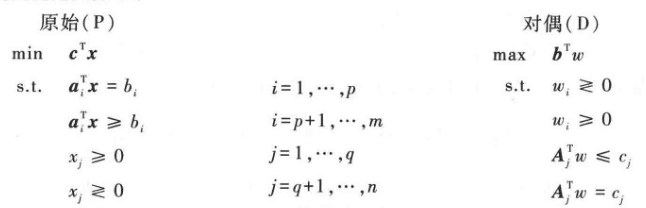
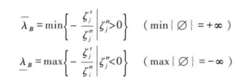
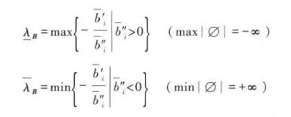

# 线性规划

## 对偶性

- **经济学解释**：考虑一个买资源卖产品得最大收益的问题
- **卖产品**：已有某些资源，考虑如何生产产品
  - **原问题** $\max z = c_1x_1 + c_2x_2 + c_3 x_3$
    - $z$ 视为卖产品的总收入
    - $x_j$ 视为三种产品的数量
    - $c_i$ 视为三种产品的零售价格
    - **意义**：卖三种产品的总收入尽可能大
  - **原约束** $\sum\limits^n_{j=1}a_{ij}x_j \leq b_i \quad (i=1,...,m)$
    - $a_{ij}$ 视为制造产品的资源 $i$ 在产品 $j$ 上的平均消耗量
    - $b_i$ 视为资源 $i$ 的现有量
    - $x_j$ 视为产品 $j$ 的数量
    - **意义**：买资源 $i$ 的投入不能大于 $b_i$
- **买资源**：已有各个产品售卖收入的指标，考虑如何购买资源
  - **对偶问题** $\min z = b_1w_1 + b_2w_2 + b_3w_3$
    - $z$ 视为买资源的总成本
    - $w_i$ 视为三种资源的购买价格
    - $b_i$ 视为三种资源的需要数量
    - **意义**：买资源的总成本尽可能小
  - **对偶约束** $\sum\limits^m_{i=1} a_{ji}w_i \geq c_j \quad (j = 1,...,n)$
    - $a_{ji}$ 视为制造产品的资源 $i$ 在产品 $j$ 上的平均消耗量
    - $c_i$ 视为售卖 $i$ 产品获得的收入
    - $w_i$ 视为产品 $i$ 的零售价
    - **意义**：卖产品 $j$ 的收入不能少于 $c_j$
- **约束对应关系**：人为规定某个约束后，对偶的相应约束要伴随它变化
  - 原问题约束 $\leq b_i\LR$ 对偶变量 $w_i\geq 0$
    - 左：资源 $i$ 数量应当小于某个值（买资源 $i$ 是负收益）
    - 右：资源购买价格为正
    - 反向同理
  - 原问题约束 $= b_i\LR$ 对偶变量 $w_i$ 无符号约束
    - 左：资源投入要等于某个值
    - 等于号在经济意义上解释不清，还是后面的数学意义比较好
    - 右：资源购买价格可正可负
  - $x_j\geq 0 \LR$ 对偶约束 $\geq c_j$
    - 左：产品数量要多（卖产品 $j$ 是正收益）
    - 右：售卖收入要多
  - $x_j无符号 \LR $ 对偶约束 $=c_j$
    - 左：产品数量无要求
    - 右：售卖收入要确定在某个值
- **均衡定理**：
  - 目标是收益最大
  - 定成本增收入（原问题最优）和定收入压成本（对偶问题最优）

### 对偶线性规划

 

- 原始问题标准化：
  - 扩充后的变量 $\hat x = (x_1,...,x_q\mid x^+_{q+1},x^-_{q+1},...,x^+_n,x^-_n\mid x^1_s,...,x^s_{m-p})^T$
  - 扩充后的价值向量 $\hat c = (c_1,...,c_q\mid c_{q+1},-c_{q+1},...,c_n,-c_n,\mid 0,...,0)^T$
  - 扩充后的约束矩阵 $\hat A = \{A_1,...,A_q\mid A_{q+1},-A_{q+1},...,A_n,-A_n\mid \frac{O}{-I}\}$
- **对偶问题**：
  - 设 $w^T = \hat c^T_{\hat B}\hat B^{-1}$
    - ***算数意义***：典则化下，（非零变量）基变量的系数
      - 每次换基，$w^T$ 都会在 $\hat c^T$ 中重新选取值
    - ***几何意义***：
  - 目标函数 $\min\ z = w^Tb - \sum\limits^n_{j=m+1} (w^TA_j - c_j)x_j$
  - 已知最优解情况为 $\zeta \leqslant 0$
    - 等价于 $A^Tw = (w^TA)^T = (\hat{c}^T_B B^{-1} A)^T \leqslant c^T$
    - 将其化为约束条件，
- **约束对应关系**
  - **证明**：
    - 首先由 $c^Tx = w^Tb$，得对偶约束和原约束形式上的对应（在原约束上添项配凑并消去），从而得到四个式子
    - 再看序号对应
      - 单向关系一定和单向关系对应，从而关系二分对应
      - $w$ 共有m个，从而二分内部对应（√）
  - **理解**
    - 相对应的对偶变量 $\hat w = (w_1,...,w_q\mid w_{q+1},w_{q+1},...w_{},w_{}\mid w^1_{t},...,w^t_{q })$

### 对偶理论

- **相等定理**：存在最优解的LP问题，其存在对偶问题，且最优解相等
  - **证明**：
    - **对偶确界不等式（弱对偶性）** $\ c^Tx \geqslant w^TAx \geqslant w^Tb$
      - 约束方程累加 + 添项 $w^T$，得 $w^TAx \geqslant w^Tb$
      - 最优解 + 添项 $x$，得 $c^Tx \geqslant w^TAx$
    - $w^Tb$ 为对偶目标函数，$c^Tx$ 为原始目标函数。再因为它们是彼此的确界，且同时存在，所以此时（$w^T = \hat c^T_{\hat B}\hat {B}^{-1}$ 时）两者都达到最优
  - **本质**：均衡定理的数学解释
- **最优推论**：$x,w$ 是最优解 $\Leftrightarrow c^Tx = w^Tb$
- **对称性定理**：对偶问题的对偶为原始问题
- **组合定理**：原始问题和对偶问题仅有以下情况
  - 都有最优解
  - 都无可行解
  - 一个无界，一个无可行解
  - **证明**：
    - 若一个无界，则由弱对偶性，另一个无可行解
    - 若一个有
  - **理解**：对偶问题无非是对现实关系的描述。它当然可以有代数意义和几何意义，但是也都是为现实意义所服务的。本身的结构没什么讨论的价值，实际上类似的结构还可以构造很多。这就是应用数学的特点。
- **互补松紧性**：$x,w$ 是最优解 $\Leftrightarrow \begin{cases} u_i = w_i(a^T_ix - b_i) = 0\quad (\forall i=1,...,m) \\ v_j = (c_j-w^TA_j)x_j = 0 \quad (\forall j = 1,...,n)\end{cases}$ 
  - **证明**：
    - 消去中间项得 $\sum u_i + \sum v_j = c^Tx - b^Tw$
    - 再因为u和v的非负性，$u+v = 0 \LR c^Tx = b^Tw$
  - **代数理解**：
    - **必要性（没用）**：最优解即为基本可行解，非基变量为0，括号外为0，等式当然成立。基变量为 $b_i$，对应向量为 $(e_j)$，括号内为0，等式当然也成立
    - **充分性（核心）**：只有 $x_j$ 是基变量的时候，$A_j$ 才是基向量，从而另一式括号内才同时等于0
      - 其它情况下硬凑，最多只能成立一个等式，不可能同时成立两个等式
  - **互补性理解**：
    - 一个约束强，另一个约束就弱
    - 当它们达到平衡（u、v均不为正值），即为最优解
  - **应用**：已知原问题的解，可立刻得到其对偶的解

### 对偶单纯形法

- **原始算法**：保持原始问题可行解，以检验数为最优判定标准，即向对偶可行解迭代
- **对偶单纯形法**：保持对偶问题可行解，以右端向量为最优判定标准，即向原始可行解迭代

#### 原始解法

1. 初始单纯形表：原始问题基本解 + 对偶问题可行解
2. 求 $\bar{b}_r = \min\{\overline{b}_i\mid i = 1,...,m\}$，得到出基变量 $r$
   - 相当于 $\zeta_k > 0$ 中最大的那个元
3. 判断，若右端向量 $b\geq  0$，停止，否则进入下一步
   - 相当于检验数向量的最优判断
4. 判断，若 $\bar{a}_{rj} \geqslant 0\quad (j=1,...,n)$，则原始问题无可行解，停止，否则进入下一步
   - 相当于无界情况 $\forall\overline{A}_k \leqslant 0$
5. 求 $\large\frac{\zeta_k}{\bar{a}_{rk}} = \normalsize\min\{\large\frac{\zeta_i}{\overline{a}_{rj}} \normalsize\mid \overline{a}_{rj} < 0\}$，得到入基变量 $k$
   - 保证对偶可行性，相当于 $\zeta_j-\frac{\overline{a}_{rj}}{\overline{a}_{rk}} \geqslant 0$ 
6. 进行旋转变换
   - 转轴元为 $\bar{a}_{rk}<0$。这里的 $r$ 还是行，$k$ 还是列，但先后顺序与地位都交换了

#### 快速解法

- 除了判断方法以外，其余均不变

## 灵敏度分析   

- 改变其中的值，观察最优值的变动程度

### 改变 $c^T$

- 可行域不变，约束部分均不变
- 检验数向量变化，中间适应值变化
- **只有单个元变化时，单纯形表最优性的变化**
  - 变化的 $x_k$ 是非基变量
    - 只有 $\zeta_k$ 变化，$\zeta_k' = \zeta_k +c_k- c_k'$
  - 变化的 $x_k$ 是基变量
    - 非基变量 $\zeta_N$ 均变化，$\zeta_N' = \zeta_N +(c_k- c_k')(B^{-1}N)$

### 改变 $b$

- 可行域变化，$\bar{b}$ 变化，中间适应值 $z_0'$ 变化
- 检验数向量不变，
- **只有单个元变化时，单纯形表最优性的变化**
  - 变化的 $b_s$
    - $\bar{b}' = \bar{b} + (b_s' - b_s)B^{-1}_s$

## 参数线性规划

### PCP问题

- PCP：目标函数是参数线性函数
  - $\min\ z(\lambda) = (C' + \lambda C'')^Tx$
- **分类讨论法**：
  1. 先任意取 $\lambda_0$ 并求最优解
     - 若问题无界，则存在检验数分量 $\zeta_k'+\lambda_0\zeta_k'' > 0$ 且 $A_k\leqslant 0$
       - 若 $\zeta_k'' = 0$，则 $R$ 上无界
       - 若 $\zeta_k''\neq 0$，则令 $\lambda_1 = -\large\frac{\zeta_k'}{\zeta_k''}\normalsize $，继续求解
  2. 求最优解保持区间 $[\lambda_1,\lambda_2]$
     - 检验数向量 $\zeta\leqslant 0$
     - 等价于 $(C_B'+\lambda_0 C_B'')^TB^{-1}A - (C'+\lambda_0 C'')^T \leqslant 0$
        
     - 即线性组合 $\zeta'^T + \lambda_0\zeta''^T \leqslant 0$
        
     - **特征区间**：不等式的解 $[\underline{\lambda_B},\overline{\lambda}_B]\\ $
      
  3. 在区间外，$\lambda$ 取值被限制
     - 重复上述过程，直至取完 $R$

- **小技巧**：
  - 若 $C'$ 中 $\zeta'$ 已经是负向量，则直接算使 $\zeta''$ 为负向量的 $\lambda$ 区间，其即为最优区间

### PRP问题（PCP的对偶问题）

- $Ax = b'+\lambda b''$
- **分类讨论法**
  1. 先任意取 $\lambda_0$ 并求最优解
  2. 由于 $\zeta$ 与右端向量无关，所以只需 $b' + \lambda b''\geqslant 0$ 即可保持最优性
  3. 特征区间 $[\underline{\lambda_B},\overline{\lambda}_B]\\$ 
  4. 区间外，使用对偶单纯形法迭代