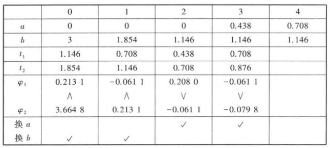

# 非线性规划

## 

- **实例**
  - 曲线拟合最优问题
  - 构建容积问题
- **数学规划(MP)**：$\begin{cases} \min f(x) & x\in \R^n  \\ \text{s.t.} & g_i(x) \leq 0，i=1,...,p \\ &  h_j(x) = 0，j = 1,...,q  \end{cases}$ 
  - **可行域 $X$**
  - **局部最优解**：$x^*\in X$，且存在 $\exists N_\d(x^*) = \{x\in\R^n: \|x-x^*\|<\d\}$，使得 $\forall x\in N_\d(x^*)\cap X，f(x^*) \leq f(x)$

## 一维搜索方法

- **一维搜索问题**：目标函数为单变量的非线性规划问题 $\min\limits_{0\leq t} \p(t)$
  - **有效一维搜索问题**：$\min\limits_{0\leq t\leq t_{\max}} \p(t)$
- **搜索区间**：迭代过程中不断缩小，最终收敛到最小值点的区间
- **探索点 $t_k$**：每次迭代时进行讨论的点
- **最后区间精度 $\e$**：当搜索区间大小 $\leq\e$ 时，停止迭代

### 黄金分割法（单谷函数）

- **单谷区间**：区间 $[a,b]$ 中存在 $t^*$，使得 $\p$ 在 $[a,t^*]$ 单增，$[t^*,b]$ 单减
- **单谷函数**：定义域是单谷区间的函数
- **搜索区间**：给出 $[a,b]\subset [0,t_{\max}]$，使得 $t^*\in [a,b]$
- **思路**：
  - 我们希望找到一个单谷区间，这样最优值就在单谷区间的端点上（这个得自己找）
  - 至于哪个区间刚好满足需要的精度，就得通过具体迭代得到。一个朴素的想法是找固定的比例来缩小区间，经过证明可以发现，$w = 0.618$ 是最好的比例
- **步骤**：
  - 确定单谷区间，给定最后区间精度
  - 计算最初探索点 $t_1,t_2$ 和其函数值 $\p_1 = \p(t_1)，\p_2 = \p(t_2)$
    - 若 $\p_1 \leq \p_2$
      - 若 $t_2-a\leq \e$，则停止迭代，输出 $t_1$
      - 若不是，则取 $\begin{cases} b = t_2 \\ t_2 =t_1 \\ t_1 = b-0.618(b-a) \\ \p_2 = \p_1 \end{cases}$，再取 $\p_1 = \p(t_1)$ 重新比较
    - 若 $\p_1 < \p_2$
      - 若 $b-t_1\leq \e$，则停止迭代，输出 $t_2$
      - 若不是，则取 $\begin{cases} a = t_1 \\ t_1 =t_2 \\ t_2 = a+0.618(b-a) \\ \p_1 = \p_2 \end{cases}$，再取 $\p_2 = \p(t_2)$ 重新比较

  

### 牛顿法（二阶可微函数）

- 在数分中已有涉及
- **思路**：用探索点处的二阶Taylor展开式代替原函数，用其最小点作为新的探索点
- **步骤**：
  - 给定初始点 $t_1$，最后区间精度 $\e$
  - 若 $|\p'(t_k)| < \e$，停止迭代，输出 $t_k$
  - 若 $\p''(t_k) = 0$，停止迭代，求解失败
  - 若 $|\p''(t_k)| \geq \e$，计算 $t_{k+1} = t_k - \dfrac{\p'(t)_k}{\p''(t)_k}$
    - 若 $|t_{k+1}-t_k| < \e$，停止迭代，输出 $t_{k+1}$，否则重新进行比较

## 无约束最优化方法

- 

## 约束最优化方法

### 约束最优条件

- **积极约束**：对某点 $x^*$，若 $g_i(x^*) = 0$，则 $g_i$ 称为 $x^*$ 的积极约束
  - **积极约束下标集 $I(x^*)$**
- **Kuhn-Tucker条件（约束规范条件）**：
  - 设在 $x^*$ 处
    - $\begin{cases} f:\R^n\to \R \\ g_i:\R^n\to \R\pad (i\in I(x^*)) \\ h_j\pad (j\in J)\end{cases}$ 连续可微（目标函数、积极约束、等号约束）
    - $g_i\pad (i\in I\j I(x^*))$ 连续（非积极约束）
    - $\nabla g_i(x^*)\pad (i\in I(x^*))，\nabla h_i(x^*)\pad (j\in J)$ 线性无关
  - 若 $x^*$ 是局部最优解
  - 则存在 $\{\l_i^*\mid i\in I(x^*)\}$ 和 $\{\mu_j\mid j\in J\}$ 满足K-T条件 $$\begin{cases} \nabla f(x^*) + \sum\limits_{i\in I(x^*)} \l_i^*\nabla g_i(x^*) + \sum\limits_{j\in J} \mu_j^*\nabla h_j(x^*) =0 \\\\ \l_i^* \geq 0，i\in I(x^*) \end{cases}$$
- **锥**：对于积极约束集合 $\{\nabla g_i(x^*) \mid i\in I(x^*)\}$，其张成的非负包为 $$C = \set{y\in \R^n \mid y\in \sum\limits_{i\in I(x^*)} \a_i^*\nabla g_i(x^*)，\a_i\geq 0，i\in I(x^*)}$$
  - **规划意义**：K-T条件就是 $-\nabla f(x^*)\in C$

#### 条件简化

- **互补松紧条件**：若全部 $g_i$ 强化为连续可微，则 $\forall i\in I，\l_i g_i(x^*) = 0$
- **Lagrange函数**：$L(x,\l,\mu) = f(x) + \sum\limits^p_{i=1} \l_i g_i(x) + \sum\limits^q_{j=1} \mu_j h_j(x)$
  - **Lagrange乘子**：系数向量 $\l,\mu$
  - **K-T简写法**：$$\begin{cases} \nabla_x L(x^*,\l^*,\mu^*) = 0 \\\\ \l_i^* g_i(x^*) = 0 & i = 1,...,p  \\\\ \l_i^* \geq 0 & i = 1,...,p \end{cases}$$
- **凸最优性**：设 $f,g_i,h_j$ 在 $x^*$ 处均连续可微
  - 若满足K-T条件，且 $f，g_i(i\in I(x^*))$ 是凸函数，$h_j$ 是线性函数
  - 则 $x^*$ 是整体最优解
- **证明**：